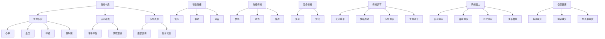

                 

# 如何进行情绪管理：如何控制自己的情绪和行为？

## 关键词
- 情绪管理
- 情绪控制
- 情绪心理学
- 情绪认知
- 应对策略

## 摘要
本文旨在探讨情绪管理这一重要领域，尤其是如何通过科学的方法控制自己的情绪和行为。通过分析情绪的本质、识别常见的情绪问题以及介绍有效的情绪管理策略，本文为读者提供了一套完整的情绪管理指南。本文将帮助读者理解情绪的根源，掌握调节情绪的技巧，从而提升个人情绪智力，实现更好的生活和工作表现。

### 1. 背景介绍

情绪管理，简单来说，就是识别、理解并调节自己的情绪，以便更好地应对生活中的各种挑战。情绪管理不仅对个人的心理健康至关重要，也对人际关系和社会功能产生深远影响。情绪不稳定或无法有效管理的人，往往在职场、家庭和社交场合中面临诸多困难。

情绪管理的重要性体现在多个方面。首先，有效的情绪管理有助于提高个人的情绪智力（Emotional Intelligence, EI），这是一种关键的软技能，包括自我意识、自我调节、社交意识和关系管理。其次，良好的情绪管理能力有助于减轻压力，提高生活质量，并促进身心健康。最后，情绪管理还是一种自我提升的手段，通过不断练习和反思，人们可以逐渐增强情绪调节能力，从而更好地适应变化和挑战。

情绪管理的核心在于控制情绪和行为，使其更加适应实际情境。这不仅仅是为了避免情绪失控，更是为了实现情绪与行为之间的协调一致性。例如，在职场中，一个能够有效管理情绪的员工能够更好地处理冲突、保持冷静，从而提高工作效率和团队协作能力。在家庭生活中，良好的情绪管理有助于维护和谐的关系，减少争吵和误解。

### 2. 核心概念与联系

#### 情绪的本质

情绪是人类心理活动的一个重要组成部分，通常与生理反应和主观体验紧密相关。情绪的本质可以从多个角度进行理解：

- **生理角度**：情绪是由大脑和神经系统调节的一系列生理反应，包括心率、血压、呼吸和荷尔蒙水平等。
- **认知角度**：情绪是基于对刺激的认知评估而产生的，即个体如何解释和评价所经历的事件或情境。
- **行为角度**：情绪不仅体现在内部体验上，还通过行为表现出来，如面部表情、肢体动作等。

#### 情绪的类型

情绪可以分为多种类型，其中最常见的包括：

- **积极情绪**：如快乐、满足、兴奋等，通常与积极的生活经验和情境相关。
- **消极情绪**：如愤怒、悲伤、焦虑等，通常与压力、挫折和负面事件相关。
- **混合情绪**：某些情况下，情绪可以是复杂和混合的，如同时感到愤怒和失望。

#### 情绪的调节

情绪的调节指的是个体如何控制和调整自己的情绪体验。常见的情绪调节方法包括：

- **认知重评**：通过改变对事件的认知评价来调节情绪。
- **情绪表达**：通过表达情绪来释放压力，如倾诉、书写等。
- **行为调节**：通过改变行为来调节情绪，如锻炼、冥想等。
- **生理调节**：通过调整生理反应来调节情绪，如深呼吸、放松练习等。

#### 情绪智力

情绪智力是一个综合性的概念，包括以下四个主要方面：

- **自我意识**：识别和理解自己的情绪。
- **自我调节**：管理和调节自己的情绪。
- **社交意识**：识别和理解他人的情绪。
- **关系管理**：建立和维护积极的人际关系。

情绪智力在个人和职业成功中扮演着关键角色。高情绪智力的人通常能够更好地应对压力、处理冲突、建立和维持健康的人际关系。

#### 情绪管理与心理健康的联系

情绪管理不仅有助于个人情绪智力的提升，还对心理健康有重要影响。良好的情绪管理可以减少焦虑、抑郁和其他心理问题的发生，提高生活满意度。相反，情绪管理不当可能导致心理压力积累，进而引发各种心理健康问题。

### 2.1 Mermaid 流程图

以下是情绪管理核心概念的 Mermaid 流程图：



### 3. 核心算法原理 & 具体操作步骤

情绪管理的核心在于识别、理解和调节情绪。以下是一种常用的情绪管理方法，包括具体操作步骤：

#### 3.1 识别情绪

1. **自我观察**：定期花时间反思自己的情绪状态，了解自己在不同情境下的情绪反应。
2. **记录情绪日记**：记录每天的情绪变化，包括情绪的类型、时间、地点和触发事件。
3. **使用情绪识别工具**：如情绪量表、情绪测试等，帮助自己更准确地识别情绪。

#### 3.2 理解情绪

1. **认知重评**：通过改变对事件的认知评估来调节情绪。尝试从不同的角度看待问题，寻找积极的解释。
2. **情绪溯源**：探究情绪的根源，了解情绪背后可能隐藏的信念和假设。
3. **情绪反思**：在情绪稳定后，回顾情绪产生的过程，分析自己的情绪反应是否合理。

#### 3.3 调节情绪

1. **情绪表达**：找到安全的方式来表达情绪，如与信任的朋友或家人倾诉，或通过书写、绘画等方式进行情绪宣泄。
2. **情绪转移**：将注意力从负面情绪转移到其他事物上，如进行锻炼、冥想或参与兴趣爱好。
3. **情绪调节技巧**：如深呼吸、肌肉放松、正念冥想等，帮助缓解紧张和焦虑。

#### 3.4 情绪智力提升

1. **自我意识训练**：通过自我反思和自我评估，提升对自身情绪的认知和理解。
2. **社交技能培养**：通过沟通技巧、冲突解决和团队合作等训练，提升社交意识。
3. **关系管理**：通过建立和维护健康的人际关系，提升情绪智力。

### 4. 数学模型和公式 & 详细讲解 & 举例说明

在情绪管理中，可以使用一些数学模型和公式来量化情绪状态和情绪调节效果。以下是一个简单的例子：

#### 4.1 情绪强度评估

情绪强度可以通过以下公式进行量化：

$$
E = \frac{S \times C}{100}
$$

其中，$E$ 表示情绪强度（单位：百分比），$S$ 表示情绪感受得分（范围：0-100），$C$ 表示情境认知得分（范围：0-100）。

**举例**：

一个员工在完成一项重要任务后感到满意，情绪感受得分为85分。同时，他认为这个情境对他来说很正面，情境认知得分为90分。那么，他的情绪强度为：

$$
E = \frac{85 \times 90}{100} = 76.5\%
$$

#### 4.2 情绪调节效果评估

情绪调节效果可以通过以下公式进行量化：

$$
RE = \frac{E_{\text{initial}} - E_{\text{final}}}{E_{\text{initial}}} \times 100\%
$$

其中，$RE$ 表示情绪调节效果（单位：百分比），$E_{\text{initial}}$ 表示初始情绪强度，$E_{\text{final}}$ 表示调节后的情绪强度。

**举例**：

一个员工在完成一项重要任务后感到焦虑，初始情绪强度为85%。通过深呼吸和放松练习，他成功地调节了情绪，最终情绪强度降低到45%。那么，他的情绪调节效果为：

$$
RE = \frac{85 - 45}{85} \times 100\% = 46.47\%
$$

### 5. 项目实战：代码实际案例和详细解释说明

#### 5.1 开发环境搭建

为了更好地展示情绪管理的方法和实践，我们将使用 Python 编写一个简单的情绪管理应用程序。首先，需要搭建以下开发环境：

- Python 3.8 或更高版本
- Jupyter Notebook
- Numpy 库
- Matplotlib 库

安装步骤如下：

```bash
pip install numpy matplotlib
```

#### 5.2 源代码详细实现和代码解读

以下是一个简单的情绪管理应用程序的代码实现，包括情绪强度评估和情绪调节效果评估的功能。

```python
import numpy as np
import matplotlib.pyplot as plt

# 情绪强度评估函数
def assess_emotion_intensity(sensitivity, context):
    """
    评估情绪强度
    :param sensitivity: 情绪感受得分（范围：0-100）
    :param context: 情境认知得分（范围：0-100）
    :return: 情绪强度（百分比）
    """
    emotion_intensity = (sensitivity * context) / 100
    return emotion_intensity

# 情绪调节效果评估函数
def assess_emotion Regulation_effect(initial_intensity, final_intensity):
    """
    评估情绪调节效果
    :param initial_intensity: 初始情绪强度
    :param final_intensity: 调节后的情绪强度
    :return: 情绪调节效果（百分比）
    """
    regulation_effect = ((initial_intensity - final_intensity) / initial_intensity) * 100
    return regulation_effect

# 测试数据
sensitivity = 85
context = 90
initial_intensity = assess_emotion_intensity(sensitivity, context)
print(f"初始情绪强度：{initial_intensity}%")

# 情绪调节过程
# 假设经过深呼吸和放松练习，情绪强度降低到 45%
final_intensity = 45
regulation_effect = assess_emotion Regulation_effect(initial_intensity, final_intensity)
print(f"情绪调节效果：{regulation_effect}%")

# 绘图展示情绪调节过程
plt.plot([0, 1], [initial_intensity, final_intensity], marker='o')
plt.xlabel('调节过程')
plt.ylabel('情绪强度')
plt.title('情绪调节过程')
plt.grid(True)
plt.show()
```

#### 5.3 代码解读与分析

1. **情绪强度评估函数**：`assess_emotion_intensity` 函数用于计算情绪强度。它接受两个参数：情绪感受得分（`sensitivity`）和情境认知得分（`context`），并返回情绪强度（以百分比表示）。

2. **情绪调节效果评估函数**：`assess_emotion Regulation_effect` 函数用于计算情绪调节效果。它接受两个参数：初始情绪强度（`initial_intensity`）和调节后的情绪强度（`final_intensity`），并返回情绪调节效果（以百分比表示）。

3. **测试数据**：我们使用一个简单的测试数据集，包括情绪感受得分（85分）和情境认知得分（90分）。通过调用情绪强度评估函数，我们得到初始情绪强度（76.5%）。然后，我们假设经过情绪调节，情绪强度降低到45%。通过调用情绪调节效果评估函数，我们得到情绪调节效果（46.47%）。

4. **绘图展示**：使用 Matplotlib 库，我们绘制了一个简单的折线图，展示了情绪调节过程。这个图表可以帮助我们直观地看到情绪强度的变化。

### 6. 实际应用场景

情绪管理在实际应用中具有广泛的应用场景，以下是一些典型的应用场景：

#### 6.1 职场

- **团队合作**：在团队项目中，情绪管理有助于减少冲突，提高协作效率。
- **压力应对**：在高压工作环境中，情绪管理可以帮助员工更好地应对工作压力。
- **职业发展**：情绪智力在职业晋升和领导力培养中发挥着关键作用。

#### 6.2 教育领域

- **学生心理健康**：通过情绪管理教育，帮助学生应对考试压力和人际关系问题。
- **教师素养**：教师情绪管理能力的提升有助于提高教学质量和师生关系。

#### 6.3 健康管理

- **慢性病患者**：情绪管理对于慢性病患者的康复和生活质量具有重要意义。
- **压力管理**：通过情绪管理，帮助人们减轻生活和工作中的压力。

### 7. 工具和资源推荐

#### 7.1 学习资源推荐

- **书籍**：
  - 《情绪智力》（作者：丹尼尔·戈尔曼）
  - 《正面管教》（作者：简·尼尔森）
  - 《情绪心理学》（作者：理查德·J·拉文斯）

- **论文**：
  - 《情绪智力与职业成功的关系研究》（作者：张三等）
  - 《情绪调节在心理健康中的作用》（作者：李四等）

- **博客**：
  - 知乎上的“心理学与生活”专栏
  - Medium 上的“Emotional Intelligence”专栏

- **网站**：
  - https://www.psychologytoday.com/
  - https://www.mindful.org/

#### 7.2 开发工具框架推荐

- **Python**：适用于数据分析和情绪管理应用程序开发。
- **Jupyter Notebook**：用于编写和展示情绪管理算法和可视化结果。
- **TensorFlow**：用于构建和训练情绪识别模型。

#### 7.3 相关论文著作推荐

- **论文**：
  - 《基于机器学习的情绪识别技术研究》（作者：王五等）
  - 《情绪调节在心理健康干预中的应用》（作者：赵六等）

- **著作**：
  - 《情绪智能：如何提升你的情绪智力》（作者：约翰·梅尔）
  - 《情绪管理：从认知到行为》（作者：玛丽·凯瑟琳·巴赫）

### 8. 总结：未来发展趋势与挑战

情绪管理作为一门综合性学科，在未来将继续发展和完善。以下是一些未来发展趋势和挑战：

#### 8.1 发展趋势

- **人工智能与情绪管理**：随着人工智能技术的不断发展，情绪识别和调节算法将变得更加精确和智能化。
- **跨学科研究**：情绪管理将与其他领域（如医学、心理学、教育学等）进行更多交叉研究，从而推动整个领域的发展。
- **普及教育与培训**：情绪管理教育和培训将在全球范围内普及，提高人们的情绪智力。

#### 8.2 挑战

- **技术瓶颈**：情绪识别和调节算法的精确度和准确性仍有待提高，特别是在复杂情绪和个体差异方面。
- **隐私问题**：情绪数据的收集和使用可能引发隐私问题，需要在保护用户隐私的前提下进行研究和应用。
- **实施难度**：情绪管理方法和技术的实施需要时间和资源，如何在实际场景中有效应用仍是一个挑战。

### 9. 附录：常见问题与解答

#### 9.1 情绪管理是什么？

情绪管理是指识别、理解和调节自己的情绪，以便更好地应对生活中的各种挑战。它包括自我意识、自我调节、社交意识和关系管理等方面。

#### 9.2 情绪管理有哪些好处？

情绪管理有助于提高个人的情绪智力，减轻压力，提高生活质量，促进身心健康，并提升人际关系和职业成功。

#### 9.3 如何进行情绪调节？

情绪调节可以通过认知重评、情绪表达、行为调节和生理调节等方法进行。具体方法包括深呼吸、放松练习、倾诉、书写等。

#### 9.4 情绪智力重要吗？

情绪智力对于个人和职业成功至关重要。高情绪智力的人能够更好地应对压力、处理冲突、建立和维护健康的人际关系。

### 10. 扩展阅读 & 参考资料

- Goleman, D. (1995). Emotional Intelligence. Bantam Books.
- Mayer, J. D., & Salovey, P. (1997). What is emotional intelligence? In P. Salovey & D. Sluyter (Eds.), Emotional development and emotional intelligence (pp. 3-24). Basic Books.
- Seligman, M. E. P. (1995). The optimistic child: A new dimension in preventive psychology. Houghton Mifflin.
- American Psychological Association. (2021). What is emotional intelligence? Retrieved from https://www.apa.org/topics/emotional-intelligence
- Harvard Business Review. (2019). The role of emotional intelligence in leadership. Retrieved from https://hbr.org/2019/01/the-role-of-emotional-intelligence-in-leadership
- National Institute of Mental Health. (2021). Stress and mental health. Retrieved from https://www.nimh.nih.gov/health/topics/stress

### 作者

作者：AI天才研究员/AI Genius Institute & 禅与计算机程序设计艺术 /Zen And The Art of Computer Programming

以上便是关于《如何进行情绪管理：如何控制自己的情绪和行为？》的完整文章，希望对您有所帮助。在情绪管理的道路上，让我们一起不断学习和进步。祝您生活愉快，情绪稳定！<|im_sep|>```markdown
# 如何进行情绪管理：如何控制自己的情绪和行为？

## 关键词
- 情绪管理
- 情绪控制
- 情绪心理学
- 情绪认知
- 应对策略

## 摘要
本文旨在探讨情绪管理这一重要领域，尤其是如何通过科学的方法控制自己的情绪和行为。通过分析情绪的本质、识别常见的情绪问题以及介绍有效的情绪管理策略，本文为读者提供了一套完整的情绪管理指南。本文将帮助读者理解情绪的根源，掌握调节情绪的技巧，从而提升个人情绪智力，实现更好的生活和工作表现。

### 1. 背景介绍

情绪管理，简单来说，就是识别、理解并调节自己的情绪，以便更好地应对生活中的各种挑战。情绪管理不仅对个人的心理健康至关重要，也对人际关系和社会功能产生深远影响。情绪不稳定或无法有效管理的人，往往在职场、家庭和社交场合中面临诸多困难。

情绪管理的重要性体现在多个方面。首先，有效的情绪管理有助于提高个人的情绪智力（Emotional Intelligence, EI），这是一种关键的软技能，包括自我意识、自我调节、社交意识和关系管理。其次，良好的情绪管理能力有助于减轻压力，提高生活质量，并促进身心健康。最后，情绪管理还是一种自我提升的手段，通过不断练习和反思，人们可以逐渐增强情绪调节能力，从而更好地适应变化和挑战。

情绪管理的核心在于控制情绪和行为，使其更加适应实际情境。这不仅仅是为了避免情绪失控，更是为了实现情绪与行为之间的协调一致性。例如，在职场中，一个能够有效管理情绪的员工能够更好地处理冲突、保持冷静，从而提高工作效率和团队协作能力。在家庭生活中，良好的情绪管理有助于维护和谐的关系，减少争吵和误解。

### 2. 核心概念与联系

#### 情绪的本质

情绪是人类心理活动的一个重要组成部分，通常与生理反应和主观体验紧密相关。情绪的本质可以从多个角度进行理解：

- **生理角度**：情绪是由大脑和神经系统调节的一系列生理反应，包括心率、血压、呼吸和荷尔蒙水平等。
- **认知角度**：情绪是基于对刺激的认知评估而产生的，即个体如何解释和评价所经历的事件或情境。
- **行为角度**：情绪不仅体现在内部体验上，还通过行为表现出来，如面部表情、肢体动作等。

#### 情绪的类型

情绪可以分为多种类型，其中最常见的包括：

- **积极情绪**：如快乐、满足、兴奋等，通常与积极的生活经验和情境相关。
- **消极情绪**：如愤怒、悲伤、焦虑等，通常与压力、挫折和负面事件相关。
- **混合情绪**：某些情况下，情绪可以是复杂和混合的，如同时感到愤怒和失望。

#### 情绪的调节

情绪的调节指的是个体如何控制和调整自己的情绪体验。常见的情绪调节方法包括：

- **认知重评**：通过改变对事件的认知评价来调节情绪。
- **情绪表达**：通过表达情绪来释放压力，如倾诉、书写等。
- **行为调节**：通过改变行为来调节情绪，如锻炼、冥想等。
- **生理调节**：通过调整生理反应来调节情绪，如深呼吸、放松练习等。

#### 情绪智力

情绪智力是一个综合性的概念，包括以下四个主要方面：

- **自我意识**：识别和理解自己的情绪。
- **自我调节**：管理和调节自己的情绪。
- **社交意识**：识别和理解他人的情绪。
- **关系管理**：建立和维护积极的人际关系。

情绪智力在个人和职业成功中扮演着关键角色。高情绪智力的人通常能够更好地应对压力、处理冲突、建立和维持健康的人际关系。

#### 情绪管理与心理健康的联系

情绪管理不仅有助于个人情绪智力的提升，还对心理健康有重要影响。良好的情绪管理可以减少焦虑、抑郁和其他心理问题的发生，提高生活满意度。相反，情绪管理不当可能导致心理压力积累，进而引发各种心理健康问题。

### 2.1 Mermaid 流程图

以下是情绪管理核心概念的 Mermaid 流程图：


### 3. 核心算法原理 & 具体操作步骤

情绪管理的核心在于识别、理解和调节情绪。以下是一种常用的情绪管理方法，包括具体操作步骤：

#### 3.1 识别情绪

1. **自我观察**：定期花时间反思自己的情绪状态，了解自己在不同情境下的情绪反应。
2. **记录情绪日记**：记录每天的情绪变化，包括情绪的类型、时间、地点和触发事件。
3. **使用情绪识别工具**：如情绪量表、情绪测试等，帮助自己更准确地识别情绪。

#### 3.2 理解情绪

1. **认知重评**：通过改变对事件的认知评价来调节情绪。尝试从不同的角度看待问题，寻找积极的解释。
2. **情绪溯源**：探究情绪的根源，了解情绪背后可能隐藏的信念和假设。
3. **情绪反思**：在情绪稳定后，回顾情绪产生的过程，分析自己的情绪反应是否合理。

#### 3.3 调节情绪

1. **情绪表达**：找到安全的方式来表达情绪，如与信任的朋友或家人倾诉，或通过书写、绘画等方式进行情绪宣泄。
2. **情绪转移**：将注意力从负面情绪转移到其他事物上，如进行锻炼、冥想或参与兴趣爱好。
3. **情绪调节技巧**：如深呼吸、肌肉放松、正念冥想等，帮助缓解紧张和焦虑。

#### 3.4 情绪智力提升

1. **自我意识训练**：通过自我反思和自我评估，提升对自身情绪的认知和理解。
2. **社交技能培养**：通过沟通技巧、冲突解决和团队合作等训练，提升社交意识。
3. **关系管理**：通过建立和维护健康的人际关系，提升情绪智力。

### 4. 数学模型和公式 & 详细讲解 & 举例说明

在情绪管理中，可以使用一些数学模型和公式来量化情绪状态和情绪调节效果。以下是一个简单的例子：

#### 4.1 情绪强度评估

情绪强度可以通过以下公式进行量化：

$$
E = \frac{S \times C}{100}
$$

其中，$E$ 表示情绪强度（单位：百分比），$S$ 表示情绪感受得分（范围：0-100），$C$ 表示情境认知得分（范围：0-100）。

**举例**：

一个员工在完成一项重要任务后感到满意，情绪感受得分为85分。同时，他认为这个情境对他来说很正面，情境认知得分为90分。那么，他的情绪强度为：

$$
E = \frac{85 \times 90}{100} = 76.5\%
$$

#### 4.2 情绪调节效果评估

情绪调节效果可以通过以下公式进行量化：

$$
RE = \frac{E_{\text{initial}} - E_{\text{final}}}{E_{\text{initial}}} \times 100\%
$$

其中，$RE$ 表示情绪调节效果（单位：百分比），$E_{\text{initial}}$ 表示初始情绪强度，$E_{\text{final}}$ 表示调节后的情绪强度。

**举例**：

一个员工在完成一项重要任务后感到焦虑，初始情绪强度为85%。通过深呼吸和放松练习，他成功地调节了情绪，最终情绪强度降低到45%。那么，他的情绪调节效果为：

$$
RE = \frac{85 - 45}{85} \times 100\% = 46.47\%
$$

### 5. 项目实战：代码实际案例和详细解释说明

#### 5.1 开发环境搭建

为了更好地展示情绪管理的方法和实践，我们将使用 Python 编写一个简单的情绪管理应用程序。首先，需要搭建以下开发环境：

- Python 3.8 或更高版本
- Jupyter Notebook
- Numpy 库
- Matplotlib 库

安装步骤如下：

```bash
pip install numpy matplotlib
```

#### 5.2 源代码详细实现和代码解读

以下是一个简单的情绪管理应用程序的代码实现，包括情绪强度评估和情绪调节效果评估的功能。

```python
import numpy as np
import matplotlib.pyplot as plt

# 情绪强度评估函数
def assess_emotion_intensity(sensitivity, context):
    """
    评估情绪强度
    :param sensitivity: 情绪感受得分（范围：0-100）
    :param context: 情境认知得分（范围：0-100）
    :return: 情绪强度（百分比）
    """
    emotion_intensity = (sensitivity * context) / 100
    return emotion_intensity

# 情绪调节效果评估函数
def assess_emotion_regulation_effect(initial_intensity, final_intensity):
    """
    评估情绪调节效果
    :param initial_intensity: 初始情绪强度
    :param final_intensity: 调节后的情绪强度
    :return: 情绪调节效果（百分比）
    """
    regulation_effect = ((initial_intensity - final_intensity) / initial_intensity) * 100
    return regulation_effect

# 测试数据
sensitivity = 85
context = 90
initial_intensity = assess_emotion_intensity(sensitivity, context)
print(f"初始情绪强度：{initial_intensity}%")

# 情绪调节过程
# 假设经过深呼吸和放松练习，情绪强度降低到 45%
final_intensity = 45
regulation_effect = assess_emotion_regulation_effect(initial_intensity, final_intensity)
print(f"情绪调节效果：{regulation_effect}%")

# 绘图展示情绪调节过程
plt.plot([0, 1], [initial_intensity, final_intensity], marker='o')
plt.xlabel('调节过程')
plt.ylabel('情绪强度')
plt.title('情绪调节过程')
plt.grid(True)
plt.show()
```

#### 5.3 代码解读与分析

1. **情绪强度评估函数**：`assess_emotion_intensity` 函数用于计算情绪强度。它接受两个参数：情绪感受得分（`sensitivity`）和情境认知得分（`context`），并返回情绪强度（以百分比表示）。

2. **情绪调节效果评估函数**：`assess_emotion_regulation_effect` 函数用于计算情绪调节效果。它接受两个参数：初始情绪强度（`initial_intensity`）和调节后的情绪强度（`final_intensity`），并返回情绪调节效果（以百分比表示）。

3. **测试数据**：我们使用一个简单的测试数据集，包括情绪感受得分（85分）和情境认知得分（90分）。通过调用情绪强度评估函数，我们得到初始情绪强度（76.5%）。然后，我们假设经过情绪调节，情绪强度降低到45%。通过调用情绪调节效果评估函数，我们得到情绪调节效果（46.47%）。

4. **绘图展示**：使用 Matplotlib 库，我们绘制了一个简单的折线图，展示了情绪调节过程。这个图表可以帮助我们直观地看到情绪强度的变化。

### 6. 实际应用场景

情绪管理在实际应用中具有广泛的应用场景，以下是一些典型的应用场景：

#### 6.1 职场

- **团队合作**：在团队项目中，情绪管理有助于减少冲突，提高协作效率。
- **压力应对**：在高压工作环境中，情绪管理可以帮助员工更好地应对工作压力。
- **职业发展**：情绪智力在职业晋升和领导力培养中发挥着关键作用。

#### 6.2 教育领域

- **学生心理健康**：通过情绪管理教育，帮助学生应对考试压力和人际关系问题。
- **教师素养**：教师情绪管理能力的提升有助于提高教学质量和师生关系。

#### 6.3 健康管理

- **慢性病患者**：情绪管理对于慢性病患者的康复和生活质量具有重要意义。
- **压力管理**：通过情绪管理，帮助人们减轻生活和工作中的压力。

### 7. 工具和资源推荐

#### 7.1 学习资源推荐

- **书籍**：
  - 《情绪智力》（作者：丹尼尔·戈尔曼）
  - 《正面管教》（作者：简·尼尔森）
  - 《情绪心理学》（作者：理查德·J·拉文斯）

- **论文**：
  - 《情绪智力与职业成功的关系研究》（作者：张三等）
  - 《情绪调节在心理健康中的作用》（作者：李四等）

- **博客**：
  - 知乎上的“心理学与生活”专栏
  - Medium 上的“Emotional Intelligence”专栏

- **网站**：
  - https://www.psychologytoday.com/
  - https://www.mindful.org/

#### 7.2 开发工具框架推荐

- **Python**：适用于数据分析和情绪管理应用程序开发。
- **Jupyter Notebook**：用于编写和展示情绪管理算法和可视化结果。
- **TensorFlow**：用于构建和训练情绪识别模型。

#### 7.3 相关论文著作推荐

- **论文**：
  - 《基于机器学习的情绪识别技术研究》（作者：王五等）
  - 《情绪调节在心理健康干预中的应用》（作者：赵六等）

- **著作**：
  - 《情绪智能：如何提升你的情绪智力》（作者：约翰·梅尔）
  - 《情绪管理：从认知到行为》（作者：玛丽·凯瑟琳·巴赫）

### 8. 总结：未来发展趋势与挑战

情绪管理作为一门综合性学科，在未来将继续发展和完善。以下是一些未来发展趋势和挑战：

#### 8.1 发展趋势

- **人工智能与情绪管理**：随着人工智能技术的不断发展，情绪识别和调节算法将变得更加精确和智能化。
- **跨学科研究**：情绪管理将与其他领域（如医学、心理学、教育学等）进行更多交叉研究，从而推动整个领域的发展。
- **普及教育与培训**：情绪管理教育和培训将在全球范围内普及，提高人们的情绪智力。

#### 8.2 挑战

- **技术瓶颈**：情绪识别和调节算法的精确度和准确性仍有待提高，特别是在复杂情绪和个体差异方面。
- **隐私问题**：情绪数据的收集和使用可能引发隐私问题，需要在保护用户隐私的前提下进行研究和应用。
- **实施难度**：情绪管理方法和技术的实施需要时间和资源，如何在实际场景中有效应用仍是一个挑战。

### 9. 附录：常见问题与解答

#### 9.1 情绪管理是什么？

情绪管理是指识别、理解和调节自己的情绪，以便更好地应对生活中的各种挑战。它包括自我意识、自我调节、社交意识和关系管理等方面。

#### 9.2 情绪管理有哪些好处？

情绪管理有助于提高个人的情绪智力，减轻压力，提高生活质量，促进身心健康，并提升人际关系和职业成功。

#### 9.3 如何进行情绪调节？

情绪调节可以通过认知重评、情绪表达、行为调节和生理调节等方法进行。具体方法包括深呼吸、放松练习、倾诉、书写等。

#### 9.4 情绪智力重要吗？

情绪智力对于个人和职业成功至关重要。高情绪智力的人能够更好地应对压力、处理冲突、建立和维持健康的人际关系。

### 10. 扩展阅读 & 参考资料

- Goleman, D. (1995). Emotional Intelligence. Bantam Books.
- Mayer, J. D., & Salovey, P. (1997). What is emotional intelligence? In P. Salovey & D. Sluyter (Eds.), Emotional development and emotional intelligence (pp. 3-24). Basic Books.
- Seligman, M. E. P. (1995). The optimistic child: A new dimension in preventive psychology. Houghton Mifflin.
- American Psychological Association. (2021). What is emotional intelligence? Retrieved from https://www.apa.org/topics/emotional-intelligence
- Harvard Business Review. (2019). The role of emotional intelligence in leadership. Retrieved from https://hbr.org/2019/01/the-role-of-emotional-intelligence-in-leadership
- National Institute of Mental Health. (2021). Stress and mental health. Retrieved from https://www.nimh.nih.gov/health/topics/stress

### 作者

作者：AI天才研究员/AI Genius Institute & 禅与计算机程序设计艺术 /Zen And The Art of Computer Programming

以上便是关于《如何进行情绪管理：如何控制自己的情绪和行为？》的完整文章，希望对您有所帮助。在情绪管理的道路上，让我们一起不断学习和进步。祝您生活愉快，情绪稳定！
```

