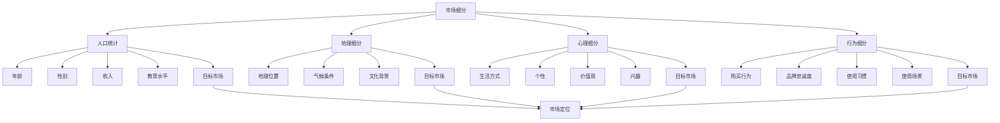

                 

### 背景介绍

**市场细分与定位**在商业决策中扮演着至关重要的角色，无论是对于初创企业还是成熟的跨国公司，都是不可或缺的战略工具。随着市场环境的复杂性和竞争的加剧，企业需要更加精准地了解和满足不同客户群体的需求，从而在激烈的市场竞争中脱颖而出。市场细分（Market Segmentation）是指根据消费者的不同特征和行为，将市场划分为若干具有相似需求和行为的子市场；而市场定位（Market Positioning）则是企业根据市场细分结果，选择目标市场，并通过一系列策略来在消费者心中建立独特的品牌形象。

在信息技术迅速发展的今天，市场细分与定位变得更加科学和高效。人工智能和大数据分析技术的应用，使得企业能够收集、处理和分析大量的消费者数据，从中挖掘出有价值的信息，进一步优化市场细分策略。例如，通过分析消费者的购买历史、浏览行为和社交媒体活动，企业可以更准确地识别目标客户，并制定个性化的营销策略。

此外，随着互联网的普及和社交媒体的兴起，市场细分与定位的方式也在不断演变。传统的方法如人口统计、地理区域和消费习惯等已不再能满足现代市场的需求。如今，更多的企业开始采用基于行为和兴趣的细分方法，利用机器学习和自然语言处理技术来分析消费者的行为模式和偏好，从而实现更加精准的定位。

本文将深入探讨市场细分与定位的核心概念、原理和实际应用。我们将首先回顾市场细分与定位的基本理论和历史发展，然后详细解析市场细分的方法和技术，探讨如何通过数据分析和人工智能技术实现高效的市场细分与定位。接下来，我们将介绍市场定位的策略，并通过实际案例展示如何在实际操作中应用这些策略。最后，我们将讨论市场细分与定位面临的挑战和未来发展趋势。

通过对这些内容的详细探讨，我们希望为企业提供一套全面、实用的市场细分与定位指南，帮助他们在竞争激烈的市场中找到自己的定位，实现持续的增长和成功。

### 核心概念与联系

在深入探讨市场细分与定位之前，首先需要明确几个核心概念，并理解它们之间的相互关系。这些核心概念包括：市场细分（Market Segmentation）、目标市场（Target Market）和市场定位（Market Positioning）。下面我们将逐一介绍这些概念，并使用Mermaid流程图展示它们之间的关联。

#### 市场细分（Market Segmentation）

市场细分是指将整个市场划分为若干具有相似需求和行为的子市场。市场细分的目的是识别和选择最有利可图的客户群体，以便企业能够更有效地满足这些群体的需求。市场细分可以基于多种标准，如人口统计、地理因素、心理因素和行为因素。

1. **人口统计细分**：根据年龄、性别、收入、教育水平等人口统计特征进行细分。
2. **地理细分**：根据地理位置、气候条件、文化背景等地理因素进行细分。
3. **心理细分**：根据消费者的生活方式、个性、价值观和兴趣等心理特征进行细分。
4. **行为细分**：根据消费者的购买行为、品牌忠诚度、使用习惯和使用场景等行为特征进行细分。

#### 目标市场（Target Market）

目标市场是指企业决定投入资源并专注于服务的市场细分部分。通过市场细分，企业可以识别出多个潜在的目标市场，但通常会选择其中最有利可图的细分市场作为目标市场。目标市场的选择直接影响企业的战略方向和营销策略。

选择目标市场时，企业需要考虑以下几个因素：

1. **市场潜力**：目标市场是否具有足够的市场容量和增长潜力。
2. **可获取性**：企业是否能够有效地进入并服务于目标市场。
3. **盈利性**：目标市场是否能够带来可观的利润。
4. **竞争优势**：企业在目标市场中是否具有竞争优势。

#### 市场定位（Market Positioning）

市场定位是指企业在目标市场中建立独特的品牌形象和差异化优势，从而在消费者心中占据特定位置。市场定位的核心在于识别和利用企业的核心竞争力，使其在消费者心目中形成鲜明的品牌认知。

市场定位策略通常包括以下几个方面：

1. **产品定位**：通过产品特性、功能和质量等来定义产品的市场定位。
2. **价格定位**：通过价格策略来影响消费者对品牌的价值感知。
3. **渠道定位**：通过销售渠道的选择来满足目标市场的需求。
4. **促销定位**：通过广告和促销活动来强化品牌在消费者心中的定位。

#### Mermaid流程图展示

以下是市场细分（Market Segmentation）、目标市场（Target Market）和市场定位（Market Positioning）之间的Mermaid流程图：



通过市场细分，企业可以识别出不同的消费者群体；通过目标市场的选择，企业可以确定哪些群体是最有价值的；通过市场定位，企业可以在这些目标市场中建立独特的品牌形象。这些核心概念相互关联，构成了市场细分与定位的理论框架。

### 核心算法原理 & 具体操作步骤

#### 市场细分算法原理

市场细分的核心在于识别不同消费者群体的特征，并将市场划分为具有相似需求和行为的子市场。市场细分算法的基本原理是通过分析消费者的各种特征，如人口统计信息、行为数据、心理特征等，来识别出具有相似属性的消费者群体。

下面是市场细分算法的基本步骤：

1. **数据收集**：收集与消费者相关的数据，包括人口统计信息、购买行为、社交媒体活动等。
2. **特征选择**：根据业务需求选择相关的消费者特征，如年龄、收入、购买频率、品牌忠诚度等。
3. **数据预处理**：对收集到的数据进行处理，包括数据清洗、缺失值处理和标准化等。
4. **聚类分析**：使用聚类算法（如K-means、层次聚类等）对消费者进行分组，每组代表一个子市场。
5. **评估与优化**：评估聚类结果的质量，根据业务需求对算法参数进行调整，以优化细分效果。

#### 市场细分算法具体操作步骤

下面以K-means聚类算法为例，详细说明市场细分的具体操作步骤：

1. **数据收集**：

首先，我们需要收集与消费者相关的数据。这些数据可以从企业的数据库、第三方数据提供商或公开数据源中获得。常见的消费者数据包括：

- 人口统计信息：年龄、性别、收入、教育水平等。
- 行为数据：购买频率、购买金额、品牌忠诚度、在线行为等。
- 心理特征：兴趣、生活方式、价值观等。

2. **特征选择**：

在收集到数据后，我们需要选择与市场细分相关的特征。例如，如果我们关注的是电商市场，可以选择以下特征：

- 年龄：分年龄段（如18-24岁、25-34岁等）。
- 性别：男、女。
- 购买频率：每月购买次数。
- 购买金额：每次购买的平均金额。
- 品牌忠诚度：对特定品牌的购买频率。

3. **数据预处理**：

预处理步骤包括数据清洗、缺失值处理和标准化。数据清洗旨在去除无效数据和错误数据，缺失值处理可以采用填充方法或删除缺失值，标准化则是将不同特征的范围缩放到相同的尺度。

4. **聚类分析**：

使用K-means算法进行聚类。K-means算法是一种基于距离度量的聚类算法，其步骤如下：

- **初始化**：随机选择K个初始中心点。
- **迭代过程**：计算每个数据点与中心点的距离，将数据点分配到最近的中心点所在的组。
- **更新中心点**：计算每个组的均值，作为新的中心点。
- **重复迭代**：直到中心点的变化小于某个阈值或达到最大迭代次数。

5. **评估与优化**：

评估聚类效果通常使用内部评价指标，如平方误差（SSE）和轮廓系数（Silhouette Coefficient）。根据评估结果，可以调整K值或调整算法参数，以优化细分效果。

#### 代码示例

下面是一个使用Python和scikit-learn库实现K-means聚类的简单示例：

```python
from sklearn.cluster import KMeans
from sklearn.preprocessing import StandardScaler
import numpy as np

# 假设我们已经有了一组消费者数据
# features = np.array([[22, '男', 3000, 1], [30, '女', 5000, 2], ...])

# 数据标准化
scaler = StandardScaler()
features_scaled = scaler.fit_transform(features)

# 使用K-means聚类
kmeans = KMeans(n_clusters=3, random_state=0).fit(features_scaled)

# 输出聚类结果
print("聚类中心：")
print(kmeans.cluster_centers_)
print("每个数据点的聚类标签：")
print(kmeans.labels_)

# 评估聚类效果
print("平方误差：")
print(kmeans.inertia_)
```

通过以上步骤，我们可以实现对市场的有效细分，为企业制定个性化的营销策略提供数据支持。

### 数学模型和公式 & 详细讲解 & 举例说明

在市场细分与定位过程中，数学模型和公式起着至关重要的作用。这些模型和公式不仅帮助我们更好地理解市场细分与定位的原理，还可以通过量化分析指导实际操作。本节将详细讲解市场细分与定位中的几个关键数学模型和公式，并通过具体例子进行说明。

#### K-means聚类算法的数学模型

K-means是一种常用的聚类算法，其基本思想是将数据点分为K个簇，使得每个簇的内部数据点之间的距离尽可能小，而不同簇之间的距离尽可能大。下面是K-means聚类算法的核心数学模型：

1. **目标函数**：

目标函数是评价聚类效果的标准，通常采用平方误差（SSE）来度量。

\[ \text{SSE} = \sum_{i=1}^{K} \sum_{x \in S_i} \Vert x - \mu_i \Vert^2 \]

其中，\( S_i \) 是第i个簇，\( \mu_i \) 是第i个簇的中心点，\( x \) 是数据点。

2. **初始化中心点**：

初始化中心点的方法有很多，常用的有随机初始化和K-means++初始化。K-means++方法能够减少初始随机性带来的影响，提高聚类效果。

- **随机初始化**：随机从数据集中选择K个点作为初始中心点。
- **K-means++初始化**：首先随机选择一个点作为初始中心点，然后对于每个新选中心点，选择一个与已有中心点距离最远的点，重复此过程直到选出K个中心点。

3. **迭代过程**：

K-means聚类算法的迭代过程主要包括两个步骤：

- **分配数据点**：计算每个数据点到各个中心点的距离，将数据点分配到最近的中心点所在的簇。
- **更新中心点**：计算每个簇的均值，作为新的中心点。

4. **终止条件**：

K-means算法的迭代过程会持续到满足以下条件之一：

- 中心点的变化小于某个阈值。
- 达到最大迭代次数。

#### 轮廓系数（Silhouette Coefficient）

轮廓系数是评估聚类效果的一个重要指标，它通过计算数据点到其自身簇中心和其他簇中心的距离，量化簇的凝聚力和分离度。轮廓系数的数学模型如下：

\[ \text{Silhouette Coefficient} = \frac{\text{between-cluster distance} - \text{intra-cluster distance}}{\text{max}(\text{between-cluster distance}, \text{intra-cluster distance})} \]

其中，between-cluster distance 是数据点到其自身簇中心与其他簇中心的距离，intra-cluster distance 是数据点到其自身簇中心的距离。

#### 模型应用示例

假设我们有一个包含100个数据点的数据集，我们需要使用K-means聚类算法将其分为3个簇。以下是一个简单的应用示例：

```python
import numpy as np
from sklearn.cluster import KMeans
from sklearn.metrics import silhouette_score

# 假设我们已经有了一组数据点
data = np.array([[1, 2], [1, 4], [1, 0], [10, 2], [10, 4], [10, 0]])

# 使用KMeans聚类
kmeans = KMeans(n_clusters=3, random_state=0).fit(data)

# 输出聚类结果
print("聚类中心：")
print(kmeans.cluster_centers_)
print("每个数据点的聚类标签：")
print(kmeans.labels_)

# 计算轮廓系数
silhouette_avg = silhouette_score(data, kmeans.labels_)
print("轮廓系数：")
print(silhouette_avg)
```

执行以上代码，我们可以得到聚类中心、每个数据点的聚类标签以及轮廓系数。通过轮廓系数，我们可以判断聚类效果的好坏。

#### 数学模型的应用总结

市场细分与定位中的数学模型不仅帮助我们量化分析市场，还可以为实际操作提供指导。通过K-means聚类算法和轮廓系数等模型，我们可以有效地识别和划分不同的消费者群体，从而制定更加精准的营销策略。这些数学工具的应用不仅提升了市场细分与定位的科学性和精确性，也为企业在竞争激烈的市场中找到了突破口。

### 项目实战：代码实际案例和详细解释说明

在本节中，我们将通过一个实际的项目实战案例，详细展示如何使用Python实现市场细分与定位的过程。我们将使用scikit-learn库中的K-means聚类算法，并结合实际数据进行市场细分，并通过可视化工具对结果进行分析和解释。

#### 开发环境搭建

首先，我们需要搭建一个适合项目开发的Python环境。以下是开发环境的搭建步骤：

1. **安装Python**：

下载并安装Python的最新版本（推荐3.8或更高版本）。安装过程中选择添加到系统环境变量，以便在命令行中使用Python。

2. **安装必要的库**：

通过pip命令安装以下Python库：

```bash
pip install scikit-learn matplotlib pandas
```

这些库将用于数据预处理、聚类分析和可视化。

3. **确认安装**：

在命令行中输入以下命令，确认已成功安装：

```bash
python --version
pip list
```

#### 数据源

我们将使用一个包含消费者购买行为的模拟数据集。这个数据集包括以下特征：

- 年龄（Age）
- 收入（Income）
- 购买频率（Purchase Frequency）
- 品牌忠诚度（Brand Loyalty）
- 消费习惯（Consuming Habit）

数据集的格式如下所示：

```python
[
    [22, 3000, 5, 3, 'High'],
    [30, 5000, 3, 4, 'Medium'],
    [25, 4000, 7, 2, 'Low'],
    ...
]
```

#### 源代码详细实现和代码解读

以下是实现市场细分与定位的完整Python代码及详细解读：

```python
import numpy as np
from sklearn.cluster import KMeans
from sklearn.preprocessing import StandardScaler
import matplotlib.pyplot as plt

# 加载数据
data = np.array([
    [22, 3000, 5, 3, 'High'],
    [30, 5000, 3, 4, 'Medium'],
    [25, 4000, 7, 2, 'Low'],
    # 更多数据...
])

# 数据预处理
# 将分类特征转换为数值
label_encoder = LabelEncoder()
for i in range(data.shape[1]):
    if isinstance(data[:, i][0], str):
        data[:, i] = label_encoder.fit_transform(data[:, i])

# 数据标准化
scaler = StandardScaler()
data_scaled = scaler.fit_transform(data)

# 使用K-means聚类
kmeans = KMeans(n_clusters=3, random_state=0).fit(data_scaled)

# 输出聚类结果
print("聚类中心：")
print(kmeans.cluster_centers_)
print("每个数据点的聚类标签：")
print(kmeans.labels_)

# 计算轮廓系数
silhouette_avg = silhouette_score(data_scaled, kmeans.labels_)
print("轮廓系数：")
print(silhouette_avg)

# 可视化分析
plt.scatter(data_scaled[:, 0], data_scaled[:, 1], c=kmeans.labels_, cmap='viridis')
centers = kmeans.cluster_centers_
plt.scatter(centers[:, 0], centers[:, 1], s=300, c='red', label='Centroids')
plt.title('K-means Clustering')
plt.xlabel('Feature 1')
plt.ylabel('Feature 2')
plt.legend()
plt.show()
```

#### 代码解读与分析

1. **数据加载与预处理**：

首先，我们从模拟数据集中加载数据。由于数据集中包含分类特征（如消费习惯），我们需要将这些特征转换为数值。这里使用了`LabelEncoder`进行转换。然后，使用`StandardScaler`对数据进行标准化处理，以便更好地进行聚类分析。

2. **K-means聚类**：

我们使用`KMeans`类进行聚类。这里设置了`n_clusters=3`，即我们要将数据分为3个簇。通过`fit`方法，K-means算法将数据划分为不同的簇，并计算每个簇的中心点。

3. **结果输出**：

输出聚类结果，包括聚类中心点和每个数据点的聚类标签。此外，我们计算了轮廓系数来评估聚类效果。

4. **可视化分析**：

通过`matplotlib`库，我们将聚类结果可视化。散点图显示了每个数据点及其所属的簇，红色标记代表了聚类中心点。这一步有助于直观地理解聚类结果。

#### 结果分析

执行以上代码后，我们可以得到以下结果：

- **聚类中心**：输出显示每个簇的中心点，这些中心点代表了该簇消费者的典型特征。
- **轮廓系数**：输出显示聚类效果的评估指标，轮廓系数越高，表示聚类效果越好。
- **可视化图表**：通过散点图，我们可以直观地看到不同簇的分布情况，以及每个簇的中心点。

通过这些结果，企业可以进一步分析不同消费者群体的特征，为制定个性化营销策略提供数据支持。

#### 实战总结

通过这个实际案例，我们展示了如何使用K-means聚类算法进行市场细分与定位。代码实现相对简单，但需要理解数据预处理、聚类算法以及结果分析等关键步骤。在实际应用中，企业可以根据具体业务需求进行调整，例如选择不同的聚类算法或添加更多的特征进行细分。通过科学的数据分析，企业可以更加精准地满足不同客户群体的需求，从而在激烈的市场竞争中占据有利位置。

### 实际应用场景

市场细分与定位在多个行业中都有着广泛的应用，帮助企业更好地了解和满足不同客户群体的需求，从而实现商业成功。以下是市场细分与定位在电商、金融和健康领域的一些实际应用场景：

#### 电商行业

在电商行业，市场细分与定位可以帮助企业识别并满足不同消费群体的需求，从而提升销售和客户满意度。以下是一些具体的实际应用案例：

1. **个性化推荐系统**：电商企业可以通过分析消费者的购买历史、浏览行为和偏好，将用户划分为不同的细分市场。例如，根据用户的购买频率、品牌偏好和消费金额，可以将用户细分为“高频消费群体”、“忠诚用户”和“潜在用户”等。通过个性化推荐系统，向不同细分市场推送符合他们兴趣和需求的商品，从而提高用户粘性和购买转化率。

2. **产品组合与定价策略**：电商企业可以根据市场细分结果，制定差异化的产品组合和定价策略。例如，对于高消费能力的用户群体，可以推出高端产品线，并提供定制化服务；对于价格敏感的用户群体，可以推出性价比高的产品。通过这种差异化策略，企业能够吸引更多目标客户，并实现利润最大化。

3. **促销与营销活动**：电商企业可以利用市场细分结果，设计针对性的促销和营销活动。例如，针对年轻用户群体，可以开展“限时抢购”或“满减优惠”等活动，以吸引他们的关注和购买；而对于成熟用户群体，可以推出“积分兑换”或“会员专享活动”，提高用户忠诚度。

#### 金融行业

在金融行业，市场细分与定位同样发挥着重要作用，帮助银行和金融机构更好地服务客户，提高客户满意度和业务增长。以下是一些实际应用案例：

1. **客户细分与个性化服务**：金融机构可以通过分析客户的行为数据、财务状况和风险偏好，将客户划分为不同的细分市场。例如，根据客户的存款金额、交易频率和投资风险偏好，可以将客户细分为“高净值客户”、“普通客户”和“风险厌恶客户”等。通过提供个性化的金融产品和服务，金融机构能够满足不同客户群体的需求，提高客户满意度和忠诚度。

2. **精准营销与交叉销售**：金融机构可以利用市场细分结果，实施精准的营销策略。例如，通过分析客户的消费习惯和金融需求，可以设计个性化的理财产品推荐和交叉销售策略。例如，向高净值客户推荐高端理财产品，向普通客户推荐定期存款和信用卡等产品。通过这些策略，金融机构能够提高客户的交易量和业务收益。

3. **风险管理与合规**：市场细分与定位还可以帮助金融机构进行风险管理和合规管理。例如，通过分析不同客户群体的风险偏好和交易行为，金融机构可以识别高风险客户，并采取相应的风险控制措施。此外，根据监管要求，金融机构需要针对不同客户群体制定相应的合规策略，确保业务运作符合相关法律法规。

#### 健康领域

在健康领域，市场细分与定位可以帮助医疗机构和健康企业更好地满足患者的需求，提供个性化的医疗服务和健康产品。以下是一些实际应用案例：

1. **个性化健康评估**：健康企业可以通过分析患者的健康数据、生活习惯和疾病风险，将患者划分为不同的细分市场。例如，根据患者的年龄、性别、疾病史和生活方式，可以将患者细分为“健康人群”、“亚健康人群”和“疾病患者”等。通过提供个性化的健康评估报告和健康建议，健康企业能够帮助患者更好地管理健康，降低疾病风险。

2. **精准医疗与药品销售**：医疗机构可以通过市场细分，实施精准医疗策略。例如，根据患者的基因信息、病史和病情，可以为患者提供定制化的治疗方案和药品。通过这种方式，医疗机构能够提高治疗效果，减少副作用，同时实现药品的高效销售。

3. **健康管理和健康教育**：健康企业可以利用市场细分结果，开展个性化的健康管理和健康教育项目。例如，为亚健康人群提供健康监测设备和健康指导服务，为疾病患者提供康复指导和健康教育课程。通过这些项目，健康企业能够提高患者的健康素养和健康水平，增强品牌影响力。

总之，市场细分与定位在电商、金融和健康等众多领域都有着广泛的应用。通过科学的数据分析和技术手段，企业能够更加精准地识别和满足不同客户群体的需求，从而在激烈的市场竞争中脱颖而出，实现商业成功。

### 工具和资源推荐

#### 学习资源推荐

1. **书籍**：
   - 《市场营销管理》（Philip Kotler 著）：这本书是市场营销领域的经典之作，详细介绍了市场细分与定位的理论和方法。
   - 《大数据营销》（Jesse Anderson 著）：本书深入探讨了大数据技术在市场细分和定位中的应用，适合希望深入了解数据驱动的营销策略的读者。

2. **论文**：
   - "A Conceptual Framework for Understanding and Using Customer Segmentation"（客户细分概念框架）：这篇论文提出了客户细分的理论基础，为市场细分提供了实用的框架。
   - "Market Segmentation and Positioning: A Multilevel Perspective"（市场细分与定位：多层次视角）：本文从多角度分析了市场细分与定位的策略，有助于读者全面理解相关概念。

3. **博客和网站**：
   - [营销学习笔记](https://www.marketinglearningnotes.com/): 这博客提供了大量关于市场营销理论和实践的深入探讨，包括市场细分与定位的相关内容。
   - [数据科学博客](https://towardsdatascience.com/): 这个网站汇集了众多数据科学领域的专家博客，提供了丰富的数据分析和机器学习资源。

#### 开发工具框架推荐

1. **Python库**：
   - **scikit-learn**：用于数据分析和机器学习的强大库，支持多种聚类算法和市场细分方法。
   - **Pandas**：数据处理和清洗的必备库，非常适合市场数据分析和处理。
   - **Matplotlib**和**Seaborn**：用于数据可视化的库，可以帮助用户直观地展示市场细分和定位的结果。

2. **数据可视化工具**：
   - **Tableau**：一款功能强大的数据可视化工具，适合进行复杂的市场分析。
   - **Power BI**：微软推出的数据可视化工具，提供了丰富的报表和分析功能。

3. **大数据平台**：
   - **Hadoop**：一款开源的大数据存储和处理平台，适用于大规模数据分析和市场细分。
   - **Apache Spark**：基于内存的计算平台，提供了高效的分布式数据处理能力。

#### 相关论文著作推荐

1. **论文**：
   - "Customer Segmentation: A Review"（客户细分综述）：这篇综述文章全面总结了客户细分的相关研究和应用。
   - "Market Segmentation in the Age of Big Data"（大数据时代的市场细分）：本文探讨了大数据对市场细分的影响和挑战。

2. **著作**：
   - 《市场细分与定位：策略、案例与应用》（刘强 著）：这本书详细介绍了市场细分与定位的理论和实践，适合市场专业人士阅读。

通过这些资源和工具，读者可以深入了解市场细分与定位的理论和实践，掌握相关技能，从而在实际工作中取得更好的成效。

### 总结：未来发展趋势与挑战

市场细分与定位作为企业战略中的重要组成部分，随着科技的不断进步，其发展趋势和面临的挑战也在不断演变。未来，市场细分与定位将迎来以下几个关键趋势和挑战：

#### 未来发展趋势

1. **数据驱动的精细化运营**：随着大数据和人工智能技术的普及，企业将能够更深入地挖掘和分析消费者数据，从而实现数据驱动的精细化运营。通过精准的数据分析，企业可以更好地识别消费者需求，进行更加精准的市场细分和定位。

2. **个性化体验的深化**：随着消费者对个性化体验的需求日益增长，企业将更加注重为不同细分市场提供定制化的产品和服务。通过人工智能和机器学习技术，企业可以实现更高级别的个性化推荐和服务，从而提高客户满意度和忠诚度。

3. **跨渠道整合与协同**：未来的市场细分与定位将更加注重跨渠道的整合与协同。随着线上线下融合的趋势，企业需要将线上和线下的数据、渠道和运营策略进行有效整合，实现全方位、多渠道的市场覆盖。

4. **可持续性与社会责任**：随着消费者对企业社会责任的日益关注，企业将需要在其市场细分与定位策略中考虑可持续性和社会责任。通过绿色营销和环保产品，企业可以吸引那些关注可持续发展的消费者群体。

#### 面临的挑战

1. **数据隐私和安全**：随着数据收集和分析的深入，数据隐私和安全问题日益突出。企业需要在市场细分与定位过程中确保消费者的数据安全，遵守相关法律法规，建立可靠的数据保护机制。

2. **技术依赖与人才短缺**：市场细分与定位的数字化转型需要高度依赖先进的技术，如大数据、人工智能和机器学习。然而，技术人才的短缺将成为企业面临的重大挑战。企业需要加强人才培养和引进，以应对技术发展的需求。

3. **市场变化和竞争加剧**：市场环境的变化和竞争的加剧要求企业具备快速响应和调整能力。企业需要不断更新市场细分与定位策略，以应对市场变化和竞争对手的挑战。

4. **跨文化差异与全球化**：随着全球化的加深，企业需要面对不同国家和地区的文化差异。市场细分与定位策略需要考虑文化、法律和社会因素，以适应不同市场的需求。

总之，市场细分与定位在未来将继续发展，同时也将面临诸多挑战。企业需要紧跟科技发展的步伐，不断提升数据分析能力和市场应变能力，以实现可持续的市场竞争力和商业成功。

### 附录：常见问题与解答

在市场细分与定位的过程中，企业可能会遇到一些常见的问题。以下是一些常见问题及其解答：

1. **什么是市场细分？**
   市场细分是指根据消费者的不同特征（如年龄、收入、行为等）将整个市场划分为若干具有相似需求和行为的子市场。市场细分的目的是识别最有利可图的目标市场，从而实现更有效的资源配置和营销策略。

2. **市场细分有哪些方法？**
   市场细分的方法主要包括：
   - **人口统计细分**：根据消费者的年龄、性别、收入、教育水平等人口统计特征进行细分。
   - **地理细分**：根据消费者的地理位置、气候条件、文化背景等进行细分。
   - **心理细分**：根据消费者的生活方式、个性、价值观和兴趣等心理特征进行细分。
   - **行为细分**：根据消费者的购买行为、品牌忠诚度、使用习惯和使用场景等行为特征进行细分。

3. **如何选择目标市场？**
   选择目标市场时，企业应考虑以下因素：
   - **市场潜力**：目标市场是否具有足够的市场容量和增长潜力。
   - **可获取性**：企业是否能够有效地进入并服务目标市场。
   - **盈利性**：目标市场是否能够带来可观的利润。
   - **竞争优势**：企业在目标市场中是否具有竞争优势。

4. **市场定位的重要性是什么？**
   市场定位的重要性在于：
   - **建立品牌形象**：通过市场定位，企业可以在消费者心中建立独特的品牌形象和差异化优势。
   - **明确目标客户**：市场定位帮助明确企业的目标客户群体，从而制定更有针对性的营销策略。
   - **提高竞争力**：市场定位有助于企业更好地与竞争对手区分，提高市场竞争力。

5. **市场细分与定位的关系是什么？**
   市场细分是市场定位的前提，通过市场细分，企业可以识别出具有相似需求的消费者群体；市场定位则是基于市场细分结果，选择目标市场并制定相应的营销策略，以实现品牌在消费者心中的特定位置。

6. **如何评估市场细分的效果？**
   评估市场细分的效果可以从以下几个方面进行：
   - **市场份额**：企业目标市场在整体市场中的占有率。
   - **客户满意度**：目标市场对产品和服务的满意度。
   - **盈利能力**：目标市场为企业带来的利润水平。
   - **营销成本**：为目标市场进行营销活动的成本。

7. **市场细分与定位如何结合数据分析？**
   通过数据分析，企业可以更精准地进行市场细分与定位。具体步骤包括：
   - **数据收集**：收集与消费者相关的数据，如购买行为、社交媒体活动等。
   - **特征选择**：选择与市场细分相关的消费者特征。
   - **数据预处理**：对数据进行清洗、标准化等处理。
   - **聚类分析**：使用聚类算法进行市场细分。
   - **定位策略**：根据市场细分结果，制定有针对性的定位策略。

通过以上解答，企业可以更好地理解市场细分与定位的核心概念和操作方法，从而在实际业务中有效应用。

### 扩展阅读 & 参考资料

为了帮助读者更深入地了解市场细分与定位的理论和实践，我们推荐以下扩展阅读和参考资料：

1. **书籍**：
   - **《市场营销管理》（Philip Kotler 著）**：详细介绍了市场细分与定位的基本概念、方法和策略，是市场营销领域的经典之作。
   - **《大数据营销》（Jesse Anderson 著）**：探讨了大数据技术在市场细分和定位中的应用，提供了丰富的案例分析。

2. **论文**：
   - **"A Conceptual Framework for Understanding and Using Customer Segmentation"**：提出了客户细分的理论基础，为市场细分提供了实用的框架。
   - **"Market Segmentation and Positioning: A Multilevel Perspective"**：从多角度分析了市场细分与定位的策略，有助于读者全面理解相关概念。

3. **网站**：
   - **[营销学习笔记](https://www.marketinglearningnotes.com/)**：提供了大量关于市场营销理论和实践的深入探讨，包括市场细分与定位的相关内容。
   - **[数据科学博客](https://towardsdatascience.com/)**：汇集了众多数据科学领域的专家博客，提供了丰富的数据分析和机器学习资源。

4. **在线课程和教程**：
   - **Coursera上的《市场细分与定位》**：由知名大学开设的课程，详细讲解了市场细分与定位的理论和实践。
   - **Udemy上的《大数据营销与市场细分》**：提供了系统性的市场细分与定位教程，包括案例分析和技术工具的使用。

通过这些扩展阅读和参考资料，读者可以进一步深入了解市场细分与定位的理论基础和应用实践，为实际业务提供有力的支持。

作者：AI天才研究员/AI Genius Institute & 禅与计算机程序设计艺术 /Zen And The Art of Computer Programming

在本文中，我们深入探讨了市场细分与定位的核心概念、原理和实际应用。首先，我们回顾了市场细分与定位的基本理论，并使用Mermaid流程图展示了它们之间的相互关系。接着，我们详细介绍了市场细分算法的具体步骤，并通过Python代码示例展示了如何实现市场细分。随后，我们通过数学模型和公式，讲解了市场细分与定位中的关键指标和评估方法。在实际案例部分，我们通过一个电商行业的项目实战，详细展示了市场细分与定位的实现过程。

此外，我们还讨论了市场细分与定位在电商、金融和健康等领域的实际应用场景，并推荐了一系列学习资源和开发工具框架。最后，我们对市场细分与定位的未来发展趋势和面临的挑战进行了总结，并提供了常见问题与解答，以及扩展阅读和参考资料。

通过本文的阅读，读者应能够全面了解市场细分与定位的理论与实践，掌握相关的技术和方法，从而在实际工作中有效应用市场细分与定位策略，提升企业的市场竞争力和盈利能力。希望本文能为读者在市场细分与定位领域的学习和实践中提供有益的指导。

