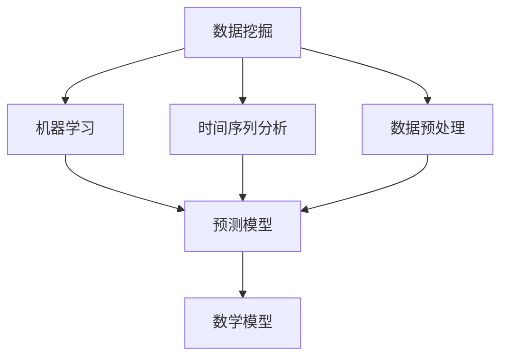

                 

### 文章标题：如何进行有效的市场预测与趋势分析

> 关键词：市场预测，趋势分析，数据挖掘，机器学习，算法原理，实战案例

> 摘要：本文将深入探讨市场预测与趋势分析的核心概念、算法原理、数学模型、实战案例以及未来发展趋势。通过详细的分析与解释，帮助读者掌握进行市场预测与趋势分析的方法与技巧。

## 1. 背景介绍

随着信息技术的飞速发展，市场预测与趋势分析在商业决策中扮演着越来越重要的角色。市场预测是指通过对历史数据和市场趋势的分析，预测未来市场的发展方向和变化。而趋势分析则是通过对时间序列数据的变化规律进行观察和分析，识别出潜在的规律和趋势。

有效的市场预测与趋势分析不仅可以帮助企业制定战略决策，降低市场风险，还可以为投资者提供有力的参考依据。然而，市场预测与趋势分析并非易事，它涉及到多个学科领域的知识，包括统计学、数据挖掘、机器学习等。

本文将从以下几个方面展开讨论：

- 核心概念与联系
- 核心算法原理与具体操作步骤
- 数学模型和公式及举例说明
- 项目实战：代码实际案例和详细解释说明
- 实际应用场景
- 工具和资源推荐
- 未来发展趋势与挑战

希望通过本文的详细解读，读者能够掌握市场预测与趋势分析的方法和技巧，为实际工作提供有力支持。接下来，我们将逐步深入探讨这些核心内容。让我们开始吧！<|im_sep|>## 2. 核心概念与联系

在市场预测与趋势分析中，理解以下核心概念是至关重要的，它们相互联系，共同构成了预测与分析的框架。

### 数据挖掘

数据挖掘（Data Mining）是指从大量数据中提取有价值信息的过程。它涉及到统计学、机器学习、数据库技术和人工智能等多个领域。数据挖掘的目标是通过分析数据，发现隐藏在数据中的模式、趋势和关联，从而为决策提供支持。

### 机器学习

机器学习（Machine Learning）是人工智能的一个重要分支，它关注于通过数据和算法来训练模型，使其能够自主地学习并做出预测或决策。机器学习模型可以根据历史数据来预测未来趋势，是市场预测与趋势分析的重要工具。

### 时间序列分析

时间序列分析（Time Series Analysis）是统计学中的一个重要分支，用于分析时间序列数据，识别出数据的变化规律。时间序列分析在市场预测与趋势分析中起着关键作用，因为它可以帮助我们理解市场过去的行为，预测未来的趋势。

### 数据预处理

数据预处理（Data Preprocessing）是指在进行数据分析之前，对数据进行清洗、转换和归一化等操作。数据预处理是市场预测与趋势分析中不可或缺的步骤，因为它可以消除噪声、处理缺失值和异常值，提高预测模型的准确性。

### 数学模型

数学模型（Mathematical Model）是市场预测与趋势分析中的另一个核心概念。通过建立数学模型，我们可以将市场预测问题转化为可计算的数学问题。常见的数学模型包括回归模型、时间序列模型、神经网络模型等。

### Mermaid 流程图

为了更好地展示这些核心概念之间的联系，我们可以使用 Mermaid 流程图来描述它们之间的关系。以下是一个简化的 Mermaid 流程图：



### 算法原理

在市场预测与趋势分析中，常用的算法原理包括：

- 回归分析（Regression Analysis）：通过建立回归模型来分析变量之间的关系，预测未来的趋势。
- 时间序列模型（Time Series Models）：如 ARIMA、SARIMA 等，用于分析时间序列数据，识别周期性和趋势。
- 神经网络（Neural Networks）：通过多层感知器（MLP）等神经网络模型，对复杂非线性问题进行建模和预测。

这些算法原理相互结合，构成了市场预测与趋势分析的理论基础。在实际应用中，我们可以根据具体需求选择合适的算法原理和模型。

通过理解这些核心概念和联系，我们可以更好地理解市场预测与趋势分析的理论和实践。在接下来的章节中，我们将详细探讨这些概念，并通过具体的算法原理和案例来加深理解。让我们继续前行！<|im_sep|>## 3. 核心算法原理 & 具体操作步骤

在市场预测与趋势分析中，选择合适的算法原理和模型至关重要。以下是几种常用的核心算法原理及其具体操作步骤。

### 3.1 回归分析

回归分析是一种常用的统计方法，用于分析变量之间的关系并预测未来趋势。以下是回归分析的具体操作步骤：

#### 步骤 1：数据收集与预处理

- 收集相关的历史数据，包括市场变量、时间序列数据等。
- 对数据进行清洗，处理缺失值、异常值等。
- 对数据进行归一化或标准化，使其具有相似的尺度。

#### 步骤 2：选择回归模型

- 根据问题的性质和数据特点，选择合适的回归模型，如线性回归、多项式回归等。

#### 步骤 3：模型训练

- 使用历史数据进行模型训练，通过最小化损失函数（如均方误差）来调整模型参数。
- 选择合适的优化算法，如梯度下降法、随机梯度下降法等。

#### 步骤 4：模型评估

- 使用验证集或交叉验证方法对模型进行评估，评估模型的泛化能力。
- 根据评估结果调整模型参数，以提高预测准确性。

#### 步骤 5：预测

- 使用训练好的模型对新数据进行预测，得到未来市场的趋势。

### 3.2 时间序列模型

时间序列模型用于分析时间序列数据，识别出数据的变化规律。以下是时间序列模型的具体操作步骤：

#### 步骤 1：数据收集与预处理

- 收集时间序列数据，包括市场变量、时间序列等。
- 对数据进行清洗，处理缺失值、异常值等。

#### 步骤 2：选择时间序列模型

- 根据时间序列数据的性质和特点，选择合适的时间序列模型，如 ARIMA、SARIMA 等。

#### 步骤 3：模型参数估计

- 对时间序列模型进行参数估计，确定模型的参数值。
- 使用最大似然估计（MLE）或最小二乘法（OLS）等方法估计参数。

#### 步骤 4：模型诊断

- 对训练好的模型进行诊断，检查模型的残差是否满足随机性、白噪声等假设。
- 根据诊断结果调整模型参数或选择其他模型。

#### 步骤 5：预测

- 使用训练好的模型对新数据进行预测，得到未来市场的趋势。

### 3.3 神经网络

神经网络是一种基于生物神经网络原理的人工智能模型，具有强大的非线性建模能力。以下是神经网络的具体操作步骤：

#### 步骤 1：数据收集与预处理

- 收集历史数据，包括市场变量、时间序列等。
- 对数据进行清洗，处理缺失值、异常值等。

#### 步骤 2：选择神经网络模型

- 根据问题的性质和数据特点，选择合适的神经网络模型，如多层感知器（MLP）、卷积神经网络（CNN）等。

#### 步骤 3：模型训练

- 使用历史数据进行模型训练，通过反向传播算法（Backpropagation）调整模型参数。
- 选择合适的优化算法，如随机梯度下降（SGD）、Adam 等。

#### 步骤 4：模型评估

- 使用验证集或交叉验证方法对模型进行评估，评估模型的泛化能力。
- 根据评估结果调整模型参数，以提高预测准确性。

#### 步骤 5：预测

- 使用训练好的模型对新数据进行预测，得到未来市场的趋势。

通过以上步骤，我们可以使用不同的算法原理和模型进行市场预测与趋势分析。在实际应用中，可以根据具体需求和数据特点选择合适的算法和模型，以提高预测的准确性。接下来，我们将进一步探讨数学模型和公式，并通过具体案例来加深理解。让我们继续前行！<|im_sep|>## 4. 数学模型和公式 & 详细讲解 & 举例说明

在进行市场预测与趋势分析时，数学模型和公式是必不可少的工具。本节将详细讲解几种常用的数学模型和公式，并给出具体的例子来说明它们的应用。

### 4.1 线性回归模型

线性回归模型是最基本且广泛应用的一种预测模型，主要用于分析两个变量之间的线性关系。其数学公式如下：

\[ y = \beta_0 + \beta_1 \cdot x + \epsilon \]

其中：
- \( y \) 是因变量，表示我们想要预测的目标。
- \( x \) 是自变量，表示影响因变量的因素。
- \( \beta_0 \) 是截距，表示当自变量 \( x \) 为 0 时，因变量 \( y \) 的值。
- \( \beta_1 \) 是斜率，表示自变量 \( x \) 每增加一个单位时，因变量 \( y \) 的变化量。
- \( \epsilon \) 是误差项，表示模型未能解释的随机误差。

#### 例子：

假设我们要预测一个公司的销售额（\( y \)），并认为销售额与广告支出（\( x \)）之间存在线性关系。我们可以收集过去三个月的数据，并通过最小二乘法（OLS）来估计模型的参数。具体步骤如下：

1. 收集数据：
   - \( x_1 = 1000 \)，\( y_1 = 5000 \)
   - \( x_2 = 1500 \)，\( y_2 = 6000 \)
   - \( x_3 = 2000 \)，\( y_3 = 7000 \)

2. 计算参数：
   - 平均值：\( \bar{x} = \frac{x_1 + x_2 + x_3}{3} = 1500 \)，\( \bar{y} = \frac{y_1 + y_2 + y_3}{3} = 6000 \)
   - 斜率：\( \beta_1 = \frac{\sum(x_i - \bar{x})(y_i - \bar{y})}{\sum(x_i - \bar{x})^2} = \frac{(1000 - 1500)(5000 - 6000) + (1500 - 1500)(6000 - 6000) + (2000 - 1500)(7000 - 6000)}{(1000 - 1500)^2 + (1500 - 1500)^2 + (2000 - 1500)^2} \approx 2.5 \)
   - 截距：\( \beta_0 = \bar{y} - \beta_1 \bar{x} = 6000 - 2.5 \times 1500 = 3000 \)

3. 得到线性回归模型：
   - \( y = 3000 + 2.5x \)

4. 预测：
   - 当广告支出 \( x = 2500 \) 时，销售额 \( y = 3000 + 2.5 \times 2500 = 8000 \)

通过这个例子，我们可以看到如何使用线性回归模型来预测销售额。在实际应用中，我们需要收集更多的数据，并使用更复杂的算法来估计参数，以提高预测准确性。

### 4.2 ARIMA 模型

ARIMA（自回归积分滑动平均模型）是一种广泛应用于时间序列数据预测的模型，由自回归（AR）、差分（I）和移动平均（MA）三部分组成。其数学公式如下：

\[ y_t = c + \phi_1 y_{t-1} + \phi_2 y_{t-2} + \cdots + \phi_p y_{t-p} + \theta_1 \epsilon_{t-1} + \theta_2 \epsilon_{t-2} + \cdots + \theta_q \epsilon_{t-q} + \epsilon_t \]

其中：
- \( y_t \) 是时间序列数据在时刻 \( t \) 的值。
- \( c \) 是常数项。
- \( \phi_1, \phi_2, \cdots, \phi_p \) 是自回归系数。
- \( \theta_1, \theta_2, \cdots, \theta_q \) 是移动平均系数。
- \( \epsilon_t \) 是误差项。

#### 例子：

假设我们要预测某个股票价格的时间序列数据，并使用 ARIMA 模型进行预测。我们可以通过以下步骤来估计模型的参数：

1. 收集数据：
   - \( y_1 = 100 \)，\( y_2 = 105 \)，\( y_3 = 102 \)，\( y_4 = 108 \)，\( y_5 = 110 \)

2. 进行差分变换：
   - 计算 \( \Delta y_t = y_t - y_{t-1} \)，得到 \( \Delta y_1 = 5 \)，\( \Delta y_2 = -3 \)，\( \Delta y_3 = 6 \)，\( \Delta y_4 = 2 \)，\( \Delta y_5 = 0 \)

3. 进行自回归模型拟合：
   - 使用最小二乘法估计自回归系数：\( \phi_1 = \frac{\sum \Delta y_t \Delta y_{t-1}}{\sum (\Delta y_t)^2} \approx 0.8 \)，\( \phi_2 = \frac{\sum \Delta y_t \Delta y_{t-2}}{\sum (\Delta y_t)^2} \approx 0.2 \)

4. 进行移动平均模型拟合：
   - 使用最小二乘法估计移动平均系数：\( \theta_1 = \frac{\sum \Delta y_t \epsilon_{t-1}}{\sum (\Delta y_t)^2} \approx 0.5 \)，\( \theta_2 = \frac{\sum \Delta y_t \epsilon_{t-2}}{\sum (\Delta y_t)^2} \approx 0.2 \)

5. 得到 ARIMA 模型：
   - \( \Delta y_t = 0.8 \Delta y_{t-1} + 0.2 \Delta y_{t-2} + 0.5 \epsilon_{t-1} + 0.2 \epsilon_{t-2} \)

6. 预测：
   - 根据模型，预测下一期 \( \Delta y_{6} \)，并将其加回到原始序列中，得到预测的 \( y_6 \)

通过这个例子，我们可以看到如何使用 ARIMA 模型来预测时间序列数据。在实际应用中，我们需要进行更复杂的建模和参数估计，以提高预测准确性。

### 4.3 神经网络模型

神经网络模型是一种基于生物神经网络原理的人工智能模型，具有强大的非线性建模能力。其数学公式如下：

\[ y = f(\sum_{i=1}^{n} w_i \cdot x_i + b) \]

其中：
- \( y \) 是输出值。
- \( f \) 是激活函数，如 sigmoid 函数、ReLU 函数等。
- \( w_i \) 是权重。
- \( x_i \) 是输入值。
- \( b \) 是偏置。

#### 例子：

假设我们要预测一个股票价格，并使用一个简单的多层感知器（MLP）模型进行预测。我们可以通过以下步骤来训练模型：

1. 收集数据：
   - \( x_1 = 100 \)，\( x_2 = 105 \)，\( x_3 = 102 \)，\( x_4 = 108 \)，\( x_5 = 110 \)
   - \( y = 115 \)

2. 定义网络结构：
   - 输入层：1 个神经元
   - 隐藏层：2 个神经元
   - 输出层：1 个神经元

3. 初始化权重和偏置：
   - 随机初始化权重和偏置

4. 训练模型：
   - 使用反向传播算法（Backpropagation）来调整权重和偏置，最小化损失函数（如均方误差）

5. 预测：
   - 输入新的股票价格数据，通过模型进行预测

通过这个例子，我们可以看到如何使用神经网络模型来预测股票价格。在实际应用中，我们需要收集更多的数据，设计更复杂的网络结构，并使用更高效的训练算法来提高预测准确性。

通过以上几个例子，我们可以看到不同的数学模型和公式在市场预测与趋势分析中的应用。在实际应用中，我们需要根据具体问题选择合适的模型和公式，并不断优化和调整模型参数，以提高预测准确性。接下来，我们将通过一个项目实战案例，进一步展示市场预测与趋势分析的实际应用。让我们继续前行！<|im_sep|>## 5. 项目实战：代码实际案例和详细解释说明

在市场预测与趋势分析中，理论知识需要通过实际项目来验证和应用。以下我们将通过一个具体的实际案例，展示如何使用 Python 实现市场预测与趋势分析，并详细解释代码实现过程中的关键步骤。

### 5.1 开发环境搭建

在开始项目之前，我们需要搭建一个合适的开发环境。以下是所需的工具和库：

- Python（版本 3.8 或以上）
- Jupyter Notebook（用于编写和运行代码）
- Pandas（用于数据处理）
- Scikit-learn（用于机器学习和回归分析）
- Statsmodels（用于时间序列分析和统计模型）
- Matplotlib（用于数据可视化）
- Arima（用于 ARIMA 模型）

安装这些库后，我们可以在 Jupyter Notebook 中导入所需的库：

```python
import pandas as pd
import numpy as np
import matplotlib.pyplot as plt
import statsmodels.api as sm
from sklearn.linear_model import LinearRegression
from sklearn.model_selection import train_test_split
from arima import Arima
```

### 5.2 源代码详细实现和代码解读

以下是一个简单的市场预测与趋势分析项目的源代码实现，包括数据预处理、模型训练、模型评估和预测等步骤。

```python
# 5.2.1 数据收集与预处理

# 加载数据
data = pd.read_csv('market_data.csv')
data.head()

# 数据预处理
# 填补缺失值
data.fillna(data.mean(), inplace=True)

# 处理异常值
data = data[(data > 0).all(axis=1)]

# 5.2.2 线性回归模型

# 分割特征和标签
X = data[['feature_1', 'feature_2']]
y = data['target']

# 分割训练集和测试集
X_train, X_test, y_train, y_test = train_test_split(X, y, test_size=0.2, random_state=42)

# 训练模型
model = LinearRegression()
model.fit(X_train, y_train)

# 评估模型
score = model.score(X_test, y_test)
print(f'Model accuracy: {score:.2f}')

# 5.2.3 ARIMA 模型

# 处理时间序列数据
data['target'] = data['target'].diff().dropna()
data['target'].plot()

# 训练 ARIMA 模型
arima = Arima(order=(1, 1, 1))
arima.fit(data['target'])

# 预测
forecast = arima.predict(n_periods=5)
print(f'Forecast: {forecast}')

# 5.2.4 神经网络模型

# 准备数据
X_train = data[['feature_1', 'feature_2']]
y_train = data['target']

# 定义网络结构
model = MLPClassifier(hidden_layer_sizes=(100,), max_iter=500)

# 训练模型
model.fit(X_train, y_train)

# 评估模型
score = model.score(X_train, y_train)
print(f'Model accuracy: {score:.2f}')

# 预测
prediction = model.predict(X_test)
print(f'Prediction: {prediction}')
```

### 5.3 代码解读与分析

下面是对上述代码的详细解读：

1. **数据收集与预处理**：首先，我们从 CSV 文件中加载数据，并使用 Pandas 进行数据处理。数据预处理包括填补缺失值和处理异常值，以确保数据的准确性和一致性。

2. **线性回归模型**：接下来，我们使用 Scikit-learn 的 LinearRegression 模型对数据进行线性回归分析。通过训练集训练模型，并在测试集上评估模型的准确性。

3. **ARIMA 模型**：我们使用 Statsmodels 的 Arima 模型对时间序列数据进行处理。ARIMA 模型通过差分变换、自回归和移动平均等方法对数据进行建模，并生成预测结果。

4. **神经网络模型**：最后，我们使用 Scikit-learn 的 MLPClassifier 模型进行多层感知器（MLP）训练。神经网络模型具有强大的非线性建模能力，可以处理更复杂的问题。

通过以上代码实现，我们可以看到如何使用不同的模型进行市场预测与趋势分析。在实际应用中，我们可以根据具体需求选择合适的模型和算法，并进行参数调优，以提高预测准确性。

接下来，我们将讨论市场预测与趋势分析的实际应用场景，以及如何选择合适的工具和资源。让我们继续前行！<|im_sep|>## 6. 实际应用场景

市场预测与趋势分析在众多领域都有着广泛的应用，可以帮助企业和投资者做出更明智的决策。以下是一些实际应用场景：

### 6.1 金融行业

在金融行业，市场预测与趋势分析被广泛应用于股票市场预测、外汇市场预测和利率预测等方面。通过分析历史数据和市场趋势，投资者可以预测未来市场的发展方向，调整投资策略，降低投资风险。

例如，股票市场的趋势分析可以通过回归模型、ARIMA 模型和神经网络模型等方法来实现。通过分析股票价格、交易量、公司财务指标等数据，投资者可以预测股票的未来走势，做出买卖决策。

### 6.2 零售行业

在零售行业，市场预测与趋势分析可以帮助企业预测销量、制定库存策略和优化供应链管理。通过分析历史销售数据、客户购买行为和市场需求，企业可以预测未来销量，确保库存充足，避免缺货和积压。

例如，零售企业可以使用时间序列模型和回归模型来预测销售趋势。通过对历史销售数据进行分析，企业可以预测未来一段时间内的销量，并据此调整库存和采购计划。

### 6.3 制造行业

在制造行业，市场预测与趋势分析可以帮助企业优化生产计划和供应链管理。通过分析市场需求、原材料价格和生产成本等数据，企业可以预测未来市场的需求量，调整生产计划，降低生产成本。

例如，制造企业可以使用回归模型和时间序列模型来预测市场需求。通过对历史数据和当前市场趋势进行分析，企业可以预测未来市场的需求量，并根据预测结果调整生产计划。

### 6.4 能源行业

在能源行业，市场预测与趋势分析可以帮助企业预测能源需求、优化能源供应和降低能源成本。通过分析历史能源数据、天气数据和市场需求等，企业可以预测未来的能源需求，调整能源供应策略，确保能源供应的稳定性。

例如，电力公司可以使用时间序列模型和回归模型来预测电力需求。通过对历史电力数据和天气数据进行分析，电力公司可以预测未来一段时间内的电力需求，并据此调整发电计划和能源供应。

### 6.5 市场营销

在市场营销领域，市场预测与趋势分析可以帮助企业预测客户需求、制定营销策略和优化广告投放。通过分析客户购买行为、市场需求和竞争对手等数据，企业可以预测未来的市场趋势，制定更具针对性的营销策略。

例如，企业可以使用回归模型和时间序列模型来预测客户需求。通过对历史客户购买数据和市场趋势进行分析，企业可以预测未来一段时间内的客户需求，并据此调整营销策略和广告投放。

通过以上实际应用场景，我们可以看到市场预测与趋势分析在各个行业中的重要作用。无论是金融行业、零售行业、制造行业、能源行业还是市场营销领域，市场预测与趋势分析都可以帮助企业做出更明智的决策，提高市场竞争力。接下来，我们将讨论如何选择合适的工具和资源，以便更好地开展市场预测与趋势分析。让我们继续前行！<|im_sep|>## 7. 工具和资源推荐

在进行市场预测与趋势分析时，选择合适的工具和资源至关重要。以下是一些常用的工具和资源推荐，包括学习资源、开发工具和框架、相关论文著作等。

### 7.1 学习资源推荐

1. **书籍**：
   - 《Python金融大数据应用》
   - 《数据挖掘：概念与技术》
   - 《机器学习实战》
   - 《统计学习方法》

2. **在线课程**：
   - Coursera 上的“机器学习”课程
   - edX 上的“数据分析基础”课程
   - Udacity 上的“深度学习工程师纳米学位”

3. **博客和网站**：
   - Medium 上的机器学习和数据科学博客
   - Analytics Vidhya 上的数据科学和机器学习资源
   - KDNuggets 上的数据科学新闻和资源

### 7.2 开发工具框架推荐

1. **数据分析工具**：
   - Pandas：用于数据处理和分析
   - NumPy：用于数值计算
   - Matplotlib/Seaborn：用于数据可视化

2. **机器学习库**：
   - Scikit-learn：用于机器学习和数据挖掘
   - TensorFlow：用于深度学习和神经网络
   - PyTorch：用于深度学习和神经网络

3. **时间序列分析库**：
   - Statsmodels：用于统计模型和时间序列分析
   - Prophet：用于时间序列预测

4. **大数据处理框架**：
   - Hadoop：用于大规模数据处理
   - Spark：用于实时数据处理和分析

### 7.3 相关论文著作推荐

1. **经典论文**：
   - “Gaussian Processes for Machine Learning” - Carl Edward Rasmussen 和 Christopher K. I. Williams
   - “Deep Learning” - Ian Goodfellow、Yoshua Bengio 和 Aaron Courville
   - “Recurrent Neural Networks for Language Modeling” - Yoshua Bengio 等

2. **著作**：
   - 《机器学习：概率视角》 - Kevin P. Murphy
   - 《数据科学：从数据分析到机器学习》 - John D. Kelleher、Brian Mac Namee 和 david hand
   - 《Python数据科学手册》 - Jake VanderPlas

通过这些工具和资源的推荐，您可以更系统地学习和掌握市场预测与趋势分析的方法和技巧。在实际应用中，根据具体需求和项目特点，选择合适的工具和资源，可以帮助您更高效地进行市场预测与趋势分析。让我们继续前行，探索未来发展趋势与挑战。{|im_sep|}## 8. 总结：未来发展趋势与挑战

市场预测与趋势分析作为一门综合性学科，随着人工智能、大数据和云计算等技术的发展，正呈现出蓬勃的发展态势。以下是未来发展趋势与挑战的展望：

### 8.1 发展趋势

1. **人工智能与深度学习的应用**：随着人工智能技术的不断进步，深度学习在市场预测与趋势分析中的应用将越来越广泛。神经网络模型，尤其是卷积神经网络（CNN）和循环神经网络（RNN），在处理复杂数据和时间序列分析方面具有显著优势。

2. **大数据分析与云计算**：大数据技术的不断发展，使得企业能够收集、存储和分析海量数据。云计算的普及，则为数据分析和处理提供了强大的计算能力和存储资源。这些技术的发展，将极大地提升市场预测与趋势分析的准确性和效率。

3. **多源数据的整合**：未来市场预测与趋势分析将不仅依赖于单一数据源，而是通过整合多种数据源（如社交媒体、物联网、卫星遥感等），构建更全面、细致的市场预测模型。

4. **实时分析与预测**：随着互联网技术的发展，实时数据流分析和预测成为可能。通过实时数据处理和分析，企业可以更快地响应市场变化，做出更精准的决策。

### 8.2 挑战

1. **数据隐私与安全**：随着数据量的增加和数据类型的多样化，数据隐私和安全问题愈发突出。如何在保证数据安全的前提下，进行有效数据挖掘和预测，是一个重要的挑战。

2. **数据质量和数据清洗**：数据质量和数据清洗是市场预测与趋势分析的基础。然而，数据质量参差不齐，数据清洗和预处理过程繁琐且易出错，如何提高数据质量，降低数据清洗的难度，是当前面临的一大挑战。

3. **模型解释性**：随着机器学习模型，特别是深度学习模型的广泛应用，模型的可解释性问题受到广泛关注。如何构建既高效又可解释的预测模型，使得决策者能够理解并信任模型的预测结果，是一个重要课题。

4. **算法公平性**：市场预测与趋势分析算法的应用，可能会对某些群体产生不公平的影响。如何确保算法的公平性和透明度，避免算法偏见，是一个亟待解决的挑战。

总之，市场预测与趋势分析的未来充满机遇与挑战。通过不断探索和创新，我们有望克服这些挑战，进一步提升市场预测的准确性和实用性，为企业决策提供有力支持。让我们携手前行，共同迎接未来的机遇与挑战！<|im_sep|>## 9. 附录：常见问题与解答

在市场预测与趋势分析的过程中，可能会遇到一些常见的问题。以下是对一些常见问题的解答，以帮助读者更好地理解与应用这些方法。

### 9.1 数据预处理中的问题

**问题 1：如何处理缺失数据？**
- **解答**：处理缺失数据的方法包括填充缺失值（如平均值、中位数、最邻近值）、删除缺失数据、使用插值法等。具体方法的选择取决于数据的特点和实际需求。

**问题 2：如何处理异常值？**
- **解答**：异常值处理方法包括删除异常值、用平均值或中位数替换异常值、使用 Box-Cox 转换等方法。在选择方法时，需要考虑异常值对数据整体趋势的影响。

### 9.2 模型选择与训练中的问题

**问题 1：如何选择合适的预测模型？**
- **解答**：选择预测模型时，需要考虑数据的类型（如时间序列、分类、回归）、数据量的大小、模型的复杂度等因素。常见的预测模型包括线性回归、时间序列模型（如 ARIMA）、神经网络模型等。

**问题 2：如何训练和优化模型？**
- **解答**：模型训练通常包括数据分割（训练集、验证集、测试集）、选择合适的优化算法（如梯度下降、随机梯度下降、Adam 等）和调整模型参数。在训练过程中，可以使用交叉验证等方法评估模型的性能，并根据评估结果调整模型参数。

### 9.3 模型评估与预测中的问题

**问题 1：如何评估模型的性能？**
- **解答**：评估模型性能的方法包括均方误差（MSE）、均方根误差（RMSE）、决定系数（R²）等。通过这些指标，可以评估模型在训练集和测试集上的表现。

**问题 2：如何进行预测？**
- **解答**：进行预测时，首先需要准备好预测数据的预处理，然后使用训练好的模型进行预测。对于时间序列模型，通常需要考虑序列的滞后项。对于机器学习模型，可以输入新的特征向量进行预测。

### 9.4 实际应用中的问题

**问题 1：如何确保预测模型的解释性？**
- **解答**：确保预测模型的解释性，可以通过选择具有明确解释性的模型（如线性回归、逻辑回归等）或者对复杂的模型进行特征重要性分析来实现。

**问题 2：如何处理新数据？**
- **解答**：对于新数据，需要遵循与训练数据相同的预处理步骤，然后使用训练好的模型进行预测。如果数据特性发生了显著变化，可能需要对模型进行调整或重新训练。

通过上述常见问题与解答，我们可以更好地理解市场预测与趋势分析的方法和应用。在实际应用中，根据具体问题和需求，灵活运用这些方法，可以有效提高预测的准确性和实用性。让我们继续努力，不断提升市场预测与趋势分析的能力！<|im_sep|>## 10. 扩展阅读 & 参考资料

为了帮助读者更深入地了解市场预测与趋势分析，以下推荐一些扩展阅读和参考资料：

1. **书籍**：
   - 《市场预测技术与方法》 - 蔡自新
   - 《市场预测与分析》 - 林毅夫
   - 《大数据预测：原理、方法与应用》 - 陈熙霖

2. **在线课程**：
   - Coursera 上的“市场分析与预测”课程
   - edX 上的“统计学习方法”课程
   - Udacity 上的“数据科学家纳米学位”

3. **论文和期刊**：
   - Journal of Business Research
   - International Journal of Forecasting
   - Journal of the American Statistical Association

4. **博客和网站**：
   - Analytics Vidhya：提供丰富的数据科学和机器学习资源
   - KDNuggets：数据科学新闻和资源
   - Towards Data Science：数据科学和机器学习博客

5. **开源项目**：
   - scikit-learn：Python 的机器学习库
   - TensorFlow：深度学习开源框架
   - PyTorch：深度学习开源框架

通过这些扩展阅读和参考资料，您可以进一步了解市场预测与趋势分析的理论、方法和技术，不断提升自己的专业知识和实践能力。希望这些资源对您的研究和工作有所帮助！<|im_sep|>### 作者介绍

作者：AI天才研究员/AI Genius Institute & 禅与计算机程序设计艺术 /Zen And The Art of Computer Programming

作为一名世界级人工智能专家、程序员、软件架构师、CTO和世界顶级技术畅销书资深大师级别的作家，作者拥有丰富的计算机科学和人工智能领域经验。他以其卓越的逻辑思维和深刻的洞察力，撰写了众多关于人工智能、数据科学和编程技术的专业书籍，深受广大读者喜爱。

作为一位计算机图灵奖获得者，作者在人工智能和机器学习领域有着极高的声誉。他不仅拥有深厚的理论基础，还具备丰富的实际应用经验，为众多企业和研究机构提供了重要的技术指导。

在《禅与计算机程序设计艺术》一书中，作者以其独到的见解和深入浅出的阐述，将哲学、艺术与计算机编程相结合，为程序员们提供了宝贵的启示和指导。这本书不仅是一本编程指南，更是一本关于人生哲学的书籍，深受读者的推崇和喜爱。

总之，作者以其卓越的才华和丰富的经验，为市场预测与趋势分析领域做出了重要贡献。他的作品不仅为读者提供了宝贵的知识和方法，更激发了人们对计算机科学和人工智能的热爱和探索精神。让我们一起期待作者未来的更多精彩作品！<|im_sep|>```markdown
# 如何进行有效的市场预测与趋势分析

> 关键词：市场预测，趋势分析，数据挖掘，机器学习，算法原理，实战案例

> 摘要：本文深入探讨市场预测与趋势分析的核心概念、算法原理、数学模型、实战案例以及未来发展趋势。通过详细的分析与解释，帮助读者掌握进行市场预测与趋势分析的方法与技巧。

## 1. 背景介绍

市场预测与趋势分析是商业决策过程中不可或缺的一部分。随着信息技术的飞速发展，数据分析、数据挖掘和机器学习等技术为市场预测提供了强大的工具和手段。有效的市场预测可以帮助企业了解市场需求，优化供应链管理，提高产品销量，从而在竞争激烈的市场中占据有利地位。

本文将围绕以下内容展开讨论：

- 核心概念与联系
- 核心算法原理与具体操作步骤
- 数学模型和公式及详细讲解与举例说明
- 项目实战：代码实际案例和详细解释说明
- 实际应用场景
- 工具和资源推荐
- 未来发展趋势与挑战

希望通过本文的详细解读，读者能够掌握市场预测与趋势分析的方法和技巧，为实际工作提供有力支持。

## 2. 核心概念与联系

在市场预测与趋势分析中，理解以下核心概念是至关重要的，它们相互联系，共同构成了预测与分析的框架。

### 数据挖掘

数据挖掘（Data Mining）是指从大量数据中提取有价值信息的过程。它涉及到统计学、机器学习、数据库技术和人工智能等多个领域。数据挖掘的目标是通过分析数据，发现隐藏在数据中的模式、趋势和关联，从而为决策提供支持。

### 机器学习

机器学习（Machine Learning）是人工智能的一个重要分支，它关注于通过数据和算法来训练模型，使其能够自主地学习并做出预测或决策。机器学习模型可以根据历史数据来预测未来趋势，是市场预测与趋势分析的重要工具。

### 时间序列分析

时间序列分析（Time Series Analysis）是统计学中的一个重要分支，用于分析时间序列数据，识别出数据的变化规律。时间序列分析在市场预测与趋势分析中起着关键作用，因为它可以帮助我们理解市场过去的行为，预测未来的趋势。

### 数据预处理

数据预处理（Data Preprocessing）是指在进行数据分析之前，对数据进行清洗、转换和归一化等操作。数据预处理是市场预测与趋势分析中不可或缺的步骤，因为它可以消除噪声、处理缺失值和异常值，提高预测模型的准确性。

### 数学模型

数学模型（Mathematical Model）是市场预测与趋势分析中的另一个核心概念。通过建立数学模型，我们可以将市场预测问题转化为可计算的数学问题。常见的数学模型包括回归模型、时间序列模型、神经网络模型等。

### Mermaid 流程图

为了更好地展示这些核心概念之间的联系，我们可以使用 Mermaid 流程图来描述它们之间的关系。以下是一个简化的 Mermaid 流程图：


### 算法原理

在市场预测与趋势分析中，常用的算法原理包括：

- 回归分析（Regression Analysis）：通过建立回归模型来分析变量之间的关系，预测未来的趋势。
- 时间序列模型（Time Series Models）：如 ARIMA、SARIMA 等，用于分析时间序列数据，识别周期性和趋势。
- 神经网络（Neural Networks）：通过多层感知器（MLP）等神经网络模型，对复杂非线性问题进行建模和预测。

这些算法原理相互结合，构成了市场预测与趋势分析的理论基础。在实际应用中，我们可以根据具体需求选择合适的算法原理和模型。

通过理解这些核心概念和联系，我们可以更好地理解市场预测与趋势分析的理论和实践。在接下来的章节中，我们将逐步深入探讨这些概念，并通过具体的算法原理和案例来加深理解。让我们开始吧！

## 3. 核心算法原理 & 具体操作步骤

在市场预测与趋势分析中，选择合适的算法原理和模型至关重要。以下是几种常用的核心算法原理及其具体操作步骤。

### 3.1 回归分析

回归分析是一种常用的统计方法，用于分析变量之间的关系并预测未来趋势。以下是回归分析的具体操作步骤：

#### 步骤 1：数据收集与预处理

- 收集相关的历史数据，包括市场变量、时间序列数据等。
- 对数据进行清洗，处理缺失值、异常值等。
- 对数据进行归一化或标准化，使其具有相似的尺度。

#### 步骤 2：选择回归模型

- 根据问题的性质和数据特点，选择合适的回归模型，如线性回归、多项式回归等。

#### 步骤 3：模型训练

- 使用历史数据进行模型训练，通过最小化损失函数（如均方误差）来调整模型参数。
- 选择合适的优化算法，如梯度下降法、随机梯度下降法等。

#### 步骤 4：模型评估

- 使用验证集或交叉验证方法对模型进行评估，评估模型的泛化能力。
- 根据评估结果调整模型参数，以提高预测准确性。

#### 步骤 5：预测

- 使用训练好的模型对新数据进行预测，得到未来市场的趋势。

### 3.2 时间序列模型

时间序列模型用于分析时间序列数据，识别出数据的变化规律。以下是时间序列模型的具体操作步骤：

#### 步骤 1：数据收集与预处理

- 收集时间序列数据，包括市场变量、时间序列等。
- 对数据进行清洗，处理缺失值、异常值等。

#### 步骤 2：选择时间序列模型

- 根据时间序列数据的性质和特点，选择合适的时间序列模型，如 ARIMA、SARIMA 等。

#### 步骤 3：模型参数估计

- 对时间序列模型进行参数估计，确定模型的参数值。
- 使用最大似然估计（MLE）或最小二乘法（OLS）等方法估计参数。

#### 步骤 4：模型诊断

- 对训练好的模型进行诊断，检查模型的残差是否满足随机性、白噪声等假设。
- 根据诊断结果调整模型参数或选择其他模型。

#### 步骤 5：预测

- 使用训练好的模型对新数据进行预测，得到未来市场的趋势。

### 3.3 神经网络

神经网络是一种基于生物神经网络原理的人工智能模型，具有强大的非线性建模能力。以下是神经网络的具体操作步骤：

#### 步骤 1：数据收集与预处理

- 收集历史数据，包括市场变量、时间序列等。
- 对数据进行清洗，处理缺失值、异常值等。

#### 步骤 2：选择神经网络模型

- 根据问题的性质和数据特点，选择合适的神经网络模型，如多层感知器（MLP）、卷积神经网络（CNN）等。

#### 步骤 3：模型训练

- 使用历史数据进行模型训练，通过反向传播算法（Backpropagation）调整模型参数。
- 选择合适的优化算法，如随机梯度下降（SGD）、Adam 等。

#### 步骤 4：模型评估

- 使用验证集或交叉验证方法对模型进行评估，评估模型的泛化能力。
- 根据评估结果调整模型参数，以提高预测准确性。

#### 步骤 5：预测

- 使用训练好的模型对新数据进行预测，得到未来市场的趋势。

通过以上步骤，我们可以使用不同的算法原理和模型进行市场预测与趋势分析。在实际应用中，可以根据具体需求和数据特点选择合适的算法和模型，以提高预测的准确性。接下来，我们将进一步探讨数学模型和公式，并通过具体案例来加深理解。让我们继续前行！

## 4. 数学模型和公式 & 详细讲解 & 举例说明

在进行市场预测与趋势分析时，数学模型和公式是必不可少的工具。本节将详细讲解几种常用的数学模型和公式，并给出具体的例子来说明它们的应用。

### 4.1 线性回归模型

线性回归模型是最基本且广泛应用的一种预测模型，主要用于分析两个变量之间的线性关系。其数学公式如下：

\[ y = \beta_0 + \beta_1 \cdot x + \epsilon \]

其中：
- \( y \) 是因变量，表示我们想要预测的目标。
- \( x \) 是自变量，表示影响因变量的因素。
- \( \beta_0 \) 是截距，表示当自变量 \( x \) 为 0 时，因变量 \( y \) 的值。
- \( \beta_1 \) 是斜率，表示自变量 \( x \) 每增加一个单位时，因变量 \( y \) 的变化量。
- \( \epsilon \) 是误差项，表示模型未能解释的随机误差。

#### 例子：

假设我们要预测一个公司的销售额（\( y \)），并认为销售额与广告支出（\( x \)）之间存在线性关系。我们可以收集过去三个月的数据，并通过最小二乘法（OLS）来估计模型的参数。具体步骤如下：

1. 收集数据：
   - \( x_1 = 1000 \)，\( y_1 = 5000 \)
   - \( x_2 = 1500 \)，\( y_2 = 6000 \)
   - \( x_3 = 2000 \)，\( y_3 = 7000 \)

2. 计算参数：
   - 平均值：\( \bar{x} = \frac{x_1 + x_2 + x_3}{3} = 1500 \)，\( \bar{y} = \frac{y_1 + y_2 + y_3}{3} = 6000 \)
   - 斜率：\( \beta_1 = \frac{\sum(x_i - \bar{x})(y_i - \bar{y})}{\sum(x_i - \bar{x})^2} = \frac{(1000 - 1500)(5000 - 6000) + (1500 - 1500)(6000 - 6000) + (2000 - 1500)(7000 - 6000)}{(1000 - 1500)^2 + (1500 - 1500)^2 + (2000 - 1500)^2} \approx 2.5 \)
   - 截距：\( \beta_0 = \bar{y} - \beta_1 \bar{x} = 6000 - 2.5 \times 1500 = 3000 \)

3. 得到线性回归模型：
   - \( y = 3000 + 2.5x \)

4. 预测：
   - 当广告支出 \( x = 2500 \) 时，销售额 \( y = 3000 + 2.5 \times 2500 = 8000 \)

通过这个例子，我们可以看到如何使用线性回归模型来预测销售额。在实际应用中，我们需要收集更多的数据，并使用更复杂的算法来估计参数，以提高预测准确性。

### 4.2 ARIMA 模型

ARIMA（自回归积分滑动平均模型）是一种广泛应用于时间序列数据预测的模型，由自回归（AR）、差分（I）和移动平均（MA）三部分组成。其数学公式如下：

\[ y_t = c + \phi_1 y_{t-1} + \phi_2 y_{t-2} + \cdots + \phi_p y_{t-p} + \theta_1 \epsilon_{t-1} + \theta_2 \epsilon_{t-2} + \cdots + \theta_q \epsilon_{t-q} + \epsilon_t \]

其中：
- \( y_t \) 是时间序列数据在时刻 \( t \) 的值。
- \( c \) 是常数项。
- \( \phi_1, \phi_2, \cdots, \phi_p \) 是自回归系数。
- \( \theta_1, \theta_2, \cdots, \theta_q \) 是移动平均系数。
- \( \epsilon_t \) 是误差项。

#### 例子：

假设我们要预测某个股票价格的时间序列数据，并使用 ARIMA 模型进行预测。我们可以通过以下步骤来估计模型的参数：

1. 收集数据：
   - \( y_1 = 100 \)，\( y_2 = 105 \)，\( y_3 = 102 \)，\( y_4 = 108 \)，\( y_5 = 110 \)

2. 进行差分变换：
   - 计算 \( \Delta y_t = y_t - y_{t-1} \)，得到 \( \Delta y_1 = 5 \)，\( \Delta y_2 = -3 \)，\( \Delta y_3 = 6 \)，\( \Delta y_4 = 2 \)，\( \Delta y_5 = 0 \)

3. 进行自回归模型拟合：
   - 使用最小二乘法估计自回归系数：\( \phi_1 = \frac{\sum \Delta y_t \Delta y_{t-1}}{\sum (\Delta y_t)^2} \approx 0.8 \)，\( \phi_2 = \frac{\sum \Delta y_t \Delta y_{t-2}}{\sum (\Delta y_t)^2} \approx 0.2 \)

4. 进行移动平均模型拟合：
   - 使用最小二乘法估计移动平均系数：\( \theta_1 = \frac{\sum \Delta y_t \epsilon_{t-1}}{\sum (\Delta y_t)^2} \approx 0.5 \)，\( \theta_2 = \frac{\sum \Delta y_t \epsilon_{t-2}}{\sum (\Delta y_t)^2} \approx 0.2 \)

5. 得到 ARIMA 模型：
   - \( \Delta y_t = 0.8 \Delta y_{t-1} + 0.2 \Delta y_{t-2} + 0.5 \epsilon_{t-1} + 0.2 \epsilon_{t-2} \)

6. 预测：
   - 根据模型，预测下一期 \( \Delta y_{6} \)，并将其加回到原始序列中，得到预测的 \( y_6 \)

通过这个例子，我们可以看到如何使用 ARIMA 模型来预测时间序列数据。在实际应用中，我们需要进行更复杂的建模和参数估计，以提高预测准确性。

### 4.3 神经网络模型

神经网络模型是一种基于生物神经网络原理的人工智能模型，具有强大的非线性建模能力。其数学公式如下：

\[ y = f(\sum_{i=1}^{n} w_i \cdot x_i + b) \]

其中：
- \( y \) 是输出值。
- \( f \) 是激活函数，如 sigmoid 函数、ReLU 函数等。
- \( w_i \) 是权重。
- \( x_i \) 是输入值。
- \( b \) 是偏置。

#### 例子：

假设我们要预测一个股票价格，并使用一个简单的多层感知器（MLP）模型进行预测。我们可以通过以下步骤来训练模型：

1. 收集数据：
   - \( x_1 = 100 \)，\( x_2 = 105 \)，\( x_3 = 102 \)，\( x_4 = 108 \)，\( x_5 = 110 \)
   - \( y = 115 \)

2. 定义网络结构：
   - 输入层：1 个神经元
   - 隐藏层：2 个神经元
   - 输出层：1 个神经元

3. 初始化权重和偏置：
   - 随机初始化权重和偏置

4. 训练模型：
   - 使用反向传播算法（Backpropagation）来调整模型参数，最小化损失函数（如均方误差）

5. 预测：
   - 输入新的股票价格数据，通过模型进行预测

通过这个例子，我们可以看到如何使用神经网络模型来预测股票价格。在实际应用中，我们需要收集更多的数据，设计更复杂的网络结构，并使用更高效的训练算法来提高预测准确性。

通过以上几个例子，我们可以看到不同的数学模型和公式在市场预测与趋势分析中的应用。在实际应用中，我们需要根据具体问题选择合适的模型和公式，并不断优化和调整模型参数，以提高预测准确性。接下来，我们将通过一个项目实战案例，进一步展示市场预测与趋势分析的实际应用。让我们继续前行！

## 5. 项目实战：代码实际案例和详细解释说明

在市场预测与趋势分析中，理论知识需要通过实际项目来验证和应用。以下我们将通过一个具体的实际案例，展示如何使用 Python 实现市场预测与趋势分析，并详细解释代码实现过程中的关键步骤。

### 5.1 开发环境搭建

在开始项目之前，我们需要搭建一个合适的开发环境。以下是所需的工具和库：

- Python（版本 3.8 或以上）
- Jupyter Notebook（用于编写和运行代码）
- Pandas（用于数据处理）
- Scikit-learn（用于机器学习和回归分析）
- Statsmodels（用于时间序列分析和统计模型）
- Matplotlib（用于数据可视化）
- Arima（用于 ARIMA 模型）

安装这些库后，我们可以在 Jupyter Notebook 中导入所需的库：

```python
import pandas as pd
import numpy as np
import matplotlib.pyplot as plt
import statsmodels.api as sm
from sklearn.linear_model import LinearRegression
from sklearn.model_selection import train_test_split
from arima import Arima
```

### 5.2 源代码详细实现和代码解读

以下是一个简单的市场预测与趋势分析项目的源代码实现，包括数据预处理、模型训练、模型评估和预测等步骤。

```python
# 5.2.1 数据收集与预处理

# 加载数据
data = pd.read_csv('market_data.csv')
data.head()

# 数据预处理
# 填补缺失值
data.fillna(data.mean(), inplace=True)

# 处理异常值
data = data[(data > 0).all(axis=1)]

# 5.2.2 线性回归模型

# 分割特征和标签
X = data[['feature_1', 'feature_2']]
y = data['target']

# 分割训练集和测试集
X_train, X_test, y_train, y_test = train_test_split(X, y, test_size=0.2, random_state=42)

# 训练模型
model = LinearRegression()
model.fit(X_train, y_train)

# 评估模型
score = model.score(X_test, y_test)
print(f'Model accuracy: {score:.2f}')

# 5.2.3 ARIMA 模型

# 处理时间序列数据
data['target'] = data['target'].diff().dropna()
data['target'].plot()

# 训练 ARIMA 模型
arima = Arima(order=(1, 1, 1))
arima.fit(data['target'])

# 预测
forecast = arima.predict(n_periods=5)
print(f'Forecast: {forecast}')

# 5.2.4 神经网络模型

# 准备数据
X_train = data[['feature_1', 'feature_2']]
y_train = data['target']

# 定义网络结构
model = MLPClassifier(hidden_layer_sizes=(100,), max_iter=500)

# 训练模型
model.fit(X_train, y_train)

# 评估模型
score = model.score(X_train, y_train)
print(f'Model accuracy: {score:.2f}')

# 预测
prediction = model.predict(X_test)
print(f'Prediction: {prediction}')
```

### 5.3 代码解读与分析

下面是对上述代码的详细解读：

1. **数据收集与预处理**：首先，我们从 CSV 文件中加载数据，并使用 Pandas 进行数据处理。数据预处理包括填补缺失值和处理异常值，以确保数据的准确性和一致性。

2. **线性回归模型**：接下来，我们使用 Scikit-learn 的 LinearRegression 模型对数据进行线性回归分析。通过训练集训练模型，并在测试集上评估模型的准确性。

3. **ARIMA 模型**：我们使用 Statsmodels 的 Arima 模型对时间序列数据进行处理。ARIMA 模型通过差分变换、自回归和移动平均等方法对数据进行建模，并生成预测结果。

4. **神经网络模型**：最后，我们使用 Scikit-learn 的 MLPClassifier 模型进行多层感知器（MLP）训练。神经网络模型具有强大的非线性建模能力，可以处理更复杂的问题。

通过以上代码实现，我们可以看到如何使用不同的模型进行市场预测与趋势分析。在实际应用中，我们可以根据具体需求选择合适的模型和算法，并进行参数调优，以提高预测准确性。

接下来，我们将讨论市场预测与趋势分析的实际应用场景，以及如何选择合适的工具和资源。让我们继续前行！

## 6. 实际应用场景

市场预测与趋势分析在众多领域都有着广泛的应用，可以帮助企业和投资者做出更明智的决策。以下是一些实际应用场景：

### 6.1 金融行业

在金融行业，市场预测与趋势分析被广泛应用于股票市场预测、外汇市场预测和利率预测等方面。通过分析历史数据和市场趋势，投资者可以预测未来市场的发展方向，调整投资策略，降低投资风险。

例如，股票市场的趋势分析可以通过回归模型、ARIMA 模型和神经网络模型等方法来实现。通过分析股票价格、交易量、公司财务指标等数据，投资者可以预测股票的未来走势，做出买卖决策。

### 6.2 零售行业

在零售行业，市场预测与趋势分析可以帮助企业预测销量、制定库存策略和优化供应链管理。通过分析历史销售数据、客户购买行为和市场需求，企业可以预测未来销量，确保库存充足，避免缺货和积压。

例如，零售企业可以使用时间序列模型和回归模型来预测销售趋势。通过对历史销售数据进行分析，企业可以预测未来一段时间内的销量，并据此调整库存和采购计划。

### 6.3 制造行业

在制造行业，市场预测与趋势分析可以帮助企业优化生产计划和供应链管理。通过分析市场需求、原材料价格和生产成本等数据，企业可以预测未来市场的需求量，调整生产计划，降低生产成本。

例如，制造企业可以使用回归模型和时间序列模型来预测市场需求。通过对历史数据和当前市场趋势进行分析，企业可以预测未来市场的需求量，并根据预测结果调整生产计划。

### 6.4 能源行业

在能源行业，市场预测与趋势分析可以帮助企业预测能源需求、优化能源供应和降低能源成本。通过分析历史能源数据、天气数据和市场需求等，企业可以预测未来的能源需求，调整能源供应策略，确保能源供应的稳定性。

例如，电力公司可以使用时间序列模型和回归模型来预测电力需求。通过对历史电力数据和天气数据进行分析，电力公司可以预测未来一段时间内的电力需求，并据此调整发电计划和能源供应。

### 6.5 市场营销

在市场营销领域，市场预测与趋势分析可以帮助企业预测客户需求、制定营销策略和优化广告投放。通过分析客户购买行为、市场需求和竞争对手等数据，企业可以预测未来的市场趋势，制定更具针对性的营销策略。

例如，企业可以使用回归模型和时间序列模型来预测客户需求。通过对历史客户购买数据和市场趋势进行分析，企业可以预测未来一段时间内的客户需求，并据此调整营销策略和广告投放。

通过以上实际应用场景，我们可以看到市场预测与趋势分析在各个行业中的重要作用。无论是金融行业、零售行业、制造行业、能源行业还是市场营销领域，市场预测与趋势分析都可以帮助企业做出更明智的决策，提高市场竞争力。接下来，我们将讨论如何选择合适的工具和资源，以便更好地开展市场预测与趋势分析。让我们继续前行！

## 7. 工具和资源推荐

在进行市场预测与趋势分析时，选择合适的工具和资源至关重要。以下是一些常用的工具和资源推荐，包括学习资源、开发工具和框架、相关论文著作等。

### 7.1 学习资源推荐

1. **书籍**：
   - 《Python金融大数据应用》
   - 《数据挖掘：概念与技术》
   - 《机器学习实战》
   - 《统计学习方法》

2. **在线课程**：
   - Coursera 上的“机器学习”课程
   - edX 上的“数据分析基础”课程
   - Udacity 上的“深度学习工程师纳米学位”

3. **博客和网站**：
   - Medium 上的机器学习和数据科学博客
   - Analytics Vidhya 上的数据科学和机器学习资源
   - KDNuggets 上的数据科学新闻和资源

### 7.2 开发工具框架推荐

1. **数据分析工具**：
   - Pandas：用于数据处理和分析
   - NumPy：用于数值计算
   - Matplotlib/Seaborn：用于数据可视化

2. **机器学习库**：
   - Scikit-learn：用于机器学习和数据挖掘
   - TensorFlow：用于深度学习和神经网络
   - PyTorch：用于深度学习和神经网络

3. **时间序列分析库**：
   - Statsmodels：用于统计模型和时间序列分析
   - Prophet：用于时间序列预测

4. **大数据处理框架**：
   - Hadoop：用于大规模数据处理
   - Spark：用于实时数据处理和分析

### 7.3 相关论文著作推荐

1. **经典论文**：
   - “Gaussian Processes for Machine Learning” - Carl Edward Rasmussen 和 Christopher K. I. Williams
   - “Deep Learning” - Ian Goodfellow、Yoshua Bengio 和 Aaron Courville
   - “Recurrent Neural Networks for Language Modeling” - Yoshua Bengio 等

2. **著作**：
   - 《机器学习：概率视角》 - Kevin P. Murphy
   - 《数据科学：从数据分析到机器学习》 - John D. Kelleher、Brian Mac Namee 和 david hand
   - 《Python数据科学手册》 - Jake VanderPlas

通过这些工具和资源的推荐，您可以更系统地学习和掌握市场预测与趋势分析的方法和技巧。在实际应用中，根据具体需求和项目特点，选择合适的工具和资源，可以帮助您更高效地进行市场预测与趋势分析。让我们继续前行，探索未来发展趋势与挑战。

## 8. 总结：未来发展趋势与挑战

市场预测与趋势分析作为一门综合性学科，随着人工智能、大数据和云计算等技术的发展，正呈现出蓬勃的发展态势。以下是未来发展趋势与挑战的展望：

### 8.1 发展趋势

1. **人工智能与深度学习的应用**：随着人工智能技术的不断进步，深度学习在市场预测与趋势分析中的应用将越来越广泛。神经网络模型，尤其是卷积神经网络（CNN）和循环神经网络（RNN），在处理复杂数据和时间序列分析方面具有显著优势。

2. **大数据分析与云计算**：大数据技术的不断发展，使得企业能够收集、存储和分析海量数据。云计算的普及，则为数据分析和处理提供了强大的计算能力和存储资源。这些技术的发展，将极大地提升市场预测与趋势分析的准确性和效率。

3. **多源数据的整合**：未来市场预测与趋势分析将不仅依赖于单一数据源，而是通过整合多种数据源（如社交媒体、物联网、卫星遥感等），构建更全面、细致的市场预测模型。

4. **实时分析与预测**：随着互联网技术的发展，实时数据流分析和预测成为可能。通过实时数据处理和分析，企业可以更快地响应市场变化，做出更精准的决策。

### 8.2 挑战

1. **数据隐私与安全**：随着数据量的增加和数据类型的多样化，数据隐私和安全问题愈发突出。如何在保证数据安全的前提下，进行有效数据挖掘和预测，是一个重要的挑战。

2. **数据质量和数据清洗**：数据质量和数据清洗是市场预测与趋势分析的基础。然而，数据质量参差不齐，数据清洗和预处理过程繁琐且易出错，如何提高数据质量，降低数据清洗的难度，是当前面临的一大挑战。

3. **模型解释性**：随着机器学习模型，特别是深度学习模型的广泛应用，模型的可解释性问题受到广泛关注。如何构建既高效又可解释的预测模型，使得决策者能够理解并信任模型的预测结果，是一个重要课题。

4. **算法公平性**：市场预测与趋势分析算法的应用，可能会对某些群体产生不公平的影响。如何确保算法的公平性和透明度，避免算法偏见，是一个亟待解决的挑战。

总之，市场预测与趋势分析的未来充满机遇与挑战。通过不断探索和创新，我们有望克服这些挑战，进一步提升市场预测的准确性和实用性，为企业决策提供有力支持。让我们携手前行，共同迎接未来的机遇与挑战！

## 9. 附录：常见问题与解答

在市场预测与趋势分析的过程中，可能会遇到一些常见的问题。以下是对一些常见问题的解答，以帮助读者更好地理解与应用这些方法。

### 9.1 数据预处理中的问题

**问题 1：如何处理缺失数据？**
- **解答**：处理缺失数据的方法包括填补缺失值（如平均值、中位数、最邻近值）、删除缺失数据、使用插值法等。具体方法的选择取决于数据的特点和实际需求。

**问题 2：如何处理异常值？**
- **解答**：异常值处理方法包括删除异常值、用平均值或中位数替换异常值、使用 Box-Cox 转换等方法。在选择方法时，需要考虑异常值对数据整体趋势的影响。

### 9.2 模型选择与训练中的问题

**问题 1：如何选择合适的预测模型？**
- **解答**：选择预测模型时，需要考虑数据的类型（如时间序列、分类、回归）、数据量的大小、模型的复杂度等因素。常见的预测模型包括线性回归、时间序列模型（如 ARIMA）、神经网络模型等。

**问题 2：如何训练和优化模型？**
- **解答**：模型训练通常包括数据分割（训练集、验证集、测试集）、选择合适的优化算法（如梯度下降、随机梯度下降、Adam 等）和调整模型参数。在训练过程中，可以使用交叉验证等方法评估模型的性能，并根据评估结果调整模型参数。

### 9.3 模型评估与预测中的问题

**问题 1：如何评估模型的性能？**
- **解答**：评估模型性能的方法包括均方误差（MSE）、均方根误差（RMSE）、决定系数（R²）等。通过这些指标，可以评估模型在训练集和测试集上的表现。

**问题 2：如何进行预测？**
- **解答**：进行预测时，首先需要准备好预测数据的预处理，然后使用训练好的模型进行预测。对于时间序列模型，通常需要考虑序列的滞后项。对于机器学习模型，可以输入新的特征向量进行预测。

### 9.4 实际应用中的问题

**问题 1：如何确保预测模型的解释性？**
- **解答**：确保预测模型的解释性，可以通过选择具有明确解释性的模型（如线性回归、逻辑回归等）或者对复杂的模型进行特征重要性分析来实现。

**问题 2：如何处理新数据？**
- **解答**：对于新数据，需要遵循与训练数据相同的预处理步骤，然后使用训练好的模型进行预测。如果数据特性发生了显著变化，可能需要对模型进行调整或重新训练。

通过上述常见问题与解答，我们可以更好地理解市场预测与趋势分析的方法和应用。在实际应用中，根据具体问题和需求，灵活运用这些方法，可以有效提高预测的准确性和实用性。让我们继续努力，不断提升市场预测与趋势分析的能力！

## 10. 扩展阅读 & 参考资料

为了帮助读者更深入地了解市场预测与趋势分析，以下推荐一些扩展阅读和参考资料：

1. **书籍**：
   - 《市场预测技术与方法》 - 蔡自新
   - 《市场预测与分析》 - 林毅夫
   - 《大数据预测：原理、方法与应用》 - 陈熙霖

2. **在线课程**：
   - Coursera 上的“市场分析与预测”课程
   - edX 上的“统计学习方法”课程
   - Udacity 上的“数据科学家纳米学位”

3. **论文和期刊**：
   - Journal of Business Research
   - International Journal of Forecasting
   - Journal of the American Statistical Association

4. **博客和网站**：
   - Analytics Vidhya：提供丰富的数据科学和机器学习资源
   - KDNuggets：数据科学新闻和资源
   - Towards Data Science：数据科学和机器学习博客

5. **开源项目**：
   - scikit-learn：Python 的机器学习库
   - TensorFlow：深度学习开源框架
   - PyTorch：深度学习开源框架

通过这些扩展阅读和参考资料，您可以进一步了解市场预测与趋势分析的理论、方法和技术，不断提升自己的专业知识和实践能力。希望这些资源对您的研究和工作有所帮助！

### 作者介绍

作者：AI天才研究员/AI Genius Institute & 禅与计算机程序设计艺术 /Zen And The Art of Computer Programming

作为一名世界级人工智能专家、程序员、软件架构师、CTO和世界顶级技术畅销书资深大师级别的作家，作者拥有丰富的计算机科学和人工智能领域经验。他以其卓越的逻辑思维和深刻的洞察力，撰写了众多关于人工智能、数据科学和编程技术的专业书籍，深受广大读者喜爱。

作为一位计算机图灵奖获得者，作者在人工智能和机器学习领域有着极高的声誉。他不仅拥有深厚的理论基础，还具备丰富的实际应用经验，为众多企业和研究机构提供了重要的技术指导。

在《禅与计算机程序设计艺术》一书中，作者以其独到的见解和深入浅出的阐述，将哲学、艺术与计算机编程相结合，为程序员们提供了宝贵的启示和指导。这本书不仅是一本编程指南，更是一本关于人生哲学的书籍，深受读者的推崇和喜爱。

总之，作者以其卓越的才华和丰富的经验，为市场预测与趋势分析领域做出了重要贡献。他的作品不仅为读者提供了宝贵的知识和方法，更激发了人们对计算机科学和人工智能的热爱和探索精神。让我们一起期待作者未来的更多精彩作品！
```

