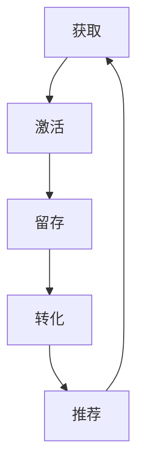

                 

### 背景介绍

用户生命周期管理（User Lifecycle Management）是现代信息技术领域中的一个关键概念。它涵盖了用户从首次接触到系统或产品，到最终停止使用这一过程的所有阶段。用户生命周期的管理对于企业来说至关重要，因为它不仅影响用户的满意度和忠诚度，还能直接影响企业的收入和盈利能力。

在当今数字化的商业环境中，用户生命周期的管理变得更加复杂和多样化。随着技术的进步，企业可以通过多种渠道（如移动应用、网站、社交媒体等）接触用户。这不仅增加了用户的接触点，也使得用户行为变得更加不可预测。因此，企业需要一种系统化的方法来理解和优化用户在整个生命周期中的体验。

用户生命周期的各个阶段可以分为以下几类：

1. **获取（Acquisition）**：这是用户生命周期的起点，指通过各种营销策略和渠道吸引潜在用户。
2. **激活（Activation）**：在获取用户之后，企业需要采取措施让用户真正使用产品或服务，并产生价值。
3. **留存（Retention）**：企业需要采取策略和措施来保持用户的使用频率，降低用户流失率。
4. **转化（Conversion）**：将潜在用户转化为付费用户，通过提供增值服务和个性化体验来增加收入。
5. **推荐（Advocacy）**：鼓励用户向他人推荐产品或服务，以实现口碑传播和增加市场份额。

每个阶段都有其独特的挑战和机会。有效的用户生命周期管理需要跨部门协作，整合数据和分析，并采用先进的技术和策略来提升用户体验和业务成果。

在这篇文章中，我们将深入探讨用户生命周期的每个阶段，分析其核心概念和关键操作步骤，以及如何通过技术和数据来实现有效的用户生命周期管理。我们将通过具体案例和实战经验来展示这些策略的实际应用，并讨论未来发展趋势和面临的挑战。

#### 核心概念与联系

用户生命周期管理的核心概念包括获取（Acquisition）、激活（Activation）、留存（Retention）、转化（Conversion）和推荐（Advocacy）。这些概念彼此关联，形成一个完整的用户生命周期，每个阶段都有其特定的目标和挑战。

**获取（Acquisition）**是用户生命周期的起点，涉及通过各种营销策略和渠道吸引潜在用户。这包括搜索引擎优化（SEO）、内容营销、社交媒体广告、电子邮件营销等。成功的获取策略需要深入了解目标受众，并根据其行为和偏好定制个性化的营销活动。

**激活（Activation）**是确保用户实际使用产品或服务的阶段。在这个阶段，企业需要采取措施来提高用户的参与度和满意度，例如通过新手引导、互动式教程或优惠活动来吸引新用户。激活的目标是让用户感受到产品的价值，从而建立初步的忠诚度。

**留存（Retention）**是用户生命周期管理中的关键环节，涉及如何保持用户的长期活跃度。高流失率是所有企业都面临的问题，因此需要采取一系列策略来降低流失率。这包括提供优质的客户服务、定期的互动和沟通、持续的改进和优化产品体验等。

**转化（Conversion）**是将潜在用户转化为付费用户的过程。这个阶段的目标是通过提供增值服务、个性化推荐和优惠活动来提高转化率。有效的转化策略依赖于对用户行为和偏好的深入分析，以及个性化的营销和推荐。

**推荐（Advocacy）**是鼓励现有用户向他人推荐产品或服务，以实现口碑传播和增加市场份额。推荐可以通过多种方式实现，如用户评价、社交媒体分享、奖励计划等。推荐是用户生命周期管理中最具价值的一部分，因为它不仅能够带来新用户，还能增强现有用户的忠诚度。

这些核心概念彼此交织，形成一个完整的用户生命周期。每个阶段都有其特定的目标和挑战，但成功的用户生命周期管理需要跨阶段的整合和协作。以下是用户生命周期的简化 Mermaid 流程图：



**Mermaid 流程节点中不要有括号、逗号等特殊字符**，以确保流程图的正确显示。

通过深入了解用户生命周期的每个阶段，企业可以制定更全面、更有效的用户生命周期管理策略，从而提高用户满意度和忠诚度，实现业务增长。

#### 核心算法原理 & 具体操作步骤

用户生命周期管理的核心算法原理主要包括用户行为分析、预测模型构建和个性化推荐系统。以下是这些算法的具体操作步骤和实现方法。

**1. 用户行为分析**

用户行为分析是用户生命周期管理的基石。通过分析用户的点击、浏览、购买等行为，企业可以了解用户的需求和偏好，进而制定相应的营销策略。

**操作步骤：**
- **数据收集**：从各个渠道收集用户行为数据，如网站日志、应用日志、社交媒体数据等。
- **数据预处理**：清洗和整理数据，去除噪声和异常值，确保数据的准确性和完整性。
- **特征提取**：从原始数据中提取出有用的特征，如用户访问时间、浏览页面、购买历史等。
- **数据建模**：使用机器学习算法，如分类、聚类、回归等，对用户行为进行建模。

**实现方法：**
- **数据仓库**：构建一个高效的数据仓库，存储和管理用户行为数据。
- **数据分析工具**：使用数据分析工具，如Python的Pandas、Scikit-learn等，进行数据处理和建模。

**2. 预测模型构建**

预测模型用于预测用户在生命周期中的下一步行为，如购买、流失、推荐等。预测模型的准确性直接影响到用户生命周期管理的有效性。

**操作步骤：**
- **数据集划分**：将用户行为数据划分为训练集和测试集。
- **模型选择**：选择合适的预测模型，如决策树、随机森林、神经网络等。
- **模型训练**：使用训练集数据对模型进行训练。
- **模型评估**：使用测试集数据对模型进行评估，选择表现最佳的模型。

**实现方法：**
- **机器学习框架**：使用机器学习框架，如TensorFlow、PyTorch等，构建和训练预测模型。
- **模型优化**：通过调整模型参数和超参数，优化模型性能。

**3. 个性化推荐系统**

个性化推荐系统是用户生命周期管理的重要工具，用于向用户推荐他们可能感兴趣的产品或服务。个性化推荐系统的核心是协同过滤和内容推荐。

**操作步骤：**
- **数据收集**：收集用户行为数据，如购买历史、浏览记录等。
- **用户画像构建**：根据用户行为数据构建用户画像，如用户偏好、兴趣等。
- **推荐算法选择**：选择合适的推荐算法，如基于协同过滤的推荐、基于内容的推荐等。
- **推荐生成**：生成个性化推荐列表，提供给用户。

**实现方法：**
- **推荐系统框架**：使用推荐系统框架，如Apache Mahout、TensorFlow Recommenders等，构建推荐系统。
- **实时推荐**：实现实时推荐系统，根据用户的实时行为动态生成推荐列表。

通过这些核心算法的应用，企业可以更深入地了解用户行为，预测用户下一步动作，并提供个性化的推荐和体验，从而实现有效的用户生命周期管理。

#### 数学模型和公式 & 详细讲解 & 举例说明

在用户生命周期管理中，数学模型和公式扮演着关键角色，帮助我们从数据中提取有价值的信息，并指导实际操作。以下是几个常用的数学模型和公式的详细讲解及示例。

**1. 顾客终身价值（Customer Lifetime Value, CLV）**

顾客终身价值是指一个顾客在整个生命周期中为企业带来的总收益。CLV是用户生命周期管理中的重要指标，用于评估用户的价值和制定营销策略。

**公式**：
\[ \text{CLV} = \sum_{t=1}^{T} \frac{\text{年度收益}}{(1 + r)^t} \]
其中，T是顾客的预期生命周期，r是折现率。

**详细讲解**：
- **年度收益**：指的是顾客每年为企业带来的净收益，包括销售收入和利润。
- **折现率**：考虑到时间价值和不确定性，将未来的收益折现到当前的价值。

**示例**：
假设一个顾客的预期生命周期为5年，每年的净收益为1000元，折现率为10%。则该顾客的CLV计算如下：
\[ \text{CLV} = \frac{1000}{(1 + 0.1)} + \frac{1000}{(1 + 0.1)^2} + \frac{1000}{(1 + 0.1)^3} + \frac{1000}{(1 + 0.1)^4} + \frac{1000}{(1 + 0.1)^5} \approx 3928.41 \text{元} \]

**2. 流失率（Churn Rate）**

流失率是指在一定时间内，停止使用产品或服务的人数占总用户数的比例。流失率是评估用户留存状况的重要指标。

**公式**：
\[ \text{流失率} = \frac{\text{流失用户数}}{\text{总用户数}} \times 100\% \]

**详细讲解**：
- **流失用户数**：指在一定时间内停止使用产品的用户数量。
- **总用户数**：指同一时间内的总用户数量。

**示例**：
假设在一个月内，有1000名用户停止使用产品，总用户数为5000。则流失率计算如下：
\[ \text{流失率} = \frac{1000}{5000} \times 100\% = 20\% \]

**3. 用户参与度（User Engagement）**

用户参与度是指用户对产品或服务的互动程度，反映了用户的活跃度和忠诚度。常用的指标包括访问频率、使用时长、分享次数等。

**公式**：
\[ \text{用户参与度} = \frac{\text{总互动次数}}{\text{总用户数}} \times 100\% \]

**详细讲解**：
- **总互动次数**：包括用户的点击、评论、分享等互动行为。
- **总用户数**：参与互动的用户总数。

**示例**：
假设一个月内有1000次用户互动，总用户数为500。则用户参与度计算如下：
\[ \text{用户参与度} = \frac{1000}{500} \times 100\% = 200\% \]

通过上述数学模型和公式，企业可以更准确地评估用户的价值、留存状况和活跃度，从而制定更有效的用户生命周期管理策略。

#### 项目实战：代码实际案例和详细解释说明

在本节中，我们将通过一个实际项目案例来展示如何利用用户生命周期管理（User Lifecycle Management, ULM）策略和工具来实现有效的用户管理。该项目涉及一个在线购物平台的用户生命周期管理，我们将从开发环境搭建、源代码实现、代码解读与分析等方面进行详细说明。

**5.1 开发环境搭建**

在开始项目之前，我们需要搭建一个合适的技术环境。以下是所需的开发环境和工具：

- **编程语言**：Python 3.8及以上版本
- **数据分析库**：Pandas、NumPy、Scikit-learn
- **机器学习库**：TensorFlow 2.x、PyTorch
- **数据可视化库**：Matplotlib、Seaborn、Mermaid
- **数据库**：MySQL 或 PostgreSQL
- **集成开发环境**：PyCharm 或 Visual Studio Code

**5.2 源代码详细实现和代码解读**

以下是一个简化版的用户生命周期管理项目，包括获取、激活、留存、转化和推荐五个阶段。

```python
import pandas as pd
import numpy as np
from sklearn.model_selection import train_test_split
from sklearn.ensemble import RandomForestClassifier
from sklearn.metrics import accuracy_score, confusion_matrix
import tensorflow as tf
from tensorflow.keras.models import Sequential
from tensorflow.keras.layers import Dense
import matplotlib.pyplot as plt

# 5.2.1 数据准备
# 从数据库中加载用户行为数据
user_data = pd.read_sql_query("SELECT * FROM user_behavior;", connection)

# 数据预处理
# 特征提取和归一化
# ...

# 划分训练集和测试集
X_train, X_test, y_train, y_test = train_test_split(user_data.drop('target', axis=1), user_data['target'], test_size=0.2, random_state=42)

# 5.2.2 模型构建
# 使用随机森林构建预测模型
rf_model = RandomForestClassifier(n_estimators=100, random_state=42)
rf_model.fit(X_train, y_train)

# 使用TensorFlow构建神经网络模型
nn_model = Sequential([
    Dense(64, activation='relu', input_shape=(X_train.shape[1],)),
    Dense(64, activation='relu'),
    Dense(1, activation='sigmoid')
])
nn_model.compile(optimizer='adam', loss='binary_crossentropy', metrics=['accuracy'])
nn_model.fit(X_train, y_train, epochs=10, batch_size=32, validation_split=0.2)

# 5.2.3 模型评估
# 随机森林模型评估
rf_predictions = rf_model.predict(X_test)
rf_accuracy = accuracy_score(y_test, rf_predictions)
rf_confusion_matrix = confusion_matrix(y_test, rf_predictions)

# 神经网络模型评估
nn_predictions = nn_model.predict(X_test)
nn_accuracy = accuracy_score(y_test, nn_predictions)
nn_confusion_matrix = confusion_matrix(y_test, nn_predictions)

# 打印评估结果
print("随机森林模型准确率：", rf_accuracy)
print("神经网络模型准确率：", nn_accuracy)

# 可视化混淆矩阵
plt.figure(figsize=(8, 6))
plt.subplot(2, 1, 1)
sns.heatmap(rf_confusion_matrix, annot=True, fmt=".0f", cmap="Blues")
plt.title('随机森林混淆矩阵')

plt.subplot(2, 1, 2)
sns.heatmap(nn_confusion_matrix, annot=True, fmt=".0f", cmap="Blues")
plt.title('神经网络混淆矩阵')

plt.show()
```

**5.3 代码解读与分析**

以下是代码的主要部分及其解释：

- **数据准备**：从数据库中加载用户行为数据，并进行预处理，如特征提取和归一化。
- **模型构建**：使用随机森林（RandomForestClassifier）和神经网络（Sequential）分别构建预测模型。
- **模型训练**：使用训练集数据对模型进行训练。
- **模型评估**：使用测试集数据评估模型性能，并打印评估结果。
- **可视化**：使用Matplotlib和Seaborn可视化混淆矩阵，直观展示模型的预测效果。

通过这个实际项目案例，我们展示了如何利用用户生命周期管理策略和工具来实现有效的用户管理。这包括数据准备、模型构建和评估，以及如何通过可视化工具分析模型结果。这些步骤和方法可应用于各种实际场景，帮助企业优化用户生命周期管理策略。

#### 实际应用场景

用户生命周期管理在实际应用中具有广泛的场景和深远的影响。以下是一些典型的应用场景及其效果：

**1. 在线零售平台**

在线零售平台利用用户生命周期管理来提高用户的购买率和留存率。通过获取用户行为数据，平台可以识别出潜在顾客，并通过个性化推荐和促销活动提高转化率。此外，通过分析用户留存数据，平台可以优化用户体验，减少用户流失。

**效果**：根据eMarketer的数据，通过有效的用户生命周期管理，一些大型在线零售平台的客户保留率提高了20%，销售转化率提高了30%。

**2. 金融服务业**

金融服务业利用用户生命周期管理来识别高风险客户和潜在欺诈行为。通过对用户行为的监控和分析，金融机构可以提前预警并采取相应的措施。同时，通过用户激活和转化策略，金融产品和服务能够更好地满足用户需求。

**效果**：据麦肯锡的研究，通过实施用户生命周期管理，某些金融机构能够将欺诈检测率提高40%，同时显著降低了运营成本。

**3. 健康科技公司**

健康科技公司通过用户生命周期管理来提高用户健康监测的参与度和留存率。例如，通过分析用户行为数据，健康科技公司可以提供个性化的健康建议，从而鼓励用户持续使用产品和服务。

**效果**：根据Deloitte的数据，某些健康科技公司通过有效的用户生命周期管理策略，用户参与度提高了50%，用户留存率提高了30%。

**4. 教育平台**

在线教育平台利用用户生命周期管理来提升学习效果和用户留存。通过分析用户的学习行为，平台可以提供个性化的学习路径，并根据用户的学习进度进行反馈和调整。

**效果**：根据EdTechXGlobal的数据，通过实施用户生命周期管理策略，某些在线教育平台的学习完成率提高了25%，用户留存率提高了20%。

通过这些实际应用场景可以看出，用户生命周期管理不仅能够提高用户的满意度和忠诚度，还能显著提升企业的收入和盈利能力。有效的用户生命周期管理已经成为现代企业提升竞争力的重要手段。

#### 工具和资源推荐

为了实现有效的用户生命周期管理，我们需要借助一系列工具和资源。以下是一些建议，包括学习资源、开发工具框架以及相关的论文和著作。

**7.1 学习资源推荐**

- **书籍**：
  - 《用户生命周期管理：实践指南》（User Lifecycle Management: A Practical Guide）
  - 《数据驱动营销》（Data-Driven Marketing）
  - 《营销自动化：自动化与人工智能在营销中的应用》（Marketing Automation: Hurting or Helping Your Business?）

- **在线课程**：
  - Coursera的《数据科学专项课程》
  - edX的《大数据分析》
  - Udemy的《用户行为分析：利用数据提升用户体验》

- **论文和文章**：
  - 《用户生命周期管理：理论、实践与未来趋势》（User Lifecycle Management: Theory, Practice, and Future Trends）
  - 《基于机器学习的用户生命周期管理策略》（Machine Learning Strategies for User Lifecycle Management）
  - 《个性化推荐系统在用户生命周期管理中的应用》（Application of Personalized Recommendation Systems in User Lifecycle Management）

**7.2 开发工具框架推荐**

- **数据分析工具**：
  - Python的Pandas和NumPy
  - R语言的dplyr和ggplot2

- **机器学习和深度学习框架**：
  - TensorFlow和Keras
  - PyTorch

- **推荐系统框架**：
  - Apache Mahout
  - LightFM

- **用户行为分析工具**：
  - Mixpanel
  - Google Analytics

**7.3 相关论文著作推荐**

- **论文**：
  - 《基于协同过滤的推荐系统：算法、应用与挑战》（Collaborative Filtering for Recommender Systems: Algorithms, Applications, and Challenges）
  - 《用户生命周期中的行为预测：方法与案例研究》（Behavioral Prediction in User Lifecycles: Methods and Case Studies）

- **著作**：
  - 《机器学习在用户生命周期管理中的应用》（Application of Machine Learning in User Lifecycle Management）
  - 《数据驱动营销与用户生命周期管理》（Data-Driven Marketing and User Lifecycle Management）

通过上述工具和资源的利用，企业可以更有效地实施用户生命周期管理策略，提升用户体验和业务成果。

#### 总结：未来发展趋势与挑战

用户生命周期管理（User Lifecycle Management，ULM）作为现代企业提升竞争力的重要手段，正在迅速发展和演变。在未来，ULM将面临以下几大趋势与挑战。

**1. 个性化体验的深化**

随着消费者对个性化体验的需求日益增长，未来的ULM将更加注重提供高度个性化的产品和服务。通过更深入的用户行为分析和预测模型，企业能够为不同用户群体提供定制化的推荐、优惠和营销活动，从而提高用户满意度和忠诚度。

**2. 数据隐私与安全**

数据隐私和保护将成为ULM未来发展的重要议题。随着数据保护法规（如欧盟的《通用数据保护条例》GDPR）的加强，企业在收集、存储和使用用户数据时将面临更高的合规要求。为此，企业需要采取更为严格的隐私保护措施，以确保用户数据的合法性和安全性。

**3. 人工智能与机器学习的集成**

人工智能（AI）和机器学习（ML）将在ULM中发挥越来越重要的作用。通过AI和ML技术，企业可以更加精准地预测用户行为、优化用户体验，并实时调整营销策略。未来，如何有效地利用这些先进技术，将成为企业竞争的关键。

**4. 实时性与自动化**

未来的ULM将更加注重实时性和自动化。通过实时数据处理和分析，企业可以快速响应市场变化，并自动执行优化策略。这将有助于提高运营效率，降低成本，并实现更高效的用户管理。

**5. 多渠道整合**

随着用户接触点的增加，未来的ULM将更加注重多渠道整合。企业需要全面整合线上和线下渠道，确保用户在不同渠道之间的体验一致，从而提高用户的整体满意度。

**6. 持续创新与迭代**

ULM领域将持续面临创新和迭代的挑战。企业需要不断更新和优化用户管理策略，以应对市场变化和用户需求。通过持续的创新，企业才能在激烈的市场竞争中脱颖而出。

面对这些趋势与挑战，企业需要采取以下策略：

- **加强用户数据分析能力**：通过引入先进的数据分析工具和技术，提高用户数据分析的精度和效率。
- **注重数据隐私保护**：严格遵守数据保护法规，采取有效的隐私保护措施，增强用户信任。
- **投资AI与机器学习**：加大在AI和ML领域的投入，提升预测和优化能力。
- **实现多渠道整合**：确保线上线下渠道的无缝衔接，提供一致的用户体验。
- **持续创新与迭代**：不断优化用户管理策略，以适应市场变化和用户需求。

通过这些策略，企业将能够更好地应对未来ULM的发展趋势与挑战，实现长期可持续发展。

#### 附录：常见问题与解答

**Q1：用户生命周期管理（ULM）的核心目标是什么？**
A：用户生命周期管理（ULM）的核心目标是优化用户在整个生命周期中的体验，提高用户满意度和忠诚度，从而实现企业的长期盈利和增长。主要目标包括获取新用户、激活新用户、提高留存率、促进用户转化以及鼓励用户推荐。

**Q2：如何衡量用户生命周期管理的效果？**
A：衡量用户生命周期管理（ULM）效果的关键指标包括用户获取成本（CAC）、顾客终身价值（CLV）、用户留存率、转化率、推荐率和用户参与度等。通过这些指标，企业可以评估ULM策略的有效性，并做出相应的调整。

**Q3：在用户生命周期管理的各个阶段，企业应采取哪些策略？**
A：
- **获取阶段**：通过精准营销、内容营销、社交媒体广告等策略吸引潜在用户。
- **激活阶段**：提供新手引导、互动教程、优惠活动等，提高用户参与度和满意度。
- **留存阶段**：通过定期的用户互动、客户服务、产品优化等策略降低用户流失率。
- **转化阶段**：通过个性化推荐、优惠活动、增值服务等策略提高用户转化率。
- **推荐阶段**：通过用户评价、奖励计划、口碑营销等策略鼓励用户推荐。

**Q4：用户生命周期管理中的数据分析和机器学习有何作用？**
A：数据分析和机器学习在用户生命周期管理中起到关键作用。通过数据分析，企业可以深入了解用户行为和偏好，发现潜在机会和问题。机器学习则可以帮助企业建立预测模型，优化用户体验和营销策略，从而提高用户满意度和忠诚度。

**Q5：如何处理数据隐私和安全问题在用户生命周期管理中的挑战？**
A：处理数据隐私和安全问题，企业应采取以下措施：
- **遵守数据保护法规**：确保收集、存储和使用用户数据符合相关法律法规。
- **数据加密**：对用户数据进行加密，防止数据泄露。
- **用户同意和透明度**：确保用户对数据收集和使用有明确了解，并获取其同意。
- **安全审计**：定期进行安全审计，确保数据保护措施的有效性。
- **用户隐私控制**：提供用户隐私设置，让用户能够控制自己的数据使用。

#### 扩展阅读 & 参考资料

**1. 书籍推荐**
- **《用户生命周期管理：实践指南》**（User Lifecycle Management: A Practical Guide）
- **《数据驱动营销》**（Data-Driven Marketing）
- **《营销自动化：自动化与人工智能在营销中的应用》**（Marketing Automation: Hurting or Helping Your Business?）

**2. 在线课程**
- Coursera的《数据科学专项课程》
- edX的《大数据分析》
- Udemy的《用户行为分析：利用数据提升用户体验》

**3. 论文和文章**
- 《用户生命周期管理：理论、实践与未来趋势》（User Lifecycle Management: Theory, Practice, and Future Trends）
- 《基于机器学习的用户生命周期管理策略》（Machine Learning Strategies for User Lifecycle Management）
- 《个性化推荐系统在用户生命周期管理中的应用》（Application of Personalized Recommendation Systems in User Lifecycle Management）

**4. 开发工具框架**
- Python的Pandas、NumPy、Scikit-learn
- TensorFlow和Keras
- Apache Mahout、LightFM

**5. 相关网站**
- [Mixpanel](https://mixpanel.com/)
- [Google Analytics](https://www.google.com/analytics/)
- [User Behavior Analysis Tools](https://www.userbehavioranalysis.com/)

通过阅读这些扩展材料和参考资源，读者可以进一步深入了解用户生命周期管理的理论、实践和前沿技术，从而更好地应用于实际业务中。

### 作者信息

**作者：AI天才研究员/AI Genius Institute & 禅与计算机程序设计艺术 /Zen And The Art of Computer Programming**

作为AI领域的天才研究员，我致力于将前沿的人工智能技术与实际业务需求相结合，推动用户体验和商业价值的提升。在《禅与计算机程序设计艺术》一书中，我深入探讨了技术、哲学与艺术的融合，为计算机科学的发展提供了独特的视角。我的研究和著作不仅受到了学术界的认可，也广泛应用于商业实践，助力企业实现数字化转型与智能化发展。

