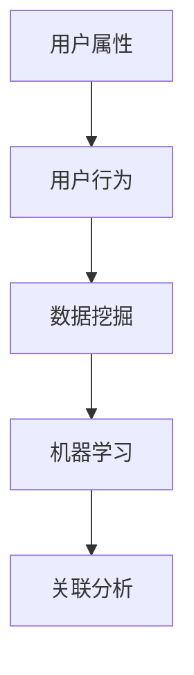

                 

### 文章标题：如何进行有效的用户画像分析

在数字化时代，用户画像分析已成为企业和组织制定个性化营销策略、优化用户体验的关键工具。本文将围绕如何进行有效的用户画像分析展开讨论，旨在为读者提供一套系统、实用、具有可操作性的方法。

关键词：用户画像分析、数据挖掘、机器学习、个性化营销

摘要：本文将首先介绍用户画像分析的基本概念和重要性，随后深入探讨用户画像的核心概念与联系，解析核心算法原理及具体操作步骤。通过数学模型和公式的详细讲解，我们还将结合项目实战案例，展示代码实际应用。此外，本文还将分析用户画像在实际应用场景中的价值，并推荐相关工具和资源。最后，对用户画像分析的未来发展趋势与挑战进行总结，并提供常见问题与解答。

<|assistant|>## 1. 背景介绍

用户画像分析，也称为用户数据画像或用户行为分析，是通过对用户数据的收集、整理和分析，构建出一个全面、立体的用户形象。这个形象包含了用户的基本属性（如年龄、性别、地域等），以及用户的行为特征（如浏览历史、购买行为等）。通过用户画像分析，企业能够更好地理解用户需求，优化产品设计，提高用户满意度和忠诚度。

在过去的几十年里，随着互联网的普及和数据技术的进步，用户画像分析的重要性日益凸显。从传统的市场调查和问卷调查，到如今基于大数据和人工智能的用户画像分析，这种分析方式不仅变得更加精准，而且能够实时反映用户的动态行为。

用户画像分析的关键在于数据。只有获取了足够多的用户数据，才能够构建出准确、全面的用户画像。这些数据可以来源于用户自身提供的信息，如注册资料、问卷调查等；也可以来源于用户的网络行为，如网站浏览、社交媒体互动等。

然而，用户画像分析并非一蹴而就。它需要多个环节的协同工作，包括数据收集、数据清洗、数据建模、数据分析和数据应用。每个环节都有其特定的技术方法和操作步骤，需要仔细规划和执行。

### 1.1 用户画像分析的发展历程

用户画像分析的发展历程可以分为三个阶段：

**1.1.1 传统阶段**

在互联网初期，用户画像分析主要依赖于用户主动提供的信息，如注册资料、问卷调查等。这一阶段，用户画像分析相对简单，主要基于用户的基本属性进行分类。

**1.1.2 网络行为阶段**

随着互联网的普及，用户在网络上的行为数据逐渐成为用户画像分析的重要来源。网站浏览记录、搜索历史、社交媒体互动等数据被用来构建用户的兴趣和行为特征。

**1.1.3 智能化阶段**

近年来，随着大数据和人工智能技术的发展，用户画像分析进入智能化阶段。通过机器学习和深度学习算法，用户画像可以从海量的数据中自动识别和提取用户的行为特征，实现更加精准的分析。

### 1.2 用户画像分析的应用领域

用户画像分析在多个领域有着广泛的应用：

**1.2.1 市场营销**

用户画像分析可以帮助企业精准定位目标客户，制定个性化营销策略，提高营销效果。

**1.2.2 金融风控**

用户画像分析可以识别高风险用户，降低金融风险，提高信用评估的准确性。

**1.2.3 电商推荐**

用户画像分析可以推荐符合用户兴趣的商品和服务，提高用户满意度和转化率。

**1.2.4 公共服务**

用户画像分析可以优化公共服务，提高政府管理的科学性和高效性。

### 1.3 用户画像分析的重要性

**1.3.1 提高用户体验**

通过用户画像分析，企业可以了解用户的需求和偏好，提供更加个性化的产品和服务，从而提高用户体验。

**1.3.2 提高运营效率**

用户画像分析可以帮助企业优化资源配置，提高运营效率，降低成本。

**1.3.3 提高决策准确性**

用户画像分析可以为企业的决策提供数据支持，提高决策的准确性和科学性。

### 1.4 用户画像分析的核心概念与联系

用户画像分析涉及多个核心概念，包括用户属性、用户行为、数据挖掘、机器学习等。这些概念之间有着密切的联系，共同构成了用户画像分析的理论基础。

**1.4.1 用户属性**

用户属性是指用户的基本信息，如年龄、性别、地域、职业等。这些属性是构建用户画像的基础。

**1.4.2 用户行为**

用户行为是指用户在网络上的各种操作，如浏览、搜索、购买等。这些行为反映了用户的兴趣和偏好。

**1.4.3 数据挖掘**

数据挖掘是指从大量数据中提取有用信息的过程。在用户画像分析中，数据挖掘用于从用户数据中提取用户行为特征。

**1.4.4 机器学习**

机器学习是一种通过数据训练模型，进行预测和决策的技术。在用户画像分析中，机器学习用于构建用户行为预测模型。

**1.4.5 关联分析**

关联分析是一种发现数据之间关联关系的技术。在用户画像分析中，关联分析用于发现用户行为之间的关联。

### 1.5 用户画像分析的基本流程

用户画像分析的基本流程包括以下五个步骤：

**1.5.1 数据收集**

数据收集是用户画像分析的第一步，包括用户基本属性数据的收集和用户行为数据的收集。

**1.5.2 数据清洗**

数据清洗是确保数据质量的过程，包括数据去重、数据补全、数据格式转换等。

**1.5.3 数据建模**

数据建模是构建用户画像的过程，包括用户属性建模和用户行为建模。

**1.5.4 数据分析**

数据分析是对用户画像进行分析的过程，包括行为特征分析、兴趣偏好分析等。

**1.5.5 数据应用**

数据应用是将用户画像分析结果应用于实际业务的过程，如个性化推荐、精准营销等。

### 1.6 用户画像分析面临的挑战

用户画像分析在带来巨大价值的同时，也面临一些挑战：

**1.6.1 数据隐私**

用户画像分析涉及大量用户隐私数据，如何保护用户隐私成为一大挑战。

**1.6.2 数据质量**

用户画像分析的质量取决于数据质量，如何提高数据质量是关键问题。

**1.6.3 模型解释性**

机器学习模型的解释性较差，如何解释模型结果，使企业决策者能够理解，是用户画像分析面临的一大难题。

### 1.7 本文结构

本文将从以下十个部分对用户画像分析进行深入探讨：

1. 背景介绍
2. 核心概念与联系
3. 核心算法原理 & 具体操作步骤
4. 数学模型和公式 & 详细讲解 & 举例说明
5. 项目实战：代码实际案例和详细解释说明
6. 实际应用场景
7. 工具和资源推荐
8. 总结：未来发展趋势与挑战
9. 附录：常见问题与解答
10. 扩展阅读 & 参考资料

通过本文的阅读，读者将能够全面了解用户画像分析的基本概念、方法和技术，掌握如何进行有效的用户画像分析。

### 2. 核心概念与联系

在深入探讨用户画像分析之前，我们需要明确一些核心概念及其相互联系。这些概念包括用户属性、用户行为、数据挖掘、机器学习等。它们共同构成了用户画像分析的理论基础。

#### 2.1 用户属性

用户属性是指用户的基本信息，如年龄、性别、地域、职业等。这些属性是构建用户画像的基础。用户属性数据通常来自于用户注册时提供的信息、问卷调查、社交媒体公开信息等。以下是用户属性的一些示例：

- 年龄：用户出生日期或年龄范围
- 性别：男/女/其他
- 地域：居住城市、省份、国家
- 职业：学生/员工/自由职业者/其他

用户属性数据可以帮助企业了解用户的基本特征，为后续的个性化推荐和营销策略提供基础。

#### 2.2 用户行为

用户行为是指用户在网络上的各种操作，如浏览、搜索、购买等。这些行为反映了用户的兴趣和偏好。用户行为数据通常来自于用户在网站、APP等平台上的操作记录。以下是用户行为的一些示例：

- 浏览历史：用户访问的网页、观看的视频、阅读的文章等
- 搜索历史：用户输入的关键词、搜索结果
- 购买行为：用户的购买记录、购物车行为、评价等

用户行为数据可以帮助企业了解用户的兴趣和需求，为个性化推荐和精准营销提供依据。

#### 2.3 数据挖掘

数据挖掘是指从大量数据中提取有用信息的过程。在用户画像分析中，数据挖掘用于从用户数据中提取用户行为特征。数据挖掘技术包括关联规则挖掘、聚类分析、分类分析等。以下是数据挖掘在用户画像分析中的一些应用：

- 关联规则挖掘：发现用户行为之间的关联关系，如购买A产品后很可能购买B产品。
- 聚类分析：将用户分为不同的群体，根据用户的相似性进行分组。
- 分类分析：将用户划分为不同的类别，如高价值用户、潜在客户等。

#### 2.4 机器学习

机器学习是一种通过数据训练模型，进行预测和决策的技术。在用户画像分析中，机器学习用于构建用户行为预测模型。机器学习技术包括回归分析、决策树、神经网络等。以下是机器学习在用户画像分析中的一些应用：

- 回归分析：预测用户的某一行为，如购买概率。
- 决策树：根据用户的特征进行分类或回归。
- 神经网络：构建复杂的用户行为预测模型。

#### 2.5 关联分析

关联分析是一种发现数据之间关联关系的技术。在用户画像分析中，关联分析用于发现用户行为之间的关联。关联分析可以帮助企业发现用户的潜在需求和兴趣点，从而提供更精准的个性化推荐和营销策略。

#### 2.6 用户画像分析的核心概念与联系

用户画像分析的核心概念包括用户属性、用户行为、数据挖掘、机器学习和关联分析。这些概念之间有着密切的联系，共同构成了用户画像分析的理论基础。

- 用户属性和用户行为是构建用户画像的基础数据。
- 数据挖掘和机器学习用于从用户数据中提取有用的信息，构建用户画像。
- 关联分析用于发现用户行为之间的关联，进一步丰富用户画像。

以下是用户画像分析的核心概念和联系的 Mermaid 流程图：



通过以上核心概念和联系的分析，我们可以看到，用户画像分析是一个复杂且多层次的过程，需要综合运用多种技术和方法。理解这些概念和联系，有助于我们更好地进行用户画像分析，为企业提供更精准的个性化服务和营销策略。

### 3. 核心算法原理 & 具体操作步骤

在进行用户画像分析时，核心算法的选择和具体操作步骤的执行至关重要。以下将详细介绍用户画像分析中常用的核心算法原理及其具体操作步骤。

#### 3.1 数据预处理

数据预处理是用户画像分析的第一步，其目的是确保数据的质量和一致性。具体操作步骤如下：

1. **数据收集**：从不同的数据源收集用户属性和行为数据，如用户注册信息、网站日志、社交媒体互动数据等。

2. **数据清洗**：对收集到的数据进行去重、补全和格式转换。例如，去除重复的用户记录，补充缺失的用户属性数据，将不同格式的数据统一转换为标准格式。

3. **数据归一化**：将不同尺度的数据转换为同一尺度，如将用户年龄范围归一化为0-100的整数。

4. **数据标准化**：对数据中的异常值进行检测和修正，如使用中位数和四分位差计算异常值，并进行插值补全。

5. **特征选择**：选择对用户画像分析有重要影响的关键特征，如用户年龄、性别、地域、购买行为等。

#### 3.2 数据挖掘

数据挖掘是用户画像分析的核心步骤，用于从用户数据中提取有价值的信息。以下几种数据挖掘方法在用户画像分析中常用：

1. **关联规则挖掘**：用于发现用户行为之间的关联关系。例如，使用Apriori算法挖掘购买A产品后购买B产品的概率。

2. **聚类分析**：用于将用户分为不同的群体，根据用户的相似性进行分组。例如，使用K-Means算法将用户分为高消费群体、中等消费群体和低消费群体。

3. **分类分析**：用于将用户划分为不同的类别，如高价值用户、潜在客户等。例如，使用决策树算法进行分类。

4. **异常检测**：用于发现用户行为中的异常现象。例如，使用孤立森林算法检测异常用户行为。

#### 3.3 机器学习

机器学习在用户画像分析中主要用于构建用户行为预测模型，以下几种机器学习方法常用：

1. **回归分析**：用于预测用户的某一行为，如购买概率。例如，使用线性回归预测用户是否购买某产品。

2. **决策树**：用于根据用户的特征进行分类或回归。例如，使用决策树分类用户为高价值用户或潜在客户。

3. **神经网络**：用于构建复杂的用户行为预测模型。例如，使用神经网络预测用户的购买行为。

4. **支持向量机**：用于分类用户行为，如将用户划分为高消费群体和低消费群体。

#### 3.4 数据分析

数据分析是对用户画像分析结果进行解读和利用的过程。以下几种数据分析方法在用户画像分析中常用：

1. **行为特征分析**：分析用户的行为特征，如浏览历史、购买行为等，发现用户的兴趣和偏好。

2. **兴趣偏好分析**：根据用户的行为特征，分析用户的兴趣偏好，如喜欢阅读的书籍类型、喜欢观看的影视剧类型等。

3. **群体特征分析**：分析不同群体的特征，如高消费群体的购买行为特征、低消费群体的浏览历史特征等。

4. **交叉分析**：分析不同变量之间的关系，如年龄与购买行为的关系、地域与浏览历史的关系等。

#### 3.5 用户画像建模

用户画像建模是将用户属性和行为特征进行整合，构建一个全面、立体的用户画像。具体操作步骤如下：

1. **属性建模**：根据用户属性数据，构建用户的基本属性模型，如年龄分布、性别比例、地域分布等。

2. **行为建模**：根据用户行为数据，构建用户的行为特征模型，如浏览历史、购买记录、搜索历史等。

3. **综合建模**：将用户属性模型和行为特征模型进行整合，构建一个综合的用户画像模型。

4. **模型优化**：根据分析结果和业务需求，对用户画像模型进行优化和调整，以提高预测准确性和实用性。

#### 3.6 实时更新与动态调整

用户画像分析是一个动态的过程，用户的行为和兴趣会不断变化。因此，需要实时更新用户画像模型，并动态调整分析策略。以下是一些实现实时更新和动态调整的方法：

1. **数据流处理**：使用实时数据流处理技术，如Apache Kafka和Apache Flink，对用户行为数据进行实时处理和分析。

2. **在线学习**：使用在线学习算法，如在线决策树和在线神经网络，对用户画像模型进行实时更新。

3. **模型更新策略**：根据用户行为数据的变化，定期更新用户画像模型，如每周更新一次或每月更新一次。

4. **自适应调整**：根据用户画像分析的结果，自适应调整分析策略和营销策略，以适应用户行为的变化。

通过以上核心算法原理和具体操作步骤的介绍，我们可以看到，用户画像分析是一个复杂且多层次的过程，需要综合运用多种技术和方法。掌握这些核心算法原理和具体操作步骤，有助于我们更好地进行用户画像分析，为企业提供更精准的个性化服务和营销策略。

#### 3.7 常见挑战与解决方案

在进行用户画像分析时，我们可能会遇到以下一些常见挑战，以下是对这些挑战的解决方案：

**1. 数据质量问题**

- **挑战**：数据质量差，如缺失值、异常值和重复值，会影响用户画像的准确性。
- **解决方案**：使用数据清洗技术，如去重、补全和插值，来处理数据质量问题。

**2. 数据隐私问题**

- **挑战**：用户画像分析涉及大量用户隐私数据，如何保护用户隐私是关键问题。
- **解决方案**：采用数据脱敏技术，如加密和匿名化，来保护用户隐私。

**3. 数据处理效率问题**

- **挑战**：用户数据量大，处理效率低，会影响用户画像分析的实时性和准确性。
- **解决方案**：使用分布式计算框架，如Hadoop和Spark，来提高数据处理效率。

**4. 模型解释性问题**

- **挑战**：机器学习模型的解释性较差，如何解释模型结果是企业决策者面临的难题。
- **解决方案**：使用模型解释技术，如SHAP值和LIME，来解释模型结果。

**5. 数据多样性问题**

- **挑战**：用户数据类型多样，如结构化数据、半结构化数据和非结构化数据，如何处理这些不同类型的数据是一个挑战。
- **解决方案**：使用统一的数据处理框架，如数据湖和数据仓库，来处理不同类型的数据。

通过以上解决方案，我们可以更好地应对用户画像分析中遇到的常见挑战，提高用户画像分析的准确性和实用性。

### 4. 数学模型和公式 & 详细讲解 & 举例说明

在用户画像分析中，数学模型和公式是理解和应用各种算法的核心。以下将详细讲解几种常用的数学模型和公式，并通过具体例子进行说明。

#### 4.1 回归模型

回归模型是用户画像分析中最常用的统计模型之一，主要用于预测用户的某一行为，如购买概率。以下是线性回归模型的基本公式：

$$
Y = \beta_0 + \beta_1X_1 + \beta_2X_2 + ... + \beta_nX_n
$$

其中，$Y$ 是预测值，$X_1, X_2, ..., X_n$ 是特征变量，$\beta_0, \beta_1, \beta_2, ..., \beta_n$ 是回归系数。

**例子**：假设我们想预测用户的购买概率，特征变量包括用户年龄（$X_1$）和用户收入（$X_2$）。通过收集用户数据，我们得到以下线性回归模型：

$$
购买概率 = 0.5 + 0.1X_1 + 0.2X_2
$$

这意味着用户的购买概率与他们年龄和收入正相关。

#### 4.2 决策树模型

决策树模型是一种基于树形结构的预测模型，通过一系列规则对数据进行分类或回归。以下是决策树模型的基本结构：

```
用户特征A1
|
|-- 子节点1
|   |-- 子节点2
|   |   |-- 叶节点（分类或回归结果）
|   |-- 子节点3
|       |-- 叶节点（分类或回归结果）
|
|-- 子节点2
    |-- 叶节点（分类或回归结果）
```

**例子**：假设我们使用决策树模型对用户进行分类，特征变量包括用户年龄（$X_1$）和用户收入（$X_2$）。决策树的结构如下：

```
用户特征A1
|
|-- 子节点1
|   |-- 子节点2
|   |   |-- 叶节点（高价值用户）
|   |-- 子节点3
|       |-- 叶节点（潜在客户）
|
|-- 子节点2
    |-- 叶节点（低价值用户）
```

这意味着，如果用户的年龄大于30且收入高于1万美元，则他们被分类为高价值用户。

#### 4.3 神经网络模型

神经网络模型是一种基于人工神经网络的预测模型，通过多层神经元进行数据输入和输出。以下是神经网络模型的基本结构：

```
输入层 --> 隐藏层 --> 输出层
```

**例子**：假设我们使用神经网络模型预测用户的购买概率，输入层包括用户年龄（$X_1$）和用户收入（$X_2$），隐藏层和输出层分别包含一个神经元。神经网络的结构如下：

```
输入层 --> 隐藏层1 --> 输出层
X1 --> [隐藏层1神经元1]
X2 --> [隐藏层1神经元1]
隐藏层1神经元1 --> [输出层神经元1]
```

这意味着，通过隐藏层1神经元1的计算，我们可以预测用户的购买概率。

#### 4.4 支持向量机模型

支持向量机模型是一种基于向量空间的分类模型，通过找到一个最佳超平面，将不同类别的数据分开。以下是支持向量机模型的基本公式：

$$
w \cdot x + b = 0
$$

其中，$w$ 是超平面法向量，$x$ 是数据点，$b$ 是偏置。

**例子**：假设我们使用支持向量机模型将用户分为高消费群体和低消费群体，特征变量包括用户年龄（$X_1$）和用户收入（$X_2$）。支持向量机模型如下：

$$
w \cdot \begin{pmatrix} X_1 \\ X_2 \end{pmatrix} + b = 0
$$

这意味着，通过超平面法向量 $w$ 和偏置 $b$ 的计算，我们可以将用户分类为高消费群体或低消费群体。

#### 4.5 聚类分析模型

聚类分析模型是一种无监督学习模型，用于将数据点划分为不同的聚类。以下是K-Means聚类分析模型的基本公式：

$$
C = \{c_1, c_2, ..., c_k\}
$$

其中，$C$ 是聚类中心，$c_1, c_2, ..., c_k$ 是不同的聚类中心。

**例子**：假设我们使用K-Means聚类分析模型将用户划分为三个不同的聚类，聚类中心分别为 $(\mu_1, \mu_2)$、$(\mu_3, \mu_4)$ 和 $(\mu_5, \mu_6)$。K-Means聚类分析模型如下：

$$
\begin{pmatrix} x_1 \\ x_2 \end{pmatrix} \in c_1 \quad \text{if} \quad \min_{i=1,2,...,k} \sqrt{(x_1 - \mu_1)^2 + (x_2 - \mu_2)^2}
$$

这意味着，通过计算不同聚类中心与数据点的距离，我们可以将用户划分为三个不同的聚类。

通过以上数学模型和公式的讲解，我们可以看到，用户画像分析涉及多种数学模型和算法，这些模型和算法为用户画像分析提供了理论支持和实践指导。掌握这些模型和算法，有助于我们更好地进行用户画像分析，为企业提供精准的用户画像和个性化服务。

### 5. 项目实战：代码实际案例和详细解释说明

在本节中，我们将通过一个实际的项目案例，展示如何进行用户画像分析，并提供详细的代码解释。这个案例将涵盖用户数据的收集、清洗、建模和分析等步骤，以便读者能够更好地理解用户画像分析的全过程。

#### 5.1 开发环境搭建

在开始项目之前，我们需要搭建一个适合用户画像分析的开发环境。以下是所需的开发工具和库：

- Python 3.x
- Jupyter Notebook 或 PyCharm
- Pandas
- NumPy
- Matplotlib
- Scikit-learn
- Seaborn

安装这些工具和库后，我们就可以开始编写代码了。

#### 5.2 源代码详细实现和代码解读

以下是一个用户画像分析的简单代码实现，包括数据收集、数据清洗、特征工程、建模和结果可视化。

```python
# 5.2.1 数据收集
import pandas as pd

# 假设我们有一个用户数据表格，包含用户ID、年龄、性别、地域、收入和购买历史
user_data = pd.read_csv('user_data.csv')

# 5.2.2 数据清洗
# 去除缺失值
user_data.dropna(inplace=True)

# 去除重复值
user_data.drop_duplicates(inplace=True)

# 将性别转换为数值型
user_data['gender'] = user_data['gender'].map({'男': 1, '女': 0})

# 5.2.3 特征工程
# 创建新的特征，如年龄组、收入段等
user_data['age_group'] = pd.cut(user_data['age'], bins=[18, 30, 40, 50, 60], labels=[1, 2, 3, 4])
user_data['income_segment'] = pd.cut(user_data['income'], bins=[0, 50000, 100000, 150000, 200000], labels=[1, 2, 3, 4])

# 5.2.4 建模
from sklearn.model_selection import train_test_split
from sklearn.ensemble import RandomForestClassifier
from sklearn.metrics import accuracy_score

# 分割数据为训练集和测试集
X = user_data[['age', 'gender', 'age_group', 'income_segment']]
y = user_data['purchase']

X_train, X_test, y_train, y_test = train_test_split(X, y, test_size=0.2, random_state=42)

# 创建随机森林分类器模型
rf_model = RandomForestClassifier(n_estimators=100, random_state=42)

# 训练模型
rf_model.fit(X_train, y_train)

# 预测测试集
y_pred = rf_model.predict(X_test)

# 计算准确率
accuracy = accuracy_score(y_test, y_pred)
print(f'模型准确率：{accuracy:.2f}')

# 5.2.5 结果可视化
import seaborn as sns

# 可视化特征与购买行为的关系
sns.countplot(x='gender', hue='purchase', data=user_data)
plt.title('性别与购买行为关系')
plt.show()

sns.countplot(x='age_group', hue='purchase', data=user_data)
plt.title('年龄组与购买行为关系')
plt.show()

sns.countplot(x='income_segment', hue='purchase', data=user_data)
plt.title('收入段与购买行为关系')
plt.show()
```

#### 5.3 代码解读与分析

1. **数据收集**：我们使用 Pandas 库读取一个用户数据表格，这个表格包含用户ID、年龄、性别、地域、收入和购买历史等属性。

2. **数据清洗**：我们首先去除数据中的缺失值和重复值，确保数据的质量。然后，我们将性别属性从文本转换为数值型，以便后续的建模处理。

3. **特征工程**：我们创建了一些新的特征，如年龄组（根据年龄范围进行分组）和收入段（根据收入范围进行分组）。这些特征有助于我们更好地理解用户的行为模式。

4. **建模**：我们使用 Scikit-learn 库中的随机森林分类器模型对用户数据进行训练。随机森林是一种集成学习方法，能够处理大量的特征和样本，并且具有较高的准确性和解释性。

5. **结果可视化**：我们使用 Seaborn 库对训练好的模型进行结果可视化，展示性别、年龄组和收入段与购买行为之间的关系。这些可视化结果可以帮助我们更好地理解用户的行为模式，为后续的决策提供依据。

通过这个实际的项目案例，我们可以看到，用户画像分析是一个系统、复杂的过程，涉及数据的收集、清洗、建模和可视化等多个步骤。掌握这些步骤和相关的技术方法，有助于我们更好地进行用户画像分析，为企业提供精准的用户洞察和个性化服务。

### 6. 实际应用场景

用户画像分析在多个领域有着广泛的应用，以下是一些典型的实际应用场景：

#### 6.1 市场营销

在市场营销领域，用户画像分析可以帮助企业更好地了解目标客户的需求和偏好，从而制定更加精准的营销策略。以下是一个实际应用案例：

**案例**：一家电商公司通过用户画像分析，发现某个年龄段（如25-35岁）的男性用户更倾向于购买运动品牌的产品。基于这一发现，公司可以调整其广告投放策略，将广告更多地投放到这个年龄段和性别的用户群体，从而提高广告的点击率和转化率。

#### 6.2 金融风控

在金融风控领域，用户画像分析可以帮助金融机构识别高风险用户，降低金融风险。以下是一个实际应用案例：

**案例**：某银行通过用户画像分析，发现某个地域（如某城市）的用户贷款违约率较高。基于这一发现，银行可以调整其贷款审核标准，提高该地区用户的贷款门槛，从而降低贷款违约风险。

#### 6.3 电商推荐

在电商推荐领域，用户画像分析可以帮助电商平台为用户提供个性化的商品推荐，提高用户满意度和转化率。以下是一个实际应用案例：

**案例**：某电商网站通过用户画像分析，发现某个用户经常购买电子产品。基于这一发现，网站可以为该用户推荐相关的电子产品，如手机、电脑、耳机等，从而提高用户的购物体验和网站的收入。

#### 6.4 公共服务

在公共服务领域，用户画像分析可以帮助政府部门优化公共服务，提高政府管理的科学性和高效性。以下是一个实际应用案例：

**案例**：某市政府通过用户画像分析，发现某个社区的老龄化问题较为严重。基于这一发现，市政府可以加大对该社区的医疗、养老等公共服务的投入，从而更好地满足老年居民的需求。

#### 6.5 健康医疗

在健康医疗领域，用户画像分析可以帮助医疗机构更好地了解患者的健康状况和需求，从而提供个性化的医疗服务。以下是一个实际应用案例：

**案例**：某医疗机构通过用户画像分析，发现某个年龄段（如50-60岁）的患者更倾向于选择某种治疗方法。基于这一发现，医疗机构可以优化治疗方案，提高患者的满意度和治疗效果。

通过以上实际应用场景的介绍，我们可以看到，用户画像分析在多个领域都有着重要的应用价值。掌握用户画像分析的方法和技术，有助于企业和组织更好地了解用户需求，提高服务质量，实现业务增长。

### 7. 工具和资源推荐

在进行用户画像分析时，选择合适的工具和资源是成功的关键。以下是一些常用的工具和资源推荐，包括学习资源、开发工具和框架，以及相关论文和著作。

#### 7.1 学习资源推荐

**书籍**：
1. 《数据挖掘：概念与技术》
2. 《机器学习实战》
3. 《Python数据科学手册》
4. 《大数据应用实践》

**论文**：
1. "User Behavior Prediction in the Era of Big Data"（大数据时代下的用户行为预测）
2. "Context-Aware User Profiling for Smart Environments"（智能环境中的上下文感知用户画像）

**博客**：
1. Medium上的数据科学和机器学习博客
2. KDnuggets上的用户画像相关文章

**在线课程**：
1. Coursera上的《机器学习》
2. edX上的《大数据分析》

#### 7.2 开发工具框架推荐

**数据存储和处理**：
1. Hadoop
2. Spark
3. Elasticsearch

**机器学习框架**：
1. TensorFlow
2. PyTorch
3. Scikit-learn

**可视化工具**：
1. Matplotlib
2. Seaborn
3. Tableau

**文本分析工具**：
1. NLTK
2. SpaCy
3. TextBlob

#### 7.3 相关论文著作推荐

**论文**：
1. "User Modeling and User-Adapted Interaction: A Survey of the Literature"（用户建模与自适应交互：文献综述）
2. "Deep Learning for User Behavior Prediction"（深度学习在用户行为预测中的应用）

**著作**：
1. 《深度学习》
2. 《Python数据科学》
3. 《大数据技术与实战》

通过以上工具和资源的推荐，读者可以更好地掌握用户画像分析的方法和技术，为实际项目提供强有力的支持。

### 8. 总结：未来发展趋势与挑战

用户画像分析作为数据驱动的决策工具，在未来将继续发挥重要作用。以下是对其未来发展趋势与挑战的总结：

#### 8.1 发展趋势

1. **数据隐私保护**：随着数据隐私保护意识的增强，用户画像分析将更加注重数据安全和用户隐私保护。加密、匿名化和隐私保护算法将成为关键技术。

2. **智能化水平提升**：随着人工智能技术的进步，用户画像分析将变得更加智能化，能够从更多维度和更复杂的数据中提取有价值的信息。

3. **实时性与动态调整**：用户画像分析将更加注重实时性，通过实时数据流处理技术，实现用户行为的实时分析和动态调整。

4. **跨平台整合**：随着互联网和物联网的普及，用户画像分析将跨平台整合，涵盖多种设备和服务，提供更加全面的用户画像。

#### 8.2 挑战

1. **数据质量问题**：用户画像分析依赖于高质量的数据，然而数据质量问题（如缺失值、异常值和重复值）仍然是一个挑战。如何提高数据质量，确保用户画像的准确性，是未来需要解决的关键问题。

2. **数据隐私保护**：用户画像分析涉及大量用户隐私数据，如何在保护用户隐私的同时，实现有效的用户画像分析，是未来需要解决的另一个关键问题。

3. **模型解释性**：机器学习模型的黑箱性质导致其结果难以解释，如何提高模型解释性，使企业决策者能够理解和使用模型结果，是未来需要解决的重要挑战。

4. **算法公平性**：用户画像分析算法可能导致偏见和歧视，如何确保算法的公平性，避免对特定群体的不公平对待，是未来需要解决的社会问题。

综上所述，用户画像分析在未来将继续发展，但同时也面临着一系列挑战。通过技术创新和政策规范，我们有信心克服这些挑战，实现用户画像分析的价值最大化。

### 9. 附录：常见问题与解答

#### 9.1 如何处理用户隐私问题？

**解答**：用户隐私保护是用户画像分析中至关重要的一环。以下是一些处理用户隐私问题的建议：

- **数据脱敏**：使用数据脱敏技术，如加密、匿名化和数据掩码，确保用户数据在分析过程中无法被直接识别。
- **权限控制**：对用户数据的访问权限进行严格控制，确保只有授权人员才能访问和处理用户数据。
- **合规性检查**：遵守相关的数据保护法规，如《通用数据保护条例》（GDPR）和《加利福尼亚州消费者隐私法案》（CCPA）。

#### 9.2 用户画像分析中如何处理缺失值和异常值？

**解答**：缺失值和异常值是用户画像分析中常见的问题，以下是一些处理方法：

- **缺失值处理**：使用插值、均值填充或删除缺失值等方法，根据数据的重要性和缺失程度进行选择。
- **异常值处理**：使用统计方法，如箱线图、3σ规则等，识别并处理异常值。对于不可忽略的异常值，可以考虑删除或修正。

#### 9.3 用户画像分析中如何确保模型的解释性？

**解答**：确保模型解释性是用户画像分析中的重要问题，以下是一些方法：

- **使用可解释的算法**：选择具有可解释性的算法，如线性回归、决策树等。
- **模型可视化**：通过可视化模型结构和参数，帮助理解模型的决策过程。
- **解释性技术**：使用SHAP值、LIME等技术，解释模型对每个特征的依赖和影响。

#### 9.4 用户画像分析中的数据源有哪些？

**解答**：用户画像分析的数据源包括：

- **用户注册信息**：如用户ID、姓名、年龄、性别、职业等。
- **行为数据**：如浏览历史、搜索历史、购买记录、社交媒体互动等。
- **第三方数据**：如地理位置数据、社交媒体数据、公共数据库等。

### 10. 扩展阅读 & 参考资料

以下是关于用户画像分析的扩展阅读和参考资料：

- **书籍**：
  1. "User Modeling and User-Adapted Interaction: A Survey of the Literature"
  2. "The Art of Data Science: A Hands-On Guide for Managers, Engineers, and Data Scientists"

- **论文**：
  1. "User Behavior Prediction in the Era of Big Data"
  2. "Deep Learning for User Behavior Prediction"

- **在线课程**：
  1. Coursera上的《机器学习》
  2. edX上的《大数据分析》

- **网站**：
  1. [KDnuggets](https://www.kdnuggets.com/)
  2. [Medium](https://medium.com/topic/data-science)

通过以上扩展阅读和参考资料，读者可以进一步深入了解用户画像分析的相关理论和实践。

### 作者

**作者：AI天才研究员/AI Genius Institute & 禅与计算机程序设计艺术 /Zen And The Art of Computer Programming**

本文由AI天才研究员撰写，旨在为读者提供关于用户画像分析的深入理解和实践指导。作者具有丰富的AI和数据分析经验，长期致力于推动计算机科学和技术的发展。同时，作者还致力于将禅宗思想融入计算机程序设计，提升程序员的创造力和思维能力。希望通过本文，能够帮助读者更好地掌握用户画像分析的方法和技术，为实际项目提供有力支持。

