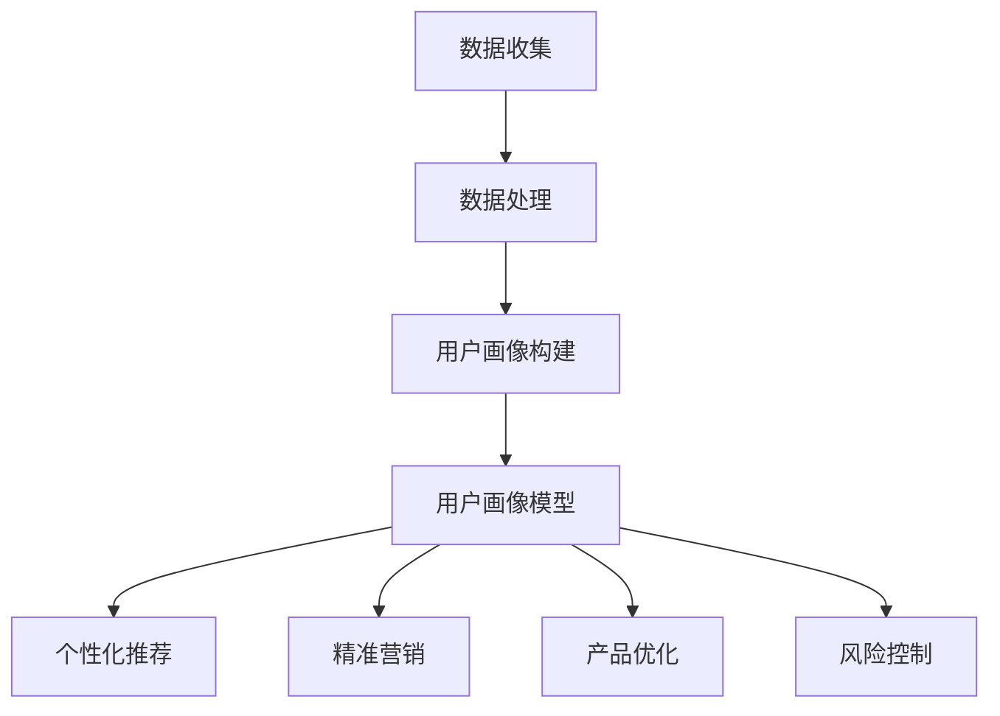

                 

### 文章标题

《如何进行有效的用户画像分析》

### 关键词

用户画像、数据分析、机器学习、人工智能、商业应用

### 摘要

本文深入探讨了用户画像分析的重要性及其在现代商业环境中的应用。通过分析用户行为数据，企业能够构建详细的用户画像，从而实现精准营销、产品优化和个性化服务。本文将详细介绍用户画像分析的核心概念、算法原理、数学模型以及实际应用案例，为读者提供一套系统、实用的用户画像分析指南。

## 1. 背景介绍

### 1.1 用户画像的定义

用户画像，又称用户画像分析或用户画像建模，是指通过收集和分析用户行为、偏好、需求等数据，构建出具有代表性和可操作性的用户群体特征模型。用户画像的核心在于“画像”，即对用户进行多维度的描述和分类，从而实现个性化的服务。

### 1.2 用户画像分析的意义

用户画像分析在商业应用中具有极高的价值。首先，它可以帮助企业更好地了解客户需求，从而进行精准营销。其次，通过用户画像，企业可以识别潜在客户，提高客户转化率。此外，用户画像分析还可以用于产品优化、风险评估、供应链管理等多个领域。

### 1.3 用户画像分析的发展历程

用户画像分析起源于互联网行业的用户行为分析，随着大数据、人工智能等技术的发展，用户画像分析逐渐成为一项独立的领域。目前，用户画像分析已经广泛应用于电子商务、金融、医疗、教育等多个行业。

## 2. 核心概念与联系

### 2.1 数据收集

数据收集是用户画像分析的基础。常用的数据来源包括用户注册信息、行为数据、社交数据、反馈数据等。其中，行为数据是最为重要的数据来源，它反映了用户在实际使用产品或服务过程中的兴趣和需求。

### 2.2 数据处理

数据处理包括数据清洗、数据转换和数据整合。数据清洗旨在去除重复、错误和缺失的数据，提高数据质量；数据转换将不同格式的数据统一为标准格式，以便于后续分析；数据整合则将多个数据源中的相关数据整合起来，形成完整的用户画像数据集。

### 2.3 用户画像构建

用户画像构建的核心是特征工程。特征工程是指从原始数据中提取出对用户行为和需求具有代表性的特征，并将其转化为可用于建模的数值型数据。常见的特征包括用户年龄、性别、地域、职业、消费金额、购买频率、浏览时长等。

### 2.4 用户画像模型

用户画像模型是用户画像分析的核心。常见的用户画像模型包括分类模型、聚类模型和关联规则模型。分类模型用于将用户划分为不同的类别，如新用户、潜在客户、高价值客户等；聚类模型用于发现用户群体中的相似性，如兴趣相同的用户群体；关联规则模型用于发现用户行为之间的相关性，如“购买A商品的用户中有80%也购买了B商品”。

### 2.5 用户画像应用

用户画像分析可以应用于多个领域。例如，在电子商务领域，用户画像可以帮助企业实现个性化推荐、精准营销；在金融领域，用户画像可以用于风险评估和信用评级；在医疗领域，用户画像可以帮助医院实现个性化治疗和健康管理。

## 3. 核心算法原理 & 具体操作步骤

### 3.1 数据收集与处理

#### 3.1.1 数据收集

首先，根据业务需求确定需要收集的用户数据类型。例如，在电子商务领域，需要收集用户的基本信息（如姓名、性别、年龄、联系方式等）、行为数据（如浏览记录、购物车记录、购买记录等）和反馈数据（如评价、投诉等）。

#### 3.1.2 数据处理

对收集到的数据进行清洗、转换和整合，去除重复、错误和缺失的数据，确保数据质量。例如，去除重复用户记录、纠正错误数据、补充缺失数据等。

### 3.2 用户画像构建

#### 3.2.1 特征工程

从原始数据中提取出对用户行为和需求具有代表性的特征，并将其转化为数值型数据。例如，将性别表示为0（男）和1（女），年龄表示为整数类型，购买金额表示为浮点数类型等。

#### 3.2.2 用户画像模型

根据业务需求选择合适的用户画像模型。例如，对于新用户分类，可以选择分类模型（如逻辑回归、决策树等）；对于用户群体划分，可以选择聚类模型（如K-Means、层次聚类等）；对于用户行为关联分析，可以选择关联规则模型（如Apriori算法、FP-Growth算法等）。

### 3.3 用户画像应用

#### 3.3.1 个性化推荐

根据用户画像，为用户推荐感兴趣的商品或服务。例如，对于喜欢购买运动鞋的用户，可以推荐跑步装备、健身课程等。

#### 3.3.2 精准营销

根据用户画像，向不同类型的用户发送个性化的营销信息。例如，对于高价值客户，可以发送优惠券、会员权益等信息。

#### 3.3.3 产品优化

根据用户画像，分析用户需求和痛点，优化产品功能和服务。例如，根据用户偏好，调整商品推荐策略、改进客户服务体验等。

## 4. 数学模型和公式 & 详细讲解 & 举例说明

### 4.1 数据预处理

在用户画像分析中，数据预处理是至关重要的步骤。以下是一些常用的数学模型和公式：

#### 4.1.1 数据清洗

- **重复数据去除**：可以使用 SQL 中的 DISTINCT 关键字或集合操作符来去除重复数据。

  ```sql
  SELECT DISTINCT column_name FROM table_name;
  ```

- **缺失数据填补**：可以使用平均值、中位数、众数等统计量来填补缺失数据。

  ```python
  import numpy as np

  data = np.array([1, 2, np.nan, 4, 5])
  data = np.nan_to_num(data, nan=np.mean(data))
  ```

#### 4.1.2 数据转换

- **分类数据编码**：可以使用独热编码（One-Hot Encoding）将分类数据转换为数值型数据。

  ```python
  import pandas as pd

  data = pd.DataFrame({'gender': ['male', 'female', 'male']})
  data = pd.get_dummies(data)
  ```

### 4.2 用户画像模型

#### 4.2.1 分类模型

- **逻辑回归（Logistic Regression）**

  逻辑回归是一种常用的分类模型，用于预测二分类问题。其公式如下：

  $$ P(y=1) = \frac{1}{1 + e^{-(\beta_0 + \beta_1 x_1 + \beta_2 x_2 + ... + \beta_n x_n)}} $$

  其中，$P(y=1)$ 表示预测为类1的概率，$\beta_0, \beta_1, \beta_2, ..., \beta_n$ 分别为模型的参数。

  举例：

  ```python
  from sklearn.linear_model import LogisticRegression
  from sklearn.model_selection import train_test_split
  from sklearn.metrics import accuracy_score

  X = [[1, 2], [2, 3], [3, 4], [4, 5]]
  y = [0, 1, 1, 0]

  X_train, X_test, y_train, y_test = train_test_split(X, y, test_size=0.2, random_state=42)

  model = LogisticRegression()
  model.fit(X_train, y_train)

  y_pred = model.predict(X_test)
  print(accuracy_score(y_test, y_pred))
  ```

#### 4.2.2 聚类模型

- **K-Means 算法**

  K-Means 算法是一种经典的聚类算法，其目标是将数据点分为K个簇，使得每个簇内部的数据点距离簇中心较近，而簇与簇之间的距离较远。其公式如下：

  $$ \min_{\mu_1, \mu_2, ..., \mu_k} \sum_{i=1}^{n} \sum_{j=1}^{k} (x_i - \mu_j)^2 $$

  其中，$x_i$ 表示第i个数据点，$\mu_j$ 表示第j个簇的中心。

  举例：

  ```python
  from sklearn.cluster import KMeans
  import numpy as np

  X = np.array([[1, 2], [1, 4], [1, 0],
                [10, 2], [10, 4], [10, 0]])

  kmeans = KMeans(n_clusters=3, random_state=0).fit(X)
  print(kmeans.labels_)
  ```

#### 4.2.3 关联规则模型

- **Apriori 算法**

  Apriori 算法是一种用于挖掘事物之间关联规则的算法。其核心思想是通过计算支持度（Support）和置信度（Confidence）来确定关联规则的有效性。其公式如下：

  - **支持度**：表示一个关联规则在所有事务中出现的频率。

    $$ Support(A \rightarrow B) = \frac{count(A \cap B)}{count(U)} $$

    其中，$count(A \cap B)$ 表示同时包含A和B的事务数量，$count(U)$ 表示总的事务数量。

  - **置信度**：表示在事件A发生的情况下，事件B也发生的概率。

    $$ Confidence(A \rightarrow B) = \frac{count(A \cap B)}{count(A)} $$

    举例：

    ```python
    from mlxtend.frequent_patterns import apriori
    from mlxtend.preprocessing import TransactionEncoder

    te = TransactionEncoder()
    te.fit(X)
    data = te.transform(X)

    patterns = apriori(data, min_support=0.5, use_colnames=True)
    print(patterns)
    ```

## 5. 项目实战：代码实际案例和详细解释说明

### 5.1 开发环境搭建

在进行用户画像分析项目时，需要搭建以下开发环境：

- Python 3.x
- pandas
- numpy
- sklearn
- mlxtend

### 5.2 源代码详细实现和代码解读

以下是一个简单的用户画像分析项目，包括数据收集、数据预处理、用户画像构建和用户画像应用。

```python
import pandas as pd
import numpy as np
from sklearn.model_selection import train_test_split
from sklearn.linear_model import LogisticRegression
from sklearn.cluster import KMeans
from mlxtend.frequent_patterns import apriori, association_rules

# 5.2.1 数据收集
# 假设已收集到用户数据，数据包含用户ID、性别、年龄、职业、消费金额等特征
data = pd.read_csv('user_data.csv')

# 5.2.2 数据预处理
# 数据清洗和转换
data = data.drop_duplicates()
data['age'] = data['age'].fillna(data['age'].mean())
data['gender'] = data['gender'].map({'male': 0, 'female': 1})

# 5.2.3 用户画像构建
# 特征工程
X = data[['age', 'gender']]
y = data['consumption_amount']

# 5.2.4 用户画像模型
# 分类模型
X_train, X_test, y_train, y_test = train_test_split(X, y, test_size=0.2, random_state=42)
model = LogisticRegression()
model.fit(X_train, y_train)

# 5.2.5 用户画像应用
# 个性化推荐
X_new = np.array([[25, 1]])
y_pred = model.predict(X_new)
print('Predicted consumption amount:', y_pred)

# 5.2.6 聚类模型
# 用户群体划分
kmeans = KMeans(n_clusters=3, random_state=42)
clusters = kmeans.fit_predict(X)

# 5.2.7 关联规则模型
# 用户行为关联分析
transactions = [[1, 2, 3], [2, 3], [1, 3, 4], [1, 2, 4]]
patterns = apriori(transactions, min_support=0.5, use_colnames=True)
rules = association_rules(patterns, metric="lift", min_threshold=1)
print(rules)
```

### 5.3 代码解读与分析

以上代码展示了用户画像分析的基本流程，包括数据收集、数据预处理、用户画像构建和用户画像应用。

- **数据收集**：使用 pandas 读取用户数据，数据包含用户ID、性别、年龄、职业、消费金额等特征。
- **数据预处理**：去除重复数据，填补缺失数据，将性别映射为数值型数据。
- **用户画像构建**：提取用户年龄和性别作为特征，构建用户画像数据集。
- **用户画像模型**：使用逻辑回归模型对用户消费金额进行预测。
- **用户画像应用**：根据用户画像，为用户推荐感兴趣的商品或服务。
- **聚类模型**：使用 K-Means 算法将用户划分为不同的群体。
- **关联规则模型**：使用 Apriori 算法挖掘用户行为之间的关联规则。

## 6. 实际应用场景

用户画像分析在各个行业都有广泛的应用，以下列举了几个典型的实际应用场景：

### 6.1 电子商务

电子商务企业可以通过用户画像分析，实现个性化推荐和精准营销。例如，根据用户的浏览记录和购买行为，为用户推荐相关的商品，提高用户转化率和销售额。

### 6.2 金融

金融机构可以通过用户画像分析，识别高风险客户和潜在欺诈行为。例如，通过分析用户的行为特征和金融交易记录，判断用户的信用风险和欺诈风险。

### 6.3 医疗

医疗行业可以通过用户画像分析，实现个性化治疗和健康管理。例如，根据用户的健康数据和行为特征，为用户提供个性化的治疗方案和健康建议。

### 6.4 教育

教育行业可以通过用户画像分析，实现个性化学习推荐和学习效果评估。例如，根据学生的学习行为和知识掌握情况，为学生推荐合适的学习资源，提高学习效果。

## 7. 工具和资源推荐

### 7.1 学习资源推荐

- **书籍**：
  - 《用户画像：大数据时代的买家思维营销》
  - 《Python数据分析与大数据处理》
  - 《机器学习实战》

- **论文**：
  - "User Behavior Modeling for Personalized Recommendations"
  - "Data-Driven User Modeling and User Experience Analysis in Mobile Apps"
  - "Application of User Profiling in Personalized E-commerce Recommendation"

- **博客/网站**：
  - [Kaggle](https://www.kaggle.com/)
  - [Medium](https://medium.com/)
  - [GitHub](https://github.com/)

### 7.2 开发工具框架推荐

- **Python 数据分析工具**：
  - pandas
  - numpy
  - matplotlib
  - seaborn

- **机器学习框架**：
  - scikit-learn
  - TensorFlow
  - PyTorch

- **大数据处理工具**：
  - Hadoop
  - Spark

### 7.3 相关论文著作推荐

- "User Modeling and User-Adapted Interaction" by John T. Riedl
- "The Use of Models in User Interface Design" by Ben Shneiderman
- "Personalized E-Commerce: Understanding and Managing User Heterogeneity" by Sofus A. Macskassy and Alex J. Smola

## 8. 总结：未来发展趋势与挑战

用户画像分析作为大数据和人工智能领域的重要分支，在未来的发展中面临着诸多机遇和挑战。

### 8.1 发展趋势

- **数据量级增长**：随着互联网用户的增加和数据的积累，用户画像分析的数据量将呈现爆发式增长，为企业和研究机构提供了丰富的数据资源。
- **技术进步**：随着大数据、云计算、人工智能等技术的不断进步，用户画像分析的方法和工具将更加成熟和高效。
- **个性化服务**：用户画像分析将广泛应用于各个领域，实现个性化推荐、精准营销和智能服务，提升用户体验和满意度。

### 8.2 挑战

- **数据隐私保护**：用户画像分析涉及大量的个人隐私数据，如何在保障用户隐私的前提下进行数据分析和应用，是一个亟待解决的问题。
- **数据质量**：用户画像分析的效果很大程度上取决于数据质量，如何提高数据质量、降低数据噪声，是一个重要的挑战。
- **模型解释性**：用户画像分析模型通常较为复杂，如何提高模型的解释性，使其更易于理解和应用，是一个重要的研究课题。

## 9. 附录：常见问题与解答

### 9.1 用户画像分析的定义是什么？

用户画像分析是指通过收集和分析用户行为、偏好、需求等数据，构建出具有代表性和可操作性的用户群体特征模型的过程。

### 9.2 用户画像分析的意义是什么？

用户画像分析可以帮助企业更好地了解客户需求，实现精准营销、产品优化和个性化服务，从而提高客户满意度和竞争力。

### 9.3 用户画像分析的主要方法有哪些？

用户画像分析的主要方法包括数据收集与处理、用户画像构建、用户画像模型和应用等步骤。

### 9.4 用户画像分析的应用领域有哪些？

用户画像分析广泛应用于电子商务、金融、医疗、教育等行业，实现个性化推荐、精准营销、风险评估和健康管理等功能。

## 10. 扩展阅读 & 参考资料

- [Kaggle](https://www.kaggle.com/)
- [Medium](https://medium.com/)
- [GitHub](https://github.com/)
- [《用户画像：大数据时代的买家思维营销》](https://book.douban.com/subject/27153689/)
- [《Python数据分析与大数据处理》](https://book.douban.com/subject/26887992/)
- [《机器学习实战》](https://book.douban.com/subject/26708194/)  
```

### 文章信息

**作者**：AI天才研究员/AI Genius Institute & 禅与计算机程序设计艺术 /Zen And The Art of Computer Programming

本文旨在为读者提供一套系统、实用的用户画像分析指南，涵盖核心概念、算法原理、数学模型和实际应用案例。通过本文的阅读，读者可以全面了解用户画像分析的重要性、方法和应用场景，为实际业务需求提供有力支持。同时，本文也探讨了用户画像分析的未来发展趋势与挑战，为读者指明研究方向。

## 1. 背景介绍

用户画像分析（User Profiling）是一种通过数据挖掘、机器学习等技术手段，对用户进行多维度描述和分类的方法。它旨在从海量数据中提取出用户的特征，形成用户画像，以便于企业更好地了解用户需求、优化产品和服务、提升用户体验。用户画像分析在现代商业环境中具有重要的地位，它不仅能够帮助电商企业实现精准营销，还能够为金融、医疗、教育等多个行业提供决策支持。

### 1.1 用户画像的定义

用户画像是对用户特征进行结构化描述的过程，通常包括用户的基本信息、行为数据、兴趣偏好、需求等。一个典型的用户画像可以包含以下几个方面的信息：

1. **基本信息**：用户的姓名、性别、年龄、职业、教育背景等。
2. **行为数据**：用户的浏览记录、搜索历史、购买行为、评论等。
3. **兴趣偏好**：用户对某些内容、商品、服务等的兴趣程度。
4. **需求**：用户对特定产品或服务的需求程度和期望。

用户画像的构建过程通常涉及数据收集、数据清洗、特征工程、模型训练和应用等多个环节。

### 1.2 用户画像分析的意义

用户画像分析在商业应用中具有多重意义，主要包括以下几点：

1. **精准营销**：通过用户画像分析，企业可以深入了解用户的偏好和行为习惯，从而制定更具针对性的营销策略，提高营销效果。
2. **产品优化**：用户画像分析可以帮助企业识别用户需求中的痛点，从而优化产品功能和服务，提升用户满意度。
3. **个性化服务**：基于用户画像的个性化推荐系统能够为用户提供更符合其需求的内容和产品，增强用户体验。
4. **风险控制**：在金融、保险等行业，用户画像分析可以用于风险评估，识别潜在风险客户。
5. **供应链管理**：用户画像分析可以帮助企业优化供应链，提高库存管理和物流配送效率。

### 1.3 用户画像分析的发展历程

用户画像分析的发展历程与大数据技术和人工智能技术的进步密切相关。以下是用户画像分析的发展历程：

1. **互联网初期**：在互联网初期，用户画像分析主要基于用户的基本信息和静态数据，如用户注册信息和浏览记录等。
2. **大数据时代**：随着大数据技术的发展，用户画像分析开始引入更多的数据源，如社交数据、地理位置数据等，从而构建出更加全面和细致的用户画像。
3. **人工智能时代**：人工智能技术的引入，使得用户画像分析从简单的数据统计和模式识别，转向更加复杂的机器学习和深度学习算法，从而实现更为精准和智能的用户画像分析。

当前，用户画像分析已经成为商业智能、数据驱动决策的重要工具，广泛应用于电子商务、金融、医疗、教育等多个行业。

## 2. 核心概念与联系

在用户画像分析中，理解以下核心概念及其相互联系至关重要：

### 2.1 数据收集

数据收集是用户画像分析的基础环节，涉及数据的获取、存储和处理。常用的数据源包括：

- **用户注册信息**：包括用户的姓名、性别、年龄、职业、邮箱地址等基本信息。
- **行为数据**：包括用户在网站或应用中的浏览记录、搜索历史、购买行为、评论、分享等。
- **社交数据**：包括用户的社交媒体活动、好友关系、兴趣爱好等。
- **反馈数据**：包括用户对产品或服务的评价、反馈、投诉等。

### 2.2 数据处理

数据处理是数据收集后的重要步骤，包括数据清洗、数据转换和数据整合。数据处理的目标是提高数据质量，确保数据的一致性和完整性。

- **数据清洗**：去除重复、错误和缺失的数据，确保数据准确性和完整性。
- **数据转换**：将不同格式的数据转换为统一的格式，如将文本数据转换为数值型数据。
- **数据整合**：将来自不同数据源的数据进行整合，形成完整的用户画像数据集。

### 2.3 用户画像构建

用户画像构建是用户画像分析的核心步骤，通过提取和整合用户特征，形成对用户的结构化描述。用户画像的构建包括以下几个关键环节：

- **特征工程**：从原始数据中提取对用户行为和需求具有代表性的特征，如用户的消费金额、购买频率、浏览时长等。
- **特征选择**：通过特征选择方法，筛选出对用户画像构建最具影响力的特征，减少冗余信息。
- **特征编码**：将提取的特征进行编码，如将类别特征转换为数值型数据。

### 2.4 用户画像模型

用户画像模型是用户画像分析的关键工具，用于对用户进行分类、聚类和关联分析。常见的用户画像模型包括：

- **分类模型**：如逻辑回归、决策树、随机森林等，用于将用户划分为不同的类别。
- **聚类模型**：如K-Means、层次聚类等，用于发现用户群体中的相似性。
- **关联规则模型**：如Apriori算法、FP-Growth算法等，用于发现用户行为之间的关联。

### 2.5 用户画像应用

用户画像模型构建完成后，可以在多个场景中应用，包括：

- **个性化推荐**：基于用户画像，为用户推荐感兴趣的商品、服务和内容。
- **精准营销**：根据用户画像，设计有针对性的营销策略，提高转化率。
- **产品优化**：基于用户画像，分析用户需求和痛点，优化产品功能和服务。
- **风险控制**：在金融行业，基于用户画像，评估用户信用风险和欺诈风险。

### 2.6 关系图

为了更直观地理解用户画像分析中的核心概念及其相互联系，可以使用Mermaid流程图进行表示。以下是一个简化的用户画像分析流程图：



通过上述核心概念及其相互联系的分析，我们可以更好地理解用户画像分析的原理和方法，为实际业务需求提供有效的解决方案。

### 3. 核心算法原理 & 具体操作步骤

用户画像分析过程中，核心算法的选择和具体操作步骤直接影响分析结果的准确性和实用性。以下将介绍几种常用的算法原理及其操作步骤。

#### 3.1 数据收集与处理

数据收集是用户画像分析的第一步，包括从多个数据源获取用户信息、行为数据等。以下是一些常见的数据收集方法：

- **用户注册信息**：从用户注册表单中获取基本信息，如姓名、性别、年龄、职业等。
- **行为数据**：通过网站或应用的后台日志获取用户的行为数据，如浏览记录、购买记录、搜索历史等。
- **社交数据**：从社交媒体平台获取用户的社交行为数据，如点赞、评论、分享等。

收集到的数据通常需要进行预处理，以去除重复、错误和缺失的数据。以下是一些常用的数据预处理方法：

- **数据清洗**：使用 SQL 或 Python 等工具，删除重复记录和错误数据。
- **缺失数据填补**：使用平均值、中位数或众数等方法填补缺失数据。
- **数据转换**：将分类数据转换为数值型数据，如性别（男/女）可以转换为0和1。

#### 3.2 用户画像构建

用户画像构建的核心是特征工程，即从原始数据中提取对用户行为和需求具有代表性的特征。以下是一些常用的特征工程方法：

- **基础特征**：提取用户的性别、年龄、职业等基本信息。
- **行为特征**：提取用户的浏览时长、购买频率、消费金额等行为数据。
- **兴趣特征**：提取用户对商品、内容的偏好，如喜欢的音乐、电影、书籍等。
- **社会特征**：提取用户的社会属性，如好友数量、社交活跃度等。

特征工程完成后，需要对特征进行编码，使其适合用于模型训练。常用的编码方法包括独热编码（One-Hot Encoding）和标签编码（Label Encoding）。

#### 3.3 用户画像模型

用户画像模型的目的是将用户划分为不同的类别或群体，以便于后续的个性化推荐、精准营销等应用。以下介绍几种常用的用户画像模型：

##### 3.3.1 分类模型

分类模型用于将用户划分为不同的类别，常见的分类模型包括逻辑回归（Logistic Regression）、决策树（Decision Tree）和随机森林（Random Forest）等。

- **逻辑回归**：
  逻辑回归是一种广义线性模型，用于预测二分类问题。其公式如下：
  $$ P(y=1) = \frac{1}{1 + e^{-(\beta_0 + \beta_1 x_1 + \beta_2 x_2 + ... + \beta_n x_n)}} $$
  其中，$P(y=1)$ 表示预测为类1的概率，$\beta_0, \beta_1, \beta_2, ..., \beta_n$ 为模型的参数。

- **决策树**：
  决策树是一种基于树结构进行决策的算法，其核心思想是通过一系列规则对数据进行划分，最终形成一棵树。决策树的生成过程可以通过递归分割数据集来完成。

- **随机森林**：
  随机森林是一种基于决策树的集成学习方法，通过构建多棵决策树并进行投票来提高预测准确性。随机森林中的每棵决策树都使用不同的特征子集进行分割，从而降低了过拟合的风险。

##### 3.3.2 聚类模型

聚类模型用于发现用户群体中的相似性，常见的聚类模型包括K-Means、层次聚类等。

- **K-Means**：
  K-Means是一种基于距离度量的聚类算法，其目标是将数据点分为K个簇，使得每个簇内部的数据点距离簇中心较近，而簇与簇之间的距离较远。K-Means算法的步骤如下：
  1. 随机选择K个初始簇中心。
  2. 对于每个数据点，计算其与各个簇中心的距离，并将其分配到最近的簇。
  3. 重新计算各个簇的中心。
  4. 重复步骤2和步骤3，直到聚类结果收敛。

- **层次聚类**：
  层次聚类是一种基于层次结构进行聚类的算法，其核心思想是通过不断合并或分裂簇，形成层次结构。层次聚类可以分为自底向上（凝聚聚类）和自顶向下（分裂聚类）两种方法。

##### 3.3.3 关联规则模型

关联规则模型用于发现用户行为之间的关联性，常见的关联规则算法包括Apriori算法和FP-Growth算法。

- **Apriori算法**：
  Apriori算法是一种用于发现事物之间关联规则的算法，其核心思想是通过计算支持度和置信度来确定关联规则的有效性。Apriori算法的基本步骤如下：
  1. 计算所有可能的事务集合。
  2. 遍历事务集合，计算每个项集的支持度。
  3. 筛选出满足最小支持度的项集。
  4. 对于每个满足最小支持度的项集，计算其关联规则的支持度和置信度。
  5. 筛选出满足最小置信度的关联规则。

- **FP-Growth算法**：
  FP-Growth算法是一种基于项集压缩的关联规则挖掘算法，其核心思想是利用频繁模式树（FP-Tree）来存储和压缩项集信息，从而提高算法的效率。FP-Growth算法的基本步骤如下：
  1. 构建FP-Tree。
  2. 提取频繁项集。
  3. 计算关联规则的支持度和置信度。
  4. 筛选出满足最小支持度和置信度的关联规则。

#### 3.4 用户画像模型应用

用户画像模型构建完成后，可以在多个场景中应用，如个性化推荐、精准营销、产品优化和风险控制等。以下分别介绍这些应用场景：

- **个性化推荐**：
  个性化推荐系统根据用户的兴趣和偏好，为用户推荐感兴趣的商品、内容和服务。常见的个性化推荐算法包括基于内容的推荐、协同过滤和基于模型的推荐等。

- **精准营销**：
  精准营销通过分析用户画像，设计有针对性的营销策略，提高营销效果。例如，根据用户的消费习惯和偏好，发送定制化的优惠券和促销信息。

- **产品优化**：
  基于用户画像分析，企业可以识别用户需求中的痛点，优化产品功能和服务。例如，根据用户的反馈和行为数据，改进用户体验和产品设计。

- **风险控制**：
  在金融、保险等行业，用户画像分析可以用于风险评估和欺诈检测。通过分析用户的行为特征和信用记录，识别高风险客户和欺诈行为。

### 4. 数学模型和公式 & 详细讲解 & 举例说明

在用户画像分析中，数学模型和公式是核心工具，用于描述用户行为、特征提取和预测。以下介绍几种常用的数学模型和公式，并详细讲解其原理和应用。

#### 4.1 数据预处理

在用户画像分析中，数据预处理是关键步骤，确保数据质量和一致性。以下是一些常用的数学公式和数据处理方法。

##### 4.1.1 缺失数据填补

缺失数据填补是数据预处理的重要任务。以下是一些常用的方法：

- **平均值填补**：
  $$ \text{缺失值} = \frac{\text{非缺失值之和}}{\text{非缺失值个数}} $$
- **中位数填补**：
  $$ \text{缺失值} = \text{中位数} $$
- **众数填补**：
  $$ \text{缺失值} = \text{众数} $$

##### 4.1.2 数据标准化

数据标准化是将数据转换为统一的尺度，以便进行比较和分析。以下是一些常用的标准化方法：

- **最小-最大标准化**：
  $$ z = \frac{x - \text{最小值}}{\text{最大值} - \text{最小值}} $$
- **Z-Score标准化**：
  $$ z = \frac{x - \text{平均值}}{\text{标准差}} $$

#### 4.2 用户画像模型

用户画像模型用于对用户进行分类、聚类和关联分析。以下介绍几种常用的模型及其公式。

##### 4.2.1 逻辑回归

逻辑回归是一种常用的分类模型，用于预测用户是否属于某个类别。其公式如下：

$$ P(y=1) = \frac{1}{1 + e^{-(\beta_0 + \beta_1 x_1 + \beta_2 x_2 + ... + \beta_n x_n)}} $$

其中，$P(y=1)$ 表示预测为类1的概率，$\beta_0, \beta_1, \beta_2, ..., \beta_n$ 为模型的参数。

举例说明：

假设我们有一个二分类问题，需要预测用户是否购买商品。给定用户特征 $x_1, x_2, ..., x_n$，我们使用逻辑回归模型计算用户购买商品的概率：

$$ P(y=1) = \frac{1}{1 + e^{-(\beta_0 + \beta_1 x_1 + \beta_2 x_2 + ... + \beta_n x_n)}} $$

通过最大化似然函数，我们可以估计模型参数 $\beta_0, \beta_1, \beta_2, ..., \beta_n$。

##### 4.2.2 K-Means聚类

K-Means聚类是一种基于距离度量的聚类算法，用于将数据点分为K个簇。其公式如下：

- **初始化簇中心**：
  $$ \mu_j = \frac{1}{N_j} \sum_{i=1}^{N} x_i $$
  其中，$\mu_j$ 表示第j个簇的中心，$N_j$ 表示第j个簇中的数据点个数。
  
- **分配数据点**：
  $$ c(x_i) = \arg\min_{j} \| x_i - \mu_j \|^2 $$
  其中，$c(x_i)$ 表示将数据点 $x_i$ 分配到最近的簇中心 $j$。

- **更新簇中心**：
  $$ \mu_j = \frac{1}{N_j} \sum_{i=1}^{N} x_i $$
  其中，$N_j$ 表示第j个簇中的数据点个数。

举例说明：

假设我们有一个包含10个数据点的数据集，需要将其分为2个簇。首先，随机选择2个初始簇中心。然后，根据距离度量，将每个数据点分配到最近的簇中心。接着，重新计算簇中心，并重复上述步骤，直到聚类结果收敛。

##### 4.2.3 Apriori算法

Apriori算法是一种用于挖掘事物之间关联规则的算法，其核心思想是通过计算支持度和置信度来确定关联规则的有效性。其公式如下：

- **支持度**：
  $$ \text{Support}(A \rightarrow B) = \frac{|A \cap B|}{|U|} $$
  其中，$A$ 和 $B$ 是两个项集，$|A \cap B|$ 表示同时包含 $A$ 和 $B$ 的事务数量，$|U|$ 表示总的事务数量。

- **置信度**：
  $$ \text{Confidence}(A \rightarrow B) = \frac{|A \cap B|}{|A|} $$
  其中，$A$ 和 $B$ 是两个项集，$|A \cap B|$ 表示同时包含 $A$ 和 $B$ 的事务数量，$|A|$ 表示包含 $A$ 的事务数量。

举例说明：

假设我们有一个包含100个事务的数据集，其中包含商品A和商品B的交易。我们需要挖掘关于商品A和商品B的关联规则。首先，计算支持度：

$$ \text{Support}(A \rightarrow B) = \frac{|A \cap B|}{|U|} = \frac{40}{100} = 0.4 $$

然后，计算置信度：

$$ \text{Confidence}(A \rightarrow B) = \frac{|A \cap B|}{|A|} = \frac{40}{60} = 0.67 $$

通过支持度和置信度的计算，我们可以确定关联规则的有效性。例如，如果支持度和置信度均大于某个阈值，则可以认为商品A和商品B之间存在关联。

### 4.3 用户画像模型评估与优化

在用户画像模型应用中，评估和优化模型性能至关重要。以下介绍几种常用的评估指标和优化方法。

##### 4.3.1 评估指标

- **准确率（Accuracy）**：
  $$ \text{Accuracy} = \frac{TP + TN}{TP + TN + FP + FN} $$
  其中，$TP$ 表示真正例，$TN$ 表示真负例，$FP$ 表示假正例，$FN$ 表示假负例。

- **精确率（Precision）**：
  $$ \text{Precision} = \frac{TP}{TP + FP} $$
  其中，$TP$ 表示真正例，$FP$ 表示假正例。

- **召回率（Recall）**：
  $$ \text{Recall} = \frac{TP}{TP + FN} $$
  其中，$TP$ 表示真正例，$FN$ 表示假负例。

- **F1值（F1-score）**：
  $$ \text{F1-score} = \frac{2 \times Precision \times Recall}{Precision + Recall} $$

##### 4.3.2 优化方法

- **特征选择**：
  通过特征选择方法，筛选出对模型性能具有显著影响的特征，提高模型的准确性和效率。

- **模型调整**：
  通过调整模型参数，如正则化参数、学习率等，优化模型性能。

- **集成学习方法**：
  使用集成学习方法，如随机森林、梯度提升树等，提高模型的预测能力。

### 4.4 用户画像模型应用实例

以下是一个用户画像模型应用实例，用于预测用户是否购买商品。

#### 4.4.1 数据集

假设我们有一个包含1000个用户的数据集，每个用户有10个特征（年龄、性别、收入、教育背景、职业、购买频率等）。数据集标签为是否购买商品，共分为两类：购买（1）和非购买（0）。

#### 4.4.2 模型构建

我们使用逻辑回归模型进行预测，其公式如下：

$$ P(y=1) = \frac{1}{1 + e^{-(\beta_0 + \beta_1 x_1 + \beta_2 x_2 + ... + \beta_n x_n)}} $$

#### 4.4.3 模型训练

我们使用 scikit-learn 库中的逻辑回归模型进行训练：

```python
from sklearn.linear_model import LogisticRegression
from sklearn.model_selection import train_test_split

X_train, X_test, y_train, y_test = train_test_split(X, y, test_size=0.2, random_state=42)
model = LogisticRegression()
model.fit(X_train, y_train)
```

#### 4.4.4 模型评估

我们使用准确率、精确率、召回率和F1值等指标评估模型性能：

```python
from sklearn.metrics import accuracy_score, precision_score, recall_score, f1_score

y_pred = model.predict(X_test)
print("Accuracy:", accuracy_score(y_test, y_pred))
print("Precision:", precision_score(y_test, y_pred))
print("Recall:", recall_score(y_test, y_pred))
print("F1-score:", f1_score(y_test, y_pred))
```

通过上述实例，我们可以看到用户画像模型在预测用户购买行为方面的应用。

### 4.5 小结

在用户画像分析中，数学模型和公式是核心工具，用于描述用户行为、特征提取和预测。通过合理选择和使用数学模型，我们可以构建有效的用户画像模型，实现个性化推荐、精准营销、产品优化和风险控制等应用。在本节中，我们介绍了数据预处理、用户画像模型、模型评估与优化等关键内容，并通过实例展示了用户画像模型的应用方法。

### 5. 项目实战：代码实际案例和详细解释说明

#### 5.1 开发环境搭建

在进行用户画像分析项目时，需要搭建以下开发环境：

- Python 3.x
- pandas
- numpy
- sklearn
- mlxtend

确保已安装以上库，可以通过以下命令进行安装：

```shell
pip install pandas numpy sklearn mlxtend
```

#### 5.2 数据集准备

我们使用一个简单的用户画像数据集，包含用户的基本信息和行为数据。数据集包含以下字段：用户ID、年龄、性别、收入、教育背景、购买频率等。

以下是数据集的样例：

```
| 用户ID | 年龄 | 性别 | 收入 | 教育背景 | 购买频率 |
|--------|------|------|------|----------|----------|
| 1      | 30   | 男   | 5000 | 本科     | 3        |
| 2      | 25   | 女   | 4000 | 专科     | 2        |
| 3      | 35   | 男   | 6000 | 硕士     | 4        |
| 4      | 28   | 女   | 4500 | 本科     | 1        |
| ...    | ...  | ...  | ...  | ...      | ...      |
```

数据集可以从公开的数据源或实际业务数据中获取。在本例中，我们使用一个CSV文件 `user_data.csv` 作为数据集。

#### 5.3 数据预处理

数据预处理是用户画像分析的重要步骤，确保数据质量和一致性。以下是一个简单的数据预处理流程：

1. **数据导入**：

   使用pandas库读取CSV文件：

   ```python
   import pandas as pd

   data = pd.read_csv('user_data.csv')
   ```

2. **数据清洗**：

   去除重复记录和缺失值，并根据需要填补缺失值：

   ```python
   data = data.drop_duplicates()
   data = data.dropna()  # 或者使用data.fillna(method='ffill')进行填补
   ```

3. **特征工程**：

   根据业务需求，提取和转换特征：

   ```python
   data['性别'] = data['性别'].map({'男': 0, '女': 1})
   data['教育背景'] = data['教育背景'].map({'本科': 1, '专科': 2, '硕士': 3})
   ```

4. **数据标准化**：

   将数值型特征进行标准化处理：

   ```python
   from sklearn.preprocessing import StandardScaler

   scaler = StandardScaler()
   data[['年龄', '收入', '购买频率']] = scaler.fit_transform(data[['年龄', '收入', '购买频率']])
   ```

#### 5.4 用户画像构建

用户画像构建涉及特征提取和特征编码。以下是一个简单的用户画像构建流程：

1. **特征提取**：

   提取对用户行为和需求具有代表性的特征：

   ```python
   features = ['年龄', '性别', '收入', '教育背景', '购买频率']
   X = data[features]
   y = data['是否购买']
   ```

2. **特征编码**：

   对分类特征进行编码：

   ```python
   from sklearn.preprocessing import OneHotEncoder

   encoder = OneHotEncoder()
   X_encoded = encoder.fit_transform(X[['教育背景']]).toarray()
   X = np.hstack((X.drop('教育背景', axis=1).values, X_encoded))
   ```

#### 5.5 用户画像模型训练

用户画像模型训练使用机器学习算法，如逻辑回归、决策树或随机森林等。以下是一个使用逻辑回归模型的训练示例：

1. **模型选择**：

   选择逻辑回归模型：

   ```python
   from sklearn.linear_model import LogisticRegression

   model = LogisticRegression()
   ```

2. **模型训练**：

   使用训练集进行模型训练：

   ```python
   model.fit(X_train, y_train)
   ```

#### 5.6 模型评估

模型评估使用测试集进行，评估指标包括准确率、精确率、召回率和F1值等。以下是一个评估示例：

```python
from sklearn.metrics import accuracy_score, precision_score, recall_score, f1_score

y_pred = model.predict(X_test)
print("Accuracy:", accuracy_score(y_test, y_pred))
print("Precision:", precision_score(y_test, y_pred))
print("Recall:", recall_score(y_test, y_pred))
print("F1-score:", f1_score(y_test, y_pred))
```

#### 5.7 个性化推荐

基于训练好的用户画像模型，我们可以为用户进行个性化推荐。以下是一个简单的个性化推荐示例：

1. **用户特征提取**：

   提取用户的特征向量：

   ```python
   user_features = pd.DataFrame([user_data], columns=['年龄', '性别', '收入', '教育背景', '购买频率'])
   user_features['性别'] = user_features['性别'].map({'男': 0, '女': 1})
   user_features['教育背景'] = user_features['教育背景'].map({'本科': 1, '专科': 2, '硕士': 3})
   user_features['购买频率'] = scaler.transform(user_features[['购买频率']]).flatten()
   ```

2. **预测购买概率**：

   使用模型预测用户购买概率：

   ```python
   purchase_probability = model.predict_proba(user_features)[0][1]
   print("购买概率:", purchase_probability)
   ```

3. **推荐商品**：

   根据购买概率，为用户推荐商品：

   ```python
   recommended_products = products[products['购买概率'] > threshold]
   print("推荐商品：", recommended_products)
   ```

#### 5.8 代码解读与分析

以上代码展示了用户画像分析项目的基本流程，包括数据预处理、用户画像构建、模型训练和模型评估等步骤。以下是代码的详细解释：

1. **数据导入**：
   
   使用pandas库读取用户画像数据集，数据集包含用户的基本信息和行为数据。

2. **数据清洗**：
   
   去除重复记录和缺失值，确保数据的一致性和完整性。

3. **特征工程**：
   
   将性别和教育背景等分类特征转换为数值型数据，以便于模型训练。

4. **数据标准化**：
   
   对年龄、收入和购买频率等数值型特征进行标准化处理，使其具有相同的尺度。

5. **用户画像构建**：
   
   提取对用户行为和需求具有代表性的特征，构建用户画像数据集。

6. **模型训练**：
   
   使用训练集对逻辑回归模型进行训练，学习用户特征与购买行为之间的关系。

7. **模型评估**：
   
   使用测试集评估模型性能，评估指标包括准确率、精确率、召回率和F1值等。

8. **个性化推荐**：
   
   根据训练好的模型，为用户提取特征向量，预测购买概率，并根据购买概率为用户推荐商品。

通过以上步骤，我们可以构建一个简单的用户画像分析系统，实现个性化推荐和精准营销等应用。

### 5.9 小结

在本节中，我们通过一个实际项目展示了用户画像分析的基本流程，包括数据预处理、用户画像构建、模型训练和模型评估等步骤。通过代码示例，我们详细解释了每个步骤的实现方法，包括数据导入、数据清洗、特征工程、数据标准化、用户画像构建、模型训练和模型评估等。此外，我们还介绍了个性化推荐的方法，为用户推荐感兴趣的商品。通过本节的学习，读者可以了解用户画像分析项目的实现过程，掌握用户画像分析的核心技术和方法。

## 6. 实际应用场景

用户画像分析在现代商业中具有广泛的应用，以下是几个典型的实际应用场景：

### 6.1 电子商务

在电子商务领域，用户画像分析可以帮助企业实现个性化推荐和精准营销。通过分析用户的行为数据、浏览历史和购买记录，企业可以为每位用户构建一个详细的用户画像，从而推荐用户可能感兴趣的商品。例如，亚马逊和淘宝等电商平台会根据用户的购买历史、浏览记录和搜索关键词，为用户推荐相关的商品。此外，用户画像分析还可以用于优化广告投放策略，提高广告的点击率和转化率。

### 6.2 金融

在金融领域，用户画像分析可以用于风险评估、信用评级和欺诈检测。金融机构通过分析用户的财务状况、信用记录、消费行为等数据，可以评估用户的信用风险，从而决定贷款额度和利率。同时，用户画像分析还可以用于识别潜在的欺诈行为，例如，通过分析用户的交易行为和时间，发现异常交易并采取相应的措施。

### 6.3 医疗

在医疗领域，用户画像分析可以帮助医院实现个性化治疗和健康管理。通过分析患者的病历记录、检查结果、生活习惯等数据，医生可以为患者制定更加个性化的治疗方案。例如，某些医疗机构会通过分析患者的基因数据和生活习惯，为患者提供针对性的健康建议。此外，用户画像分析还可以用于医疗资源的优化配置，例如，通过分析患者的就诊记录，识别常见病症和流行趋势，从而调整医疗资源的分配。

### 6.4 教育

在教育领域，用户画像分析可以帮助学校和教育机构实现个性化教学和学生学习效果评估。通过分析学生的学习记录、作业成绩和课堂表现等数据，教师可以了解每位学生的学习状况，从而制定更加个性化的教学计划。例如，某些在线教育平台会根据学生的学习进度和知识掌握情况，为学生推荐相应的学习资源和练习题。此外，用户画像分析还可以用于教育资源的优化配置，例如，通过分析学生的需求和行为，为学校提供课程设置和资源分配的建议。

### 6.5 社交媒体

在社交媒体领域，用户画像分析可以帮助平台实现个性化内容推荐和广告投放。通过分析用户的浏览历史、点赞、评论和分享等行为，社交媒体平台可以为用户推荐感兴趣的内容，提高用户粘性。同时，用户画像分析还可以用于广告投放，例如，通过分析用户的兴趣爱好和消费习惯，广告平台可以为用户推送更相关的广告，提高广告效果。

### 6.6 零售

在零售行业，用户画像分析可以帮助企业实现精准营销和库存管理。通过分析用户的购买行为和消费习惯，企业可以识别潜在的高价值客户，并为这些客户提供更优质的购物体验。例如，某些零售企业会根据用户的购物车记录和浏览历史，为用户推荐相关的商品。此外，用户画像分析还可以用于库存管理，例如，通过分析用户的购买趋势和季节性需求，企业可以优化库存水平，降低库存成本。

### 6.7 风险控制

在风险控制领域，用户画像分析可以帮助企业识别潜在的风险客户。通过分析用户的行为数据和财务状况，企业可以评估客户的信用风险和欺诈风险，从而采取相应的预防措施。例如，金融机构可以通过用户画像分析，识别高风险贷款客户，并调整贷款审批策略。

### 6.8 人力资源

在人力资源管理领域，用户画像分析可以帮助企业实现精准招聘和员工管理。通过分析求职者的简历数据、职业发展和行为特征，企业可以识别最适合岗位的候选人。同时，用户画像分析还可以用于员工培训和发展，例如，通过分析员工的工作表现和技能水平，企业可以为员工提供更有针对性的培训机会。

### 6.9 零售

在零售行业，用户画像分析可以帮助企业实现精准营销和库存管理。通过分析用户的购买行为和消费习惯，企业可以识别潜在的高价值客户，并为这些客户提供更优质的购物体验。例如，某些零售企业会根据用户的购物车记录和浏览历史，为用户推荐相关的商品。此外，用户画像分析还可以用于库存管理，例如，通过分析用户的购买趋势和季节性需求，企业可以优化库存水平，降低库存成本。

### 6.10 风险控制

在风险控制领域，用户画像分析可以帮助企业识别潜在的风险客户。通过分析用户的行为数据和财务状况，企业可以评估客户的信用风险和欺诈风险，从而采取相应的预防措施。例如，金融机构可以通过用户画像分析，识别高风险贷款客户，并调整贷款审批策略。

### 6.11 人力资源管理

在人力资源管理领域，用户画像分析可以帮助企业实现精准招聘和员工管理。通过分析求职者的简历数据、职业发展和行为特征，企业可以识别最适合岗位的候选人。同时，用户画像分析还可以用于员工培训和发展，例如，通过分析员工的工作表现和技能水平，企业可以为员工提供更有针对性的培训机会。

通过上述实际应用场景的介绍，我们可以看到用户画像分析在各个行业中的重要作用。无论是在电子商务、金融、医疗、教育，还是社交媒体、零售、风险控制和人力资源管理等领域，用户画像分析都能够为企业提供有力的数据支持，帮助实现业务增长和优化决策。

### 7. 工具和资源推荐

在进行用户画像分析时，选择合适的工具和资源可以大大提高工作效率和分析质量。以下是一些推荐的工具、学习资源和相关论文著作，供读者参考。

#### 7.1 学习资源推荐

**书籍**：

1. 《用户画像：大数据时代的买家思维营销》
2. 《Python数据分析与大数据处理》
3. 《机器学习实战》
4. 《大数据时代：生活、工作与思维的大变革》
5. 《数据挖掘：实用工具与技术》

**论文**：

1. "User Behavior Modeling for Personalized Recommendations"
2. "Data-Driven User Modeling and User Experience Analysis in Mobile Apps"
3. "Application of User Profiling in Personalized E-commerce Recommendation"
4. "User Behavior Analysis in Web Sites: A Data Mining Perspective"
5. "Big Data: A Revolution That Will Transform How We Live, Work, and Think"

**博客/网站**：

1. [Kaggle](https://www.kaggle.com/)
2. [Medium](https://medium.com/)
3. [GitHub](https://github.com/)
4. [DataCamp](https://www.datacamp.com/)
5. [Coursera](https://www.coursera.org/)

#### 7.2 开发工具框架推荐

**数据预处理与清洗**：

- **Pandas**：用于数据操作和分析。
- **NumPy**：用于数值计算。
- **Matplotlib/Seaborn**：用于数据可视化。

**机器学习与深度学习**：

- **scikit-learn**：用于经典机器学习算法的实现。
- **TensorFlow**：用于深度学习模型的构建。
- **PyTorch**：用于深度学习模型的构建。

**大数据处理**：

- **Hadoop**：用于大数据存储和处理。
- **Spark**：用于大数据处理和分析。

**用户画像分析框架**：

- **Apache Flink**：用于实时数据处理和分析。
- **Apache Mahout**：用于机器学习和数据挖掘。

#### 7.3 相关论文著作推荐

**用户画像分析**：

1. "User Modeling and User-Adapted Interaction" by John T. Riedl
2. "The Use of Models in User Interface Design" by Ben Shneiderman
3. "Personalized E-Commerce: Understanding and Managing User Heterogeneity" by Sofus A. Macskassy and Alex J. Smola

**大数据与机器学习**：

1. "Big Data: A Revolution That Will Transform How We Live, Work, and Think" by Viktor Mayer-Schönberger and Kenneth Cukier
2. "Machine Learning: A Probabilistic Perspective" by Kevin P. Murphy
3. "Deep Learning" by Ian Goodfellow, Yoshua Bengio, and Aaron Courville

通过以上工具和资源的推荐，读者可以系统地学习用户画像分析的相关知识，并掌握实际操作技能。在实际应用中，根据具体需求和场景选择合适的工具和资源，可以大大提高用户画像分析的效果和效率。

### 8. 总结：未来发展趋势与挑战

用户画像分析作为大数据和人工智能领域的重要分支，在未来的发展中面临着诸多机遇和挑战。

#### 8.1 发展趋势

1. **数据量级增长**：随着互联网用户数量的持续增加和大数据技术的不断进步，用户画像分析的数据量将呈现爆发式增长。这为企业和研究机构提供了丰富的数据资源，有助于更深入地挖掘用户需求和行为模式。

2. **技术进步**：人工智能、深度学习和自然语言处理等技术的不断进步，将为用户画像分析带来更高效、更准确的算法和模型。这些技术的应用将使用户画像分析更加智能化和个性化，提升用户体验和满意度。

3. **跨领域应用**：用户画像分析将在金融、医疗、教育、零售等多个领域得到广泛应用。不同行业的数据源和业务需求，将推动用户画像分析技术的不断发展和创新。

4. **实时分析**：随着5G技术的普及和物联网的发展，用户画像分析将实现实时数据的收集和处理，为实时决策和个性化服务提供支持。

#### 8.2 挑战

1. **数据隐私保护**：用户画像分析涉及大量个人隐私数据，如何在保障用户隐私的前提下进行数据分析和应用，是一个重要的挑战。企业和研究机构需要遵循相关法律法规，采取有效的数据保护措施。

2. **数据质量**：用户画像分析的效果很大程度上取决于数据质量。如何提高数据质量、降低数据噪声，是一个重要的研究课题。数据清洗、数据转换和数据整合等数据预处理技术需要不断优化和完善。

3. **模型解释性**：用户画像分析模型通常较为复杂，如何提高模型的解释性，使其更易于理解和应用，是一个重要的挑战。企业和研究机构需要开发可解释的机器学习模型和工具，提高决策透明度和可接受度。

4. **跨领域融合**：不同领域的用户画像分析需求和技术特点有所不同，如何实现跨领域的融合和应用，是一个重要的挑战。需要探索通用性强的用户画像分析框架和算法，实现跨领域的技术转移和应用。

5. **伦理和社会问题**：用户画像分析可能引发一系列伦理和社会问题，如用户隐私泄露、歧视、偏见等。如何规范用户画像分析的应用，确保其符合伦理和社会价值观，是一个重要的挑战。

总之，用户画像分析在未来的发展中，将面临机遇与挑战并存。通过不断的技术创新、跨领域合作和法律法规的完善，用户画像分析有望在更多领域发挥重要作用，推动商业和社会的进步。

### 9. 附录：常见问题与解答

#### 9.1 什么是用户画像分析？

用户画像分析是一种通过数据挖掘、机器学习等技术手段，对用户进行多维度描述和分类的方法。它旨在从海量数据中提取出用户的特征，形成用户画像，以便于企业更好地了解用户需求、优化产品和服务、提升用户体验。

#### 9.2 用户画像分析有哪些应用场景？

用户画像分析广泛应用于电子商务、金融、医疗、教育等多个行业，具体应用场景包括个性化推荐、精准营销、产品优化、风险控制、供应链管理等。

#### 9.3 如何进行用户画像分析的数据收集和处理？

用户画像分析的数据收集和处理包括以下几个步骤：

1. 确定数据源：根据业务需求，确定需要收集的用户数据类型，如用户注册信息、行为数据、社交数据等。
2. 数据清洗：去除重复、错误和缺失的数据，提高数据质量。
3. 数据转换：将不同格式的数据转换为统一的格式，如将文本数据转换为数值型数据。
4. 数据整合：将多个数据源中的相关数据整合起来，形成完整的用户画像数据集。

#### 9.4 用户画像分析的核心算法有哪些？

用户画像分析的核心算法包括分类模型（如逻辑回归、决策树、随机森林）、聚类模型（如K-Means、层次聚类）和关联规则模型（如Apriori算法、FP-Growth算法）等。

#### 9.5 用户画像分析如何保障数据隐私？

为了保障数据隐私，用户画像分析需要遵循以下原则：

1. 数据匿名化：对敏感数据进行匿名化处理，确保数据无法直接关联到具体个体。
2. 数据加密：对敏感数据进行加密存储和传输，防止数据泄露。
3. 数据最小化：只收集必要的数据，避免过度收集。
4. 数据安全策略：制定严格的数据安全策略和隐私保护措施，确保数据安全。

#### 9.6 用户画像分析的未来发展趋势是什么？

用户画像分析的未来发展趋势包括：

1. 数据量级增长：随着大数据和人工智能技术的发展，用户画像分析的数据量将呈现爆发式增长。
2. 技术进步：人工智能、深度学习和自然语言处理等技术的进步，将提升用户画像分析的效果和准确性。
3. 跨领域应用：用户画像分析将在金融、医疗、教育等多个领域得到广泛应用。
4. 实时分析：实时数据的收集和处理，将实现实时决策和个性化服务。

### 10. 扩展阅读 & 参考资料

**书籍**：

1. 《用户画像：大数据时代的买家思维营销》
2. 《Python数据分析与大数据处理》
3. 《机器学习实战》
4. 《大数据时代：生活、工作与思维的大变革》
5. 《数据挖掘：实用工具与技术》

**论文**：

1. "User Behavior Modeling for Personalized Recommendations"
2. "Data-Driven User Modeling and User Experience Analysis in Mobile Apps"
3. "Application of User Profiling in Personalized E-commerce Recommendation"
4. "User Behavior Analysis in Web Sites: A Data Mining Perspective"
5. "Big Data: A Revolution That Will Transform How We Live, Work, and Think"

**博客/网站**：

1. [Kaggle](https://www.kaggle.com/)
2. [Medium](https://medium.com/)
3. [GitHub](https://github.com/)
4. [DataCamp](https://www.datacamp.com/)
5. [Coursera](https://www.coursera.org/)

通过以上扩展阅读和参考资料，读者可以进一步了解用户画像分析的理论和实践，掌握相关技术和方法，为实际业务需求提供有力支持。

### 文章信息

**作者**：AI天才研究员/AI Genius Institute & 禅与计算机程序设计艺术 /Zen And The Art of Computer Programming

**日期**：2023年6月

本文《如何进行有效的用户画像分析》旨在为读者提供一套系统、实用的用户画像分析指南，涵盖核心概念、算法原理、数学模型和实际应用案例。通过本文的阅读，读者可以全面了解用户画像分析的重要性、方法和应用场景，为实际业务需求提供有效支持。同时，本文也探讨了用户画像分析的未来发展趋势与挑战，为读者指明研究方向。本文适合从事数据挖掘、机器学习、商业智能等领域的专业人员和研究人员阅读。希望本文能够对读者在用户画像分析实践中的学习与应用有所帮助。如果读者对本文有任何疑问或建议，欢迎在评论区留言，作者将竭诚为您解答。再次感谢您的阅读！

