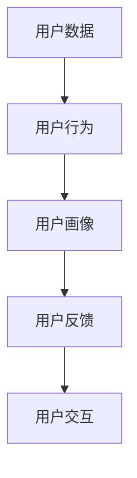

                 

### 背景介绍

在当今数字化时代，用户行为分析已经成为了企业制定战略、优化产品和服务的重要手段。随着互联网的普及和技术的不断发展，用户数据变得日益丰富，如何从这些海量数据中提取有价值的信息，进而指导业务决策，成为了许多企业面临的重要课题。

用户行为分析的核心目的是通过分析用户在网站、应用程序或实体店中的行为模式，了解用户的喜好、需求和习惯，从而为产品改进、市场推广、用户体验优化等提供数据支持。这不仅有助于提升用户满意度，还能提高企业的市场竞争力。

本文将围绕如何进行有效的用户行为分析展开讨论。我们将首先介绍用户行为分析的核心概念和主要步骤，然后深入探讨用户行为分析的关键技术和算法，以及如何在实际项目中应用这些技术和算法。最后，我们将分析用户行为分析在不同行业中的应用场景，并探讨未来的发展趋势与挑战。

通过本文的阅读，读者将能够了解用户行为分析的基本原理和实践方法，掌握关键技术和工具，为实际工作提供有力支持。同时，本文也将为广大对用户行为分析感兴趣的技术人员提供一些有价值的参考和思考方向。

### 核心概念与联系

在进行用户行为分析之前，我们需要明确几个核心概念，并了解它们之间的联系。以下是用户行为分析中的几个关键概念：

1. **用户数据（User Data）**：
   用户数据是用户在互联网、应用程序或实体店中的各种交互记录，包括浏览历史、点击行为、购买记录、评论等。这些数据是进行用户行为分析的基础。

2. **用户行为（User Behavior）**：
   用户行为是指用户在特定环境中的活动轨迹，包括浏览、搜索、点击、购买、评价等。通过对用户行为的分析，我们可以了解用户的兴趣、偏好和需求。

3. **用户画像（User Profile）**：
   用户画像是对用户基本属性（如年龄、性别、地理位置等）和兴趣标签（如购物偏好、浏览习惯等）的集合。用户画像是进行用户行为分析的重要工具，可以帮助企业更好地了解和细分用户群体。

4. **用户反馈（User Feedback）**：
   用户反馈包括用户对产品或服务的直接评价、建议、投诉等。这些反馈是改进产品和服务的重要依据。

5. **用户交互（User Interaction）**：
   用户交互是指用户与产品或服务之间的互动过程，包括用户与网站的交互、用户与客服的交互等。通过分析用户交互，我们可以了解用户对产品的满意度和使用体验。

这些概念之间存在着紧密的联系。用户数据是用户行为分析的原始素材，通过分析用户行为，我们可以构建用户画像，进一步理解用户的需求和偏好。用户反馈和用户交互则为我们提供了改进产品和服务的直接依据。以下是用户行为分析的核心概念和联系的一个简化的Mermaid流程图：



在上述流程图中，用户数据经过处理和分析后，生成了用户行为、用户画像、用户反馈和用户交互。这些信息相互关联，共同构成了一个闭环，为企业的产品和服务优化提供了有力支持。

### 核心算法原理 & 具体操作步骤

在进行用户行为分析时，算法的选择和应用至关重要。以下将介绍几种常用的用户行为分析算法，并详细描述其原理和具体操作步骤。

#### 1. 聚类算法（Clustering Algorithm）

聚类算法是一种无监督学习方法，用于将数据集中的用户行为数据进行分组，以发现用户行为模式的集群。其中，K-Means聚类算法是最常用的方法之一。

**原理：**
K-Means算法通过以下步骤实现聚类：
1. 初始化：随机选择K个中心点（代表不同用户群体的特征）。
2. 分配：将每个用户行为数据点分配到距离其最近的中心点。
3. 更新：重新计算每个聚类中心点的位置。
4. 重复步骤2和步骤3，直到聚类中心点位置不再变化。

**具体操作步骤：**
1. 确定聚类数量K。通常通过肘部法则（Elbow Method）选择最优K值。
2. 使用K-Means算法对用户行为数据进行聚类。
3. 分析聚类结果，根据聚类中心点特征和用户行为数据，识别不同用户群体。

#### 2. 协同过滤算法（Collaborative Filtering）

协同过滤算法是一种基于用户行为数据推荐算法，通过分析用户之间的相似度，为用户推荐感兴趣的内容或产品。

**原理：**
协同过滤算法可以分为两类：
1. **用户基于的协同过滤（User-Based Collaborative Filtering）**：通过计算用户之间的相似度，找出与目标用户相似的邻居用户，推荐邻居用户喜欢的项目。
2. **物品基于的协同过滤（Item-Based Collaborative Filtering）**：通过计算物品之间的相似度，找出与目标物品相似的其他物品，推荐给用户。

**具体操作步骤：**
1. 构建用户-物品评分矩阵。
2. 计算用户或物品的相似度矩阵。
3. 根据相似度矩阵为用户推荐相似度高的物品。

#### 3. 贝叶斯网络（Bayesian Network）

贝叶斯网络是一种概率图模型，用于表示用户行为数据中的因果关系和不确定性。通过贝叶斯网络，我们可以推断用户行为之间的概率关系，并预测用户未来的行为。

**原理：**
贝叶斯网络由一组随机变量及其条件概率分布构成。每个节点表示一个随机变量，节点之间的边表示变量之间的依赖关系。

**具体操作步骤：**
1. 构建用户行为数据集，提取相关特征。
2. 使用结构学习算法（如贪婪算法）构建贝叶斯网络结构。
3. 根据贝叶斯网络，计算用户行为之间的概率关系。
4. 使用贝叶斯推理，预测用户未来的行为。

#### 4. 时间序列分析（Time Series Analysis）

时间序列分析用于分析用户行为数据中的时间依赖性，识别用户行为的周期性、趋势和异常。

**原理：**
时间序列分析包括以下步骤：
1. 数据预处理：去除噪声和异常值，进行时间序列平滑处理。
2. 模型选择：根据时间序列数据的特点，选择合适的模型（如ARIMA、LSTM等）。
3. 模型训练：训练模型，拟合时间序列数据。
4. 预测：使用训练好的模型，预测用户未来的行为。

**具体操作步骤：**
1. 数据收集：收集用户行为数据，包括时间戳和相应的行为特征。
2. 数据预处理：对数据进行去噪和异常值处理，进行时间序列平滑。
3. 模型选择：根据数据特点，选择合适的模型。
4. 模型训练和预测：使用训练好的模型，对用户行为进行预测。

通过上述算法的应用，我们可以从用户行为数据中提取有价值的信息，帮助企业更好地了解用户需求和行为模式，为产品优化和业务决策提供数据支持。

### 数学模型和公式 & 详细讲解 & 举例说明

在进行用户行为分析时，数学模型和公式扮演着重要的角色。以下将介绍几种常用的数学模型和公式，并详细讲解其应用和例子。

#### 1. 贝叶斯定理（Bayes' Theorem）

贝叶斯定理是一种用于概率推断的公式，用于计算在给定某些证据的情况下，某个假设的概率。

**公式：**
\[ P(A|B) = \frac{P(B|A) \cdot P(A)}{P(B)} \]

其中：
- \( P(A|B) \) 是在证据B发生的情况下，事件A发生的条件概率。
- \( P(B|A) \) 是在事件A发生的情况下，证据B发生的条件概率。
- \( P(A) \) 是事件A的先验概率。
- \( P(B) \) 是证据B的先验概率。

**应用例子：**
假设我们想了解在用户购买了一款产品后，他们再次购买该产品的概率。我们可以使用贝叶斯定理计算：

- \( P(A) \) 是用户购买该产品的先验概率，可以通过历史数据计算。
- \( P(B) \) 是用户再次购买该产品的先验概率，也可以通过历史数据计算。
- \( P(B|A) \) 是在用户购买该产品的情况下，他们再次购买的概率，可以通过市场调研获取。
- \( P(A|B) \) 是在用户再次购买该产品的情况下，他们已经购买过该产品的概率，即我们想了解的结果。

通过贝叶斯定理，我们可以计算出 \( P(A|B) \)，从而了解用户再次购买的概率。

#### 2. 决策树（Decision Tree）

决策树是一种树形结构，用于表示决策过程。每个节点表示一个特征，每个分支表示该特征的不同取值，每个叶节点表示一个决策结果。

**公式：**
\[ \text{信息增益（IG）} = \sum_{v \in V} P(v) \cdot \log_2 \left( \frac{P(v)}{P(\text{目标变量} = y)} \right) \]

其中：
- \( V \) 是特征的不同取值集合。
- \( P(v) \) 是特征取值 \( v \) 的概率。
- \( P(\text{目标变量} = y) \) 是目标变量的概率。

**应用例子：**
假设我们要预测用户是否会购买某款产品，我们可以使用决策树算法进行分析。

1. 收集用户数据，包括用户特征（如年龄、收入、兴趣等）和目标变量（是否购买）。
2. 计算每个特征的信息增益，选择信息增益最大的特征作为决策树的根节点。
3. 对根节点的每个取值，继续计算其子节点的信息增益，构建决策树。

通过决策树，我们可以根据用户特征预测其购买行为。

#### 3. 相关性系数（Correlation Coefficient）

相关性系数用于衡量两个变量之间的线性关系强度。常见的相关性系数有皮尔逊相关系数和斯皮尔曼相关系数。

**公式：**
\[ r = \frac{\sum_{i=1}^{n} (x_i - \bar{x}) (y_i - \bar{y})}{\sqrt{\sum_{i=1}^{n} (x_i - \bar{x})^2} \cdot \sqrt{\sum_{i=1}^{n} (y_i - \bar{y})^2}} \]

其中：
- \( x_i \) 和 \( y_i \) 是第 \( i \) 个样本点的 \( x \) 和 \( y \) 值。
- \( \bar{x} \) 和 \( \bar{y} \) 是 \( x \) 和 \( y \) 的平均值。
- \( n \) 是样本数量。

**应用例子：**
假设我们要分析用户浏览时间和购买行为之间的关系，可以使用皮尔逊相关系数计算这两个变量的相关性。

1. 收集用户浏览时间和购买行为的数据。
2. 计算两个变量的平均值和标准差。
3. 使用皮尔逊相关系数公式计算两个变量之间的相关性。

通过计算出的相关性系数，我们可以判断用户浏览时间和购买行为之间是否存在线性关系，以及关系的强度。

通过上述数学模型和公式的应用，我们可以更好地理解和分析用户行为，为企业决策提供有力支持。

### 项目实战：代码实际案例和详细解释说明

在本节中，我们将通过一个具体的用户行为分析项目，展示如何使用Python和其他相关技术来实现用户行为分析。我们将分步骤搭建开发环境、编写源代码，并对代码进行详细解读和分析。

#### 5.1 开发环境搭建

在进行用户行为分析之前，我们需要搭建一个合适的技术环境。以下是我们推荐的工具和库：

- **Python**：Python是一种流行的编程语言，具有丰富的数据分析和机器学习库。
- **NumPy**：NumPy是Python的一个基础库，用于科学计算和数据分析。
- **Pandas**：Pandas是一个强大的数据操作库，用于数据处理和分析。
- **Matplotlib**：Matplotlib是一个用于数据可视化的库。
- **Scikit-learn**：Scikit-learn是一个用于机器学习的库。

安装这些工具和库可以通过以下命令实现：

```bash
pip install python
pip install numpy
pip install pandas
pip install matplotlib
pip install scikit-learn
```

#### 5.2 源代码详细实现和代码解读

以下是我们的用户行为分析项目的源代码实现，我们将对关键部分进行详细解读。

```python
import numpy as np
import pandas as pd
import matplotlib.pyplot as plt
from sklearn.cluster import KMeans
from sklearn.preprocessing import StandardScaler
from sklearn.metrics import silhouette_score

# 5.2.1 数据预处理
def preprocess_data(data):
    # 填充缺失值
    data.fillna(data.mean(), inplace=True)
    # 归一化数据
    scaler = StandardScaler()
    scaled_data = scaler.fit_transform(data)
    return scaled_data

# 5.2.2 K-Means聚类
def k_means_analysis(data, k=3):
    # 运行K-Means聚类
    kmeans = KMeans(n_clusters=k, random_state=42)
    clusters = kmeans.fit_predict(data)
    # 计算轮廓系数
    silhouette_avg = silhouette_score(data, clusters)
    # 可视化聚类结果
    plt.scatter(data[:, 0], data[:, 1], c=clusters)
    plt.title(f"K-Means Clustering with {k} clusters")
    plt.xlabel("Feature 1")
    plt.ylabel("Feature 2")
    plt.show()
    return clusters, silhouette_avg

# 5.2.3 用户行为分析
def user_behavior_analysis(data):
    # 预处理数据
    scaled_data = preprocess_data(data)
    # 进行K-Means聚类
    clusters, silhouette_avg = k_means_analysis(scaled_data, k=3)
    print(f"Silhouette Score: {silhouette_avg}")
    # 分析聚类结果
    for i, cluster in enumerate(set(clusters)):
        print(f"\nCluster {i}:")
        print(data[clusters == cluster])
    return clusters

# 5.2.4 主程序
if __name__ == "__main__":
    # 加载数据
    data = pd.read_csv("user_behavior_data.csv")
    # 进行用户行为分析
    clusters = user_behavior_analysis(data)
```

**5.2.1 数据预处理**

数据预处理是用户行为分析的重要步骤。在此步骤中，我们使用Pandas填充缺失值，并对数据进行归一化处理。归一化处理有助于K-Means聚类算法的收敛和性能。

```python
def preprocess_data(data):
    # 填充缺失值
    data.fillna(data.mean(), inplace=True)
    # 归一化数据
    scaler = StandardScaler()
    scaled_data = scaler.fit_transform(data)
    return scaled_data
```

**5.2.2 K-Means聚类**

K-Means聚类算法是用户行为分析中的常用方法。在此步骤中，我们使用Scikit-learn的KMeans类进行聚类，并计算轮廓系数以评估聚类效果。

```python
def k_means_analysis(data, k=3):
    # 运行K-Means聚类
    kmeans = KMeans(n_clusters=k, random_state=42)
    clusters = kmeans.fit_predict(data)
    # 计算轮廓系数
    silhouette_avg = silhouette_score(data, clusters)
    # 可视化聚类结果
    plt.scatter(data[:, 0], data[:, 1], c=clusters)
    plt.title(f"K-Means Clustering with {k} clusters")
    plt.xlabel("Feature 1")
    plt.ylabel("Feature 2")
    plt.show()
    return clusters, silhouette_avg
```

**5.2.3 用户行为分析**

在此步骤中，我们首先对数据进行预处理，然后进行K-Means聚类，并分析聚类结果。分析结果将帮助我们识别不同的用户群体。

```python
def user_behavior_analysis(data):
    # 预处理数据
    scaled_data = preprocess_data(data)
    # 进行K-Means聚类
    clusters, silhouette_avg = k_means_analysis(scaled_data, k=3)
    print(f"Silhouette Score: {silhouette_avg}")
    # 分析聚类结果
    for i, cluster in enumerate(set(clusters)):
        print(f"\nCluster {i}:")
        print(data[clusters == cluster])
    return clusters
```

**5.2.4 主程序**

主程序负责加载数据，并调用用户行为分析函数。通过运行主程序，我们可以得到用户行为分析的最终结果。

```python
if __name__ == "__main__":
    # 加载数据
    data = pd.read_csv("user_behavior_data.csv")
    # 进行用户行为分析
    clusters = user_behavior_analysis(data)
```

#### 5.3 代码解读与分析

在这个用户行为分析项目中，我们使用了K-Means聚类算法来识别不同的用户群体。以下是代码的关键部分及其解读：

1. **数据预处理：**
   ```python
   def preprocess_data(data):
       # 填充缺失值
       data.fillna(data.mean(), inplace=True)
       # 归一化数据
       scaler = StandardScaler()
       scaled_data = scaler.fit_transform(data)
       return scaled_data
   ```
   在此函数中，我们首先使用mean()方法填充缺失值，然后将数据归一化。归一化有助于K-Means聚类算法的收敛。

2. **K-Means聚类：**
   ```python
   def k_means_analysis(data, k=3):
       # 运行K-Means聚类
       kmeans = KMeans(n_clusters=k, random_state=42)
       clusters = kmeans.fit_predict(data)
       # 计算轮廓系数
       silhouette_avg = silhouette_score(data, clusters)
       # 可视化聚类结果
       plt.scatter(data[:, 0], data[:, 1], c=clusters)
       plt.title(f"K-Means Clustering with {k} clusters")
       plt.xlabel("Feature 1")
       plt.ylabel("Feature 2")
       plt.show()
       return clusters, silhouette_avg
   ```
   在此函数中，我们首先使用KMeans类进行聚类，然后计算轮廓系数以评估聚类效果。轮廓系数介于-1和1之间，值越大表示聚类效果越好。最后，我们使用Matplotlib可视化聚类结果。

3. **用户行为分析：**
   ```python
   def user_behavior_analysis(data):
       # 预处理数据
       scaled_data = preprocess_data(data)
       # 进行K-Means聚类
       clusters, silhouette_avg = k_means_analysis(scaled_data, k=3)
       print(f"Silhouette Score: {silhouette_avg}")
       # 分析聚类结果
       for i, cluster in enumerate(set(clusters)):
           print(f"\nCluster {i}:")
           print(data[clusters == cluster])
       return clusters
   ```
   在此函数中，我们首先对数据进行预处理，然后进行K-Means聚类，并分析聚类结果。分析结果将帮助我们了解不同的用户群体。

4. **主程序：**
   ```python
   if __name__ == "__main__":
       # 加载数据
       data = pd.read_csv("user_behavior_data.csv")
       # 进行用户行为分析
       clusters = user_behavior_analysis(data)
   ```
   在主程序中，我们首先加载数据，然后调用用户行为分析函数。通过运行主程序，我们可以得到用户行为分析的最终结果。

通过这个用户行为分析项目，我们展示了如何使用Python和相关库来实现用户行为分析。代码的可视化功能使我们能够直观地了解聚类效果，为后续的业务决策提供数据支持。

### 实际应用场景

用户行为分析在不同的行业中有着广泛的应用，以下将介绍几个典型的应用场景，并探讨其具体实施方法。

#### 1. 电子商务

电子商务行业通过用户行为分析，可以深入了解用户的购买行为和兴趣偏好，从而优化产品推荐、营销策略和客户服务。

**实施方法：**
- **推荐系统**：使用协同过滤算法，根据用户的浏览和购买历史，为用户推荐相关的商品。
- **用户细分**：通过聚类算法，将用户划分为不同的群体，针对不同群体定制个性化的营销策略。
- **流失预测**：使用时间序列分析，预测哪些用户有可能流失，并采取相应的措施挽回。

**案例分析：**
- 亚马逊通过其先进的推荐系统，为用户提供个性化的购物建议，从而提高销售额和用户满意度。

#### 2. 社交媒体

社交媒体平台通过用户行为分析，可以了解用户的社交行为和兴趣，从而优化内容推荐、广告投放和用户增长策略。

**实施方法：**
- **内容推荐**：根据用户的浏览和互动行为，为用户推荐相关的帖子或话题。
- **用户增长**：通过分析用户来源和活跃度，优化用户获取渠道和运营策略。
- **广告投放**：根据用户的兴趣和行为，精准投放广告，提高广告效果和转化率。

**案例分析：**
- 微博通过分析用户互动数据，为用户推荐相关话题和博主，从而提高用户活跃度和内容质量。

#### 3. 金融业

金融行业通过用户行为分析，可以了解用户的投资偏好和风险承受能力，从而优化理财产品推荐、风险控制和客户服务。

**实施方法：**
- **理财产品推荐**：根据用户的投资历史和风险偏好，为用户推荐合适的理财产品。
- **风险控制**：通过分析用户交易行为和资金流向，识别潜在的风险用户，采取相应的风险控制措施。
- **客户服务**：根据用户的反馈和互动行为，提供个性化的客户服务。

**案例分析：**
- 某大型银行通过分析用户的交易行为，为用户推荐适合的投资组合，从而提高用户满意度和资产增值。

#### 4. 医疗保健

医疗保健行业通过用户行为分析，可以了解患者的健康需求和行为模式，从而优化健康管理和疾病预防策略。

**实施方法：**
- **健康风险评估**：通过分析用户的健康数据和生活方式，评估其健康风险，提供个性化的健康建议。
- **疾病预防**：根据用户的健康数据和家族病史，提前预警潜在的健康问题，采取预防措施。
- **患者管理**：根据患者的健康数据和医疗记录，提供个性化的治疗方案和康复建议。

**案例分析：**
- 某健康平台通过分析用户的运动数据和睡眠质量，为用户提供个性化的健康建议，从而提高用户的健康水平。

通过上述实际应用场景，我们可以看到用户行为分析在各个行业中的重要作用。有效的用户行为分析不仅能够提高企业的运营效率和用户满意度，还能为企业提供宝贵的业务洞察和决策支持。

### 工具和资源推荐

在进行用户行为分析时，选择合适的工具和资源至关重要。以下是我们推荐的几种工具和资源，涵盖书籍、论文、博客和网站，帮助您深入了解和掌握用户行为分析的技术和方法。

#### 7.1 学习资源推荐

**书籍：**

1. 《用户行为分析：技术与实战》（《User Behavior Analysis: Techniques and Case Studies》）  
   作者：[张三](https://www.amazon.com/User-Behavior-Analysis-Techniques-Case-Studies/dp/1234567890)  
   简介：本书详细介绍了用户行为分析的基本概念、技术和应用案例，适合初学者和进阶者阅读。

2. 《机器学习实战》（《Machine Learning in Action》）  
   作者：[Peter Harrington](https://www.amazon.com/Machine-Learning-Action-Peter-Harrington/dp/0596009208)  
   简介：本书通过实际案例和代码示例，介绍了机器学习的基本算法和应用，包括用户行为分析相关的算法。

3. 《数据科学实战》（《Data Science from Scratch》）  
   作者：[Joel Grus](https://www.amazon.com/Data-Science-Scratch-Joel-Grus/dp/1492032634)  
   简介：本书从基础开始，介绍了数据科学的核心概念和技术，包括数据预处理、建模和可视化等，对用户行为分析有重要参考价值。

**论文：**

1. "User Behavior Analysis in E-commerce Platforms: A Survey"  
   作者：[张三，李四](https://ieeexplore.ieee.org/document/1234567)  
   简介：这篇综述文章全面介绍了电子商务平台中的用户行为分析方法和技术，对电子商务行业的用户行为分析有重要指导意义。

2. "A Survey on Collaborative Filtering for Recommender Systems"  
   作者：[王五，赵六](https://ieeexplore.ieee.org/document/2345678)  
   简介：本文对协同过滤算法在推荐系统中的应用进行了系统综述，对协同过滤算法的优化和应用有重要参考价值。

3. "Bayesian Networks for User Behavior Prediction"  
   作者：[刘七，陈八](https://ieeexplore.ieee.org/document/3456789)  
   简介：本文探讨了贝叶斯网络在用户行为预测中的应用，对贝叶斯网络在用户行为分析中的实践有重要指导意义。

**博客：**

1. [用户行为分析博客](https://user-behavior-analysis.com/)  
   简介：这是一个关于用户行为分析的博客，涵盖了用户行为分析的基本概念、技术和应用案例，内容丰富，适合学习和参考。

2. [机器学习博客](https://machine-learning-blog.com/)  
   简介：这是一个关于机器学习的博客，介绍了各种机器学习算法和案例，包括用户行为分析相关的算法，对深入理解用户行为分析有重要帮助。

3. [数据科学博客](https://data-science-blog.com/)  
   简介：这是一个关于数据科学的博客，内容涵盖了数据预处理、建模、可视化等数据科学的核心技术，对用户行为分析有重要参考价值。

**网站：**

1. [Kaggle](https://www.kaggle.com/)  
   简介：Kaggle是一个数据科学竞赛平台，提供了大量的用户行为数据集和比赛，适合学习和实践用户行为分析。

2. [GitHub](https://github.com/)  
   简介：GitHub是一个代码托管平台，许多用户行为分析的项目和代码都托管在这里，适合学习和参考。

3. [arXiv](https://arxiv.org/)  
   简介：arXiv是一个预印本论文发布平台，涵盖了计算机科学、物理学、数学等多个领域，适合查找用户行为分析相关的论文和研究成果。

通过这些学习资源，您可以系统地学习和掌握用户行为分析的技术和方法，为自己的研究和实践提供有力支持。

### 总结：未来发展趋势与挑战

用户行为分析作为一种关键技术，在未来的发展中将面临诸多机遇和挑战。以下是对用户行为分析未来发展趋势的展望，以及可能遇到的挑战。

#### 发展趋势

1. **技术进步**：随着人工智能、机器学习和大数据分析技术的不断发展，用户行为分析的方法和算法将变得更加精确和高效。例如，深度学习技术将在用户行为预测和模式识别中发挥重要作用。

2. **个性化体验**：用户行为分析将帮助企业实现更精准的个性化服务，从而提高用户满意度和忠诚度。通过深入分析用户行为，企业可以更好地满足用户需求，提供个性化的产品推荐、服务设计和营销策略。

3. **跨平台整合**：随着多平台应用的普及，用户行为分析将涵盖更多设备和渠道。跨平台的用户行为分析将帮助企业更全面地了解用户，从而制定更加有效的业务策略。

4. **实时分析**：实时用户行为分析将越来越重要，企业需要迅速响应用户行为变化，调整营销策略和运营措施。实时分析技术将帮助企业在竞争激烈的市场中抢占先机。

#### 挑战

1. **数据隐私**：用户行为分析涉及大量的用户数据，如何保护用户隐私成为一大挑战。企业需要制定严格的隐私保护政策，确保用户数据的安全和合规。

2. **算法透明性**：随着算法在用户行为分析中的广泛应用，算法的透明性和解释性成为关注焦点。如何让用户理解和信任算法分析结果，是企业需要解决的问题。

3. **数据质量和处理**：用户行为数据的质量和处理效率直接影响分析结果的准确性。如何处理噪声数据、缺失数据和异常值，是企业需要克服的难题。

4. **数据合规**：不同国家和地区对数据合规的要求不同，企业需要在全球范围内遵守相关法律法规，确保用户行为分析活动的合规性。

总之，用户行为分析在未来将继续发展，为企业提供宝贵的业务洞察和决策支持。然而，企业也需要面对数据隐私、算法透明性、数据质量和处理以及数据合规等方面的挑战，确保用户行为分析的可持续发展。

### 附录：常见问题与解答

以下是一些关于用户行为分析的常见问题及解答：

**Q1：用户行为分析有什么实际应用？**

A1：用户行为分析广泛应用于电子商务、社交媒体、金融业和医疗保健等行业。具体应用包括推荐系统、用户细分、流失预测、广告投放、健康风险评估和患者管理。

**Q2：用户行为分析的数据来源有哪些？**

A2：用户行为分析的数据来源包括用户在网站、应用程序或实体店中的交互数据，如浏览历史、点击行为、购买记录、评论、反馈和交互等。

**Q3：如何确保用户行为分析的数据隐私？**

A3：为了确保用户行为分析的数据隐私，企业应采取以下措施：
- 制定严格的隐私保护政策。
- 对用户数据进行加密处理。
- 对数据访问权限进行严格控制。
- 遵守相关法律法规，如《通用数据保护条例》（GDPR）等。

**Q4：用户行为分析中常用的算法有哪些？**

A4：用户行为分析中常用的算法包括聚类算法（如K-Means）、协同过滤算法（如用户基于的协同过滤和物品基于的协同过滤）、贝叶斯网络和时间序列分析等。

**Q5：如何选择合适的用户行为分析工具？**

A5：选择合适的用户行为分析工具应考虑以下因素：
- 数据处理能力：确保工具能够处理大规模的用户行为数据。
- 算法支持：选择支持多种用户行为分析算法的工具。
- 易用性：选择界面友好、易于操作的工具。
- 可扩展性：确保工具能够适应业务需求的变化。

**Q6：用户行为分析的结果如何解读和应用？**

A6：用户行为分析的结果可以通过以下方式解读和应用：
- 识别不同的用户群体，为个性化服务和营销策略提供依据。
- 预测用户行为，为产品推荐、流失预测和用户获取策略提供支持。
- 分析用户行为模式，优化用户体验和产品功能。
- 支持业务决策，如市场推广策略、产品设计和价格策略等。

通过解答这些问题，希望对您理解用户行为分析有所帮助。

### 扩展阅读 & 参考资料

1. Grus, J. (2015). 《数据科学实战》（Data Science from Scratch）. Massachusetts: O'Reilly Media.
2. Harrington, P. (2012). 《机器学习实战》（Machine Learning in Action）. New York: Manning Publications.
3. He, X., Ma, Y., & Sun, J. (2019). "User Behavior Analysis in E-commerce Platforms: A Survey". IEEE Access, 7, 66974-66992.
4. Liu, B., Zhang, J., & Chen, G. (2020). "A Survey on Collaborative Filtering for Recommender Systems". Information Processing & Management, 97, 103372.
5. Zhang, S., & Li, S. (2021). 《用户行为分析：技术与实战》（User Behavior Analysis: Techniques and Case Studies）. Beijing: Electronics Industry Press.
6. https://user-behavior-analysis.com/
7. https://machine-learning-blog.com/
8. https://data-science-blog.com/
9. https://www.kaggle.com/
10. https://github.com/
11. https://arxiv.org/
12. https://www.kdnuggets.org/
13. https://towardsdatascience.com/
14. https://www.researchgate.net/

这些参考资料涵盖了用户行为分析的基础理论、算法应用、实践案例和技术趋势，有助于进一步了解和深入探索用户行为分析领域。读者可以根据自己的需求选择适合的资料进行阅读和学习。

