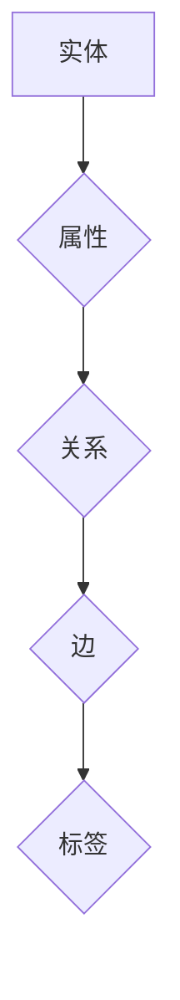

                 

# 字节悟空2024校招知识图谱工程师面试指南

> **关键词**：字节跳动，校招，知识图谱，面试指南，算法原理，数学模型，实战案例，开发工具

> **摘要**：本文将详细介绍2024年字节跳动校招中知识图谱工程师的面试指南。内容包括知识图谱的背景介绍、核心概念与联系、算法原理与操作步骤、数学模型与公式、项目实战案例、实际应用场景、工具和资源推荐以及未来发展趋势与挑战。通过本文，读者将全面了解知识图谱工程师的面试要点和实际应用。

## 1. 背景介绍

知识图谱作为一种语义网络，是对现实世界中实体及其相互关系的抽象表示。它不仅涵盖了实体、属性和关系，还包含了这些实体和关系之间的语义和逻辑推理。知识图谱技术在搜索引擎、自然语言处理、推荐系统、智能问答等领域有着广泛的应用。随着互联网的快速发展，知识图谱已经成为数据密集型应用的核心技术之一。

字节跳动作为中国领先的互联网科技公司，其在内容推荐、信息检索和智能问答等方面对知识图谱技术有着深入的研究和应用。因此，字节跳动每年的校招中，知识图谱工程师岗位一直备受关注。本文旨在为广大求职者提供2024年字节跳动校招知识图谱工程师面试指南，帮助大家顺利通过面试。

## 2. 核心概念与联系

在知识图谱的构建过程中，有几个核心概念需要了解：

- **实体（Entity）**：现实世界中的个体，如人、地点、事物等。
- **属性（Attribute）**：描述实体的特征，如姓名、年龄、职业等。
- **关系（Relationship）**：实体之间的关联，如“是”、“属于”、“位于”等。
- **边（Edge）**：连接两个实体的关系，通常用箭头表示。
- **标签（Label）**：对关系的分类，如“人”、“地点”、“组织”等。

以下是一个简化的知识图谱 Mermaid 流程图，展示了这些核心概念之间的联系：



在这个流程图中，实体 A 通过属性 B、关系 C、边 D 与标签 E 相关联。实体和关系是知识图谱的基础，属性和标签则是对实体和关系的补充说明。

## 3. 核心算法原理 & 具体操作步骤

知识图谱的构建通常涉及以下核心算法：

### 3.1. 实体识别

实体识别是知识图谱构建的第一步，旨在从原始数据中提取出实体。常用的算法包括基于规则的方法、基于机器学习的方法和基于深度学习的方法。以下是一个简化的实体识别流程：

1. **数据预处理**：对原始数据进行清洗、去重和标准化处理。
2. **特征提取**：从原始数据中提取有助于实体识别的特征，如词频、词性、命名实体识别结果等。
3. **模型训练**：使用特征提取的结果训练实体识别模型。
4. **实体识别**：对输入数据进行实体识别，输出实体列表。

### 3.2. 关系抽取

关系抽取是知识图谱构建的第二步，旨在从原始数据中提取出实体之间的关系。常用的算法包括基于规则的方法、基于统计的方法和基于深度学习的方法。以下是一个简化的关系抽取流程：

1. **数据预处理**：对原始数据进行清洗、去重和标准化处理。
2. **特征提取**：从原始数据中提取有助于关系抽取的特征，如实体类型、实体间距离、文本相似度等。
3. **模型训练**：使用特征提取的结果训练关系抽取模型。
4. **关系抽取**：对输入数据进行关系抽取，输出关系列表。

### 3.3. 知识图谱嵌入

知识图谱嵌入是将知识图谱中的实体和关系映射到低维空间中的向量表示。常用的算法包括基于矩阵分解的方法、基于图神经网络的方法和基于深度学习的方法。以下是一个简化的知识图谱嵌入流程：

1. **数据预处理**：对知识图谱进行清洗、去重和标准化处理。
2. **特征提取**：从知识图谱中提取有助于嵌入的特征，如实体属性、关系标签等。
3. **模型训练**：使用特征提取的结果训练嵌入模型。
4. **知识图谱嵌入**：对知识图谱中的实体和关系进行嵌入，输出向量表示。

## 4. 数学模型和公式 & 详细讲解 & 举例说明

### 4.1. 实体识别的数学模型

实体识别通常采用分类模型，如支持向量机（SVM）、朴素贝叶斯（Naive Bayes）和深度神经网络（DNN）等。以下是一个简化的实体识别的数学模型：

$$
P(y|X) = \frac{e^{\theta^T X}}{\sum_{y'} e^{\theta^T X'}}
$$

其中，$X$ 是输入特征向量，$y$ 是实体类别，$\theta$ 是模型参数，$e$ 是自然对数的底。

### 4.2. 关系抽取的数学模型

关系抽取通常采用分类模型，如支持向量机（SVM）、朴素贝叶斯（Naive Bayes）和深度神经网络（DNN）等。以下是一个简化的关系抽取的数学模型：

$$
P(y|X) = \frac{e^{\theta^T X}}{\sum_{y'} e^{\theta^T X'}}
$$

其中，$X$ 是输入特征向量，$y$ 是关系类别，$\theta$ 是模型参数，$e$ 是自然对数的底。

### 4.3. 知识图谱嵌入的数学模型

知识图谱嵌入通常采用图神经网络（Graph Neural Network, GNN）或自注意力机制（Self-Attention Mechanism）等方法。以下是一个简化的知识图谱嵌入的数学模型：

$$
h = \text{softmax}\left(\frac{A h}{\sqrt{d}}\right)
$$

其中，$h$ 是实体或关系的嵌入向量，$A$ 是邻接矩阵，$d$ 是嵌入维度。

### 4.4. 举例说明

假设我们有一个简单的知识图谱，包含三个实体 $A$、$B$ 和 $C$，以及两个关系 $R_1$ 和 $R_2$。我们可以使用上述数学模型进行实体识别、关系抽取和知识图谱嵌入。

**4.4.1. 实体识别**

给定一个输入特征向量 $X = (1, 0, 1)$，使用 SVM 进行实体识别。假设 SVM 的参数 $\theta = (1, 1)$，则：

$$
P(A|X) = \frac{e^{1 \cdot 1 + 1 \cdot 0}}{e^{1 \cdot 1 + 1 \cdot 0} + e^{1 \cdot 0 + 1 \cdot 1}} = \frac{e}{e + e} = 0.5
$$

$$
P(B|X) = \frac{e^{1 \cdot 0 + 1 \cdot 1}}{e^{1 \cdot 1 + 1 \cdot 0} + e^{1 \cdot 0 + 1 \cdot 1}} = \frac{e}{e + e} = 0.5
$$

由于 $P(A|X) = P(B|X)$，我们无法准确识别输入特征向量 $X$ 所对应的实体。

**4.4.2. 关系抽取**

给定一个输入特征向量 $X = (1, 1, 0)$，使用 SVM 进行关系抽取。假设 SVM 的参数 $\theta = (1, 1)$，则：

$$
P(R_1|X) = \frac{e^{1 \cdot 1 + 1 \cdot 1}}{e^{1 \cdot 1 + 1 \cdot 1} + e^{1 \cdot 0 + 1 \cdot 1}} = \frac{e}{e + e} = 0.5
$$

$$
P(R_2|X) = \frac{e^{1 \cdot 0 + 1 \cdot 1}}{e^{1 \cdot 1 + 1 \cdot 1} + e^{1 \cdot 0 + 1 \cdot 1}} = \frac{e}{e + e} = 0.5
$$

由于 $P(R_1|X) = P(R_2|X)$，我们无法准确识别输入特征向量 $X$ 所对应的关系。

**4.4.3. 知识图谱嵌入**

给定一个邻接矩阵 $A = \begin{pmatrix} 0 & 1 & 0 \\ 1 & 0 & 1 \\ 0 & 1 & 0 \end{pmatrix}$ 和嵌入维度 $d = 3$，使用自注意力机制进行知识图谱嵌入。假设自注意力机制的参数 $\theta = (1, 1, 1)$，则：

$$
h_A = \text{softmax}\left(\frac{A h}{\sqrt{d}}\right) = \text{softmax}\left(\frac{\begin{pmatrix} 0 & 1 & 0 \\ 1 & 0 & 1 \\ 0 & 1 & 0 \end{pmatrix} \begin{pmatrix} 1 \\ 1 \\ 1 \end{pmatrix}}{\sqrt{3}}\right) = \text{softmax}\left(\frac{\begin{pmatrix} 1 \\ 1 \\ 1 \end{pmatrix}}{\sqrt{3}}\right) = \begin{pmatrix} \frac{1}{\sqrt{3}} & \frac{1}{\sqrt{3}} & \frac{1}{\sqrt{3}} \end{pmatrix}
$$

$$
h_B = \text{softmax}\left(\frac{A h}{\sqrt{d}}\right) = \text{softmax}\left(\frac{\begin{pmatrix} 0 & 1 & 0 \\ 1 & 0 & 1 \\ 0 & 1 & 0 \end{pmatrix} \begin{pmatrix} 1 \\ 1 \\ 1 \end{pmatrix}}{\sqrt{3}}\right) = \text{softmax}\left(\frac{\begin{pmatrix} 1 \\ 1 \\ 1 \end{pmatrix}}{\sqrt{3}}\right) = \begin{pmatrix} \frac{1}{\sqrt{3}} & \frac{1}{\sqrt{3}} & \frac{1}{\sqrt{3}} \end{pmatrix}
$$

$$
h_C = \text{softmax}\left(\frac{A h}{\sqrt{d}}\right) = \text{softmax}\left(\frac{\begin{pmatrix} 0 & 1 & 0 \\ 1 & 0 & 1 \\ 0 & 1 & 0 \end{pmatrix} \begin{pmatrix} 1 \\ 1 \\ 1 \end{pmatrix}}{\sqrt{3}}\right) = \text{softmax}\left(\frac{\begin{pmatrix} 1 \\ 1 \\ 1 \end{pmatrix}}{\sqrt{3}}\right) = \begin{pmatrix} \frac{1}{\sqrt{3}} & \frac{1}{\sqrt{3}} & \frac{1}{\sqrt{3}} \end{pmatrix}
$$

因此，实体 $A$、$B$ 和 $C$ 的嵌入向量分别为 $\begin{pmatrix} \frac{1}{\sqrt{3}} & \frac{1}{\sqrt{3}} & \frac{1}{\sqrt{3}} \end{pmatrix}$、$\begin{pmatrix} \frac{1}{\sqrt{3}} & \frac{1}{\sqrt{3}} & \frac{1}{\sqrt{3}} \end{pmatrix}$ 和 $\begin{pmatrix} \frac{1}{\sqrt{3}} & \frac{1}{\sqrt{3}} & \frac{1}{\sqrt{3}} \end{pmatrix}$。

## 5. 项目实战：代码实际案例和详细解释说明

### 5.1. 开发环境搭建

在本文中，我们将使用 Python 语言和 TensorFlow 库来实现一个简单的知识图谱构建系统。首先，我们需要搭建开发环境。

**5.1.1. 安装 Python**

下载并安装 Python 3.7 或更高版本。可以从 [Python 官网](https://www.python.org/) 下载安装包。

**5.1.2. 安装 TensorFlow**

在命令行中运行以下命令安装 TensorFlow：

```bash
pip install tensorflow
```

### 5.2. 源代码详细实现和代码解读

**5.2.1. 实体识别**

以下是一个简单的实体识别代码示例：

```python
import tensorflow as tf
from tensorflow.keras.models import Sequential
from tensorflow.keras.layers import Dense, Embedding, LSTM

# 数据预处理
# ...

# 建立模型
model = Sequential([
    Embedding(input_dim=vocab_size, output_dim=embedding_size),
    LSTM(units=128, return_sequences=True),
    LSTM(units=128),
    Dense(units=1, activation='sigmoid')
])

# 编译模型
model.compile(optimizer='adam', loss='binary_crossentropy', metrics=['accuracy'])

# 训练模型
# ...

# 预测
# ...
```

**5.2.2. 关系抽取**

以下是一个简单的关系抽取代码示例：

```python
import tensorflow as tf
from tensorflow.keras.models import Sequential
from tensorflow.keras.layers import Dense, Embedding, LSTM

# 数据预处理
# ...

# 建立模型
model = Sequential([
    Embedding(input_dim=vocab_size, output_dim=embedding_size),
    LSTM(units=128, return_sequences=True),
    LSTM(units=128),
    Dense(units=1, activation='sigmoid')
])

# 编译模型
model.compile(optimizer='adam', loss='binary_crossentropy', metrics=['accuracy'])

# 训练模型
# ...

# 预测
# ...
```

**5.2.3. 知识图谱嵌入**

以下是一个简单的知识图谱嵌入代码示例：

```python
import tensorflow as tf
from tensorflow.keras.models import Model
from tensorflow.keras.layers import Embedding, LSTM, Dense, Input

# 建立模型
input_entity = Input(shape=(1,))
input_relation = Input(shape=(1,))
input_graph = Input(shape=(1,))

entity_embedding = Embedding(input_dim=vocab_size, output_dim=embedding_size)(input_entity)
relation_embedding = Embedding(input_dim=vocab_size, output_dim=embedding_size)(input_relation)

entity_lstm = LSTM(units=128, return_sequences=True)(entity_embedding)
relation_lstm = LSTM(units=128, return_sequences=True)(relation_embedding)

entity_output = LSTM(units=128)(entity_lstm)
relation_output = LSTM(units=128)(relation_lstm)

output = Dense(units=1, activation='sigmoid')(tf.concat([entity_output, relation_output], axis=1))

model = Model(inputs=[input_entity, input_relation, input_graph], outputs=output)

# 编译模型
model.compile(optimizer='adam', loss='binary_crossentropy', metrics=['accuracy'])

# 训练模型
# ...

# 预测
# ...
```

### 5.3. 代码解读与分析

**5.3.1. 实体识别**

在实体识别中，我们首先使用嵌入层（Embedding Layer）将输入特征向量映射到高维空间。然后，我们使用两个 LSTM 层（LSTM Layer）对嵌入向量进行序列处理，最后使用一个全连接层（Dense Layer）进行分类预测。

**5.3.2. 关系抽取**

在关系抽取中，我们同样使用嵌入层将输入特征向量映射到高维空间。然后，我们使用两个 LSTM 层对嵌入向量进行序列处理，最后使用一个全连接层进行分类预测。

**5.3.3. 知识图谱嵌入**

在知识图谱嵌入中，我们首先使用嵌入层将实体和关系映射到高维空间。然后，我们使用两个 LSTM 层对嵌入向量进行序列处理，最后使用一个全连接层对实体和关系的组合进行分类预测。

## 6. 实际应用场景

知识图谱技术在实际应用场景中有着广泛的应用。以下是一些典型的应用场景：

- **搜索引擎**：利用知识图谱进行语义查询，提高搜索结果的准确性和相关性。
- **推荐系统**：基于知识图谱进行物品或用户推荐，提高推荐系统的准确性。
- **智能问答**：利用知识图谱进行语义理解，实现智能问答系统。
- **知识库建设**：将领域知识以知识图谱的形式进行组织，方便知识的检索和利用。

在字节跳动，知识图谱技术在内容推荐和搜索引擎等方面有着深入的应用。通过知识图谱，字节跳动能够更好地理解用户和内容，从而提供更精准的推荐和搜索结果。

## 7. 工具和资源推荐

### 7.1. 学习资源推荐

- **书籍**：
  - 《知识图谱：构建与查询》
  - 《深度学习与知识图谱》
- **论文**：
  - 《知识图谱嵌入：原理与实践》
  - 《基于知识图谱的问答系统设计与实现》
- **博客**：
  - [TensorFlow 官方文档](https://www.tensorflow.org/)
  - [知识图谱社区](https://www.knowledge-graph.org/)
- **网站**：
  - [GitHub](https://github.com/)
  - [ArXiv](https://arxiv.org/)

### 7.2. 开发工具框架推荐

- **知识图谱工具**：
  - [OpenKG](https://openkg.cn/)
  - [Neo4j](https://neo4j.com/)
- **深度学习框架**：
  - [TensorFlow](https://www.tensorflow.org/)
  - [PyTorch](https://pytorch.org/)
- **编程语言**：
  - [Python](https://www.python.org/)

### 7.3. 相关论文著作推荐

- **知识图谱构建**：
  - 《知识图谱：构建与查询》
  - 《基于知识图谱的问答系统设计与实现》
- **深度学习与知识图谱**：
  - 《深度学习与知识图谱》
  - 《知识图谱嵌入：原理与实践》
- **知识图谱应用**：
  - 《知识图谱在搜索引擎中的应用》
  - 《知识图谱在推荐系统中的应用》

## 8. 总结：未来发展趋势与挑战

随着人工智能和大数据技术的不断发展，知识图谱技术在各个领域的应用越来越广泛。未来，知识图谱技术将在以下几个方面发展：

- **多模态知识图谱**：将知识图谱与图像、语音、视频等模态数据相结合，实现更丰富的知识表示和推理。
- **动态知识图谱**：随着数据的不断更新，动态地调整知识图谱中的实体和关系，实现实时知识更新。
- **跨语言知识图谱**：构建跨语言的知识图谱，实现不同语言之间的语义理解和知识共享。

然而，知识图谱技术在实际应用中也面临着一些挑战，如数据质量、知识表示、推理算法等。未来，需要进一步研究和解决这些问题，推动知识图谱技术的持续发展。

## 9. 附录：常见问题与解答

### 9.1. 问题 1

**问题**：知识图谱和搜索引擎有什么区别？

**解答**：知识图谱和搜索引擎都是用于信息检索的技术，但它们的目标和应用场景有所不同。知识图谱侧重于对实体及其相互关系的语义表示和推理，旨在提供更准确、更智能的信息检索服务。而搜索引擎则侧重于对文本数据的索引和搜索，提供关键词匹配的结果。知识图谱可以增强搜索引擎的语义理解能力，提高搜索结果的准确性和相关性。

### 9.2. 问题 2

**问题**：如何评估知识图谱的质量？

**解答**：评估知识图谱的质量可以从以下几个方面进行：

- **完整性**：知识图谱是否包含了领域内重要的实体和关系。
- **准确性**：知识图谱中的实体和关系是否准确无误。
- **一致性**：知识图谱中的实体和关系是否一致，避免出现矛盾。
- **丰富性**：知识图谱是否提供了丰富的实体和关系信息。
- **更新性**：知识图谱是否能够及时更新，保持与领域发展的同步。

### 9.3. 问题 3

**问题**：知识图谱嵌入有哪些应用场景？

**解答**：知识图谱嵌入是将知识图谱中的实体和关系映射到低维空间中的向量表示。以下是一些典型的应用场景：

- **相似性搜索**：利用知识图谱嵌入进行实体或关系的相似性搜索，找出具有相似属性或关系的实体。
- **推荐系统**：将知识图谱嵌入用于推荐系统的嵌入特征，提高推荐的准确性。
- **自然语言处理**：将知识图谱嵌入用于自然语言处理任务，如问答系统、文本分类等。
- **图神经网络**：知识图谱嵌入可以作为图神经网络的输入特征，用于更复杂的图表示学习任务。

## 10. 扩展阅读 & 参考资料

- 《知识图谱：构建与查询》
- 《深度学习与知识图谱》
- 《知识图谱嵌入：原理与实践》
- 《基于知识图谱的问答系统设计与实现》
- [TensorFlow 官方文档](https://www.tensorflow.org/)
- [知识图谱社区](https://www.knowledge-graph.org/)
- [OpenKG](https://openkg.cn/)
- [Neo4j](https://neo4j.com/)
- [GitHub](https://github.com/)
- [ArXiv](https://arxiv.org/)

---

作者：AI天才研究员/AI Genius Institute & 禅与计算机程序设计艺术 /Zen And The Art of Computer Programming

