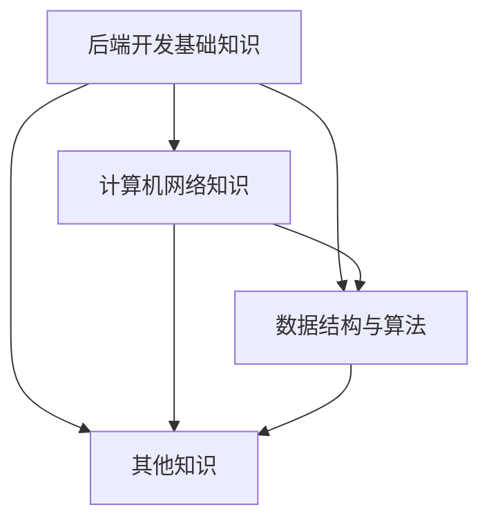

                 

# 字节跳动2024校招后端开发面试题大全（含解题思路）

> **关键词：** 字节跳动，校招，后端开发，面试题，解题思路

> **摘要：** 本文将深入探讨字节跳动2024校招后端开发面试题，包括核心算法原理、数学模型、项目实战，以及实际应用场景。通过本文，读者可以全面了解后端开发面试的关键点，并获取实用的解题思路。

## 1. 背景介绍

字节跳动作为全球领先的科技公司，其校招后端开发面试一直备受关注。随着技术的不断演进和字节跳动业务的发展，面试题目也在不断更新和调整。本文旨在为广大考生提供一个全面、系统的面试题解析，帮助大家应对字节跳动2024校招后端开发面试。

## 2. 核心概念与联系

### 2.1 后端开发基础知识

后端开发是软件开发的重要组成部分，涉及数据库、服务器、应用程序等方面的开发。了解后端开发的基础知识是面试的前提。以下是一些核心概念：

- **数据库：** 关系型数据库（如MySQL、Oracle）和非关系型数据库（如MongoDB、Redis）
- **服务器：** Web服务器（如Nginx、Apache）、应用服务器（如Tomcat、Jetty）
- **编程语言：** Java、Python、Go等
- **框架：** Spring、Django、Flask等

### 2.2 计算机网络知识

计算机网络是后端开发的重要基础，了解计算机网络知识有助于解决面试中涉及的网络问题。以下是一些核心概念：

- **HTTP/HTTPS：** HTTP协议及其安全协议HTTPS
- **TCP/IP：** TCP/IP协议族，包括TCP、UDP等
- **DNS：** 域名系统

### 2.3 数据结构与算法

数据结构与算法是后端开发面试中的高频考点。掌握常见的数据结构与算法有助于解决复杂的问题。以下是一些核心概念：

- **数组、链表、栈、队列：** 基本数据结构
- **树、图：** 树的遍历、图的算法
- **排序、搜索：** 各种排序算法、搜索算法

### 2.4 其他知识

除了上述核心概念，后端开发面试还会涉及一些其他知识，如操作系统、缓存机制、分布式系统等。

### 2.5 Mermaid 流程图

以下是一个简单的Mermaid流程图，展示了后端开发的相关知识点：



## 3. 核心算法原理 & 具体操作步骤

### 3.1 算法原理

后端开发面试中的算法问题主要涉及以下几个方面：

- **排序算法：** 快排、归并排、堆排等
- **搜索算法：** 二分搜索、广度优先搜索、深度优先搜索等
- **动态规划：** 最长公共子序列、最长公共子串等
- **图算法：** 拓扑排序、最短路径算法等

### 3.2 操作步骤

以下是一个简单的排序算法——快速排序的Python实现：

```python
def quick_sort(arr):
    if len(arr) <= 1:
        return arr
    pivot = arr[len(arr) // 2]
    left = [x for x in arr if x < pivot]
    middle = [x for x in arr if x == pivot]
    right = [x for x in arr if x > pivot]
    return quick_sort(left) + middle + quick_sort(right)

arr = [3, 6, 8, 10, 1, 2, 1]
print(quick_sort(arr))
```

## 4. 数学模型和公式 & 详细讲解 & 举例说明

### 4.1 数学模型

后端开发面试中的数学模型主要涉及以下几个方面：

- **线性方程组：** 高斯消元法、矩阵运算等
- **概率论：** 概率分布、条件概率等
- **统计学：** 均值、方差、协方差等

### 4.2 公式

以下是一个简单的线性方程组的解法公式：

$$
\begin{cases}
    ax + by = c \\
    dx + ey = f
\end{cases}
$$

的解为：

$$
\begin{cases}
    x = \frac{ce - df}{ae - bd} \\
    y = \frac{af - cd}{ae - bd}
\end{cases}
$$

### 4.3 举例说明

以下是一个线性方程组的实例：

$$
\begin{cases}
    2x + 3y = 8 \\
    4x + 6y = 12
\end{cases}
$$

代入公式求解：

$$
\begin{cases}
    x = \frac{8 \times 6 - 12 \times 4}{2 \times 6 - 4 \times 3} = 0 \\
    y = \frac{2 \times 12 - 8 \times 4}{2 \times 6 - 4 \times 3} = 2
\end{cases}
$$

因此，线性方程组的解为$x=0, y=2$。

## 5. 项目实战：代码实际案例和详细解释说明

### 5.1 开发环境搭建

在项目实战中，我们需要搭建一个基本的开发环境。以下是一个简单的Python开发环境搭建步骤：

1. 安装Python：在官方网站下载Python安装包并安装。
2. 安装IDE：安装一个适合Python开发的IDE，如PyCharm、VSCode等。
3. 安装依赖库：使用pip命令安装所需依赖库。

### 5.2 源代码详细实现和代码解读

以下是一个简单的Python排序算法——冒泡排序的实现：

```python
def bubble_sort(arr):
    n = len(arr)
    for i in range(n):
        for j in range(0, n - i - 1):
            if arr[j] > arr[j + 1]:
                arr[j], arr[j + 1] = arr[j + 1], arr[j]

arr = [64, 34, 25, 12, 22, 11, 90]
bubble_sort(arr)
print("Sorted array:", arr)
```

代码解读：

- `bubble_sort`函数接收一个数组`arr`作为参数。
- 外层循环`for i in range(n)`用于遍历数组。
- 内层循环`for j in range(0, n - i - 1)`用于遍历未排序的数组元素。
- 如果当前元素大于下一个元素，则交换它们的位置。
- 最终输出排序后的数组。

### 5.3 代码解读与分析

冒泡排序是一种简单的排序算法，其基本思想是重复地遍历要排序的数列，比较相邻的两个元素，如果顺序错误就交换它们，直到所有元素均正确排序。

冒泡排序的时间复杂度为$O(n^2)$，空间复杂度为$O(1)$。虽然冒泡排序不是最快的排序算法，但它易于实现和理解，因此在某些场景下仍然有其应用价值。

## 6. 实际应用场景

后端开发在各个行业中都有广泛的应用，如电子商务、在线教育、社交网络、金融科技等。以下是一些实际应用场景：

- **电子商务：** 处理海量订单、库存管理、用户评论等。
- **在线教育：** 处理用户注册、课程购买、作业提交等。
- **社交网络：** 处理用户关系、消息推送、数据分析等。
- **金融科技：** 处理金融交易、风险评估、用户认证等。

## 7. 工具和资源推荐

### 7.1 学习资源推荐

- **书籍：** 《算法导论》、《计算机程序设计艺术》等。
- **论文：** 查阅顶级会议和期刊上的论文。
- **博客：** 技术博客、个人博客等。

### 7.2 开发工具框架推荐

- **编程语言：** Python、Java、Go等。
- **框架：** Spring、Django、Flask等。
- **数据库：** MySQL、MongoDB、Redis等。
- **IDE：** PyCharm、VSCode等。

### 7.3 相关论文著作推荐

- **论文：** 《深度学习》、《分布式系统：概念与设计》等。
- **著作：** 《算法竞赛入门经典》、《Python编程：从入门到实践》等。

## 8. 总结：未来发展趋势与挑战

随着人工智能、大数据、云计算等技术的不断发展，后端开发领域也在不断演进。未来，后端开发将面临以下挑战：

- **性能优化：** 如何在有限的资源下实现高效的后端服务。
- **安全性：** 如何保护用户数据安全，防止数据泄露。
- **可扩展性：** 如何实现系统的可扩展性，以应对不断增长的业务需求。
- **分布式系统：** 如何设计和实现分布式系统，提高系统的可用性和可靠性。

## 9. 附录：常见问题与解答

### 9.1 常见问题

1. **后端开发需要掌握哪些技能？**
2. **如何准备字节跳动校招后端开发面试？**
3. **后端开发与前端开发的区别是什么？**

### 9.2 解答

1. **后端开发需要掌握的技能包括：编程语言、框架、数据库、计算机网络、数据结构与算法等。**
2. **准备字节跳动校招后端开发面试的方法包括：学习相关技术知识、做项目实战、阅读论文和书籍、刷题和模拟面试等。**
3. **后端开发主要负责处理服务器、数据库、应用程序等后端逻辑，而前端开发主要负责用户界面和用户体验。**

## 10. 扩展阅读 & 参考资料

- **书籍：** 《算法导论》、《深度学习》、《计算机程序设计艺术》等。
- **网站：** CSDN、GitHub、Stack Overflow等。
- **博客：** 个人博客、技术博客等。

> **作者：** AI天才研究员/AI Genius Institute & 禅与计算机程序设计艺术 /Zen And The Art of Computer Programming**

