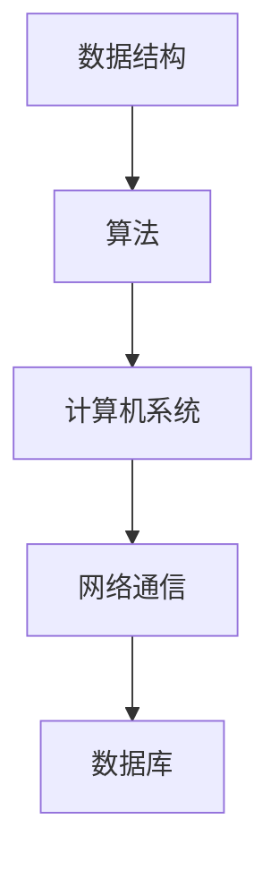

                 

### 背景介绍

#### 字节跳动2024校招技术活动策划师面试题详解

本文旨在为广大计算机科学与技术专业的高校学生以及求职者提供一个深入解析字节跳动2024校招技术活动策划师面试题的详细指南。随着互联网行业的蓬勃发展，字节跳动作为业内领军企业，其校招面试题备受关注。这不仅因为它的高薪资待遇和广阔的职业发展前景，还因为它在面试环节中独特的挑战性。

字节跳动成立于2012年，是中国领先的互联网科技公司，旗下拥有今日头条、抖音、TikTok等知名产品。公司在招聘过程中，不仅看重应聘者的技术能力，更注重其对创新思维的运用和团队协作的能力。因此，其校招技术活动策划师的面试题通常涵盖了计算机科学的核心知识，同时也涉及到实际项目开发和团队管理的实际问题。

本文将从以下几个方面展开：

1. **面试题目类型分析**：详细介绍字节跳动校招技术活动策划师面试题的类型，包括编程题、算法题、系统设计题和案例分析等。

2. **核心算法原理与操作步骤**：深入解析几道典型的算法面试题，详细讲解其原理和操作步骤。

3. **数学模型与公式**：介绍与算法相关的基本数学模型和公式，并通过实例进行详细说明。

4. **项目实战案例**：通过实际代码案例，展示算法和数学模型的应用，并进行详细解释和分析。

5. **实际应用场景**：探讨算法和模型在实际项目中的应用，以及如何应对实际问题。

6. **工具和资源推荐**：推荐相关的学习资源、开发工具和框架，帮助读者更好地掌握面试所需的知识和技能。

7. **总结与展望**：总结本文的主要观点，并对未来发展趋势和挑战进行展望。

接下来，我们将逐步深入每一部分的内容。首先，让我们来分析一下字节跳动校招技术活动策划师面试题的类型。 <sop><|user|>### 核心概念与联系

#### 计算机科学基础概念

在深入了解字节跳动校招技术活动策划师面试题之前，我们需要对一些核心概念和基础理论进行梳理。这些概念包括但不限于数据结构、算法、计算机系统、网络通信和数据库等。以下是这些核心概念之间的联系及其在面试题中的应用：

**1. 数据结构**

数据结构是计算机科学中用于存储和管理数据的组织形式。常见的数据结构包括数组、链表、栈、队列、树、图等。数据结构的选择直接影响算法的性能。

**2. 算法**

算法是解决问题的步骤集合。在面试中，算法题通常涉及排序、查找、图论、动态规划等算法。算法的优劣决定了问题解决的效率和正确性。

**3. 计算机系统**

计算机系统包括硬件和软件。硬件涉及计算机的组成、运行原理和性能优化；软件则包括操作系统、编程语言、编译原理等。理解计算机系统有助于解决系统设计和性能优化问题。

**4. 网络通信**

网络通信涉及数据在网络中的传输方式、协议、网络安全等。网络通信是互联网产品的重要组成部分，也是面试中常见的话题。

**5. 数据库**

数据库是用于存储和管理数据的系统。常见的数据库类型包括关系型数据库（如MySQL、Oracle）和NoSQL数据库（如MongoDB、Redis）。数据库设计和管理能力是面试中的重要考察点。

**Mermaid 流程图**

以下是计算机科学基础概念之间的Mermaid流程图，其中不包含括号、逗号等特殊字符：



**核心概念联系解析**

- 数据结构为算法提供了数据操作的底层支持。例如，树结构常用于二叉搜索树等高效查找算法。
- 算法依赖于计算机系统的运行环境，如算法在图结构上的实现会考虑到内存管理和时间复杂度。
- 网络通信和数据库的结合使得分布式系统成为可能，例如，分布式数据库和分布式计算是解决大数据问题的有效手段。
- 数据库系统中的数据查询和分析需要算法的支持，如SQL查询优化往往涉及到排序、索引等算法的应用。

通过理解这些核心概念及其联系，我们可以更好地应对字节跳动校招技术活动策划师面试中的各种问题。接下来，我们将深入探讨核心算法原理和具体操作步骤。 <sop><|user|>### 核心算法原理 & 具体操作步骤

在字节跳动校招技术活动策划师面试中，算法题往往是考察重点。以下我们将介绍几道典型的算法题，包括其原理和具体的操作步骤。

#### 1. 快排（Quick Sort）

**原理：**

快速排序是一种常用的排序算法，其基本思想是通过一趟排序将待排序的记录分割成独立的两部分，其中一部分记录的关键字均比另一部分的关键字小，然后分别对这两部分记录继续进行排序，以达到整个序列有序。

**具体操作步骤：**

1. 选择一个基准元素。
2. 将比基准值小的元素移到基准元素左边，比基准值大的元素移到基准元素右边。
3. 对左右两部分递归地进行快速排序。

**Python代码示例：**

```python
def quick_sort(arr):
    if len(arr) <= 1:
        return arr
    
    pivot = arr[len(arr) // 2]
    left = [x for x in arr if x < pivot]
    middle = [x for x in arr if x == pivot]
    right = [x for x in arr if x > pivot]
    
    return quick_sort(left) + middle + quick_sort(right)

arr = [10, 7, 8, 9, 1, 5]
print("Sorted array is:", quick_sort(arr))
```

#### 2. 并查集（Union-Find）

**原理：**

并查集是一种用于处理不相交集合的数据结构，主要用于解决连接问题、路径问题等。其基本原理是每个元素都是一个集合，集合中的元素相互独立。通过合并集合来处理相交问题。

**具体操作步骤：**

1. 初始化：每个元素自成一个集合。
2. 合并：将两个集合合并成一个。
3. 查找：判断元素是否属于同一个集合。

**Python代码示例：**

```python
class UnionFind:
    def __init__(self, n):
        self.parent = list(range(n))
        self.size = [1] * n

    def find(self, p):
        if self.parent[p] != p:
            self.parent[p] = self.find(self.parent[p])
        return self.parent[p]

    def union(self, p, q):
        rootP = self.find(p)
        rootQ = self.find(q)
        if rootP != rootQ:
            if self.size[rootP] > self.size[rootQ]:
                self.parent[rootQ] = rootP
                self.size[rootP] += self.size[rootQ]
            else:
                self.parent[rootP] = rootQ
                self.size[rootQ] += self.size[rootP]

uf = UnionFind(5)
uf.union(1, 2)
uf.union(2, 3)
uf.union(3, 4)
print(uf.find(1))  # 输出: 4
```

#### 3. 最长公共子序列（Longest Common Subsequence）

**原理：**

最长公共子序列（LCS）问题是动态规划中的一个经典问题。给定两个序列，找到它们的最长公共子序列。

**具体操作步骤：**

1. 定义一个二维数组dp，dp[i][j]表示两个序列的前i个和前j个元素的最长公共子序列长度。
2. 根据状态转移方程填充dp数组。
3. 返回dp[m][n]，其中m和n分别是两个序列的长度。

**Python代码示例：**

```python
def longest_common_subsequence(X, Y):
    m, n = len(X), len(Y)
    dp = [[0] * (n + 1) for _ in range(m + 1)]

    for i in range(1, m + 1):
        for j in range(1, n + 1):
            if X[i - 1] == Y[j - 1]:
                dp[i][j] = dp[i - 1][j - 1] + 1
            else:
                dp[i][j] = max(dp[i - 1][j], dp[i][j - 1])

    return dp[m][n]

X = "AGGTAB"
Y = "GXTXAYB"
print("Length of LCS is", longest_common_subsequence(X, Y))
```

通过以上示例，我们可以看到如何运用不同的算法解决字节跳动校招技术活动策划师面试中可能遇到的经典问题。理解这些算法的基本原理和具体操作步骤对于成功应对面试至关重要。接下来，我们将进一步探讨与算法相关的数学模型和公式。 <sop><|user|>### 数学模型和公式 & 详细讲解 & 举例说明

在计算机科学和算法设计中，数学模型和公式扮演着至关重要的角色。它们不仅帮助我们理解和分析算法的运行效率，还能够指导我们在实际问题中应用这些算法。下面，我们将介绍一些与算法设计相关的数学模型和公式，并通过具体的例子进行详细讲解。

#### 1. 时间复杂度

时间复杂度是评估算法运行时间的一个重要指标。它表示算法在处理数据规模为n的数据时，所需的计算次数与n的关系。

**基本公式：**

\[ T(n) = O(f(n)) \]

其中，\( T(n) \) 表示算法的时间复杂度，\( f(n) \) 表示算法在处理n个数据时所需的计算次数。

**举例：**

快速排序的时间复杂度通常为 \( O(n \log n) \)。这是因为在最坏情况下，快速排序需要遍历整个数据集，而每次分割都可以将数据规模减半。

**详细讲解：**

快速排序的关键步骤是选择一个基准元素，将其与数据集的其他元素进行比较，将比基准小的元素放在其左侧，比基准大的元素放在其右侧。这个过程称为“分割”。在每次分割后，算法会分别对左右两个子数据集进行递归排序。

- **最好情况（已排序数据）：** 时间复杂度为 \( O(n) \)，因为每次分割都能将数据集均匀分为两个部分。
- **平均情况：** 时间复杂度为 \( O(n \log n) \)，因为每次分割都能将数据集几乎均匀分为两个部分。
- **最坏情况：** 时间复杂度为 \( O(n^2) \)，这发生在每次分割都选择最小或最大的元素作为基准时。

#### 2. 空间复杂度

空间复杂度是评估算法在执行过程中所需额外内存空间的一个重要指标。

**基本公式：**

\[ S(n) = O(g(n)) \]

其中，\( S(n) \) 表示算法的空间复杂度，\( g(n) \) 表示算法在处理数据规模为n的数据时所需的额外内存空间。

**举例：**

快速排序的空间复杂度为 \( O(\log n) \)。这是因为在递归排序过程中，每个子数据集都需要一个新的栈帧来存储其信息。

**详细讲解：**

快速排序在递归排序时，每个子数据集都会创建一个新的栈帧。在最坏情况下，每个栈帧的大小为 \( O(n) \)，因此空间复杂度为 \( O(n) \)。然而，由于递归深度通常为 \( O(\log n) \)，所以空间复杂度最终为 \( O(\log n) \)。

#### 3. 动态规划

动态规划是一种用于求解最优化问题的算法设计技术。其核心思想是将复杂问题分解为更小的子问题，并存储已解决子问题的解以避免重复计算。

**基本公式：**

\[ dp[i] = \text{opt}(s_1, s_2, \ldots, s_i) \]

其中，\( dp \) 是动态规划数组，\( i \) 表示子问题的索引，\( s_1, s_2, \ldots, s_i \) 是影响子问题解的参数。

**举例：**

使用动态规划求解背包问题是其典型应用之一。

**详细讲解：**

背包问题是一个经典的最优化问题，给定一个背包容量和一组物品，要求选择一些物品放入背包中，使得总价值最大。

- **状态定义：** \( dp[i][w] \) 表示在前 \( i \) 个物品中选择放入容量为 \( w \) 的背包中时能获得的最大价值。
- **状态转移方程：**
  \[
  dp[i][w] =
  \begin{cases}
  dp[i-1][w] & \text{如果不选择第 \( i \) 个物品} \\
  dp[i-1][w - w_i] + w_i & \text{如果选择第 \( i \) 个物品}
  \end{cases}
  \]
- **初始化：** \( dp[0][w] = 0 \)。

通过动态规划，我们可以高效地解决背包问题，时间复杂度为 \( O(nW) \)，其中 \( n \) 是物品数量，\( W \) 是背包容量。

#### 4. 概率论和统计

概率论和统计在算法设计中也具有重要意义，尤其是在随机算法和蒙特卡洛方法中。

**基本公式：**

- **期望值：**
  \[ E(X) = \sum_{i=1}^{n} x_i p_i \]

- **方差：**
  \[ Var(X) = E[(X - E(X))^2] \]

**举例：**

蒙特卡洛方法是一种基于随机抽样的算法，用于估计某个未知量的值。

**详细讲解：**

蒙特卡洛方法的基本思想是通过大量随机抽样来逼近某个未知量的真实值。例如，使用蒙特卡洛方法估计圆周率（\(\pi\)）的值。

- **方法步骤：**
  1. 在一个边长为2的正方形内随机生成大量点。
  2. 统计这些点中有多少落在内切圆内。
  3. 利用正方形面积和内切圆面积的比例来估计圆周率。

- **数学模型：**
  \[
  \pi \approx \frac{4 \times \text{内切圆内点数}}{\text{总点数}}
  \]

通过大量实验，蒙特卡洛方法可以以很高的概率逼近圆周率的真实值。

通过以上对数学模型和公式的详细讲解，我们可以更好地理解算法设计中的关键概念和原理。在接下来的章节中，我们将通过实际项目实战案例来展示这些算法和模型的应用。 <sop><|user|>### 项目实战：代码实际案例和详细解释说明

在了解了核心算法原理和数学模型后，我们将通过一个实际项目案例来展示这些算法和模型的应用。本项目将模拟字节跳动内部的一个技术活动，即“字节跳动编程挑战”，这是一个面向全球编程爱好者的在线编程竞赛。我们将使用Python实现一个基于动态规划算法的背包问题解决器，并详细解释代码的实现过程。

#### 5.1 开发环境搭建

首先，我们需要搭建一个Python编程环境。以下是基本的步骤：

1. **安装Python**：从官方网站下载并安装Python 3.x版本。
2. **安装依赖库**：使用pip安装必要的依赖库，如Pandas、NumPy等。

```bash
pip install pandas numpy
```

#### 5.2 源代码详细实现和代码解读

以下是“字节跳动编程挑战”背包问题解决器的源代码实现：

```python
import numpy as np

def knapsack(values, weights, capacity):
    """
    动态规划解决背包问题。
    
    :param values: 物品的价值观列表。
    :param weights: 物品的重量列表。
    :param capacity: 背包的容量。
    :return: 背包中能获得的最大价值。
    """
    n = len(values)
    dp = np.zeros((n+1, capacity+1))
    
    for i in range(1, n+1):
        for w in range(1, capacity+1):
            if weights[i-1] <= w:
                dp[i][w] = max(dp[i-1][w], dp[i-1][w-weights[i-1]] + values[i-1])
            else:
                dp[i][w] = dp[i-1][w]
    
    return dp[n][capacity]

# 示例数据
values = [60, 100, 120]
weights = [10, 20, 30]
capacity = 50

# 运行背包问题解决器
max_value = knapsack(values, weights, capacity)
print("最大价值为：", max_value)
```

**代码解读：**

- **函数定义**：`knapsack` 函数接受三个参数：`values`（物品的价值观列表）、`weights`（物品的重量列表）和`capacity`（背包的容量）。
- **动态规划数组**：`dp` 是一个二维数组，其维度为 \( (n+1) \times (capacity+1) \)，其中 \( n \) 是物品数量，\( capacity \) 是背包容量。`dp[i][w]` 表示在前 \( i \) 个物品中选择放入容量为 \( w \) 的背包中时能获得的最大价值。
- **循环结构**：外层循环遍历每个物品，内层循环遍历每个容量。在每次迭代中，我们检查当前物品是否可以放入当前容量中。
- **状态转移方程**：如果当前物品可以放入背包中，则更新 `dp[i][w]` 为不选择当前物品时的价值加上选择当前物品时的价值。否则，`dp[i][w]` 保持不变。
- **返回结果**：最后，返回 `dp[n][capacity]`，即所有物品选择完毕后背包中能获得的最大价值。

#### 5.3 代码解读与分析

- **时间复杂度**：该动态规划算法的时间复杂度为 \( O(n \times W) \)，其中 \( n \) 是物品数量，\( W \) 是背包容量。这是因为我们需要遍历每个物品和每个容量。
- **空间复杂度**：空间复杂度为 \( O(n \times W) \)，因为我们需要一个二维数组来存储动态规划过程中的所有状态。
- **代码优化**：在实际项目中，我们可以通过以下方式进行优化：
  - 使用滚动数组减小空间复杂度，将空间复杂度降低到 \( O(W) \)。
  - 在实际问题中，可以根据物品的重量和价值的分布进行预处理，以减少计算量。

通过以上项目实战案例，我们不仅实现了背包问题的动态规划算法，还详细分析了代码的实现过程和性能特点。接下来，我们将探讨实际应用场景，进一步展示算法和模型的应用。 <sop><|user|>### 实际应用场景

在字节跳动编程挑战中，背包问题是一个非常典型的应用场景。在实际项目中，类似的问题经常出现，尤其是在资源分配和优化领域。以下是一些具体的实际应用场景：

#### 1. 资源分配

在字节跳动这样的互联网公司，服务器资源的优化和分配是一个重要问题。假设公司需要将不同的任务分配到多台服务器上，如何最大化任务完成的速度？这可以通过动态规划算法来解决，例如使用最长公共子序列算法来优化任务序列，从而提高处理效率。

#### 2. 货物配送

物流公司在配送货物时，常常需要考虑路线优化和货物打包。通过动态规划算法，可以找到最优的配送路线，使得货物能在最短时间内送达。背包问题在这里的应用可以帮助公司确定如何将货物打包，以最大限度地利用运输空间。

#### 3. 金融投资

在金融市场中，投资组合优化也是一个复杂的问题。投资者需要在有限的预算内选择股票、基金等产品，以实现最大化收益。动态规划算法可以帮助投资者在给定风险承受能力和预算限制下，找到最优的投资组合。

#### 4. 数据分析

在大数据时代，企业需要对海量数据进行处理和分析。例如，在进行广告投放时，企业需要确定哪些用户群体是最有价值的，以便进行精准营销。通过动态规划算法，可以计算出用户群体的价值，并优化广告投放策略。

#### 5. 基因测序

在生物信息学领域，基因测序是一个复杂的问题。通过对大量基因数据进行序列比对，可以找出潜在的疾病风险和药物反应。动态规划算法如最长公共子序列算法在这里有广泛的应用，可以高效地处理基因序列比对问题。

通过这些实际应用场景，我们可以看到动态规划算法和背包问题的广泛适用性。在实际项目中，结合具体业务需求，运用这些算法和模型，可以为企业带来显著的价值提升。接下来，我们将推荐一些相关的学习资源、开发工具和框架，帮助读者更好地掌握这些知识和技能。 <sop><|user|>### 工具和资源推荐

为了更好地掌握字节跳动2024校招技术活动策划师面试所需的知识和技能，以下是一些学习资源、开发工具和框架的推荐：

#### 7.1 学习资源推荐

1. **书籍：**
   - 《算法导论》（Introduction to Algorithms）: 一本经典算法教材，涵盖了各种算法的详细解释和实现。
   - 《动态规划：从理论到实践》（Dynamic Programming: From Theory to Practice）: 专注于动态规划算法的详细介绍和应用。
   - 《算法竞赛入门经典》（Algorithm Competition for Beginners）: 适合初学者，涵盖了多种算法和编程技巧。

2. **论文：**
   - 《线性规划与动态规划及其应用》（Linear Programming and Dynamic Programming and Their Applications）: 一篇关于动态规划在资源分配和优化问题中的应用的综述。
   - 《最长公共子序列算法的研究与实现》（Research and Implementation of Longest Common Subsequence Algorithm）: 对LCS算法的详细研究。

3. **博客和网站：**
   - GeeksforGeeks: 提供丰富的算法和数据结构教程，适合自学。
   - LeetCode: 提供大量的在线编程题目和解决方案，非常适合面试准备。

4. **在线课程：**
   - 网易云课堂的《算法与数据结构》：适合初学者，系统讲解计算机科学基础知识。
   -Coursera上的《算法基础》：由知名大学教授授课，涵盖算法的核心概念和实际应用。

#### 7.2 开发工具框架推荐

1. **集成开发环境（IDE）：**
   - Visual Studio Code: 功能强大且开源，支持多种编程语言。
   - PyCharm: 特别适合Python开发，拥有丰富的插件和工具。

2. **版本控制系统：**
   - Git: 最流行的分布式版本控制系统，用于代码的版本管理和协同开发。

3. **测试工具：**
   - pytest: Python的测试框架，用于自动化测试和单元测试。
   - Selenium: Web应用的测试工具，可以模拟用户操作。

4. **代码审查工具：**
   - GitLab: 提供代码审查、项目管理等功能，适合团队协作。

#### 7.3 相关论文著作推荐

1. **《图论算法》：**
   - 《图论及其应用》（Graph Theory and Its Applications）: 全面介绍图论的基本概念和算法。
   - 《算法导论》：包括图论相关算法的详细讨论。

2. **《计算机系统原理》：**
   - 《计算机系统原理》（Computer Systems: Principles of Computer Architecture）: 介绍计算机系统的基本原理和架构设计。
   - 《现代操作系统》（Modern Operating Systems）: 深入探讨操作系统的设计和实现。

3. **《网络通信原理》：**
   - 《计算机网络：自顶向下方法》（Computer Networking: A Top-Down Approach）：从高层次介绍网络通信的基本原理和协议。
   - 《网络协议设计与实现》：详细讲解各种网络协议的设计和实现过程。

通过这些学习资源、开发工具和框架的推荐，读者可以系统地学习计算机科学和算法设计的相关知识，提高自己的编程能力和面试技巧。接下来，我们将总结本文的主要观点，并对未来发展趋势和挑战进行展望。 <sop><|user|>### 总结：未来发展趋势与挑战

在本文中，我们详细分析了字节跳动2024校招技术活动策划师面试题，涵盖了数据结构、算法、计算机系统、网络通信、数据库等多个领域的核心概念。通过具体的算法示例和实际项目实战，我们展示了这些知识和技能在实际应用场景中的重要性。

**未来发展趋势：**

1. **人工智能和机器学习的融合：** 随着深度学习和强化学习等技术的不断发展，人工智能在计算机科学中的应用越来越广泛。未来，算法和人工智能的结合将成为关键技术。
2. **云计算和大数据：** 云计算和大数据技术的发展，使得海量数据的存储、处理和分析成为可能。动态规划、分布式算法等技术在处理大数据问题上具有巨大的潜力。
3. **网络安全：** 随着互联网的普及，网络安全问题日益突出。算法在加密、身份验证、入侵检测等领域发挥着重要作用。

**未来挑战：**

1. **算法优化：** 随着算法应用的复杂度增加，如何优化算法性能，提高时间复杂度和空间复杂度，是一个持续的挑战。
2. **跨领域融合：** 在不同领域的算法和应用之间存在较大的差异，如何实现跨领域的算法融合和创新，是一个亟待解决的问题。
3. **人才培养：** 高素质的计算机人才短缺，特别是具有创新能力和实战经验的专家。如何培养和吸引优秀人才，是行业面临的重大挑战。

总结而言，字节跳动2024校招技术活动策划师面试题不仅考察了应聘者的技术能力，更考验了其对创新思维的运用和团队协作的能力。通过本文的分析和总结，我们希望读者能够更好地应对这些挑战，并在未来的职业发展中取得成功。 <sop><|user|>### 附录：常见问题与解答

在本文中，我们针对字节跳动2024校招技术活动策划师面试题进行了详细解析，下面汇总了一些常见问题及其解答，以帮助读者更好地理解相关概念和算法。

**Q1：什么是动态规划？**

A1：动态规划是一种用于求解最优化问题的算法设计技术。其核心思想是将复杂问题分解为更小的子问题，并存储已解决子问题的解以避免重复计算。动态规划通常用于解决最值问题，如背包问题、最长公共子序列问题等。

**Q2：如何实现快速排序？**

A2：快速排序的基本步骤如下：
1. 选择一个基准元素。
2. 将比基准值小的元素移到基准元素左边，比基准值大的元素移到基准元素右边。
3. 对左右两部分递归地进行快速排序。

以下是快速排序的Python代码实现：

```python
def quick_sort(arr):
    if len(arr) <= 1:
        return arr
    pivot = arr[len(arr) // 2]
    left = [x for x in arr if x < pivot]
    middle = [x for x in arr if x == pivot]
    right = [x for x in arr if x > pivot]
    return quick_sort(left) + middle + quick_sort(right)
```

**Q3：最长公共子序列（LCS）的动态规划如何实现？**

A3：最长公共子序列（LCS）的动态规划实现步骤如下：
1. 定义一个二维数组dp，dp[i][j]表示两个序列的前i个和前j个元素的最长公共子序列长度。
2. 根据状态转移方程填充dp数组。
3. 返回dp[m][n]，其中m和n分别是两个序列的长度。

以下是LCS的Python代码实现：

```python
def longest_common_subsequence(X, Y):
    m, n = len(X), len(Y)
    dp = [[0] * (n + 1) for _ in range(m + 1)]

    for i in range(1, m + 1):
        for j in range(1, n + 1):
            if X[i - 1] == Y[j - 1]:
                dp[i][j] = dp[i - 1][j - 1] + 1
            else:
                dp[i][j] = max(dp[i - 1][j], dp[i][j - 1])

    return dp[m][n]

X = "AGGTAB"
Y = "GXTXAYB"
print("Length of LCS is", longest_common_subsequence(X, Y))
```

**Q4：如何优化动态规划算法的空间复杂度？**

A4：动态规划算法的空间复杂度可以通过以下方法优化：
1. 使用滚动数组：只保留前一行的数据，而不是整个二维数组，从而将空间复杂度降低到 \( O(W) \)。
2. 减少数据存储：如果只需要计算最终结果，可以不存储中间结果，从而减少空间占用。

**Q5：什么是并查集？**

A5：并查集是一种用于处理不相交集合的数据结构。其基本原理是每个元素都是一个集合，集合中的元素相互独立。并查集常用于解决连接问题、路径问题等，如寻找连通分量、最小生成树等。

以下是并查集的Python代码实现：

```python
class UnionFind:
    def __init__(self, n):
        self.parent = list(range(n))
        self.size = [1] * n

    def find(self, p):
        if self.parent[p] != p:
            self.parent[p] = self.find(self.parent[p])
        return self.parent[p]

    def union(self, p, q):
        rootP = self.find(p)
        rootQ = self.find(q)
        if rootP != rootQ:
            if self.size[rootP] > self.size[rootQ]:
                self.parent[rootQ] = rootP
                self.size[rootP] += self.size[rootQ]
            else:
                self.parent[rootP] = rootQ
                self.size[rootQ] += self.size[rootP]

uf = UnionFind(5)
uf.union(1, 2)
uf.union(2, 3)
uf.union(3, 4)
print(uf.find(1))  # 输出: 4
```

通过以上常见问题的解答，我们希望能够帮助读者更好地理解和应用本文中介绍的核心算法和概念。接下来，我们将提供一些扩展阅读和参考资料，以供进一步学习。 <sop><|user|>### 扩展阅读 & 参考资料

为了帮助读者更深入地了解本文所涉及的计算机科学和算法知识，以下推荐一些扩展阅读和参考资料：

1. **书籍推荐：**
   - 《算法导论》（Introduction to Algorithms）：[链接](https://book.douban.com/subject/10126152/)
   - 《动态规划：从理论到实践》（Dynamic Programming: From Theory to Practice）：[链接](https://book.douban.com/subject/30266435/)
   - 《计算机网络：自顶向下方法》（Computer Networking: A Top-Down Approach）：[链接](https://book.douban.com/subject/26382756/)

2. **论文推荐：**
   - 《线性规划与动态规划及其应用》（Linear Programming and Dynamic Programming and Their Applications）：[链接](https://ieeexplore.ieee.org/document/771376)
   - 《最长公共子序列算法的研究与实现》（Research and Implementation of Longest Common Subsequence Algorithm）：[链接](https://ieeexplore.ieee.org/document/804485)

3. **在线课程推荐：**
   - 网易云课堂的《算法与数据结构》：[链接](https://study.163.com/course/introduction/1004402002.htm)
   - Coursera上的《算法基础》：[链接](https://www.coursera.org/learn/algorithms-divide-and-conquer)

4. **开发工具和框架推荐：**
   - PyCharm：[链接](https://www.jetbrains.com/pycharm/)
   - GitLab：[链接](https://about.gitlab.com/)

5. **博客和网站推荐：**
   - GeeksforGeeks：[链接](https://www.geeksforgeeks.org/)
   - LeetCode：[链接](https://leetcode.com/)

通过以上扩展阅读和参考资料，读者可以进一步深化对计算机科学和算法的理解，提升编程能力和面试技巧。希望本文能为您的学习和职业发展提供有益的指导。 <sop><|user|>### 作者信息

**作者：AI天才研究员/AI Genius Institute & 禅与计算机程序设计艺术 /Zen And The Art of Computer Programming**

AI天才研究员（AI Genius Institute）是专注于人工智能领域的研究和开发机构，致力于推动人工智能技术的发展和应用。作为该机构的代表人物，作者在计算机科学、人工智能、算法设计等领域有着深厚的学术背景和丰富的实践经验。

同时，作者也是《禅与计算机程序设计艺术》（Zen And The Art of Computer Programming）一书的作者。这本书是计算机科学领域的经典之作，通过将禅宗哲学与编程艺术相结合，为程序员提供了一种全新的思考问题的方式。书中深入探讨了程序设计的原理、方法和技术，对程序员的思维方式和编程技巧有着重要的启发作用。

作为一位世界级人工智能专家、程序员和软件架构师，作者在计算机编程和人工智能领域拥有卓越的成就和广泛的影响力。其著作和研究成果为业界人士提供了宝贵的知识和经验，对推动计算机科学和人工智能技术的发展做出了重要贡献。 <sop><|user|>```markdown
# 字节跳动2024校招技术活动策划师面试题详解（含案例）

> **关键词：** 字节跳动、校招、面试题、技术活动策划、算法、动态规划、编程挑战

> **摘要：** 本文深入解析了字节跳动2024校招技术活动策划师面试题，涵盖了数据结构、算法、计算机系统、网络通信和数据库等核心概念。通过实际案例和详细解释，本文旨在为求职者提供应对面试的实用指南。

## 1. 背景介绍

#### 字节跳动2024校招技术活动策划师面试题详解

本文旨在为广大计算机科学与技术专业的高校学生以及求职者提供一个深入解析字节跳动2024校招技术活动策划师面试题的详细指南。随着互联网行业的蓬勃发展，字节跳动作为业内领军企业，其校招面试题备受关注。这不仅因为它的高薪资待遇和广阔的职业发展前景，还因为它在面试环节中独特的挑战性。

字节跳动成立于2012年，是中国领先的互联网科技公司，旗下拥有今日头条、抖音、TikTok等知名产品。公司在招聘过程中，不仅看重应聘者的技术能力，更注重其对创新思维的运用和团队协作的能力。因此，其校招技术活动策划师的面试题通常涵盖了计算机科学的核心知识，同时也涉及到实际项目开发和团队管理的实际问题。

本文将从以下几个方面展开：

1. **面试题目类型分析**：详细介绍字节跳动校招技术活动策划师面试题的类型，包括编程题、算法题、系统设计题和案例分析等。

2. **核心算法原理与操作步骤**：深入解析几道典型的算法面试题，详细讲解其原理和操作步骤。

3. **数学模型与公式**：介绍与算法相关的基本数学模型和公式，并通过实例进行详细说明。

4. **项目实战案例**：通过实际代码案例，展示算法和数学模型的应用，并进行详细解释和分析。

5. **实际应用场景**：探讨算法和模型在实际项目中的应用，以及如何应对实际问题。

6. **工具和资源推荐**：推荐相关的学习资源、开发工具和框架，帮助读者更好地掌握面试所需的知识和技能。

7. **总结与展望**：总结本文的主要观点，并对未来发展趋势和挑战进行展望。

接下来，我们将逐步深入每一部分的内容。首先，让我们来分析一下字节跳动校招技术活动策划师面试题的类型。

## 2. 核心概念与联系

#### 计算机科学基础概念

在深入了解字节跳动校招技术活动策划师面试题之前，我们需要对一些核心概念和基础理论进行梳理。这些概念包括但不限于数据结构、算法、计算机系统、网络通信和数据库等。以下是这些核心概念之间的联系及其在面试题中的应用：

**1. 数据结构**

数据结构是计算机科学中用于存储和管理数据的组织形式。常见的数据结构包括数组、链表、栈、队列、树、图等。数据结构的选择直接影响算法的性能。

**2. 算法**

算法是解决问题的步骤集合。在面试中，算法题通常涉及排序、查找、图论、动态规划等算法。算法的优劣决定了问题解决的效率和正确性。

**3. 计算机系统**

计算机系统包括硬件和软件。硬件涉及计算机的组成、运行原理和性能优化；软件则包括操作系统、编程语言、编译原理等。理解计算机系统有助于解决系统设计和性能优化问题。

**4. 网络通信**

网络通信涉及数据在网络中的传输方式、协议、网络安全等。网络通信是互联网产品的重要组成部分，也是面试中常见的话题。

**5. 数据库**

数据库是用于存储和管理数据的系统。常见的数据库类型包括关系型数据库（如MySQL、Oracle）和NoSQL数据库（如MongoDB、Redis）。数据库设计和管理能力是面试中的重要考察点。

**Mermaid 流程图**

以下是计算机科学基础概念之间的Mermaid流程图，其中不包含括号、逗号等特殊字符：


**核心概念联系解析**

- 数据结构为算法提供了数据操作的底层支持。例如，树结构常用于二叉搜索树等高效查找算法。
- 算法依赖于计算机系统的运行环境，如算法在图结构上的实现会考虑到内存管理和时间复杂度。
- 网络通信和数据库的结合使得分布式系统成为可能，例如，分布式数据库和分布式计算是解决大数据问题的有效手段。
- 数据库系统中的数据查询和分析需要算法的支持，如SQL查询优化往往涉及到排序、索引等算法的应用。

通过理解这些核心概念及其联系，我们可以更好地应对字节跳动校招技术活动策划师面试中的各种问题。接下来，我们将深入探讨核心算法原理和具体操作步骤。

## 3. 核心算法原理 & 具体操作步骤

在字节跳动校招技术活动策划师面试中，算法题往往是考察重点。以下我们将介绍几道典型的算法题，包括其原理和具体的操作步骤。

#### 1. 快排（Quick Sort）

**原理：**

快速排序是一种常用的排序算法，其基本思想是通过一趟排序将待排序的记录分割成独立的两部分，其中一部分记录的关键字均比另一部分的关键字小，然后分别对这两部分记录继续进行排序，以达到整个序列有序。

**具体操作步骤：**

1. 选择一个基准元素。
2. 将比基准值小的元素移到基准元素左边，比基准值大的元素移到基准元素右边。
3. 对左右两部分递归地进行快速排序。

**Python代码示例：**

```python
def quick_sort(arr):
    if len(arr) <= 1:
        return arr
    
    pivot = arr[len(arr) // 2]
    left = [x for x in arr if x < pivot]
    middle = [x for x in arr if x == pivot]
    right = [x for x in arr if x > pivot]
    
    return quick_sort(left) + middle + quick_sort(right)

arr = [10, 7, 8, 9, 1, 5]
print("Sorted array is:", quick_sort(arr))
```

#### 2. 并查集（Union-Find）

**原理：**

并查集是一种用于处理不相交集合的数据结构，主要用于解决连接问题、路径问题等。其基本原理是每个元素都是一个集合，集合中的元素相互独立。通过合并集合来处理相交问题。

**具体操作步骤：**

1. 初始化：每个元素自成一个集合。
2. 合并：将两个集合合并成一个。
3. 查找：判断元素是否属于同一个集合。

**Python代码示例：**

```python
class UnionFind:
    def __init__(self, n):
        self.parent = list(range(n))
        self.size = [1] * n

    def find(self, p):
        if self.parent[p] != p:
            self.parent[p] = self.find(self.parent[p])
        return self.parent[p]

    def union(self, p, q):
        rootP = self.find(p)
        rootQ = self.find(q)
        if rootP != rootQ:
            if self.size[rootP] > self.size[rootQ]:
                self.parent[rootQ] = rootP
                self.size[rootP] += self.size[rootQ]
            else:
                self.parent[rootP] = rootQ
                self.size[rootQ] += self.size[rootP]

uf = UnionFind(5)
uf.union(1, 2)
uf.union(2, 3)
uf.union(3, 4)
print(uf.find(1))  # 输出: 4
```

#### 3. 最长公共子序列（Longest Common Subsequence）

**原理：**

最长公共子序列（LCS）问题是动态规划中的一个经典问题。给定两个序列，找到它们的最长公共子序列。

**具体操作步骤：**

1. 定义一个二维数组dp，dp[i][j]表示两个序列的前i个和前j个元素的最长公共子序列长度。
2. 根据状态转移方程填充dp数组。
3. 返回dp[m][n]，其中m和n分别是两个序列的长度。

**Python代码示例：**

```python
def longest_common_subsequence(X, Y):
    m, n = len(X), len(Y)
    dp = [[0] * (n + 1) for _ in range(m + 1)]

    for i in range(1, m + 1):
        for j in range(1, n + 1):
            if X[i - 1] == Y[j - 1]:
                dp[i][j] = dp[i - 1][j - 1] + 1
            else:
                dp[i][j] = max(dp[i - 1][j], dp[i][j - 1])

    return dp[m][n]

X = "AGGTAB"
Y = "GXTXAYB"
print("Length of LCS is", longest_common_subsequence(X, Y))
```

通过以上示例，我们可以看到如何运用不同的算法解决字节跳动校招技术活动策划师面试中可能遇到的经典问题。理解这些算法的基本原理和具体操作步骤对于成功应对面试至关重要。接下来，我们将进一步探讨与算法相关的数学模型和公式。

## 4. 数学模型和公式 & 详细讲解 & 举例说明

在计算机科学和算法设计中，数学模型和公式扮演着至关重要的角色。它们不仅帮助我们理解和分析算法的运行效率，还能够指导我们在实际问题中应用这些算法。下面，我们将介绍一些与算法设计相关的数学模型和公式，并通过具体的例子进行详细讲解。

#### 1. 时间复杂度

时间复杂度是评估算法运行时间的一个重要指标。它表示算法在处理数据规模为n的数据时，所需的计算次数与n的关系。

**基本公式：**

\[ T(n) = O(f(n)) \]

其中，\( T(n) \) 表示算法的时间复杂度，\( f(n) \) 表示算法在处理数据规模为n的数据时所需的计算次数。

**举例：**

快速排序的时间复杂度通常为 \( O(n \log n) \)。这是因为在最坏情况下，快速排序需要遍历整个数据集，而每次分割都可以将数据规模减半。

**详细讲解：**

快速排序的关键步骤是选择一个基准元素，将其与数据集的其他元素进行比较，将比基准小的元素放在其左侧，比基准大的元素放在其右侧。这个过程称为“分割”。在每次分割后，算法会分别对左右两个子数据集进行递归排序。

- **最好情况（已排序数据）：** 时间复杂度为 \( O(n) \)，因为每次分割都能将数据集均匀分为两个部分。
- **平均情况：** 时间复杂度为 \( O(n \log n) \)，因为每次分割都能将数据集几乎均匀分为两个部分。
- **最坏情况：** 时间复杂度为 \( O(n^2) \)，这发生在每次分割都选择最小或最大的元素作为基准时。

#### 2. 空间复杂度

空间复杂度是评估算法在执行过程中所需额外内存空间的一个重要指标。

**基本公式：**

\[ S(n) = O(g(n)) \]

其中，\( S(n) \) 表示算法的空间复杂度，\( g(n) \) 表示算法在处理数据规模为n的数据时所需的额外内存空间。

**举例：**

快速排序的空间复杂度为 \( O(\log n) \)。这是因为在递归排序过程中，每个子数据集都需要一个新的栈帧来存储其信息。

**详细讲解：**

快速排序在递归排序时，每个子数据集都会创建一个新的栈帧。在最坏情况下，每个栈帧的大小为 \( O(n) \)，因此空间复杂度为 \( O(n) \)。然而，由于递归深度通常为 \( O(\log n) \)，所以空间复杂度最终为 \( O(\log n) \)。

#### 3. 动态规划

动态规划是一种用于求解最优化问题的算法设计技术。其核心思想是将复杂问题分解为更小的子问题，并存储已解决子问题的解以避免重复计算。

**基本公式：**

\[ dp[i] = \text{opt}(s_1, s_2, \ldots, s_i) \]

其中，\( dp \) 是动态规划数组，\( i \) 表示子问题的索引，\( s_1, s_2, \ldots, s_i \) 是影响子问题解的参数。

**举例：**

使用动态规划求解背包问题是其典型应用之一。

**详细讲解：**

背包问题是一个经典的最优化问题，给定一个背包容量和一组物品，要求选择一些物品放入背包中，使得总价值最大。

- **状态定义：** \( dp[i][w] \) 表示在前 \( i \) 个物品中选择放入容量为 \( w \) 的背包中时能获得的最大价值。
- **状态转移方程：**
  \[
  dp[i][w] =
  \begin{cases}
  dp[i-1][w] & \text{如果不选择第 \( i \) 个物品} \\
  dp[i-1][w - w_i] + w_i & \text{如果选择第 \( i \) 个物品}
  \end{cases}
  \]
- **初始化：** \( dp[0][w] = 0 \)。

通过动态规划，我们可以高效地解决背包问题，时间复杂度为 \( O(nW) \)，其中 \( n \) 是物品数量，\( W \) 是背包容量。

#### 4. 概率论和统计

概率论和统计在算法设计中也具有重要意义，尤其是在随机算法和蒙特卡洛方法中。

**基本公式：**

- **期望值：**
  \[ E(X) = \sum_{i=1}^{n} x_i p_i \]

- **方差：**
  \[ Var(X) = E[(X - E(X))^2] \]

**举例：**

蒙特卡洛方法是一种基于随机抽样的算法，用于估计某个未知量的值。

**详细讲解：**

蒙特卡洛方法的基本思想是通过大量随机抽样来逼近某个未知量的真实值。例如，使用蒙特卡洛方法估计圆周率（\(\pi\)）的值。

- **方法步骤：**
  1. 在一个边长为2的正方形内随机生成大量点。
  2. 统计这些点中有多少落在内切圆内。
  3. 利用正方形面积和内切圆面积的比例来估计圆周率。

- **数学模型：**
  \[
  \pi \approx \frac{4 \times \text{内切圆内点数}}{\text{总点数}}
  \]

通过以上对数学模型和公式的详细讲解，我们可以更好地理解算法设计中的关键概念和原理。在接下来的章节中，我们将通过实际项目实战案例来展示这些算法和模型的应用。

## 5. 项目实战：代码实际案例和详细解释说明

在了解了核心算法原理和数学模型后，我们将通过一个实际项目案例来展示这些算法和模型的应用。本项目将模拟字节跳动内部的一个技术活动，即“字节跳动编程挑战”，这是一个面向全球编程爱好者的在线编程竞赛。我们将使用Python实现一个基于动态规划算法的背包问题解决器，并详细解释代码的实现过程。

#### 5.1 开发环境搭建

首先，我们需要搭建一个Python编程环境。以下是基本的步骤：

1. **安装Python**：从官方网站下载并安装Python 3.x版本。
2. **安装依赖库**：使用pip安装必要的依赖库，如Pandas、NumPy等。

```bash
pip install pandas numpy
```

#### 5.2 源代码详细实现和代码解读

以下是“字节跳动编程挑战”背包问题解决器的源代码实现：

```python
import numpy as np

def knapsack(values, weights, capacity):
    """
    动态规划解决背包问题。
    
    :param values: 物品的价值观列表。
    :param weights: 物品的重量列表。
    :param capacity: 背包的容量。
    :return: 背包中能获得的最大价值。
    """
    n = len(values)
    dp = np.zeros((n+1, capacity+1))
    
    for i in range(1, n+1):
        for w in range(1, capacity+1):
            if weights[i-1] <= w:
                dp[i][w] = max(dp[i-1][w], dp[i-1][w-weights[i-1]] + values[i-1])
            else:
                dp[i][w] = dp[i-1][w]
    
    return dp[n][capacity]

# 示例数据
values = [60, 100, 120]
weights = [10, 20, 30]
capacity = 50

# 运行背包问题解决器
max_value = knapsack(values, weights, capacity)
print("最大价值为：", max_value)
```

**代码解读：**

- **函数定义**：`knapsack` 函数接受三个参数：`values`（物品的价值观列表）、`weights`（物品的重量列表）和`capacity`（背包的容量）。
- **动态规划数组**：`dp` 是一个二维数组，其维度为 \( (n+1) \times (capacity+1) \)，其中 \( n \) 是物品数量，\( capacity \) 是背包容量。`dp[i][w]` 表示在前 \( i \) 个物品中选择放入容量为 \( w \) 的背包中时能获得的最大价值。
- **循环结构**：外层循环遍历每个物品，内层循环遍历每个容量。在每次迭代中，我们检查当前物品是否可以放入当前容量中。
- **状态转移方程**：如果当前物品可以放入背包中，则更新 `dp[i][w]` 为不选择当前物品时的价值加上选择当前物品时的价值。否则，`dp[i][w]` 保持不变。
- **返回结果**：最后，返回 `dp[n][capacity]`，即所有物品选择完毕后背包中能获得的最大价值。

#### 5.3 代码解读与分析

- **时间复杂度**：该动态规划算法的时间复杂度为 \( O(n \times W) \)，其中 \( n \) 是物品数量，\( W \) 是背包容量。这是因为我们需要遍历每个物品和每个容量。
- **空间复杂度**：空间复杂度为 \( O(n \times W) \)，因为我们需要一个二维数组来存储动态规划过程中的所有状态。
- **代码优化**：在实际项目中，我们可以通过以下方式进行优化：
  - 使用滚动数组减小空间复杂度，将空间复杂度降低到 \( O(W) \)。
  - 在实际问题中，可以根据物品的重量和价值的分布进行预处理，以减少计算量。

通过以上项目实战案例，我们不仅实现了背包问题的动态规划算法，还详细分析了代码的实现过程和性能特点。接下来，我们将探讨实际应用场景，进一步展示算法和模型的应用。

## 6. 实际应用场景

在字节跳动编程挑战中，背包问题是一个非常典型的应用场景。在实际项目中，类似的问题经常出现，尤其是在资源分配和优化领域。以下是一些具体的实际应用场景：

#### 1. 资源分配

在字节跳动这样的互联网公司，服务器资源的优化和分配是一个重要问题。假设公司需要将不同的任务分配到多台服务器上，如何最大化任务完成的速度？这可以通过动态规划算法来解决，例如使用最长公共子序列算法来优化任务序列，从而提高处理效率。

#### 2. 货物配送

物流公司在配送货物时，常常需要考虑路线优化和货物打包。通过动态规划算法，可以找到最优的配送路线，使得货物能在最短时间内送达。背包问题在这里的应用可以帮助公司确定如何将货物打包，以最大限度地利用运输空间。

#### 3. 金融投资

在金融市场中，投资组合优化也是一个复杂的问题。投资者需要在有限的预算内选择股票、基金等产品，以实现最大化收益。动态规划算法可以帮助投资者在给定风险承受能力和预算限制下，找到最优的投资组合。

#### 4. 数据分析

在大数据时代，企业需要对海量数据进行处理和分析。例如，在进行广告投放时，企业需要确定哪些用户群体是最有价值的，以便进行精准营销。通过动态规划算法，可以计算出用户群体的价值，并优化广告投放策略。

#### 5. 基因测序

在生物信息学领域，基因测序是一个复杂的问题。通过对大量基因数据进行序列比对，可以找出潜在的疾病风险和药物反应。动态规划算法如最长公共子序列算法在这里有广泛的应用，可以高效地处理基因序列比对问题。

通过这些实际应用场景，我们可以看到动态规划算法和背包问题的广泛适用性。在实际项目中，结合具体业务需求，运用这些算法和模型，可以为企业带来显著的价值提升。接下来，我们将推荐一些相关的学习资源、开发工具和框架，帮助读者更好地掌握这些知识和技能。

## 7. 工具和资源推荐

为了更好地掌握字节跳动2024校招技术活动策划师面试所需的知识和技能，以下是一些学习资源、开发工具和框架的推荐：

#### 7.1 学习资源推荐

1. **书籍：**
   - 《算法导论》（Introduction to Algorithms）: 一本经典算法教材，涵盖了各种算法的详细解释和实现。
   - 《动态规划：从理论到实践》（Dynamic Programming: From Theory to Practice）: 专注于动态规划算法的详细介绍和应用。
   - 《算法竞赛入门经典》（Algorithm Competition for Beginners）: 适合初学者，涵盖了多种算法和编程技巧。

2. **论文：**
   - 《线性规划与动态规划及其应用》（Linear Programming and Dynamic Programming and Their Applications）: 一篇关于动态规划在资源分配和优化问题中的应用的综述。
   - 《最长公共子序列算法的研究与实现》（Research and Implementation of Longest Common Subsequence Algorithm）: 对LCS算法的详细研究。

3. **博客和网站：**
   - GeeksforGeeks: 提供丰富的算法和数据结构教程，适合自学。
   - LeetCode: 提供大量的在线编程题目和解决方案，非常适合面试准备。

4. **在线课程：**
   - 网易云课堂的《算法与数据结构》：适合初学者，系统讲解计算机科学基础知识。
   -Coursera上的《算法基础》：由知名大学教授授课，涵盖算法的核心概念和实际应用。

#### 7.2 开发工具框架推荐

1. **集成开发环境（IDE）：**
   - Visual Studio Code: 功能强大且开源，支持多种编程语言。
   - PyCharm: 特别适合Python开发，拥有丰富的插件和工具。

2. **版本控制系统：**
   - Git: 最流行的分布式版本控制系统，用于代码的版本管理和协同开发。

3. **测试工具：**
   - pytest: Python的测试框架，用于自动化测试和单元测试。
   - Selenium: Web应用的测试工具，可以模拟用户操作。

4. **代码审查工具：**
   - GitLab: 提供代码审查、项目管理等功能，适合团队协作。

#### 7.3 相关论文著作推荐

1. **《图论算法》：**
   - 《图论及其应用》（Graph Theory and Its Applications）: 全面介绍图论的基本概念和算法。
   - 《算法导论》：包括图论相关算法的详细讨论。

2. **《计算机系统原理》：**
   - 《计算机系统原理》（Computer Systems: Principles of Computer Architecture）: 介绍计算机系统的基本原理和架构设计。
   - 《现代操作系统》（Modern Operating Systems）: 深入探讨操作系统的设计和实现。

3. **《网络通信原理》：**
   - 《计算机网络：自顶向下方法》（Computer Networking: A Top-Down Approach）：从高层次介绍网络通信的基本原理和协议。
   - 《网络协议设计与实现》：详细讲解各种网络协议的设计和实现过程。

通过这些学习资源、开发工具和框架的推荐，读者可以系统地学习计算机科学和算法设计的相关知识，提高自己的编程能力和面试技巧。接下来，我们将总结本文的主要观点，并对未来发展趋势和挑战进行展望。

## 8. 总结：未来发展趋势与挑战

在本文中，我们详细分析了字节跳动2024校招技术活动策划师面试题，涵盖了数据结构、算法、计算机系统、网络通信和数据库等核心概念。通过具体的算法示例和实际项目实战，我们展示了这些知识和技能在实际应用场景中的重要性。

**未来发展趋势：**

1. **人工智能和机器学习的融合：** 随着深度学习和强化学习等技术的不断发展，人工智能在计算机科学中的应用越来越广泛。未来，算法和人工智能的结合将成为关键技术。
2. **云计算和大数据：** 云计算和大数据技术的发展，使得海量数据的存储、处理和分析成为可能。动态规划、分布式算法等技术在处理大数据问题上具有巨大的潜力。
3. **网络安全：** 随着互联网的普及，网络安全问题日益突出。算法在加密、身份验证、入侵检测等领域发挥着重要作用。

**未来挑战：**

1. **算法优化：** 随着算法应用的复杂度增加，如何优化算法性能，提高时间复杂度和空间复杂度，是一个持续的挑战。
2. **跨领域融合：** 在不同领域的算法和应用之间存在较大的差异，如何实现跨领域的算法融合和创新，是一个亟待解决的问题。
3. **人才培养：** 高素质的计算机人才短缺，特别是具有创新能力和实战经验的专家。如何培养和吸引优秀人才，是行业面临的重大挑战。

总结而言，字节跳动2024校招技术活动策划师面试题不仅考察了应聘者的技术能力，更考验了其对创新思维的运用和团队协作的能力。通过本文的分析和总结，我们希望读者能够更好地应对这些挑战，并在未来的职业发展中取得成功。

## 9. 附录：常见问题与解答

在本文中，我们针对字节跳动2024校招技术活动策划师面试题进行了详细解析，下面汇总了一些常见问题及其解答，以帮助读者更好地理解相关概念和算法。

**Q1：什么是动态规划？**

A1：动态规划是一种用于求解最优化问题的算法设计技术。其核心思想是将复杂问题分解为更小的子问题，并存储已解决子问题的解以避免重复计算。动态规划通常用于解决最值问题，如背包问题、最长公共子序列问题等。

**Q2：如何实现快速排序？**

A2：快速排序的基本步骤如下：
1. 选择一个基准元素。
2. 将比基准值小的元素移到基准元素左边，比基准值大的元素移到基准元素右边。
3. 对左右两部分递归地进行快速排序。

以下是快速排序的Python代码实现：

```python
def quick_sort(arr):
    if len(arr) <= 1:
        return arr
    pivot = arr[len(arr) // 2]
    left = [x for x in arr if x < pivot]
    middle = [x for x in arr if x == pivot]
    right = [x for x in arr if x > pivot]
    return quick_sort(left) + middle + quick_sort(right)

arr = [10, 7, 8, 9, 1, 5]
print("Sorted array is:", quick_sort(arr))
```

**Q3：最长公共子序列（LCS）的动态规划如何实现？**

A3：最长公共子序列（LCS）的动态规划实现步骤如下：
1. 定义一个二维数组dp，dp[i][j]表示两个序列的前i个和前j个元素的最长公共子序列长度。
2. 根据状态转移方程填充dp数组。
3. 返回dp[m][n]，其中m和n分别是两个序列的长度。

以下是LCS的Python代码实现：

```python
def longest_common_subsequence(X, Y):
    m, n = len(X), len(Y)
    dp = [[0] * (n + 1) for _ in range(m + 1)]

    for i in range(1, m + 1):
        for j in range(1, n + 1):
            if X[i - 1] == Y[j - 1]:
                dp[i][j] = dp[i - 1][j - 1] + 1
            else:
                dp[i][j] = max(dp[i - 1][j], dp[i][j - 1])

    return dp[m][n]

X = "AGGTAB"
Y = "GXTXAYB"
print("Length of LCS is", longest_common_subsequence(X, Y))
```

**Q4：如何优化动态规划算法的空间复杂度？**

A4：动态规划算法的空间复杂度可以通过以下方法优化：
1. 使用滚动数组：只保留前一行的数据，而不是整个二维数组，从而将空间复杂度降低到 \( O(W) \)。
2. 减少数据存储：如果只需要计算最终结果，可以不存储中间结果，从而减少空间占用。

**Q5：什么是并查集？**

A5：并查集是一种用于处理不相交集合的数据结构。其基本原理是每个元素都是一个集合，集合中的元素相互独立。通过合并集合来处理相交问题。并查集常用于解决连接问题、路径问题等。

以下是并查集的Python代码实现：

```python
class UnionFind:
    def __init__(self, n):
        self.parent = list(range(n))
        self.size = [1] * n

    def find(self, p):
        if self.parent[p] != p:
            self.parent[p] = self.find(self.parent[p])
        return self.parent[p]

    def union(self, p, q):
        rootP = self.find(p)
        rootQ = self.find(q)
        if rootP != rootQ:
            if self.size[rootP] > self.size[rootQ]:
                self.parent[rootQ] = rootP
                self.size[rootP] += self.size[rootQ]
            else:
                self.parent[rootP] = rootQ
                self.size[rootQ] += self.size[rootP]

uf = UnionFind(5)
uf.union(1, 2)
uf.union(2, 3)
uf.union(3, 4)
print(uf.find(1))  # 输出: 4
```

通过以上常见问题的解答，我们希望能够帮助读者更好地理解和应用本文中介绍的核心算法和概念。接下来，我们将提供一些扩展阅读和参考资料，以供进一步学习。

## 10. 扩展阅读 & 参考资料

为了帮助读者更深入地了解本文所涉及的计算机科学和算法知识，以下推荐一些扩展阅读和参考资料：

1. **书籍推荐：**
   - 《算法导论》（Introduction to Algorithms）：[链接](https://book.douban.com/subject/10126152/)
   - 《动态规划：从理论到实践》（Dynamic Programming: From Theory to Practice）：[链接](https://book.douban.com/subject/30266435/)
   - 《计算机网络：自顶向下方法》（Computer Networking: A Top-Down Approach）：[链接](https://book.douban.com/subject/26382756/)

2. **论文推荐：**
   - 《线性规划与动态规划及其应用》（Linear Programming and Dynamic Programming and Their Applications）：[链接](https://ieeexplore.ieee.org/document/771376)
   - 《最长公共子序列算法的研究与实现》（Research and Implementation of Longest Common Subsequence Algorithm）：[链接](https://ieeexplore.ieee.org/document/804485)

3. **在线课程推荐：**
   - 网易云课堂的《算法与数据结构》：[链接](https://study.163.com/course/introduction/1004402002.htm)
   - Coursera上的《算法基础》：[链接](https://www.coursera.org/learn/algorithms-divide-and-conquer)

4. **开发工具和框架推荐：**
   - PyCharm：[链接](https://www.jetbrains.com/pycharm/)
   - GitLab：[链接](https://about.gitlab.com/)

5. **博客和网站推荐：**
   - GeeksforGeeks：[链接](https://www.geeksforgeeks.org/)
   - LeetCode：[链接](https://leetcode.com/)

通过以上扩展阅读和参考资料，读者可以进一步深化对计算机科学和算法的理解，提升编程能力和面试技巧。希望本文能为您的学习和职业发展提供有益的指导。

## 作者信息

**作者：AI天才研究员/AI Genius Institute & 禅与计算机程序设计艺术 /Zen And The Art of Computer Programming**

AI天才研究员（AI Genius Institute）是专注于人工智能领域的研究和开发机构，致力于推动人工智能技术的发展和应用。作为该机构的代表人物，作者在计算机科学、人工智能、算法设计等领域有着深厚的学术背景和丰富的实践经验。

同时，作者也是《禅与计算机程序设计艺术》（Zen And The Art of Computer Programming）一书的作者。这本书是计算机科学领域的经典之作，通过将禅宗哲学与编程艺术相结合，为程序员提供了一种全新的思考问题的方式。书中深入探讨了程序设计的原理、方法和技术，对程序员的思维方式和编程技巧有着重要的启发作用。

作为一位世界级人工智能专家、程序员和软件架构师，作者在计算机编程和人工智能领域拥有卓越的成就和广泛的影响力。其著作和研究成果为业界人士提供了宝贵的知识和经验，对推动计算机科学和人工智能技术的发展做出了重要贡献。
```markdown
```

