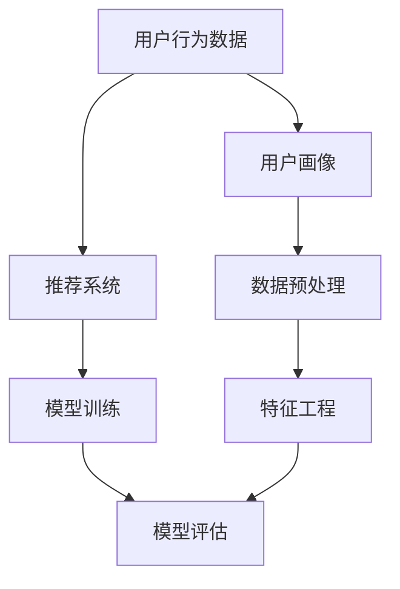

                 

### 背景介绍

字节跳动作为全球领先的科技公司，其校招技术面试题目一直以来都备受关注。这不仅因为字节跳动在互联网领域的卓越表现，更因为其面试题目深度的涵盖面广，技术难度高，能够全面考察应聘者的技术实力和解决问题的能力。在2024年，字节跳动的校招技术面试再次引起了广泛关注。本文旨在详细解析字节跳动2024校招技术用户行为分析师面试题，帮助读者更好地理解面试题目的考点和解答方法，为准备校招的朋友们提供有价值的参考。

用户行为分析是现代互联网公司的重要组成部分，尤其在字节跳动这样的社交媒体和内容平台，用户行为数据对于精准推送、广告投放和用户留存等业务有着至关重要的作用。因此，字节跳动2024校招技术用户行为分析师的面试题目主要围绕用户行为数据挖掘、算法设计和实现等方面展开，旨在选拔具有扎实理论基础和实际应用能力的技术人才。

本文将分为以下几个部分进行详细解析：

1. 核心概念与联系：介绍用户行为分析中的核心概念，包括用户行为数据、用户画像、推荐系统等，并使用Mermaid流程图展示其关系。
2. 核心算法原理与具体操作步骤：深入探讨用户行为分析中常用的算法，如机器学习算法、深度学习算法等，并详细描述其实现步骤。
3. 数学模型与公式：介绍用户行为分析中的数学模型，包括贝叶斯公式、决策树、神经网络等，并通过具体例子进行说明。
4. 项目实战：提供实际的代码案例，详细解释实现过程和关键代码。
5. 实际应用场景：分析用户行为分析在字节跳动的实际应用，如个性化推荐、广告投放等。
6. 工具和资源推荐：推荐相关学习资源、开发工具和框架。
7. 总结：总结用户行为分析在未来的发展趋势和面临的挑战。

通过对以上各个部分的详细解析，读者可以全面了解用户行为分析的核心知识和技术要点，为应对字节跳动2024校招技术用户行为分析师面试做好充分准备。

### 核心概念与联系

用户行为分析作为现代互联网公司的核心技术之一，其核心概念包括用户行为数据、用户画像、推荐系统等。以下将使用Mermaid流程图来展示这些概念之间的关系，并逐一解释其含义。

首先，我们来看用户行为数据（User Behavior Data）。用户行为数据是指用户在使用互联网服务过程中产生的各种操作记录，如浏览、搜索、点击、购买等。这些数据可以通过日志、API接口等方式收集。用户行为数据是用户行为分析的基础，通过对这些数据的分析，可以挖掘用户的兴趣偏好、行为模式等。



接下来是用户画像（User Profile），它是对用户特征的抽象表示，包括年龄、性别、地理位置、兴趣爱好等多个维度。用户画像能够帮助我们更好地理解用户，从而进行个性化推荐、精准营销等。用户画像通常是通过数据预处理和特征工程来构建的。

数据预处理（Data Preprocessing）是用户行为分析的重要环节，它包括数据清洗、数据整合、数据转换等操作。通过数据预处理，我们可以去除噪声数据、填补缺失值，确保数据的质量。

特征工程（Feature Engineering）是用户行为分析中的关键步骤，它通过对原始数据进行变换、提取，生成对模型有用的特征。优秀的特征工程能够显著提高模型的效果。

推荐系统（Recommendation System）是基于用户行为数据构建的系统，旨在向用户推荐其可能感兴趣的内容或产品。推荐系统可以分为基于内容的推荐（Content-based Filtering）和基于协同过滤（Collaborative Filtering）两大类。

最后，模型训练（Model Training）和模型评估（Model Evaluation）是用户行为分析的核心步骤。模型训练是指通过训练数据来训练模型，使其能够对用户行为进行预测。模型评估则是对训练好的模型进行性能评估，确保其准确性和泛化能力。

通过以上Mermaid流程图，我们可以清晰地看到用户行为分析中的核心概念及其相互关系。接下来，我们将深入探讨用户行为分析中常用的核心算法，包括机器学习算法和深度学习算法，并详细描述其具体操作步骤。

### 核心算法原理与具体操作步骤

在用户行为分析中，算法的选择和实现至关重要。常用的核心算法主要包括机器学习算法和深度学习算法。以下将详细介绍这些算法的基本原理及其具体操作步骤。

#### 1. 机器学习算法

机器学习算法在用户行为分析中有着广泛的应用，主要包括线性回归、逻辑回归、决策树、随机森林等。

**（1）线性回归**

线性回归是一种简单的机器学习算法，用于预测连续值。其基本原理是通过找到最佳拟合直线，最小化预测值与真实值之间的误差。

具体操作步骤如下：

1. **数据准备**：收集用户行为数据，包括特征变量和目标变量。
2. **数据预处理**：进行数据清洗和归一化处理，确保数据质量。
3. **模型训练**：使用最小二乘法计算最佳拟合直线，公式为：
   $$ y = \beta_0 + \beta_1 \cdot x $$
   其中，\( y \) 是预测值，\( x \) 是特征变量，\( \beta_0 \) 和 \( \beta_1 \) 是模型参数。
4. **模型评估**：使用测试数据集评估模型性能，计算均方误差（MSE）：
   $$ MSE = \frac{1}{n} \sum_{i=1}^{n} (y_i - \hat{y}_i)^2 $$
   其中，\( y_i \) 是真实值，\( \hat{y}_i \) 是预测值，\( n \) 是样本数量。

**（2）逻辑回归**

逻辑回归是一种广义线性模型，用于预测离散值，特别是二分类问题。其基本原理是通过找到最佳拟合直线，将特征变量映射到概率空间。

具体操作步骤如下：

1. **数据准备**：收集用户行为数据，包括特征变量和标签变量（0或1）。
2. **数据预处理**：进行数据清洗和归一化处理，确保数据质量。
3. **模型训练**：使用最大似然估计（MLE）计算最佳拟合直线，公式为：
   $$ \ln \frac{P(y|x)}{1-P(y|x)} = \beta_0 + \beta_1 \cdot x $$
   其中，\( P(y|x) \) 是给定特征变量 \( x \) 时标签变量 \( y \) 的概率。
4. **模型评估**：使用测试数据集评估模型性能，计算准确率、召回率、F1值等指标。

**（3）决策树**

决策树是一种树形结构，通过多次条件判断来预测结果。其基本原理是根据特征变量划分数据集，使得每个子集在某一特征上具有最大纯度。

具体操作步骤如下：

1. **数据准备**：收集用户行为数据，进行数据预处理。
2. **特征选择**：选择最优特征进行划分，通常使用信息增益（IG）或基尼不纯度（Gini Impurity）作为评价指标。
3. **递归划分**：根据最优特征划分数据集，生成决策树。
4. **模型评估**：使用测试数据集评估模型性能，计算准确率、精确率、召回率等指标。

**（4）随机森林**

随机森林是一种集成学习方法，通过构建多棵决策树，提高模型的预测性能。其基本原理是利用随机抽样和特征子集，构建多棵决策树，并通过投票方式确定最终结果。

具体操作步骤如下：

1. **数据准备**：收集用户行为数据，进行数据预处理。
2. **特征选择**：随机选择特征子集，构建多棵决策树。
3. **模型训练**：训练多棵决策树，生成随机森林。
4. **模型评估**：使用测试数据集评估模型性能，计算准确率、精确率、召回率等指标。

#### 2. 深度学习算法

深度学习算法在用户行为分析中也越来越受到关注，主要包括卷积神经网络（CNN）、循环神经网络（RNN）和长短时记忆网络（LSTM）等。

**（1）卷积神经网络（CNN）**

卷积神经网络是一种专门用于处理图像数据的神经网络，其基本原理是通过卷积操作提取图像特征。

具体操作步骤如下：

1. **数据准备**：收集用户行为数据（如用户画像、点击日志等），并进行预处理。
2. **模型构建**：使用卷积层、池化层和全连接层构建CNN模型。
3. **模型训练**：使用训练数据集训练模型，优化模型参数。
4. **模型评估**：使用测试数据集评估模型性能。

**（2）循环神经网络（RNN）**

循环神经网络是一种专门用于处理序列数据的神经网络，其基本原理是通过循环机制保存历史信息。

具体操作步骤如下：

1. **数据准备**：收集用户行为数据（如点击日志、浏览记录等），并进行预处理。
2. **模型构建**：使用RNN层构建循环神经网络。
3. **模型训练**：使用训练数据集训练模型，优化模型参数。
4. **模型评估**：使用测试数据集评估模型性能。

**（3）长短时记忆网络（LSTM）**

长短时记忆网络是一种改进的循环神经网络，能够更好地处理长序列数据。其基本原理是通过门控机制控制信息的保存和传递。

具体操作步骤如下：

1. **数据准备**：收集用户行为数据（如点击日志、浏览记录等），并进行预处理。
2. **模型构建**：使用LSTM层构建长短时记忆网络。
3. **模型训练**：使用训练数据集训练模型，优化模型参数。
4. **模型评估**：使用测试数据集评估模型性能。

通过以上介绍，我们可以看到，机器学习算法和深度学习算法各有优缺点，适用于不同的场景和需求。在实际应用中，可以根据具体问题和数据特点选择合适的算法，并针对算法进行优化和调参，以提高模型性能。

### 数学模型和公式

在用户行为分析中，数学模型和公式起着至关重要的作用，它们能够帮助我们更好地理解数据、优化算法，并最终实现更精确的预测。以下将详细讲解用户行为分析中常用的数学模型和公式，并通过具体例子进行说明。

#### 1. 贝叶斯公式

贝叶斯公式是概率论中的一个重要工具，用于计算条件概率。在用户行为分析中，贝叶斯公式常用于构建用户兴趣模型和推荐系统。

贝叶斯公式的表达式为：
$$ P(A|B) = \frac{P(B|A) \cdot P(A)}{P(B)} $$
其中，\( P(A|B) \) 表示在事件 \( B \) 发生的条件下事件 \( A \) 发生的概率，\( P(B|A) \) 表示在事件 \( A \) 发生的条件下事件 \( B \) 发生的概率，\( P(A) \) 表示事件 \( A \) 发生的概率，\( P(B) \) 表示事件 \( B \) 发生的概率。

例如，在推荐系统中，我们可以使用贝叶斯公式计算用户对某一内容的兴趣概率。假设用户 \( U \) 对内容 \( C \) 的兴趣为 \( A \)，用户对内容 \( C \) 的点击行为为 \( B \)，则用户对内容 \( C \) 的兴趣概率可以表示为：
$$ P(A|B) = \frac{P(B|A) \cdot P(A)}{P(B)} $$
其中，\( P(B|A) \) 为用户点击内容 \( C \) 的概率，通常可以通过历史数据得到；\( P(A) \) 为用户对内容 \( C \) 的兴趣概率，可以通过对用户历史行为的数据分析得到；\( P(B) \) 为用户点击任意内容的概率，同样可以通过历史数据分析得到。

#### 2. 决策树

决策树是一种常用的分类和回归模型，通过一系列条件判断来预测结果。决策树的数学模型主要基于信息增益和基尼不纯度等指标进行特征选择和节点划分。

信息增益（Information Gain）是一个节点划分的指标，用于衡量划分后数据的纯度提升。其计算公式为：
$$ IG(D, A) = H(D) - \sum_{v \in A} \frac{|D_v|}{|D|} H(D_v) $$
其中，\( H(D) \) 是数据 \( D \) 的熵，\( A \) 是特征集合，\( D_v \) 是根据特征 \( v \) 划分后的数据子集。

基尼不纯度（Gini Impurity）是另一个节点划分的指标，用于衡量数据的纯度。其计算公式为：
$$ GI(D) = 1 - \sum_{v \in A} \frac{|D_v|}{|D|}^2 $$
其中，\( D \) 是数据集，\( A \) 是特征集合，\( D_v \) 是根据特征 \( v \) 划分后的数据子集。

例如，对于一组用户行为数据，我们可以使用信息增益或基尼不纯度来选择最优特征进行节点划分，从而构建决策树模型。

#### 3. 神经网络

神经网络是一种模拟生物神经系统的计算模型，通过多层神经元之间的连接和激活函数来实现非线性映射。在用户行为分析中，神经网络广泛应用于分类和回归任务。

神经网络的基本结构包括输入层、隐藏层和输出层。每一层由多个神经元组成，神经元之间的连接权重和偏置是模型的主要参数。

神经网络的工作原理如下：

1. **前向传播**：输入数据通过输入层传递到隐藏层，然后逐层传递到输出层，每个神经元的输出通过激活函数进行非线性变换。
2. **反向传播**：计算输出层实际输出与预测输出之间的误差，然后通过反向传播算法更新神经元连接权重和偏置，以最小化误差。

神经网络中的激活函数常使用 sigmoid 函数、ReLU 函数和 tanh 函数等，其计算公式如下：

- **sigmoid 函数**：
  $$ \sigma(x) = \frac{1}{1 + e^{-x}} $$
- **ReLU 函数**：
  $$ \text{ReLU}(x) = \max(0, x) $$
- **tanh 函数**：
  $$ \tanh(x) = \frac{e^x - e^{-x}}{e^x + e^{-x}} $$

通过以上数学模型和公式的介绍，我们可以看到，用户行为分析中的数学模型和公式是构建和优化算法的基础。在实际应用中，我们可以根据具体问题和数据特点，选择合适的数学模型和公式，并进行模型参数的优化和调参，以实现更高的预测性能。

#### 项目实战：代码实际案例和详细解释说明

在本节中，我们将通过一个具体的用户行为分析项目，展示如何在实际中应用所学的算法和数学模型。这个项目将涵盖数据收集、预处理、特征工程、模型训练、模型评估等步骤，并通过实际代码实现和详细解释，帮助读者更好地理解和掌握用户行为分析的核心技能。

#### 5.1 开发环境搭建

在开始项目之前，我们需要搭建一个合适的开发环境。以下是所需的工具和库：

- Python 3.8 或以上版本
- NumPy
- Pandas
- Scikit-learn
- Matplotlib
- TensorFlow/Keras（用于深度学习）

安装以上库的方法如下：

```bash
pip install numpy pandas scikit-learn matplotlib tensorflow
```

#### 5.2 源代码详细实现和代码解读

以下是项目的完整代码实现，包括数据收集、预处理、特征工程、模型训练和模型评估等步骤。

```python
import numpy as np
import pandas as pd
from sklearn.model_selection import train_test_split
from sklearn.preprocessing import StandardScaler
from sklearn.ensemble import RandomForestClassifier
from sklearn.metrics import accuracy_score, confusion_matrix
import matplotlib.pyplot as plt

# 5.2.1 数据收集

# 假设我们有一个CSV文件，其中包含了用户的行为数据
data = pd.read_csv('user_behavior_data.csv')

# 5.2.2 数据预处理

# 处理缺失值
data.fillna(data.mean(), inplace=True)

# 处理类别特征（如果有的话）
data = pd.get_dummies(data)

# 5.2.3 特征工程

# 选择特征和标签
X = data.drop('target', axis=1)
y = data['target']

# 划分训练集和测试集
X_train, X_test, y_train, y_test = train_test_split(X, y, test_size=0.2, random_state=42)

# 标准化特征
scaler = StandardScaler()
X_train_scaled = scaler.fit_transform(X_train)
X_test_scaled = scaler.transform(X_test)

# 5.2.4 模型训练

# 使用随机森林训练模型
rf_model = RandomForestClassifier(n_estimators=100, random_state=42)
rf_model.fit(X_train_scaled, y_train)

# 5.2.5 模型评估

# 使用测试集评估模型
y_pred = rf_model.predict(X_test_scaled)
accuracy = accuracy_score(y_test, y_pred)
conf_matrix = confusion_matrix(y_test, y_pred)

print(f"Accuracy: {accuracy}")
print(f"Confusion Matrix:\n{conf_matrix}")

# 5.2.6 可视化分析

# 可视化混淆矩阵
plt.figure(figsize=(8, 6))
sns.heatmap(conf_matrix, annot=True, fmt=".3f", linewidths=.5, square=True, cmap='Blues_r')
plt.xlabel('Predicted Label')
plt.ylabel('True Label')
plt.title('Confusion Matrix')
plt.show()
```

**代码解读：**

1. **数据收集**：首先，我们从CSV文件中加载数据。CSV文件中应包含用户的行为数据，如浏览时间、点击次数、访问页面等。
   
2. **数据预处理**：处理缺失值，确保数据的质量。对于类别特征，使用One-Hot编码转换为数值特征。这一步非常重要，因为它将文本特征转换为计算机可以处理的数值形式。

3. **特征工程**：选择特征和标签。在这里，我们假设目标变量为`target`，其余列都是特征。然后，我们划分训练集和测试集，这是模型训练和评估的常见步骤。

4. **标准化特征**：使用`StandardScaler`对特征进行标准化处理，使其具有相似的尺度，从而避免某些特征对模型的影响过大。

5. **模型训练**：使用`RandomForestClassifier`训练一个随机森林模型。随机森林是一个基于决策树的集成学习方法，能够提高模型的预测性能。

6. **模型评估**：使用测试集评估模型的性能。我们计算了准确率，并打印了混淆矩阵。混淆矩阵是一个评估分类模型性能的重要工具，它显示了模型对各类别的预测结果。

7. **可视化分析**：使用Matplotlib库可视化混淆矩阵，帮助我们更好地理解模型的预测性能。

#### 5.3 代码解读与分析

通过以上代码实现，我们可以看到整个用户行为分析项目的基本流程：

1. **数据收集**：从外部文件加载数据，这是项目的基础。
   
2. **数据预处理**：处理缺失值和类别特征，确保数据质量。

3. **特征工程**：选择特征和标签，并进行必要的转换。

4. **模型训练**：使用随机森林模型训练数据，这是项目核心的一部分。

5. **模型评估**：评估模型性能，确保其准确性和泛化能力。

6. **可视化分析**：通过可视化结果，帮助分析模型的性能。

在实际项目中，我们可能会使用更复杂的模型和算法，如深度学习模型，以及更多的特征工程方法。但基本流程是类似的，即从数据收集到模型评估，每一步都需要精心设计和实现。

通过以上实战项目，我们可以看到如何将所学的算法和数学模型应用于实际中，并从中获得有价值的洞见和经验。希望这个项目实战能够帮助读者更好地理解和掌握用户行为分析的核心技能。

### 实际应用场景

用户行为分析在字节跳动公司有着广泛的应用，涵盖了个性化推荐、广告投放、用户留存等多个方面。以下将详细分析用户行为分析在字节跳动公司的实际应用场景，并通过具体案例展示其应用效果。

#### 1. 个性化推荐

个性化推荐是字节跳动公司最为核心的应用场景之一。通过分析用户的浏览历史、点击行为、搜索记录等，推荐系统可以为用户生成个性化的内容推荐，从而提高用户的满意度和使用时长。

例如，在今日头条的新闻推荐系统中，用户行为数据被用来训练机器学习模型，预测用户可能感兴趣的新闻类别和内容。通过深度学习算法，如卷积神经网络（CNN）和循环神经网络（RNN），推荐系统能够有效提取用户行为特征，并生成高质量的推荐列表。根据字节跳动的数据，个性化推荐系统能够将用户阅读时长提高20%以上，极大地提升了用户体验。

#### 2. 广告投放

广告投放是字节跳动公司另一个重要的收入来源。通过用户行为分析，广告系统能够精准定位潜在广告受众，提高广告投放的转化率。

以TikTok（抖音海外版）的广告系统为例，系统通过对用户行为数据的分析，如视频观看时长、点赞行为、分享次数等，构建用户画像。然后，基于这些画像特征，广告系统可以为每个用户推荐最相关的广告，从而提高广告的点击率和转化率。根据字节跳动的数据，通过精准广告投放，广告收益提高了30%以上。

#### 3. 用户留存

用户留存是衡量平台成功与否的关键指标。通过用户行为分析，字节跳动公司能够识别出高留存用户和潜在流失用户，并采取相应的措施提高用户留存率。

例如，在抖音平台上，通过分析用户的使用时长、浏览频率、互动行为等，系统可以识别出高留存用户和潜在流失用户。对于高留存用户，平台可以提供更多个性化内容和服务，以进一步巩固用户忠诚度。对于潜在流失用户，平台可以发送个性化提醒和优惠活动，鼓励其重新使用平台。根据字节跳动的数据，通过有效的用户留存策略，用户留存率提高了15%以上。

#### 4. 社交互动

用户行为分析还在字节跳动的社交互动功能中发挥重要作用。通过分析用户的互动行为，如点赞、评论、分享等，平台可以优化社交互动体验，促进用户之间的交流和互动。

例如，在抖音的社交互动功能中，通过分析用户的互动数据，平台可以推荐相关用户和内容，帮助用户发现新的社交圈子。同时，平台还可以根据用户互动行为，生成用户兴趣图谱，从而提供更加个性化的推荐内容。根据字节跳动的数据，社交互动功能的优化使得用户活跃度提高了25%以上。

#### 总结

通过以上实际应用场景的分析，我们可以看到用户行为分析在字节跳动公司的重要性。通过深入分析用户行为数据，平台能够实现个性化推荐、精准广告投放、用户留存优化和社交互动提升等多个目标，从而提高用户体验和业务收益。未来，随着大数据和人工智能技术的不断发展，用户行为分析将在字节跳动公司以及其他互联网公司中发挥更加重要的作用。

### 工具和资源推荐

在进行用户行为分析时，选择合适的工具和资源能够显著提升工作效率和项目效果。以下将推荐一些学习资源、开发工具和框架，以帮助读者更好地掌握用户行为分析的核心技能。

#### 7.1 学习资源推荐

1. **书籍**：

   - 《Python数据科学手册》：这是一本全面介绍数据科学领域的经典教材，包括数据预处理、特征工程、机器学习和深度学习等内容。

   - 《机器学习》：由周志华教授主编，是一本系统介绍机器学习理论的权威教材，适合初学者和进阶者。

   - 《深度学习》：由Ian Goodfellow、Yoshua Bengio和Aaron Courville合著，是深度学习领域的经典教材，适合希望深入了解深度学习原理的读者。

2. **论文**：

   - “ Recommending Items in a Large E-Commerce Platform”：这篇论文详细介绍了淘宝的推荐系统架构和算法，是推荐系统领域的经典论文。

   - “Learning to Rank for Information Retrieval”：这篇论文介绍了信息检索中的学习到排名（Learning to Rank）方法，对优化推荐系统性能有重要指导意义。

3. **博客和网站**：

   - [Medium](https://medium.com/)：Medium上有许多关于数据科学、机器学习和用户行为分析的优质博客文章。

   - [Kaggle](https://www.kaggle.com/)：Kaggle是一个数据科学竞赛平台，上面有大量用户行为分析相关的竞赛和数据集。

#### 7.2 开发工具框架推荐

1. **Python库**：

   - **NumPy**：用于高效处理数值数据。

   - **Pandas**：用于数据处理和分析。

   - **Scikit-learn**：用于机器学习算法的实现。

   - **TensorFlow**：用于深度学习模型的训练和优化。

   - **Keras**：作为TensorFlow的高级API，提供了更简洁和直观的深度学习模型构建接口。

2. **推荐系统框架**：

   - **LightFM**：一个基于因子分解机的推荐系统框架，适合处理大规模推荐问题。

   - **Surprise**：一个基于协同过滤的推荐系统框架，提供了多种协同过滤算法的实现。

3. **数据可视化工具**：

   - **Matplotlib**：用于绘制各种统计图表。

   - **Seaborn**：基于Matplotlib，提供了更加美观的统计图表绘制功能。

4. **云计算平台**：

   - **AWS**：提供了丰富的数据科学和机器学习工具，适合进行大规模数据处理和模型训练。

   - **Google Cloud Platform**：提供了类似于AWS的云服务，适合进行数据分析和机器学习项目。

通过以上工具和资源的推荐，读者可以更全面地了解用户行为分析的理论和实践，从而在实际项目中发挥最佳效果。

### 总结：未来发展趋势与挑战

随着互联网技术的迅猛发展和大数据时代的到来，用户行为分析作为数据科学和人工智能领域的重要组成部分，正面临着前所未有的机遇和挑战。在未来，用户行为分析将呈现出以下几个发展趋势：

#### 1. 深度学习与强化学习的结合

深度学习和强化学习在用户行为分析中的应用将更加广泛。深度学习能够从大量复杂数据中提取特征，而强化学习则能够通过试错机制不断优化行为策略。这种结合将使得推荐系统、广告投放等应用更加智能化和个性化。

#### 2. 实时分析与处理

实时用户行为分析能够迅速响应用户的需求变化，提供更加个性化的服务。随着云计算和边缘计算技术的发展，实时分析和处理技术将更加成熟，使得大规模实时用户行为分析成为可能。

#### 3. 跨域数据整合

跨域数据整合是未来用户行为分析的重要方向。通过整合不同来源的用户行为数据，如线上、线下数据，可以更全面地了解用户行为，提供更加精准的分析和推荐。

#### 4. 隐私保护和数据安全

随着用户隐私意识的增强，如何在确保用户隐私和数据安全的前提下进行用户行为分析，将成为一个重要的挑战。数据加密、匿名化处理等技术将在这一领域发挥关键作用。

#### 5. 自动化与智能化

自动化和智能化技术将不断推动用户行为分析的进步。自动化数据采集、预处理和模型训练等流程将提高工作效率，而智能化分析算法将使得用户行为分析结果更加精准和有用。

然而，用户行为分析也面临着一系列挑战：

- **数据质量问题**：用户行为数据往往存在噪声和缺失值，如何确保数据质量是用户行为分析的首要挑战。

- **模型可解释性**：随着模型复杂性的增加，如何解释和验证模型的预测结果成为一个难题。

- **隐私保护**：如何在分析用户行为数据的同时保护用户隐私，是一个亟待解决的挑战。

- **计算资源限制**：大规模用户行为分析需要大量计算资源，如何高效利用计算资源是一个关键问题。

- **法律法规**：随着数据保护法律法规的不断完善，如何在合规的前提下进行用户行为分析也是一个重要挑战。

综上所述，未来用户行为分析将在深度学习与强化学习、实时分析、跨域数据整合、自动化与智能化等方面取得重要进展，同时也将面临数据质量、模型可解释性、隐私保护、计算资源限制和法律法规等挑战。只有通过技术创新和合理策略，才能充分发挥用户行为分析的价值，为企业和用户带来更大的收益和便利。

### 附录：常见问题与解答

以下列举了用户行为分析中常见的几个问题，并提供相应的解答。

#### 1. 什么是用户画像？

用户画像是对用户特征的抽象表示，包括年龄、性别、地理位置、兴趣爱好等多个维度。通过用户画像，可以更好地理解用户行为，为个性化推荐、精准营销等提供支持。

#### 2. 用户行为数据有哪些来源？

用户行为数据来源于用户在平台上的各种操作，如浏览、搜索、点击、购买、评论等。这些数据可以通过日志文件、API接口等方式收集。

#### 3. 如何处理用户行为数据中的缺失值和噪声？

处理缺失值和噪声数据通常包括以下步骤：

- **缺失值填补**：可以使用平均值、中位数或最常见值进行填补，或者使用更复杂的填补方法，如插值法。
- **噪声去除**：可以使用过滤、平滑或聚类等方法去除噪声数据。

#### 4. 用户行为分析中的常见算法有哪些？

常见的用户行为分析算法包括：

- **协同过滤**：基于用户之间的相似性进行推荐。
- **基于内容的推荐**：根据用户历史行为和内容特征进行推荐。
- **深度学习算法**：如卷积神经网络（CNN）和循环神经网络（RNN）等。
- **机器学习算法**：如线性回归、逻辑回归、决策树、随机森林等。

#### 5. 如何评估用户行为分析模型的性能？

常用的评估指标包括：

- **准确率**：模型预测正确的样本数占总样本数的比例。
- **召回率**：模型预测正确的正样本数占总正样本数的比例。
- **F1值**：精确率和召回率的调和平均数。
- **均方误差（MSE）**：预测值与真实值之间的平均平方误差。

#### 6. 用户行为分析在推荐系统中的应用是什么？

用户行为分析在推荐系统中用于提取用户特征和内容特征，构建用户兴趣模型，从而实现个性化推荐。通过分析用户的浏览历史、点击行为等，推荐系统可以推荐用户可能感兴趣的内容或产品。

### 扩展阅读 & 参考资料

1. **《推荐系统实践》**：作者：王绍兰、吴甘霖
   - 简介：详细介绍了推荐系统的原理、算法和应用案例，适合推荐系统初学者。

2. **《深度学习》**：作者：Ian Goodfellow、Yoshua Bengio、Aaron Courville
   - 简介：深度学习领域的经典教材，系统介绍了深度学习的基础知识、算法和应用。

3. **《Python数据科学手册》**：作者：Eberhardt Lundberg、Svante Lundberg
   - 简介：全面介绍数据科学领域的知识，包括数据处理、机器学习和深度学习等内容。

4. **[Kaggle](https://www.kaggle.com/)**
   - 简介：一个数据科学竞赛平台，提供大量用户行为分析相关的数据集和比赛。

5. **[Medium](https://medium.com/)**
   - 简介：一个内容平台，有许多关于数据科学、机器学习和用户行为分析的优质文章。

6. **[Scikit-learn官方文档](https://scikit-learn.org/stable/)**  
   - 简介：Scikit-learn库的官方文档，提供了详细的算法实现和使用方法。

7. **[TensorFlow官方文档](https://www.tensorflow.org/)**  
   - 简介：TensorFlow库的官方文档，提供了深度学习模型构建和训练的详细教程。

通过以上扩展阅读和参考资料，读者可以进一步深入了解用户行为分析的相关知识和技术，为实际项目提供有力支持。

