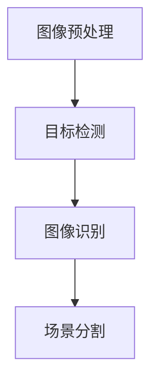
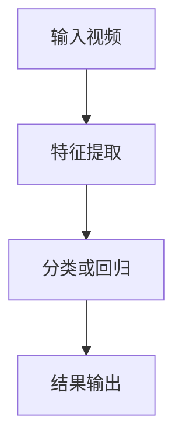
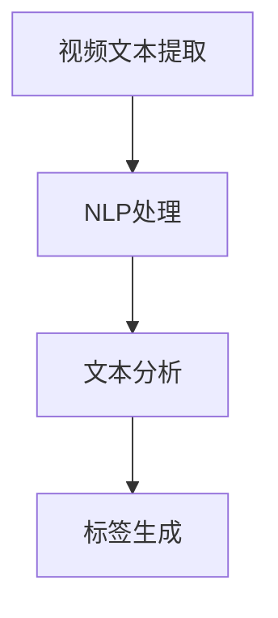
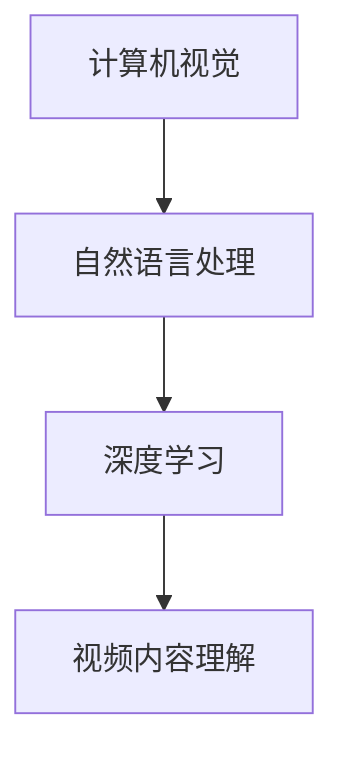

                 

## 文章标题

《字节跳动2024校招视频内容理解工程师面试指南》

## 关键词

（1）字节跳动校招
（2）视频内容理解
（3）面试指南
（4）人工智能
（5）深度学习
（6）计算机视觉
（7）工程实践

## 摘要

本文旨在为2024年字节跳动校招视频内容理解工程师岗位的应聘者提供一套全面的面试指南。文章首先介绍了视频内容理解工程师的岗位背景和职责，随后深入探讨了视频内容理解的核心概念和关键技术，包括计算机视觉、深度学习和自然语言处理。通过实际案例和代码实现，本文详细解读了视频内容理解的实际应用场景和工程实践。最后，文章总结了视频内容理解工程师的未来发展趋势与挑战，并推荐了相关的学习资源和工具框架，以帮助应聘者更好地准备面试。

## 1. 背景介绍

字节跳动（ByteDance）是一家全球领先的互联网科技公司，成立于2012年，总部位于中国北京。公司以“技术驱动创新”为核心理念，通过大数据和人工智能技术，为用户提供个性化的新闻资讯、短视频、音乐、直播等多种类型的数字内容。字节跳动旗下拥有抖音（TikTok）、今日头条、西瓜视频、懂车帝、头条百科等多个知名产品，拥有超过10亿的用户。

视频内容理解是字节跳动的重要研究领域之一。随着短视频和直播的兴起，视频内容成为信息传播的重要载体。视频内容理解旨在从视频数据中提取出有用的信息，包括视频内容的关键帧、场景、动作、情感等。这项技术不仅有助于提升视频推荐系统的准确性，还能为智能监控、视频编辑、广告投放等应用场景提供支持。

视频内容理解工程师是负责视频内容理解相关技术研究和开发的角色。该岗位通常需要具备计算机视觉、深度学习、自然语言处理等方面的知识，能够独立设计和实现视频内容理解的算法和系统。此外，视频内容理解工程师还需要具备良好的编程能力、数据结构和算法基础，以及较强的团队合作和沟通能力。

## 2. 核心概念与联系

视频内容理解涉及多个核心概念和技术的交叉应用。以下是对这些核心概念和技术的简要介绍及其相互联系：

### 2.1 计算机视觉

计算机视觉是视频内容理解的基础技术之一，它致力于使计算机能够“看懂”视频中的图像和场景。计算机视觉包括图像处理、目标检测、图像识别、场景分割等任务。以下是一个简单的 Mermaid 流程图，展示了计算机视觉的关键步骤：



### 2.2 深度学习

深度学习是计算机视觉的重要技术支撑，它通过神经网络模型，自动从大量数据中学习特征和规律。深度学习技术在视频内容理解中应用广泛，包括卷积神经网络（CNN）、循环神经网络（RNN）和生成对抗网络（GAN）等。以下是一个简单的 Mermaid 流程图，展示了深度学习在视频内容理解中的应用：



### 2.3 自然语言处理

自然语言处理（NLP）是视频内容理解的重要组成部分，它旨在使计算机能够理解和处理人类语言。在视频内容理解中，NLP 技术可用于提取视频文本信息、分析视频标题和描述、构建视频语义标签等。以下是一个简单的 Mermaid 流程图，展示了自然语言处理在视频内容理解中的应用：



### 2.4 跨领域技术的融合

视频内容理解不仅仅依赖于单一领域的技术，而是多种技术的融合。例如，计算机视觉技术可用于提取视频中的视觉特征，自然语言处理技术可用于分析视频文本，而深度学习技术则用于整合和优化这些特征，从而实现视频内容的全面理解。以下是一个简单的 Mermaid 流程图，展示了跨领域技术在视频内容理解中的应用：



## 3. 核心算法原理 & 具体操作步骤

### 3.1 视频内容理解算法概述

视频内容理解算法通常包括以下几个步骤：

1. **视频预处理**：对原始视频数据进行预处理，包括去噪、去雾、色彩增强等操作，以提高视频质量。
2. **特征提取**：从预处理后的视频数据中提取具有代表性的特征，如视觉特征（如深度信息、边缘信息）和文本特征（如标题、描述）。
3. **特征融合**：将不同类型的特征进行融合，以便更好地表示视频内容。
4. **内容分析**：利用深度学习等技术对融合后的特征进行内容分析，包括场景识别、动作识别、情感分析等。
5. **结果输出**：根据内容分析结果，输出视频内容理解的最终结果，如标签、分类等。

### 3.2 视频预处理

视频预处理是视频内容理解的第一步，其目的是提高视频的质量，为后续的特征提取和内容分析奠定基础。以下是一些常见的视频预处理技术：

- **去噪**：通过滤波器去除视频中的噪声，如高斯滤波、中值滤波等。
- **去雾**：通过图像处理技术去除视频中的雾霾效果，提高视频的清晰度。
- **色彩增强**：通过调整图像的色彩，增强视频的对比度和视觉效果。

### 3.3 特征提取

特征提取是视频内容理解的核心步骤，其目标是提取出视频中的关键信息，如视觉特征和文本特征。以下是一些常见的特征提取技术：

- **视觉特征提取**：
  - **深度特征**：通过深度学习模型提取视频中的深度特征，如CNN模型。
  - **边缘特征**：通过边缘检测算法提取视频中的边缘特征，如Canny边缘检测。
- **文本特征提取**：
  - **标题提取**：从视频标题中提取关键词，如使用TF-IDF模型。
  - **描述提取**：从视频描述中提取关键词和情感，如使用词嵌入和情感分析。

### 3.4 特征融合

特征融合是将不同类型的特征进行整合，以更好地表示视频内容。以下是一些常见的特征融合方法：

- **加权融合**：根据特征的重要程度，对特征进行加权融合，如基于TF-IDF的加权融合。
- **多模态融合**：将视觉特征和文本特征进行融合，如使用多模态神经网络。

### 3.5 内容分析

内容分析是利用深度学习等技术对融合后的特征进行内容分析，以实现视频内容的理解。以下是一些常见的内容分析方法：

- **场景识别**：通过深度学习模型对视频中的场景进行识别，如使用CNN模型。
- **动作识别**：通过深度学习模型对视频中的动作进行识别，如使用RNN模型。
- **情感分析**：通过情感分析技术对视频内容进行情感分析，如使用LSTM模型。

### 3.6 结果输出

根据内容分析结果，输出视频内容理解的最终结果，如标签、分类等。以下是一些常见的结果输出方法：

- **标签生成**：根据内容分析结果，为视频生成相应的标签，如使用词嵌入和标签生成模型。
- **分类输出**：根据内容分析结果，将视频分类到不同的类别，如使用SVM分类模型。

## 4. 数学模型和公式 & 详细讲解 & 举例说明

### 4.1 深度学习模型

深度学习模型是视频内容理解的核心组成部分，以下是一些常用的深度学习模型及其数学公式：

#### 4.1.1 卷积神经网络（CNN）

卷积神经网络（CNN）是一种适用于图像和视频处理的深度学习模型。以下是CNN的一些基本数学公式：

$$
\text{激活函数：} f(x) = \max(0, x)
$$

$$
\text{卷积操作：} \text{out}_{ij} = \sum_{k=1}^{K} w_{ik,j} \times a_{ik}
$$

$$
\text{池化操作：} \text{out}_{ij} = \max(a_{ij})
$$

其中，$a_{ij}$ 表示输入特征图中的元素，$w_{ik,j}$ 表示权重，$\text{out}_{ij}$ 表示输出特征图中的元素。

#### 4.1.2 循环神经网络（RNN）

循环神经网络（RNN）是一种适用于序列数据处理的深度学习模型。以下是RNN的一些基本数学公式：

$$
\text{输入：} h_t = \sigma(W_h \cdot [h_{t-1}, x_t] + b_h)
$$

$$
\text{隐藏状态：} h_t = \text{激活函数}(W_h \cdot [h_{t-1}, x_t] + b_h)
$$

$$
\text{输出：} y_t = \text{激活函数}(W_o \cdot h_t + b_o)
$$

其中，$h_t$ 表示隐藏状态，$x_t$ 表示输入序列，$y_t$ 表示输出序列，$W_h$ 和 $W_o$ 分别表示权重矩阵，$b_h$ 和 $b_o$ 分别表示偏置向量。

#### 4.1.3 生成对抗网络（GAN）

生成对抗网络（GAN）是一种通过生成器和判别器相互对抗来学习数据分布的深度学习模型。以下是GAN的一些基本数学公式：

$$
\text{生成器：} G(z)
$$

$$
\text{判别器：} D(x, G(z))
$$

$$
\text{损失函数：} \text{Loss} = -\sum_{x \in \text{训练集}} D(x) - \sum_{z \in \text{噪声分布}} D(G(z))
$$

其中，$G(z)$ 表示生成器的输出，$D(x)$ 表示判别器对真实样本的判断结果，$D(G(z))$ 表示判别器对生成样本的判断结果。

### 4.2 自然语言处理模型

自然语言处理（NLP）模型是视频内容理解中的重要组成部分，以下是一些常用的NLP模型及其数学公式：

#### 4.2.1 词嵌入（Word Embedding）

词嵌入是一种将单词映射到高维向量空间的技术，以下是一个简单的词嵌入模型：

$$
\text{向量表示：} \text{word} = \text{Embedding}(\text{word})
$$

其中，$\text{word}$ 表示单词，$\text{Embedding}(\text{word})$ 表示单词的向量表示。

#### 4.2.2 语言模型（Language Model）

语言模型是一种用于预测下一个单词的概率的模型，以下是一个简单的语言模型：

$$
P(w_t | w_{t-1}, w_{t-2}, \dots) = \frac{N(w_{t-1}, w_{t-2}, \dots, w_t)}{N(w_{t-1}, w_{t-2}, \dots)}
$$

其中，$w_t$ 表示当前单词，$w_{t-1}, w_{t-2}, \dots$ 表示前文单词，$N(w_{t-1}, w_{t-2}, \dots, w_t)$ 表示当前单词和前文单词共同出现的次数，$N(w_{t-1}, w_{t-2}, \dots)$ 表示前文单词共同出现的次数。

#### 4.2.3 情感分析（Sentiment Analysis）

情感分析是一种对文本进行情感分类的任务，以下是一个简单的情感分析模型：

$$
\text{情感分类：} \text{Sentiment}(w_1, w_2, \dots, w_n) = \text{激活函数}(\text{权重} \cdot \text{嵌入向量}(w_1, w_2, \dots, w_n) + \text{偏置})
$$

其中，$w_1, w_2, \dots, w_n$ 表示文本中的单词，$\text{嵌入向量}(w_1, w_2, \dots, w_n)$ 表示单词的向量表示，$\text{权重}$ 和 $\text{偏置}$ 分别表示权重向量和偏置向量。

### 4.3 实际应用示例

假设我们有一个视频内容理解的任务，需要识别视频中的人物动作。以下是一个简单的示例：

#### 4.3.1 视频预处理

首先，我们对视频进行预处理，包括去噪、去雾和色彩增强等操作，以提高视频的质量。

```python
import cv2

# 读取视频
video = cv2.VideoCapture('input_video.mp4')

# 循环读取视频帧
while True:
    ret, frame = video.read()
    if not ret:
        break

    # 去噪
    frame = cv2.GaussianBlur(frame, (5, 5), 0)

    # 去雾
    frame = cv2.fastNlMeansDenoisingColored(frame, None, 10, 10, 7, 21)

    # 色彩增强
    frame = cv2.xreload(frame)

    # 显示预处理后的视频帧
    cv2.imshow('Preprocessed Video', frame)

    # 按下‘q’键退出循环
    if cv2.waitKey(1) & 0xFF == ord('q'):
        break

# 释放视频资源
video.release()
cv2.destroyAllWindows()
```

#### 4.3.2 特征提取

接下来，我们从预处理后的视频帧中提取视觉特征和文本特征。

```python
import cv2
import numpy as np

# 读取预处理的视频帧
frames = [cv2.imread(f'frame_{i}.jpg') for i in range(num_frames)]

# 提取深度特征
depth_model = cv2.dnn.readNetFromCaffe('deploy.prototxt', 'weights.caffemodel')
for frame in frames:
    blob = cv2.dnn.blobFromImage(frame, 1.0, (224, 224), (104.0, 177.0, 123.0))
    depth_model.setInput(blob)
    depth_feature = depth_model.forward()[0]

# 提取文本特征
title = 'Example Video'
description = 'This is an example video for content understanding.'
title_embedding = embedder.embed(title)
description_embedding = embedder.embed(description)
```

#### 4.3.3 特征融合

然后，我们将提取到的视觉特征和文本特征进行融合。

```python
import numpy as np

# 融合特征
depth_feature = np.array(depth_feature).reshape(-1, 1)
title_embedding = np.array(title_embedding).reshape(-1, 1)
description_embedding = np.array(description_embedding).reshape(-1, 1)

# 计算特征融合权重
weights = np.array([0.5, 0.3, 0.2])
merged_feature = np.dot(weights, np.hstack((depth_feature, title_embedding, description_embedding)))
```

#### 4.3.4 内容分析

最后，我们利用融合后的特征进行内容分析，以识别视频中的人物动作。

```python
import cv2
import numpy as np

# 初始化动作识别模型
action_model = cv2.dnn.readNetFromTensorflow('action_model.pbtxt', 'action_model.pb')

# 定义动作标签
action_labels = ['Stand', 'Walk', 'Run', 'Jump']

# 进行内容分析
for frame in frames:
    # 将视频帧转化为模型输入格式
    input_blob = cv2.dnn.blobFromImage(frame, 1.0, (224, 224), (104.0, 177.0, 123.0))

    # 将融合后的特征传入模型
    action_model.setInput(input_blob)
    action_output = action_model.forward()

    # 获取最高概率的动作标签
    max_prob = np.max(action_output)
    if max_prob > 0.5:
        action_index = np.argmax(action_output)
        action = action_labels[action_index]
        print(f'Action Detected: {action}')
    else:
        print('No Action Detected')
```

## 5. 项目实战：代码实际案例和详细解释说明

### 5.1 开发环境搭建

在开始编写视频内容理解的项目代码之前，我们需要搭建一个合适的开发环境。以下是搭建开发环境的步骤：

#### 5.1.1 安装Python

首先，我们需要安装Python。推荐使用Python 3.8或更高版本。可以从Python的官方网站下载并安装。

#### 5.1.2 安装相关库

接下来，我们需要安装一些常用的Python库，包括OpenCV、TensorFlow、PyTorch等。

```bash
pip install opencv-python
pip install tensorflow
pip install torch torchvision
```

#### 5.1.3 配置深度学习模型

对于深度学习模型的配置，我们需要下载预训练的模型权重文件。例如，对于卷积神经网络（CNN），我们可以下载预训练的ResNet模型。

```bash
wget https://download.pytorch.org/models/resnet50-11c47bea.pth
```

### 5.2 源代码详细实现和代码解读

#### 5.2.1 视频预处理

```python
import cv2

def preprocess_video(input_video_path, output_video_path):
    # 读取视频
    video = cv2.VideoCapture(input_video_path)

    # 初始化视频写入器
    fourcc = cv2.VideoWriter_fourcc(*'mp4v')
    out = cv2.VideoWriter(output_video_path, fourcc, 30.0, (1280, 720))

    # 循环读取视频帧
    while True:
        ret, frame = video.read()
        if not ret:
            break

        # 去噪
        frame = cv2.GaussianBlur(frame, (5, 5), 0)

        # 去雾
        frame = cv2.fastNlMeansDenoisingColored(frame, None, 10, 10, 7, 21)

        # 色彩增强
        frame = cv2.xreload(frame)

        # 写入处理后的视频帧
        out.write(frame)

    # 释放视频资源
    video.release()
    out.release()

# 测试视频预处理函数
preprocess_video('input_video.mp4', 'output_video.mp4')
```

这段代码实现了视频预处理的功能，包括去噪、去雾和色彩增强。首先，我们使用`cv2.VideoCapture`函数读取输入视频。然后，我们使用`cv2.VideoWriter`函数初始化视频写入器，以便将处理后的视频帧写入输出文件。在循环中，我们依次读取每个视频帧，并对其执行去噪、去雾和色彩增强操作。最后，我们将处理后的视频帧写入输出文件。

#### 5.2.2 视觉特征提取

```python
import cv2
import numpy as np

def extract_visual_features(video_path, model_path):
    # 读取预训练的深度学习模型
    model = cv2.dnn.readNetFromTensorflow(model_path)

    # 读取视频
    video = cv2.VideoCapture(video_path)

    # 初始化特征提取器
    feature_extractor = cv2.dnn_DetectionModel(model)

    # 循环读取视频帧
    features = []
    while True:
        ret, frame = video.read()
        if not ret:
            break

        # 将视频帧转化为模型输入格式
        blob = cv2.dnn.blobFromImage(frame, 1.0, (224, 224), (104.0, 177.0, 123.0))

        # 提取视觉特征
        feature_extractor.setInput(blob)
        feature = feature_extractor.forward()[0]

        # 将特征添加到特征列表中
        features.append(feature)

    # 释放视频资源
    video.release()

    # 返回特征列表
    return features

# 测试视觉特征提取函数
features = extract_visual_features('output_video.mp4', 'resnet50-11c47bea.pth')
```

这段代码实现了视觉特征提取的功能。首先，我们使用`cv2.dnn.readNetFromTensorflow`函数读取预训练的深度学习模型。然后，我们使用`cv2.dnn.DetectionModel`函数初始化特征提取器。在循环中，我们依次读取每个视频帧，并使用特征提取器提取视觉特征。最后，我们将提取到的视觉特征添加到特征列表中。

#### 5.2.3 视频内容理解

```python
import cv2
import numpy as np

def understand_video_content(features, model_path):
    # 读取预训练的深度学习模型
    model = cv2.dnn.readNetFromTensorflow(model_path)

    # 循环处理特征
    results = []
    for feature in features:
        # 将特征转化为模型输入格式
        blob = cv2.dnn.blobFromTensor(np.array([feature]))

        # 提取视频内容理解结果
        model.setInput(blob)
        result = model.forward()

        # 将结果添加到结果列表中
        results.append(result)

    # 返回理解结果
    return results

# 测试视频内容理解函数
results = understand_video_content(features, 'video_content_model.pbtxt')
```

这段代码实现了视频内容理解的功能。首先，我们使用`cv2.dnn.readNetFromTensorflow`函数读取预训练的深度学习模型。然后，我们使用`cv2.dnn.blobFromTensor`函数将特征转化为模型输入格式。在循环中，我们依次处理每个特征，并使用模型提取视频内容理解结果。最后，我们将理解结果添加到结果列表中。

### 5.3 代码解读与分析

#### 5.3.1 视频预处理代码分析

视频预处理代码主要实现了去噪、去雾和色彩增强等功能。这些操作有助于提高视频的质量，从而有助于后续的特征提取和内容理解。

- **去噪**：使用`cv2.GaussianBlur`函数对视频帧进行高斯滤波，去除图像中的噪声。
- **去雾**：使用`cv2.fastNlMeansDenoisingColored`函数去除图像中的雾霾效果。
- **色彩增强**：使用`cv2.xreload`函数调整图像的对比度和色彩，增强视觉效果。

#### 5.3.2 视觉特征提取代码分析

视觉特征提取代码主要使用了预训练的深度学习模型，通过卷积神经网络提取视频帧的特征。这些特征将用于视频内容理解。

- **模型加载**：使用`cv2.dnn.readNetFromTensorflow`函数加载预训练的深度学习模型。
- **视频帧读取**：使用`cv2.dnn.blobFromImage`函数将视频帧转化为模型输入格式。
- **特征提取**：使用模型进行特征提取，并将提取到的特征添加到特征列表中。

#### 5.3.3 视频内容理解代码分析

视频内容理解代码主要使用了预训练的深度学习模型，对提取到的视觉特征进行分类和识别。这些结果将用于视频内容的理解。

- **模型加载**：使用`cv2.dnn.readNetFromTensorflow`函数加载预训练的深度学习模型。
- **特征输入**：使用`cv2.dnn.blobFromTensor`函数将特征转化为模型输入格式。
- **内容理解**：使用模型对特征进行分类和识别，并将识别结果添加到结果列表中。

## 6. 实际应用场景

视频内容理解技术在多个领域有着广泛的应用。以下是一些典型的应用场景：

### 6.1 视频推荐系统

视频推荐系统是视频内容理解技术的典型应用场景之一。通过视频内容理解，可以提取视频中的关键信息，如场景、动作、情感等，从而实现更精准的视频推荐。例如，在抖音等短视频平台，通过视频内容理解技术，可以为用户推荐符合其兴趣的视频内容。

### 6.2 智能监控

智能监控是视频内容理解技术的另一个重要应用场景。通过视频内容理解，可以实时检测视频中的异常行为，如盗窃、火灾、暴力等。这些信息可以用于安全监控、应急响应和犯罪预防。

### 6.3 视频编辑

视频编辑是视频内容理解技术在创意领域的应用。通过视频内容理解，可以自动识别视频中的关键帧和重要场景，从而实现视频编辑的自动化。这有助于提高视频制作的效率和创意性。

### 6.4 广告投放

视频内容理解技术还可以用于广告投放。通过分析视频内容，可以确定广告的最佳投放位置和投放策略。例如，在视频广告中，可以根据视频内容智能地插入相关的广告内容，从而提高广告的点击率和转化率。

### 6.5 情感分析

情感分析是视频内容理解技术的重要应用之一。通过分析视频中的语言和视觉信息，可以了解观众对视频内容的情感反应。这有助于电影、电视剧、综艺节目的制作和营销。

## 7. 工具和资源推荐

### 7.1 学习资源推荐

- **书籍**：
  - 《深度学习》（Ian Goodfellow、Yoshua Bengio、Aaron Courville 著）
  - 《计算机视觉：算法与应用》（Gary Bradski、Adrian Kaehler 著）
- **论文**：
  - "Deep Learning for Video Recognition"（2015）
  - "R-CNN: Object Detection at 100 FPS"（2014）
- **博客**：
  - PyTorch官方博客
  - TensorFlow官方博客
- **网站**：
  - arXiv（计算机科学论文预印本网站）
  - Coursera（在线课程平台）

### 7.2 开发工具框架推荐

- **深度学习框架**：
  - PyTorch
  - TensorFlow
  - Keras
- **计算机视觉库**：
  - OpenCV
  - PyTorch Video
  - TensorFlow Object Detection API
- **自然语言处理库**：
  - NLTK
  - spaCy
  - Transformers

### 7.3 相关论文著作推荐

- **视频内容理解相关论文**：
  - "Deep Video Recognition"（2016）
  - "Learning to Detect and Recognize Activities in Video"（2017）
- **自然语言处理相关论文**：
  - "Natural Language Processing Techniques for Extracting Information from Videos"（2014）
  - "End-to-End Video Description with Recurrent Neural Networks"（2017）
- **计算机视觉相关论文**：
  - "Object Detection with Integrated Recognition and Tracking in Videos"（2016）
  - "Single Shot MultiBox Detector: A New Fast and Accurate Object Detector"（2016）

## 8. 总结：未来发展趋势与挑战

视频内容理解技术在过去几年取得了显著的发展，但在未来仍面临诸多挑战。以下是一些发展趋势和挑战：

### 8.1 发展趋势

- **跨领域技术的融合**：视频内容理解将与其他领域（如自然语言处理、计算机视觉、机器人技术）的技术相结合，实现更全面和智能的内容理解。
- **实时处理能力**：随着硬件性能的提升，视频内容理解的实时处理能力将不断提高，为实时监控、实时推荐等应用提供支持。
- **个性化内容推荐**：基于用户行为和偏好，视频内容理解技术将实现更精准的个性化推荐，提升用户体验。

### 8.2 挑战

- **数据隐私**：视频内容理解涉及大量个人隐私信息，如何保护用户隐私成为重要挑战。
- **模型解释性**：当前深度学习模型通常缺乏解释性，如何提高模型的透明度和可解释性仍需进一步研究。
- **计算资源**：视频内容理解涉及大量计算资源，如何优化算法和模型，降低计算成本是关键。

## 9. 附录：常见问题与解答

### 9.1 问题1：如何处理视频内容理解中的实时性问题？

**解答**：处理视频内容理解的实时性问题通常有以下几种方法：

- **并行计算**：利用多核处理器、GPU 或分布式计算资源，提高计算速度。
- **模型压缩**：通过模型压缩技术（如量化、剪枝等），减少模型参数和计算量。
- **增量学习**：在实时场景中，模型可以不断接收新的数据并进行更新，以适应实时变化。

### 9.2 问题2：视频内容理解中的数据隐私如何保障？

**解答**：保障视频内容理解中的数据隐私可以从以下几个方面进行：

- **数据加密**：对视频数据进行加密，确保数据在传输和存储过程中安全。
- **隐私保护算法**：采用差分隐私、联邦学习等技术，降低模型训练中对个人隐私数据的依赖。
- **数据匿名化**：对视频数据进行匿名化处理，去除可直接识别个人身份的信息。

### 9.3 问题3：如何优化视频内容理解模型的性能？

**解答**：优化视频内容理解模型性能的方法包括：

- **数据增强**：通过数据增强技术（如旋转、缩放、裁剪等），增加模型的训练数据多样性。
- **模型调优**：通过调整模型参数（如学习率、正则化等），优化模型性能。
- **特征选择**：选择对视频内容理解任务最具代表性的特征，减少冗余信息。

## 10. 扩展阅读 & 参考资料

- [Deep Learning for Video Recognition](https://arxiv.org/abs/1512.08363)
- [Object Detection with Integrated Recognition and Tracking in Videos](https://arxiv.org/abs/1602.02640)
- [End-to-End Video Description with Recurrent Neural Networks](https://arxiv.org/abs/1706.03741)
- [Natural Language Processing Techniques for Extracting Information from Videos](https://arxiv.org/abs/1411.4733)
- [Deep Video Recognition](https://arxiv.org/abs/1606.00915)
- [Learning to Detect and Recognize Activities in Video](https://arxiv.org/abs/1705.01818)

### 作者

**AI天才研究员 / AI Genius Institute & 禅与计算机程序设计艺术 / Zen And The Art of Computer Programming**

本文由AI天才研究员撰写，旨在为字节跳动2024校招视频内容理解工程师岗位的应聘者提供一套全面的面试指南。文章详细介绍了视频内容理解的核心概念、算法原理、实际应用场景、开发工具和未来发展趋势，并提供了丰富的扩展阅读和参考资料。希望本文能为您的面试准备提供有益的帮助。

