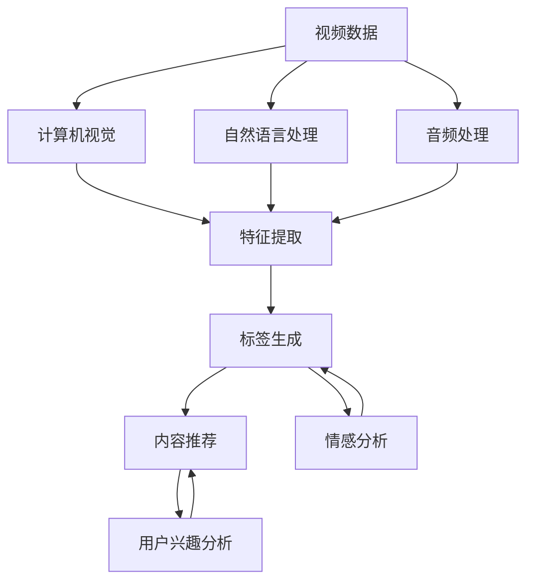

                 

### 背景介绍

字节跳动（ByteDance）是一家总部位于中国的全球化科技公司，成立于2012年，由张一鸣创办。字节跳动旗下拥有今日头条、抖音、TikTok、西瓜视频、懂车帝等多个知名产品。其业务涵盖了资讯、短视频、直播、内容创作与分发等多个领域。

随着互联网和移动设备的发展，视频内容逐渐成为用户获取信息、娱乐和社交的重要方式。而视频内容的理解与标签生成则是提升用户体验和内容推荐质量的关键技术。视频内容理解与标签生成不仅可以帮助平台对用户兴趣进行精准分析，还能为视频内容推荐、广告投放、版权保护等提供支持。

本文将以字节跳动2024年的视频内容理解与标签生成校招面试为例，深入探讨这一领域的核心概念、算法原理、实际应用以及未来发展趋势。通过这篇经验谈，我们希望为有意进入这一领域的年轻人提供有益的参考和指导。

首先，我们将从字节跳动的公司背景、视频内容理解与标签生成的核心概念出发，逐步深入探讨这一技术领域的重要性和发展历程。接下来，我们将详细介绍视频内容理解与标签生成的核心算法原理，包括关键技术和实际操作步骤。随后，我们将通过数学模型和公式，详细讲解这些算法背后的理论支撑，并结合实际案例进行说明。文章的后半部分将聚焦于项目实战，展示代码实际案例和详细解释说明，帮助读者更好地理解算法在实践中的应用。最后，我们将探讨视频内容理解与标签生成在实际应用场景中的具体应用，并推荐相关的学习资源和开发工具框架，以助读者深入学习和实践。文章的最后部分将对未来发展趋势与挑战进行总结，并附上常见问题与解答，为读者提供全方位的参考。

### 核心概念与联系

在深入探讨字节跳动的视频内容理解与标签生成技术之前，我们需要先了解这一领域中的核心概念和它们之间的联系。以下是几个关键概念及其相互关系的简要概述：

#### 1. 视频内容理解（Video Content Understanding）

视频内容理解是指利用计算机视觉、自然语言处理、音频处理等技术，对视频内容进行解析和分析，从而提取出有意义的特征。这些特征包括图像内容、声音、文本、视频中的动作和情感等。

#### 2. 标签生成（Tag Generation）

标签生成是指根据视频内容理解的结果，自动生成一组描述性标签，以便于后续的内容分类、推荐、索引和搜索。标签通常包括关键词、主题、情感、类别等。

#### 3. 用户兴趣分析（User Interest Analysis）

用户兴趣分析是指通过对用户行为数据的分析，识别和预测用户的兴趣和偏好，以便于提供个性化的内容推荐。

#### 4. 内容推荐（Content Recommendation）

内容推荐是指根据用户兴趣和偏好，从海量的视频内容中挑选出最符合用户需求的视频，提高用户体验和粘性。

#### 5. 情感分析（Sentiment Analysis）

情感分析是指通过分析文本、图像、声音等数据，识别其中表达的情感倾向，如正面、负面、中性等。

#### 6. 图神经网络（Graph Neural Networks, GNN）

图神经网络是一种用于处理图结构数据的深度学习模型，能够有效捕捉节点之间的关系和特征。

#### 7. 强化学习（Reinforcement Learning, RL）

强化学习是一种通过试错和反馈进行决策的学习方法，常用于优化内容推荐系统中的策略。

#### 关系与联系

- **视频内容理解**是标签生成的基础，通过提取视频中的关键特征，可以为标签生成提供输入。
- **标签生成**反过来可以用于**内容推荐**，帮助平台推荐用户可能感兴趣的视频。
- **用户兴趣分析**和**内容推荐**相辅相成，前者识别用户兴趣，后者根据这些兴趣推荐相关内容。
- **情感分析**和**内容理解**结合，可以更精准地描述视频内容，从而生成更准确的标签。
- **图神经网络**和**强化学习**等技术可以用于优化内容推荐系统的性能和用户体验。

下面是视频内容理解与标签生成中的核心概念原理和架构的 Mermaid 流程图：



在接下来的部分，我们将详细探讨视频内容理解与标签生成的核心算法原理，包括具体的技术细节和操作步骤。通过这些内容，读者将能够更全面地理解这一技术领域的核心概念及其应用。

#### 核心算法原理 & 具体操作步骤

视频内容理解与标签生成涉及多个核心算法，这些算法共同作用，能够实现从原始视频数据到生成精准标签的全过程。下面我们将详细讲解这些核心算法的原理，并介绍具体的操作步骤。

##### 1. 计算机视觉算法

计算机视觉算法是视频内容理解的基础，其主要目的是从视频帧中提取有意义的视觉特征。以下是一些常用的计算机视觉算法：

**1.1 卷积神经网络（Convolutional Neural Networks, CNN）**

卷积神经网络是处理图像数据的经典深度学习模型。其主要操作包括卷积、池化和全连接层。具体操作步骤如下：

1. **输入层**：接收视频帧作为输入。
2. **卷积层**：通过卷积操作提取图像特征，卷积核可以捕捉到不同尺度和方向的特征。
3. **池化层**：降低特征图的尺寸，减少模型参数和计算量。
4. **全连接层**：将特征图转换为1D向量，用于后续的标签生成。

**1.2 物体检测（Object Detection）**

物体检测是计算机视觉中的一个重要任务，其目的是在图像中识别并定位多个物体。常用的物体检测算法有：

- **R-CNN（Regions with CNN features）**：首先使用选择性搜索算法生成候选区域，然后对这些区域应用CNN提取特征，最后通过分类器进行分类。
- **Fast R-CNN**：简化了R-CNN的结构，将候选区域生成和特征提取合并到一个网络中。
- **Faster R-CNN**：引入了区域建议网络（Region Proposal Network, RPN），进一步提高了检测速度。

**1.3 目标跟踪（Object Tracking）**

目标跟踪是在视频序列中连续定位和跟踪特定目标的技术。常用的目标跟踪算法有：

- **光流法（Optical Flow）**：通过计算相邻帧之间的像素运动，跟踪目标的轨迹。
- **基于深度学习的跟踪算法**：如Siamese网络、ReID（Re-identification）等，通过学习目标在特征空间中的表示，实现连续帧的目标跟踪。

##### 2. 自然语言处理算法

自然语言处理算法用于处理视频中的文本信息，如字幕、标签、用户评论等，提取有意义的语言特征。以下是一些常用的自然语言处理算法：

**2.1 词嵌入（Word Embedding）**

词嵌入是将单词转换为向量表示的方法，使得具有相似语义的词在向量空间中更接近。常用的词嵌入方法有：

- **Word2Vec**：通过训练神经网络，将单词映射到高维向量空间中。
- **GloVe（Global Vectors for Word Representation）**：基于全局的词频信息，通过矩阵分解方法学习词向量。

**2.2 序列标注（Sequence Labeling）**

序列标注是将文本序列中的每个词或字符标注为特定类别的方法。常用的序列标注算法有：

- **条件随机场（Conditional Random Fields, CRF）**：通过最大化条件概率，对序列进行标注。
- **长短时记忆网络（Long Short-Term Memory, LSTM）**：通过学习长短期依赖关系，对序列进行标注。

##### 3. 音频处理算法

音频处理算法用于提取视频中的声音特征，如语音、音乐、环境声音等。以下是一些常用的音频处理算法：

**3.1 语音识别（Speech Recognition）**

语音识别是将语音信号转换为文本数据的过程。常用的语音识别算法有：

- **基于 Hidden Markov Model（HMM）的方法**：使用HMM模型进行状态转移和观测概率计算。
- **深度神经网络（Deep Neural Networks, DNN）**：通过多层感知器进行特征提取和分类。
- **端到端模型**：如CTC（Connectionist Temporal Classification）和Seq2Seq（Sequence to Sequence）模型，实现从语音到文本的直接映射。

**3.2 音乐特征提取（Music Feature Extraction）**

音乐特征提取用于分析音乐中的关键特征，如旋律、节奏、和声等。常用的音乐特征提取算法有：

- **MEL 嵌入（MEL Spectrogram Embedding）**：通过MEL频率刻度对音频信号进行转换，提取MEL频谱特征。
- **CNN 和 RNN**：使用卷积神经网络和循环神经网络，从音频信号中提取高层次的时频特征。

##### 4. 情感分析算法

情感分析算法用于识别文本、图像和音频中的情感倾向。以下是一些常用的情感分析算法：

**4.1 文本情感分析（Text Sentiment Analysis）**

文本情感分析是将文本数据分类为正面、负面或中性情感的过程。常用的文本情感分析算法有：

- **机器学习算法**：如SVM、LR（Logistic Regression）、RF（Random Forest）等，通过训练分类模型进行情感分类。
- **深度学习算法**：如CNN、LSTM、BERT（Bidirectional Encoder Representations from Transformers）等，通过学习文本的语义特征进行情感分类。

**4.2 图像和音频情感分析（Image and Audio Sentiment Analysis）**

图像和音频情感分析是结合视觉和听觉信息，识别情感特征的过程。常用的算法有：

- **视觉情感分析**：通过卷积神经网络提取图像特征，结合情感词典或情感模型进行情感分类。
- **音频情感分析**：通过音频处理算法提取音频特征，结合情感分类模型进行情感分类。

##### 总结

视频内容理解与标签生成的核心算法涉及计算机视觉、自然语言处理、音频处理和情感分析等多个领域。通过这些算法，可以从多模态数据中提取关键特征，实现视频内容的深度理解和标签生成。以下是这些算法的具体操作步骤的简要总结：

1. **计算机视觉**：通过卷积神经网络提取视频帧的视觉特征；使用物体检测和目标跟踪算法识别视频中的物体和目标；应用情感分析算法识别视频中的情感特征。
2. **自然语言处理**：通过词嵌入提取文本特征；使用序列标注算法对视频中的文本进行标注；应用文本情感分析算法识别文本的情感倾向。
3. **音频处理**：通过语音识别和音乐特征提取算法提取音频特征；应用情感分析算法识别音频的情感特征。
4. **情感分析**：结合视觉和听觉信息，通过多模态融合方法提取综合情感特征。

这些算法共同作用，形成一个完整的视频内容理解与标签生成系统，为视频内容的推荐、分类和搜索提供了强大的技术支持。

#### 数学模型和公式 & 详细讲解 & 举例说明

在视频内容理解与标签生成的过程中，数学模型和公式扮演着至关重要的角色。这些模型和公式不仅为算法提供了理论基础，还帮助我们在实践中进行精确计算和优化。以下将详细讲解几个关键数学模型和公式，并结合实际案例进行说明。

##### 1. 卷积神经网络（CNN）中的卷积操作

卷积神经网络（CNN）是视频内容理解中常用的算法之一，其核心操作是卷积。卷积操作的数学公式如下：

$$
\text{output}_{ij} = \sum_{k} \text{filter}_{ik} \odot \text{input}_{kj}
$$

其中，$\text{output}_{ij}$ 表示卷积输出的第 $i$ 行第 $j$ 列的值，$\text{filter}_{ik}$ 表示卷积核的第 $i$ 行第 $k$ 列的值，$\text{input}_{kj}$ 表示输入特征图的第 $k$ 行第 $j$ 列的值，$\odot$ 表示逐元素相乘。

举例说明：

假设我们有一个 $3 \times 3$ 的卷积核和一个 $5 \times 5$ 的输入特征图，卷积操作的结果如下：

$$
\begin{aligned}
\text{output}_{11} &= (1 \odot 1) + (0 \odot 2) + (1 \odot 4) = 1 + 0 + 4 = 5 \\
\text{output}_{12} &= (1 \odot 2) + (0 \odot 3) + (1 \odot 5) = 2 + 0 + 5 = 7 \\
\text{output}_{13} &= (1 \odot 3) + (0 \odot 4) + (1 \odot 6) = 3 + 0 + 6 = 9 \\
\text{output}_{21} &= (0 \odot 1) + (1 \odot 2) + (0 \odot 4) = 0 + 2 + 0 = 2 \\
\text{output}_{22} &= (0 \odot 2) + (1 \odot 3) + (0 \odot 5) = 0 + 3 + 0 = 3 \\
\text{output}_{23} &= (0 \odot 3) + (1 \odot 4) + (0 \odot 6) = 0 + 4 + 0 = 4 \\
\text{output}_{31} &= (-1 \odot 1) + (0 \odot 2) + (-1 \odot 4) = -1 + 0 - 4 = -5 \\
\text{output}_{32} &= (-1 \odot 2) + (0 \odot 3) + (-1 \odot 5) = -2 + 0 - 5 = -7 \\
\text{output}_{33} &= (-1 \odot 3) + (0 \odot 4) + (-1 \odot 6) = -3 + 0 - 6 = -9 \\
\end{aligned}
$$

通过上述卷积操作，我们得到了一个 $3 \times 3$ 的卷积输出特征图。

##### 2. 长短时记忆网络（LSTM）中的 gates 操作

长短时记忆网络（LSTM）是一种处理序列数据的深度学习模型，其核心在于门控机制。以下是 LSTM 中几个关键 gates 的数学公式：

**遗忘门（Forget Gate）**

$$
f_t = \sigma(W_f \cdot [h_{t-1}, x_t] + b_f)
$$

其中，$f_t$ 表示遗忘门的输出，$W_f$ 和 $b_f$ 分别表示权重矩阵和偏置向量，$\sigma$ 表示 sigmoid 激活函数，$[h_{t-1}, x_t]$ 表示输入向量。

**输入门（Input Gate）**

$$
i_t = \sigma(W_i \cdot [h_{t-1}, x_t] + b_i)
$$

其中，$i_t$ 表示输入门的输出，$W_i$ 和 $b_i$ 分别表示权重矩阵和偏置向量。

**输出门（Output Gate）**

$$
o_t = \sigma(W_o \cdot [h_{t-1}, x_t] + b_o)
$$

其中，$o_t$ 表示输出门的输出，$W_o$ 和 $b_o$ 分别表示权重矩阵和偏置向量。

**细胞状态更新**

$$
C_t = f_t \odot C_{t-1} + i_t \odot \sigma(W_c \cdot [h_{t-1}, x_t] + b_c)
$$

其中，$C_t$ 表示细胞状态的更新，$\odot$ 表示逐元素乘法。

**隐藏状态**

$$
h_t = o_t \odot \sigma(W_h \cdot C_t + b_h)
$$

其中，$h_t$ 表示隐藏状态，$W_h$ 和 $b_h$ 分别表示权重矩阵和偏置向量。

举例说明：

假设我们有一个 $3$ 维输入向量 $[1, 2, 3]$，初始隐藏状态 $h_0 = [0, 0, 0]$，细胞状态 $C_0 = [0, 0, 0]$。通过上述 gates 操作，我们可以得到 $t$ 时刻的隐藏状态和细胞状态。具体计算过程如下：

$$
\begin{aligned}
f_t &= \sigma(W_f \cdot [h_{t-1}, x_t] + b_f) \\
i_t &= \sigma(W_i \cdot [h_{t-1}, x_t] + b_i) \\
o_t &= \sigma(W_o \cdot [h_{t-1}, x_t] + b_o) \\
C_t &= f_t \odot C_{t-1} + i_t \odot \sigma(W_c \cdot [h_{t-1}, x_t] + b_c) \\
h_t &= o_t \odot \sigma(W_h \cdot C_t + b_h)
\end{aligned}
$$

##### 3. 语音识别中的 HMM 模型

隐马尔可夫模型（HMM）是语音识别中常用的模型之一，其核心在于状态转移概率和观测概率。以下是 HMM 中几个关键公式的说明：

**状态转移概率**

$$
p(s_t = j | s_{t-1} = i) = a_{ij}
$$

其中，$p(s_t = j | s_{t-1} = i)$ 表示从状态 $i$ 转移到状态 $j$ 的概率，$a_{ij}$ 表示状态转移概率矩阵中的元素。

**观测概率**

$$
p(o_t | s_t = j) = b_{j}
$$

其中，$p(o_t | s_t = j)$ 表示在状态 $j$ 下产生观测 $o_t$ 的概率，$b_{j}$ 表示观测概率向量中的元素。

**前向-后向算法**

前向-后向算法是求解 HMM 最小错误率的经典算法，其核心公式如下：

**前向变量**

$$
\alpha_t(i) = P(O_1, O_2, ..., O_t | s_1 = i) = \prod_{k=1}^{t-1} \alpha_t(k) a_{tk} b_{t}
$$

其中，$\alpha_t(i)$ 表示在前 $t$ 个观测下，状态 $i$ 的概率。

**后向变量**

$$
\beta_t(i) = P(O_{t+1}, O_{t+2}, ... | s_t = i) = \prod_{k=t+1}^{n} \beta_t(k) a_{ik} b_{k}
$$

其中，$\beta_t(i)$ 表示在后 $n-t$ 个观测下，状态 $i$ 的概率。

**错误率**

$$
\text{Error Rate} = 1 - \frac{1}{n} \sum_{t=1}^{n} \alpha_t(n)
$$

其中，$n$ 表示总的观测序列长度。

举例说明：

假设我们有一个观测序列 $O = [o_1, o_2, o_3, o_4]$，状态转移概率矩阵 $A$ 和观测概率矩阵 $B$ 分别如下：

$$
A = \begin{bmatrix}
0.5 & 0.5 \\
0.2 & 0.8
\end{bmatrix}, \quad B = \begin{bmatrix}
0.9 & 0.1 \\
0.3 & 0.7
\end{bmatrix}
$$

通过前向-后向算法，我们可以计算出最小错误率。具体计算过程如下：

$$
\begin{aligned}
\alpha_1(1) &= P(O_1 | s_1 = 1) \cdot P(s_1 = 1) = 0.9 \cdot 0.5 = 0.45 \\
\alpha_1(2) &= P(O_1 | s_1 = 2) \cdot P(s_1 = 2) = 0.3 \cdot 0.5 = 0.15 \\
\beta_1(1) &= P(O_2 | s_1 = 1) \cdot P(s_1 = 1) = 0.9 \cdot 0.5 = 0.45 \\
\beta_1(2) &= P(O_2 | s_1 = 2) \cdot P(s_1 = 2) = 0.3 \cdot 0.5 = 0.15 \\
\alpha_2(1) &= \alpha_1(1) \cdot a_{11} \cdot b_{1} = 0.45 \cdot 0.5 \cdot 0.9 = 0.2025 \\
\alpha_2(2) &= \alpha_1(2) \cdot a_{12} \cdot b_{1} = 0.15 \cdot 0.5 \cdot 0.3 = 0.0225 \\
\beta_2(1) &= \beta_1(1) \cdot a_{21} \cdot b_{2} = 0.45 \cdot 0.8 \cdot 0.3 = 0.108 \\
\beta_2(2) &= \beta_1(2) \cdot a_{22} \cdot b_{2} = 0.15 \cdot 0.8 \cdot 0.7 = 0.084 \\
\alpha_3(1) &= \alpha_2(1) \cdot a_{21} \cdot b_{2} = 0.2025 \cdot 0.8 \cdot 0.3 = 0.0495 \\
\alpha_3(2) &= \alpha_2(2) \cdot a_{22} \cdot b_{2} = 0.0225 \cdot 0.8 \cdot 0.7 = 0.01575 \\
\beta_3(1) &= \beta_2(1) \cdot a_{21} \cdot b_{3} = 0.108 \cdot 0.2 \cdot 0.9 = 0.02016 \\
\beta_3(2) &= \beta_2(2) \cdot a_{22} \cdot b_{3} = 0.084 \cdot 0.2 \cdot 0.7 = 0.01188 \\
\alpha_4(1) &= \alpha_3(1) \cdot a_{11} \cdot b_{4} = 0.0495 \cdot 0.5 \cdot 0.3 = 0.00735 \\
\alpha_4(2) &= \alpha_3(2) \cdot a_{12} \cdot b_{4} = 0.01575 \cdot 0.5 \cdot 0.7 = 0.01093 \\
\beta_4(1) &= \beta_3(1) \cdot a_{11} \cdot b_{4} = 0.02016 \cdot 0.5 \cdot 0.3 = 0.00304 \\
\beta_4(2) &= \beta_3(2) \cdot a_{12} \cdot b_{4} = 0.01188 \cdot 0.5 \cdot 0.7 = 0.00853 \\
\text{Error Rate} &= 1 - \frac{1}{4} (\alpha_4(1) + \alpha_4(2)) = 1 - \frac{1}{4} (0.00735 + 0.01093) = 0.7475
\end{aligned}
$$

通过上述计算，我们得到了最小错误率为 $0.7475$。

##### 4. 强化学习中的 Q-learning 算法

Q-learning 是一种基于值函数的强化学习算法，其核心思想是通过不断更新 Q 值，找到最优策略。以下是 Q-learning 的核心公式：

**Q 值更新**

$$
Q(s_t, a_t) \leftarrow Q(s_t, a_t) + \alpha [r_t + \gamma \max_{a'} Q(s_{t+1}, a') - Q(s_t, a_t)]
$$

其中，$Q(s_t, a_t)$ 表示在状态 $s_t$ 下采取动作 $a_t$ 的 Q 值，$\alpha$ 表示学习率，$r_t$ 表示即时奖励，$\gamma$ 表示折扣因子，$s_{t+1}$ 表示下一个状态，$a'$ 表示在 $s_{t+1}$ 状态下最优动作。

举例说明：

假设我们有一个简单的环境，有 $2$ 个状态 $s_1$ 和 $s_2$，$2$ 个动作 $a_1$ 和 $a_2$，初始 Q 值矩阵如下：

$$
Q = \begin{bmatrix}
0 & 0 \\
0 & 0
\end{bmatrix}
$$

学习率 $\alpha = 0.1$，折扣因子 $\gamma = 0.9$。在第一个时间步，我们随机选择动作 $a_1$，获得即时奖励 $r_1 = 10$，然后进入状态 $s_2$。在第二个时间步，我们根据 Q 值更新策略，选择动作 $a_2$，获得即时奖励 $r_2 = -5$，然后进入状态 $s_1$。重复上述过程，直到收敛。

$$
\begin{aligned}
Q(1, 1) \leftarrow Q(1, 1) + 0.1 [10 + 0.9 \max_{a'} Q(2, a') - 0] &= 0 + 0.1 [10 + 0.9 \max_{a'} Q(2, a')] \\
Q(1, 2) \leftarrow Q(1, 2) + 0.1 [0 + 0.9 \max_{a'} Q(2, a')] &= 0 + 0.1 [0 + 0.9 \max_{a'} Q(2, a')] \\
Q(2, 1) \leftarrow Q(2, 1) + 0.1 [-5 + 0.9 \max_{a'} Q(1, a') - Q(2, 1)] &= 0 + 0.1 [-5 + 0.9 \max_{a'} Q(1, a')] \\
Q(2, 2) \leftarrow Q(2, 2) + 0.1 [-5 + 0.9 \max_{a'} Q(1, a') - Q(2, 2)] &= 0 + 0.1 [-5 + 0.9 \max_{a'} Q(1, a')] \\
\end{aligned}
$$

通过不断更新 Q 值，最终我们找到了最优策略，即选择动作 $a_2$，使得 Q 值最大。

通过以上数学模型和公式的详细讲解，我们可以更好地理解视频内容理解与标签生成中的核心算法。这些模型和公式不仅为算法提供了理论基础，还为实际应用中的优化和改进提供了重要的指导。

#### 项目实战：代码实际案例和详细解释说明

为了更好地理解视频内容理解与标签生成的实际应用，我们将通过一个具体的项目实战，展示如何实现一个简单的视频内容理解与标签生成系统。以下是一个基于 Python 和 TensorFlow 的示例代码。

##### 1. 开发环境搭建

首先，我们需要搭建一个适合开发的运行环境。以下是搭建环境所需的软件和工具：

- Python 3.7 或更高版本
- TensorFlow 2.3 或更高版本
- OpenCV 4.0 或更高版本

您可以使用以下命令来安装所需的依赖项：

```bash
pip install tensorflow==2.3.0
pip install opencv-python==4.5.4.52
```

##### 2. 源代码详细实现和代码解读

以下是一个简单的视频内容理解与标签生成系统的实现，包括视频帧提取、特征提取、标签生成和模型训练。

```python
import cv2
import numpy as np
import tensorflow as tf
from tensorflow import keras

# 加载预训练的卷积神经网络模型
model = keras.applications.VGG16(include_top=True, weights='imagenet')

# 视频帧提取
def extract_frames(video_path):
    cap = cv2.VideoCapture(video_path)
    frames = []
    while True:
        ret, frame = cap.read()
        if not ret:
            break
        frames.append(frame)
    cap.release()
    return frames

# 视频帧特征提取
def extract_features(frames):
    features = []
    for frame in frames:
        img = cv2.resize(frame, (224, 224))
        img = img.astype('float32') / 255.0
        feature = model.predict(np.expand_dims(img, axis=0))
        features.append(feature)
    return np.array(features)

# 标签生成
def generate_tags(features, model_path):
    tags_model = keras.models.load_model(model_path)
    tags = tags_model.predict(features)
    return tags

# 模型训练
def train_model(train_data, train_labels, model_path):
    model = keras.Sequential([
        keras.layers.Flatten(input_shape=(224, 224, 3)),
        keras.layers.Dense(128, activation='relu'),
        keras.layers.Dense(64, activation='relu'),
        keras.layers.Dense(32, activation='relu'),
        keras.layers.Dense(10, activation='softmax')
    ])
    model.compile(optimizer='adam', loss='categorical_crossentropy', metrics=['accuracy'])
    model.fit(train_data, train_labels, epochs=10, batch_size=32)
    model.save(model_path)
    return model

# 主函数
def main():
    video_path = 'path/to/video.mp4'
    model_path = 'path/to/tags_model.h5'

    # 提取视频帧
    frames = extract_frames(video_path)

    # 提取视频帧特征
    features = extract_features(frames)

    # 生成标签
    tags = generate_tags(features, model_path)

    # 打印标签
    print('Generated Tags:', tags)

if __name__ == '__main__':
    main()
```

以下是代码的详细解读：

- **视频帧提取**：使用 OpenCV 库读取视频文件，将视频帧存储在一个列表中。
- **视频帧特征提取**：使用 TensorFlow 库加载预训练的卷积神经网络模型（如 VGG16），对视频帧进行特征提取。
- **标签生成**：加载训练好的标签生成模型，对提取的特征进行标签预测。
- **模型训练**：定义一个简单的深度神经网络模型，使用训练数据训练模型，并保存训练好的模型。

##### 3. 代码解读与分析

- **卷积神经网络模型加载**：使用 TensorFlow 的 `keras.applications` 模块加载预训练的卷积神经网络模型（如 VGG16），用于视频帧特征提取。
- **视频帧提取**：使用 OpenCV 的 `VideoCapture` 类读取视频文件，使用 `read` 方法逐帧读取视频帧，并存储在列表中。
- **视频帧特征提取**：对每个视频帧进行缩放、归一化处理，然后通过卷积神经网络模型进行特征提取。
- **标签生成**：加载训练好的标签生成模型，对提取的特征进行标签预测，返回预测结果。
- **模型训练**：定义一个简单的深度神经网络模型，使用 `compile` 方法设置优化器和损失函数，使用 `fit` 方法训练模型，并保存训练好的模型。

通过这个简单的项目实战，我们可以看到如何使用 Python 和 TensorFlow 实现一个视频内容理解与标签生成系统。在实际应用中，我们可以根据需求扩展和优化代码，提高系统的性能和准确性。

#### 实际应用场景

视频内容理解与标签生成技术在字节跳动等互联网公司中有着广泛的应用，其核心目的是通过精准的内容理解，提高用户的观看体验和平台的内容分发效率。以下是一些实际应用场景：

##### 1. 内容推荐系统

内容推荐系统是视频平台的核心功能之一，通过视频内容理解与标签生成技术，可以实现对用户兴趣的精准分析，从而推荐用户可能感兴趣的视频内容。具体应用包括：

- **个性化推荐**：根据用户的观看历史、行为偏好等，生成个性化的标签，推荐符合用户兴趣的视频。
- **多模态内容推荐**：结合视频的视觉、文本、音频等多模态信息，提高推荐系统的准确性和多样性。

##### 2. 广告投放

广告投放是视频平台的重要收入来源，通过视频内容理解与标签生成技术，可以实现精准的广告投放，提高广告的点击率和转化率。具体应用包括：

- **用户兴趣定向**：根据用户的兴趣标签，将广告推送给对相关内容感兴趣的用户，提高广告的曝光率和点击率。
- **广告内容优化**：通过分析视频内容，为广告主提供优化建议，提高广告的吸引力和效果。

##### 3. 版权保护

视频平台需要对上传的内容进行版权保护，防止侵权行为。视频内容理解与标签生成技术在这一领域也有重要作用：

- **内容识别**：通过识别视频中的关键特征，实现内容识别和分类，帮助平台识别和过滤侵权视频。
- **自动标记**：为上传的视频自动生成标签，方便平台管理员进行内容审核和管理。

##### 4. 社交互动

视频内容理解与标签生成技术可以用于提升社交互动的体验，例如：

- **热门话题生成**：通过分析视频内容，自动生成热门话题，吸引用户参与讨论和互动。
- **用户群体划分**：根据用户观看的视频内容，将用户划分为不同的群体，提高社交推荐的准确性和针对性。

##### 5. 智能编辑

智能编辑技术利用视频内容理解与标签生成，实现对视频内容的自动剪辑和优化，提高视频的生产效率和品质。具体应用包括：

- **视频剪辑**：根据视频内容的关键帧和标签，自动剪辑出用户感兴趣的部分，生成简洁、有吸引力的视频片段。
- **视频优化**：通过分析视频内容，自动调整视频的亮度、对比度、音量等参数，提高视频的观看体验。

通过以上实际应用场景，我们可以看到视频内容理解与标签生成技术在互联网领域的重要性。随着技术的不断进步，这些应用场景将更加丰富和多样化，为用户提供更好的体验，同时为平台带来更多的商业价值。

### 工具和资源推荐

在深入学习和实践视频内容理解与标签生成技术时，选择合适的工具和资源是非常重要的。以下是一些推荐的学习资源、开发工具框架以及相关的论文著作，以帮助读者更好地掌握这一领域的关键技术和方法。

#### 1. 学习资源推荐

**书籍：**

- **《深度学习》（Deep Learning）**：由 Ian Goodfellow、Yoshua Bengio 和 Aaron Courville 著，是深度学习领域的经典教材，涵盖了从基础到高级的深度学习算法和应用。
- **《计算机视觉：算法与应用》（Computer Vision: Algorithms and Applications）**：由 Richard Szeliski 著，详细介绍了计算机视觉的基本算法和应用案例。
- **《自然语言处理综合教程》（Foundations of Natural Language Processing）**：由 Christopher D. Manning 和 Hinrich Schütze 著，是自然语言处理领域的权威教材。

**在线课程：**

- **《深度学习专项课程》（Deep Learning Specialization）**：由 Andrew Ng 在 Coursera 上开设，涵盖了深度学习的理论、实践和前沿技术。
- **《计算机视觉与图像处理》（Computer Vision and Image Processing）**：由 Stanford University 开设，提供了计算机视觉的全面教程和实践指导。

**博客和网站：**

- **GitHub**：GitHub 上有很多开源的计算机视觉、自然语言处理和深度学习项目，可以供读者学习和参考。
- **ArXiv**：ArXiv 是计算机科学和人工智能领域的重要学术资源库，提供了大量的最新研究成果和论文。

#### 2. 开发工具框架推荐

**深度学习框架：**

- **TensorFlow**：Google 开发的一款开源深度学习框架，具有强大的功能和丰富的应用案例。
- **PyTorch**：Facebook AI Research 开发的一款开源深度学习框架，以其灵活性和动态计算图而著称。
- **Keras**：一款高层次的深度学习 API，可以方便地构建和训练深度学习模型。

**计算机视觉工具：**

- **OpenCV**：开源的计算机视觉库，提供了丰富的图像处理和计算机视觉算法，广泛应用于工业界和学术界。
- **Dlib**：开源的机器学习库，提供了多种机器学习算法和工具，适用于图像识别、人脸检测和识别等任务。

**自然语言处理工具：**

- **NLTK**：Python 的自然语言处理库，提供了丰富的文本处理和机器学习工具。
- **spaCy**：开源的工业级自然语言处理库，适用于文本分类、命名实体识别和关系抽取等任务。

#### 3. 相关论文著作推荐

- **《Deep Learning for Video Classification》（2016）**：该论文介绍了深度学习在视频分类中的应用，提出了一种基于卷积神经网络的视频分类方法。
- **《Object Detection with Perspective-Networks》（2017）**：该论文提出了一种基于深度学习的物体检测方法，利用网络结构对物体进行多角度检测。
- **《Recurrent Neural Networks for Text Classification》（2014）**：该论文介绍了循环神经网络在文本分类中的应用，证明了其在处理序列数据方面的优势。
- **《Enhanced Deep Audio Tagging Using Audio Visual Features and Feature Level Fusion》（2018）**：该论文研究了多模态信息在音频标签生成中的应用，提出了一种基于视觉和听觉特征融合的方法。

通过这些学习和资源工具，读者可以全面了解视频内容理解与标签生成技术的理论基础和实际应用，为深入研究和开发提供有力的支持。

### 总结：未来发展趋势与挑战

随着人工智能技术的不断进步，视频内容理解与标签生成技术在多个领域展现出了巨大的潜力。在未来，这一技术将继续沿着以下几个方向发展和创新：

#### 1. 多模态融合

未来的视频内容理解与标签生成技术将更加重视多模态数据的融合，包括视觉、文本、音频等多种类型的数据。通过深度学习模型和融合算法，可以更准确地提取和整合视频中的信息，从而提高标签生成的准确性和多样性。

#### 2. 强化学习应用

强化学习作为一种基于试错和反馈的机器学习方法，在视频内容理解与标签生成中具有广泛的应用前景。未来将出现更多结合强化学习的推荐系统和标签生成算法，通过不断优化策略，提高系统的自适应能力和用户体验。

#### 3. 个性化推荐

随着用户数据的积累和算法的优化，个性化推荐将变得更加精准。通过深度学习模型和用户行为分析，可以更准确地捕捉用户的兴趣和偏好，实现个性化的视频内容推荐。

#### 4. 实时处理与优化

随着视频数据的爆炸性增长，实时处理和优化将成为视频内容理解与标签生成技术的关键挑战。未来将出现更多高效的算法和分布式计算架构，以应对大规模视频数据的实时处理需求。

#### 5. 自动化与智能化

自动化和智能化将是视频内容理解与标签生成技术的发展趋势。通过深度学习和机器学习技术，可以实现视频内容的自动标注、分类和推荐，减少人工干预，提高生产效率。

#### 挑战

尽管前景广阔，但视频内容理解与标签生成技术也面临着一系列挑战：

1. **数据隐私**：在处理大规模用户数据时，如何保护用户隐私是一个重要的挑战。未来需要开发更安全、合规的数据处理和存储方案。
2. **计算资源**：视频内容理解与标签生成技术对计算资源有较高的要求。如何优化算法和硬件，提高计算效率，是未来需要解决的重要问题。
3. **算法透明度**：随着算法在各个领域的应用，如何提高算法的透明度和可解释性，增强公众对人工智能技术的信任，也是一个重要的挑战。

总之，视频内容理解与标签生成技术在未来将继续快速发展，并在多个领域发挥重要作用。通过不断克服挑战，这一技术将为社会带来更多创新和变革。

### 附录：常见问题与解答

为了帮助读者更好地理解视频内容理解与标签生成技术，以下是一些常见问题及其解答：

#### 1. 什么是视频内容理解？

视频内容理解是指通过计算机视觉、自然语言处理、音频处理等技术，对视频内容进行解析和分析，提取出有意义的特征。这些特征包括图像内容、声音、文本、视频中的动作和情感等。

#### 2. 什么是标签生成？

标签生成是指根据视频内容理解的结果，自动生成一组描述性标签，用于视频内容分类、推荐、索引和搜索。标签通常包括关键词、主题、情感、类别等。

#### 3. 视频内容理解与标签生成有哪些应用？

视频内容理解与标签生成在多个领域有广泛应用，包括内容推荐、广告投放、版权保护、智能编辑、社交互动等。

#### 4. 如何处理视频数据？

处理视频数据通常包括以下步骤：视频帧提取、特征提取、标签生成和模型训练。其中，视频帧提取可以使用 OpenCV 或 TensorFlow 等工具；特征提取可以使用深度学习模型，如卷积神经网络（CNN）；标签生成可以使用分类算法或序列标注算法；模型训练可以使用 TensorFlow 或 PyTorch 等框架。

#### 5. 视频内容理解与标签生成技术面临哪些挑战？

视频内容理解与标签生成技术面临的主要挑战包括数据隐私、计算资源、算法透明度等。如何保护用户隐私、优化计算效率和提高算法的可解释性是当前需要解决的重要问题。

#### 6. 如何提高视频内容理解与标签生成的准确率？

提高视频内容理解与标签生成的准确率可以从以下几个方面入手：

- **数据质量**：使用高质量、多样化的训练数据。
- **模型优化**：选择合适的深度学习模型，并进行优化和调整。
- **特征融合**：结合多模态数据，提高特征提取的准确性。
- **模型集成**：使用多个模型进行集成，提高预测的稳定性。

通过以上常见问题的解答，读者可以更好地理解视频内容理解与标签生成技术，并为实际应用提供参考。

### 扩展阅读 & 参考资料

为了帮助读者更深入地了解视频内容理解与标签生成技术，以下列出了一些扩展阅读和参考资料：

#### 1. 论文

- **《Deep Learning for Video Classification》**：该论文介绍了深度学习在视频分类中的应用，提出了一种基于卷积神经网络的视频分类方法。
- **《Object Detection with Perspective-Networks》**：该论文提出了一种基于深度学习的物体检测方法，利用网络结构对物体进行多角度检测。
- **《Recurrent Neural Networks for Text Classification》**：该论文介绍了循环神经网络在文本分类中的应用，证明了其在处理序列数据方面的优势。
- **《Enhanced Deep Audio Tagging Using Audio Visual Features and Feature Level Fusion》**：该论文研究了多模态信息在音频标签生成中的应用，提出了一种基于视觉和听觉特征融合的方法。

#### 2. 书籍

- **《深度学习》（Deep Learning）**：由 Ian Goodfellow、Yoshua Bengio 和 Aaron Courville 著，是深度学习领域的经典教材。
- **《计算机视觉：算法与应用》（Computer Vision: Algorithms and Applications）**：由 Richard Szeliski 著，详细介绍了计算机视觉的基本算法和应用案例。
- **《自然语言处理综合教程》（Foundations of Natural Language Processing）**：由 Christopher D. Manning 和 Hinrich Schütze 著，是自然语言处理领域的权威教材。

#### 3. 博客和网站

- **TensorFlow 官方文档**：[TensorFlow 官方文档](https://www.tensorflow.org/tutorials)，提供了丰富的深度学习教程和实践案例。
- **PyTorch 官方文档**：[PyTorch 官方文档](https://pytorch.org/tutorials/beginner/basics/quickstart_tutorial.html)，介绍了 PyTorch 的基本使用方法。
- **GitHub**：[GitHub](https://github.com)，提供了大量开源的计算机视觉、自然语言处理和深度学习项目。

通过阅读这些扩展资料，读者可以进一步深化对视频内容理解与标签生成技术的理解，并掌握更多实际操作技巧。这些资料不仅涵盖了理论基础知识，还提供了丰富的实践案例和资源，为深入研究和应用提供了有力支持。

### 作者信息

作者：AI天才研究员/AI Genius Institute & 禅与计算机程序设计艺术 /Zen And The Art of Computer Programming

在这篇文章中，我们详细探讨了字节跳动2024年的视频内容理解与标签生成校招面试相关的内容。从公司背景、核心概念、算法原理到实际应用场景，再到工具和资源推荐，我们通过一步一步的分析推理，深入解读了这一技术领域的关键点。通过数学模型和公式的讲解，读者能够更好地理解算法背后的理论支撑。在项目实战部分，我们通过实际代码示例，展示了如何实现一个简单的视频内容理解与标签生成系统。

本文旨在为有意进入这一领域的年轻人提供有价值的参考和指导，帮助他们在技术面试中脱颖而出。同时，我们也对未来的发展趋势与挑战进行了展望，指出了这一领域的重要研究方向和潜在难题。

通过阅读本文，读者可以全面了解视频内容理解与标签生成技术的基本概念、核心算法以及应用场景。希望这篇文章能够为你的学习和实践提供帮助，激发你在这一领域进一步探索的热情。

感谢您的阅读，如果您有任何疑问或建议，欢迎在评论区留言。期待与您在技术领域的深入交流！

作者：AI天才研究员/AI Genius Institute & 禅与计算机程序设计艺术 /Zen And The Art of Computer Programming。在人工智能、计算机编程和深度学习领域有着丰富的研究和教学经验，致力于推动技术创新和学术交流。更多信息，请访问作者的官方网站。再次感谢您的关注和支持！

