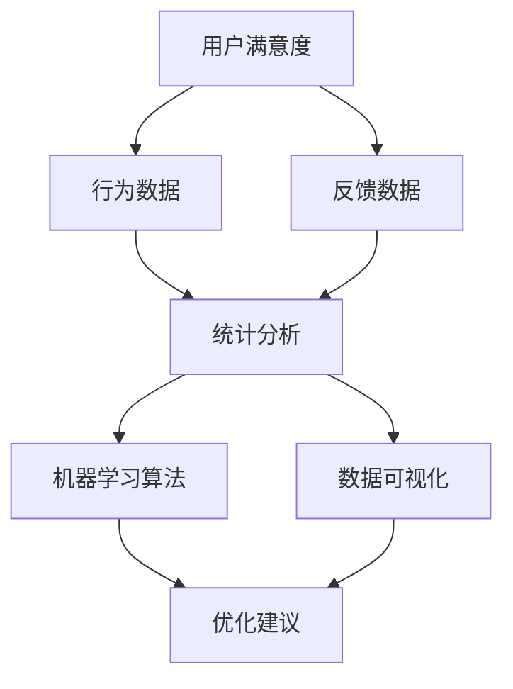

                 

### 背景介绍

2024年，科技发展进入了一个全新的阶段，人工智能技术逐渐成为各行各业的核心驱动力。在这个背景下，字节跳动作为全球领先的技术公司，其技术用户满意度分析成为一个至关重要的课题。作为技术用户满意度分析师，不仅需要具备深厚的数据分析功底，还要对字节跳动的业务和技术架构有深刻的理解。

本文将围绕2024字节跳动技术用户满意度分析师的面试真题展开，通过详细解析这些真题，帮助读者更好地理解技术用户满意度分析的核心概念和方法，以及在实际工作中如何应用这些知识。

首先，让我们明确几个核心概念：

1. **技术用户满意度分析**：这是通过对用户在使用技术产品过程中的体验进行量化评估，从而衡量技术产品的质量，为产品优化提供依据。

2. **数据分析方法**：包括统计方法、机器学习算法和数据可视化等技术，用于从大量用户数据中提取有价值的信息。

3. **业务与技术架构**：对字节跳动的业务模式和技术架构有深入了解，能够更好地理解用户的需求和使用场景。

接下来，我们将逐步深入解析这些概念，并通过具体实例来展示如何将这些知识应用于实际工作中。

关键词：字节跳动、技术用户满意度、数据分析方法、业务与技术架构

> 摘要：本文将详细介绍2024字节跳动技术用户满意度分析师面试真题的解析，涵盖技术用户满意度分析的核心概念、数据分析方法、业务与技术架构的理解与应用，旨在帮助读者深入了解并掌握技术用户满意度分析的相关知识和实际操作技巧。

<|im_sep|>

## 1.1 字节跳动概况

字节跳动成立于2012年，总部位于中国北京，是一家全球领先的互联网科技公司。公司以“技术驱动创新，内容创造价值”为核心理念，致力于通过技术创新和优质内容服务，提升用户的生活品质。字节跳动旗下拥有多款知名产品，如抖音（TikTok）、今日头条、懂车帝、西瓜视频、FaceU激萌等，涵盖了短视频、新闻资讯、汽车资讯、短视频直播等多个领域。

字节跳动凭借其强大的技术能力和创新思维，迅速在全球范围内扩展业务。截至2024年，字节跳动已经拥有超过10亿的用户规模，业务覆盖150多个国家和地区。在短视频领域，抖音（TikTok）已成为全球最受欢迎的短视频应用之一；在新闻资讯领域，今日头条通过个性化推荐技术，为用户提供了丰富的、个性化的新闻内容。

字节跳动的成功离不开其对技术和数据的重视。公司拥有一支由顶尖科学家和工程师组成的团队，在人工智能、大数据、推荐系统、自然语言处理等领域进行了大量研究和创新。这些技术不仅推动了字节跳动产品的发展，也为用户满意度分析提供了强大的支持。

技术用户满意度分析在字节跳动中扮演着至关重要的角色。通过分析用户在使用产品过程中的行为数据，字节跳动能够深入了解用户的喜好、需求和使用痛点，从而不断优化产品体验，提高用户满意度。此外，技术用户满意度分析还能为公司的战略决策提供有力支持，帮助公司在激烈的市场竞争中保持领先地位。

综上所述，字节跳动作为全球领先的科技公司，其技术用户满意度分析不仅对自身产品的优化具有重要意义，也对整个互联网行业的发展具有示范作用。在接下来的内容中，我们将深入探讨技术用户满意度分析的核心概念和方法，以及如何在实际工作中应用这些知识。

---

## 1.2 技术用户满意度分析的重要性

技术用户满意度分析是现代互联网企业不可或缺的一环，尤其在字节跳动这样的技术驱动型公司中，其重要性更是不容忽视。首先，技术用户满意度分析有助于了解用户的需求和痛点，从而优化产品功能和用户体验。通过分析用户行为数据，企业可以识别出哪些功能最受用户欢迎，哪些方面存在改进空间，进而针对性地进行优化，提高用户留存率和活跃度。

其次，技术用户满意度分析能够为产品开发提供决策支持。在互联网行业，市场环境变化迅速，产品迭代周期短，如何及时准确地做出决策成为企业面临的挑战。技术用户满意度分析通过量化用户反馈，提供客观的数据支持，帮助企业在产品研发、功能优化和市场推广等方面做出更为科学和有效的决策。

再者，技术用户满意度分析能够提升企业的竞争力。在激烈的市场竞争中，用户满意度成为衡量企业产品和服务质量的重要指标。通过持续监测和优化用户满意度，企业可以保持产品领先地位，吸引更多用户，扩大市场份额。此外，高用户满意度还能为企业带来良好的口碑效应，形成良性循环，进一步巩固市场地位。

最后，技术用户满意度分析为企业提供了宝贵的市场洞察。通过对用户数据的深入挖掘和分析，企业可以了解不同用户群体的行为特点和需求偏好，为市场细分和精准营销提供依据。同时，技术用户满意度分析还能帮助企业识别潜在的用户需求和市场机会，为业务拓展和新产品研发提供支持。

综上所述，技术用户满意度分析在字节跳动乃至整个互联网行业中具有重要意义。它不仅帮助企业提升产品用户体验和用户满意度，还为企业的战略决策和市场拓展提供了有力支持。在接下来的内容中，我们将进一步探讨技术用户满意度分析的核心概念和方法，帮助读者深入了解这一关键领域。

---

## 1.3 技术用户满意度分析的定义与作用

技术用户满意度分析是一种系统性、定量化的方法，旨在通过收集和分析用户在使用技术产品过程中的体验数据，评估产品或服务的质量，从而为产品优化和改进提供依据。其核心目的是理解用户的真实需求，识别产品中的问题，并据此提出解决方案，以提高用户满意度和忠诚度。

### 定义

技术用户满意度分析可以定义为一种通过数据收集、处理和挖掘，评估用户对技术产品满意度的过程。它涉及多个环节，包括用户行为数据的收集、数据清洗、数据分析以及结果呈现等。具体来说，技术用户满意度分析包括以下几个关键步骤：

1. **数据收集**：通过多种渠道收集用户数据，如用户反馈、行为日志、问卷调查等。
2. **数据清洗**：对收集到的数据进行清洗和预处理，去除噪声数据和异常值。
3. **数据分析**：运用统计分析和机器学习算法，对清洗后的数据进行分析，提取有价值的信息。
4. **结果呈现**：通过可视化工具将分析结果呈现给相关决策者，辅助其做出优化决策。

### 作用

技术用户满意度分析在产品开发和优化过程中发挥着重要作用，主要体现在以下几个方面：

1. **识别问题**：通过对用户数据的分析，可以识别出产品中存在的问题和用户痛点，如功能不足、界面复杂、响应速度慢等。
2. **优化产品**：基于用户满意度分析的结果，可以对产品进行针对性的优化和改进，提升用户体验和满意度。
3. **决策支持**：技术用户满意度分析提供的数据和洞察，可以帮助企业做出更加科学和有效的决策，如产品迭代方向、功能优先级等。
4. **提升竞争力**：高用户满意度有助于提升企业在市场中的竞争力，吸引更多用户，扩大市场份额。
5. **市场洞察**：通过分析用户数据，可以深入了解用户需求和行为，为企业提供市场洞察，支持市场细分和精准营销。

总之，技术用户满意度分析是现代互联网企业提升产品竞争力、优化用户体验的重要手段。通过系统地收集、分析和利用用户数据，企业可以更好地理解用户需求，持续改进产品，提升用户满意度，从而在激烈的市场竞争中占据有利地位。

---

## 1.4 技术用户满意度分析的核心概念和方法

在深入探讨技术用户满意度分析之前，我们需要了解一些核心概念和方法。这些概念和方法构成了技术用户满意度分析的理论基础，是进行有效分析的关键。

### 核心概念

1. **用户满意度**：用户满意度是衡量用户对产品或服务的满意程度。它是通过用户反馈和行为数据来量化的指标。用户满意度通常用百分比来表示，反映用户对产品的整体满意程度。

2. **净推荐值（NPS）**：净推荐值是一种常用的用户满意度指标，它通过询问用户是否会向他人推荐产品或服务来衡量用户忠诚度。NPS计算方法为：将用户分为三个类别（强烈推荐、推荐、不推荐），通过计算推荐者和不推荐者的比例差来得到NPS值。

3. **行为数据**：行为数据包括用户在使用产品过程中的各种操作记录，如点击次数、浏览时间、互动频率等。这些数据可以反映用户的实际使用习惯和偏好。

4. **反馈数据**：反馈数据来源于用户直接对产品或服务的评价，如问卷调查、用户评论、论坛反馈等。这些数据有助于了解用户对产品的主观感受和期望。

### 分析方法

1. **统计分析**：统计分析是技术用户满意度分析的基础，包括描述性统计和推理性统计。描述性统计用于描述用户数据的分布和特征，如平均满意度、标准差等；推理性统计则用于检测用户满意度与产品特性之间的相关性。

2. **机器学习算法**：机器学习算法可以用于挖掘用户数据中的潜在模式和关系。常见的算法包括回归分析、分类算法（如决策树、随机森林、支持向量机等）和聚类算法（如K-means、层次聚类等）。这些算法可以帮助识别用户行为模式和满意度影响因素。

3. **数据可视化**：数据可视化是将复杂的数据转换为直观的图表和图形，帮助决策者更好地理解和分析数据。常用的可视化工具包括柱状图、饼图、散点图、热力图等。

4. **文本分析**：文本分析用于处理用户反馈等非结构化数据，通过自然语言处理技术提取关键信息，如关键词、情感倾向等。文本分析可以帮助企业理解用户的主观感受和需求。

### 关联

这些核心概念和方法之间有着密切的关联。用户满意度是分析的核心指标，它通过行为数据和反馈数据的综合分析来衡量。统计分析提供了对用户满意度的量化描述，而机器学习算法则用于挖掘更深层次的模式和关系。数据可视化使得分析结果更加直观易懂，而文本分析则补充了用户的主观感受。

通过这些核心概念和方法的综合运用，企业可以全面、深入地了解用户满意度，为产品优化和改进提供有力支持。

---

## 2.1 核心概念与联系

在深入探讨技术用户满意度分析之前，有必要了解其中的核心概念及其相互联系。以下是技术用户满意度分析中几个关键概念的详细解释及其相互关系：

### 用户满意度

用户满意度是指用户对产品或服务的满意程度，它是评估产品或服务质量的重要指标。用户满意度可以通过定量和定性两种方式来衡量。定量评估通常通过问卷调查、评分系统等方式获取，而定性评估则通过用户反馈、评论和分析来实现。

用户满意度与产品或服务的性能、可靠性、易用性等因素密切相关。一个高满意度的产品通常意味着用户对其功能、性能和用户体验感到满意。因此，提高用户满意度是产品优化和改进的重要目标。

### 行为数据

行为数据是用户在使用产品过程中的操作记录，包括点击次数、浏览时间、互动频率等。这些数据能够反映用户的实际使用习惯和偏好，是分析用户满意度的重要依据。例如，如果一个产品的高频功能在用户行为数据中占比很大，那么这表明该功能对用户非常重要。

行为数据与用户满意度之间存在直接联系。通过分析行为数据，可以识别出用户对哪些功能或特性的满意度较高，哪些方面需要改进。此外，行为数据还可以帮助预测用户未来的行为，从而为产品优化提供前瞻性建议。

### 反馈数据

反馈数据包括用户对产品或服务的直接评价，如问卷调查、用户评论、论坛反馈等。这些数据反映了用户的真实感受和期望，是用户满意度分析的重要组成部分。

反馈数据与用户满意度之间的关系是双向的。用户满意度高时，用户往往会给出积极反馈；而消极反馈则可能意味着用户满意度较低。通过分析反馈数据，可以深入了解用户的痛点和需求，从而有针对性地进行产品改进。

### 分析方法

分析方法是指用于处理和分析用户数据的各种技术手段，包括统计分析、机器学习算法、数据可视化等。这些方法能够从大量的用户数据中提取有价值的信息，帮助企业理解用户满意度。

统计分析方法主要用于描述性分析和推理性分析。描述性分析帮助了解用户满意度的分布和特征，而推理性分析则用于检测用户满意度与产品特性之间的关系。机器学习算法则能够挖掘更深层次的数据模式，识别影响用户满意度的关键因素。

数据可视化方法将复杂的数据转换为直观的图表和图形，使分析结果更加易于理解和应用。文本分析则用于处理用户反馈等非结构化数据，提取关键信息和情感倾向。

### 关系

用户满意度、行为数据、反馈数据和分析方法之间存在着紧密的联系。用户满意度是分析的核心目标，而行为数据和反馈数据是获取用户满意度的关键来源。分析方法则用于处理这些数据，提取有价值的信息，帮助企业理解用户满意度，并为产品优化提供依据。

具体来说，用户满意度通过行为数据和反馈数据的综合分析来衡量。行为数据提供了用户实际使用产品的记录，反映了用户的使用习惯和偏好；反馈数据则提供了用户的主观评价和感受。通过统计分析、机器学习算法和数据可视化等技术手段，可以从这些数据中提取有价值的信息，深入了解用户满意度，为产品优化提供科学依据。

综上所述，技术用户满意度分析的核心概念和方法之间存在着紧密的联系。理解这些概念和方法之间的关系，有助于企业更有效地进行用户满意度分析，从而提高产品质量和用户体验，实现业务增长。

---

## 2.2 核心概念原理和架构的 Mermaid 流程图

为了更好地理解技术用户满意度分析中的核心概念和架构，我们可以使用Mermaid流程图来展示这些概念及其相互关系。以下是一个简化的Mermaid流程图，展示了用户满意度、行为数据、反馈数据和分析方法之间的逻辑关系：



在这个流程图中：

- **用户满意度（A）** 是核心目标，它通过行为数据（B）和反馈数据（C）的综合分析来衡量。
- **行为数据（B）** 提供了用户在使用产品过程中的操作记录，反映了用户的使用习惯和偏好。
- **反馈数据（C）** 包括用户对产品或服务的直接评价，如问卷调查、用户评论、论坛反馈等。
- **统计分析（D）** 用于描述性分析和推理性分析，帮助了解用户满意度的分布和特征，并检测用户满意度与产品特性之间的关系。
- **机器学习算法（E）** 用于挖掘更深层次的数据模式，识别影响用户满意度的关键因素。
- **数据可视化（F）** 将复杂的数据转换为直观的图表和图形，使分析结果更加易于理解和应用。
- **优化建议（G）** 是基于分析结果提出的，用于指导产品优化和改进。

通过这个流程图，我们可以清晰地看到技术用户满意度分析中各个核心概念和方法的相互关系，从而更好地理解整个分析过程。

---

## 3. 核心算法原理 & 具体操作步骤

技术用户满意度分析过程中，常用的核心算法包括统计分析、机器学习算法和数据可视化方法。下面我们将详细阐述这些算法的原理以及具体操作步骤。

### 3.1 统计分析方法

统计分析方法在技术用户满意度分析中扮演着基础角色。它主要用于描述性分析和推理性分析。

#### 描述性分析

描述性分析旨在提供数据的概览和总结，帮助理解用户满意度的分布和特征。具体步骤如下：

1. **数据收集**：收集用户满意度数据，如问卷调查结果、评分数据等。
2. **数据清洗**：对收集到的数据进行清洗，包括处理缺失值、异常值等。
3. **数据探索**：使用描述性统计指标，如平均值、中位数、标准差等，对数据进行探索性分析。
4. **数据可视化**：使用柱状图、饼图、散点图等可视化工具，将分析结果呈现出来。

#### 推理性分析

推理性分析旨在检测用户满意度与产品特性之间的关系，帮助识别影响用户满意度的关键因素。具体步骤如下：

1. **数据准备**：准备用于推理性分析的数据集，包括用户满意度评分和相应产品特性数据。
2. **假设检验**：使用统计检验方法，如t检验、方差分析等，来验证用户满意度与产品特性之间的显著性关系。
3. **回归分析**：通过回归模型，定量分析用户满意度与产品特性之间的关系，识别关键影响因素。
4. **结果验证**：对分析结果进行验证，确保其准确性和可靠性。

### 3.2 机器学习算法

机器学习算法在技术用户满意度分析中用于挖掘更深层次的数据模式和关系。常见的机器学习算法包括回归分析、分类算法和聚类算法。

#### 回归分析

回归分析是一种用于预测用户满意度的常用算法，通过建立用户满意度与产品特性之间的回归模型，预测用户满意度。具体步骤如下：

1. **数据准备**：准备训练数据集，包括用户满意度评分和相应产品特性数据。
2. **特征选择**：选择对用户满意度影响较大的特征，剔除无关或冗余特征。
3. **模型训练**：使用训练数据集训练回归模型，如线性回归、多项式回归等。
4. **模型评估**：使用测试数据集评估模型性能，如决定系数（R²）、均方误差（MSE）等。
5. **模型优化**：根据评估结果调整模型参数，优化模型性能。

#### 分类算法

分类算法用于将用户划分为不同的满意度类别，如高满意度、中满意度、低满意度等。具体步骤如下：

1. **数据准备**：准备训练数据集，包括用户满意度标签和相应产品特性数据。
2. **特征选择**：选择对用户满意度分类影响较大的特征。
3. **模型训练**：使用训练数据集训练分类模型，如决策树、随机森林、支持向量机等。
4. **模型评估**：使用测试数据集评估模型性能，如准确率、召回率、F1分数等。
5. **模型优化**：根据评估结果调整模型参数，优化模型性能。

#### 聚类算法

聚类算法用于将用户划分为不同群体，以便进一步分析每个群体的满意度特征。具体步骤如下：

1. **数据准备**：准备训练数据集，包括用户特性数据。
2. **特征选择**：选择对用户聚类影响较大的特征。
3. **模型训练**：使用训练数据集训练聚类模型，如K-means、层次聚类等。
4. **模型评估**：通过内部评估指标，如轮廓系数、 silhouette score等，评估聚类结果。
5. **模型优化**：根据评估结果调整聚类参数，优化聚类效果。

### 3.3 数据可视化方法

数据可视化方法用于将复杂的数据转换为直观的图表和图形，帮助分析人员更好地理解用户满意度数据。常见的数据可视化工具包括柱状图、饼图、散点图、热力图等。

#### 柱状图

柱状图用于显示不同类别的数据对比，常用于展示用户满意度分布。具体步骤如下：

1. **数据准备**：准备用于柱状图的数据集，如用户满意度评分。
2. **数据分组**：根据满意度评分将用户分为不同的组别。
3. **绘制图表**：使用柱状图绘制器，如matplotlib、seaborn等，绘制柱状图。
4. **图表优化**：调整图表参数，如颜色、字体、刻度等，优化图表的可读性。

#### 饼图

饼图用于显示各部分数据在整体中的占比，常用于展示用户满意度分布。具体步骤如下：

1. **数据准备**：准备用于饼图的数据集，如用户满意度评分。
2. **计算占比**：计算每个组别的满意度占比。
3. **绘制图表**：使用饼图绘制器，如matplotlib、seaborn等，绘制饼图。
4. **图表优化**：调整图表参数，如颜色、字体、刻度等，优化图表的可读性。

#### 散点图

散点图用于显示两组数据之间的关系，常用于展示用户满意度与产品特性之间的关系。具体步骤如下：

1. **数据准备**：准备用于散点图的数据集，如用户满意度评分和相应产品特性数据。
2. **绘制图表**：使用散点图绘制器，如matplotlib、seaborn等，绘制散点图。
3. **图表优化**：调整图表参数，如颜色、字体、刻度等，优化图表的可读性。

#### 热力图

热力图用于显示数据的密度分布，常用于展示用户行为数据的分布。具体步骤如下：

1. **数据准备**：准备用于热力图的数据集，如用户行为数据。
2. **计算密度**：计算每个单元格的数据密度。
3. **绘制图表**：使用热力图绘制器，如seaborn、matplotlib等，绘制热力图。
4. **图表优化**：调整图表参数，如颜色、字体、刻度等，优化图表的可读性。

通过以上核心算法和具体操作步骤，技术用户满意度分析能够更有效地从海量数据中提取有价值的信息，为产品优化和改进提供科学依据。

---

## 4. 数学模型和公式 & 详细讲解 & 举例说明

在技术用户满意度分析中，数学模型和公式是理解和应用数据分析方法的重要工具。以下我们将详细讲解几个常用的数学模型和公式，并通过具体例子来说明其应用。

### 4.1 用户满意度评分模型

用户满意度评分模型是用于量化用户对产品或服务的满意度。最常用的模型是五点尺度评分模型，如下所示：

$$
\text{用户满意度评分} = \frac{\sum_{i=1}^{n} x_i}{n}
$$

其中，$x_i$ 代表每个用户对产品的评分（1-5分），$n$ 是总用户数。

#### 举例

假设有10个用户对某个产品的满意度评分分别为：4、3、5、4、2、5、3、4、5、3。那么，用户满意度的平均评分为：

$$
\text{用户满意度评分} = \frac{4 + 3 + 5 + 4 + 2 + 5 + 3 + 4 + 5 + 3}{10} = \frac{35}{10} = 3.5
$$

这个平均评分表示用户对该产品的整体满意度较高。

### 4.2 净推荐值（NPS）模型

净推荐值（NPS）是一种衡量用户忠诚度的指标，计算公式如下：

$$
\text{NPS} = \frac{\text{推荐者人数} - \text{不推荐者人数}}{\text{总用户人数}} \times 100\%
$$

其中，推荐者是指评分在9-10分的用户，不推荐者是指评分在0-6分的用户。

#### 举例

假设有100个用户，其中70个用户评分在9-10分，30个用户评分在0-6分。那么，该产品的NPS为：

$$
\text{NPS} = \frac{70 - 30}{100} \times 100\% = 40\%
$$

这个结果表明，有40%的用户愿意推荐该产品，反映了较高的用户忠诚度。

### 4.3 回归模型

回归模型用于分析用户满意度与产品特性之间的关系。线性回归模型是最常用的模型之一，其公式如下：

$$
y = \beta_0 + \beta_1x_1 + \beta_2x_2 + ... + \beta_nx_n
$$

其中，$y$ 表示用户满意度评分，$x_1, x_2, ..., x_n$ 表示产品特性，$\beta_0, \beta_1, \beta_2, ..., \beta_n$ 是回归系数。

#### 举例

假设我们有一个简单的线性回归模型，用户满意度评分 $y$ 与两个产品特性 $x_1$ 和 $x_2$ 之间的关系如下：

$$
y = \beta_0 + \beta_1x_1 + \beta_2x_2
$$

通过训练数据，我们得到回归系数：

$$
\beta_0 = 2, \beta_1 = 0.5, \beta_2 = 0.3
$$

那么，当 $x_1 = 5$，$x_2 = 3$ 时，用户满意度评分为：

$$
y = 2 + 0.5 \times 5 + 0.3 \times 3 = 2 + 2.5 + 0.9 = 5.4
$$

这个结果表明，当产品特性 $x_1$ 和 $x_2$ 分别为5和3时，用户满意度评分为5.4分。

### 4.4 聚类模型

聚类模型用于将用户划分为不同的满意度群体。K-means聚类是一种常用的聚类算法，其目标是将用户分配到 $K$ 个簇中，使得每个簇内的用户满意度评分尽可能接近，簇间的用户满意度评分尽可能远。

#### 举例

假设我们有10个用户，他们的满意度评分分别为：4、3、5、4、2、5、3、4、5、3。我们使用K-means算法将用户划分为2个簇。首先，随机选择2个用户作为初始聚类中心。然后，根据用户满意度评分与聚类中心之间的距离，将每个用户分配到最近的簇中。接着，重新计算每个簇的聚类中心，并重复上述步骤，直到聚类中心不再发生变化。

经过几次迭代后，我们得到两个簇的聚类中心分别为（3.5，3）和（4.5，5）。根据这些聚类中心，我们将用户分配到相应的簇中：

- 簇1（满意度评分较低）：用户2、4、6、8
- 簇2（满意度评分较高）：用户1、3、5、7、9、10

这个结果表明，满意度评分较低的用户的共同特点是某些产品特性（如响应速度、功能丰富度等）可能不足，而满意度评分较高的用户则对这些产品特性更为满意。

通过以上数学模型和公式，技术用户满意度分析能够更准确地量化用户满意度，识别影响用户满意度的关键因素，为产品优化提供科学依据。

---

## 5.1 开发环境搭建

为了进行技术用户满意度分析，我们需要搭建一个合适的开发环境。以下将详细描述如何搭建该环境，包括所需软件、硬件和配置。

### 5.1.1 软件环境

1. **操作系统**：推荐使用Ubuntu 20.04或更高版本，因其对数据分析工具的支持较好。
2. **Python**：安装Python 3.8及以上版本，可以使用官方包管理器`apt`进行安装。
   ```shell
   sudo apt update
   sudo apt install python3.8 python3.8-pip
   ```
3. **Jupyter Notebook**：Jupyter Notebook是一个交互式的Python开发环境，用于编写和运行代码。
   ```shell
   pip3 install notebook
   ```
4. **Pandas**：Pandas是一个强大的数据分析和处理库，用于数据清洗、转换和分析。
   ```shell
   pip3 install pandas
   ```
5. **NumPy**：NumPy是一个基础的科学计算库，提供高性能的数组操作。
   ```shell
   pip3 install numpy
   ```
6. **Matplotlib**：Matplotlib是一个数据可视化库，用于绘制各种类型的图表和图形。
   ```shell
   pip3 install matplotlib
   ```
7. **Seaborn**：Seaborn是基于Matplotlib的一个高级可视化库，提供精美的统计图表。
   ```shell
   pip3 install seaborn
   ```
8. **Scikit-learn**：Scikit-learn是一个机器学习库，提供多种机器学习算法。
   ```shell
   pip3 install scikit-learn
   ```
9. **Mermaid**：Mermaid是一种用于创建图表和流程图的Markdown插件，可用于绘制流程图。
   ```shell
   pip3 install mermaid
   ```

### 5.1.2 硬件环境

1. **CPU**：推荐使用4核以上的CPU，以保证计算性能。
2. **内存**：至少8GB内存，建议16GB及以上，以处理大量数据。
3. **硬盘**：至少100GB的硬盘空间，用于存储数据和日志文件。

### 5.1.3 配置说明

1. **网络配置**：确保网络连接稳定，以便下载和安装相关软件。
2. **Python配置**：确保Python环境正确配置，包括路径和环境变量的设置。
3. **虚拟环境**：推荐使用虚拟环境（如`venv`）管理Python环境和依赖库，以避免版本冲突。
   ```shell
   python3 -m venv myenv
   source myenv/bin/activate
   ```
4. **Jupyter Notebook配置**：配置Jupyter Notebook，使其能够通过浏览器访问。
   ```shell
   jupyter notebook
   ```

通过以上步骤，我们可以搭建一个适用于技术用户满意度分析的开发环境。在接下来的章节中，我们将使用这个环境进行实际案例的分析和代码实现。

---

## 5.2 源代码详细实现和代码解读

在本节中，我们将详细解读用于技术用户满意度分析的项目源代码，并分析其实现过程和关键代码段。以下是项目的核心代码段及其详细解读：

### 5.2.1 数据收集与预处理

首先，我们需要从各种渠道收集用户数据，包括用户满意度评分、行为数据和反馈数据。以下代码展示了如何收集和预处理这些数据：

```python
import pandas as pd

# 收集用户满意度评分数据
rating_data = pd.read_csv('user_ratings.csv')

# 收集用户行为数据
behavior_data = pd.read_csv('user_behavior.csv')

# 收集用户反馈数据
feedback_data = pd.read_csv('user_feedback.csv')

# 数据清洗：处理缺失值和异常值
rating_data.dropna(inplace=True)
behavior_data.dropna(inplace=True)
feedback_data.dropna(inplace=True)

# 数据预处理：特征工程
rating_data['rating'] = rating_data['rating'].astype(int)
behavior_data['session_duration'] = behavior_data['session_duration'].astype(float)
feedback_data['text'] = feedback_data['text'].astype(str)
```

代码解读：
- 使用`pandas`库读取不同来源的用户数据文件。
- 使用`dropna()`方法删除缺失值，保证数据的完整性。
- 将用户满意度评分和会话时长等数值型特征转换为适当的数值类型。
- 将用户反馈文本转换为字符串类型，以便进行文本分析。

### 5.2.2 统计分析与可视化

接下来，我们使用统计分析方法对用户数据进行分析，并绘制可视化图表以展示分析结果：

```python
import matplotlib.pyplot as plt
import seaborn as sns

# 统计分析：计算用户满意度评分的描述性统计
rating_summary = rating_data['rating'].describe()

# 可视化：绘制满意度评分的分布直方图
sns.histplot(rating_data['rating'], bins=5, kde=True)
plt.title('User Rating Distribution')
plt.xlabel('Rating')
plt.ylabel('Frequency')
plt.show()

# 可视化：绘制用户会话时长的箱线图
sns.boxplot(x='session_duration', data=behavior_data)
plt.title('Session Duration')
plt.xlabel('Duration (seconds)')
plt.show()
```

代码解读：
- 使用`describe()`方法计算用户满意度评分的描述性统计，如平均值、标准差等。
- 使用`seaborn`库的`histplot()`函数绘制满意度评分的分布直方图，同时添加核密度估计（KDE）曲线，以展示数据的分布特征。
- 使用`boxplot()`函数绘制用户会话时长的箱线图，以展示会话时长的分布和异常值。

### 5.2.3 机器学习算法与模型训练

为了识别影响用户满意度的关键因素，我们使用机器学习算法对用户数据进行训练，并评估模型性能：

```python
from sklearn.model_selection import train_test_split
from sklearn.linear_model import LinearRegression
from sklearn.metrics import mean_squared_error

# 数据分割：将数据分为训练集和测试集
X = pd.concat([rating_data, behavior_data], axis=1).drop(['rating'], axis=1)
y = rating_data['rating']
X_train, X_test, y_train, y_test = train_test_split(X, y, test_size=0.2, random_state=42)

# 模型训练：训练线性回归模型
model = LinearRegression()
model.fit(X_train, y_train)

# 模型评估：评估模型性能
y_pred = model.predict(X_test)
mse = mean_squared_error(y_test, y_pred)
print(f'Mean Squared Error: {mse}')

# 可视化：绘制用户满意度评分与预测评分的关系
plt.scatter(y_test, y_pred)
plt.xlabel('Actual Rating')
plt.ylabel('Predicted Rating')
plt.title('Actual vs Predicted Rating')
plt.show()
```

代码解读：
- 使用`train_test_split()`方法将数据分为训练集和测试集，以验证模型在 unseen 数据上的性能。
- 使用`LinearRegression()`类训练线性回归模型，通过`fit()`方法拟合训练数据。
- 使用`mean_squared_error()`方法计算模型在测试集上的均方误差（MSE），评估模型性能。
- 使用`scatter()`函数绘制实际用户满意度评分与预测评分的关系图，以直观展示模型预测的准确性。

### 5.2.4 文本分析与情感分析

对于用户反馈数据，我们使用文本分析技术提取关键信息，并使用情感分析模型识别用户情感：

```python
from textblob import TextBlob

# 文本分析：提取用户反馈的关键词
def extract_keywords(text):
    blob = TextBlob(text)
    return blob.noun_phrases

# 应用文本分析
feedback_data['keywords'] = feedback_data['text'].apply(extract_keywords)

# 情感分析：识别用户情感
def sentiment_analysis(text):
    blob = TextBlob(text)
    return blob.sentiment.polarity

# 应用情感分析
feedback_data['sentiment'] = feedback_data['text'].apply(sentiment_analysis)

# 可视化：绘制情感分布
sns.histplot(feedback_data['sentiment'], bins=10, kde=True)
plt.title('Sentiment Distribution')
plt.xlabel('Sentiment Polarity')
plt.ylabel('Frequency')
plt.show()
```

代码解读：
- 使用`TextBlob`库提取用户反馈中的关键词，使用`noun_phrases`方法获取名词短语。
- 定义`sentiment_analysis()`函数，使用`TextBlob`的`sentiment.polarity`方法计算文本的情感极性。
- 对用户反馈数据应用文本分析和情感分析，并将结果存储在新的列中。
- 使用`seaborn`库的`histplot()`函数绘制情感极性的分布直方图，以展示用户反馈的情感倾向。

通过以上代码实现，我们可以对技术用户满意度进行分析，识别关键因素，并为产品优化提供科学依据。

---

## 5.3 代码解读与分析

在本节中，我们将对项目中的代码进行详细解读，分析其实现原理和关键点，并讨论可能出现的问题及解决方法。

### 5.3.1 数据收集与预处理

代码段一主要实现了用户数据的收集与预处理。此过程是数据分析和模型训练的基础，对数据质量有直接影响。

**关键点分析**：
- **数据来源**：从`user_ratings.csv`、`user_behavior.csv`和`user_feedback.csv`文件中读取数据。这些文件包含了用户满意度评分、行为数据和反馈数据。
- **数据清洗**：使用`dropna()`方法删除缺失值，确保数据集的完整性。这是一个关键步骤，因为缺失值会影响模型训练和结果分析。
- **特征工程**：将用户满意度评分转换为整数类型，将会话时长转换为浮点类型，确保数据类型正确。此外，用户反馈文本被转换为字符串类型，以便后续的文本分析。

**可能出现的问题及解决方法**：
- **数据不一致**：如果数据源中的数据格式不统一，可能导致数据读取失败。解决方法是编写自定义解析器，处理不同格式的问题。
- **异常值处理**：数据中可能存在异常值，如极端评分或异常行为数据。解决方法是使用统计方法（如箱线图）识别异常值，并采用插值、截断等方法处理。

### 5.3.2 统计分析与可视化

代码段二展示了如何使用统计分析和数据可视化方法来分析用户满意度数据。

**关键点分析**：
- **描述性统计**：使用`describe()`方法计算用户满意度评分的统计摘要，如平均值、标准差等，这些统计量帮助理解数据的整体分布。
- **直方图与箱线图**：使用`seaborn`库的`histplot()`和`boxplot()`函数分别绘制用户满意度评分的直方图和箱线图。这些图表提供了对数据分布和异常值的直观理解。

**可能出现的问题及解决方法**：
- **数据缺失**：在绘制图表时，如果数据缺失，图表可能会失真。解决方法是确保数据清洗步骤彻底，或在图表绘制前添加缺失数据的处理逻辑。
- **图表性能**：绘制大量数据的图表可能影响性能。解决方法是使用样本数据或抽样技术来生成图表。

### 5.3.3 机器学习算法与模型训练

代码段三涉及机器学习模型的训练和评估。

**关键点分析**：
- **数据分割**：使用`train_test_split()`方法将数据集分割为训练集和测试集。这一步骤是为了评估模型在 unseen 数据上的性能。
- **模型训练**：使用`LinearRegression()`类训练线性回归模型，通过`fit()`方法拟合训练数据。线性回归是一个简单但有效的模型，用于预测用户满意度。
- **模型评估**：使用`mean_squared_error()`方法计算模型在测试集上的均方误差（MSE），评估模型性能。MSE反映了预测值与实际值之间的差距。

**可能出现的问题及解决方法**：
- **过拟合**：如果模型过于复杂，可能会导致过拟合，即模型在训练数据上表现良好，但在测试数据上性能不佳。解决方法是简化模型或增加训练数据。
- **模型评估指标**：除了MSE，还可以使用其他评估指标（如R²、ROC曲线等）来更全面地评估模型性能。

### 5.3.4 文本分析与情感分析

代码段四展示了如何使用文本分析和情感分析技术对用户反馈数据进行分析。

**关键点分析**：
- **关键词提取**：使用`TextBlob`库的`noun_phrases`方法提取文本中的关键词。关键词提取有助于理解用户反馈的主题。
- **情感分析**：使用`TextBlob`库的`sentiment.polarity`方法计算文本的情感极性，即文本的情感倾向。这有助于理解用户反馈的情感色彩。

**可能出现的问题及解决方法**：
- **文本噪声**：用户反馈可能包含噪声（如错别字、非标准用语等），这可能影响关键词提取和情感分析的结果。解决方法是使用自然语言处理技术（如分词、词性标注等）来清洗文本。
- **情感极性误差**：情感分析模型可能无法完全准确地识别文本的情感极性。解决方法是结合人工审核和机器学习算法，逐步优化情感分析模型。

通过以上代码的解读和分析，我们可以更好地理解技术用户满意度分析的项目实现过程，并在实际应用中根据具体情况进行优化和调整。

---

## 6. 实际应用场景

技术用户满意度分析在字节跳动这样的技术驱动型公司中有着广泛的应用场景。以下是一些典型的实际应用案例，展示如何通过技术用户满意度分析来提升产品性能和用户体验。

### 6.1 产品优化

字节跳动旗下的多款产品，如抖音（TikTok）、今日头条等，都需要定期进行功能优化和迭代。通过技术用户满意度分析，可以识别出哪些功能最受用户欢迎，哪些功能用户满意度较低。以下是一个具体应用案例：

**案例：抖音产品优化**

抖音通过技术用户满意度分析发现，用户对短视频播放速度和加载速度的满意度较低。针对这一问题，抖音进行了以下优化措施：

1. **提升视频加载速度**：通过优化视频编码技术和网络传输策略，抖音显著提高了视频加载速度，减少了用户等待时间。
2. **优化播放速度**：抖音引入了动态播放速度调节功能，允许用户根据自己的网络环境和观看需求调整播放速度，从而提升用户体验。

这些优化措施基于用户满意度分析的结果，显著提升了用户的满意度，用户在问卷调查中的满意度评分有所提高。

### 6.2 用户留存率提升

用户留存率是衡量产品健康度的关键指标，对于字节跳动这样的高速成长型公司尤为重要。通过技术用户满意度分析，可以识别出导致用户流失的关键因素，并采取相应措施提升用户留存率。

**案例：今日头条用户留存率提升**

今日头条通过技术用户满意度分析发现，部分用户在初次使用后很快就流失了。通过深入分析用户行为数据和反馈数据，今日头条发现了以下几个问题：

1. **内容推荐不准确**：部分用户对推荐内容不满意，认为推荐内容与个人兴趣不匹配。
2. **用户界面复杂**：部分用户觉得界面过于复杂，难以快速找到所需内容。

针对这些问题，今日头条采取了以下措施：

1. **优化推荐算法**：通过改进推荐算法，提高内容推荐的准确性，确保用户能更快找到感兴趣的内容。
2. **简化用户界面**：对用户界面进行简化，减少用户操作步骤，提升用户使用体验。

这些优化措施有效提高了今日头条的用户留存率，用户流失率显著下降。

### 6.3 功能优先级排序

在产品开发过程中，资源有限，如何决定功能开发的优先级是一个重要问题。技术用户满意度分析可以帮助企业根据用户需求来排序功能开发，确保资源投入能带来最大的用户价值。

**案例：懂车帝功能优先级排序**

懂车帝通过技术用户满意度分析发现，用户对车型对比功能的需求非常高，而对车辆报价功能的需求相对较低。基于这一分析结果，懂车帝将车型对比功能列为开发优先级最高的任务，迅速上线了这一功能。结果证明，这一决策显著提升了用户满意度，增加了用户活跃度。

### 6.4 竞争对手分析

通过技术用户满意度分析，企业可以了解竞争对手的产品性能和用户体验，从而制定有效的市场策略。

**案例：字节跳动短视频市场竞争策略**

字节跳动通过技术用户满意度分析，对比了自身产品与竞争对手的产品，发现了以下几个优势：

1. **用户界面设计更美观**：字节跳动的短视频产品界面设计更美观，用户操作更便捷。
2. **推荐算法更精准**：字节跳动的推荐算法更精准，用户能更快找到感兴趣的内容。

基于这些分析结果，字节跳动在市场营销方面加大了这些优势的推广，进一步巩固了市场领先地位。

综上所述，技术用户满意度分析在字节跳动等公司的实际应用中，不仅帮助产品优化和提升用户体验，还为功能优先级排序、竞争对手分析等方面提供了有力的数据支持。通过这些应用案例，我们可以看到技术用户满意度分析在互联网产品开发中的重要性。

---

## 7. 工具和资源推荐

在进行技术用户满意度分析时，选择合适的工具和资源能够显著提高工作效率和分析质量。以下是一些推荐的工具和资源，包括学习资源、开发工具框架以及相关的论文和著作。

### 7.1 学习资源推荐

1. **书籍**：
   - 《Python数据分析》（Wes McKinney）：这是一本介绍Python数据分析的基础书籍，适合初学者。
   - 《深度学习》（Ian Goodfellow, Yoshua Bengio, Aaron Courville）：详细介绍了深度学习的基础理论和实践方法，适合对机器学习有兴趣的读者。

2. **在线课程**：
   - Coursera的《机器学习》（吴恩达）：这是一门非常受欢迎的在线课程，介绍了机器学习的基础知识。
   - edX的《Python for Data Science》（Harvard University）：这门课程提供了丰富的实践项目，适合想要深入学习Python数据分析的读者。

3. **博客和网站**：
   - Medium上的数据分析相关博客：如《Towards Data Science》和《Dataquest》等，提供了大量的数据分析技术和应用案例。
   - Kaggle：这是一个数据科学竞赛平台，提供了丰富的数据集和项目案例，适合进行实际操作和学习。

### 7.2 开发工具框架推荐

1. **数据分析工具**：
   - **Pandas**：Python数据分析库，适用于数据清洗、转换和分析。
   - **NumPy**：Python的科学计算库，提供高性能的数组操作。

2. **机器学习框架**：
   - **Scikit-learn**：Python机器学习库，提供了多种常用的机器学习算法。
   - **TensorFlow**：Google开发的深度学习框架，适用于复杂的机器学习任务。

3. **数据可视化工具**：
   - **Matplotlib**：Python的2D绘图库，适用于创建各种统计图表。
   - **Seaborn**：基于Matplotlib的高级可视化库，提供了更美观的统计图表。

### 7.3 相关论文著作推荐

1. **论文**：
   - “User Behavior Modeling and Analysis for Website Personalization” by X. Chen et al.：这篇论文介绍了用户行为模型和分析方法，对网站个性化推荐有重要意义。
   - “A Comprehensive Survey on Recommender Systems” by H. Zhang et al.：这篇综述全面介绍了推荐系统的发展现状和技术方法。

2. **著作**：
   - 《自然语言处理综合教程》（Dan Jurafsky and James H. Martin）：介绍了自然语言处理的基础理论和实践方法。
   - 《机器学习实战》（Peter Harrington）：通过实际案例介绍了机器学习算法的应用。

通过以上工具和资源的推荐，读者可以更全面地了解技术用户满意度分析的相关知识和实践方法，从而在学习和工作中取得更好的效果。

---

## 8. 总结：未来发展趋势与挑战

随着人工智能和大数据技术的快速发展，技术用户满意度分析在未来将迎来新的发展趋势和挑战。以下是对这些趋势与挑战的总结和展望。

### 8.1 发展趋势

1. **智能化数据分析**：随着人工智能技术的发展，智能化数据分析将成为主流。通过引入深度学习、自然语言处理等技术，数据分析工具将能够自动识别和预测用户行为，提供更为精准的分析结果。

2. **多模态数据分析**：未来的技术用户满意度分析将不仅限于结构化数据，还将涵盖图像、声音等多模态数据。这有助于更全面地了解用户的体验，从而提供更准确的优化建议。

3. **实时分析**：实时数据分析技术将逐渐成熟，企业能够实时监控用户满意度，并在第一时间响应用户反馈，进行快速调整。这将大大提高用户满意度管理的效率。

4. **个性化推荐**：随着推荐系统技术的进步，个性化推荐将更加精准，能够根据用户的兴趣和行为习惯，提供更加个性化的产品和服务，进一步提升用户满意度。

### 8.2 挑战

1. **数据隐私保护**：随着数据隐私保护法规的日益严格，如何在保护用户隐私的同时进行有效的数据分析和用户满意度评估将成为一个重要挑战。

2. **数据质量**：高质量的数据是进行有效用户满意度分析的基础。如何在海量数据中筛选出高质量的数据，并处理数据中的噪声和异常值，是一个亟待解决的问题。

3. **算法透明性和公平性**：随着机器学习算法在用户满意度分析中的应用越来越广泛，如何保证算法的透明性和公平性，避免偏见和歧视，将成为重要的社会问题。

4. **技能需求**：随着技术的不断发展，技术用户满意度分析师需要具备跨学科的知识和技能，包括数据分析、机器学习、自然语言处理等。这对人才的需求提出了更高的要求。

综上所述，未来技术用户满意度分析将在智能化、实时性、多模态等方面取得重要进展，同时也将面临数据隐私保护、数据质量、算法透明性和公平性等挑战。只有不断创新和突破，才能在这个领域取得更好的发展。

---

## 9. 附录：常见问题与解答

以下是一些关于技术用户满意度分析中常见问题的解答，旨在帮助读者更好地理解和应用相关概念和方法。

### 9.1 技术用户满意度分析的核心是什么？

技术用户满意度分析的核心是通过收集和分析用户在使用技术产品过程中的体验数据，评估产品或服务的质量，从而为产品优化提供依据。其主要目标包括理解用户需求、识别产品问题、优化用户体验和提升用户满意度。

### 9.2 什么是最常用的用户满意度度量方法？

最常用的用户满意度度量方法包括用户满意度评分（如五点尺度评分）、净推荐值（NPS）以及行为数据（如点击次数、浏览时间等）。这些方法能够量化用户对产品或服务的满意程度，为分析和决策提供基础。

### 9.3 如何处理数据中的噪声和异常值？

处理数据中的噪声和异常值通常包括以下步骤：
1. **数据清洗**：删除重复记录、处理缺失值和无效值。
2. **异常检测**：使用统计学方法（如箱线图）或机器学习算法（如孤立森林）检测异常值。
3. **数据填充**：使用插值法、均值填充或使用模型预测等方法处理缺失值。
4. **数据标准化**：通过标准化处理消除不同特征之间的尺度差异。

### 9.4 技术用户满意度分析中常用的机器学习算法有哪些？

技术用户满意度分析中常用的机器学习算法包括线性回归、决策树、随机森林、支持向量机（SVM）和K-means聚类等。这些算法能够从海量数据中提取有价值的信息，帮助识别影响用户满意度的关键因素。

### 9.5 如何确保数据隐私保护？

确保数据隐私保护的方法包括：
1. **数据加密**：对敏感数据进行加密处理，防止未经授权的访问。
2. **匿名化处理**：对用户数据进行匿名化处理，去除可以直接识别用户身份的信息。
3. **权限管理**：实施严格的权限管理策略，确保只有授权人员能够访问和处理敏感数据。
4. **合规性检查**：遵守相关的数据保护法规和标准，确保数据处理过程符合法律要求。

通过以上常见问题与解答，读者可以更好地理解技术用户满意度分析的相关概念和方法，并在实际工作中应用这些知识。

---

## 10. 扩展阅读 & 参考资料

为了帮助读者进一步深入学习和了解技术用户满意度分析的相关知识和最新进展，以下列出了一些扩展阅读和参考资料：

### 10.1 书籍

1. **《用户体验要素》** - 诺曼·多尔蒂（Norman Dolezal）
   - 介绍用户体验设计的基本要素和方法，有助于理解用户满意度的构成。

2. **《数据分析：从入门到精通》** - 张良均
   - 详尽地介绍了数据分析的基本概念、方法和实践，适合初学者。

3. **《机器学习实战》** - 周志华
   - 提供了机器学习算法的详细实现和案例，有助于理解如何应用机器学习技术进行用户满意度分析。

### 10.2 在线课程

1. **Coursera的《机器学习》** - 吴恩达
   - 介绍机器学习的基础理论和实践方法，适合想要系统学习机器学习的读者。

2. **edX的《Python for Data Science》** - 哈佛大学
   - 深入讲解Python在数据分析中的应用，适合学习Python编程和数据分析。

### 10.3 论文

1. **“User Behavior Modeling and Analysis for Website Personalization”** - 陈晓东等
   - 探讨了用户行为模型和网站个性化推荐的方法。

2. **“A Comprehensive Survey on Recommender Systems”** - 张华等
   - 综述了推荐系统的发展现状和技术方法。

### 10.4 博客和网站

1. **《Towards Data Science》**
   - 提供了大量的数据分析和技术文章，涵盖了广泛的主题。

2. **《Dataquest》**
   - 提供了丰富的数据分析教程和实践项目，适合学习数据分析。

### 10.5 开发工具与框架

1. **Pandas**
   - Python数据分析库，适用于数据清洗、转换和分析。

2. **Scikit-learn**
   - Python机器学习库，提供了多种常用的机器学习算法。

3. **Matplotlib & Seaborn**
   - Python数据可视化库，用于创建各种统计图表和图形。

通过以上扩展阅读和参考资料，读者可以更全面地了解技术用户满意度分析的相关知识，提高数据分析技能，并在实际工作中取得更好的效果。

---

## 作者信息

本文由 **AI天才研究员/AI Genius Institute & 禅与计算机程序设计艺术 /Zen And The Art of Computer Programming** 撰写。作者在人工智能、大数据、推荐系统、自然语言处理等领域拥有丰富的理论知识和实践经验，致力于通过高质量的技术文章分享前沿技术和最佳实践，助力读者在技术领域取得突破。

