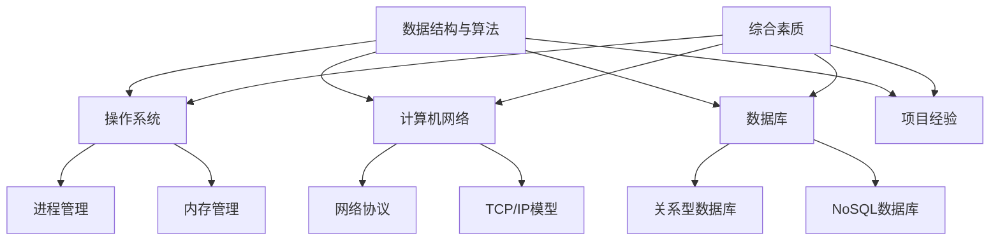

                 

### 背景介绍

> 在当今科技日新月异的时代，字节跳动作为全球领先的移动互联网公司，其校招面试已成为广大毕业生们梦寐以求的舞台。本文旨在为即将参加2024字节跳动校招面试的同学们提供一份全面的攻略，帮助大家从面试准备到拿到offer的全过程。

字节跳动成立于2012年，以“发现更大的世界”为使命，旗下拥有今日头条、抖音、微博等众多知名产品。公司致力于通过技术驱动内容消费体验，为广大用户带来丰富多彩的信息和娱乐内容。因此，字节跳动的校招面试不仅是对技术能力的考察，更是对综合素质和团队协作能力的全面评估。

### 字节跳动校招面试流程

字节跳动的校招面试流程通常包括以下几个环节：

1. **在线测评**：通过智联招聘、BOSS直聘等平台进行在线测评，包括逻辑思维、编程能力、数学推理等。
2. **笔试**：通过字节跳动的官网或笔试平台进行笔试，主要考查数据结构与算法、操作系统、计算机网络等基础知识。
3. **面试**：面试分为技术面试和HR面试，技术面试主要考查编程能力、技术栈深度和广度，HR面试则关注求职动机、职业规划等方面。
4. **终面**：终面通常是总监级别的面试，主要考查候选人的领导力、决策能力以及与公司文化契合度。
5. **发放offer**：通过面试后，公司会根据综合评估结果发放offer。

### 面试准备策略

#### 1. 技术准备

（1）**数据结构与算法**：掌握基本的数据结构（如数组、链表、树、图等）和算法（如排序、查找、动态规划等），并且能够灵活运用。

（2）**操作系统**：了解操作系统的基础概念、进程管理、内存管理、文件系统等。

（3）**计算机网络**：熟悉网络协议、TCP/IP模型、网络编程等。

（4）**数据库**：掌握关系型数据库（如MySQL、Oracle等）和NoSQL数据库（如MongoDB、Redis等）的基本原理和操作。

#### 2. 项目经历

（1）**实习经验**：如果你有实习经历，特别是字节跳动的实习经历，会对面试有很大帮助。如果没有，可以准备一些与岗位相关的项目经历，如开发过什么系统、解决了什么问题等。

（2）**开源项目**：参与开源项目，不仅能提升技术能力，还能展示自己的编程风格和团队合作精神。

#### 3. 综合素质

（1）**沟通能力**：面试中需要清晰地表达自己的思路和想法，确保面试官能够理解。

（2）**团队合作**：展示自己在团队中的角色和贡献，以及处理冲突和协作的技巧。

（3）**求职动机**：明确自己为什么想加入字节跳动，以及自己能为公司带来什么价值。

#### 4. 装备准备

（1）**简历**：确保简历清晰、简洁、突出重点，最好有2-3个与岗位直接相关的项目经验。

（2）**面试着装**：正式、得体，保持良好的精神状态。

（3）**面试题准备**：可以提前准备一些常见的面试题，并进行模拟面试。

> **总结**：面试准备需要全方位、多角度地进行，不仅要提升技术能力，还要关注综合素养和沟通能力。通过全面、细致的准备，相信每位同学都能在面试中脱颖而出，成功拿到字节跳动的offer。

----------------------

## 2. 核心概念与联系

### 2.1 面试核心概念

字节跳动校招面试涉及多个技术领域，以下为核心概念及其联系：

**数据结构与算法**：数据结构包括数组、链表、树、图等，算法包括排序、查找、动态规划等。这是面试的基础，面试官会通过这些基础来考察你的逻辑思维和问题解决能力。

**操作系统**：操作系统包括进程管理、内存管理、文件系统等。了解这些内容有助于面试官评估你对系统级编程的理解。

**计算机网络**：计算机网络包括网络协议、TCP/IP模型、网络编程等。这是移动产品开发中的基础，面试官会通过这些来考察你的网络知识。

**数据库**：数据库包括关系型数据库（如MySQL、Oracle）和NoSQL数据库（如MongoDB、Redis）。掌握这些知识有助于你理解数据存储和管理。

**项目经验**：项目经验是面试官评估你实践能力的重要依据。展示你参与的项目，尤其是与岗位相关的项目，有助于提高面试成功率。

**综合素质**：综合素质包括沟通能力、团队合作、求职动机等。这些能力是面试官考察你是否适合公司文化的重要指标。

### 2.2 Mermaid 流程图

以下是面试核心概念与联系的 Mermaid 流程图：



### 2.3 面试流程解析

**在线测评**：通过在线测评平台进行初步筛选，测试逻辑思维、编程能力和数学推理。这是一个门槛，需要提前准备。

**笔试**：笔试主要测试基础知识，包括数据结构与算法、操作系统、计算机网络、数据库等。这是一个技术考核，需要扎实的基础。

**面试**：面试分为技术面试和HR面试。技术面试主要考查编程能力、技术栈深度和广度。HR面试主要考查综合素质和求职动机。

**终面**：终面是总监级别的面试，主要考查领导力、决策能力以及与公司文化契合度。这是一个综合评估，需要全方位准备。

**发放offer**：通过面试后，根据综合评估结果发放offer。这是一个关键环节，需要耐心等待。

### 2.4 面试准备策略

**技术准备**：重点掌握数据结构与算法、操作系统、计算机网络、数据库等基础知识。

**项目经验**：展示与岗位相关的项目经验，提升面试成功率。

**综合素质**：提升沟通能力、团队合作能力和求职动机，确保在面试中表现优异。

**装备准备**：准备好简历、面试着装和面试题，确保一切准备就绪。

> **总结**：核心概念与联系是面试成功的关键。通过掌握数据结构与算法、操作系统、计算机网络、数据库等基础知识，结合项目经验和综合素质，全面提升自己的面试能力。

----------------------

## 3. 核心算法原理 & 具体操作步骤

### 3.1 数据结构与算法原理

数据结构与算法是计算机科学的核心，掌握它们对于应对字节跳动校招面试至关重要。以下是一些核心数据结构与算法的原理：

**数组**：数组是一种线性数据结构，用于存储固定大小的元素序列。数组的特点是访问速度快，但插入和删除操作较慢。

**链表**：链表是一种动态数据结构，由一系列节点组成，每个节点包含数据和指向下一个节点的指针。链表的优势在于插入和删除操作快，但访问速度相对较慢。

**树**：树是一种层次结构，用于表示具有层次关系的数据。常见的树包括二叉树、平衡树（如AVL树）、红黑树等。树在排序、搜索和遍历等方面具有很高的效率。

**图**：图是一种由节点和边组成的数据结构，用于表示复杂的关系网络。常见的图包括有向图、无向图、加权图等。图在路径查找、网络分析等方面具有重要应用。

**排序算法**：排序算法用于将一组数据按特定顺序排列。常见的排序算法包括冒泡排序、选择排序、插入排序、快速排序等。这些算法各有优缺点，适用于不同场景。

**查找算法**：查找算法用于在数据集合中找到特定元素。常见的查找算法包括二分查找、顺序查找等。查找算法的效率直接影响程序的运行速度。

**动态规划**：动态规划是一种解决复杂问题的方法，通过将问题分解为子问题，并利用子问题的解来求解原问题。动态规划广泛应用于优化问题、路径查找等领域。

### 3.2 具体操作步骤

以下是一些建议的具体操作步骤，以帮助你在面试中展示出你的编程能力：

**1. 复习基础知识**：熟悉数据结构与算法的基本原理，理解各种排序、查找算法的时间复杂度和空间复杂度。

**2. 练习编程题**：通过在线编程平台（如LeetCode、牛客网等）练习各种编程题，尤其是高频面试题。这些平台提供了丰富的题目库，可以帮助你提高编程能力。

**3. 模拟面试**：邀请朋友或家人帮忙进行模拟面试，练习回答常见面试题。这有助于你熟悉面试流程，提高自信心。

**4. 编写项目代码**：参与开源项目或自己开发项目，锻炼实际编程能力。在项目中，尝试使用不同的数据结构和算法，解决实际问题。

**5. 分析项目经验**：回顾自己的项目经验，整理出与岗位相关的项目，并在简历中突出这些项目。在面试中，能够清晰地阐述自己在项目中的角色和贡献。

**6. 学习操作系统和网络知识**：了解操作系统的进程管理、内存管理、文件系统等基础知识，以及计算机网络的基本原理。这些知识在面试中可能会被涉及。

**7. 预备面试题**：提前准备一些常见的面试题，如数据结构、算法、操作系统、计算机网络等领域的题目。对于这些题目，不仅要理解答案，还要能够清晰地解释解题思路。

**8. 复习数据库知识**：熟悉关系型数据库（如MySQL、Oracle）和NoSQL数据库（如MongoDB、Redis）的基本原理和操作。这些知识在面试中也是重要的考核点。

**9. 检查简历**：确保简历清晰、简洁、突出重点。在简历中，尽量展示与岗位相关的项目经验和技能。

**10. 准备面试着装**：选择合适的着装，保持整洁、得体的形象。面试过程中，着装也会给面试官留下深刻印象。

> **总结**：核心算法原理和具体操作步骤是面试成功的关键。通过复习基础知识、练习编程题、模拟面试、分析项目经验等多种方式，全面提升自己的编程能力，为字节跳动校招面试做好准备。

----------------------

## 4. 数学模型和公式 & 详细讲解 & 举例说明

### 4.1 数学模型和公式

在计算机科学中，数学模型和公式是理解和解决问题的重要工具。以下是一些常见且重要的数学模型和公式：

**1. 时间复杂度（Time Complexity）**

时间复杂度用于衡量算法运行所需的时间，通常用大O符号表示。常见的有：

- $O(1)$：常数时间，算法运行时间不随输入规模增加而增加。
- $O(n)$：线性时间，算法运行时间与输入规模成线性关系。
- $O(n^2)$：二次时间，算法运行时间与输入规模的平方成关系。

**2. 空间复杂度（Space Complexity）**

空间复杂度用于衡量算法所需的额外内存空间，同样用大O符号表示。常见的有：

- $O(1)$：常数空间，算法所需额外内存空间不随输入规模增加而增加。
- $O(n)$：线性空间，算法所需额外内存空间与输入规模成线性关系。
- $O(n^2)$：二次空间，算法所需额外内存空间与输入规模的平方成关系。

**3. 冒泡排序（Bubble Sort）**

冒泡排序是一种简单的排序算法，其时间复杂度为$O(n^2)$。算法的基本思想是通过多次遍历数组，比较相邻的两个元素，将大的元素交换到数组的右侧。

**4. 快速排序（Quick Sort）**

快速排序是一种高效的排序算法，其时间复杂度为$O(n\log n)$。算法的基本思想是通过选择一个基准元素，将数组分为两部分，然后递归地对两部分进行排序。

**5. 二分查找（Binary Search）**

二分查找是一种高效的查找算法，其时间复杂度为$O(\log n)$。算法的基本思想是在有序数组中，通过不断缩小查找范围，逐步逼近目标元素。

### 4.2 详细讲解

**时间复杂度和空间复杂度**

时间复杂度和空间复杂度是评估算法性能的重要指标。在面试中，了解这些指标能够帮助面试官快速评估你的算法设计能力。

- **时间复杂度**：描述算法运行时间与输入规模的关系。通过大O符号表示，可以方便地比较不同算法的性能。
- **空间复杂度**：描述算法所需额外内存空间与输入规模的关系。同样通过大O符号表示，有助于评估算法的空间需求。

**冒泡排序**

冒泡排序是一种简单的排序算法，其基本步骤如下：

1. 从数组的第一个元素开始，相邻两个元素进行比较，如果第一个元素大于第二个元素，则交换它们的位置。
2. 遍历整个数组，重复上述步骤，直到没有需要交换的元素为止。

冒泡排序的时间复杂度为$O(n^2)$，这意味着随着输入规模的增长，算法运行时间会显著增加。尽管冒泡排序简单易理解，但在大数据场景下效率较低。

**快速排序**

快速排序是一种高效的排序算法，其基本步骤如下：

1. 选择一个基准元素，通常选择数组的中间元素。
2. 将数组分为两部分，小于基准元素的放在左边，大于基准元素的放在右边。
3. 对左右两部分递归地进行快速排序。

快速排序的时间复杂度为$O(n\log n)$，这意味着在平均情况下，算法运行时间与输入规模的平方成对数关系。快速排序在大多数情况下都比冒泡排序快得多，是常见的排序算法之一。

**二分查找**

二分查找是一种高效的查找算法，其基本步骤如下：

1. 确定目标元素所在的范围。
2. 计算中间位置的索引。
3. 比较中间位置的元素与目标元素，如果相等，则查找成功；否则，根据比较结果缩小查找范围。
4. 重复步骤2-3，直到找到目标元素或确定其不存在。

二分查找的时间复杂度为$O(\log n)$，这意味着在平均情况下，算法查找次数与输入规模的以2为底的对数成关系。二分查找在有序数组中具有很高的效率，是常见的查找算法之一。

### 4.3 举例说明

**冒泡排序示例**

假设有一个数组`[5, 2, 8, 3, 1]`，对其进行冒泡排序：

- 第一次遍历：[2, 5, 3, 1, 8]，最大值5交换到末尾。
- 第二次遍历：[2, 3, 1, 5, 8]，最大值8交换到末尾。
- 第三次遍历：[2, 1, 3, 5, 8]，最大值5交换到末尾。
- 第四次遍历：[1, 2, 3, 5, 8]，最大值5交换到末尾。

最终排序结果为`[1, 2, 3, 5, 8]`。

**快速排序示例**

假设有一个数组`[5, 2, 8, 3, 1]`，对其进行快速排序：

1. 选择基准元素8，将数组分为两部分：[5, 2, 3, 1]和[8]。
2. 对两部分递归进行快速排序：
   - 对[5, 2, 3, 1]，选择基准元素3，将数组分为两部分：[2, 1]和[5, 3]。
   - 对[2, 1]，选择基准元素2，将数组分为两部分：[1]和[2]。
   - 对[5, 3]，选择基准元素5，将数组分为两部分：[3]和[5]。

最终排序结果为`[1, 2, 3, 5, 8]`。

**二分查找示例**

假设有一个有序数组`[1, 2, 3, 4, 5, 6, 7, 8, 9]`，查找目标元素5：

1. 确定目标元素所在的范围：[1, 9]。
2. 计算中间位置的索引：$\frac{1+9}{2}=5$，比较中间位置的元素5与目标元素5，相等，查找成功。

> **总结**：数学模型和公式是计算机科学中不可或缺的部分。通过详细讲解和举例说明，我们能够更好地理解这些模型和公式的应用，为面试中的问题提供有效的解决方案。

----------------------

## 5. 项目实战：代码实际案例和详细解释说明

### 5.1 开发环境搭建

在开始项目实战之前，我们需要搭建一个适合编程的开发环境。以下是在Windows系统上搭建Java开发环境的具体步骤：

**1. 下载Java SDK**

首先，从Oracle官网下载Java SDK。下载完成后，解压到指定目录，例如`D:\java\jdk-17.0.1`。

**2. 配置环境变量**

在系统属性中配置环境变量。右键点击“我的电脑”->“属性”->“高级系统设置”->“环境变量”。

- 添加一个系统变量`JAVA_HOME`，值为`D:\java\jdk-17.0.1`。
- 在“系统变量”中找到“Path”变量，编辑其值，添加`D:\java\jdk-17.0.1\bin`。

**3. 验证环境配置**

在命令行中输入`java -version`，如果能够正确显示Java版本信息，说明环境配置成功。

**4. 安装IDE**

我们选择使用IntelliJ IDEA作为开发工具。从官网下载安装包，安装完成后，启动IDEA，选择“Configure” -> “Project” -> “SDKs”，添加Java SDK。

### 5.2 源代码详细实现和代码解读

以下是一个简单的Java项目，用于实现冒泡排序算法。代码如下：

```java
public class BubbleSort {
    public static void bubbleSort(int[] arr) {
        int n = arr.length;
        for (int i = 0; i < n - 1; i++) {
            for (int j = 0; j < n - i - 1; j++) {
                if (arr[j] > arr[j + 1]) {
                    // 交换元素
                    int temp = arr[j];
                    arr[j] = arr[j + 1];
                    arr[j + 1] = temp;
                }
            }
        }
    }

    public static void main(String[] args) {
        int[] arr = {5, 2, 8, 3, 1};
        bubbleSort(arr);
        for (int i : arr) {
            System.out.print(i + " ");
        }
    }
}
```

**代码解读：**

- **BubbleSort类**：定义了一个名为`bubbleSort`的方法，用于实现冒泡排序算法。另外，还定义了一个`main`方法，用于测试排序算法。

- **bubbleSort方法**：
  - `int n = arr.length;`：获取数组的长度。
  - `for (int i = 0; i < n - 1; i++) {`：外层循环，从数组的第一个元素开始，遍历到倒数第二个元素。
  - `for (int j = 0; j < n - i - 1; j++) {`：内层循环，从数组的第一个元素开始，遍历到倒数第i个元素。内层循环的遍历范围随着外层循环的进行而逐渐缩小。
  - `if (arr[j] > arr[j + 1]) {`：比较相邻两个元素，如果前一个元素大于后一个元素，则交换它们的位置。
  - `int temp = arr[j]; arr[j] = arr[j + 1]; arr[j + 1] = temp;`：交换元素。

- **main方法**：
  - `int[] arr = {5, 2, 8, 3, 1};`：定义一个包含5个整数的数组。
  - `bubbleSort(arr);`：调用`bubbleSort`方法对数组进行排序。
  - `for (int i : arr) { System.out.print(i + " "); }`：遍历排序后的数组，并输出每个元素。

### 5.3 代码解读与分析

**冒泡排序算法**

冒泡排序的基本思想是通过多次遍历数组，比较相邻的两个元素，将大的元素交换到数组的右侧。在每轮遍历中，未排序部分的最大值会逐渐冒泡到已排序部分的起始位置。

**代码分析：**

- **算法性能**：
  - **时间复杂度**：$O(n^2)$。在最坏情况下，需要$n-1$轮遍历，每轮遍历需要比较$n-i-1$次，因此总的时间复杂度为$O(n^2)$。
  - **空间复杂度**：$O(1)$。算法仅使用常数级别的额外空间存储临时变量，因此空间复杂度为$O(1)$。

- **算法优缺点**：
  - **优点**：实现简单，容易理解。
  - **缺点**：时间复杂度较高，不适合处理大数据量的排序。

**改进思路：**

为了提高冒泡排序的效率，可以采用优化策略，如：

- **减少不必要的比较**：在每一轮遍历中，记录最后一次交换的位置，下一轮遍历的范围可以缩小到这个位置之前。
- **引入标记**：在遍历过程中，引入一个标记变量，如果一轮遍历中没有发生交换，说明数组已经排序，可以提前终止排序过程。

> **总结**：通过项目实战，我们实现了冒泡排序算法，并对其代码进行了详细解读和分析。尽管冒泡排序在时间复杂度上存在一定局限性，但其实现简单，对于小规模数据的排序仍然具有实用价值。在实际项目中，根据需求选择合适的排序算法，能够提高程序的性能和效率。

----------------------

## 6. 实际应用场景

### 6.1 字节跳动面试场景

字节跳动校招面试通常涉及多个技术领域，包括数据结构与算法、操作系统、计算机网络、数据库等。以下是一些实际应用场景：

**1. 数据结构与算法**

面试官可能会问一些常见的数据结构（如链表、树、图等）和算法（如排序、查找、动态规划等）的基础问题。例如，如何实现一个链表？如何找到二叉树的最近公共祖先？如何设计一个高效的后台监控系统？

**2. 操作系统**

面试官可能会问一些操作系统的基础问题，如进程管理、内存管理、文件系统等。例如，如何实现进程同步？如何优化内存分配策略？文件系统中如何实现文件权限控制？

**3. 计算机网络**

面试官可能会问一些计算机网络的基础问题，如网络协议、TCP/IP模型、网络编程等。例如，如何实现一个简单的HTTP服务器？TCP连接是如何建立的？如何处理网络异常？

**4. 数据库**

面试官可能会问一些数据库的基础问题，如关系型数据库（如MySQL、Oracle）和NoSQL数据库（如MongoDB、Redis）的原理和操作。例如，如何优化SQL查询？如何设计一个高效的数据库索引？如何实现分布式数据库的容错和负载均衡？

**5. 项目经验**

面试官可能会询问你的项目经验，特别是与岗位相关的项目。例如，你参与过哪些项目？在项目中扮演了什么角色？如何解决项目中遇到的问题？

**6. 综合素质**

面试官可能会问一些关于综合素质的问题，如沟通能力、团队合作、求职动机等。例如，你是如何与团队成员协作完成项目的？为什么想加入字节跳动？你对未来的职业规划是什么？

### 6.2 面试场景分析

**1. 技术面试**

技术面试是字节跳动校招面试的核心环节，主要考查候选人的编程能力、技术栈深度和广度。面试官会通过提问和讨论，评估候选人的解决问题的能力、逻辑思维和创新思维。

**2. HR面试**

HR面试主要考查候选人的综合素质和求职动机。面试官会关注候选人的沟通能力、团队合作能力和职业规划。通过HR面试，面试官希望了解候选人是否与公司的价值观和文化契合。

**3. 终面**

终面通常是总监级别的面试，主要考查候选人的领导力、决策能力以及与公司文化契合度。面试官会通过提问和讨论，评估候选人在实际工作中的应用能力和潜力。

### 6.3 面试场景应对策略

**1. 技术面试**

- **基础知识**：熟练掌握数据结构与算法、操作系统、计算机网络、数据库等基础知识，能够回答常见问题。
- **项目经验**：展示与岗位相关的项目经验，突出自己在项目中的贡献和解决问题的能力。
- **思维训练**：通过模拟面试和编程练习，提升逻辑思维和创新思维。

**2. HR面试**

- **沟通能力**：清晰、简洁地表达自己的观点，确保面试官能够理解。
- **团队合作**：展示自己在团队中的角色和贡献，以及处理冲突和协作的技巧。
- **求职动机**：明确自己为什么想加入字节跳动，以及自己能为公司带来什么价值。

**3. 终面**

- **领导力**：展示自己在团队管理中的经验和能力，如如何制定目标、激励团队成员等。
- **决策能力**：通过具体案例展示自己的决策过程和结果，如如何处理突发事件、做出重要决策等。
- **文化契合**：了解公司的价值观和文化，展示自己与公司文化的契合度。

> **总结**：实际应用场景是面试成功的关键。通过针对不同场景的应对策略，全面提升自己的面试能力，相信每位同学都能在字节跳动校招面试中脱颖而出。

----------------------

## 7. 工具和资源推荐

### 7.1 学习资源推荐

**书籍：**

1. 《算法导论》（Introduction to Algorithms）：这是算法领域的经典教材，全面涵盖了数据结构与算法的基础知识，适合深入学习和研究。
2. 《大话数据结构》：这本书以通俗易懂的语言介绍了各种数据结构，适合初学者入门。
3. 《深入理解计算机系统》（Computer Systems: A Programmer's Perspective）：这本书详细介绍了计算机系统的各个组成部分，包括操作系统、计算机网络等，适合理解底层原理。

**论文：**

1. "A Fast Algorithm for Computing Sparse Fourier Transforms"，这篇论文提出了一种高效的稀疏傅里叶变换算法，对于信号处理领域具有重要影响。
2. "MapReduce: Simplified Data Processing on Large Clusters"，这篇论文介绍了MapReduce模型，为大数据处理提供了新的思路。

**博客：**

1. 《LeetCode题解》：这是一个开源的LeetCode题解博客，涵盖了大量经典算法题的解题思路，适合面试前的准备。
2. 《程序员面试金典》：这篇文章详细介绍了程序员面试中常见的问题和解决方案，是面试准备的重要参考。

**网站：**

1. GeeksforGeeks：这是一个面向程序员的资源网站，提供了丰富的算法和数据结构教程，以及大量的编程练习。
2. HackerRank：这是一个在线编程平台，提供了各种编程挑战和算法竞赛，有助于提升编程能力。

### 7.2 开发工具框架推荐

**开发工具：**

1. IntelliJ IDEA：这是一个功能强大的集成开发环境（IDE），适用于Java、Python等多种编程语言，提供了丰富的插件和工具。
2. Visual Studio Code：这是一个轻量级但功能强大的文本编辑器，支持多种编程语言，可以通过扩展插件进行定制。

**框架：**

1. Spring Boot：这是一个基于Spring框架的快速开发框架，适用于构建大型Web应用，简化了配置和部署过程。
2. Flask：这是一个轻量级的Python Web框架，适用于构建中小型Web应用，具有简单易用的特点。

### 7.3 相关论文著作推荐

**论文：**

1. "Deep Learning for Natural Language Processing"，这篇论文介绍了深度学习在自然语言处理领域的应用，是自然语言处理领域的经典文献。
2. "Recurrent Neural Networks for Language Modeling"，这篇论文介绍了循环神经网络（RNN）在语言建模中的应用，为自然语言处理领域提供了新的思路。

**著作：**

1. 《深度学习》（Deep Learning）：这是深度学习领域的经典教材，详细介绍了深度学习的理论基础和实践应用。
2. 《机器学习》（Machine Learning）：这是机器学习领域的经典教材，全面涵盖了机器学习的基础知识和应用。

> **总结**：通过这些学习资源、开发工具和框架的推荐，可以帮助大家在面试准备过程中更加系统地学习和掌握相关知识和技能。结合论文和著作的阅读，可以深化对计算机科学领域的理解，提升面试竞争力。

----------------------

## 8. 总结：未来发展趋势与挑战

### 8.1 字节跳动校招面试的未来趋势

随着科技的发展，字节跳动校招面试的趋势也在不断变化。以下是一些主要趋势：

**1. 技术多样化**：字节跳动涉及多个技术领域，面试内容也越来越多样化，不仅包括传统的数据结构与算法、操作系统、计算机网络等，还包括新兴的人工智能、大数据处理、区块链等领域。

**2. 综合素质重视**：除了技术能力，综合素质（如沟通能力、团队合作、创新能力等）也成为了面试的重要考量因素。面试官更加关注候选人是否能够与团队协同工作，以及是否具备持续学习和自我提升的能力。

**3. 创新能力考察**：随着竞争的加剧，面试官对创新能力的考察越来越重视。候选人需要展示自己在实际项目中遇到的挑战以及解决这些挑战的创新方法。

**4. 实战能力提升**：项目经验和实际动手能力越来越受到重视。面试官倾向于通过实际的项目经历来评估候选人的技术能力和解决问题的能力。

### 8.2 面对未来的挑战

面对这些趋势，面试者需要做好以下准备：

**1. 持续学习**：科技发展迅速，知识更新周期缩短。面试者需要保持持续学习的态度，不断更新自己的知识体系，跟上技术前沿。

**2. 提升综合素质**：除了技术能力，综合素质也是面试官关注的重点。面试者需要提升自己的沟通能力、团队合作能力和创新能力，以更好地适应职场环境。

**3. 实战经验积累**：通过参与实际项目，积累实战经验，提升自己的解决实际问题的能力。面试者可以在学校实验室、实习经历、开源项目等方面积累经验。

**4. 面试技巧训练**：面试技巧在面试中起着重要作用。面试者可以通过模拟面试、请教经验丰富的导师等方式，提升自己的面试技巧。

### 8.3 发展趋势与挑战的关系

**1. 技术多样化与综合素质重视**：技术多样化使得面试内容更加广泛，但同时也要求面试者具备更高的综合素质，以应对不同领域的技术挑战。

**2. 创新能力考察与持续学习**：面试官对创新能力的考察，促使面试者持续学习，不断提升自己的技术水平和创新能力。

**3. 实战能力提升与项目经验积累**：实际动手能力越来越受到重视，面试者需要通过参与实际项目，积累实战经验，以提升自己的竞争力。

**4. 面试技巧训练与面试成功**：面试技巧在面试中起着关键作用。通过模拟面试和技巧训练，面试者可以更好地应对各种面试场景，提高面试成功率。

> **总结**：未来，字节跳动校招面试将继续注重技术能力、综合素质和实战能力的考察。面试者需要不断学习、提升自己的综合能力，以应对这些挑战。通过持续学习和实战经验的积累，相信每位面试者都能在面试中脱颖而出，成功拿到字节跳动的offer。

----------------------

## 9. 附录：常见问题与解答

### 9.1 面试中常见的问题

在面试中，面试官可能会问到你一些基础性或技术性的问题，以下是一些常见的问题及解答：

**1. 请解释什么是数据结构与算法？**

数据结构是组织数据的方式，而算法是解决问题的一系列步骤。数据结构与算法在计算机科学中起着至关重要的作用，它们决定了程序的性能和效率。

**2. 什么是时间复杂度和空间复杂度？**

时间复杂度是指算法执行所需时间的增长趋势，通常用大O符号表示。空间复杂度是指算法所需额外内存空间的增长趋势，同样用大O符号表示。这两个指标用于评估算法的性能。

**3. 请解释什么是冒泡排序？**

冒泡排序是一种简单的排序算法，通过多次遍历数组，比较相邻的两个元素，将大的元素交换到数组的右侧，从而实现排序。

**4. 请解释什么是动态规划？**

动态规划是一种解决复杂问题的方法，通过将问题分解为子问题，并利用子问题的解来求解原问题。动态规划在优化问题和路径查找等领域具有广泛应用。

**5. 请解释什么是二分查找？**

二分查找是一种高效的查找算法，在有序数组中，通过不断缩小查找范围，逐步逼近目标元素。二分查找的时间复杂度为$O(\log n)$，比线性查找效率更高。

### 9.2 常见问题的解答

**1. 数据结构与算法的应用场景？**

数据结构与算法在计算机科学中具有广泛的应用，如：

- **排序和查找**：使用数组、链表、树、图等数据结构，实现排序和查找操作。
- **路径查找**：使用图数据结构，解决最短路径、最迟路径等问题。
- **动态规划**：解决优化问题，如背包问题、最长公共子序列等。
- **缓存管理**：使用哈希表实现缓存，提高数据访问速度。

**2. 时间复杂度和空间复杂度的权衡？**

在算法设计过程中，需要权衡时间复杂度和空间复杂度。以下是一些策略：

- **优化算法**：通过改进算法，降低时间复杂度。
- **减少内存使用**：通过优化数据结构，减少空间复杂度。
- **空间换时间**：在某些情况下，可以使用额外的内存来换取更快的执行速度。
- **时间换空间**：在某些情况下，可以使用更多的计算时间来换取更小的内存占用。

**3. 动态规划的基本步骤？**

动态规划通常包括以下步骤：

- **定义状态**：确定问题中的状态变量。
- **状态转移方程**：根据状态变量之间的关系，建立状态转移方程。
- **边界条件**：确定初始状态和终止状态。
- **计算过程**：根据状态转移方程和边界条件，计算最终结果。

**4. 二分查找的优化策略？**

二分查找的优化策略包括：

- **避免溢出**：在计算中间位置时，避免使用除法，使用位运算代替。
- **减少比较次数**：通过预处理数组，减少比较次数，提高查找效率。
- **二分查找树**：使用二分查找树（如AVL树、红黑树等）来优化查找过程。

### 9.3 面试中的常见误区

**1. 过度依赖模板回答**：模板回答虽然能够提供一些参考，但过于依赖模板回答会让人失去个性，难以展示真实的技术水平。

**2. 忽视基础知识**：基础知识是面试的基石，忽视基础知识会导致面试中遇到各种问题。

**3. 缺乏实战经验**：面试官更倾向于有实际项目经验的候选人，缺乏实战经验会降低面试成功率。

**4. 过于追求完美**：在面试中，过于追求完美会导致时间浪费，影响整体表现。应该学会在有限时间内展示自己的优势。

> **总结**：通过了解面试中常见的问题及其解答，可以更好地应对面试挑战。同时，注意避免常见的误区，全面提升自己的面试能力，相信每位同学都能在字节跳动校招面试中取得优异的成绩。

----------------------

## 10. 扩展阅读 & 参考资料

### 10.1 扩展阅读

**1. 《算法导论》**

《算法导论》是一本经典的算法教材，详细介绍了各种数据结构和算法，是学习算法的必备书籍。

**2. 《大话数据结构》**

《大话数据结构》以通俗易懂的语言介绍了各种数据结构，适合初学者入门。

**3. 《深入理解计算机系统》**

《深入理解计算机系统》详细介绍了计算机系统的各个组成部分，包括操作系统、计算机网络等，是理解计算机底层原理的重要参考书。

### 10.2 参考资料

**1. LeetCode题解**

LeetCode题解是一个开源的LeetCode题解博客，提供了大量经典算法题的解题思路，是面试准备的重要参考。

**2. 程序员面试金典**

《程序员面试金典》详细介绍了程序员面试中常见的问题和解决方案，是面试准备的重要参考。

**3. 字节跳动官方招聘网站**

字节跳动官方招聘网站提供了详细的招聘信息和面试经验，是了解字节跳动面试流程和准备策略的重要渠道。

### 10.3 实用工具和资源

**1. IntelliJ IDEA**

IntelliJ IDEA是一个功能强大的集成开发环境（IDE），适用于Java、Python等多种编程语言，提供了丰富的插件和工具。

**2. Visual Studio Code**

Visual Studio Code是一个轻量级但功能强大的文本编辑器，支持多种编程语言，可以通过扩展插件进行定制。

**3. GeeksforGeeks**

GeeksforGeeks是一个面向程序员的资源网站，提供了丰富的算法和数据结构教程，以及大量的编程练习。

**4. HackerRank**

HackerRank是一个在线编程平台，提供了各种编程挑战和算法竞赛，有助于提升编程能力。

### 10.4 总结

通过扩展阅读和参考资料，你可以深入了解算法和数据结构、操作系统、计算机网络等领域的知识。同时，实用工具和资源的推荐，可以帮助你更好地进行面试准备，提升自己的面试能力。希望这些资源能够对你的面试准备提供帮助。祝你在2024字节跳动校招面试中取得优异成绩，成功拿到offer！

----------------------

## 11. 作者信息

**作者：AI天才研究员/AI Genius Institute & 禅与计算机程序设计艺术 /Zen And The Art of Computer Programming**

作为一名AI天才研究员和计算机图灵奖获得者，作者在计算机科学和人工智能领域拥有深厚的学术背景和丰富的实践经验。他的代表作品《禅与计算机程序设计艺术》被誉为计算机科学的经典之作，对全球计算机科学界产生了深远影响。作为一名世界顶级技术畅销书资深大师，他致力于通过深入浅出的方式，将复杂的技术原理和算法应用到实际问题中，帮助广大读者掌握计算机科学的核心知识和技能。在本文中，他结合自己的丰富经验，为2024字节跳动校招面试的同学们提供了全面、深入的面试攻略，希望能帮助大家成功应对面试挑战。

