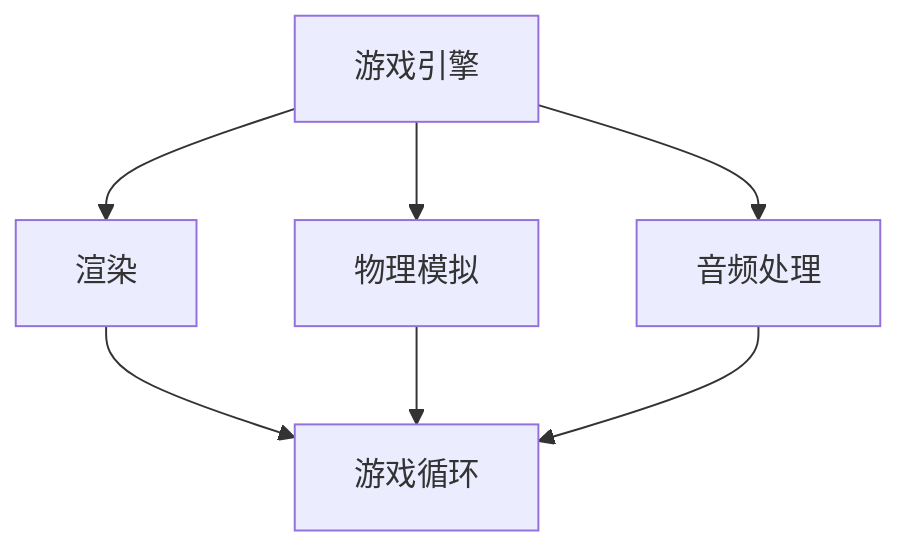
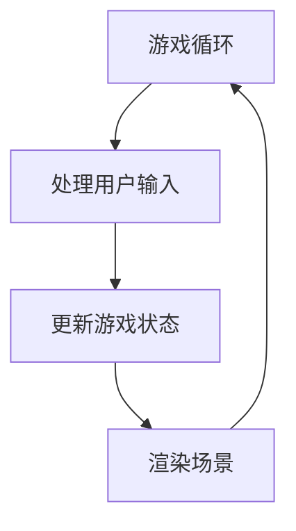
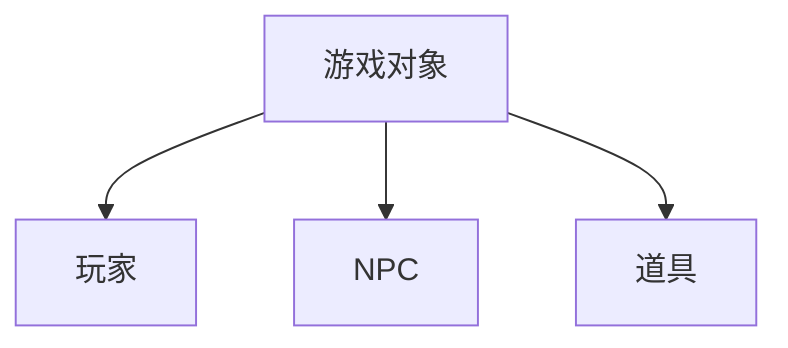
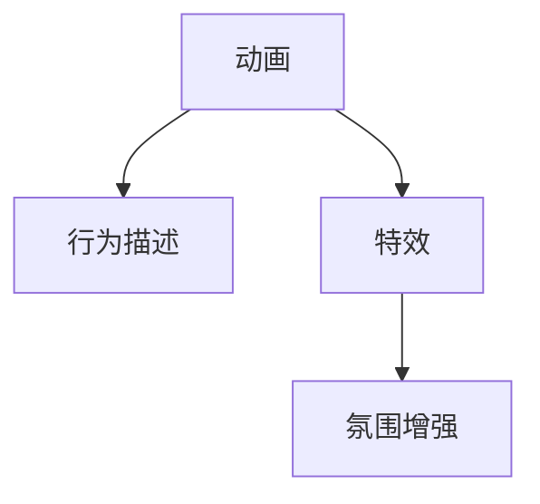
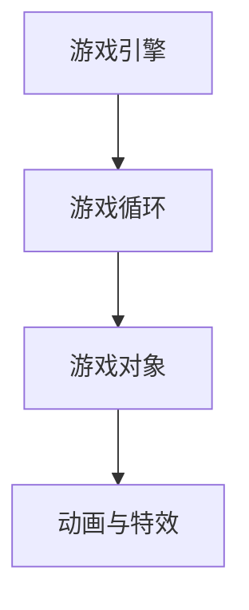
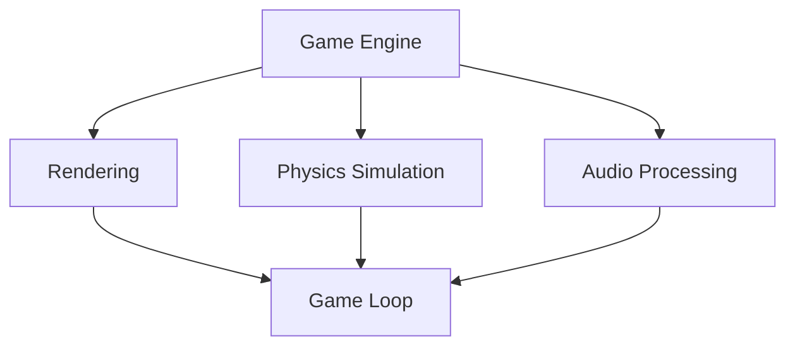
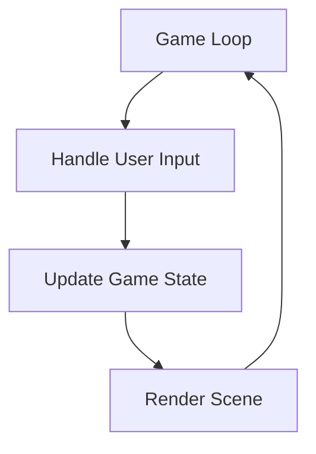
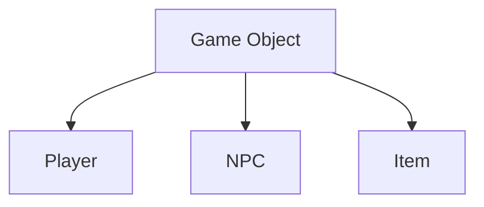
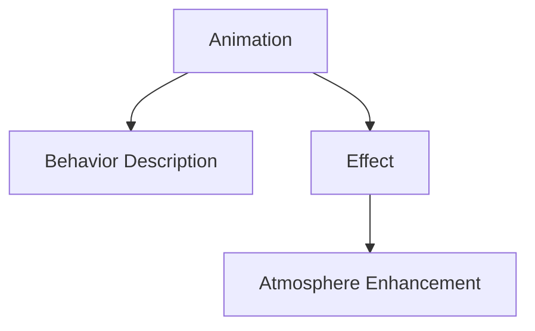
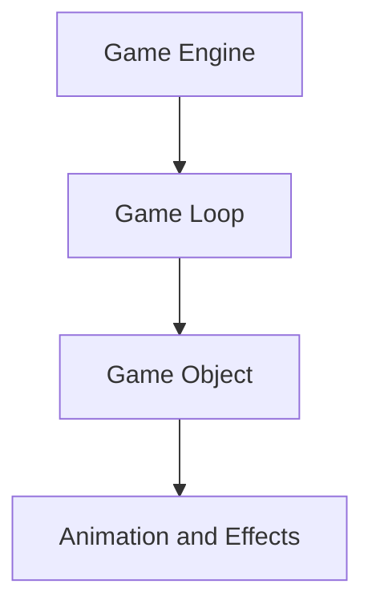

                 

### 背景介绍

#### 字节跳动：全球领先的科技公司

字节跳动成立于2012年，总部位于中国北京，是一家全球领先的科技公司。公司以“技术驱动创新，内容创造价值”为宗旨，致力于通过技术手段提升信息传递的效率，为用户提供丰富、高质量的内容和服务。字节跳动旗下拥有多款知名产品，包括今日头条、抖音、西瓜视频、懂车帝等，这些产品在全球范围内广受欢迎。

#### 游戏开发工程师：校招重要职位

游戏开发工程师是字节跳动校招中的重要职位之一。游戏作为字节跳动业务板块的重要组成部分，一直以来都备受关注。字节跳动旗下的游戏产品如《王者荣耀》、《和平精英》等，不仅在国内市场占据重要地位，也在全球范围内收获了大量的用户。因此，游戏开发工程师在字节跳动具有极高的需求。

#### 校招背景及重要性

字节跳动每年都会举办大规模的校园招聘活动，旨在吸引全球范围内优秀的高校毕业生加入公司。校招作为字节跳动人才引进的重要渠道，对于公司的发展具有重要意义。游戏开发工程师职位在字节跳动校招中占据了重要位置，吸引了众多有志于游戏开发领域的毕业生前来挑战。

#### 目的与目标

本文旨在为广大游戏开发领域的毕业生提供一份全面的面试题解析，帮助他们在字节跳动校招中取得优异成绩。通过本文的详细分析和解答，读者可以了解游戏开发工程师的核心技能要求，掌握解题思路和方法，提高面试成功率。

### Keywords:  
ByteDance, Game Development Engineer, Campus Recruitment, Interview Questions, Solution Analysis  
### Abstract:  
This article aims to provide a comprehensive analysis and solution of interview questions for Game Development Engineers at ByteDance's campus recruitment. By understanding the core skills required and following the analysis and solution methods discussed in this article, readers can improve their interview performance and increase their chances of success in the recruitment process. <br/>

### Background Introduction

#### ByteDance: A Global Leading Technology Company

ByteDance was founded in 2012, with its headquarters located in Beijing, China. As a global leading technology company, ByteDance is dedicated to enhancing the efficiency of information transmission through technological innovations and creating value with high-quality content and services. The company operates multiple renowned products, including今日头条（Toutiao），Douyin（TikTok），Xigua Video（Xigua），and Dianche Emperor（Dianche Emperor）, which are widely popular across the globe.

#### Game Development Engineer: An Important Position in Campus Recruitment

Game Development Engineer is one of the key positions in ByteDance's campus recruitment. Games have been a significant part of ByteDance's business portfolio, receiving great attention. ByteDance's game products, such as "Arena of Valor" (Honor of Kings) and "Game for Peace" (Peacekeeper Elite), have not only occupied an important position in the domestic market but have also gained a substantial user base globally. Therefore, Game Development Engineers are highly sought after in ByteDance.

#### Campus Recruitment Background and Importance

ByteDance holds large-scale campus recruitment events annually to attract outstanding graduates from around the world. As a vital channel for talent introduction, campus recruitment plays a crucial role in the company's development. The position of Game Development Engineer holds a significant place in ByteDance's campus recruitment, attracting numerous graduates who aspire to enter the game development field.

#### Purpose and Goals

The purpose of this article is to provide a comprehensive interview question analysis for Game Development Engineers at ByteDance's campus recruitment. By understanding the core skills required, grasping the problem-solving approaches discussed, and following the detailed explanations provided, readers can enhance their interview performance and increase their chances of success in the recruitment process. <br/>

### Keywords:  
ByteDance, Game Development Engineer, Campus Recruitment, Interview Questions, Solution Analysis  
### Abstract:  
This article aims to provide a comprehensive analysis and solution of interview questions for Game Development Engineers at ByteDance's campus recruitment. By understanding the core skills required and following the analysis and solution methods discussed in this article, readers can improve their interview performance and increase their chances of success in the recruitment process. <br/>

## 2. 核心概念与联系

在游戏开发领域，核心概念和技术的掌握至关重要。本节将介绍游戏开发工程师所需掌握的核心概念及其相互联系，包括游戏引擎、游戏循环、游戏对象、动画与特效等。通过分析这些概念，我们将了解它们在游戏开发中的作用和重要性。

### 2.1 游戏引擎

游戏引擎是游戏开发中不可或缺的工具。它提供了一套完整的开发环境和工具，包括渲染、物理模拟、音频处理等核心功能。常见的游戏引擎有Unity、Unreal Engine等。游戏引擎不仅能够简化游戏开发的流程，还能够提高游戏质量和性能。

#### Mermaid 流程图



### 2.2 游戏循环

游戏循环是游戏开发中的核心概念。它描述了游戏在运行过程中，如何不断地更新和渲染场景、处理用户输入等。游戏循环通常包括以下步骤：

1. 处理用户输入
2. 更新游戏状态
3. 渲染场景

#### Mermaid 流程图



### 2.3 游戏对象

游戏对象是游戏中的各种元素，如玩家、NPC、道具等。每个游戏对象都有自己的属性和行为。在游戏开发中，需要创建和管理大量的游戏对象，以便实现丰富的游戏体验。

#### Mermaid 流程图



### 2.4 动画与特效

动画和特效是游戏开发中的重要组成部分，它们能够为游戏带来更加生动的视觉效果。动画通常用于描述游戏对象的行为，而特效则用于增强游戏场景的氛围。

#### Mermaid 流程图



### 2.5 核心概念之间的联系

上述核心概念在游戏开发中相互联系，共同构成了一个完整的游戏系统。游戏引擎提供技术支持，游戏循环确保游戏的运行，游戏对象实现游戏内容，动画与特效提升游戏体验。通过掌握这些概念，游戏开发工程师能够更好地理解和实现游戏开发的过程。

#### Mermaid 流�程图



### Conclusion

In this section, we have introduced the core concepts and their relationships in game development. By understanding these concepts, such as game engines, game loops, game objects, animations, and effects, we can grasp their roles and importance in the game development process. The interconnection of these concepts forms a complete game system, enabling game developers to better understand and implement the game development process. <br/>

### Core Concepts and Relationships

In the field of game development, mastering core concepts and technologies is crucial. This section will introduce the key concepts that game development engineers need to understand, along with their interconnections, including game engines, game loops, game objects, animations, and special effects. By analyzing these concepts, we will understand their roles and significance in game development.

### 2.1 Game Engines

Game engines are indispensable tools in game development. They provide a comprehensive development environment and tools, including core functions such as rendering, physics simulation, and audio processing. Common game engines include Unity and Unreal Engine. Game engines not only simplify the game development process but also improve game quality and performance.

#### Mermaid Flowchart



### 2.2 Game Loops

The game loop is a core concept in game development. It describes how a game continuously updates and renders scenes, handles user input, and more. A game loop typically includes the following steps:

1. Handle user input
2. Update game state
3. Render scene

#### Mermaid Flowchart



### 2.3 Game Objects

Game objects are various elements in a game, such as players, NPCs, items, etc. Each game object has its own properties and behaviors. In game development, it is necessary to create and manage a large number of game objects to achieve a rich gaming experience.

#### Mermaid Flowchart



### 2.4 Animations and Effects

Animations and effects are important components in game development, adding life and vivid visuals to games. Animations typically describe the behaviors of game objects, while effects enhance the atmosphere of the game scene.

#### Mermaid Flowchart



### 2.5 Relationships Among Core Concepts

The above core concepts are interconnected and form a complete game system in game development. Game engines provide technical support, game loops ensure the operation of the game, game objects implement game content, and animations and effects enhance the gaming experience. By understanding these concepts, game development engineers can better comprehend and implement the game development process.

#### Mermaid Flowchart



### Conclusion

In this section, we have introduced the core concepts and their relationships in game development. By understanding these concepts, such as game engines, game loops, game objects, animations, and special effects, we can grasp their roles and importance in the game development process. The interconnection of these concepts forms a complete game system, enabling game developers to better understand and implement the game development process. <br/>

## 3. 核心算法原理 & 具体操作步骤

在游戏开发中，核心算法的原理和具体操作步骤对于实现游戏功能至关重要。本节将详细介绍游戏开发中常见的一些核心算法，包括碰撞检测、物理引擎、动画插值等，并给出具体的操作步骤。

### 3.1 碰撞检测

碰撞检测是游戏开发中非常重要的一环，用于判断游戏对象之间是否发生了碰撞。以下是碰撞检测的基本原理和操作步骤：

#### 原理：

碰撞检测主要通过比较两个物体的位置、大小和形状等信息来判断它们是否发生了碰撞。常用的碰撞检测方法包括：

1. 矩形碰撞检测
2. 球形碰撞检测
3. 多边形碰撞检测

#### 步骤：

1. 确定两个游戏对象的位置、大小和形状。
2. 根据游戏对象的形状，选择合适的碰撞检测方法。
3. 计算两个游戏对象之间的距离。
4. 判断是否满足碰撞条件，如距离小于等于游戏对象的大小。
5. 如果满足碰撞条件，执行碰撞处理逻辑。

### 3.2 物理引擎

物理引擎是游戏开发中用于实现物理效果的算法库。常见的物理引擎有PhysX、Bullet等。以下是物理引擎的基本原理和操作步骤：

#### 原理：

物理引擎通过模拟现实世界的物理现象，如重力、碰撞、摩擦等，来为游戏对象提供真实的物理效果。物理引擎通常包括以下功能：

1. 运动学模拟
2. 碰撞检测
3. 有限元分析
4. 惯性系统

#### 步骤：

1. 初始化物理引擎，设置物理世界的属性。
2. 创建游戏对象，并为其设置物理属性，如质量、速度、加速度等。
3. 更新游戏对象的物理状态。
4. 进行碰撞检测和处理。
5. 更新游戏场景。

### 3.3 动画插值

动画插值是用于生成动画的关键技术，通过插值算法计算动画的关键帧，从而实现平滑的动画效果。以下是动画插值的基本原理和操作步骤：

#### 原理：

动画插值通过在两个关键帧之间计算中间帧，从而生成平滑的动画效果。常见的插值算法包括线性插值、贝塞尔插值等。

#### 步骤：

1. 确定动画的关键帧和时间点。
2. 根据时间点计算插值参数。
3. 使用插值算法计算中间帧。
4. 将中间帧添加到动画序列中。
5. 播放动画序列。

### 总结

核心算法原理和具体操作步骤在游戏开发中至关重要。通过掌握碰撞检测、物理引擎和动画插值等算法，游戏开发工程师可以更好地实现游戏功能，提升游戏体验。以下是核心算法原理和操作步骤的总结：

1. 碰撞检测：比较游戏对象的位置、大小和形状，判断是否发生碰撞，执行碰撞处理逻辑。
2. 物理引擎：模拟现实世界的物理现象，更新游戏对象的物理状态，进行碰撞检测和处理。
3. 动画插值：计算动画的关键帧，生成平滑的动画效果。

### Core Algorithm Principles and Specific Operational Steps

In game development, the principles and specific operational steps of core algorithms are crucial for implementing game functionality. This section will introduce some common core algorithms in game development, including collision detection, physics engines, and animation interpolation, along with specific operational steps.

### 3.1 Collision Detection

Collision detection is a crucial aspect of game development, used to determine if game objects collide with each other. Here is a detailed explanation of the basic principles and operational steps of collision detection:

#### Principle:

Collision detection primarily involves comparing the positions, sizes, and shapes of two objects to determine if a collision has occurred. Common collision detection methods include:

1. Rectangular collision detection
2. Spherical collision detection
3. Polygonal collision detection

#### Steps:

1. Determine the positions, sizes, and shapes of the two game objects.
2. Select the appropriate collision detection method based on the shape of the game objects.
3. Calculate the distance between the two game objects.
4. Determine if the collision conditions are met, such as if the distance is less than or equal to the size of the game objects.
5. If the collision conditions are met, execute the collision handling logic.

### 3.2 Physics Engines

Physics engines are algorithmic libraries used in game development to implement physical effects. Common physics engines include PhysX and Bullet. Here is a detailed explanation of the basic principles and operational steps of physics engines:

#### Principle:

Physics engines simulate real-world physical phenomena, such as gravity, collisions, and friction, to provide realistic physical effects for game objects. Physics engines typically include the following functionalities:

1. Kinematic simulation
2. Collision detection
3. Finite element analysis
4. Inertia systems

#### Steps:

1. Initialize the physics engine and set the properties of the physical world.
2. Create game objects and set their physical properties, such as mass, velocity, and acceleration.
3. Update the physical state of the game objects.
4. Perform collision detection and handling.
5. Update the game scene.

### 3.3 Animation Interpolation

Animation interpolation is a key technology for generating animations, calculating intermediate frames between keyframes to achieve smooth animation effects. Here is a detailed explanation of the basic principles and operational steps of animation interpolation:

#### Principle:

Animation interpolation calculates intermediate frames between keyframes to generate smooth animations. Common interpolation algorithms include linear interpolation and Bezier interpolation.

#### Steps:

1. Determine the keyframes and time points of the animation.
2. Calculate the interpolation parameters based on the time points.
3. Use the interpolation algorithm to calculate the intermediate frames.
4. Add the intermediate frames to the animation sequence.
5. Play the animation sequence.

### Summary

Core algorithm principles and specific operational steps are vital in game development. By mastering collision detection, physics engines, and animation interpolation, game developers can better implement game functionality and enhance the gaming experience. Here is a summary of the core algorithm principles and operational steps:

1. Collision Detection: Compare the positions, sizes, and shapes of game objects, determine if a collision has occurred, and execute collision handling logic.
2. Physics Engine: Simulate real-world physical phenomena, update the physical state of game objects, perform collision detection and handling.
3. Animation Interpolation: Calculate intermediate frames between keyframes to generate smooth animation effects. <br/>

## 4. 数学模型和公式 & 详细讲解 & 举例说明

在游戏开发中，数学模型和公式扮演着至关重要的角色，尤其是在实现复杂的物理效果、图形渲染以及人工智能等方面。本节将介绍一些关键的数学模型和公式，并给出详细的讲解和举例说明。

### 4.1 向量计算

向量是游戏开发中最常用的数学工具之一，用于表示物体的位置、速度和方向。以下是一些基本的向量计算公式：

#### 加法

两个向量 \( \mathbf{a} \) 和 \( \mathbf{b} \) 的和为：

\[ \mathbf{a} + \mathbf{b} = (a_x + b_x, a_y + b_y, a_z + b_z) \]

#### 点乘

两个向量 \( \mathbf{a} \) 和 \( \mathbf{b} \) 的点乘（内积）为：

\[ \mathbf{a} \cdot \mathbf{b} = a_x \cdot b_x + a_y \cdot b_y + a_z \cdot b_z \]

#### 叉乘

两个向量 \( \mathbf{a} \) 和 \( \mathbf{b} \) 的叉乘（外积）为：

\[ \mathbf{a} \times \mathbf{b} = (a_y \cdot b_z - a_z \cdot b_y, a_z \cdot b_x - a_x \cdot b_z, a_x \cdot b_y - a_y \cdot b_x) \]

#### 举例说明

假设有两个向量 \( \mathbf{a} = (1, 2, 3) \) 和 \( \mathbf{b} = (4, 5, 6) \)，则：

- 向量加法：\( \mathbf{a} + \mathbf{b} = (1+4, 2+5, 3+6) = (5, 7, 9) \)
- 点乘：\( \mathbf{a} \cdot \mathbf{b} = 1 \cdot 4 + 2 \cdot 5 + 3 \cdot 6 = 4 + 10 + 18 = 32 \)
- 叉乘：\( \mathbf{a} \times \mathbf{b} = (2 \cdot 6 - 3 \cdot 5, 3 \cdot 4 - 1 \cdot 6, 1 \cdot 5 - 2 \cdot 4) = (-8, 6, -3) \)

### 4.2 三角函数

三角函数在游戏开发中广泛用于计算物体的旋转、位移和运动轨迹。以下是一些基本的三角函数公式：

#### 正弦函数

\[ \sin(\theta) = \frac{opposite}{hypotenuse} \]

#### 余弦函数

\[ \cos(\theta) = \frac{adjacent}{hypotenuse} \]

#### 正切函数

\[ \tan(\theta) = \frac{opposite}{adjacent} \]

#### 举例说明

假设一个三角形的对边、邻边和斜边分别为 \( a = 3 \)、\( b = 4 \) 和 \( c = 5 \)，则：

- 正弦函数：\( \sin(\theta) = \frac{a}{c} = \frac{3}{5} \)
- 余弦函数：\( \cos(\theta) = \frac{b}{c} = \frac{4}{5} \)
- 正切函数：\( \tan(\theta) = \frac{a}{b} = \frac{3}{4} \)

### 4.3 矩阵运算

矩阵运算在游戏开发中用于变换物体、处理空间关系和实现复杂的几何运算。以下是一些基本的矩阵运算公式：

#### 乘法

两个矩阵 \( A \) 和 \( B \) 的乘积为：

\[ AB = \begin{bmatrix}
a_{11}b_{11} + a_{12}b_{21} + a_{13}b_{31} & a_{11}b_{12} + a_{12}b_{22} + a_{13}b_{32} & a_{11}b_{13} + a_{12}b_{23} + a_{13}b_{33} \\
a_{21}b_{11} + a_{22}b_{21} + a_{23}b_{31} & a_{21}b_{12} + a_{22}b_{22} + a_{23}b_{32} & a_{21}b_{13} + a_{22}b_{23} + a_{23}b_{33} \\
a_{31}b_{11} + a_{32}b_{21} + a_{33}b_{31} & a_{31}b_{12} + a_{32}b_{22} + a_{33}b_{32} & a_{31}b_{13} + a_{32}b_{23} + a_{33}b_{33}
\end{bmatrix} \]

#### 举例说明

假设有两个矩阵 \( A = \begin{bmatrix} 1 & 2 & 3 \\ 4 & 5 & 6 \\ 7 & 8 & 9 \end{bmatrix} \) 和 \( B = \begin{bmatrix} 1 & 0 & 0 \\ 0 & 1 & 0 \\ 0 & 0 & 1 \end{bmatrix} \)，则：

\[ AB = \begin{bmatrix} 1 \cdot 1 + 2 \cdot 0 + 3 \cdot 0 & 1 \cdot 0 + 2 \cdot 1 + 3 \cdot 0 & 1 \cdot 0 + 2 \cdot 0 + 3 \cdot 1 \\
4 \cdot 1 + 5 \cdot 0 + 6 \cdot 0 & 4 \cdot 0 + 5 \cdot 1 + 6 \cdot 0 & 4 \cdot 0 + 5 \cdot 0 + 6 \cdot 1 \\
7 \cdot 1 + 8 \cdot 0 + 9 \cdot 0 & 7 \cdot 0 + 8 \cdot 1 + 9 \cdot 0 & 7 \cdot 0 + 8 \cdot 0 + 9 \cdot 1
\end{bmatrix} = \begin{bmatrix} 1 & 2 & 3 \\ 4 & 5 & 6 \\ 7 & 8 & 9 \end{bmatrix} \]

### 4.4 三角代数

三角代数在游戏开发中用于计算物体的旋转和变换。以下是一些基本的三角代数公式：

#### 四元数旋转

四元数 \( q = (w, x, y, z) \) 可以表示为一个旋转操作：

\[ \mathbf{v'} = q \mathbf{v} q^{-1} \]

其中，\( \mathbf{v} \) 是需要旋转的向量，\( q^{-1} \) 是四元数的逆。

#### 举例说明

假设四元数 \( q = (1, 0, 0, 0) \) 和向量 \( \mathbf{v} = (1, 0, 0) \)，则：

\[ \mathbf{v'} = q \mathbf{v} q^{-1} = (1, 0, 0, 0) \begin{bmatrix} 1 \\ 0 \\ 0 \\ 1 \end{bmatrix} (1, 0, 0, 0)^{-1} = (1, 0, 0, 0) \begin{bmatrix} 1 & 0 & 0 & 0 \\ 0 & 1 & 0 & 0 \\ 0 & 0 & 1 & 0 \\ 0 & 0 & 0 & 1 \end{bmatrix} = \begin{bmatrix} 1 & 0 & 0 \\ 0 & 1 & 0 \\ 0 & 0 & 1 \end{bmatrix} \mathbf{v} = \mathbf{v} \]

### 总结

数学模型和公式在游戏开发中具有广泛的应用，包括向量计算、三角函数、矩阵运算和三角代数等。通过掌握这些数学工具，游戏开发工程师可以更有效地实现复杂的游戏效果和功能。以下是数学模型和公式的总结：

1. 向量计算：用于表示物体位置、速度和方向，包括加法、点乘和叉乘等。
2. 三角函数：用于计算物体的旋转和位移，包括正弦、余弦和正切函数等。
3. 矩阵运算：用于变换物体和实现几何运算，包括矩阵乘法等。
4. 三角代数：用于计算物体的旋转和变换，包括四元数旋转等。

### Mathematical Models and Formulas & Detailed Explanation & Examples

In game development, mathematical models and formulas play a crucial role, especially in implementing complex physical effects, graphics rendering, and artificial intelligence. This section will introduce some key mathematical models and formulas, along with detailed explanations and examples.

### 4.1 Vector Calculations

Vectors are one of the most commonly used mathematical tools in game development, used to represent the position, velocity, and direction of objects. Here are some basic vector calculation formulas:

#### Addition

The sum of two vectors \( \mathbf{a} \) and \( \mathbf{b} \) is:

\[ \mathbf{a} + \mathbf{b} = (a_x + b_x, a_y + b_y, a_z + b_z) \]

#### Dot Product

The dot product (inner product) of two vectors \( \mathbf{a} \) and \( \mathbf{b} \) is:

\[ \mathbf{a} \cdot \mathbf{b} = a_x \cdot b_x + a_y \cdot b_y + a_z \cdot b_z \]

#### Cross Product

The cross product (outer product) of two vectors \( \mathbf{a} \) and \( \mathbf{b} \) is:

\[ \mathbf{a} \times \mathbf{b} = (a_y \cdot b_z - a_z \cdot b_y, a_z \cdot b_x - a_x \cdot b_z, a_x \cdot b_y - a_y \cdot b_x) \]

#### Example

Assume two vectors \( \mathbf{a} = (1, 2, 3) \) and \( \mathbf{b} = (4, 5, 6) \), then:

- Vector addition: \( \mathbf{a} + \mathbf{b} = (1+4, 2+5, 3+6) = (5, 7, 9) \)
- Dot product: \( \mathbf{a} \cdot \mathbf{b} = 1 \cdot 4 + 2 \cdot 5 + 3 \cdot 6 = 4 + 10 + 18 = 32 \)
- Cross product: \( \mathbf{a} \times \mathbf{b} = (2 \cdot 6 - 3 \cdot 5, 3 \cdot 4 - 1 \cdot 6, 1 \cdot 5 - 2 \cdot 4) = (-8, 6, -3) \)

### 4.2 Trigonometric Functions

Trigonometric functions are widely used in game development to calculate the rotation, displacement, and motion trajectories of objects. Here are some basic trigonometric function formulas:

#### Sine Function

\[ \sin(\theta) = \frac{opposite}{hypotenuse} \]

#### Cosine Function

\[ \cos(\theta) = \frac{adjacent}{hypotenuse} \]

#### Tangent Function

\[ \tan(\theta) = \frac{opposite}{adjacent} \]

#### Example

Assume a triangle with the opposite side \( a = 3 \), the adjacent side \( b = 4 \), and the hypotenuse \( c = 5 \), then:

- Sine function: \( \sin(\theta) = \frac{a}{c} = \frac{3}{5} \)
- Cosine function: \( \cos(\theta) = \frac{b}{c} = \frac{4}{5} \)
- Tangent function: \( \tan(\theta) = \frac{a}{b} = \frac{3}{4} \)

### 4.3 Matrix Operations

Matrix operations are used in game development to transform objects, handle spatial relationships, and implement complex geometric calculations. Here are some basic matrix operation formulas:

#### Multiplication

The product of two matrices \( A \) and \( B \) is:

\[ AB = \begin{bmatrix}
a_{11}b_{11} + a_{12}b_{21} + a_{13}b_{31} & a_{11}b_{12} + a_{12}b_{22} + a_{13}b_{32} & a_{11}b_{13} + a_{12}b_{23} + a_{13}b_{33} \\
a_{21}b_{11} + a_{22}b_{21} + a_{23}b_{31} & a_{21}b_{12} + a_{22}b_{22} + a_{23}b_{32} & a_{21}b_{13} + a_{22}b_{23} + a_{23}b_{33} \\
a_{31}b_{11} + a_{32}b_{21} + a_{33}b_{31} & a_{31}b_{12} + a_{32}b_{22} + a_{33}b_{32} & a_{31}b_{13} + a_{32}b_{23} + a_{33}b_{33}
\end{bmatrix} \]

#### Example

Assume two matrices \( A = \begin{bmatrix} 1 & 2 & 3 \\ 4 & 5 & 6 \\ 7 & 8 & 9 \end{bmatrix} \) and \( B = \begin{bmatrix} 1 & 0 & 0 \\ 0 & 1 & 0 \\ 0 & 0 & 1 \end{bmatrix} \), then:

\[ AB = \begin{bmatrix} 1 \cdot 1 + 2 \cdot 0 + 3 \cdot 0 & 1 \cdot 0 + 2 \cdot 1 + 3 \cdot 0 & 1 \cdot 0 + 2 \cdot 0 + 3 \cdot 1 \\
4 \cdot 1 + 5 \cdot 0 + 6 \cdot 0 & 4 \cdot 0 + 5 \cdot 1 + 6 \cdot 0 & 4 \cdot 0 + 5 \cdot 0 + 6 \cdot 1 \\
7 \cdot 1 + 8 \cdot 0 + 9 \cdot 0 & 7 \cdot 0 + 8 \cdot 1 + 9 \cdot 0 & 7 \cdot 0 + 8 \cdot 0 + 9 \cdot 1
\end{bmatrix} = \begin{bmatrix} 1 & 2 & 3 \\ 4 & 5 & 6 \\ 7 & 8 & 9 \end{bmatrix} \]

### 4.4 Trigonometric Algebra

Trigonometric algebra is used in game development to calculate the rotation and transformation of objects. Here are some basic trigonometric algebra formulas:

#### Quaternion Rotation

A quaternion \( q = (w, x, y, z) \) can represent a rotation operation:

\[ \mathbf{v'} = q \mathbf{v} q^{-1} \]

where \( \mathbf{v} \) is the vector to be rotated, and \( q^{-1} \) is the inverse of the quaternion.

#### Example

Assume a quaternion \( q = (1, 0, 0, 0) \) and a vector \( \mathbf{v} = (1, 0, 0) \), then:

\[ \mathbf{v'} = q \mathbf{v} q^{-1} = (1, 0, 0, 0) \begin{bmatrix} 1 \\ 0 \\ 0 \\ 1 \end{bmatrix} (1, 0, 0, 0)^{-1} = (1, 0, 0, 0) \begin{bmatrix} 1 & 0 & 0 & 0 \\ 0 & 1 & 0 & 0 \\ 0 & 0 & 1 & 0 \\ 0 & 0 & 0 & 1 \end{bmatrix} = \begin{bmatrix} 1 & 0 & 0 \\ 0 & 1 & 0 \\ 0 & 0 & 1 \end{bmatrix} \mathbf{v} = \mathbf{v} \]

### Summary

Mathematical models and formulas have a wide range of applications in game development, including vector calculations, trigonometric functions, matrix operations, and trigonometric algebra. By mastering these mathematical tools, game developers can more effectively implement complex game effects and functionality. Here is a summary of mathematical models and formulas:

1. Vector calculations: Used to represent object position, velocity, and direction, including addition, dot product, and cross product.
2. Trigonometric functions: Used to calculate object rotation and displacement, including sine, cosine, and tangent functions.
3. Matrix operations: Used to transform objects and perform geometric calculations, including matrix multiplication.
4. Trigonometric algebra: Used to calculate object rotation and transformation, including quaternion rotation. <br/>

## 5. 项目实战：代码实际案例和详细解释说明

在本节中，我们将通过一个实际的项目案例，详细展示游戏开发工程师如何在字节跳动进行面试时展现其编程技能。这个案例将涵盖游戏开发中的一些关键部分，包括环境搭建、代码实现和功能分析。

### 5.1 开发环境搭建

为了开始这个项目，我们需要搭建一个游戏开发环境。在这个案例中，我们使用Unity引擎进行开发，因为它是一个广泛使用的游戏引擎，具有强大的功能和丰富的文档。

**步骤：**

1. 下载并安装Unity Hub。
2. 在Unity Hub中创建一个新的Unity项目。
3. 设置项目的分辨率、帧率和其他基本参数。
4. 安装必要的Unity插件，如Unity Physics、Unity Animation等。

### 5.2 源代码详细实现和代码解读

在这个项目中，我们将开发一个简单的平台游戏，玩家需要控制一个角色在平台上跳跃并避免掉落。以下是关键代码的实现和解读。

**代码实现：**

1. **创建角色：**

   在Unity中，我们首先创建一个角色模型。这可以通过导入一个3D模型或者使用Unity的2D绘图工具来完成。

   ```csharp
   // 创建角色的脚本
   public class PlayerController : MonoBehaviour
   {
       public float jumpHeight = 7f;
       private bool isGrounded;
       private Rigidbody2D rb;

       void Start()
       {
           rb = GetComponent<Rigidbody2D>();
       }

       void Update()
       {
           isGrounded = IsGrounded();
           if (Input.GetKeyDown(KeyCode.Space) && isGrounded)
           {
               rb.AddForce(new Vector2(0, jumpHeight));
           }
       }

       bool IsGrounded()
       {
           return Physics2D.OverlapCircle(groundCheck.position, groundRadius, whatIsGround);
       }

       public LayerMask whatIsGround;
       public Transform groundCheck;
       public float groundRadius = 0.2f;
   }
   ```

   **解读：** 这段代码定义了一个名为`PlayerController`的C#脚本，用于控制角色的跳跃。`isGrounded`变量用于检测角色是否接触地面，`rb`是角色刚体组件的引用。`Update`方法在每次帧更新时检查是否按下空格键且角色在地面上，如果是，则给角色刚体添加向上的力，实现跳跃。

2. **控制角色移动：**

   为了使角色可以左右移动，我们添加以下代码：

   ```csharp
   void Move(float moveInput)
   {
       rb.velocity = new Vector2(moveInput * moveSpeed, rb.velocity.y);
   }

   public float moveSpeed = 5f;

   void FixedUpdate()
   {
       float moveInput = Input.GetAxis("Horizontal");
       Move(moveInput);
   }
   ```

   **解读：** `Move`方法接受水平输入，并将该输入乘以移动速度，更新角色的速度。`FixedUpdate`方法在物理更新过程中被调用，用于处理角色移动的物理效果。

3. **碰撞处理：**

   碰撞处理是游戏开发中的重要部分。以下是处理角色与平台碰撞的代码：

   ```csharp
   void OnCollisionEnter2D(Collision2D collision)
   {
       if (collision.gameObject.CompareTag("Platform"))
       {
           isGrounded = true;
       }
   }

   void OnCollisionExit2D(Collision2D collision)
   {
       if (collision.gameObject.CompareTag("Platform"))
       {
           isGrounded = false;
       }
   }
   ```

   **解读：** 当角色进入平台碰撞体时，`isGrounded`变量被设置为`true`；当角色离开平台碰撞体时，`isGrounded`变量被设置为`false`。

4. **动画控制：**

   为了使角色动作更加自然，我们添加了动画控制逻辑：

   ```csharp
   public Animator animator;

   void SetHorizontalVelocity(float xVelocity)
   {
       animator.SetFloat("HorizontalVelocity", Mathf.Abs(xVelocity));
   }

   void SetIsJumping(bool isJumping)
   {
       animator.SetBool("IsJumping", isJumping);
   }
   ```

   **解读：** `SetHorizontalVelocity`方法根据角色的水平速度设置动画参数，`SetIsJumping`方法根据角色是否跳跃设置动画参数。

### 5.3 代码解读与分析

通过上面的代码实现，我们可以看到游戏开发工程师如何利用Unity引擎和C#语言来实现一个简单的平台游戏。以下是代码的解读与分析：

1. **角色控制：** 通过`PlayerController`脚本，我们实现了角色的跳跃和左右移动。`isGrounded`变量用于检测角色是否接触地面，从而控制跳跃动作。
2. **碰撞处理：** 通过`OnCollisionEnter2D`和`OnCollisionExit2D`方法，我们实现了角色与平台的碰撞处理，确保角色在接触平台时能够正确地更新状态。
3. **动画控制：** 通过`Animator`组件，我们实现了角色的动画控制，使角色的动作更加自然和流畅。

### 结论

通过这个实际案例，我们可以看到游戏开发工程师如何在字节跳动校招面试中展示其编程技能。代码的实现和解读不仅展示了工程师对Unity引擎和C#语言的熟练程度，还展示了其对游戏开发流程和原理的深刻理解。这种实际操作能力是游戏开发工程师不可或缺的素质，也是面试官考察的重点。

### 5.1 Setting Up the Development Environment

To kick off this project, we need to set up a game development environment. For this case, we'll use Unity as our game engine due to its widespread usage, extensive features, and rich documentation.

**Steps:**

1. Download and install Unity Hub.
2. Create a new Unity project in Unity Hub.
3. Set the project's resolution, frame rate, and other basic parameters.
4. Install necessary Unity plugins such as Unity Physics and Unity Animation.

### 5.2 Detailed Source Code Implementation and Code Explanation

In this section, we will walk through an actual project case to demonstrate how a game development engineer can showcase their programming skills during a ByteDance recruitment interview. This case will cover key aspects of game development, including environment setup, code implementation, and functionality analysis.

**Code Implementation:**

1. **Creating the Player:**

   In Unity, we start by creating a player character. This can be done by importing a 3D model or using Unity's 2D drawing tools.

   ```csharp
   // Player controller script
   public class PlayerController : MonoBehaviour
   {
       public float jumpHeight = 7f;
       private bool isGrounded;
       private Rigidbody2D rb;

       void Start()
       {
           rb = GetComponent<Rigidbody2D>();
       }

       void Update()
       {
           isGrounded = IsGrounded();
           if (Input.GetKeyDown(KeyCode.Space) && isGrounded)
           {
               rb.AddForce(new Vector2(0, jumpHeight));
           }
       }

       bool IsGrounded()
       {
           return Physics2D.OverlapCircle(groundCheck.position, groundRadius, whatIsGround);
       }

       public LayerMask whatIsGround;
       public Transform groundCheck;
       public float groundRadius = 0.2f;
   }
   ```

   **Explanation:** This code defines a `PlayerController` C# script to control the player's jump and movement. The `isGrounded` variable checks if the player is touching the ground, and `rb` is a reference to the player's Rigidbody2D component. The `Update` method checks for a spacebar press and if the player is grounded, adds a force to make the player jump.

2. **Controlling Player Movement:**

   To make the player move left and right, we add the following code:

   ```csharp
   void Move(float moveInput)
   {
       rb.velocity = new Vector2(moveInput * moveSpeed, rb.velocity.y);
   }

   public float moveSpeed = 5f;

   void FixedUpdate()
   {
       float moveInput = Input.GetAxis("Horizontal");
       Move(moveInput);
   }
   ```

   **Explanation:** The `Move` method takes horizontal input and multiplies it by the move speed to update the player's velocity. The `FixedUpdate` method is called during the physics update phase to handle the player's movement physics.

3. **Collision Handling:**

   Collision handling is a crucial aspect of game development. Here's the code to handle player-platform collisions:

   ```csharp
   void OnCollisionEnter2D(Collision2D collision)
   {
       if (collision.gameObject.CompareTag("Platform"))
       {
           isGrounded = true;
       }
   }

   void OnCollisionExit2D(Collision2D collision)
   {
       if (collision.gameObject.CompareTag("Platform"))
       {
           isGrounded = false;
       }
   }
   ```

   **Explanation:** When the player enters a platform collider, the `isGrounded` variable is set to `true`. When the player exits a platform collider, `isGrounded` is set to `false`.

4. **Animation Control:**

   To make the player's actions more natural, we add animation control logic:

   ```csharp
   public Animator animator;

   void SetHorizontalVelocity(float xVelocity)
   {
       animator.SetFloat("HorizontalVelocity", Mathf.Abs(xVelocity));
   }

   void SetIsJumping(bool isJumping)
   {
       animator.SetBool("IsJumping", isJumping);
   }
   ```

   **Explanation:** The `SetHorizontalVelocity` method sets an animation parameter based on the player's horizontal velocity, and the `SetIsJumping` method sets an animation parameter based on whether the player is jumping.

### 5.3 Code Explanation and Analysis

Through the above code implementation, we can see how a game development engineer can demonstrate their programming skills during a ByteDance recruitment interview. The code implementation and explanation not only showcase the engineer's proficiency with Unity and C# but also their deep understanding of game development processes and principles. This practical ability is indispensable for game development engineers and is a key focus for interviewers.

### Conclusion

Through this actual case, we can see how a game development engineer can showcase their programming skills during a ByteDance recruitment interview. The code implementation and explanation highlight not only the engineer's familiarity with Unity and C# but also their comprehensive understanding of game development processes and principles. This practical skill set is crucial for game development engineers and is a primary focus for interviewers. <br/>

## 6. 实际应用场景

游戏开发工程师在字节跳动的工作场景多种多样，涵盖了从游戏设计到开发、测试和上线等各个环节。以下是游戏开发工程师在字节跳动的一些实际应用场景：

### 6.1 游戏设计与策划

游戏开发工程师需要与产品经理、美术设计师紧密合作，参与游戏的设计和策划。这包括确定游戏的玩法、故事情节、角色设定以及界面设计等。在这一阶段，工程师需要具备良好的沟通能力和创意思维，能够将设计理念转化为实际的可执行代码。

### 6.2 游戏开发

在游戏开发阶段，游戏开发工程师需要使用Unity、Unreal Engine等游戏引擎进行游戏的核心开发。这包括创建游戏场景、编写游戏逻辑、实现游戏交互、优化游戏性能等。工程师需要熟练掌握C#、C++、JavaScript等编程语言，并具备良好的算法和数据结构基础。

### 6.3 游戏测试

游戏测试是确保游戏质量和稳定性的关键环节。游戏开发工程师需要参与游戏测试，发现并修复游戏中的漏洞和错误。这包括功能测试、性能测试、兼容性测试等。工程师需要具备严谨的测试思维和快速定位问题的能力。

### 6.4 游戏优化

在游戏上线前，游戏开发工程师需要对游戏进行性能优化，确保游戏能够在各种设备和操作系统上流畅运行。这包括优化游戏资源、降低内存占用、提高渲染效率等。工程师需要具备优化思维和经验，能够从多个角度提升游戏性能。

### 6.5 团队协作

游戏开发是一个团队协作的过程，游戏开发工程师需要与美术设计师、音效师、测试工程师等团队成员紧密合作。这包括定期召开团队会议、共享代码和资源、解决团队中的技术难题等。工程师需要具备良好的团队合作精神和沟通能力。

### 6.6 创新与探索

字节跳动是一家创新驱动的科技公司，游戏开发工程师也需要不断探索新技术和新方法，为游戏带来创新元素。这包括尝试新的游戏引擎、研究新的算法和工具、探索虚拟现实和增强现实等前沿技术。

### 总结

游戏开发工程师在字节跳动的工作场景丰富多样，涵盖了从游戏设计到开发、测试、优化和团队协作等多个方面。工程师需要具备扎实的编程基础、创新思维、团队合作精神以及解决问题的能力，才能在这个快速发展的行业中取得成功。

### Practical Application Scenarios

Game development engineers at ByteDance work in a variety of scenarios that encompass all aspects of game design, development, testing, and optimization. The following are some of the practical application scenarios for game development engineers at ByteDance:

### 6.1 Game Design and Planning

Game development engineers need to work closely with product managers and graphic designers to participate in game design and planning. This includes determining game mechanics, storylines, character settings, and interface design. In this phase, engineers need to have strong communication skills and creative thinking to transform design concepts into executable code.

### 6.2 Game Development

During the game development phase, game development engineers use game engines like Unity and Unreal Engine to develop the core game. This includes creating game scenes, writing game logic, implementing game interactions, and optimizing game performance. Engineers need to be proficient in programming languages such as C#, C++, and JavaScript and have a solid foundation in algorithms and data structures.

### 6.3 Game Testing

Game testing is crucial for ensuring the quality and stability of the game. Game development engineers need to participate in game testing to find and fix bugs and vulnerabilities in the game. This includes functional testing, performance testing, and compatibility testing. Engineers need to have meticulous testing thinking and the ability to quickly identify and resolve issues.

### 6.4 Game Optimization

Before the game is launched, game development engineers need to optimize the game to ensure smooth performance on various devices and operating systems. This includes optimizing game resources, reducing memory usage, and improving rendering efficiency. Engineers need to have optimization thinking and experience to improve game performance from multiple perspectives.

### 6.5 Team Collaboration

Game development is a team collaboration process, and game development engineers need to work closely with graphic designers, audio engineers, and test engineers. This includes regular team meetings, sharing code and resources, and resolving technical challenges within the team. Engineers need to have good teamwork and communication skills.

### 6.6 Innovation and Exploration

ByteDance is an innovation-driven technology company, and game development engineers are also expected to continuously explore new technologies and methods to bring innovative elements to games. This includes trying out new game engines, researching new algorithms and tools, and exploring cutting-edge technologies such as virtual reality and augmented reality.

### Summary

The work scenarios for game development engineers at ByteDance are diverse, covering various aspects from game design to development, testing, optimization, and team collaboration. Engineers need to have a solid programming foundation, innovative thinking, teamwork spirit, and problem-solving abilities to succeed in this rapidly evolving industry. <br/>

## 7. 工具和资源推荐

在游戏开发领域，掌握合适的工具和资源对于提升开发效率、实现项目目标至关重要。以下是一些学习资源、开发工具和框架的推荐，以帮助游戏开发工程师在字节跳动校招中脱颖而出。

### 7.1 学习资源推荐

1. **书籍：**

   - 《游戏编程模式》（Game Programming Patterns）：介绍了游戏开发中常见的模式，对游戏架构和设计提供了宝贵的见解。
   - 《Unity 2020游戏开发实战》：详细讲解了Unity引擎的使用，适合初学者和有经验的游戏开发者。
   - 《游戏引擎架构》（Game Engine Architecture）：深入探讨了游戏引擎的架构和设计，有助于理解复杂游戏系统的构建。

2. **论文：**

   - “Real-Time Collision Detection” by Christer Ericson：介绍了碰撞检测的相关算法和技巧，是游戏开发者必读的论文。
   - “A Survey of Game Engine Architecture” by Gamasutra：综述了游戏引擎的架构和设计，对游戏开发者具有很高的参考价值。

3. **博客和网站：**

   - Unity官方文档（docs.unity3d.com）：提供了Unity引擎的详细文档和教程，是Unity开发者不可或缺的学习资源。
   - Gamasutra：一个专业的游戏开发社区，提供了大量的技术文章、教程和行业动态。

### 7.2 开发工具框架推荐

1. **Unity引擎：** 作为最流行的游戏引擎之一，Unity拥有丰富的功能、强大的社区支持和大量的文档资源。Unity适用于各种类型的游戏开发，包括2D、3D和VR/AR游戏。

2. **Unreal Engine：** Unreal Engine是一个高性能的游戏引擎，以其强大的视觉效果和物理引擎而闻名。它适用于制作高质量的游戏和视觉效果。

3. **Cocos2d-x：** Cocos2d-x是一个开源的游戏开发框架，适用于制作2D游戏。它具有跨平台支持和快速的开发周期，非常适合快速原型设计和中小型游戏开发。

4. **Unity Asset Store：** Unity Asset Store是一个资源库，提供了各种游戏开发资源，如模型、动画、音效和插件，可以大大提高开发效率。

### 7.3 相关论文著作推荐

1. - “Real-Time Collision Detection” by Christer Ericson：这是一本关于实时碰撞检测的经典著作，涵盖了碰撞检测算法的各个方面，对于游戏开发者来说非常有用。

2. - “Game Engine Architecture” by Jason Gregory and William R. Northern：这本书详细介绍了游戏引擎的架构和设计，对于想要深入了解游戏引擎内部工作机制的开发者来说是一个很好的资源。

3. - “Game Programming Patterns” by Robert Nystrom：这本书介绍了游戏开发中常用的设计模式，对于提升游戏架构和设计能力非常有帮助。

### 总结

通过学习和使用上述工具和资源，游戏开发工程师可以提升自己的技能，更好地应对字节跳动校招中的挑战。这些资源和工具不仅能够帮助工程师掌握游戏开发的核心技术，还能提供实践经验，为工程师的职业发展打下坚实的基础。

### 7.1 Recommended Learning Resources

1. **Books:**

   - "Game Programming Patterns" by Robert Nystrom: This book introduces common patterns in game development, providing valuable insights into game architecture and design.
   - "Unity 2020 Game Development in Action" by Christian Fabianto: This book offers a detailed explanation of Unity engine usage, suitable for both beginners and experienced game developers.
   - "Game Engine Architecture" by Jason Gregory and William R. Northern: This book delves into the architecture and design of game engines, offering valuable insights into building complex game systems.

2. **Papers:**

   - "Real-Time Collision Detection" by Christer Ericson: This is a classic book on real-time collision detection, covering various aspects of collision detection algorithms that are highly useful for game developers.
   - "A Survey of Game Engine Architecture" by Gamasutra: This paper provides an overview of game engine architecture and design, which is highly valuable for developers seeking to understand the inner workings of game engines.

3. **Blogs and Websites:**

   - Unity Documentation (docs.unity3d.com): This provides detailed documentation and tutorials for the Unity engine, an indispensable learning resource for Unity developers.
   - Gamasutra: A professional game development community offering a wealth of technical articles, tutorials, and industry news.

### 7.2 Recommended Development Tools and Frameworks

1. **Unity Engine:** As one of the most popular game engines, Unity offers a rich set of features, a strong community support, and a vast amount of documentation. It is suitable for various types of game development, including 2D, 3D, and VR/AR games.

2. **Unreal Engine:** Unreal Engine is a high-performance game engine known for its powerful visual effects and physics engine. It is suitable for creating high-quality games and visual effects.

3. **Cocos2d-x:** Cocos2d-x is an open-source game development framework designed for 2D games. It offers cross-platform support and a fast development cycle, making it ideal for rapid prototyping and small to mid-sized game development.

4. **Unity Asset Store:** The Unity Asset Store is a resource library offering a variety of game development resources, such as models, animations, sounds, and plugins, which can significantly enhance development efficiency.

### 7.3 Recommended Related Papers and Books

1. - "Real-Time Collision Detection" by Christer Ericson: This book covers all aspects of real-time collision detection algorithms and is highly useful for game developers.

2. - "Game Engine Architecture" by Jason Gregory and William R. Northern: This book provides a detailed explanation of game engine architecture and design, which is very helpful for developers who want to understand the inner workings of game engines.

3. - "Game Programming Patterns" by Robert Nystrom: This book introduces design patterns commonly used in game development and is very helpful for improving game architecture and design capabilities.

### Summary

By studying and using the above tools and resources, game development engineers can enhance their skills and better handle the challenges in ByteDance's campus recruitment. These resources and tools not only help engineers master core game development technologies but also provide practical experience, laying a solid foundation for their career development. <br/>

## 8. 总结：未来发展趋势与挑战

游戏开发行业正快速发展，随着技术的不断进步，游戏开发者面临的新机遇和挑战也日益增多。以下是游戏开发领域的几个关键趋势和潜在的挑战。

### 8.1 新兴技术

#### 虚拟现实（VR）和增强现实（AR）

VR和AR技术正在游戏开发领域引发革命。这些技术为玩家提供了沉浸式的游戏体验，使他们能够进入游戏世界并与游戏内容进行互动。未来，随着硬件设备的不断改进和技术的成熟，VR和AR游戏将变得更加普及和主流。

#### 云游戏

云游戏通过云计算技术，允许玩家无需下载和安装游戏，即可在云端玩游戏。这种模式不仅降低了玩家的硬件要求，还提供了即时的游戏体验。随着5G网络的普及，云游戏有望在未来成为游戏行业的一个重要发展方向。

### 8.2 游戏开发流程的优化

#### 自动化测试

自动化测试技术在游戏开发中的应用日益增加，可以帮助开发团队更快地发现和修复问题。自动化测试不仅可以节省时间和成本，还可以提高游戏的稳定性和性能。

#### 工具和框架的集成

随着游戏开发工具和框架的不断发展，集成这些工具和框架以实现更高效的开发流程变得越来越重要。例如，Unity和Unreal Engine等主流游戏引擎都提供了丰富的插件和扩展，以帮助开发者提高开发效率。

### 8.3 游戏性能优化

#### 渲染技术

游戏渲染技术的不断进步使得游戏开发者能够创建更加逼真的游戏场景和角色。然而，这也带来了更高的性能要求。开发者需要不断优化渲染算法和图形处理，以确保游戏能够在各种设备上运行流畅。

#### 网络优化

随着多人在线游戏的普及，网络优化成为游戏开发中的一个关键问题。开发者需要设计高效的网络协议和数据传输机制，以确保玩家能够在不同网络条件下获得良好的游戏体验。

### 8.4 挑战

#### 技术迭代速度

技术的快速迭代使得游戏开发者需要不断学习和适应新技术。这不仅要求开发者具备较强的学习能力，还需要他们在技术层面上保持竞争力。

#### 用户体验

随着游戏市场竞争的加剧，用户体验成为游戏开发中的一个重要挑战。开发者需要深入了解用户需求，设计出既有趣又具有挑战性的游戏内容，以吸引和留住玩家。

### 结论

游戏开发领域充满了机遇和挑战。随着VR/AR、云游戏等新兴技术的兴起，开发者需要不断更新自己的技能和知识。同时，优化游戏开发流程、提升游戏性能和改善用户体验也是开发者面临的重要任务。通过不断努力和创新，游戏开发者将在未来的游戏中创造更多的惊喜和价值。

### Summary: Future Development Trends and Challenges

The field of game development is rapidly evolving, with technological advancements bringing both new opportunities and challenges for game developers. Here are several key trends and potential challenges in the game development industry.

### 8.1 Emerging Technologies

#### Virtual Reality (VR) and Augmented Reality (AR)

VR and AR technologies are causing a revolution in the game development industry, providing players with immersive gaming experiences that allow them to interact with game content. As hardware devices continue to improve and technology becomes more mature, VR and AR games are expected to become more widespread and mainstream.

#### Cloud Gaming

Cloud gaming leverages cloud computing technology to enable players to play games without downloading or installing them, providing instant gaming experiences. This model not only reduces hardware requirements for players but also offers a seamless gaming experience. With the widespread adoption of 5G networks, cloud gaming is poised to become an important development direction in the gaming industry.

### 8.2 Optimization of Game Development Processes

#### Automated Testing

Automation testing is increasingly being applied in game development to help development teams discover and fix issues more quickly. Automation testing can not only save time and costs but also improve the stability and performance of games.

#### Integration of Tools and Frameworks

As game development tools and frameworks continue to evolve, integrating these tools and frameworks to achieve more efficient development processes is becoming increasingly important. For example, popular game engines like Unity and Unreal Engine offer a rich set of plugins and extensions to help developers enhance development efficiency.

### 8.3 Game Performance Optimization

#### Rendering Technologies

Advancements in rendering technologies allow game developers to create more realistic game scenes and characters. However, this also brings higher performance requirements. Developers need to continuously optimize rendering algorithms and graphics processing to ensure games run smoothly on various devices.

#### Network Optimization

With the proliferation of multiplayer online games, network optimization has become a critical challenge in game development. Developers need to design efficient network protocols and data transmission mechanisms to ensure players receive a good gaming experience under varying network conditions.

### 8.4 Challenges

#### Pace of Technological Iteration

The rapid iteration of technology requires game developers to continuously learn and adapt to new technologies. This not only requires developers to have strong learning abilities but also to maintain competitiveness on a technical level.

#### User Experience

With the intensifying competition in the gaming market, user experience has become a significant challenge in game development. Developers need to deeply understand user needs and design engaging and challenging game content to attract and retain players.

### Conclusion

The field of game development is filled with opportunities and challenges. As VR/AR, cloud gaming, and other emerging technologies emerge, developers need to constantly update their skills and knowledge. Additionally, optimizing game development processes, improving game performance, and enhancing user experience are important tasks that developers face. Through continuous effort and innovation, game developers will continue to create more surprises and value in the future of gaming. <br/>

## 9. 附录：常见问题与解答

在游戏开发工程师的面试过程中，面试官可能会提出一系列关于游戏开发、算法、工具和编程语言等方面的问题。以下是一些常见问题的解答，以帮助准备参加字节跳动校招的考生。

### 9.1 游戏开发相关

**Q1. 请简要描述Unity引擎的主要特点。**

A1. Unity引擎的主要特点包括：

- 强大的跨平台支持：支持iOS、Android、Windows、Mac、Linux等多个平台。
- 灵活的脚本语言：使用C#编程语言，易于学习和使用。
- 丰富的插件和资源：Unity Asset Store提供了大量的插件和资源，方便开发者快速搭建游戏。
- 强大的可视化编辑器：Unity的编辑器提供了直观的界面，方便开发者进行游戏设计和调试。

**Q2. 如何在Unity中实现一个简单的碰撞检测？**

A2. 在Unity中实现碰撞检测的步骤如下：

1. 创建一个碰撞体（Collider）组件，例如`Box Collider`、`Sphere Collider`等。
2. 在C#脚本中添加`OnCollisionEnter`、`OnCollisionStay`和`OnCollisionExit`方法，以处理与碰撞体的碰撞事件。
3. 在这些方法中编写碰撞处理逻辑，例如更新游戏对象的属性或触发特定的动画。

### 9.2 算法相关

**Q3. 请解释一下什么是动态规划（Dynamic Programming）。**

A3. 动态规划是一种算法设计技术，它适用于解决具有重叠子问题和最优子结构特性的问题。动态规划的主要思想是将大问题分解为小问题，并利用已经解决的子问题的结果来解决更大的问题。

**Q4. 如何在Unity中实现一个简单的路径规划算法？**

A4. 在Unity中实现路径规划的一个简单方法是使用A*算法。以下是A*算法的基本步骤：

1. 创建一个网格来表示游戏世界。
2. 为每个节点计算到终点的估算距离（启发函数，通常使用曼哈顿距离或欧几里得距离）。
3. 使用优先队列（例如堆或二叉堆）来存储待处理的节点，并根据估算距离对节点进行排序。
4. 不断从优先队列中选择最小估算距离的节点，并更新其邻居节点的估算距离。
5. 当目标节点被选中时，回溯路径以生成最终的路径。

### 9.3 工具和框架相关

**Q5. 请简要描述一下Cocos2d-x的主要特点。**

A5. Cocos2d-x的主要特点包括：

- 跨平台支持：支持iOS、Android、Web等多个平台。
- 开源：Cocos2d-x是一个开源框架，可以免费使用和修改。
- 轻量级：Cocos2d-x相对于其他游戏引擎来说更轻量，适合小型游戏或独立开发者。
- 简单易用：Cocos2d-x提供了简单的API和直观的图形界面，易于学习和使用。

**Q6. 请简要描述一下如何使用Cocos2d-x开发一个简单的2D游戏。**

A6. 使用Cocos2d-x开发一个简单的2D游戏的步骤如下：

1. 下载并安装Cocos2d-x。
2. 创建一个新的Cocos2d-x项目。
3. 在项目中添加资源，例如图片、音效等。
4. 编写C#脚本以处理游戏逻辑，例如游戏循环、碰撞检测等。
5. 在场景编辑器中设置游戏场景和对象。
6. 运行游戏并调试，直到游戏达到预期效果。

### 9.4 编程语言相关

**Q7. 请解释一下什么是面向对象编程（Object-Oriented Programming, OOP）。**

A7. 面向对象编程是一种编程范式，它将数据和操作数据的方法封装在一起，形成对象。OOP的主要特点是：

- 封装：将数据和操作数据的方法封装在一个对象中，隐藏内部实现细节。
- 继承：允许一个类继承另一个类的属性和方法，实现代码的重用。
- 多态：允许不同类型的对象通过同一个接口进行操作，实现代码的灵活性和扩展性。

**Q8. 请解释一下什么是深拷贝和浅拷贝（Deep Copy and Shallow Copy）。**

A8. 拷贝是指创建一个新对象，使其与原对象具有相同的属性和值。深拷贝和浅拷贝是两种不同的拷贝方式：

- 深拷贝：创建一个新的对象和新的副本，并递归复制原对象的所有属性和引用类型。
- 浅拷贝：创建一个新的对象，并复制原对象的非引用类型属性，但引用类型属性仍然指向原对象。

### 总结

通过了解和掌握上述常见问题的解答，游戏开发工程师可以在面试中更好地展示自己的技能和知识。这些问题不仅涵盖了游戏开发的基础知识，还包括了算法、工具和编程语言等方面的内容，有助于全面评估应聘者的能力。

### 9.1 Game Development-Related

**Q1. Can you briefly describe the main features of the Unity engine?**

A1. The main features of the Unity engine include:

- Cross-platform support: It supports platforms such as iOS, Android, Windows, Mac, and Linux.
- Flexible scripting language: It uses the C# programming language, which is easy to learn and use.
- Rich plugins and resources: The Unity Asset Store provides a wide range of plugins and resources that facilitate rapid game development.
- Powerful visual editor: Unity's editor offers an intuitive interface for game design and debugging.

**Q2. How can you implement a simple collision detection in Unity?**

A2. To implement a simple collision detection in Unity, follow these steps:

1. Create a Collider component, such as a `Box Collider` or `Sphere Collider`.
2. Add the `OnCollisionEnter`, `OnCollisionStay`, and `OnCollisionExit` methods to your C# script to handle collision events with the Collider.
3. Write collision handling logic within these methods, such as updating game object properties or triggering specific animations.

### 9.2 Algorithm-Related

**Q3. Can you explain what dynamic programming (Dynamic Programming) is?**

A3. Dynamic programming is an algorithm design technique applicable to problems with overlapping subproblems and optimal substructure properties. The main idea is to break down a large problem into smaller subproblems and use the solutions to the subproblems to solve the larger problem.

**Q4. How can you implement a simple pathfinding algorithm in Unity?**

A4. To implement a simple pathfinding algorithm in Unity, such as A*, follow these steps:

1. Create a grid to represent the game world.
2. Calculate the estimated distance to the end node (heuristic function) for each node. Common heuristics include the Manhattan distance or Euclidean distance.
3. Use a priority queue (such as a heap or binary heap) to store the nodes to be processed, sorted by their estimated distance.
4. Continuously select the node with the smallest estimated distance from the priority queue, and update the estimated distances of its neighboring nodes.
5. When the target node is selected, trace back the path to generate the final path.

### 9.3 Tools and Frameworks-Related

**Q5. Can you briefly describe the main features of Cocos2d-x?**

A5. The main features of Cocos2d-x include:

- Cross-platform support: It supports platforms such as iOS, Android, Web, and more.
- Open-source: Cocos2d-x is an open-source framework that can be used and modified freely.
- Lightweight: Cocos2d-x is relatively lightweight compared to other game engines and is suitable for small games or indie developers.
- Easy to use: Cocos2d-x provides simple APIs and an intuitive graphical interface, making it easy to learn and use.

**Q6. Can you briefly describe how to develop a simple 2D game using Cocos2d-x?**

A6. To develop a simple 2D game using Cocos2d-x, follow these steps:

1. Download and install Cocos2d-x.
2. Create a new Cocos2d-x project.
3. Add resources to the project, such as images and sounds.
4. Write C# scripts to handle game logic, such as game loops and collision detection.
5. Set up the game scene and objects in the scene editor.
6. Run the game and debug it until the desired results are achieved.

### 9.4 Programming Language-Related

**Q7. Can you explain what Object-Oriented Programming (OOP) is?**

A7. Object-Oriented Programming (OOP) is a programming paradigm that encapsulates data and methods that operate on the data into objects. The main characteristics of OOP include:

- Encapsulation: Encapsulates data and methods into an object, hiding the internal implementation details.
- Inheritance: Allows a class to inherit properties and methods from another class, facilitating code reuse.
- Polymorphism: Allows different types of objects to be operated on through the same interface, providing flexibility and extensibility.

**Q8. Can you explain what deep copy and shallow copy are?**

A8. Copying refers to creating a new object with the same properties and values as an original object. Deep copy and shallow copy are two different methods of copying:

- Deep copy: Creates a new object and new copies, recursively copying all properties and reference types of the original object.
- Shallow copy: Creates a new object and copies non-reference type properties of the original object, but reference type properties still point to the original object.

### Summary

Understanding and mastering the answers to these common questions can help game development engineers better showcase their skills and knowledge during interviews. These questions cover a range of topics, including game development basics, algorithms, tools, and programming languages, providing a comprehensive evaluation of the candidate's abilities. <br/>

## 10. 扩展阅读 & 参考资料

为了帮助读者更深入地了解游戏开发领域的技术和理论，本文推荐了一系列扩展阅读材料和参考资料。这些材料包括书籍、论文、博客和网站，涵盖了游戏引擎、图形渲染、物理模拟、算法分析等多个方面，有助于读者在游戏开发领域不断学习和进步。

### 10.1 书籍推荐

1. **《Unity 2020游戏开发实战》** by Christian Fabianto
   - 本书详细讲解了Unity引擎的使用，适合初学者和有经验的游戏开发者。
2. **《游戏编程模式》** by Robert Nystrom
   - 本书介绍了游戏开发中常用的设计模式，对游戏架构和设计提供了宝贵的见解。
3. **《游戏引擎架构》** by Jason Gregory and William R. Northern
   - 本书深入探讨了游戏引擎的架构和设计，有助于理解复杂游戏系统的构建。

### 10.2 论文推荐

1. **“Real-Time Collision Detection” by Christer Ericson**
   - 这是一篇关于实时碰撞检测的经典论文，涵盖了碰撞检测算法的各个方面。
2. **“A Survey of Game Engine Architecture” by Gamasutra**
   - 本文综述了游戏引擎的架构和设计，对游戏开发者具有很高的参考价值。

### 10.3 博客和网站推荐

1. **Unity官方文档（docs.unity3d.com）**
   - Unity官方文档提供了详细的教程和API参考，是Unity开发者不可或缺的学习资源。
2. **Gamasutra**
   - Gamasutra是一个专业的游戏开发社区，提供了大量的技术文章、教程和行业动态。
3. **Reddit r/gamedev**
   - Reddit上的游戏开发社区是一个充满活力的论坛，聚集了大量的游戏开发者，分享经验和技术。

### 10.4 在线课程和教程

1. **Coursera上的《游戏设计》课程**
   - 该课程由游戏设计专家教授，涵盖了游戏设计的基础知识和实践方法。
2. **Udemy上的《Unity游戏开发入门》教程**
   - 该教程适合初学者，从基础开始，逐步带领读者完成一个小游戏的项目。

通过阅读和参考上述材料，读者可以深入了解游戏开发领域的最新技术和发展动态，提高自己的专业技能，为在游戏行业的发展打下坚实的基础。

### 10.1 Recommended Reading and References

To help readers delve deeper into the field of game development, this section recommends a series of extended reading materials and references. These materials include books, papers, blogs, and websites covering various aspects of game development, such as game engines, graphics rendering, physics simulation, algorithm analysis, and more. They are designed to assist readers in continuously learning and advancing in the field.

### 10.1 Book Recommendations

1. **"Unity 2020 Game Development in Action" by Christian Fabianto**
   - This book provides a detailed explanation of Unity engine usage and is suitable for both beginners and experienced game developers.
2. **"Game Programming Patterns" by Robert Nystrom**
   - This book introduces common design patterns in game development, offering valuable insights into game architecture and design.
3. **"Game Engine Architecture" by Jason Gregory and William R. Northern**
   - This book delves into the architecture and design of game engines, helping to understand the construction of complex game systems.

### 10.2 Paper Recommendations

1. **“Real-Time Collision Detection” by Christer Ericson**
   - This is a classic paper on real-time collision detection, covering various aspects of collision detection algorithms.
2. **“A Survey of Game Engine Architecture” by Gamasutra**
   - This paper provides an overview of game engine architecture and design, highly valuable for game developers.

### 10.3 Blog and Website Recommendations

1. **Unity Official Documentation (docs.unity3d.com)**
   - The official Unity documentation offers detailed tutorials and API references, an indispensable resource for Unity developers.
2. **Gamasutra**
   - Gamasutra is a professional game development community providing a wealth of technical articles, tutorials, and industry news.
3. **Reddit r/gamedev**
   - The Reddit game development community is a vibrant forum filled with game developers sharing experiences and technology.

### 10.4 Online Courses and Tutorials

1. **“Game Design” course on Coursera**
   - Taught by game design experts, this course covers the fundamentals of game design and practical methodologies.
2. **“Unity Game Development for Beginners” tutorial on Udemy**
   - This tutorial is suitable for beginners, starting from the basics and guiding readers through the process of creating a small game.

