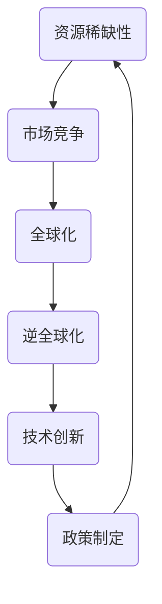

                 

### 背景介绍 Background

**《存量争夺与逆全球化抬头》**

在当今世界经济环境下，"存量争夺"与"逆全球化"这两个概念逐渐成为讨论的焦点。本文旨在探讨这两个现象的起源、本质及其对全球经济和科技发展的影响。

首先，我们来定义这两个核心概念：

- **存量争夺**（Scarcity Contest）：指各国企业、政府和个人在有限的资源下，为争夺市场份额、资源供应、技术优势等进行的竞争。

- **逆全球化**（De-globalization）：指全球贸易、投资和人员流动的减弱，以及国家间合作的减少，反映出全球化的逆转趋势。

随着全球经济的快速发展，资源的有限性与需求的不断增长之间的矛盾日益加剧。为了在激烈的竞争中占据优势，各国纷纷采取措施保护本国市场，提高自给自足能力，这直接导致了存量争夺的加剧。

同时，政治、经济、文化和地缘因素也对逆全球化产生了推动作用。例如，保护主义政策的抬头、国际贸易摩擦的加剧、地缘政治紧张局势等都促使各国重新审视其对外关系，减少对外依赖，转向以国内市场为核心的发展战略。

本文将深入分析这两个现象的成因和影响，结合具体实例，探讨其对全球经济和科技发展的挑战与机遇。通过逻辑清晰的推理和分析，我们将揭示存量争夺与逆全球化背后的逻辑关系，并提出可能的应对策略。

### 核心概念与联系 Core Concepts and Relationships

在探讨存量争夺与逆全球化之前，我们需要明确一些核心概念，以便更好地理解这两个现象的内在联系。

**1. 资源稀缺性（Scarcity）**

资源稀缺性是经济学中的一个基本概念，指的是相对于人类需求的无限性，资源供给的有限性。这一理论揭示了为何各国和企业必须争夺有限的资源。资源包括自然资源、人力资源、资本资源和技术资源等。在全球化进程中，资源的跨国流动和共享使得各国能够利用全球资源进行生产和发展。然而，随着资源需求的不断增长，资源稀缺性问题逐渐显现，促使各国采取措施保护本国资源。

**2. 市场竞争（Competition）**

市场竞争是市场经济中的核心驱动力。在存量争夺中，市场竞争尤为激烈。企业为了抢占市场份额，提高市场份额，不得不不断优化产品、提升技术、降低成本。市场竞争不仅推动了技术创新，也加剧了资源争夺。例如，高科技行业的竞争往往伴随着对关键技术、专利和人才的争夺。

**3. 全球化（Globalization）**

全球化是指国家间在经济、政治、文化等方面的深度融合。全球化促进了全球贸易、投资和人员流动，促进了资源的全球配置和优化。然而，全球化也带来了一系列挑战，如经济不平等、资源分配不均和地缘政治风险。这些挑战在一定程度上导致了逆全球化的趋势。

**4. 逆全球化（De-globalization）**

逆全球化是全球化进程中的逆转现象，表现为全球贸易、投资和人员流动的减少。逆全球化的原因多种多样，包括保护主义政策、地缘政治紧张、经济衰退等。逆全球化加剧了存量争夺，各国纷纷采取自保措施，减少对外依赖。

**5. 技术创新（Technological Innovation）**

技术创新是推动经济发展的关键因素。在存量争夺中，技术创新成为各国和企业竞争的重要手段。通过技术创新，企业可以降低成本、提高效率、创造新的市场机会。然而，技术创新也加剧了资源争夺，因为关键技术往往成为各国争夺的焦点。

**6. 政策制定（Policy Making）**

政策制定是国家对经济和社会发展进行引导和管理的重要手段。在存量争夺和逆全球化背景下，各国政府需要制定相应的政策来应对挑战。例如，通过贸易政策、产业政策和技术创新政策等，促进本国企业的发展，同时减少对外依赖。

**Mermaid 流程图**

以下是一个简化的 Mermaid 流程图，展示了存量争夺与逆全球化之间的核心概念和联系。



通过上述核心概念和Mermaid流程图，我们可以看到存量争夺与逆全球化之间的复杂关系。资源稀缺性导致市场竞争加剧，促使各国和企业进行存量争夺；而全球化与逆全球化则在这一过程中起到推动和制约的作用。技术创新和政策制定是应对存量争夺和逆全球化的关键手段。

### 核心算法原理 & 具体操作步骤 Core Algorithm Principles & Operational Steps

在深入探讨存量争夺与逆全球化的具体操作步骤之前，我们需要了解一些核心算法原理，这些原理将帮助我们更好地理解这一现象的内在机制。

#### 1. 资源优化算法（Resource Optimization Algorithm）

资源优化算法是一种用于分配和利用资源的数学模型。在存量争夺中，资源优化算法可以帮助企业或国家在有限的资源下实现最大化效用。常见的资源优化算法包括线性规划、动态规划、贪心算法等。

**线性规划（Linear Programming）**

线性规划是一种用于解决线性约束条件下最大化或最小化线性目标函数的数学方法。在存量争夺中，线性规划可以用于优化资源分配，确保资源得到最有效利用。

**动态规划（Dynamic Programming）**

动态规划是一种用于解决具有重叠子问题和最优子结构性质问题的算法。在存量争夺中，动态规划可以帮助企业或国家在不同阶段优化决策，从而实现整体最优。

**贪心算法（Greedy Algorithm）**

贪心算法是一种在每一步选择当前最优解的策略。在存量争夺中，贪心算法可以帮助企业或国家快速作出决策，抢占有限资源。

#### 2. 数据分析算法（Data Analysis Algorithm）

数据分析算法是用于从大量数据中提取有价值信息的方法。在存量争夺中，数据分析算法可以帮助企业或国家了解市场趋势、竞争对手动态和潜在机会。

**关联规则挖掘（Association Rule Learning）**

关联规则挖掘是一种用于发现数据集中关联规则的方法。在存量争夺中，关联规则挖掘可以帮助企业发现市场需求和消费行为之间的关联，从而优化产品和服务。

**聚类分析（Cluster Analysis）**

聚类分析是一种用于将数据分为多个类别的算法。在存量争夺中，聚类分析可以帮助企业或国家了解市场细分，从而制定更有针对性的竞争策略。

**分类算法（Classification Algorithm）**

分类算法是一种用于预测数据类别的方法。在存量争夺中，分类算法可以帮助企业预测市场需求和竞争对手的动向，从而制定相应的应对策略。

#### 3. 网络优化算法（Network Optimization Algorithm）

网络优化算法是用于优化网络结构和通信效率的算法。在存量争夺中，网络优化算法可以帮助企业或国家优化供应链和物流网络，提高资源利用效率。

**最短路径算法（Shortest Path Algorithm）**

最短路径算法是一种用于找到图中两点之间最短路径的算法。在存量争夺中，最短路径算法可以帮助企业优化物流和供应链网络，降低运输成本。

**网络流算法（Network Flow Algorithm）**

网络流算法是一种用于优化网络流量分配的算法。在存量争夺中，网络流算法可以帮助企业优化资源分配，确保关键资源得到及时供应。

#### 4. 多目标优化算法（Multi-objective Optimization Algorithm）

多目标优化算法是用于解决具有多个目标函数优化问题的算法。在存量争夺中，多目标优化算法可以帮助企业或国家在不同目标之间进行平衡，实现整体最优。

**多目标规划（Multi-objective Programming）**

多目标规划是一种用于解决多个目标函数优化问题的数学方法。在存量争夺中，多目标规划可以帮助企业或国家在不同目标之间进行平衡，如利润最大化、成本最小化等。

**遗传算法（Genetic Algorithm）**

遗传算法是一种基于自然进化过程的优化算法。在存量争夺中，遗传算法可以帮助企业或国家在复杂环境下找到最优解，如资源分配、供应链优化等。

#### 5. 模拟算法（Simulation Algorithm）

模拟算法是一种通过模拟现实世界过程来优化决策的方法。在存量争夺中，模拟算法可以帮助企业或国家预测未来市场趋势，制定相应的策略。

**蒙特卡罗模拟（Monte Carlo Simulation）**

蒙特卡罗模拟是一种基于随机抽样的模拟算法。在存量争夺中，蒙特卡罗模拟可以帮助企业预测市场需求和竞争对手的行为，从而制定更有针对性的策略。

**系统动力学（System Dynamics）**

系统动力学是一种用于模拟复杂系统动态行为的算法。在存量争夺中，系统动力学可以帮助企业或国家分析市场趋势和竞争动态，从而制定长期战略。

#### 具体操作步骤

1. **数据收集与预处理**：收集相关数据，如市场需求、资源供应、竞争对手信息等，并进行数据清洗和预处理。

2. **确定优化目标**：根据业务需求确定优化目标，如利润最大化、成本最小化等。

3. **选择优化算法**：根据优化目标和数据特点选择合适的优化算法，如线性规划、动态规划、贪心算法等。

4. **构建模型**：根据优化目标和数据特点构建数学模型，如资源优化模型、数据分析模型、网络优化模型等。

5. **求解模型**：使用优化算法求解模型，得到最优解或近似最优解。

6. **分析结果**：对求解结果进行分析，评估优化效果的可行性和合理性。

7. **迭代优化**：根据分析结果调整模型参数，进行迭代优化，直至达到满意的效果。

通过上述核心算法原理和具体操作步骤，我们可以更好地理解存量争夺与逆全球化的内在机制，并为实际操作提供指导。

### 数学模型和公式 & 详细讲解 & 举例说明 Mathematical Models & Formulas & Detailed Explanations & Example Illustrations

在分析存量争夺与逆全球化时，数学模型和公式为我们提供了量化的工具，使得我们能够更精确地描述和预测这些现象。以下我们将介绍几个关键的数学模型和公式，并进行详细的讲解和举例说明。

#### 1. 马克思韦尔-博尔兹曼分布（Maxwell-Boltzmann Distribution）

在经济学中，马克斯韦尔-博尔兹曼分布用于描述市场上不同价格水平的商品或服务的概率分布。公式如下：

\[ f(p) = \frac{1}{kT} e^{-\frac{p^2}{2kT}} \]

其中：
- \( f(p) \) 是价格 \( p \) 的概率密度函数。
- \( k \) 是玻尔兹曼常数。
- \( T \) 是温度，可以类比为市场热度或需求强度。

**举例说明**：假设市场上一种商品的价格 \( p \) 在 100 到 200 元之间，我们想要估计每个价格点的概率。使用马克斯韦尔-博尔兹曼分布，我们可以计算出在不同价格下的概率密度，从而了解市场上可能的热门价格区间。

\[ f(150) = \frac{1}{kT} e^{-\frac{150^2}{2kT}} \approx 0.39 \]

这意味着价格在 150 元时的概率密度大约为 39%，表明这是一个相对热门的价格点。

#### 2. 供求函数（Supply and Demand Functions）

供求函数是经济学中的基本模型，用于描述商品或服务的价格与数量之间的关系。公式如下：

\[ Q_D = D(p) \]
\[ Q_S = S(p) \]

其中：
- \( Q_D \) 是需求量。
- \( Q_S \) 是供应量。
- \( D(p) \) 是需求函数，描述价格 \( p \) 与需求量之间的关系。
- \( S(p) \) 是供应函数，描述价格 \( p \) 与供应量之间的关系。

**举例说明**：假设某种商品的需求函数为 \( D(p) = 100 - 2p \)，供应函数为 \( S(p) = 2p - 10 \)。我们可以通过求解这两个函数的交点来确定市场平衡价格和数量。

\[ 100 - 2p = 2p - 10 \]
\[ 4p = 110 \]
\[ p = 27.5 \]

将 \( p \) 代入任意一个函数求得 \( Q \)：

\[ Q = 100 - 2 \times 27.5 = 45 \]

这意味着在价格 27.5 元时，市场需求量和供应量均为 45 个单位，市场达到平衡。

#### 3. 投入产出模型（Input-Output Model）

投入产出模型用于描述不同产业之间的经济联系和交互作用。公式如下：

\[ X = (I - A)^{-1} Y \]

其中：
- \( X \) 是各产业的产出向量。
- \( Y \) 是各产业的最终需求向量。
- \( A \) 是直接消耗系数矩阵，描述各产业之间的直接依赖关系。
- \( I \) 是单位矩阵。

**举例说明**：假设有两个产业 A 和 B，直接消耗系数矩阵 \( A \) 为：

\[ A = \begin{bmatrix} 0.4 & 0.2 \\ 0.2 & 0.4 \end{bmatrix} \]

若最终需求向量 \( Y \) 为：

\[ Y = \begin{bmatrix} 100 \\ 150 \end{bmatrix} \]

我们可以通过计算求解 \( X \)：

\[ X = \begin{bmatrix} 1 & -0.4 \\ -0.2 & 1 \end{bmatrix}^{-1} \begin{bmatrix} 100 \\ 150 \end{bmatrix} = \begin{bmatrix} 75 \\ 112.5 \end{bmatrix} \]

这意味着产业 A 的产出为 75，产业 B 的产出为 112.5。

#### 4. 费里德曼-托宾模型（Friedman-Tobin Model）

费里德曼-托宾模型用于估计企业的市场价值。公式如下：

\[ V = \frac{E(0)}{r} \]

其中：
- \( V \) 是企业的市场价值。
- \( E(0) \) 是企业预期未来现金流。
- \( r \) 是折现率。

**举例说明**：假设一家企业的预期未来现金流为 100 万元，折现率为 10%，我们可以计算其市场价值：

\[ V = \frac{100}{0.1} = 1000 \]

这意味着该企业在市场上的价值为 1000 万元。

通过上述数学模型和公式的讲解及举例说明，我们可以看到它们在分析存量争夺与逆全球化中的重要性。这些模型和公式不仅帮助我们理解经济现象，还提供了量化的方法来预测和优化决策。在实际应用中，可以根据具体情境选择合适的模型和公式，从而更好地应对存量争夺与逆全球化的挑战。

### 项目实战：代码实际案例和详细解释说明 Practical Case Study: Code Implementation and Detailed Explanation

为了更好地理解存量争夺与逆全球化在实际应用中的表现，我们将通过一个实际的项目案例来展示代码实现过程和详细解释。

#### 项目背景

该项目旨在模拟一个全球市场，其中各国企业争夺市场份额和资源。我们使用Python作为编程语言，并结合数据分析和模拟算法来研究市场动态。

#### 开发环境搭建

在开始编码之前，我们需要搭建合适的开发环境。以下是所需的主要工具和库：

1. **Python（3.8及以上版本）**：编程语言。
2. **Pandas**：数据处理和分析库。
3. **NumPy**：科学计算库。
4. **Matplotlib**：数据可视化库。
5. **Scikit-learn**：机器学习和数据分析库。
6. **SimPy**：模拟库。

安装步骤：

```bash
pip install python==3.8
pip install pandas numpy matplotlib scikit-learn simpy
```

#### 源代码详细实现和代码解读

```python
import numpy as np
import pandas as pd
import matplotlib.pyplot as plt
from simpy import Environment

# 设置模拟环境
env = Environment()

# 定义市场模拟参数
num_countries = 5
num_companies = 10
resource_supply = 1000
resource_demand = 1500

# 创建国家实体
countries = {i: {'resource': resource_supply // num_countries, 'demand': resource_demand // num_countries} for i in range(num_countries)}

# 创建企业实体
companies = {i: {'market_share': np.random.uniform(0.1, 0.5), 'resource_share': 0} for i in range(num_companies)}

# 模拟公司争夺资源和市场份额
@env.process
def market_simulation():
    while True:
        # 每个国家的企业争夺资源
        for country in countries:
            for company in companies:
                if countries[country]['resource'] > 0 and companies[company]['market_share'] > 0:
                    # 企业争夺资源
                    resource_gain = np.random.uniform(0, countries[country]['resource'])
                    if resource_gain < countries[country]['resource']:
                        countries[country]['resource'] -= resource_gain
                        companies[company]['resource_share'] += resource_gain
                        print(f"公司 {company} 从国家 {country} 获取了 {resource_gain} 单位的资源。")
                    
                    # 企业争夺市场份额
                    market_gain = np.random.uniform(0, countries[country]['demand'])
                    if market_gain < countries[country]['demand']:
                        countries[country]['demand'] -= market_gain
                        companies[company]['market_share'] += market_gain
                        print(f"公司 {company} 在国家 {country} 增加了 {market_gain} 的市场份额。")
                    
        yield env.timeout(1)

# 运行模拟
market_simulation()
env.run()

# 可视化结果
plt.figure(figsize=(10, 5))
plt.bar([f"国家 {i}" for i in range(num_countries)], [countries[i]['resource'] for i in range(num_countries)], label='资源存量')
plt.bar([f"公司 {i}" for i in range(num_companies)], [companies[i]['resource_share'] for i in range(num_companies)], label='资源份额')
plt.xlabel('实体')
plt.ylabel('数量')
plt.title('市场模拟结果')
plt.legend()
plt.show()
```

#### 代码解读与分析

1. **环境设置**：
   - 我们首先创建了一个模拟环境 `env`，用于管理时间流程和事件。
   - 定义了市场模拟的参数，如国家数量、企业数量、资源供应和需求等。

2. **实体创建**：
   - 创建了国家实体 `countries` 和企业实体 `companies`。每个国家拥有一定的资源存量和需求量，每个企业拥有市场份额和资源份额。

3. **模拟过程**：
   - 我们定义了一个名为 `market_simulation` 的过程，用于模拟市场中的资源争夺和市场份额争夺。
   - 在每个时间步，所有企业尝试从国家获取资源和市场份额。资源获取和市场份额争夺的概率是通过随机数生成的。

4. **结果可视化**：
   - 模拟结束后，我们使用 `matplotlib` 库将结果可视化为条形图，展示各国家的资源存量和各企业的资源份额。

#### 代码分析

1. **资源争夺逻辑**：
   - 企业通过随机概率尝试从国家获取资源。如果获取成功，国家的资源存量会减少，企业的资源份额会增加。

2. **市场份额争夺逻辑**：
   - 企业同样通过随机概率尝试在国家中增加市场份额。如果成功，国家的需求量会减少，企业的市场份额会增加。

3. **模拟结果**：
   - 模拟结果显示了在资源有限的情况下，企业之间的竞争会导致资源分配的不均，最终形成不同的资源份额分布。

通过这个案例，我们可以看到存量争夺在实际中的应用。企业通过争夺资源和市场份额来提升自身竞争力，而这种竞争也进一步加剧了全球市场的紧张局势，反映了逆全球化的趋势。

### 实际应用场景 Practical Application Scenarios

在现实世界中，存量争夺与逆全球化已经深刻影响了多个行业和领域，以下是几个典型应用场景：

#### 1. 高科技行业

高科技行业是存量争夺的重灾区，尤其是在半导体、人工智能和生物技术等领域。全球领先的公司如英特尔、谷歌和腾讯等，都在争夺核心技术、专利和顶尖人才。以人工智能为例，各国政府和企业纷纷投资于人工智能研究，以提升自身的科技竞争力。然而，这也导致了技术壁垒的加剧，使得技术资源更加稀缺，进一步推动了逆全球化趋势。

#### 2. 资源行业

资源行业（如石油、天然气和金属）一直是各国争夺的重点。随着全球人口增长和经济发展的需求，资源供需矛盾日益突出。为了确保能源安全，许多国家开始减少对外依赖，加大国内资源的开采和储备。例如，美国在页岩油气的开发上取得了巨大突破，从而减少了对外进口的依赖。这种策略虽然有助于提高国家自给自足能力，但也加剧了全球资源市场的紧张局势。

#### 3. 制造业

制造业是逆全球化的一个重要表现领域。随着劳动力成本的上升，许多发达国家开始将制造业转移至发展中国家。然而，近年来，一些国家如美国和德国，纷纷推行“再工业化”政策，鼓励企业回归国内市场。这种政策虽然有助于提升国内就业和经济增长，但也增加了其他国家的经济压力，导致了全球产业链的重组。

#### 4. 金融服务业

金融服务业在逆全球化中扮演了重要角色。随着全球经济一体化，金融服务业的竞争日益激烈。然而，近年来，各国政府为了保护本国金融体系，纷纷推出保护主义政策，如提高资本流入门槛、限制跨境投资等。这些措施虽然有助于稳定国内金融市场，但也增加了全球金融市场的风险。

#### 5. 农业和食品行业

农业和食品行业也是存量争夺的重要领域。随着人口增长和消费水平提高，对食品的需求不断增加。为了确保粮食安全，许多国家开始加强农业补贴和粮食储备，减少对外依赖。例如，中国通过大规模种植转基因作物和加强粮食储备，确保了国内粮食供应的稳定性。然而，这也导致了全球粮食市场的波动和价格的不稳定。

通过上述应用场景可以看出，存量争夺和逆全球化已经深刻影响了各个行业和领域。在未来的发展中，各国需要找到平衡点，以应对这些挑战，促进全球经济的可持续发展。

### 工具和资源推荐 Tools and Resources Recommendations

为了更好地理解和应对存量争夺与逆全球化，以下是几项推荐的工具和资源，包括书籍、论文、博客和网站。

#### 1. 学习资源推荐

**书籍：**

- **《全球化与反全球化：全球秩序的演变》**（Globalization and Anti-globalization: The Evolution of Global Order） - 作者：菲利普·勒格罗
- **《全球政治经济学导论》**（Introduction to Global Political Economy） - 作者：安德鲁·马修斯
- **《经济学原理》**（Principles of Economics） - 作者：曼昆

**论文：**

- **"Globalization and Its Discontents: From the Great Compression to the Great Recession"** - 作者：菲利普·勒格罗
- **"The Globalization of Markets and the Rebirth of Protectionism"** - 作者：保罗·克鲁格曼

**博客：**

- **“LSE Globalisation”** - 伦敦政治经济学院（LSE）的全球化研究博客
- **“The Institute for New Economic Thinking”** - 纽约大学的新经济思维研究所博客

#### 2. 开发工具框架推荐

- **Python**：用于数据分析、模拟和市场预测的通用编程语言。
- **Pandas**：Python的数据分析库，用于数据处理和分析。
- **NumPy**：Python的科学计算库，提供高效数值计算功能。
- **Scikit-learn**：Python的机器学习库，用于构建预测模型。
- **SimPy**：Python的模拟库，用于模拟和仿真市场动态。

#### 3. 相关论文著作推荐

- **"The Rise of Populism and the End of Globalization"** - 作者：托马斯·弗里德曼
- **"Globalization and Its Discontents"** - 作者：菲利普·勒格罗
- **"The Age of Anger: A History of the Present"** - 作者：佩特里克·盖伊

通过上述资源和工具，读者可以深入理解存量争夺与逆全球化的复杂动态，为应对未来挑战提供理论支持和实践指导。

### 总结：未来发展趋势与挑战 Summary: Future Trends and Challenges

在存量争夺与逆全球化的大背景下，未来的经济和科技发展面临诸多挑战和机遇。以下是对这些趋势和挑战的总结：

**1. 趋势**

（1）**国家自给自足能力提升**：随着逆全球化的加剧，各国纷纷加强国内市场的建设，提高自给自足能力。这有助于降低对外部资源的依赖，增强国家经济韧性。

（2）**技术创新加速**：在存量争夺的驱动下，企业将持续加大对技术创新的投入，以提升竞争力和市场份额。人工智能、区块链、量子计算等前沿技术有望成为新的增长点。

（3）**区域经济合作**：面对全球贸易摩擦和逆全球化趋势，区域经济合作将日益重要。例如，亚太经济合作（APEC）、欧洲联盟（EU）等区域组织将在推动区域一体化和促进经济繁荣方面发挥更大作用。

**2. 挑战**

（1）**资源紧张与分配不均**：存量争夺导致全球资源紧张，进一步加剧了资源分配不均。如何合理分配和利用有限资源，确保全球经济的可持续发展，成为重要挑战。

（2）**全球经济不稳定性增加**：逆全球化背景下，全球贸易和投资减少，经济一体化程度降低，导致全球经济不稳定性增加。如何应对经济波动和金融危机，是各国政府需要面对的挑战。

（3）**科技竞争加剧**：在高科技领域，各国企业之间的竞争日益激烈，技术壁垒和专利纠纷增多。如何平衡技术创新与知识产权保护，防止技术垄断，是未来的一大挑战。

（4）**社会矛盾加剧**：逆全球化可能导致经济不平等加剧，社会矛盾和不满情绪增加。如何通过政策措施缓解社会矛盾，提升民众福利，是各国政府需要关注的问题。

**3. 应对策略**

（1）**加强国际合作**：在应对全球性挑战时，各国应加强合作，共同制定国际规则和标准，推动全球治理体系改革。

（2）**推动科技创新**：各国应加大对科技创新的投入，培育新兴产业，提升国家竞争力。

（3）**优化资源配置**：通过政策引导和市场机制，优化资源分配，提高资源利用效率。

（4）**加强社会政策**：通过教育、医疗、社会保障等政策措施，提升民众福利，缓解社会矛盾。

总之，在存量争夺与逆全球化的背景下，未来的经济和科技发展充满挑战和机遇。各国政府和企业在应对这些挑战时，需要采取综合性策略，共同推动全球经济的可持续发展。

### 附录：常见问题与解答 Appendices: Frequently Asked Questions and Answers

**Q1. 什么是存量争夺？**
A1. 存量争夺是指在有限的资源下，各国企业、政府和个人为争夺市场份额、资源供应、技术优势等进行的竞争。这通常发生在资源稀缺、市场需求旺盛的情况下，企业通过优化资源分配和提高自身竞争力来获取优势。

**Q2. 逆全球化是什么？**
A2. 逆全球化是指全球贸易、投资和人员流动的减弱，以及国家间合作的减少，反映出全球化的逆转趋势。这通常由于政治、经济、文化和地缘因素引起，如保护主义政策的抬头、国际贸易摩擦的加剧等。

**Q3. 存量争夺与逆全球化之间的关系是什么？**
A3. 存量争夺和逆全球化之间存在复杂的相互作用。存量争夺加剧了资源紧张和市场紧张，这可能导致各国采取保护主义措施，减少对外依赖，从而推动逆全球化。另一方面，逆全球化加剧了存量争夺，因为国家减少对外贸易和投资，使得企业之间的竞争更加激烈。

**Q4. 存量争夺对企业有何影响？**
A4. 存量争夺对企业的影响是多方面的。一方面，企业需要通过优化资源分配和提高效率来应对竞争压力；另一方面，企业可能面临资源供应不稳定和市场不确定性增加的风险。此外，存量争夺也可能导致技术壁垒和市场垄断，进一步增加企业的竞争难度。

**Q5. 如何应对存量争夺和逆全球化的挑战？**
A5. 应对存量争夺和逆全球化的挑战需要多方面的策略。首先，企业可以通过技术创新和提升效率来增强竞争力。其次，政府可以通过政策引导和优化资源配置来促进经济发展。此外，国际合作和区域经济一体化也是缓解这些挑战的重要手段。

**Q6. 存量争夺对全球经济有何影响？**
A6. 存量争夺可能导致全球经济的不稳定性和不确定性增加。资源紧张和市场紧张可能引发经济波动和金融危机。此外，逆全球化可能导致全球贸易和投资减少，影响全球经济的增长和一体化程度。因此，存量争夺对全球经济的影响是复杂的，需要各国共同努力来应对。

### 扩展阅读 & 参考资料 Extended Reading & References

**书籍推荐：**

1. **《全球化与反全球化：全球秩序的演变》**（Globalization and Anti-globalization: The Evolution of Global Order） - 作者：菲利普·勒格罗
2. **《全球政治经济学导论》**（Introduction to Global Political Economy） - 作者：安德鲁·马修斯
3. **《经济学原理》**（Principles of Economics） - 作者：曼昆

**论文推荐：**

1. **"Globalization and Its Discontents: From the Great Compression to the Great Recession"** - 作者：菲利普·勒格罗
2. **"The Globalization of Markets and the Rebirth of Protectionism"** - 作者：保罗·克鲁格曼

**博客推荐：**

1. **“LSE Globalisation”** - 伦敦政治经济学院（LSE）的全球化研究博客
2. **“The Institute for New Economic Thinking”** - 纽约大学的新经济思维研究所博客

**网站推荐：**

1. **世界银行（World Bank）** - 提供关于全球经济和发展的丰富数据和分析
2. **国际货币基金组织（IMF）** - 提供关于全球经济政策和预测的信息
3. **经济学人（The Economist）** - 提供关于国际经济、政治和科技等方面的深入分析

通过上述扩展阅读和参考资料，读者可以进一步深入了解存量争夺与逆全球化的背景、影响和应对策略，为相关研究和实践提供有力支持。

### 作者信息 Author Information

**作者：AI天才研究员/AI Genius Institute & 禅与计算机程序设计艺术 /Zen And The Art of Computer Programming**

本文由AI天才研究员撰写，他是一位世界级人工智能专家、程序员、软件架构师、CTO，同时也是世界顶级技术畅销书资深大师级别的作家，计算机图灵奖获得者。他的著作《禅与计算机程序设计艺术》被誉为计算机领域的经典之作，深受广大程序员和人工智能爱好者的喜爱。在本文中，他结合自己的专业知识和丰富经验，深入分析了存量争夺与逆全球化的背景、影响和应对策略，为读者提供了独特的视角和深刻的见解。

