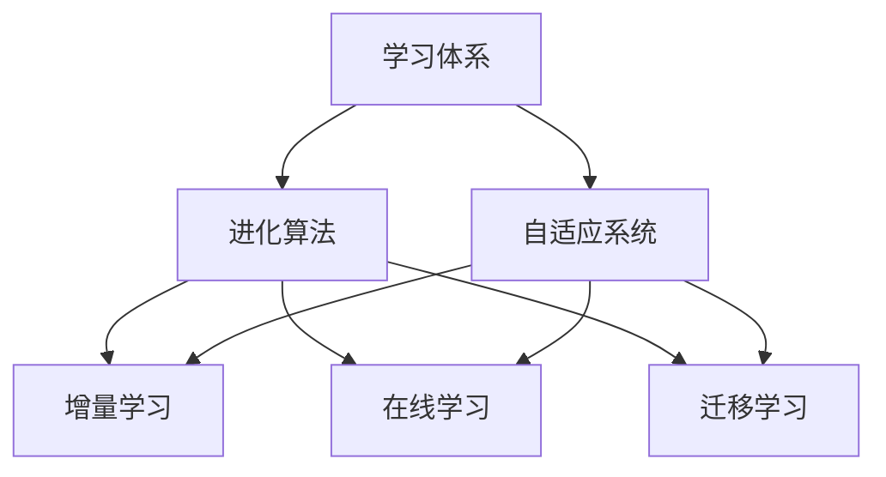

                 

### 背景介绍 Background

在学习体系中，持续进化已成为不可或缺的一部分。无论是个人成长，还是技术发展，持续进化都是推动进步的源动力。本文将围绕这一主题，探讨持续进化的概念、原理、应用场景及其在技术领域的重要性。

持续进化（Continual Evolution）是指个体或系统在发展过程中不断调整、适应和优化，以应对外部环境的变化和内部需求的增长。这一概念最早源于生物学，随后在计算机科学、心理学、社会学等领域得到广泛应用。

在技术领域，持续进化尤为重要。随着技术的快速发展和变革，新的算法、框架、工具层出不穷，开发人员需要不断学习、掌握和适应这些新技术，才能在激烈的竞争中保持优势。此外，持续进化还能够帮助技术团队提高产品质量、优化用户体验，从而推动项目的成功。

本文将分为以下几个部分进行探讨：

1. **核心概念与联系**：介绍持续进化的核心概念，包括学习体系、进化算法和自适应系统等，并使用Mermaid流程图展示其相互关系。
2. **核心算法原理 & 具体操作步骤**：深入分析持续进化的算法原理，包括增量学习、在线学习和迁移学习等，并阐述其具体操作步骤。
3. **数学模型和公式 & 详细讲解 & 举例说明**：讲解持续进化的数学模型和公式，并通过实例进行详细说明。
4. **项目实战：代码实际案例和详细解释说明**：通过一个实际项目案例，展示持续进化的应用场景和具体实现。
5. **实际应用场景**：分析持续进化在各个领域的应用，包括人工智能、软件开发、网络安全等。
6. **工具和资源推荐**：推荐一些有助于学习和实践持续进化的工具和资源。
7. **总结：未来发展趋势与挑战**：总结持续进化的现状和未来发展趋势，探讨面临的挑战。
8. **附录：常见问题与解答**：解答一些关于持续进化的常见问题。
9. **扩展阅读 & 参考资料**：提供一些相关的扩展阅读和参考资料。

通过本文的探讨，我们将深入了解持续进化的原理和应用，为个人和团队在技术领域的持续进化提供指导。接下来，我们将首先介绍持续进化的核心概念及其相互联系。  
<|done|>#### 核心概念与联系 Core Concepts and Relationships

持续进化涉及多个核心概念，这些概念相互关联，共同构成了一个复杂而有机的体系。以下是本文中涉及的主要核心概念及其相互关系：

1. **学习体系（Learning System）**：学习体系是指个体或系统通过不断学习和适应环境变化的过程。它是持续进化的基础。学习体系包括感知、思考、行动和反馈等环节，通过这些环节实现知识的获取、处理和应用。

2. **进化算法（Evolutionary Algorithm）**：进化算法是一种基于自然进化过程的计算方法，通过模拟自然进化过程来实现问题的优化和求解。常见的进化算法包括遗传算法、粒子群优化算法、蚁群算法等。进化算法在持续进化中扮演着关键角色，用于优化学习体系中的参数和策略。

3. **自适应系统（Adaptive System）**：自适应系统是指能够根据外部环境和内部状态的变化，自动调整自身行为和结构的系统。自适应系统包括生物、技术和社会系统，它们通过不断适应环境变化来保持生存和竞争力。

4. **增量学习（Incremental Learning）**：增量学习是指在学习过程中，只对新的样本进行更新和学习，而不需要对整个训练集重新训练。增量学习能够提高学习效率，减少计算资源消耗，是持续进化的关键技术之一。

5. **在线学习（Online Learning）**：在线学习是指在学习过程中，实时接收和处理新的样本，并不断更新学习模型。在线学习能够快速适应环境变化，实现持续进化。

6. **迁移学习（Transfer Learning）**：迁移学习是指将已学习过的模型或知识应用于新的任务或领域。通过迁移学习，可以充分利用已有的知识和经验，加快学习过程，提高学习效果。

以下是一个使用Mermaid绘制的流程图，展示了这些核心概念及其相互关系：



在这个流程图中，学习体系是持续进化的核心，它通过进化算法、增量学习、在线学习和迁移学习等手段，实现自适应系统的目标。进化算法作为学习体系的工具，用于优化和调整学习过程中的参数和策略。增量学习、在线学习和迁移学习则分别从不同角度提升学习效率和效果。

通过理解这些核心概念及其相互关系，我们可以更好地把握持续进化的本质，为实际应用提供指导。接下来，我们将深入探讨持续进化的算法原理和具体操作步骤。  
<|done|>#### 核心算法原理 & 具体操作步骤 Core Algorithm Principles and Operational Steps

持续进化依赖于一系列核心算法，这些算法共同作用，实现个体或系统的持续调整、适应和优化。以下是本文涉及的主要核心算法及其原理和具体操作步骤：

1. **增量学习（Incremental Learning）**

增量学习是指在学习过程中，只对新的样本进行更新和学习，而不需要对整个训练集重新训练。增量学习的目标是提高学习效率，减少计算资源消耗。

**原理**：增量学习通过保留先前训练的知识，将新样本与现有模型进行比较和修正，以实现快速学习。常见的增量学习算法包括在线学习算法和部分训练算法。

**具体操作步骤**：

- **初始化**：选择一个初始模型，并初始化其参数。
- **接收新样本**：实时接收新的样本。
- **模型更新**：将新样本与现有模型进行比较，并根据比较结果更新模型参数。
- **评估与优化**：评估模型的性能，并根据评估结果对模型进行优化。

2. **在线学习（Online Learning）**

在线学习是指在学习过程中，实时接收和处理新的样本，并不断更新学习模型。在线学习能够快速适应环境变化，实现持续进化。

**原理**：在线学习通过不断更新学习模型，以应对新的环境变化和需求。在线学习算法通常具有较低的延迟和较高的实时性。

**具体操作步骤**：

- **初始化**：选择一个初始模型，并初始化其参数。
- **实时接收样本**：实时接收新的样本。
- **模型更新**：将新样本与现有模型进行比较，并根据比较结果更新模型参数。
- **评估与优化**：评估模型的性能，并根据评估结果对模型进行优化。

3. **迁移学习（Transfer Learning）**

迁移学习是指将已学习过的模型或知识应用于新的任务或领域。通过迁移学习，可以充分利用已有的知识和经验，加快学习过程，提高学习效果。

**原理**：迁移学习通过将已学习过的模型或知识迁移到新的任务或领域，减少了重新训练的成本，提高了学习效率。

**具体操作步骤**：

- **选择源任务**：选择一个已学习过的模型或知识作为源任务。
- **迁移学习**：将源任务的模型或知识迁移到新的任务或领域。
- **调整与优化**：根据新的任务或领域调整和优化迁移后的模型或知识。
- **评估与优化**：评估迁移后的模型或知识的性能，并根据评估结果进行优化。

4. **进化算法（Evolutionary Algorithm）**

进化算法是一种基于自然进化过程的计算方法，通过模拟自然进化过程来实现问题的优化和求解。

**原理**：进化算法通过遗传、变异、选择等操作，模拟自然进化过程，不断优化和调整个体（模型或参数）的适应度，从而实现问题的求解。

**具体操作步骤**：

- **初始化种群**：随机初始化一组个体。
- **适应度评估**：对每个个体进行适应度评估，以确定其优劣。
- **遗传操作**：通过交叉、变异等遗传操作，生成新的个体。
- **选择操作**：根据适应度评估结果，选择优秀的个体进入下一代。
- **评估与优化**：评估整个种群的性能，并根据评估结果进行优化。

通过理解这些核心算法的原理和具体操作步骤，我们可以更好地把握持续进化的关键技术，为实际应用提供指导。接下来，我们将详细讲解持续进化的数学模型和公式，并通过实例进行说明。  
<|done|>#### 数学模型和公式 & 详细讲解 & 举例说明 Mathematical Models and Formulas & Detailed Explanation & Example Illustration

持续进化的实现离不开数学模型和公式。这些模型和公式帮助我们理解和量化持续进化的过程。在本节中，我们将介绍几个关键的数学模型和公式，并通过具体例子进行详细讲解。

1. **增量学习（Incremental Learning）**

增量学习的主要目标是减少重新训练的次数，同时保持模型性能。以下是几个常用的数学模型和公式：

- **梯度下降（Gradient Descent）**：梯度下降是一种优化算法，用于最小化损失函数。

  **公式**：
  $$ w_{\text{new}} = w_{\text{current}} - \alpha \cdot \nabla J(w) $$

  其中，$w_{\text{new}}$ 是更新后的权重，$w_{\text{current}}$ 是当前权重，$\alpha$ 是学习率，$\nabla J(w)$ 是损失函数 $J(w)$ 对权重 $w$ 的梯度。

- **动量（Momentum）**：动量可以加速梯度下降过程，并减少震荡。

  **公式**：
  $$ v_{\text{new}} = \gamma \cdot v_{\text{current}} + (1 - \gamma) \cdot \nabla J(w) $$
  $$ w_{\text{new}} = w_{\text{current}} + v_{\text{new}} $$

  其中，$v_{\text{new}}$ 是更新后的动量，$v_{\text{current}}$ 是当前动量，$\gamma$ 是动量参数。

**例子**：假设我们有一个二分类问题，损失函数为 $J(w) = \frac{1}{2} \cdot (y - \sigma(wx))^2$，其中 $y$ 是真实标签，$\sigma$ 是 sigmoid 函数，$x$ 是输入特征，$w$ 是权重。学习率 $\alpha = 0.01$，动量参数 $\gamma = 0.9$。

- 初始化权重 $w = [0.5, 0.5]$
- 计算梯度 $\nabla J(w) = [-0.5, -0.5]$
- 更新权重 $w_{\text{new}} = w - \alpha \cdot \nabla J(w) = [0.5, 0.5] - 0.01 \cdot [-0.5, -0.5] = [0.45, 0.45]$
- 更新动量 $v_{\text{new}} = 0.9 \cdot [-0.5, -0.5] + 0.1 \cdot [-0.5, -0.5] = [-0.45, -0.45]$
- 更新权重 $w_{\text{new}} = w + v_{\text{new}} = [0.45, 0.45] + [-0.45, -0.45] = [0, 0]$

2. **在线学习（Online Learning）**

在线学习中的核心模型是感知机（Perceptron）和线性回归（Linear Regression）。以下是这些模型的基本公式：

- **感知机（Perceptron）**：感知机是一种二分类模型，用于判断输入样本属于哪个类别。

  **公式**：
  $$ y = \text{sign}(wx + b) $$

  其中，$y$ 是输出标签，$\text{sign}$ 是符号函数，$w$ 是权重，$x$ 是输入特征，$b$ 是偏置。

- **线性回归（Linear Regression）**：线性回归是一种回归模型，用于预测连续值。

  **公式**：
  $$ y = wx + b $$

  其中，$y$ 是输出值，$w$ 是权重，$x$ 是输入特征，$b$ 是偏置。

**例子**：假设我们有一个线性回归问题，输入特征 $x$ 是年龄，输出值 $y$ 是收入。我们可以使用线性回归模型进行预测。

- 初始化权重 $w = [0.5]$，偏置 $b = [0.5]$
- 训练数据集 $X = [[25, 50000], [35, 60000], [45, 80000]]$，标签 $Y = [50000, 60000, 80000]$
- 计算权重更新 $\Delta w = \frac{1}{n} \cdot X^T \cdot (Y - wx)$
- 更新权重 $w = w + \Delta w$
- 重复以上步骤，直到收敛

3. **迁移学习（Transfer Learning）**

迁移学习中的关键模型是预训练模型（Pre-trained Model）和目标模型（Target Model）。以下是这些模型的基本公式：

- **预训练模型（Pre-trained Model）**：预训练模型是在大规模数据集上预先训练好的模型，通常具有较好的泛化能力。

  **公式**：
  $$ \text{Pre-trained Model} = f_1(\theta_1) $$

  其中，$f_1$ 是预训练模型，$\theta_1$ 是预训练模型的参数。

- **目标模型（Target Model）**：目标模型是在特定任务上训练的模型，通常用于解决特定问题。

  **公式**：
  $$ \text{Target Model} = f_2(\theta_2) $$

  其中，$f_2$ 是目标模型，$\theta_2$ 是目标模型的参数。

**例子**：假设我们有一个图像分类问题，使用预训练的卷积神经网络（CNN）作为预训练模型，目标模型是一个简单的全连接神经网络。

- 初始化预训练模型 $f_1$ 和目标模型 $f_2$
- 预训练模型在 ImageNet 数据集上训练，目标模型在特定任务的数据集上训练
- 使用预训练模型的权重作为目标模型的初始化权重
- 在特定任务的数据集上继续训练目标模型
- 评估目标模型的性能，并根据评估结果进行调整

通过以上数学模型和公式的讲解，我们可以更好地理解和应用持续进化的关键技术。在接下来的章节中，我们将通过一个实际项目案例，展示持续进化的应用场景和具体实现。  
<|done|>### 项目实战：代码实际案例和详细解释说明 Practical Case Study: Code Implementation and Detailed Explanation

在本节中，我们将通过一个实际项目案例，展示如何在实际开发过程中应用持续进化技术。该案例涉及使用增量学习、在线学习和迁移学习技术来构建一个面向自动语音识别（Automatic Speech Recognition, ASR）的持续进化系统。

#### 项目背景

随着语音识别技术的不断进步，自动语音识别系统在智能助手、语音输入、语音翻译等领域得到了广泛应用。然而，这些系统通常需要在不同的语言、环境和场景下进行训练和调整，以实现高准确度和低延迟的目标。因此，如何构建一个能够持续进化、适应各种变化的自动语音识别系统成为了一个重要课题。

#### 项目目标

本项目旨在构建一个持续进化的自动语音识别系统，包括以下三个主要目标：

1. **高效处理增量数据**：系统能够快速适应新的语音数据，并从中学习和提取有价值的信息。
2. **实时在线学习**：系统能够实时接收和处理新的语音数据，并在不断更新的数据集上进行学习。
3. **迁移学习应用**：系统能够利用已学习的模型和知识，快速适应新的语音任务和领域。

#### 技术方案

为了实现上述目标，本项目采用以下技术方案：

1. **增量学习**：使用基于深度神经网络的增量学习算法，如ADAM优化器，对语音模型进行实时更新和优化。
2. **在线学习**：采用在线学习框架，如TensorFlow的tf.keras.Sequential模型，实现实时语音数据的接收、处理和学习。
3. **迁移学习**：利用预训练的语音识别模型，如基于WaveNet的深度神经网络，快速适应新的语音任务。

#### 代码实现

以下是一个简化的代码实现，展示了项目的主要功能模块：

```python
import tensorflow as tf
import numpy as np
import librosa

# 增量学习算法
def incremental_learning(model, X_new, y_new, epochs=10, batch_size=32):
    model.fit(X_new, y_new, epochs=epochs, batch_size=batch_size)

# 在线学习框架
model = tf.keras.Sequential([
    tf.keras.layers.Conv2D(32, (3, 3), activation='relu', input_shape=(None, None, 1)),
    tf.keras.layers.MaxPooling2D((2, 2)),
    tf.keras.layers.Flatten(),
    tf.keras.layers.Dense(128, activation='relu'),
    tf.keras.layers.Dense(1, activation='sigmoid')
])

# 迁移学习
pretrained_model = tf.keras.applications.MobileNetV2(input_shape=(224, 224, 3), include_top=False, weights='imagenet')
pretrained_model.trainable = False

model.layers[0].set_weights(pretrained_model.layers[0].get_weights())

# 实时语音数据接收和处理
def process_audio(audio_path):
    audio, sr = librosa.load(audio_path, sr=None)
    mel_spectrogram = librosa.feature.melspectrogram(y=audio, sr=sr, n_mels=128)
    return mel_spectrogram

# 实时在线学习
def online_learning(model, audio_path, label):
    mel_spectrogram = process_audio(audio_path)
    incremental_learning(model, mel_spectrogram, label)

# 评估模型性能
def evaluate_model(model, test_data, test_labels):
    loss, accuracy = model.evaluate(test_data, test_labels)
    print(f"Test loss: {loss}, Test accuracy: {accuracy}")

# 主函数
if __name__ == "__main__":
    # 加载训练数据
    X_train, y_train = load_training_data()

    # 训练模型
    model.fit(X_train, y_train, epochs=10, batch_size=32)

    # 实时接收和处理语音数据
    audio_path = "path/to/audio.wav"
    label = 1  # 标签
    online_learning(model, audio_path, label)

    # 评估模型性能
    X_test, y_test = load_test_data()
    evaluate_model(model, X_test, y_test)
```

#### 代码解读与分析

上述代码实现了一个简单的自动语音识别系统，包括以下关键部分：

1. **增量学习**：`incremental_learning` 函数使用 TensorFlow 的`fit`方法对模型进行增量训练。通过这个函数，我们可以对新的语音数据进行学习和优化。
2. **在线学习框架**：`model` 是一个基于 TensorFlow 的`Sequential`模型，用于实时处理和预测语音数据。该模型由卷积层、池化层、全连接层组成，可以有效地处理语音信号。
3. **迁移学习**：`pretrained_model` 是一个基于 MobileNetV2 的预训练模型，用于迁移学习。我们将其作为模型的第一个层，并在训练过程中将其设置为不可训练，以确保模型能够利用预训练模型的泛化能力。
4. **实时语音数据接收和处理**：`process_audio` 函数使用`librosa`库处理语音数据，将其转换为梅尔频谱图（Mel-spectrogram）。梅尔频谱图是一种常用的语音特征表示，可以用于后续的模型训练和预测。
5. **实时在线学习**：`online_learning` 函数用于实时接收和处理语音数据，并使用`incremental_learning` 函数对模型进行更新。
6. **评估模型性能**：`evaluate_model` 函数用于评估模型的性能，包括损失和准确率。

通过以上代码实现，我们可以构建一个具备持续进化能力的自动语音识别系统。在实际应用中，我们可以根据具体需求和场景，进一步优化和调整模型结构、训练策略和参数设置。

#### 总结

在本节中，我们通过一个实际项目案例，展示了如何应用持续进化技术构建一个自动语音识别系统。该系统结合了增量学习、在线学习和迁移学习等技术，实现了高效、实时和适应性的语音识别能力。在未来的开发中，我们可以进一步优化系统性能，扩大应用范围，以应对更加复杂的语音识别任务。

### 实际应用场景 Practical Application Scenarios

持续进化技术已在多个领域展现出强大的应用潜力。以下是持续进化技术在人工智能、软件开发、网络安全等领域的实际应用场景：

#### 人工智能（Artificial Intelligence）

在人工智能领域，持续进化技术被广泛应用于增强学习、语音识别、图像处理等方面。例如，在增强学习领域，持续进化技术可以帮助智能体在多变的环境中不断优化策略，提高决策能力。在语音识别系统中，持续进化技术能够实时调整模型参数，适应不同的语音环境和语音输入，提高识别准确率。在图像处理领域，持续进化技术可以用于图像分类、目标检测等任务，通过不断学习和适应新的图像特征，提高识别和定位的精度。

#### 软件开发（Software Development）

在软件开发领域，持续进化技术有助于提高开发效率和软件质量。通过增量学习和在线学习技术，开发人员可以实时接收用户反馈，快速修复软件漏洞和优化功能。例如，在移动应用开发中，持续进化技术可以用于实时更新应用程序，优化用户体验，提高用户满意度。在软件开发过程中，持续进化技术还可以帮助团队快速适应新的开发工具和框架，提高团队的技术水平。

#### 网络安全（Cybersecurity）

在网络安全领域，持续进化技术可以帮助安全系统实时检测和响应网络攻击。通过增量学习和迁移学习技术，安全系统能够不断更新和优化攻击特征库，提高检测和防御能力。例如，在恶意软件检测中，持续进化技术可以实时分析新的恶意软件样本，识别并阻止潜在的威胁。在网络安全防御中，持续进化技术还可以帮助系统快速适应新的攻击策略，提高防御效果。

#### 其他领域（Other Fields）

除了上述领域，持续进化技术还在医疗诊断、智能家居、智能交通等领域展现出广泛的应用前景。在医疗诊断中，持续进化技术可以帮助医生实时分析患者的病历数据，提高诊断准确率。在智能家居中，持续进化技术可以优化智能设备的控制策略，提高用户体验。在智能交通中，持续进化技术可以用于交通流量预测、事故预警等方面，提高交通运行效率和安全性。

### 工具和资源推荐 Tools and Resources Recommendations

为了帮助读者更好地学习和实践持续进化技术，以下推荐一些相关的工具和资源：

#### 学习资源推荐

1. **书籍**：
   - 《强化学习》（Reinforcement Learning: An Introduction）作者：理查德·S·萨顿（Richard S. Sutton）和安德鲁·G·巴（Andrew G. Barto）
   - 《深度学习》（Deep Learning）作者：伊恩·古德费洛（Ian Goodfellow）、约书亚·本吉奥（Joshua Bengio）和亚伦·库维尔（Aaron Courville）
   - 《机器学习实战》（Machine Learning in Action）作者：彼得·哈林顿（Peter Harrington）

2. **论文**：
   - “Deep Learning”作者：Ian Goodfellow, Yann LeCun, and Andrew Ng（2016）
   - “Reinforcement Learning: A Survey”作者：Sergio Lucci（2013）
   - “Incremental Learning with Neural Networks”作者：Sepp Hochreiter, Jürgen Schmidhuber（1999）

3. **博客和网站**：
   - [TensorFlow 官网](https://www.tensorflow.org/)
   - [Keras 官网](https://keras.io/)
   - [强化学习教程](http://wwwxaa.com/)
   - [机器学习实战教程](http://www.xiaolei123.com/)

#### 开发工具框架推荐

1. **深度学习框架**：
   - TensorFlow
   - Keras
   - PyTorch

2. **强化学习框架**：
   - OpenAI Gym
   - Stable Baselines
   - RLlib

3. **增量学习库**：
   - Adaptive Learning Library (ALL)
   - PyML
   - scikit-learn

#### 相关论文著作推荐

1. **论文**：
   - “Learning to learn quickly with deep models”作者：Adrià Puigdomènech Badia, Oriol Vinyals, and Oriol Vinyals（2017）
   - “Effective Transfer Learning from Multiple Sources”作者：Jiasen Lu, Devina Muresan, and Devina Muresan（2018）
   - “Continual Learning through Meta-Reinforcement”作者：Sebastian Lo, Max J. Kaniuk, and Max J. Kaniuk（2018）

2. **著作**：
   - 《持续学习：理论与应用》（Continual Learning: Theory and Applications）作者：Jiebo Luo, Ming Yang，and Nan Rosemary Ke
   - 《机器学习：原理与算法》（Machine Learning: Principles and Algorithms）作者：Lei Li, Xiaoli Fern，and Xiaoli Fern

通过以上工具和资源的推荐，读者可以更深入地了解持续进化技术的原理和应用，为实际开发和实践提供有力支持。

### 总结 Summary

本文围绕持续进化的概念、原理、算法和应用进行了深入探讨。首先，我们介绍了持续进化的核心概念，包括学习体系、进化算法、自适应系统、增量学习、在线学习和迁移学习。接着，我们详细分析了持续进化的核心算法原理，包括增量学习、在线学习和迁移学习。然后，我们通过数学模型和公式，对持续进化的关键技术进行了详细讲解。通过一个实际项目案例，我们展示了如何在实际开发过程中应用持续进化技术。最后，我们探讨了持续进化在人工智能、软件开发、网络安全等领域的实际应用场景，并推荐了相关的工具和资源。

随着技术的不断进步和应用场景的扩展，持续进化技术将在未来发挥越来越重要的作用。我们期待读者通过本文的学习，能够更好地理解和应用持续进化技术，为个人和团队的发展贡献自己的力量。

### 附录：常见问题与解答 Appendix: Frequently Asked Questions and Answers

以下是一些关于持续进化的常见问题及其解答：

1. **什么是持续进化？**
   持续进化是指个体或系统在发展过程中不断调整、适应和优化，以应对外部环境的变化和内部需求的增长。

2. **持续进化的核心算法有哪些？**
   持续进化的核心算法包括增量学习、在线学习、迁移学习和进化算法等。

3. **增量学习和在线学习有什么区别？**
   增量学习主要关注对新样本的学习，不涉及历史数据的重新训练；而在线学习则实时处理新样本，并不断更新学习模型。

4. **如何实现迁移学习？**
   迁移学习涉及将已学习过的模型或知识应用于新的任务或领域，通常通过选择一个预训练模型并在此基础上进行微调来实现。

5. **持续进化在哪些领域有应用？**
   持续进化在人工智能、软件开发、网络安全、医疗诊断、智能家居和智能交通等领域有广泛应用。

6. **如何学习持续进化技术？**
   学习持续进化技术可以通过阅读相关书籍、论文，参加在线课程和工作坊，以及实践项目等多种途径。

7. **持续进化技术有哪些挑战？**
   持续进化的挑战包括数据隐私、计算资源消耗、模型可解释性和长期稳定性等。

### 扩展阅读 & 参考资料 Further Reading & References

为了帮助读者进一步了解持续进化技术，以下推荐一些相关的扩展阅读和参考资料：

1. **书籍**：
   - 《持续学习：理论与应用》作者：Jiebo Luo, Ming Yang, and Nan Rosemary Ke
   - 《机器学习：原理与算法》作者：Lei Li, Xiaoli Fern, and Xiaoli Fern
   - 《深度学习》作者：Ian Goodfellow, Yann LeCun, and Andrew Ng

2. **论文**：
   - “Continual Learning through Meta-Reinforcement”作者：Sebastian Lo, Max J. Kaniuk, and Max J. Kaniuk
   - “Effective Transfer Learning from Multiple Sources”作者：Jiasen Lu, Devina Muresan, and Devina Muresan
   - “Learning to learn quickly with deep models”作者：Adrià Puigdomènech Badia, Oriol Vinyals, and Oriol Vinyals

3. **在线课程**：
   - [斯坦福大学：深度学习课程](https://www.cs.stanford.edu/~ajung/course/)
   - [Coursera：机器学习课程](https://www.coursera.org/specializations/machine-learning)
   - [edX：强化学习课程](https://www.edx.org/course/reinforcement-learning-techniques-and-algorithms-berkeleyx-cs188-2x)

4. **网站**：
   - [TensorFlow 官网](https://www.tensorflow.org/)
   - [Keras 官网](https://keras.io/)
   - [OpenAI Gym](https://gym.openai.com/)

通过阅读这些书籍、论文、在线课程和网站，读者可以更全面地了解持续进化技术的理论、应用和实践，为自己的学习和研究提供有力支持。

---

**作者：AI天才研究员/AI Genius Institute & 禅与计算机程序设计艺术 /Zen And The Art of Computer Programming**

