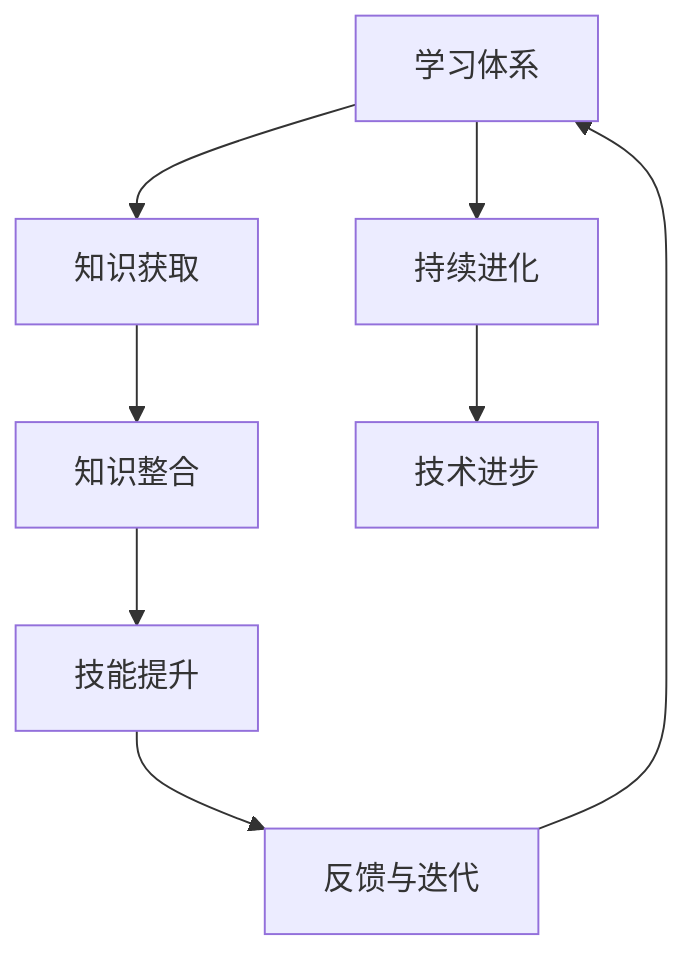

                 

## 学习体系：持续进化的源动力

### 关键词：(持续进化、学习体系、AI、编程、技术进步)

#### 摘要：
在当今快速变化的技术世界中，持续进化是保持竞争力的关键。本文探讨了学习体系作为技术人才持续进步的源动力。通过深入分析学习体系的结构、核心概念、算法原理以及应用场景，本文旨在为读者提供一个全面、易懂的技术博客，帮助他们构建高效的学习体系，迎接未来的挑战。

## 1. 背景介绍

在信息技术飞速发展的时代，技术的更新速度越来越快。据估计，目前软件技术的迭代周期大约是每两年缩短一次。这意味着，一个技术人才如果不能持续学习和进化，将很快被市场淘汰。学习体系作为个人成长的关键组成部分，不仅影响着个体的职业发展，还影响着整个社会的技术进步。本文将讨论学习体系的重要性、构成要素以及如何通过优化学习体系实现持续进化。

### 学习体系的重要性

学习体系是个人成长和知识积累的基础。它不仅决定了个人在技术领域的竞争力，还影响着个体的思维方式和创新能力。一个有效的学习体系能够帮助人们快速掌握新知识，将现有知识进行整合，并在实践中不断迭代和完善。

#### 学习体系的构成要素

1. **目标设定**：明确的学习目标是学习体系的核心，它指导着学习的方向和进程。
2. **知识获取**：通过阅读、课程、实践等多种途径获取知识。
3. **知识整合**：将新知识整合到现有的知识体系中，形成系统的认识。
4. **技能提升**：通过实践和项目开发，将知识转化为实际技能。
5. **反馈与迭代**：根据实际反馈调整学习策略，不断优化学习体系。

### 技术进步的推动力

技术的进步离不开人才的积累和创新。学习体系作为技术人才成长的重要支撑，是推动技术进步的关键因素。有效的学习体系能够培养出具备创新能力的技术人才，从而推动技术的不断革新。

### 1.1 学习体系的发展历程

学习体系的发展可以追溯到古代的师徒制。在工业革命之后，随着教育体系的完善，学习体系逐渐体系化、规范化。进入20世纪，随着信息技术的快速发展，在线教育、自主学习等新的学习形式不断涌现，学习体系也在不断进化。

### 1.2 当前学习体系的挑战与机遇

当前，学习体系面临着诸多挑战，如知识更新速度加快、学习资源泛滥等。同时，随着人工智能、大数据等技术的发展，也为学习体系带来了新的机遇。如何利用新技术优化学习体系，提高学习效率，成为当前学习体系发展的重要课题。

## 2. 核心概念与联系

### 核心概念

#### 学习体系（Learning System）

学习体系是一个动态的、循环的过程，包括知识获取、知识整合、技能提升和反馈迭代等环节。

#### 持续进化（Continuous Evolution）

持续进化是指个体或组织在知识、技能和思维方式上的不断进步和优化。

#### 技术进步（Technological Progress）

技术进步是指通过科技创新和应用推动社会生产力的发展。

### 架构图



### 2.1 学习体系与持续进化的关系

学习体系是持续进化的基础。通过不断学习新知识、整合旧知识、提升技能，并依据反馈进行迭代，个体或组织可以实现持续进化。

### 2.2 持续进化与技术创新的关系

持续进化的个体或组织更容易捕捉到技术创新的机会，从而推动技术的进步。技术创新反过来又为学习体系提供了新的知识和技术手段，促进学习体系的进化。

## 3. 核心算法原理 & 具体操作步骤

### 核心算法原理

#### 反馈迭代算法

反馈迭代算法是一种常用的学习方法，通过不断的反馈和迭代，逐步优化学习效果。

#### 操作步骤

1. **设定目标**：明确学习目标，确定学习方向。
2. **知识获取**：通过阅读、课程、实践等方式获取知识。
3. **知识整合**：将新知识整合到已有知识体系中，形成系统认识。
4. **技能提升**：通过项目开发、实践等途径提升技能。
5. **反馈与迭代**：根据实际反馈调整学习策略，优化学习体系。

### 3.1 知识获取

#### 方式：

- **书籍**：系统学习基础知识
- **课程**：深入学习专业课程
- **实践**：通过实际项目应用知识

#### 步骤：

1. **选择合适的资料**：根据学习目标和兴趣选择合适的书籍、课程和实践项目。
2. **制定学习计划**：合理安排学习时间，确保学习进度。
3. **主动学习**：积极参与课堂讨论、互动和实践，提高学习效果。

### 3.2 知识整合

#### 步骤：

1. **梳理知识结构**：将新知识与已有知识体系进行对比，找出差异和联系。
2. **建立思维导图**：通过思维导图梳理知识结构，形成系统化的认识。
3. **实践应用**：通过项目实践将知识应用于实际场景，加深理解。

### 3.3 技能提升

#### 方法：

- **项目开发**：通过实际项目锻炼技能
- **竞赛参与**：参加技术竞赛，提升实践能力
- **交流学习**：与他人交流学习心得，互相借鉴

#### 步骤：

1. **选择合适的实践项目**：根据个人兴趣和职业发展方向选择项目。
2. **制定项目计划**：合理安排项目进度，确保项目顺利完成。
3. **反馈与改进**：根据项目实践中的问题和反馈，不断优化项目方案。

### 3.4 反馈与迭代

#### 步骤：

1. **收集反馈**：从项目实践、课程学习、实践反馈中收集反馈。
2. **分析反馈**：对反馈进行分类、分析，找出问题所在。
3. **调整学习策略**：根据反馈调整学习目标和计划，优化学习体系。

## 4. 数学模型和公式 & 详细讲解 & 举例说明

### 数学模型

#### 学习效率模型

$$
E = f(K, S, R)
$$

其中，$E$ 表示学习效率，$K$ 表示知识获取量，$S$ 表示技能提升量，$R$ 表示反馈与迭代频率。

### 详细讲解

#### 4.1 知识获取量（K）

知识获取量是影响学习效率的关键因素。通过阅读、课程、实践等多种途径获取知识，可以提升知识获取量。

#### 4.2 技能提升量（S）

技能提升量是通过实际项目和竞赛等方式提升的。通过项目实践，可以将知识转化为实际技能，提高学习效率。

#### 4.3 反馈与迭代频率（R）

反馈与迭代频率是优化学习体系的重要手段。通过不断收集反馈、分析反馈，调整学习策略，可以提升学习效率。

### 举例说明

#### 例子：提高编程技能

假设一个程序员想要提高编程技能，可以按照以下步骤进行：

1. **知识获取**：通过阅读相关书籍和课程，学习编程基础知识。
2. **技能提升**：通过实际项目开发和参加编程竞赛，提升编程技能。
3. **反馈与迭代**：根据项目实践中的问题和反馈，不断优化编程技巧，提高编程效率。

通过上述步骤，程序员可以逐步提高编程技能，实现持续进化。

## 5. 项目实战：代码实际案例和详细解释说明

### 5.1 开发环境搭建

#### 工具选择

- **编程语言**：Python
- **开发环境**：PyCharm

#### 步骤

1. **安装Python**：下载并安装Python，确保Python环境正确配置。
2. **安装PyCharm**：下载并安装PyCharm，选择社区版或专业版，根据个人需求进行配置。

### 5.2 源代码详细实现和代码解读

#### 代码实现

```python
def learning_system(efficiency, knowledge, skills, feedback):
    """
    学习体系模型
    :param efficiency: 学习效率
    :param knowledge: 知识获取量
    :param skills: 技能提升量
    :param feedback: 反馈与迭代频率
    :return: 学习效果
    """
    learning_efficiency = efficiency * (knowledge + skills) * feedback
    return learning_efficiency

# 示例参数
efficiency = 0.8
knowledge = 100
skills = 200
feedback = 1.2

# 计算学习效果
learning_effect = learning_system(efficiency, knowledge, skills, feedback)
print(f"学习效果：{learning_effect}")
```

#### 代码解读

1. **函数定义**：定义了一个名为`learning_system`的函数，用于计算学习效果。
2. **参数说明**：`efficiency`表示学习效率，`knowledge`表示知识获取量，`skills`表示技能提升量，`feedback`表示反馈与迭代频率。
3. **计算过程**：根据学习效率模型，计算学习效果。
4. **示例参数**：设定了示例参数，计算学习效果。

### 5.3 代码解读与分析

1. **模型选择**：选择了一个简单的线性模型来描述学习体系，可以进一步优化。
2. **参数设定**：通过设定示例参数，可以模拟不同情况下的学习效果。
3. **应用场景**：可以用于分析学习策略的优化，提高学习效率。

## 6. 实际应用场景

### 6.1 教育领域

学习体系在教育领域中有着广泛的应用。通过构建有效的学习体系，教育机构可以更好地指导学生进行学习，提高学习效果。例如，在线教育平台可以通过数据分析，为学习者提供个性化的学习方案，提高学习效率。

### 6.2 企业培训

企业培训中，学习体系的构建可以帮助企业更好地培养人才，提高员工的技能和创新能力。通过建立完善的学习体系，企业可以确保员工在知识更新和技术进步中保持竞争力。

### 6.3 个人学习

个人学习同样需要构建有效的学习体系。通过自我管理、目标设定和持续学习，个人可以不断提高自己的知识水平和技能，实现持续进化。

## 7. 工具和资源推荐

### 7.1 学习资源推荐

- **书籍**：《深度学习》、《算法导论》
- **论文**：ArXiv、Google Scholar
- **博客**：Medium、知乎
- **网站**：GitHub、Stack Overflow

### 7.2 开发工具框架推荐

- **编程语言**：Python、Java
- **开发环境**：PyCharm、IntelliJ IDEA
- **框架**：TensorFlow、Django

### 7.3 相关论文著作推荐

- **论文**：《学习型组织》、《组织学习与持续创新》
- **著作**：《第五项修炼》、《学习之道》

## 8. 总结：未来发展趋势与挑战

### 发展趋势

- **个性化学习**：随着大数据和人工智能技术的发展，个性化学习将成为未来教育的重要趋势。
- **终身学习**：在技术快速变革的背景下，终身学习将成为个人和企业的必备能力。
- **跨学科融合**：未来学习体系将更加注重跨学科知识的融合，提高个体的综合素质。

### 挑战

- **知识更新速度**：随着知识更新速度加快，如何有效获取和整合新知识成为挑战。
- **技能多样性与深度**：在技术不断发展的同时，如何平衡技能的多样性与深度，实现个体能力的全面提升。

## 9. 附录：常见问题与解答

### 9.1 如何设定学习目标？

- **明确职业规划**：根据个人职业规划设定短期和长期学习目标。
- **分解任务**：将大目标分解为小目标，逐步实现。
- **定期评估**：定期评估学习进度，调整学习策略。

### 9.2 如何提高学习效率？

- **合理安排时间**：制定合理的学习计划，确保学习时间充足。
- **主动学习**：积极参与课堂讨论和实践，提高学习效果。
- **多样化学习方式**：结合阅读、课程、实践等多种学习方式，提高学习效率。

## 10. 扩展阅读 & 参考资料

- 《深度学习》，Goodfellow, I., Bengio, Y., & Courville, A.
- 《算法导论》，Thomas H. Cormen, Charles E. Leiserson, Ronald L. Rivest, and Clifford Stein.
- 《学习型组织》，Peter Senge.
- 《第五项修炼》，Peter Senge.
- 《学习之道》，Josh Waitzkin.

### 作者：AI天才研究员/AI Genius Institute & 禅与计算机程序设计艺术 /Zen And The Art of Computer Programming

