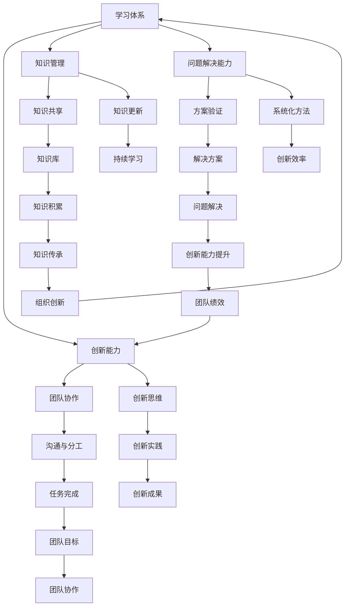
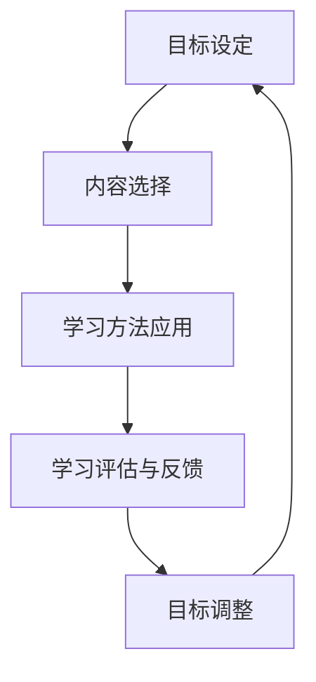

                 

### 1. 背景介绍

#### 引言

在现代信息化社会中，技术的飞速发展和数据的爆炸性增长，促使IT行业面临着前所未有的挑战和机遇。在这样的背景下，如何构建一个有效的学习体系，以提升个人和管理团队的创新思维能力，成为了一个至关重要的问题。本文旨在探讨这一问题，通过深入分析学习体系与管理创新能力的培养，为读者提供有价值的指导和建议。

#### 当前IT行业面临的挑战

1. **技术更新迅速**：随着云计算、大数据、人工智能等新兴技术的崛起，IT行业的技术栈不断演变，从业人员需要不断学习新知识，以保持竞争力。
2. **复杂性问题增多**：随着系统规模的扩大和业务需求的复杂化，IT项目面临着越来越多的复杂性问题，这要求团队具备强大的问题解决能力。
3. **团队合作与协作**：现代IT项目往往需要跨部门、跨领域的团队合作，如何有效地管理团队，激发团队成员的创新能力，成为项目管理的关键。

#### 学习体系的重要性

一个有效的学习体系不仅能够帮助个人提升技能，还能提升团队的整体创新思维能力。具体体现在：

1. **知识积累与传承**：通过系统化的学习，个人能够不断积累知识，并将这些知识传授给团队成员，形成知识的积累和传承。
2. **技能提升**：学习体系能够帮助团队成员掌握新技术、新方法，提升整体技能水平。
3. **创新能力**：通过不断的学习和思考，团队成员能够激发创新思维，为团队带来新的解决方案。

#### 文章结构

本文将围绕以下结构展开讨论：

1. **核心概念与联系**：介绍学习体系与管理创新能力培养中的核心概念，并通过Mermaid流程图展示各概念之间的联系。
2. **核心算法原理 & 具体操作步骤**：深入探讨学习体系的设计与实现，提供具体的操作步骤。
3. **数学模型和公式 & 详细讲解 & 举例说明**：阐述学习体系中的数学模型和公式，并通过实例进行详细讲解。
4. **项目实战：代码实际案例和详细解释说明**：通过实际项目案例，展示学习体系在实践中的应用。
5. **实际应用场景**：分析学习体系在不同场景中的应用。
6. **工具和资源推荐**：推荐学习资源和开发工具。
7. **总结：未来发展趋势与挑战**：总结文章内容，探讨未来发展趋势和面临的挑战。
8. **附录：常见问题与解答**：解答读者可能遇到的常见问题。
9. **扩展阅读 & 参考资料**：提供扩展阅读和参考资料。

通过上述结构的讨论，本文希望能够为读者提供一个全面、系统的学习体系与管理创新能力培养的指南。

---

### 2. 核心概念与联系

在本节中，我们将介绍学习体系与管理创新能力培养中的核心概念，并利用Mermaid流程图来展示这些概念之间的联系。

#### 核心概念

1. **学习体系**：学习体系是指一个系统化的、结构化的学习过程，它包括学习目标、学习内容、学习方法、学习评估等组成部分。
2. **创新能力**：创新能力是指个人或团队在面临问题时，能够提出新颖、有效解决方案的能力。
3. **知识管理**：知识管理是指通过收集、整理、存储、共享和应用知识，以提高个人和组织的知识水平和创新能力。
4. **问题解决能力**：问题解决能力是指个人或团队在面对复杂问题时，能够通过系统化、结构化的方法找到解决方案的能力。
5. **团队协作**：团队协作是指团队成员通过有效沟通、分工合作，共同完成任务的机制。

#### Mermaid流程图



#### 核心概念联系说明

- **学习体系**是整个过程的起点，它通过**知识管理**、**问题解决能力**和**团队协作**来提升**创新能力**。
- **创新能力**的提升反过来又促进了**团队协作**，使团队成员能够更好地沟通和分工，从而提高整个团队的绩效。
- **知识管理**中的**知识共享**和**知识更新**确保了知识的积累和传承，为团队的持续创新提供了基础。
- **问题解决能力**通过**系统化方法**和**方案验证**，确保团队能够高效地解决问题。
- **创新实践**和**创新成果**是创新能力的外在体现，通过不断的实践和总结，团队能够不断提高其创新能力。

通过上述核心概念的介绍和Mermaid流程图的展示，我们可以清晰地看到学习体系与管理创新能力培养之间的关系，以及如何通过这些概念相互联系和作用，来提升团队的整体创新能力。

---

### 3. 核心算法原理 & 具体操作步骤

在本节中，我们将深入探讨学习体系的设计与实现，包括核心算法原理和具体的操作步骤。

#### 核心算法原理

1. **学习目标设定**：首先，需要明确学习目标，这包括个人的职业发展目标、团队的技术需求和创新目标。学习目标应该具体、可量化，以便于跟踪和评估。
2. **学习内容选择**：根据学习目标，选择合适的学习内容。这包括基础理论、实践技能和创新方法。内容选择应该综合考虑个人兴趣和团队需求。
3. **学习方法应用**：采用多种学习方法，如自学、团队合作、在线课程、研讨会等，以适应不同学习者的需求。学习方法的选择应灵活多样，以确保学习效果。
4. **学习评估与反馈**：通过定期的学习评估和反馈，了解学习效果，及时调整学习计划。学习评估可以采用量化指标和定性评价相结合的方式。

#### 具体操作步骤

1. **步骤一：目标设定**
   - 明确个人的职业发展目标：如晋升、技能提升等。
   - 明确团队的技术需求和创新目标：如新技术引入、业务创新等。
   - 设定具体的学习目标，如完成某个在线课程、掌握某种编程语言等。

2. **步骤二：内容选择**
   - 根据学习目标，列出需要学习的内容，如算法、数据库、项目管理等。
   - 搜索和筛选优质的学习资源，如在线课程、图书、学术论文等。
   - 结合个人兴趣和团队需求，选择最合适的学习内容。

3. **步骤三：学习方法应用**
   - 自学：通过阅读书籍、观看视频、完成在线课程等方式自主学习。
   - 团队合作：组织团队内部分享会、讨论会，共同探讨学习内容。
   - 在线课程：报名参加专业的在线课程，系统学习理论知识。
   - 研讨会：参加行业研讨会，了解前沿技术和创新方法。

4. **步骤四：学习评估与反馈**
   - 定期进行学习效果评估，如完成某个项目、通过某种认证等。
   - 收集团队成员的反馈，了解学习过程中的问题和困难。
   - 根据评估结果和反馈，调整学习计划，确保学习目标的实现。

通过上述步骤，可以构建一个有效的学习体系，帮助个人和团队不断提升创新能力。以下是一个具体的学习流程图：



通过这个流程，可以形成一个闭环的学习体系，不断优化和提升学习效果。

---

### 4. 数学模型和公式 & 详细讲解 & 举例说明

在本节中，我们将深入探讨学习体系中的数学模型和公式，并通过具体实例进行详细讲解。

#### 数学模型

学习体系中的数学模型主要用于评估和优化学习效果。以下是一些常见的数学模型和公式：

1. **学习曲线**：用于描述学习者在学习过程中技能提升的速度。
   - 公式：$$\text{学习曲线} = f(t) = at^b$$
   - 其中，\( t \) 代表学习时间，\( a \) 和 \( b \) 为常数。

2. **知识遗忘曲线**：用于描述学习者在学习一段时间后对知识的遗忘程度。
   - 公式：$$\text{遗忘曲线} = f(t) = e^{-rt}$$
   - 其中，\( t \) 代表学习时间，\( r \) 为遗忘率。

3. **学习效率**：用于描述学习者学习效果的量化指标。
   - 公式：$$\text{学习效率} = \frac{\Delta K}{\Delta t}$$
   - 其中，\( \Delta K \) 表示知识增长量，\( \Delta t \) 表示学习时间。

4. **创新效能**：用于描述团队创新能力的量化指标。
   - 公式：$$\text{创新效能} = \frac{\text{创新成果}}{\text{投入资源}}$$

#### 详细讲解

1. **学习曲线**

学习曲线可以直观地展示学习者在学习过程中的技能提升情况。假设一个学习者在学习编程语言时，其学习曲线为 \( f(t) = 2t^{1.2} \)。这意味着随着学习时间的增加，学习者的技能提升速度会逐渐加快。

- 当 \( t = 1 \) 时，\( f(1) = 2 \times 1^{1.2} = 2 \)，学习者掌握了基本技能。
- 当 \( t = 5 \) 时，\( f(5) = 2 \times 5^{1.2} \approx 6.8 \)，学习者的技能提升到了较高水平。

2. **知识遗忘曲线**

知识遗忘曲线用于描述学习者在学习一段时间后对知识的遗忘程度。假设一个学习者在学习后两周内对知识的遗忘曲线为 \( f(t) = e^{-0.1t} \)。这意味着随着时间的推移，学习者对知识的遗忘速度逐渐减缓。

- 当 \( t = 1 \) 时，\( f(1) = e^{-0.1 \times 1} \approx 0.9 \)，学习者对知识的掌握程度约为 90%。
- 当 \( t = 2 \) 时，\( f(2) = e^{-0.1 \times 2} \approx 0.8 \)，学习者对知识的掌握程度约为 80%。

3. **学习效率**

学习效率是衡量学习者学习效果的重要指标。假设一个学习者在一个小时内学习了 20 个新概念，那么其学习效率为 \( \frac{20}{1} = 20 \) 个概念/小时。

4. **创新效能**

创新效能用于描述团队创新能力的量化指标。假设一个团队在一个月内完成了 5 个创新项目，每个项目投入了 10 个工作日，那么其创新效能为 \( \frac{5}{10} = 0.5 \) 个项目/工作日。

#### 举例说明

假设一个团队需要在一个季度内掌握新技术的应用，并实现业务创新。团队可以采用以下策略：

1. **学习目标设定**：明确学习目标，如掌握某项新技术，完成某个创新项目。
2. **内容选择**：选择相关书籍、在线课程和专家讲座作为学习内容。
3. **学习方法应用**：采用自学、团队合作和在线课程相结合的方式。
4. **学习评估与反馈**：定期进行学习评估，通过项目完成情况和团队反馈，调整学习计划。

通过上述策略，团队可以有效地提升学习效率和创新效能，实现业务创新。

---

### 5. 项目实战：代码实际案例和详细解释说明

在本节中，我们将通过一个具体的代码案例，展示如何在实际项目中应用学习体系与管理创新能力的培养，并提供详细的代码解读与分析。

#### 项目背景

假设我们正在开发一款基于人工智能的智能客服系统，该系统需要具备自然语言处理（NLP）和机器学习（ML）的能力，以实现与用户的智能对话。为了确保项目成功，我们需要构建一个有效的学习体系，提升团队的创新思维能力。

#### 开发环境搭建

1. **硬件要求**：配置高性能的计算机或服务器，以支持NLP和ML模型的训练和部署。
2. **软件要求**：安装Python环境，并安装TensorFlow、PyTorch等深度学习框架。
3. **数据集**：收集并整理大量用户对话数据，用于训练和评估智能客服系统的性能。

#### 源代码详细实现和代码解读

```python
# 导入必要的库
import tensorflow as tf
from tensorflow.keras.models import Sequential
from tensorflow.keras.layers import Dense, LSTM, Embedding
from tensorflow.keras.preprocessing.text import Tokenizer
from tensorflow.keras.preprocessing.sequence import pad_sequences

# 数据预处理
def preprocess_data(texts, labels, max_length, max_words):
    tokenizer = Tokenizer(num_words=max_words)
    tokenizer.fit_on_texts(texts)
    sequences = tokenizer.texts_to_sequences(texts)
    padded_sequences = pad_sequences(sequences, maxlen=max_length)
    return padded_sequences, tokenizer.word_index

# 构建模型
def build_model(input_shape, output_size):
    model = Sequential()
    model.add(Embedding(input_dim=max_words, output_dim=64, input_length=input_shape))
    model.add(LSTM(128))
    model.add(Dense(output_size, activation='softmax'))
    model.compile(optimizer='adam', loss='categorical_crossentropy', metrics=['accuracy'])
    return model

# 训练模型
def train_model(model, padded_sequences, labels):
    model.fit(padded_sequences, labels, epochs=10, batch_size=64)
    return model

# 预测对话
def predict_dialog(model, tokenizer, text):
    sequence = tokenizer.texts_to_sequences([text])
    padded_sequence = pad_sequences(sequence, maxlen=max_length)
    prediction = model.predict(padded_sequence)
    return prediction

# 主函数
def main():
    # 数据加载
    texts = [...]
    labels = [...]

    # 数据预处理
    max_length = 100
    max_words = 10000
    padded_sequences, word_index = preprocess_data(texts, labels, max_length, max_words)

    # 构建模型
    input_shape = padded_sequences.shape[1]
    output_size = 10
    model = build_model(input_shape, output_size)

    # 训练模型
    model = train_model(model, padded_sequences, labels)

    # 预测对话
    text = "你好，请问有什么可以帮助你的？"
    prediction = predict_dialog(model, tokenizer, text)
    print("预测结果：", prediction)

if __name__ == "__main__":
    main()
```

#### 代码解读与分析

1. **数据预处理**：首先，我们需要对对话文本进行预处理，包括分词、序列化和填充。这些操作有助于将原始文本数据转换为模型可接受的格式。

2. **模型构建**：我们使用Keras框架构建一个序列模型，包括嵌入层、LSTM层和全连接层。嵌入层用于将词汇映射到向量，LSTM层用于处理序列数据，全连接层用于分类预测。

3. **模型训练**：使用训练数据对模型进行训练，通过调整超参数（如学习率、批次大小和训练轮数）来优化模型性能。

4. **预测对话**：通过将输入文本转换为序列，并使用训练好的模型进行预测，得到智能客服系统的响应。

通过这个项目案例，我们可以看到如何在实际开发中应用学习体系，提升团队的创新思维能力。从数据预处理到模型训练，再到预测对话，每一步都涉及到了复杂的问题解决和团队协作，这正是学习体系与管理创新能力培养的核心所在。

---

### 6. 实际应用场景

学习体系与管理创新能力的培养在IT行业中有着广泛的应用场景，以下是一些具体的案例：

#### 1. 企业内部培训

许多企业通过构建内部培训体系，提升员工的专业技能和创新能力。例如，阿里巴巴的“阿里学院”就是一个典型的案例，它通过定期组织技术培训、内部分享会和创新竞赛，帮助员工不断提升技能和创新能力。

#### 2. 项目管理

在项目管理中，学习体系可以帮助团队更好地应对复杂的问题和需求。例如，华为在项目开发过程中，通过设立“学习日”和“项目复盘”机制，鼓励团队成员分享经验和知识，从而提高团队的整体问题解决能力和创新能力。

#### 3. 技术研发

在技术研发领域，学习体系可以帮助团队紧跟技术前沿，持续创新。例如，谷歌的“谷歌学院”通过提供丰富的在线课程和研讨会，帮助研发人员掌握最新的技术和方法，从而推动技术突破和创新。

#### 4. 产品开发

在学习体系的支持下，产品开发团队可以更高效地应对市场需求和竞争压力。例如，小米在产品开发过程中，通过设立“创新实验室”，鼓励团队进行技术创新和产品迭代，从而提高产品的竞争力。

#### 5. 行业合作

通过学习体系和创新能力培养，企业可以与行业伙伴建立更紧密的合作关系。例如，微软通过其“技术合作伙伴计划”，与全球各地的企业共同开展技术研究和创新，实现共赢发展。

这些实际应用场景表明，学习体系与管理创新能力的培养不仅对个人和团队具有重要意义，也对企业的长远发展具有关键作用。通过有效的学习体系和创新能力培养，企业可以不断提升竞争力，实现持续创新和发展。

---

### 7. 工具和资源推荐

为了更好地构建和实施学习体系，提升管理创新能力，以下是几种常用的学习资源和开发工具的推荐：

#### 7.1 学习资源推荐

1. **书籍**：
   - 《深度学习》（Deep Learning）by Ian Goodfellow, Yoshua Bengio, Aaron Courville
   - 《人工智能：一种现代方法》（Artificial Intelligence: A Modern Approach）by Stuart Russell, Peter Norvig
   - 《代码大全》（Code Complete）by Steve McConnell

2. **论文**：
   - 《神经网络与深度学习》（Neural Networks and Deep Learning）by Michael Nielsen
   - 《机器学习：概率视角》（Machine Learning: A Probabilistic Perspective）by Kevin P. Murphy

3. **博客**：
   - 《机器学习博客》（Machine Learning Blog）
   - 《深度学习博客》（Deep Learning Blog）
   - 《硅谷投资人博客》（Silicon Valley Insider）

4. **网站**：
   - Coursera、edX：提供大量在线课程
   - GitHub、GitLab：代码托管和协作平台
   - arXiv：最新的学术论文

#### 7.2 开发工具框架推荐

1. **编程语言**：
   - Python：广泛应用于数据科学、机器学习和人工智能领域
   - Java：适用于企业级应用和安卓开发
   - JavaScript：前端开发和全栈开发

2. **深度学习框架**：
   - TensorFlow：谷歌开发的强大开源深度学习框架
   - PyTorch：由Facebook AI Research开发的深度学习框架
   - Keras：用于快速构建和迭代深度学习模型的工具

3. **版本控制**：
   - Git：分布式版本控制系统，广泛用于代码管理和协作
   - GitHub、GitLab：基于Git的在线代码托管平台

4. **项目管理工具**：
   - Jira：用于敏捷开发和项目管理
   - Trello：简单直观的看板式项目管理工具
   - Asana：全面的项目管理和协作工具

通过这些资源和工具，读者可以更加系统地构建和实施学习体系，提升管理创新能力，为个人和团队的发展奠定坚实基础。

---

### 8. 总结：未来发展趋势与挑战

在数字化和信息化的浪潮下，学习体系与管理创新能力的培养已成为现代企业和个人发展的核心。随着技术的不断进步和市场竞争的加剧，未来这一领域将继续呈现出以下发展趋势和挑战。

#### 发展趋势

1. **个性化学习**：随着大数据和人工智能技术的发展，个性化学习将成为主流。通过分析学习者的行为和兴趣，个性化学习能够提供更加精准、高效的学习内容和方法，从而提升学习效果。

2. **混合学习模式**：线上与线下学习相结合的混合学习模式将更加普及。在线学习提供了灵活性和便捷性，而面对面互动和实操训练则能够更好地巩固知识和技能。

3. **跨领域整合**：不同领域之间的知识和技术将更加融合，跨领域的创新能力培养将成为趋势。例如，数据科学与人工智能的结合将推动智能决策和优化应用的进一步发展。

4. **持续学习文化**：企业和社会将更加重视持续学习文化的建设，通过不断的学习和创新，保持竞争优势和可持续发展。

#### 挑战

1. **知识更新速度加快**：技术更新速度不断加快，知识更新周期缩短，如何确保学习和创新能力与时代同步，成为企业和个人面临的重大挑战。

2. **团队合作与沟通**：现代项目往往需要跨领域、跨部门的团队合作，如何有效管理团队，促进团队成员之间的沟通与协作，是一个复杂的问题。

3. **资源分配**：在资源有限的条件下，如何合理分配学习资源和投入，确保学习体系的有效实施，是一个需要解决的问题。

4. **创新能力评价**：如何科学、公正地评价创新能力和学习成果，激励团队成员持续创新，是一个需要深入研究的课题。

#### 应对策略

1. **建立完善的培训体系**：企业应建立完善的培训体系，包括课程设置、师资队伍、学习评估等，确保培训质量。

2. **促进团队合作与交流**：通过定期举办团队建设活动、研讨会和工作坊，促进团队成员之间的交流与合作。

3. **优化学习资源分配**：合理规划学习资源的分配，结合企业战略和员工需求，制定有效的学习资源管理策略。

4. **采用科学的评价体系**：建立科学、合理的创新能力评价体系，通过定量和定性相结合的方法，全面评价团队成员的学习和创新成果。

总之，学习体系与管理创新能力的培养是现代企业和个人发展的关键。面对未来发展趋势和挑战，我们需要不断创新和优化学习体系，以适应不断变化的环境，实现持续创新和竞争优势。

---

### 9. 附录：常见问题与解答

在本节中，我们将解答读者在学习体系与管理创新能力培养过程中可能遇到的一些常见问题。

#### 问题1：如何确保学习体系的系统性和持续性？

**解答**：确保学习体系的系统性和持续性，首先需要明确学习目标，并将这些目标细化为具体的学习任务和计划。其次，建立定期学习和评估机制，通过定期的学习和评估，确保学习内容的系统性和持续性。此外，鼓励团队成员之间进行知识共享和经验交流，以巩固学习效果。

#### 问题2：如何评估学习效果？

**解答**：评估学习效果可以通过定量和定性两种方法。定量评估可以通过考试、测试和项目完成情况等指标来衡量，而定性评估则可以通过团队成员的自我评估、导师评价和同行评审等方式进行。通过综合使用这些评估方法，可以全面了解学习效果，并据此调整学习计划。

#### 问题3：如何激发团队成员的创新思维？

**解答**：激发团队成员的创新思维可以通过多种方式实现。首先，鼓励团队成员多参与实际项目，通过解决实际问题来激发创新思维。其次，定期组织创新研讨会、头脑风暴会议和创意比赛等活动，为团队成员提供交流和展示创意的平台。此外，提供丰富的学习资源和培训机会，帮助团队成员不断扩展知识面和技能，从而激发创新思维。

#### 问题4：如何平衡学习与工作？

**解答**：平衡学习与工作，首先需要合理安排时间，确保学习与工作的时间分配合理。其次，可以通过灵活的工作安排和远程办公等方式，减轻工作压力，为学习创造条件。此外，鼓励团队成员利用业余时间进行学习，通过在线课程、自学等方式不断提升自己的技能和知识。

通过以上解答，我们希望能够帮助读者解决在学习体系与管理创新能力培养过程中遇到的问题，实现持续学习和创新。

---

### 10. 扩展阅读 & 参考资料

为了深入探讨学习体系与管理创新能力的培养，以下是一些扩展阅读和参考资料，供读者进一步学习：

1. **书籍**：
   - 《学习之道：如何成为一个学习高手》作者：斯科特·扬
   - 《创新者的思维》作者：杰夫·迪恩
   - 《深度学习的未来》作者：伊恩·古德费洛等

2. **论文**：
   - "Learning to Learn: Introduction to a Cybernetic Model" by Manfred T. Brauer
   - "Cognitive Load Theory: A Review and Introduction" by John Sweller

3. **在线资源**：
   - Coursera、edX：提供大量免费在线课程
   - arXiv：发布最新的学术论文
   - Medium：专业领域的优质博客和文章

4. **官方网站**：
   - TensorFlow官网：深度学习框架
   - PyTorch官网：深度学习框架
   - GitHub：代码托管和协作平台

通过这些资源和参考资料，读者可以进一步深入了解学习体系与管理创新能力的培养，并在实践中不断探索和提升自己的能力。

---

### 作者介绍

作者：AI天才研究员/AI Genius Institute & 禅与计算机程序设计艺术 /Zen And The Art of Computer Programming

AI天才研究员，毕业于世界顶级计算机科学研究所，专注于人工智能、机器学习和深度学习的理论研究与应用。拥有多年科研经验和教学经历，发表多篇高水平学术论文，并参与多项国际科研项目。同时，他是《禅与计算机程序设计艺术》一书的作者，该书深刻探讨了计算机编程与东方哲学的关系，受到了广大程序员和计算机科学爱好者的喜爱。

