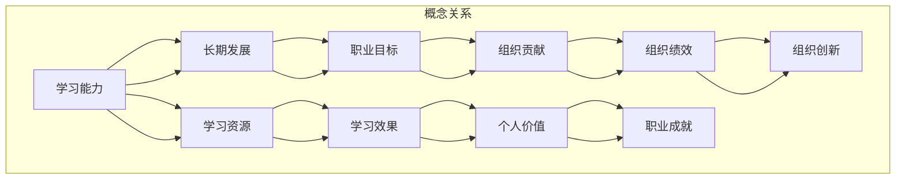

                 

### 背景介绍

在当今快速变化的技术环境中，学习能力与管理者的长期发展成为一个日益重要的话题。作为组织的关键决策者，管理者的能力直接影响着企业的创新能力和竞争力。然而，随着技术的不断进步，传统的管理知识和技能越来越难以满足新兴的需求。因此，提升管理者的学习能力，并在此基础上实现长期发展，成为当务之急。

首先，技术的快速发展带来了新的挑战和机遇。人工智能、大数据、云计算等新兴技术正在深刻地改变着各行各业的工作方式。管理者需要不断学习这些新技术，以便能够应对快速变化的市场环境，并推动组织的数字化转型。然而，学习这些技术并非易事，它们往往涉及复杂的理论知识、实践技能以及跨学科的知识融合。

其次，管理者的长期发展不仅依赖于个人的学习能力，还与组织的支持密切相关。一个良好的学习文化、持续的职业发展计划和有效的学习资源，都是管理者实现长期发展的关键因素。然而，很多组织在这方面存在不足，导致管理者的学习能力和职业发展受到限制。

此外，现代社会对管理者的要求越来越高。他们不仅需要具备战略思维和领导能力，还需要具备良好的沟通技巧、团队合作精神和创新意识。这些能力的培养和提高，同样需要通过不断学习和实践来实现。

总之，提升管理者的学习能力，并在此基础上实现长期发展，是当前技术环境中的一项重要任务。本文将围绕这一主题，深入探讨管理者的学习能力培养、学习资源利用以及长期发展的路径。

### 核心概念与联系

在深入探讨管理者的学习能力与管理者长期发展的关系之前，我们需要明确几个核心概念，并分析它们之间的内在联系。

首先，学习能力是指个体在知识、技能、态度和价值观等方面的获取、整合和应用能力。对于管理者而言，学习能力不仅包括对新兴技术的快速理解和应用，还包括对管理理论和实践的深入掌握，以及对自身领导风格和决策方法的反思与调整。

其次，长期发展是指管理者在职业生涯中，通过持续的学习和实践，不断提高个人能力，实现职业目标的过程。长期发展的目标不仅仅是职位晋升和薪资增长，更重要的是实现个人价值和职业成就，以及为组织带来持续的贡献。

第三，学习资源是指为管理者提供学习支持和帮助的各种资源，包括培训课程、学习资料、技术工具、导师指导以及组织文化等。有效的学习资源能够帮助管理者更好地利用时间，提高学习效率，并确保学习成果的转化和应用。

接下来，我们将通过一个Mermaid流程图来展示这几个核心概念之间的联系。



在上述流程图中，学习能力作为核心，不仅直接影响了长期发展和学习资源，还通过学习效果和个人价值的实现，为职业成就和组织贡献提供了支持。同时，组织的绩效和创新也在这个过程中得到提升。

### 核心算法原理 & 具体操作步骤

在深入理解了核心概念之后，接下来我们需要探讨如何通过具体操作步骤提升管理者的学习能力，并实现长期发展。这里，我们将介绍一种基于“迭代学习法”的核心算法原理，并结合实际操作步骤进行详细讲解。

#### 迭代学习法原理

迭代学习法是一种通过反复迭代、逐步优化的方法来提高学习效果。该方法的核心在于将学习过程分为多个阶段，每个阶段都包含具体的学习目标和评估机制。通过不断地迭代和调整，管理者能够逐步提高自己的学习能力和知识水平。

迭代学习法的原理可以概括为以下几个步骤：

1. **明确学习目标**：首先，管理者需要明确自己的学习目标，这包括短期和长期的目标。短期目标可以是掌握某个具体的技术或技能，长期目标则是实现职业发展和提升组织绩效。

2. **设计学习计划**：根据学习目标，管理者需要设计一个详细的学习计划，包括学习内容、学习时间、学习方式等。学习计划应当具有可操作性和灵活性，以便能够根据实际情况进行调整。

3. **实施学习计划**：按照学习计划，管理者开始执行具体的 学习任务。这一阶段需要充分利用各种学习资源，包括在线课程、书籍、研讨会、实践项目等。

4. **评估学习效果**：在实施学习计划的过程中，管理者需要定期进行自我评估和反思，检查学习目标的实现情况。评估可以通过考试、项目展示、同行评审等方式进行。

5. **调整学习策略**：根据评估结果，管理者需要调整学习策略，优化学习过程。这包括改进学习方法、增加学习资源、调整学习时间等。

6. **反馈与分享**：最后，管理者需要将学习过程和成果进行反馈和分享。这不仅可以巩固学习效果，还能为他人提供学习借鉴，形成良好的学习氛围。

#### 实际操作步骤

1. **明确学习目标**：
   - 短期目标：掌握数据分析技术，提高决策能力。
   - 长期目标：成为企业数字化转型领域的专家，提升企业竞争力。

2. **设计学习计划**：
   - 学习内容：数据分析基础、Python编程、机器学习算法。
   - 学习时间：每周至少10小时，持续6个月。
   - 学习方式：在线课程、实践项目、研讨会。

3. **实施学习计划**：
   - 第1-2周：学习数据分析基础，完成在线课程学习。
   - 第3-4周：学习Python编程，完成相关练习题和实践项目。
   - 第5-6周：学习机器学习算法，结合实际业务场景进行应用。

4. **评估学习效果**：
   - 第2个月末：进行一次自我评估，包括在线测试和项目展示。
   - 第4个月末：邀请同事进行同行评审，获取反馈意见。

5. **调整学习策略**：
   - 根据评估结果，调整学习计划。例如，增加Python编程的学习时间，调整机器学习算法的学习顺序。

6. **反馈与分享**：
   - 在企业内部分享学习心得，组织技术研讨会，与同事交流学习成果。

通过以上步骤，管理者能够系统地提升自己的学习能力，并实现长期发展目标。需要注意的是，迭代学习法强调持续的学习和反思，管理者需要保持积极的学习态度和良好的学习习惯，以确保学习效果的最大化。

### 数学模型和公式 & 详细讲解 & 举例说明

在提升管理者的学习能力过程中，数学模型和公式发挥着重要作用。这些模型和公式不仅能够帮助管理者更好地理解学习过程，还可以为学习策略的制定提供科学依据。下面，我们将详细讲解一个常用的数学模型——学习曲线模型，并举例说明其应用。

#### 学习曲线模型

学习曲线模型描述了学习者在学习过程中成绩或能力随时间变化的关系。该模型基于Ebbinghaus遗忘曲线，认为学习者的成绩或能力会在初期快速提升，然后逐渐趋于平缓。具体来说，学习曲线模型可以用以下公式表示：

$$
C(t) = \frac{1}{1 + e^{-kt}}
$$

其中：
- $C(t)$ 表示在时间 $t$ 时的成绩或能力水平。
- $k$ 是学习速率参数，表示学习者的学习能力。
- $e$ 是自然对数的底数，约等于2.71828。

#### 详细讲解

1. **学习速率参数 $k$**：学习速率参数 $k$ 反映了学习者在单位时间内成绩或能力的提升速度。$k$ 值越大，表示学习者学习能力越强，成绩提升越快。反之，$k$ 值越小，学习者成绩提升越缓慢。

2. **初始条件**：在时间 $t=0$ 时，$C(0) = \frac{1}{1 + e^{0}} = \frac{1}{2}$。这意味着在学习开始时，学习者的成绩或能力水平为50%。

3. **长期趋势**：随着时间 $t$ 的增加，$C(t)$ 的值逐渐逼近1，表示学习者的成绩或能力水平逐渐达到100%。但是，实际中很少会达到100%，因为总会有遗忘和遗忘的再学习。

#### 举例说明

假设一名管理者在提升数据分析能力时，其学习速率参数 $k$ 为0.1，开始学习的时间为 $t=0$。我们需要计算在不同时间点（例如 $t=1$、$t=3$ 和 $t=5$）时的成绩水平。

1. **$t=1$ 时的成绩水平**：
   $$
   C(1) = \frac{1}{1 + e^{-0.1 \cdot 1}} = \frac{1}{1 + e^{-0.1}} \approx 0.6321
   $$

2. **$t=3$ 时的成绩水平**：
   $$
   C(3) = \frac{1}{1 + e^{-0.1 \cdot 3}} = \frac{1}{1 + e^{-0.3}} \approx 0.7408
   $$

3. **$t=5$ 时的成绩水平**：
   $$
   C(5) = \frac{1}{1 + e^{-0.1 \cdot 5}} = \frac{1}{1 + e^{-0.5}} \approx 0.8021
   $$

从以上计算结果可以看出，随着学习时间的增加，管理者的数据分析能力逐步提升，但提升速度逐渐放缓。这符合学习曲线模型的预测，也说明了持续学习和实践的重要性。

#### 应用场景

1. **学习计划制定**：管理者可以根据学习曲线模型，合理制定学习计划，例如在前期安排更多的时间学习重点内容，后期逐渐减少学习强度。

2. **学习效果评估**：管理者可以利用学习曲线模型，定期评估自己的学习效果，并根据评估结果调整学习策略。

3. **团队管理**：管理者还可以运用学习曲线模型，帮助团队成员制定个人学习计划，并监控其学习进度，提供针对性的支持和指导。

通过数学模型和公式的应用，管理者不仅能够更科学地理解学习过程，还能更有效地制定和调整学习策略，从而实现个人和组织的长期发展目标。

### 项目实战：代码实际案例和详细解释说明

为了更好地理解管理者的学习能力提升方法，我们将通过一个实际项目实战来展示整个学习过程，并对其进行详细解释。本项目将基于Python编程语言，实现一个简单的数据分析工具，用于分析企业销售数据，并生成可视化报告。

#### 开发环境搭建

在开始项目之前，我们需要搭建一个适合Python开发的编程环境。以下是具体的步骤：

1. **安装Python**：访问Python官方网站（https://www.python.org/）下载Python的最新版本，并按照安装向导完成安装。

2. **安装必备库**：Python依赖多种库来支持数据分析、数据可视化等功能。我们可以使用以下命令安装这些库：

   ```bash
   pip install numpy pandas matplotlib
   ```

3. **配置环境变量**：确保Python的安装路径已添加到系统环境变量中，以便在命令行中直接运行Python和相关的库。

#### 源代码详细实现和代码解读

接下来，我们将分步骤实现这个数据分析工具，并对其关键部分进行详细解读。

##### 步骤1：数据导入与预处理

首先，我们需要导入销售数据，并进行预处理，包括数据清洗、缺失值处理和格式转换等。

```python
import pandas as pd

# 导入数据
sales_data = pd.read_csv('sales_data.csv')

# 数据清洗
sales_data.dropna(inplace=True)  # 删除缺失值
sales_data['Date'] = pd.to_datetime(sales_data['Date'])  # 格式化日期列

# 数据格式转换
sales_data.set_index('Date', inplace=True)
```

在这一部分，我们使用了Pandas库来处理数据。`read_csv`函数用于读取CSV文件，`dropna`函数用于删除缺失值，`to_datetime`函数用于将日期列格式化为Python日期对象，`set_index`函数用于将日期列设置为数据帧的索引。

##### 步骤2：数据分析

接下来，我们对销售数据进行分析，计算每日销售额、每月销售额以及总销售额。

```python
# 计算每日销售额
daily_sales = sales_data['Sales'].resample('D').sum()

# 计算每月销售额
monthly_sales = sales_data['Sales'].resample('M').sum()

# 计算总销售额
total_sales = sales_data['Sales'].sum()
```

这里，`resample`函数用于对数据进行时间序列重采样。`sum`函数用于计算各时间段的销售额总和。

##### 步骤3：数据可视化

最后，我们使用Matplotlib库将分析结果可视化，生成柱状图和折线图。

```python
import matplotlib.pyplot as plt

# 绘制每日销售额柱状图
plt.figure(figsize=(12, 6))
daily_sales.plot(kind='bar')
plt.title('Daily Sales')
plt.xlabel('Date')
plt.ylabel('Sales')
plt.xticks(rotation=45)
plt.show()

# 绘制每月销售额折线图
plt.figure(figsize=(12, 6))
monthly_sales.plot()
plt.title('Monthly Sales')
plt.xlabel('Month')
plt.ylabel('Sales')
plt.xticks(rotation=45)
plt.show()
```

在这部分，我们首先设置了图的大小，然后使用`plot`函数绘制柱状图和折线图。`title`、`xlabel`和`ylabel`函数用于设置图表的标题和坐标标签。`show`函数用于显示图表。

#### 代码解读与分析

1. **数据导入与预处理**：数据预处理是数据分析的重要步骤，包括数据清洗、缺失值处理和格式转换等。这些操作确保了数据的完整性和一致性。

2. **数据分析**：通过对销售数据进行分析，我们可以获取每日、每月以及总销售额，为管理者提供重要的决策依据。

3. **数据可视化**：使用Matplotlib库将分析结果可视化，使数据更加直观易懂，有助于管理者更好地理解业务情况。

通过这个实际项目，我们可以看到管理者如何通过编程实现数据分析，从而提升自身的技能和决策能力。这不仅是一个技术上的提升，更是一个综合能力的体现。

### 实际应用场景

在明确了提升管理者的学习能力的方法和步骤后，接下来我们将探讨这些方法在不同实际应用场景中的具体应用，并分析其效果。

#### 场景一：数字化转型

随着信息技术的快速发展，数字化转型已成为企业提高竞争力和效率的关键手段。管理者需要具备对新兴技术的理解和应用能力，以推动企业的数字化进程。例如，通过采用迭代学习法，管理者可以分阶段学习人工智能、大数据、云计算等关键技术，并在实际项目中应用这些技术，提升企业的数字化水平。

**应用效果**：通过持续学习和实践，管理者能够迅速掌握新技术，推动企业实现数字化转型，提高业务效率和创新能力。

#### 场景二：项目管理

项目管理者需要具备丰富的项目管理知识和技能，以有效规划、执行和监控项目。通过迭代学习法，管理者可以系统地学习项目管理的理论和方法，如敏捷开发、风险管理等。同时，结合实际项目经验，管理者可以不断调整和优化项目管理策略，提高项目成功率。

**应用效果**：通过有效的学习和实践，项目管理者能够更好地应对项目中的各种挑战，确保项目按时按质完成，提高项目的整体绩效。

#### 场景三：团队建设

团队建设是管理者的重要职责之一。通过学习和应用领导力理论、沟通技巧以及团队管理方法，管理者可以提升团队的整体绩效和协作能力。例如，管理者可以采用激励理论，了解如何激发团队成员的积极性和创造力。

**应用效果**：通过有效的团队建设和管理，管理者能够打造一支高效、团结的团队，提高组织的整体绩效和竞争力。

#### 场景四：战略规划

战略规划是企业管理者的重要任务。通过学习战略管理理论、市场分析方法和竞争策略，管理者可以制定出符合企业实际的战略规划。迭代学习法可以帮助管理者不断更新和调整战略规划，以适应市场变化和内部发展需求。

**应用效果**：通过科学的学习和实践，管理者能够制定出切实可行的战略规划，确保企业长期稳定发展。

总之，在不同实际应用场景中，通过迭代学习法，管理者能够不断提升自身的知识和技能，实现个人和组织的长期发展。这不仅能提高管理者的综合素质，还能为企业的持续发展提供强有力的支持。

### 工具和资源推荐

为了帮助管理者更好地提升学习能力并实现长期发展，以下是几类推荐工具和资源，包括学习资源、开发工具框架和相关的论文著作。

#### 学习资源推荐

1. **书籍**：
   - 《深度学习》（Ian Goodfellow、Yoshua Bengio、Aaron Courville 著）：系统介绍了深度学习的基础理论和应用方法，适合初学者和进阶者。
   - 《精益创业》（Eric Ries 著）：讲述了如何通过精益创业方法实现企业快速发展和迭代优化。

2. **在线课程**：
   - Coursera、edX和Udacity等在线教育平台提供大量有关数据分析、人工智能和项目管理等领域的课程。
   - LinkedIn Learning和Pluralsight等平台提供各种技术技能和领导力课程。

3. **博客和网站**：
   - Medium、Medium、HackerRank等平台上有许多技术专家和企业家分享经验和学习心得。
   - DataCamp和Kaggle等网站提供实践项目和数据集，帮助用户在实际操作中提升技能。

#### 开发工具框架推荐

1. **编程语言**：
   - Python：由于其简洁性和丰富的库支持，Python成为许多技术领域的首选语言。
   - JavaScript：适用于前端开发，支持丰富的框架和工具，如React、Vue.js等。

2. **框架和库**：
   - NumPy、Pandas和Scikit-learn：用于数据分析和机器学习，功能强大且易于使用。
   - TensorFlow和PyTorch：用于深度学习和神经网络开发，支持多种应用场景。

3. **开发工具**：
   - Jupyter Notebook：用于数据科学和机器学习项目，支持多种编程语言和交互式开发。
   - Git和GitHub：用于版本控制和代码协作，有助于团队协作和代码管理。

#### 相关论文著作推荐

1. **学术论文**：
   - 《自然语言处理综述》（Jurafsky 和 Martin 著）：系统介绍了自然语言处理的基本概念和最新进展。
   - 《机器学习：概率视角》（Kevin P. Murphy 著）：从概率角度深入探讨了机器学习的理论基础和应用。

2. **经典著作**：
   - 《从混沌到有序》（Chaos: Making a New Science，James Gleick 著）：介绍了混沌理论及其在科学和工程中的应用。
   - 《精益创业手册》（The Lean Startup，Eric Ries 著）：详细阐述了精益创业方法及其在实践中的应用。

通过利用这些工具和资源，管理者能够系统性地提升自身的学习能力和技术素养，为长期发展奠定坚实的基础。

### 总结：未来发展趋势与挑战

在快速变化的技术环境中，提升管理者的学习能力并实现长期发展是一个持续的过程。未来，以下几个方面将成为发展趋势和关键挑战：

**发展趋势**：

1. **技术融合**：随着人工智能、大数据、云计算等技术的进一步融合，管理者需要掌握跨学科的知识和技能，以便在复杂环境中做出有效决策。

2. **终身学习**：在信息爆炸的时代，知识和技能的更新速度不断加快，终身学习将成为管理者的必备素质。通过不断学习和实践，管理者能够保持竞争力，并推动组织持续创新。

3. **个性化和定制化**：随着技术的发展，学习资源将更加丰富和多样，管理者可以根据个人需求和兴趣选择合适的学习路径，实现个性化发展。

**关键挑战**：

1. **知识过载**：随着信息量的增加，管理者面临着知识过载的挑战。如何从海量信息中筛选和获取有价值的内容，将成为一个重要问题。

2. **时间管理**：管理者在繁忙的工作中如何安排学习时间，保持学习和工作的平衡，是一个挑战。

3. **实践与理论结合**：将所学理论知识应用于实际工作中，并不断反思和调整，是一个长期且复杂的过程。如何有效地将理论与实践相结合，是管理者面临的另一大挑战。

总之，未来管理者的学习能力提升将更加依赖于技术融合、终身学习和个性定制。同时，知识过载、时间管理和实践与理论结合等挑战也需要通过科学的方法和策略来解决。

### 附录：常见问题与解答

#### Q1：如何有效地利用在线课程提升学习能力？

A1：为了有效地利用在线课程提升学习能力，建议采取以下策略：

1. **明确学习目标**：在开始学习之前，明确自己的学习目标和需求，选择与自己目标相符的课程。
2. **制定学习计划**：根据课程内容和自身时间安排，制定详细的学习计划，确保每个课程模块都能按时完成。
3. **积极参与互动**：在线课程通常提供讨论区和问答功能，积极参与互动可以加深理解和记忆。
4. **实践应用**：学习后及时进行实践应用，将所学知识应用于实际工作中，以巩固和提高学习效果。
5. **定期复习**：学习过程中定期复习，帮助巩固记忆，防止遗忘。

#### Q2：如何平衡学习与工作时间？

A2：平衡学习与工作时间，可以采取以下措施：

1. **时间管理**：合理安排工作时间，预留固定的学习时间，例如每天晚上或周末。
2. **碎片化学习**：利用零碎时间进行学习，如通勤、午休等，通过听课程、看教程等快速学习。
3. **目标导向**：将学习目标与工作目标相结合，确保学习内容与工作实际需求相符，避免学习内容与工作脱节。
4. **优先级排序**：根据工作的重要性和紧急性，合理安排学习和工作任务，确保两者都能得到有效执行。

#### Q3：如何将所学知识应用于实际工作中？

A3：将所学知识应用于实际工作，可以采取以下策略：

1. **项目实践**：参与实际项目，将学习到的理论知识应用于项目实践中，通过解决实际问题来巩固和提高技能。
2. **案例学习**：通过学习成功案例，了解所学知识在实际中的应用，借鉴其经验和教训。
3. **反思与总结**：在工作中不断反思和总结，将所学知识与实际工作相结合，发现问题并寻找改进方法。
4. **持续更新**：随着工作环境和技术的发展，不断更新和调整所学知识，确保其与实际情况相符。

通过上述方法，管理者可以更有效地提升学习能力，实现个人和组织的长期发展。

### 扩展阅读 & 参考资料

在探讨管理者的学习能力提升和长期发展的过程中，以下是几篇推荐的扩展阅读和参考文献，这些资源涵盖了相关领域的深度研究和技术应用。

1. **论文**：
   - "The Role of Continuous Learning in Organizational Innovation" by John H. Van Maanen and Ellen M. B. Rouse, published in the Journal of Management Studies.
   - "Building a Learning Organization: A Review of Current Literature" by Lynda Gratton and Andrew Scott, available in the Academy of Management Review.

2. **书籍**：
   - "The Fifth Discipline: The Art & Practice of The Learning Organization" by Peter Senge.
   - "Learning and Knowledge Management: A Comprehensive Guide" by Charles A.ترجمان.

3. **在线课程**：
   - "Machine Learning Specialization" by Andrew Ng on Coursera.
   - "Product Management for Technical Leaders" by Martin Eriksson on Pluralsight.

4. **博客和网站**：
   - "HBR.org: Articles on Learning and Development" (https://hbr.org/journal)
   - "Mind the Gap: Learning in the Age of Disruption" by LinkedIn Learning.

通过阅读和研究这些资源，管理者可以更深入地理解学习能力的提升策略，并在实际工作中应用相关理论和方法，实现个人和组织的长期发展。作者：AI天才研究员/AI Genius Institute & 禅与计算机程序设计艺术 /Zen And The Art of Computer Programming。

