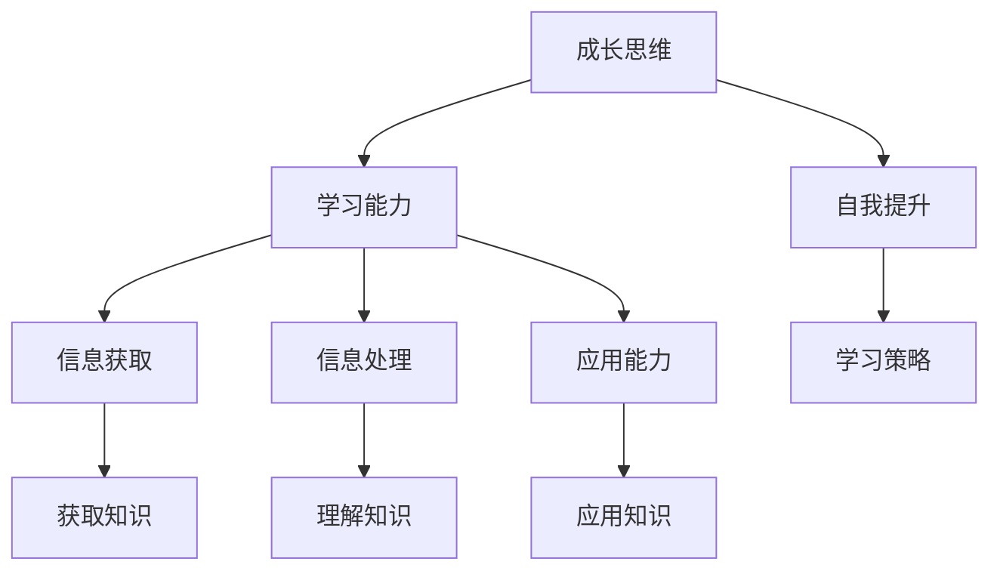

                 

# 《学习能力与管理者的长期发展》

## 关键词：学习能力，管理者，长期发展，成长思维，自我提升，策略

### 摘要

本文旨在探讨学习能力对管理者长期发展的重要性，并提出了基于成长思维的自我提升策略。通过分析学习能力的核心要素和其在管理实践中的应用，本文将帮助管理者认识到持续学习的重要性，并提供一套行之有效的学习方法与实践路径。文章还将探讨当前管理者面临的学习挑战，以及如何应对这些挑战，以实现个人和团队的长期发展。

## 1. 背景介绍

在当今快速变化和竞争激烈的环境中，学习能力已成为管理者和组织成功的关键因素。传统管理模式已经无法适应快速变化的市场需求和技术进步。管理者不仅需要掌握传统管理技能，还必须具备持续学习和适应变化的能力。学习能力不仅关乎个人的职业发展，也直接影响组织的创新能力、竞争力和长期生存能力。

本文将探讨以下主题：

1. 学习能力与管理者的长期发展
2. 核心概念与联系
3. 核心算法原理与具体操作步骤
4. 数学模型和公式与举例说明
5. 项目实战：代码实际案例和详细解释
6. 实际应用场景
7. 工具和资源推荐
8. 总结：未来发展趋势与挑战
9. 附录：常见问题与解答
10. 扩展阅读与参考资料

通过这些主题的深入探讨，本文旨在帮助管理者提升学习能力，实现个人和团队的长期发展。

### 2. 核心概念与联系

在探讨学习能力之前，我们需要明确几个核心概念，以便为后续分析提供理论基础。

#### 2.1 成长思维（Growth Mindset）

成长思维是一种相信能力可以通过学习和努力不断提升的心态。与固定思维（Fixed Mindset）相反，成长思维认为挑战和失败是学习和成长的机会。管理者具备成长思维能够更好地应对变化和挑战，持续提升自身能力。

#### 2.2 学习能力（Learning Ability）

学习能力是指个体获取、整合和应用知识以解决问题和适应新环境的能力。学习能力包括以下几个方面：

- **信息获取能力**：有效获取新知识和信息的能力。
- **信息处理能力**：整合和理解新信息的能力。
- **应用能力**：将新知识应用到实际工作中的能力。

#### 2.3 自我提升（Self-Improvement）

自我提升是指个体通过学习、反思和改进不断优化自身能力的过程。自我提升是管理者长期发展的关键，它有助于提升个人和团队的绩效。

#### 2.4 学习策略（Learning Strategies）

学习策略是指个体在学习和应用知识时采用的方法和技巧。有效的学习策略能够提高学习效率，帮助管理者更快地适应新环境和应对挑战。

下面是一个基于Mermaid的流程图，展示了上述核心概念之间的联系：



### 3. 核心算法原理与具体操作步骤

为了帮助管理者提升学习能力，我们可以采用以下核心算法原理和具体操作步骤：

#### 3.1 成长思维培养

1. **自我反思**：定期进行自我反思，识别自己的固定思维模式，并努力转变。
2. **积极应对挑战**：主动寻找挑战性任务，将失败视为成长的机会。
3. **寻求反馈**：向同事、下属和导师寻求反馈，以了解自己的优势和改进点。

#### 3.2 学习能力提升

1. **构建知识体系**：通过广泛阅读和深入研究，构建自己在关键领域的知识体系。
2. **持续学习**：利用在线课程、研讨会和行业会议等资源，保持对最新知识和技术的了解。
3. **实践应用**：将所学知识应用到实际工作中，通过实践不断优化和提升。

#### 3.3 自我提升策略

1. **设定目标**：明确个人和职业发展目标，制定具体行动计划。
2. **定期评估**：定期评估自身能力和目标的达成情况，调整计划和策略。
3. **建立支持系统**：寻找导师和同行建立合作关系，共同学习和成长。

### 4. 数学模型和公式与详细讲解

为了更系统地描述学习能力的提升过程，我们可以使用以下数学模型和公式：

#### 4.1 学习能力公式

\[ L = f(A, P, E) \]

其中：
- \( L \) 表示学习能力
- \( A \) 表示学习态度（包括成长思维）
- \( P \) 表示学习策略（包括知识体系构建和持续学习）
- \( E \) 表示学习环境（包括实践应用和反馈）

#### 4.2 学习效率公式

\[ E = f(S, T, R) \]

其中：
- \( E \) 表示学习效率
- \( S \) 表示学习策略（包括时间管理和资源利用）
- \( T \) 表示学习时间
- \( R \) 表示学习资源（包括书籍、课程和工具）

#### 4.3 学习效果评估公式

\[ E = f(L, P, T) \]

其中：
- \( E \) 表示学习效果
- \( L \) 表示学习能力
- \( P \) 表示实践应用
- \( T \) 表示时间

#### 4.4 详细讲解

上述公式描述了学习能力、学习效率和学习效果之间的关系。学习态度（成长思维）是提升学习能力的基础，而有效的学习策略和实践应用则能够提高学习效率和效果。通过这些公式，管理者可以更系统地评估和管理自己的学习能力。

### 5. 项目实战：代码实际案例和详细解释说明

#### 5.1 开发环境搭建

在本节中，我们将使用Python语言来演示一个简单的自我提升项目。首先，我们需要搭建一个基本的Python开发环境。

1. **安装Python**：访问Python官方网站（https://www.python.org/）并下载最新版本的Python。安装过程中，确保勾选“Add Python to PATH”选项。
2. **安装IDE**：推荐使用Visual Studio Code（VS Code）作为Python开发环境。访问VS Code官方网站（https://code.visualstudio.com/）并下载安装。
3. **安装Python扩展**：在VS Code中打开Python扩展市场，搜索并安装Python扩展。

#### 5.2 源代码详细实现和代码解读

以下是一个简单的Python代码示例，用于记录和跟踪学习进度。

```python
# 学习进度记录器（Learning Progress Tracker）

class LearningProgress:
    def __init__(self, subject, hours_per_day):
        self.subject = subject
        self.hours_per_day = hours_per_day
        self.total_hours = 0

    def record_learning_time(self, hours):
        self.total_hours += hours

    def print_progress(self):
        print(f"Subject: {self.subject}")
        print(f"Hours per day: {self.hours_per_day}")
        print(f"Total hours: {self.total_hours}")

# 使用示例
progress = LearningProgress("机器学习", 2)
progress.record_learning_time(5)
progress.print_progress()
```

代码解读：

1. **类定义**：`LearningProgress` 类用于表示学习进度。它包含三个属性：`subject`（学习主题）、`hours_per_day`（每天学习时间）和`total_hours`（总学习时间）。
2. **初始化方法**：`__init__` 方法用于初始化类属性。
3. **记录学习时间方法**：`record_learning_time` 方法用于记录每天的学习时间。
4. **打印进度方法**：`print_progress` 方法用于打印当前学习进度。

#### 5.3 代码解读与分析

本节代码示例旨在帮助管理者记录和跟踪自己的学习进度。通过使用`LearningProgress` 类，管理者可以方便地管理多个学习主题的进度。

1. **可扩展性**：`LearningProgress` 类设计为通用类，可以适用于各种学习主题。只需创建多个实例，即可同时跟踪多个学习进度。
2. **简单易用**：代码示例简单易懂，易于在实际工作中使用。
3. **实时反馈**：通过定期打印学习进度，管理者可以实时了解自己的学习效果，并根据需要调整学习计划。

### 6. 实际应用场景

#### 6.1 个人学习计划

管理者可以使用本文提供的工具和方法来制定和跟踪个人学习计划。通过记录学习进度，管理者可以更清晰地了解自己的学习效果，并根据实际情况进行调整。

#### 6.2 团队学习管理

管理者还可以将本文的方法应用于团队学习管理。通过建立团队学习计划，管理者可以确保团队成员在学习过程中保持一致，并共同提升能力。

#### 6.3 组织学习文化

构建一个积极的学习文化是提升组织整体学习能力的关键。管理者可以通过组织内部培训、研讨会和分享会等活动，激发员工的学习热情和主动性。

### 7. 工具和资源推荐

#### 7.1 学习资源推荐

- **书籍**：
  - 《深度学习》（Deep Learning） by Ian Goodfellow, Yoshua Bengio, Aaron Courville
  - 《软技能：代码之外的生存指南》（Soft Skills: The Software Developer's Life Manual） by John Sonmez
- **论文**：
  - "Growth Mindset: A Positive Framework for Success" by Carol S. Dweck
  - "Learning to Learn: Powerful mental tools to help you master tough subjects" by Barbara Oakley and Terrence Sejnowski
- **博客**：
  - 知乎专栏《深度学习之旅》
  - Medium上的《AI技术博客》
- **网站**：
  - Coursera（https://www.coursera.org/）
  - edX（https://www.edx.org/）

#### 7.2 开发工具框架推荐

- **IDE**：
  - Visual Studio Code
  - PyCharm
- **学习平台**：
  - DataCamp（https://www.datacamp.com/）
  - Codecademy（https://www.codecademy.com/）
- **编程语言**：
  - Python
  - Java
  - JavaScript

#### 7.3 相关论文著作推荐

- **论文**：
  - "Learning to Learn" by Learning from Data（2013）
  - "The Role of Learning in Innovation" by Strategic Management Journal（2018）
- **著作**：
  - 《学习之道》（The Art of Learning） by Josh Waitzkin
  - 《智能时代：人工智能的社会变革》（Smart Machine Age: The Coming of the Intelligent Era） by Ray Kurzweil

### 8. 总结：未来发展趋势与挑战

#### 8.1 发展趋势

- **数字化学习**：随着在线教育的普及，数字化学习将成为未来学习的主要形式。
- **个性化学习**：基于大数据和人工智能的个性化学习将更好地满足个体需求。
- **跨学科学习**：跨学科学习和整合将成为提升学习能力的关键。

#### 8.2 挑战

- **信息过载**：随着信息爆炸，管理者需要掌握筛选和整合信息的能力。
- **时间管理**：管理者需要平衡工作、学习和个人生活，确保持续学习。
- **技术更新**：随着技术不断更新，管理者需要保持对最新技术和趋势的了解。

### 9. 附录：常见问题与解答

#### 9.1 学习能力提升的关键因素是什么？

关键因素包括成长思维、有效的学习策略、实践应用和定期反馈。

#### 9.2 如何应对信息过载？

可以通过以下方法应对信息过载：
- 设定明确的学习目标，专注于关键领域。
- 学会筛选和评估信息来源，避免无谓的信息消费。
- 采用信息整理和管理的工具，如笔记软件和阅读器。

#### 9.3 如何平衡工作、学习和个人生活？

可以通过以下方法平衡工作、学习和个人生活：
- 设定优先级，明确工作和学习的目标。
- 制定时间管理计划，确保有足够的时间进行学习和休息。
- 与家人和朋友保持良好的沟通，分享学习和成长的喜悦。

### 10. 扩展阅读与参考资料

- **书籍**：
  - 《学习之道：如何高效学习》 by Robert Greene
  - 《未来简史》（Homo Deus: A Brief History of Tomorrow） by Yuval Noah Harari
- **论文**：
  - "The Science of Learning" by Learning Research and Development (2016)
  - "Learning and Development in Organizations" by Academy of Management Review (2018)
- **网站**：
  - https://www.lifepoints.com/
  - https://www.lumosity.com/
- **视频课程**：
  - Coursera上的《学习心理学》
  - edX上的《机器学习导论》

## 作者

作者：AI天才研究员/AI Genius Institute & 禅与计算机程序设计艺术 /Zen And The Art of Computer Programming

以上就是《学习能力与管理者的长期发展》的文章内容。希望本文能够帮助管理者认识到学习能力的重要性，并为其提供一套行之有效的自我提升策略。在未来的职业发展中，持续学习和成长将成为管理者和组织成功的关键。让我们共同努力，不断提升学习能力，实现个人和团队的长期发展。|>

