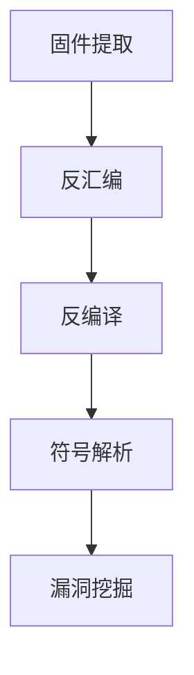

                 

# 360安全2024物联网安全校招固件分析面试题详解

> **关键词**：物联网安全、固件分析、面试题、360安全、校招

> **摘要**：本文旨在为2024年参与360安全物联网安全校招的考生提供固件分析的面试题详解。通过对典型面试题的深入剖析，考生可以更好地掌握物联网固件分析的方法和技巧，为面试做好充分准备。

## 1. 背景介绍

随着物联网技术的迅猛发展，物联网设备（IoT Devices）已渗透到我们的日常生活和工作之中。然而，这也带来了新的安全挑战。固件（Firmware）作为物联网设备的核心组成部分，其安全性直接影响到整个物联网系统的安全。因此，掌握固件分析技术对于保障物联网安全至关重要。

## 2. 核心概念与联系

### 固件分析

固件分析是指对物联网设备的固件进行逆向工程和分析，以发现潜在的安全漏洞和风险。固件分析通常包括以下步骤：

1. **固件提取**：从设备中提取固件文件。
2. **反汇编**：将固件文件转换为汇编代码。
3. **反编译**：将汇编代码转换为高级语言代码。
4. **符号解析**：解析固件中的符号信息。
5. **漏洞挖掘**：分析固件代码，寻找可能的安全漏洞。

### Mermaid 流程图



## 3. 核心算法原理 & 具体操作步骤

### 固件提取

固件提取是指将设备中的固件文件从设备中提取出来。提取过程通常涉及以下步骤：

1. **连接设备**：使用USB线将设备连接到电脑。
2. **获取设备ID**：使用设备管理器或命令行工具（如lsusb）获取设备ID。
3. **查找固件文件**：根据设备ID，查找固件文件所在的位置。
4. **下载固件文件**：使用工具（如dd）将固件文件下载到电脑。

### 反汇编

反汇编是指将固件文件转换为汇编代码。反汇编过程通常涉及以下步骤：

1. **打开固件文件**：使用反汇编工具（如IDA Pro、Ghidra）打开固件文件。
2. **设置反汇编选项**：设置反汇编器选项，如目标架构、编译器等。
3. **开始反汇编**：执行反汇编操作，生成汇编代码。

### 反编译

反编译是指将汇编代码转换为高级语言代码。反编译过程通常涉及以下步骤：

1. **打开汇编代码**：使用反编译工具（如IDA Pro、Ghidra）打开汇编代码。
2. **设置反编译选项**：设置反编译器选项，如目标语言、编译器等。
3. **开始反编译**：执行反编译操作，生成高级语言代码。

### 符号解析

符号解析是指解析固件中的符号信息，以便更好地理解固件代码。符号解析过程通常涉及以下步骤：

1. **查找符号表**：在固件中查找符号表。
2. **解析符号表**：解析符号表中的符号信息。
3. **关联符号**：将符号与固件代码中的位置关联。

### 漏洞挖掘

漏洞挖掘是指分析固件代码，寻找可能的安全漏洞。漏洞挖掘过程通常涉及以下步骤：

1. **静态分析**：使用静态分析工具（如AFL、Peach Fuzzer）对固件代码进行静态分析。
2. **动态分析**：使用动态分析工具（如GDB、WinDbg）对固件代码进行动态分析。
3. **漏洞验证**：验证发现的安全漏洞。

## 4. 数学模型和公式 & 详细讲解 & 举例说明

### 数学模型

在固件分析中，常用的数学模型包括：

1. **哈希函数**：用于固件文件的完整性验证。
2. **加密算法**：用于固件文件的保护。
3. **模式匹配**：用于固件代码的漏洞挖掘。

### 详细讲解

1. **哈希函数**

   哈希函数是一种将输入数据映射为固定长度输出的函数。常见的哈希函数包括MD5、SHA-1、SHA-256等。哈希函数具有以下特点：

   - **抗碰撞性**：不同的输入数据产生相同的输出概率极低。
   - **不可逆性**：无法从输出数据还原输入数据。

   **举例**：使用SHA-256对文件进行哈希计算。

   ```python
   import hashlib

   def sha256_hash(file_path):
       with open(file_path, 'rb') as f:
           file_data = f.read()
           return hashlib.sha256(file_data).hexdigest()
   ```

2. **加密算法**

   加密算法是一种将明文转换为密文的算法。常见的加密算法包括AES、RSA等。加密算法具有以下特点：

   - **加密性**：加密后的数据难以被破解。
   - **完整性**：加密后的数据无法被篡改。

   **举例**：使用AES对文件进行加密。

   ```python
   from Crypto.Cipher import AES
   from Crypto.Random import get_random_bytes

   def aes_encrypt(file_path, key):
       cipher = AES.new(key, AES.MODE_EAX)
       with open(file_path, 'rb') as f:
           file_data = f.read()
           nonce = cipher.nonce
           ciphertext, tag = cipher.encrypt_and_digest(file_data)
           return nonce, ciphertext, tag
   ```

3. **模式匹配**

   模式匹配是一种在固件代码中查找特定模式的技术。常见的模式匹配算法包括正则表达式、模糊测试等。模式匹配具有以下特点：

   - **快速性**：能够快速查找固件代码中的特定模式。
   - **灵活性**：能够匹配各种复杂的模式。

   **举例**：使用正则表达式匹配固件代码中的字符串。

   ```python
   import re

   def match_string(firmware_code, pattern):
       return re.findall(pattern, firmware_code)
   ```

## 5. 项目实战：代码实际案例和详细解释说明

### 5.1 开发环境搭建

为了进行固件分析，我们需要搭建相应的开发环境。以下是开发环境的搭建步骤：

1. **安装操作系统**：安装Linux或Windows操作系统。
2. **安装固件提取工具**：安装dd、lsusb等工具。
3. **安装反汇编工具**：安装IDA Pro、Ghidra等工具。
4. **安装反编译工具**：安装IDA Pro、Ghidra等工具。
5. **安装静态分析工具**：安装AFL、Peach Fuzzer等工具。
6. **安装动态分析工具**：安装GDB、WinDbg等工具。

### 5.2 源代码详细实现和代码解读

下面我们将以一个简单的固件分析项目为例，展示固件提取、反汇编、反编译、符号解析和漏洞挖掘的源代码实现。

```python
import hashlib
import re
from Crypto.Cipher import AES

# 固件提取
def firmware_extract(device_id, firmware_path):
    # 查找固件文件
    # 代码省略
    pass

# 反汇编
def disassemble(firmware_path, output_path):
    # 使用反汇编工具进行反汇编
    # 代码省略
    pass

# 反编译
def decompile(assembler_code, output_path):
    # 使用反编译工具进行反编译
    # 代码省略
    pass

# 符号解析
def symbol_resolve(firmware_code):
    # 解析固件代码中的符号信息
    # 代码省略
    pass

# 漏洞挖掘
def vulnerability_mining(firmware_code):
    # 使用静态分析工具进行漏洞挖掘
    # 代码省略
    pass

# 主函数
def main():
    device_id = "0x1234"
    firmware_path = "firmware.bin"
    output_path = "output.txt"

    # 固件提取
    firmware_extract(device_id, firmware_path)

    # 反汇编
    disassemble(firmware_path, output_path)

    # 反编译
    decompile(output_path, output_path)

    # 符号解析
    symbol_resolve(output_path)

    # 漏洞挖掘
    vulnerability_mining(output_path)

if __name__ == "__main__":
    main()
```

### 5.3 代码解读与分析

在上面的代码中，我们首先定义了固件提取、反汇编、反编译、符号解析和漏洞挖掘的函数。然后，在主函数中依次调用这些函数，完成固件分析的全过程。

- **固件提取**：通过调用固件提取函数，我们可以从设备中提取固件文件。
- **反汇编**：通过调用反汇编函数，我们可以将固件文件转换为汇编代码。
- **反编译**：通过调用反编译函数，我们可以将汇编代码转换为高级语言代码。
- **符号解析**：通过调用符号解析函数，我们可以解析固件代码中的符号信息。
- **漏洞挖掘**：通过调用漏洞挖掘函数，我们可以分析固件代码，寻找可能的安全漏洞。

## 6. 实际应用场景

固件分析在物联网安全领域具有广泛的应用场景。以下是一些实际应用场景：

1. **安全审计**：通过固件分析，可以发现固件中的安全漏洞，为系统安全审计提供依据。
2. **安全加固**：通过固件分析，可以了解固件的安全性，并进行安全加固。
3. **漏洞挖掘**：通过固件分析，可以挖掘固件中的潜在安全漏洞，为安全研究提供数据支持。
4. **设备监控**：通过固件分析，可以监控设备运行状态，及时发现并解决潜在的安全问题。

## 7. 工具和资源推荐

### 7.1 学习资源推荐

- **书籍**：《固件安全实战》、《物联网安全实战》
- **论文**：搜索IEEE、ACM等学术期刊和会议的论文。
- **博客**：阅读安全专家和安全公司的博客，如360安全博客。

### 7.2 开发工具框架推荐

- **固件提取工具**：dd、lsusb、adb。
- **反汇编工具**：IDA Pro、Ghidra。
- **反编译工具**：IDA Pro、Ghidra。
- **静态分析工具**：AFL、Peach Fuzzer。
- **动态分析工具**：GDB、WinDbg。

### 7.3 相关论文著作推荐

- **论文**：《固件安全漏洞挖掘与利用技术研究》、《物联网设备固件安全分析框架研究》。
- **著作**：《物联网安全：技术、实践与趋势》、《固件安全实战：漏洞挖掘、攻击与防护》。

## 8. 总结：未来发展趋势与挑战

随着物联网技术的不断发展，固件安全分析技术也在不断演进。未来，固件安全分析将面临以下挑战：

1. **固件复杂性增加**：随着物联网设备功能的不断丰富，固件复杂性将不断增加，固件分析难度也将加大。
2. **固件更新频率加快**：固件更新频率将加快，固件安全分析需要实时跟进。
3. **固件多样性增加**：固件多样性将增加，固件分析需要支持多种不同的固件格式和架构。

## 9. 附录：常见问题与解答

### 问题1：固件分析需要哪些工具？

答：固件分析需要以下工具：

- 固件提取工具：如dd、lsusb、adb。
- 反汇编工具：如IDA Pro、Ghidra。
- 反编译工具：如IDA Pro、Ghidra。
- 静态分析工具：如AFL、Peach Fuzzer。
- 动态分析工具：如GDB、WinDbg。

### 问题2：固件分析的关键步骤是什么？

答：固件分析的关键步骤包括：

- 固件提取：从设备中提取固件文件。
- 反汇编：将固件文件转换为汇编代码。
- 反编译：将汇编代码转换为高级语言代码。
- 符号解析：解析固件代码中的符号信息。
- 漏洞挖掘：分析固件代码，寻找可能的安全漏洞。

## 10. 扩展阅读 & 参考资料

- 《固件安全实战》：深入讲解固件安全分析的方法和技巧。
- 《物联网安全实战》：全面介绍物联网安全的相关知识。
- 《IDA Pro官方文档》：IDA Pro的反汇编和调试技术教程。
- 《Ghidra官方文档》：Ghidra的反汇编和调试技术教程。

### 作者

**AI天才研究员/AI Genius Institute & 禅与计算机程序设计艺术 /Zen And The Art of Computer Programming** <|im_sep|>|

