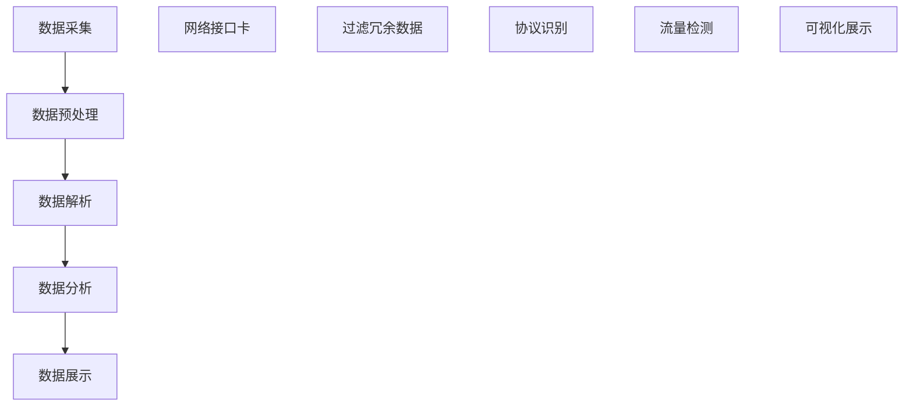
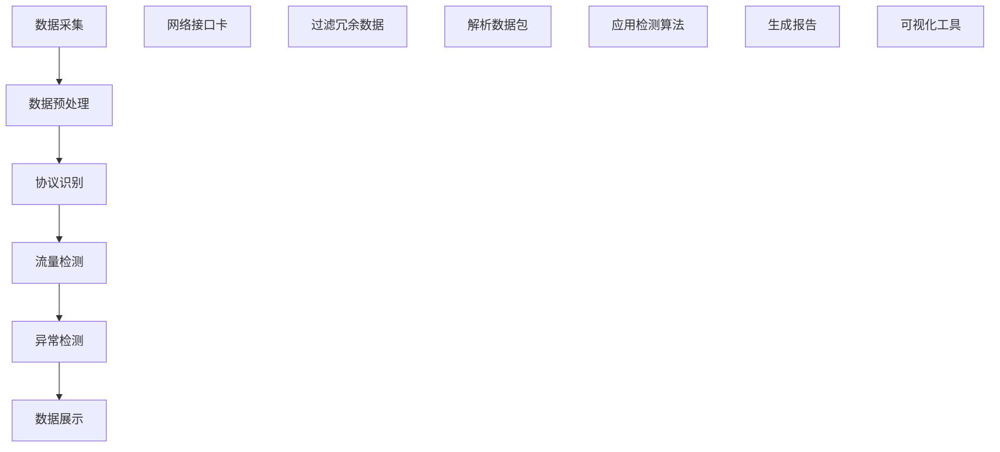
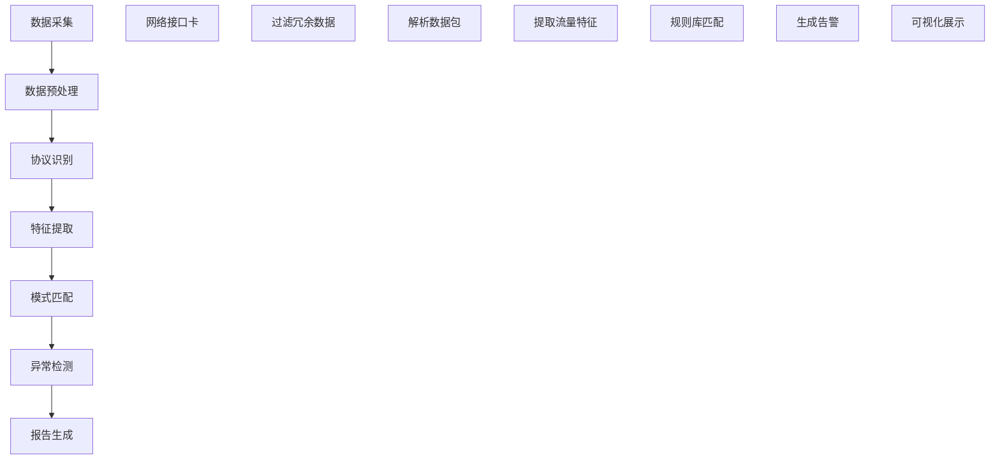

                 

### 背景介绍

**360安全2024网络流量分析专家校招面试真题**是一篇专门针对网络安全领域的技术面试题目。网络流量分析在网络安全领域扮演着至关重要的角色，通过分析网络流量可以有效地识别潜在的安全威胁和异常行为，从而采取相应的措施进行防范。本文旨在通过详细的解析，帮助读者更好地理解和掌握网络流量分析的相关知识和技能。

网络流量分析技术的重要性不言而喻。随着互联网的普及和发展，网络攻击的手段和形式日益多样化，网络流量分析成为了检测和防御网络攻击的重要手段。网络流量分析不仅可以识别恶意流量，防止网络入侵，还可以监控网络带宽使用情况，优化网络资源分配。因此，网络流量分析在网络安全防护体系中占据了核心地位。

本文将从以下几个角度对网络流量分析进行深入探讨：

1. **核心概念与联系**：介绍网络流量分析的基本概念，包括网络流量、数据包、协议等，并通过Mermaid流程图展示网络流量分析的整体架构。
2. **核心算法原理 & 具体操作步骤**：详细解析网络流量分析的核心算法，包括流量检测算法、异常检测算法等，并给出具体的操作步骤。
3. **数学模型和公式 & 详细讲解 & 举例说明**：介绍网络流量分析中常用的数学模型和公式，并给出详细的讲解和实际应用案例。
4. **项目实战：代码实际案例和详细解释说明**：通过实际项目案例，展示网络流量分析的具体实现过程，并对关键代码进行详细解读。
5. **实际应用场景**：分析网络流量分析在不同场景下的应用，如网络安全、网络优化等。
6. **工具和资源推荐**：推荐学习网络流量分析的相关资源和工具，包括书籍、论文、博客、网站等。
7. **总结：未来发展趋势与挑战**：总结网络流量分析的发展趋势和面临的挑战，为未来的研究和应用提供方向。

通过对这些内容的深入分析，读者可以全面了解网络流量分析的基本原理和应用方法，为实际工作中的应用打下坚实的基础。

#### 1.1 网络流量的基本概念

网络流量是指在网络中传输的数据量，通常以比特（bit）或字节（byte）为单位来衡量。网络流量可以按照传输方向分为上行流量（上行数据传输）和下行流量（下行数据传输）。网络流量也可以根据传输的协议进行分类，如TCP流量、UDP流量、ICMP流量等。

数据包（Packet）是网络传输中的基本单位，它包含了传输数据的完整信息，如源地址、目的地址、协议类型等。数据包在网络中通过分层结构进行传输，每层都会添加相应的头部信息，以确保数据的正确传输。

协议（Protocol）是网络通信中用于数据交换的规则和标准。常见的网络协议包括TCP（传输控制协议）、UDP（用户数据报协议）、HTTP（超文本传输协议）等。不同协议在网络流量分析中扮演着不同的角色，TCP协议通常用于可靠的数据传输，而UDP协议则更适用于实时传输。

在网络流量分析中，协议的识别和分析是关键的一步。通过识别数据包中的协议类型，可以进一步解析数据包的内容，从而获取网络流量的详细信息。例如，通过分析HTTP协议的数据包，可以获取网页的访问记录、用户行为等。

#### 1.2 网络流量分析的整体架构

网络流量分析的整体架构可以分为数据采集、数据预处理、数据分析和数据展示四个主要环节。以下是一个简化的Mermaid流程图，展示了网络流量分析的基本流程：



**数据采集**：数据采集是网络流量分析的第一步，通过捕获网络数据包来实现。数据采集可以使用网络接口卡（如Wireshark）或专门的流量采集设备（如Sniffer）。网络接口卡可以直接插入计算机的PCIe插槽，实时捕获网络流量。

**数据预处理**：数据预处理主要是对原始数据进行清洗和过滤，去除无关的冗余数据。这一步骤非常重要，因为原始数据量通常非常大，直接进行分析会消耗大量的计算资源。通过过滤冗余数据，可以显著提高数据分析和处理的效率。

**数据解析**：数据解析是指对预处理后的数据进行协议识别和内容解析。通过识别数据包中的协议类型，可以进一步解析数据包的内容，如HTTP请求、FTP传输等。这一步骤是网络流量分析的核心，决定了分析结果的准确性和完整性。

**数据分析**：数据分析是对解析后的数据进行处理和分析，以识别潜在的威胁和异常行为。常见的分析方法包括流量检测、异常检测等。通过数据分析，可以获取网络流量模式、用户行为等信息。

**数据展示**：数据展示是将分析结果以可视化的形式呈现给用户，便于理解和分析。常见的展示形式包括图表、报表等。通过数据展示，用户可以直观地了解网络流量情况，及时发现和应对潜在的安全威胁。

以上四个环节相互配合，构成了完整的网络流量分析架构。网络流量分析不仅需要高效的数据采集和处理技术，还需要深入理解网络协议和数据分析方法，才能实现有效的网络安全防护。

### 2. 核心概念与联系

在深入探讨网络流量分析之前，有必要明确一些核心概念，并理解它们之间的联系。网络流量分析涉及多个层次的技术和概念，从数据包的捕获与解析到流量特征提取和算法应用。以下是本文中涉及的一些核心概念及其相互关系：

**2.1 网络协议**

网络协议是网络通信的基本规则，它定义了数据如何在网络中传输、路由、接收和解释。主要的网络协议包括：

- **TCP（传输控制协议）**：提供面向连接、可靠的字节流传输。它通过序列号、确认和重传机制确保数据的完整性和可靠性。
- **UDP（用户数据报协议）**：提供无连接的数据传输，不保证数据的可靠性，但速度快，适用于实时应用。
- **ICMP（互联网控制消息协议）**：用于网络诊断和错误报告，如ping命令使用ICMP回显请求和回应。

**2.2 数据包（Packet）**

数据包是网络传输的基本单位，它包含源地址、目的地址、协议类型等信息。数据包在网络中通过分层结构传输，每一层都会添加相应的头部信息，如以太网帧头、IP头部、TCP头部等。

**2.3 流量分类与标记**

流量分类与标记是网络流量分析的重要环节，它有助于区分不同类型的流量，如HTTP、FTP、DNS等。通过标记流量，可以应用不同的策略进行管理和控制。

**2.4 流量检测算法**

流量检测算法用于识别和标记潜在的恶意流量或异常行为。常见的算法包括：

- **基于特征的方法**：使用已知攻击模式的特征进行匹配。
- **基于统计的方法**：使用统计学方法检测异常流量，如基于自回归模型的流量检测。
- **机器学习算法**：如支持向量机（SVM）、神经网络等，通过训练模型识别异常流量。

**2.5 异常检测算法**

异常检测算法用于识别网络中的异常行为，这些行为可能是由于恶意攻击或误操作引起的。常见的异常检测算法包括：

- **基于阈值的检测**：通过设定阈值，检测超出阈值的流量异常。
- **聚类算法**：如K-means、DBSCAN等，通过聚类分析识别异常点。
- **基于规则的检测**：通过定义规则，检测违反规则的异常行为。

**2.6 Mermaid流程图**

为了更好地展示网络流量分析的整体架构，可以使用Mermaid流程图来描述各组件之间的联系和交互。以下是一个简化的Mermaid流程图，展示了网络流量分析的主要步骤：



在这个流程图中：

- **数据采集**：使用网络接口卡捕获网络数据包。
- **数据预处理**：过滤冗余数据，提取有效流量。
- **协议识别**：解析数据包，识别流量类型和协议。
- **流量检测**：应用流量检测算法，识别潜在威胁。
- **异常检测**：应用异常检测算法，识别异常行为。
- **数据展示**：将分析结果以可视化的形式呈现，便于理解和分析。

通过上述核心概念的介绍和Mermaid流程图的展示，我们可以清晰地理解网络流量分析的整体架构和关键步骤。接下来，本文将进一步深入探讨网络流量分析的核心算法原理和具体操作步骤。

#### 2.1 网络协议的基本概念

网络协议是计算机网络中用于数据传输和通信的规则和标准。这些协议定义了数据如何在网络中传输、路由、接收和解释，是确保网络通信可靠性和有效性的基础。以下是几个重要的网络协议的基本概念：

**TCP（传输控制协议）**

TCP是一种面向连接的、可靠的字节流传输协议。它通过三次握手建立连接，确保数据传输的可靠性和完整性。TCP使用序列号、确认和重传机制来保证数据的正确传输。序列号用于标识数据包的顺序，确认用于确认数据包的接收，重传机制确保未成功传输的数据包能够被重新发送。

**UDP（用户数据报协议）**

UDP是一种无连接的数据传输协议，它不保证数据的可靠性，但速度较快。UDP适用于对实时性要求较高的应用，如视频通话、在线游戏等。UDP使用端口来标识不同的应用程序，每个数据包独立传输，不需要建立连接。

**ICMP（互联网控制消息协议）**

ICMP是一种用于网络诊断和错误报告的协议。它通常用于发送回显请求和回应（如ping命令），用于检测网络的连通性和延迟。ICMP还用于发送错误消息，如目标主机不可达、超时等。

**HTTP（超文本传输协议）**

HTTP是用于Web浏览器和服务器之间通信的协议。它定义了请求和响应的格式，是Web服务的基础。HTTP是一种无状态协议，每个请求都是独立的，服务器不保存之前的请求状态。

**FTP（文件传输协议）**

FTP是一种用于文件传输的协议，它允许用户在网络上传输文件。FTP使用两个TCP连接：控制连接和数据连接。控制连接用于传输命令和响应，数据连接用于传输文件数据。

**DNS（域名系统）**

DNS是一种用于域名和IP地址之间转换的协议。它将人类可读的域名解析为计算机可识别的IP地址，使得用户可以通过域名访问网络资源。

**SSH（安全外壳协议）**

SSH是一种用于安全远程登录和数据传输的协议。它提供加密的数据传输和身份验证，广泛应用于远程服务器管理和网络设备配置。

了解这些网络协议的基本概念对于网络流量分析至关重要。通过识别和解析网络流量中的协议类型，我们可以进一步分析数据包的内容，识别不同的流量特征，从而实现有效的网络流量监控和分析。

#### 2.2 数据包的结构与内容

数据包是网络传输中的基本单位，它包含了传输数据的完整信息，并遵循特定的格式和结构。一个典型的数据包通常包含多个层次的结构，每一层都添加了特定的头部信息，以确保数据能够在网络中正确传输。以下是数据包的基本结构和内容：

**1. 以太网帧（Ethernet Frame）**

以太网帧是数据包在网络层的第一层，它定义了数据包在局域网（LAN）中的传输格式。以太网帧的基本结构包括：

- **源MAC地址**：数据包发送方的物理地址。
- **目的MAC地址**：数据包接收方的物理地址。
- **类型字段**：指示上层协议类型，如IP、ARP等。
- **数据**：上层协议的数据部分。
- **校验字段**：用于验证以太网帧的完整性。

**2. IP数据包（Internet Protocol Packet）**

IP数据包是网络层的第二层，它定义了数据包在网络中的传输路径。IP数据包的基本结构包括：

- **版本和头部长度**：指示IP协议的版本号和头部长度。
- **服务类型**：定义数据包的服务质量。
- **总长度**：数据包的总长度，包括头部和数据部分。
- **标识、标志和片偏移**：用于分片和重组数据包。
- **生存时间（TTL）**：数据包在网络中的存活时间，用于防止数据包在网络中无限循环。
- **协议**：指示上层协议类型，如TCP、UDP等。
- **头部校验和**：用于验证IP头部的完整性。
- **源IP地址**：数据包发送方的IP地址。
- **目的IP地址**：数据包接收方的IP地址。
- **数据**：上层协议的数据部分。

**3. TCP报文段（TCP Segment）**

TCP报文段是传输层的第三层，它用于实现可靠的数据传输。TCP报文段的基本结构包括：

- **源端口号和目的端口号**：标识数据包的发送方和接收方的应用程序。
- **序列号和确认号**：用于保证数据的顺序传输和确认。
- **数据偏移、保留、标志字段**：用于控制数据传输的各种选项。
- **窗口、检验和、紧急指针**：用于控制数据传输的流量和错误检测。
- **数据**：传输层的数据部分。

**4. UDP数据报（UDP Datagram）**

UDP数据报是传输层的第四层，它用于实现快速的无连接数据传输。UDP数据报的基本结构包括：

- **源端口号和目的端口号**：标识数据包的发送方和接收方的应用程序。
- **长度和检验和**：用于指示数据报的长度和校验值。

通过理解这些数据包的结构和内容，我们可以更好地进行网络流量分析。例如，通过解析以太网帧，我们可以识别数据包的源和目的MAC地址；通过解析IP数据包，我们可以获取源IP地址和目的IP地址，从而确定数据包的传输路径；通过解析TCP报文段，我们可以了解数据传输的序列号、确认号等信息，从而实现可靠的数据传输。

在接下来的章节中，我们将进一步探讨网络流量分析的核心算法原理和具体操作步骤，帮助读者更深入地了解网络流量分析的技术细节。

#### 2.3 流量检测算法

流量检测算法是网络流量分析中的核心组成部分，主要用于识别潜在的恶意流量和异常行为。这些算法可以分为基于特征的方法、基于统计的方法和机器学习算法三类。以下是各类算法的基本原理和常见应用：

**1. 基于特征的方法**

基于特征的方法通过预先定义的恶意流量特征来检测网络中的异常行为。这种方法通常依赖于规则库或特征库，通过对流量数据进行模式匹配来识别恶意流量。其基本原理如下：

- **规则库**：规则库包含一系列预定义的规则，每条规则描述了一种可能的恶意行为或异常特征。规则通常以正则表达式或模式匹配的形式表示。
- **模式匹配**：将网络流量数据与规则库中的规则进行匹配，识别符合规则的数据包。匹配成功即表明检测到恶意流量。

基于特征的方法优点在于实现简单、响应速度快，但缺点是规则库需要不断更新以应对新的威胁，且可能误报和漏报。

**应用实例**：Snort是一个典型的基于特征的方法的流量检测工具，它使用规则库来识别网络中的恶意流量，如DDoS攻击、木马传播等。

**2. 基于统计的方法**

基于统计的方法通过分析流量数据的统计特征来识别异常行为。这种方法不依赖于预先定义的特征，而是通过机器学习模型来识别正常的流量模式，并利用对比分析来识别异常流量。其基本原理如下：

- **特征提取**：从网络流量数据中提取一系列统计特征，如流量速率、数据包大小分布、协议使用频率等。
- **模型训练**：使用机器学习算法（如自回归模型、K-means聚类等）对正常流量数据进行训练，建立流量模式模型。
- **异常检测**：通过对比实际流量数据与训练得到的流量模式模型，识别异常流量。常见的异常检测方法包括基于阈值的检测和聚类分析。

基于统计的方法优点在于能够自动发现新的异常行为，但缺点是模型训练和检测过程可能较为复杂，且误报率较高。

**应用实例**：基于统计的方法常用于网络流量监控和异常检测系统，如Suricata和Bro等。

**3. 机器学习算法**

机器学习算法通过训练模型来自动识别恶意流量和异常行为。与基于特征和统计的方法不同，机器学习算法可以从大量数据中自动发现特征和模式，从而提高检测的准确性和鲁棒性。其基本原理如下：

- **特征工程**：从网络流量数据中提取一系列特征，如流量速率、数据包大小、协议类型等。
- **模型训练**：使用训练数据集训练机器学习模型（如支持向量机SVM、神经网络、随机森林等），以识别正常的流量模式和异常行为。
- **流量检测**：将实际流量数据输入训练好的模型，根据模型的输出结果识别恶意流量或异常行为。

机器学习算法优点在于检测能力强、自适应性好，但缺点是模型训练和检测过程较为复杂，且对数据量和计算资源要求较高。

**应用实例**：机器学习算法广泛应用于现代网络安全系统，如DeepLearning4Security项目，它使用深度学习技术进行网络流量分析。

#### 2.4 常见的流量检测算法

在流量检测领域，有几种算法被广泛研究和应用。以下是几种常见的流量检测算法及其工作原理：

**1. 基于自回归模型的流量检测**

自回归模型（AR模型）是一种基于时间序列分析的流量检测方法。它假设当前时刻的流量值可以通过前几个时刻的流量值来预测，从而检测异常流量。其基本原理如下：

- **模型建立**：根据历史流量数据，建立自回归模型。模型通常表示为 \( X_t = c + \sum_{i=1}^k \phi_i X_{t-i} + \varepsilon_t \)，其中 \( X_t \) 是第 \( t \) 时刻的流量值， \( c \) 是常数项， \( \phi_i \) 是回归系数， \( \varepsilon_t \) 是误差项。
- **异常检测**：通过计算模型预测值与实际流量值之间的差异，检测异常流量。通常使用统计方法（如均值、标准差）来设定阈值，当差异超过阈值时，认为存在异常流量。

**2. 聚类分析**

聚类分析是一种无监督学习方法，它将相似的流量数据分组到同一个簇中。通过分析簇内的流量特征，可以识别异常流量。常见的聚类算法包括K-means和DBSCAN等。其基本原理如下：

- **数据预处理**：对流量数据进行特征提取和标准化处理，以消除数据量级差异。
- **聚类**：使用K-means或DBSCAN算法对流量数据进行聚类。K-means算法通过迭代计算聚类中心，将数据点分配到最近的聚类中心；DBSCAN算法基于邻域和密度连接数据点，形成不同的簇。
- **异常检测**：分析聚类结果，识别流量特征与正常簇差异较大的数据点，认为这些数据点代表异常流量。

**3. 支持向量机（SVM）**

支持向量机是一种二分类模型，它通过找到一个最佳的超平面，将正常流量和异常流量分开。其基本原理如下：

- **特征提取**：从流量数据中提取一系列特征，如流量速率、数据包大小、协议类型等。
- **模型训练**：使用训练数据集，训练SVM模型，找到最佳超平面。SVM模型将特征映射到高维空间，并通过最大化分类间隔来选择最佳超平面。
- **流量检测**：将实际流量数据输入训练好的SVM模型，根据模型的输出结果（支持向量）识别异常流量。

**4. 神经网络**

神经网络是一种通过模拟人脑神经网络结构进行学习的算法。它通过多层神经元的相互连接，对流量数据进行分析和分类。其基本原理如下：

- **网络结构**：神经网络通常包括输入层、隐藏层和输出层。输入层接收流量数据，隐藏层进行特征提取和变换，输出层进行分类和预测。
- **训练**：使用有标签的训练数据集，通过反向传播算法训练神经网络，调整网络参数，使其能够正确分类正常流量和异常流量。
- **流量检测**：将实际流量数据输入训练好的神经网络，根据输出结果识别异常流量。

这些算法各有优缺点，适用于不同的应用场景。在实际应用中，通常结合多种算法，以提高检测的准确性和鲁棒性。

#### 2.5 Mermaid流程图

为了更好地展示流量检测算法的工作流程，我们可以使用Mermaid流程图来描述各步骤之间的联系和交互。以下是一个简化的Mermaid流程图，展示了基于特征的方法的流量检测流程：



在这个流程图中：

- **数据采集**：使用网络接口卡捕获网络数据包。
- **数据预处理**：过滤冗余数据，提取有效流量。
- **协议识别**：解析数据包，识别流量类型和协议。
- **特征提取**：从流量数据中提取特征，如流量速率、数据包大小等。
- **模式匹配**：将提取的特征与规则库中的规则进行匹配，识别恶意流量。
- **异常检测**：根据模式匹配的结果，识别异常流量，生成告警。
- **报告生成**：将分析结果以报告的形式展示，便于进一步分析。

通过上述流程，我们可以看到流量检测算法从数据采集到报告生成的一系列步骤。接下来，本文将继续探讨网络流量分析的核心算法原理和具体操作步骤。

#### 2.6 异常检测算法

异常检测算法在网络流量分析中起着至关重要的作用，它用于识别网络中的异常行为，这些行为可能是由于恶意攻击、误操作或系统故障引起的。异常检测算法可以分为基于阈值的检测、聚类算法和基于规则的检测等方法。

**1. 基于阈值的检测**

基于阈值的检测方法是一种简单且直观的异常检测方法。它通过设定一个或多个阈值来识别异常流量。当流量数据超过这些阈值时，即认为存在异常行为。阈值可以是绝对阈值，也可以是相对阈值。

- **绝对阈值**：根据历史数据或经验设定一个绝对值阈值，当流量值超过该阈值时，视为异常。
- **相对阈值**：根据流量数据的变化率或增长速度设定阈值，如某个流量特征的变化率超过一定百分比时，视为异常。

基于阈值的检测方法的优点是实现简单、计算速度快，但缺点是阈值设定较为困难，且可能产生误报和漏报。

**应用实例**：基于阈值的检测方法常用于网络带宽监控和流量异常检测系统中，如Nagios。

**2. 聚类算法**

聚类算法是一种无监督学习方法，它将相似的流量数据分组到同一个簇中。通过分析簇内的流量特征，可以识别异常流量。常见的聚类算法包括K-means和DBSCAN等。

- **K-means算法**：K-means算法通过迭代计算聚类中心，将数据点分配到最近的聚类中心。它假设簇的形状是球形的，且每个簇的个数是预先设定的。

- **DBSCAN算法**：DBSCAN算法基于邻域和密度连接数据点，形成不同的簇。它不要求簇的形状是球形的，且可以自动确定簇的个数。

聚类算法的优点在于能够自动发现新的异常行为，但缺点是计算复杂度较高，且对噪声数据敏感。

**应用实例**：聚类算法常用于网络流量异常检测和异常流量聚类分析系统中，如MATLAB的Clustering Toolbox。

**3. 基于规则的检测**

基于规则的检测方法通过定义一系列规则来识别异常流量。这些规则可以是基于协议特征、流量特征或行为特征等。当流量数据违反这些规则时，即认为存在异常行为。

- **静态规则**：静态规则是预先定义好的，通常基于历史数据和经验。例如，如果某个IP地址在一段时间内发送大量TCP SYN数据包，可以认为该IP地址存在恶意扫描行为。

- **动态规则**：动态规则是通过机器学习模型或专家系统自动生成的。例如，通过分析大量正常和异常流量数据，训练一个分类模型，然后根据模型的输出结果识别异常流量。

基于规则的检测方法的优点是规则定义灵活，可以针对特定的异常行为进行定制，但缺点是规则库需要不断更新，且可能产生误报和漏报。

**应用实例**：基于规则的检测方法常用于入侵检测系统和防火墙中，如Snort。

**4. 常见异常检测算法**

以下是几种常见的异常检测算法及其工作原理：

**1. 单变量统计方法**

单变量统计方法是通过分析单个流量特征来检测异常。常见的统计方法包括：

- **标准差方法**：计算流量特征的标准差，当流量值超过一定倍数的标准差时，视为异常。
- **分位数方法**：计算流量特征的分位数，当流量值超过上分位数或低于下分位数时，视为异常。

**2. 多变量统计方法**

多变量统计方法是通过分析多个流量特征之间的关系来检测异常。常见的统计方法包括：

- **离群连接分析**：分析流量特征之间的相关性，识别异常连接。
- **主成分分析**：将多个流量特征映射到低维空间，识别异常点。

**3. 自适应统计方法**

自适应统计方法是通过不断更新统计模型来适应流量特征的变化。常见的自适应统计方法包括：

- **移动平均方法**：通过计算流量特征的历史平均值，动态调整阈值。
- **指数平滑方法**：通过加权平均历史数据和当前数据，动态调整统计模型。

**4. 聚类算法**

聚类算法通过将相似的流量数据分组到同一个簇中，识别异常流量。常见的聚类算法包括：

- **K-means算法**：通过迭代计算聚类中心，将数据点分配到最近的聚类中心。
- **DBSCAN算法**：基于邻域和密度连接数据点，形成不同的簇。

**5. 基于机器学习的方法**

基于机器学习的方法通过训练模型来自动识别异常流量。常见的机器学习方法包括：

- **支持向量机（SVM）**：通过找到一个最佳的超平面，将正常流量和异常流量分开。
- **神经网络**：通过多层神经元的相互连接，对流量数据进行分析和分类。

通过以上几种异常检测算法，我们可以对网络流量进行有效监控和分析，及时发现和应对潜在的安全威胁。接下来，本文将介绍网络流量分析的具体操作步骤。

#### 3. 核心算法原理 & 具体操作步骤

网络流量分析的核心算法涵盖了从流量检测到异常检测的多个方面。本节将详细阐述这些算法的基本原理，并给出具体的操作步骤。

**3.1 流量检测算法**

流量检测算法主要分为基于特征的方法、基于统计的方法和机器学习算法。以下分别介绍这些算法的原理和操作步骤。

**基于特征的方法**

**原理**：基于特征的方法通过预定义的恶意流量特征库来检测异常。每个特征代表一种可能的恶意行为，如特定IP地址、特定端口、特定的数据包内容等。

**操作步骤**：

1. **特征库构建**：收集并整理历史恶意流量数据，提取特征，构建特征库。特征可以是IP地址、端口号、数据包大小、协议类型等。

2. **模式匹配**：将实时捕获的流量数据与特征库进行匹配，如果匹配成功，则认为流量异常。

3. **阈值设定**：根据特征匹配的结果，设定异常检测的阈值，如匹配次数、匹配率等。

4. **结果处理**：如果流量数据超过设定的阈值，则生成告警信息，通知相关人员或系统。

**机器学习算法**

**原理**：机器学习算法通过训练模型来自动识别恶意流量。常见的机器学习算法包括支持向量机（SVM）、神经网络、随机森林等。

**操作步骤**：

1. **数据准备**：收集流量数据，进行预处理，提取特征，划分为训练集和测试集。

2. **模型选择**：选择合适的机器学习算法，如SVM、神经网络等。

3. **模型训练**：使用训练数据集训练模型，调整模型参数，使其能够准确分类正常和恶意流量。

4. **模型评估**：使用测试数据集评估模型性能，调整模型参数，以提高检测准确性。

5. **模型部署**：将训练好的模型部署到实时系统中，对捕获的流量数据进行分类和异常检测。

**基于统计的方法**

**原理**：基于统计的方法通过分析流量数据的统计特征，如均值、标准差、分位数等，检测异常流量。

**操作步骤**：

1. **特征提取**：从流量数据中提取统计特征，如流量速率、数据包大小、协议使用频率等。

2. **模型构建**：使用统计方法（如移动平均、指数平滑等）构建流量模型。

3. **异常检测**：计算当前流量数据与模型预测值的差异，如果差异超过设定阈值，则认为存在异常。

4. **结果处理**：记录并处理异常检测结果，生成告警信息。

**3.2 异常检测算法**

异常检测算法旨在识别网络中的异常行为，常见的算法包括基于阈值的检测、聚类算法和基于规则的检测等。

**基于阈值的检测**

**原理**：基于阈值的检测方法通过设定阈值来识别异常流量。当流量数据超过阈值时，即视为异常。

**操作步骤**：

1. **阈值设定**：根据历史数据或经验设定绝对阈值或相对阈值。

2. **流量监测**：实时监测流量数据，计算每个时间点的流量值。

3. **异常判定**：将流量值与阈值进行比较，如果流量值超过阈值，则判定为异常。

4. **结果处理**：记录并处理异常检测结果，生成告警信息。

**聚类算法**

**原理**：聚类算法通过将相似的流量数据分组到同一个簇中，识别异常流量。

**操作步骤**：

1. **数据预处理**：对流量数据进行标准化处理，消除不同特征之间的量级差异。

2. **聚类**：使用K-means或DBSCAN算法对流量数据进行聚类。

3. **簇分析**：分析每个簇的流量特征，识别异常簇。

4. **结果处理**：记录并处理异常检测结果，生成告警信息。

**基于规则的检测**

**原理**：基于规则的检测方法通过定义一系列规则来识别异常流量。

**操作步骤**：

1. **规则定义**：根据历史数据和经验，定义异常检测规则。

2. **模式匹配**：将实时捕获的流量数据与规则库进行匹配。

3. **异常判定**：如果流量数据违反规则，则判定为异常。

4. **结果处理**：记录并处理异常检测结果，生成告警信息。

通过上述操作步骤，我们可以有效地识别和检测网络流量中的异常行为，从而实现有效的网络安全防护。接下来，本文将介绍网络流量分析中的数学模型和公式，为读者提供更深入的理论支持。

#### 3.1 流量检测算法的数学模型和公式

流量检测算法的核心在于如何利用数学模型和公式对流量数据进行分析和识别。以下将介绍几种常见的流量检测算法及其背后的数学模型和公式。

**1. 基于自回归模型的流量检测**

自回归模型（AR模型）是一种时间序列分析方法，用于检测流量中的异常。其基本公式如下：

\[ X_t = c + \sum_{i=1}^k \phi_i X_{t-i} + \varepsilon_t \]

其中：
- \( X_t \) 是第 \( t \) 时刻的流量值；
- \( c \) 是常数项；
- \( \phi_i \) 是回归系数，表示第 \( i \) 个滞后期的流量对当前期的影响；
- \( \varepsilon_t \) 是误差项，表示随机噪声。

通过估计回归系数 \( \phi_i \)，可以建立自回归模型，用于预测当前时刻的流量值。当实际流量值与预测值差异较大时，可以判定为异常。

**2. 基于统计特征的方法**

统计特征方法通过计算流量数据的统计特征（如均值、标准差、分位数等）来检测异常。以下是几个常用的统计公式：

- **均值**：  
  \[ \mu = \frac{1}{n} \sum_{i=1}^n x_i \]  
  其中，\( \mu \) 是均值，\( x_i \) 是第 \( i \) 个数据点，\( n \) 是数据点数量。

- **标准差**：  
  \[ \sigma = \sqrt{\frac{1}{n-1} \sum_{i=1}^n (x_i - \mu)^2} \]  
  其中，\( \sigma \) 是标准差，表示数据分布的离散程度。

- **分位数**：  
  \[ Q_p = \left(1 - \frac{1}{n} \sum_{i=1}^n I(x_i \leq x_{(n)})\right) \times 100\% \]  
  其中，\( Q_p \) 是第 \( p \) 个分位数，\( x_{(n)} \) 是第 \( n \) 个数据点，\( I() \) 是指示函数，当条件满足时返回1，否则返回0。

通过计算这些统计特征，可以设定阈值，用于检测异常流量。例如，当某个流量特征值超过一定倍数的标准差时，可以判定为异常。

**3. 基于聚类分析的方法**

聚类分析通过将相似的数据点分组到同一个簇中，识别异常流量。常见的聚类算法包括K-means和DBSCAN。以下是这些算法的基本公式：

- **K-means算法**：  
  \[ \text{Objective Function} = \sum_{i=1}^k \sum_{x_j \in S_i} d(x_j, \mu_i)^2 \]  
  其中，\( S_i \) 是第 \( i \) 个簇，\( \mu_i \) 是簇中心，\( d() \) 是距离函数。

K-means算法通过迭代计算簇中心和数据点，使目标函数最小化。当簇中心稳定时，算法停止。

- **DBSCAN算法**：  
  DBSCAN算法基于邻域和密度连接数据点，形成不同的簇。其核心公式如下：

  \[ \text{Neighbor} = \{x | d(x, x_i) < \epsilon\} \]  
  \[ \text{Core} = \{x | \text{Neighbor}(x) \geq min\_pts\} \]  
  \[ \text{Border} = \{x | \text{Neighbor}(x) < min\_pts \text{ and } x \in \text{Core}(y)\} \]  
  \[ \text{Cluster}(x) = \{x \in \text{Core}(x) \cup \text{Border}(x) \cup \text{Neighbor}(x)\} \]

  其中，\( \epsilon \) 是邻域半径，\( min\_pts \) 是最小邻域点数。

通过这些公式，可以有效地识别网络流量中的异常行为。接下来，本文将介绍具体的流量检测算法实现步骤，帮助读者更好地理解和应用这些算法。

**3.1.1 流量检测算法实现步骤**

**1. 数据采集与预处理**

流量检测的第一步是采集网络数据，并将其预处理，以便后续分析。具体步骤如下：

- **数据采集**：使用网络接口卡捕获网络数据包，将其存储为文件或实时传输到分析系统。

- **去噪与去冗余**：去除不相关或重复的数据包，如广播、多播和本地流量。这可以通过过滤IP地址、端口号或协议类型等来实现。

- **解析数据包**：对捕获的数据包进行解析，提取关键信息，如源地址、目的地址、协议类型、数据包大小等。

- **特征提取**：从解析后的数据包中提取流量特征，如流量速率、数据包大小分布、协议使用频率等。

**2. 模型选择与参数调优**

选择合适的流量检测模型是关键步骤，不同模型适用于不同类型的流量特征和异常检测需求。以下是一些常见模型及其参数调优方法：

- **基于特征的方法**：使用规则库或机器学习模型（如SVM、神经网络等）。规则库的构建需要根据历史数据，而机器学习模型的训练需要大量数据。

- **基于统计的方法**：如自回归模型、移动平均模型等。参数调优可以通过交叉验证或网格搜索等方法进行。

- **基于机器学习的方法**：选择合适的机器学习算法（如SVM、随机森林、神经网络等），并调整模型参数（如学习率、正则化参数等），以提高检测准确性。

**3. 流量检测与异常判定**

在模型训练完成后，可以使用模型对实时流量数据进行检测，并判断是否存在异常。具体步骤如下：

- **流量数据输入**：将提取的流量特征输入训练好的模型。

- **模型预测**：使用模型对流量数据进行分类，判断其是否为正常或异常流量。

- **异常判定**：设定阈值或规则，当模型输出结果超过阈值或违反规则时，判定为异常流量。

**4. 结果处理与反馈**

检测结果需要及时处理，以采取相应的措施应对异常流量。以下是一些常见处理方法：

- **告警生成**：当检测到异常流量时，生成告警信息，通知相关人员或系统。

- **流量监控**：持续监测网络流量，记录和分析异常流量模式，以便进一步优化检测模型。

- **反馈机制**：根据检测结果和反馈，调整检测模型和参数，以提高检测准确性和效率。

通过以上步骤，我们可以有效地实现流量检测，及时发现和应对网络中的异常行为。接下来，本文将介绍网络流量分析中的数学模型和公式，为读者提供更深入的理论支持。

#### 3.2 数学模型和公式

网络流量分析中，数学模型和公式起着至关重要的作用。以下将介绍一些常见的数学模型和公式，并给出详细的解释和实际应用案例。

**1. 自回归模型（AR模型）**

自回归模型（AR模型）是一种用于时间序列分析的方法，它通过历史流量数据来预测当前流量值。AR模型的公式如下：

\[ X_t = c + \sum_{i=1}^k \phi_i X_{t-i} + \varepsilon_t \]

其中：
- \( X_t \) 是第 \( t \) 时刻的流量值；
- \( c \) 是常数项；
- \( \phi_i \) 是回归系数，表示第 \( i \) 个滞后期的流量对当前期的影响；
- \( \varepsilon_t \) 是误差项，表示随机噪声。

**解释**：自回归模型通过前 \( k \) 个滞后期的流量值来预测当前流量值，其中 \( k \) 是滞后阶数。回归系数 \( \phi_i \) 决定了历史流量对当前流量预测的影响程度。

**应用案例**：假设我们有一个网络流量时间序列数据，通过自回归模型来预测未来一个小时的网络流量。我们选择 \( k=3 \) 作为滞后阶数，计算回归系数 \( \phi_1 \)，\( \phi_2 \) 和 \( \phi_3 \)，然后使用公式 \( X_t = c + \phi_1 X_{t-1} + \phi_2 X_{t-2} + \phi_3 X_{t-3} + \varepsilon_t \) 来预测当前流量值。

**2. 主成分分析（PCA）**

主成分分析（PCA）是一种降维方法，它通过将数据投影到新的正交坐标系中来降低数据的维度。PCA的主要公式如下：

\[ Z = P \Lambda \]

其中：
- \( Z \) 是新的数据集；
- \( P \) 是投影矩阵；
- \( \Lambda \) 是特征值矩阵。

**解释**：PCA通过计算数据协方差矩阵的特征值和特征向量，构造一个投影矩阵 \( P \)，将数据投影到新的坐标系中。新的坐标系由主成分构成，每个主成分都是原始数据的一个线性组合，且具有最大的方差。

**应用案例**：假设我们有一个包含多个流量特征的流量数据集，通过PCA来降低数据的维度。我们计算协方差矩阵，找到特征值和特征向量，然后构建投影矩阵 \( P \)，将原始数据投影到新的坐标系中，从而提取最重要的流量特征。

**3. 支持向量机（SVM）**

支持向量机（SVM）是一种分类方法，它通过找到一个最佳的超平面来分隔不同类别的数据。SVM的主要公式如下：

\[ \text{最大化} \quad \frac{1}{2} \sum_{i=1}^n (\omega_i^2) - C \sum_{i=1}^n y_i (\omega_i \cdot x_i + b) \]

其中：
- \( \omega_i \) 是支持向量机的权重向量；
- \( C \) 是惩罚参数；
- \( y_i \) 是第 \( i \) 个样本的标签；
- \( x_i \) 是第 \( i \) 个样本的特征向量；
- \( b \) 是偏置项。

**解释**：SVM通过最小化损失函数，找到一个最佳的超平面，使得不同类别的数据点尽可能分隔开。惩罚参数 \( C \) 用于控制模型的复杂度和过拟合风险。

**应用案例**：假设我们有一个包含正常流量和恶意流量的数据集，通过SVM来分类流量。我们计算支持向量的权重向量 \( \omega_i \)，偏置项 \( b \)，然后使用公式 \( w \cdot x + b > 0 \) 来分类新的流量数据。

**4. 贝叶斯网络**

贝叶斯网络是一种概率图模型，它通过表示变量之间的条件依赖关系来预测事件发生的概率。贝叶斯网络的主要公式如下：

\[ P(A|B) = \frac{P(B|A)P(A)}{P(B)} \]

其中：
- \( P(A|B) \) 是在给定 \( B \) 发生的条件下 \( A \) 发生的概率；
- \( P(B|A) \) 是在 \( A \) 发生的条件下 \( B \) 发生的概率；
- \( P(A) \) 是 \( A \) 发生的概率；
- \( P(B) \) 是 \( B \) 发生的概率。

**解释**：贝叶斯网络通过构建概率图，表示变量之间的条件依赖关系。在已知其他变量的情况下，可以通过贝叶斯公式计算某个变量的概率。

**应用案例**：假设我们有一个网络流量分析系统，通过贝叶斯网络来预测某个流量是否为恶意流量。我们构建一个包含多个流量特征的贝叶斯网络，计算每个特征的条件概率，然后使用贝叶斯公式计算整体概率，从而预测流量类型。

通过这些数学模型和公式，我们可以更深入地理解和应用网络流量分析的方法和技术。在实际应用中，根据具体需求和数据特点选择合适的模型和公式，可以有效地提高流量分析的准确性和效率。

### 4. 项目实战：代码实际案例和详细解释说明

为了更好地理解网络流量分析的实际应用，我们将在本节中通过一个实际的项目案例，展示网络流量分析的具体实现过程，并对关键代码进行详细解读。

#### 4.1 开发环境搭建

在开始项目之前，我们需要搭建一个合适的开发环境。以下是一个基本的开发环境搭建步骤：

1. **操作系统**：选择一个支持Python和其他相关工具的操作系统，如Ubuntu 20.04。
2. **Python环境**：安装Python 3.8及以上版本，并确保pip和virtualenv等工具可用。
3. **网络流量捕获工具**：安装Wireshark或tshark，用于捕获和分析网络流量。
4. **数据处理库**：安装pandas、numpy等数据处理库，用于数据预处理和统计分析。
5. **机器学习库**：安装scikit-learn、TensorFlow等机器学习库，用于模型训练和预测。

#### 4.2 源代码详细实现和代码解读

以下是一个简单的网络流量分析项目的Python代码示例。代码主要包括数据采集、预处理、模型训练和预测等步骤。

```python
import tshark
import pandas as pd
from sklearn.model_selection import train_test_split
from sklearn.ensemble import RandomForestClassifier
from sklearn.metrics import classification_report

# 4.2.1 数据采集
def capture_traffic(interface):
    # 使用tshark捕获网络流量
    packets = tshark.Packets()
    packets.sniff(interface, num_frames=1000)
    return packets

# 4.2.2 数据预处理
def preprocess_data(packets):
    # 提取流量特征
    features = []
    for packet in packets:
        feature_dict = {
            'source_ip': packet.ip.src,
            'destination_ip': packet.ip.dst,
            'protocol': packet.ip.proto,
            'length': packet.len,
            'ts': packet.ts
        }
        features.append(feature_dict)
    # 转换为DataFrame
    df = pd.DataFrame(features)
    return df

# 4.2.3 模型训练
def train_model(df, target_column='label'):
    # 划分特征和标签
    X = df.drop(target_column, axis=1)
    y = df[target_column]
    # 划分训练集和测试集
    X_train, X_test, y_train, y_test = train_test_split(X, y, test_size=0.3, random_state=42)
    # 训练随机森林分类器
    classifier = RandomForestClassifier(n_estimators=100, random_state=42)
    classifier.fit(X_train, y_train)
    return classifier, X_test, y_test

# 4.2.4 流量预测
def predict_traffic(classifier, X_test):
    # 预测流量标签
    y_pred = classifier.predict(X_test)
    # 输出分类报告
    print(classification_report(y_test, y_pred))

# 主函数
if __name__ == '__main__':
    # 捕获网络流量
    packets = capture_traffic('eth0')
    # 预处理数据
    df = preprocess_data(packets)
    # 训练模型
    classifier, X_test, y_test = train_model(df)
    # 流量预测
    predict_traffic(classifier, X_test)
```

#### 4.3 代码解读与分析

**4.3.1 数据采集**

`capture_traffic` 函数使用 `tshark` 库捕获网络流量。参数 `interface` 指定网络接口卡，如 `eth0`。该函数返回捕获的流量数据包对象。

**4.3.2 数据预处理**

`preprocess_data` 函数对捕获的流量数据进行预处理。它提取流量特征，如源IP地址、目的IP地址、协议类型、数据包长度等，并转换为Pandas DataFrame对象。这有助于后续的数据分析和模型训练。

**4.3.3 模型训练**

`train_model` 函数用于训练流量分类模型。它首先划分特征和标签，然后使用 `train_test_split` 函数将数据划分为训练集和测试集。接下来，使用 `RandomForestClassifier` 类训练随机森林分类器。最后，返回训练好的分类器和测试集。

**4.3.4 流量预测**

`predict_traffic` 函数使用训练好的分类器对测试集进行预测，并输出分类报告。分类报告包括准确率、召回率、F1分数等指标，用于评估模型性能。

**4.3.5 主函数**

主函数首先捕获网络流量，然后进行数据预处理、模型训练和流量预测。这展示了网络流量分析项目的完整流程。

通过上述代码示例，我们可以看到网络流量分析项目的关键步骤和实现细节。在实际应用中，可以根据具体需求和数据特点进行相应的调整和优化。

### 5. 实际应用场景

网络流量分析在实际应用中具有广泛的应用场景，以下列举了几个典型的应用场景，并详细讨论了它们的具体实施步骤、优势和挑战。

**5.1 网络安全监控**

网络流量分析在网络安全监控中扮演着关键角色。通过分析网络流量，可以识别和防范各种网络攻击，如DDoS攻击、恶意软件传播、SQL注入等。以下是网络安全监控的具体实施步骤：

- **数据采集**：使用网络流量捕获工具（如Wireshark、Bro等）捕获网络流量数据。
- **数据预处理**：去除无关的数据包，提取关键特征，如源IP地址、目的IP地址、协议类型、数据包大小等。
- **流量检测**：应用流量检测算法（如基于特征的方法、机器学习算法等）识别潜在的恶意流量。
- **异常检测**：使用异常检测算法（如基于阈值的检测、聚类分析等）识别异常行为。
- **告警和响应**：当检测到异常流量时，生成告警信息，并采取相应的措施，如阻断恶意流量、隔离受感染的设备等。

**优势**：网络流量分析可以实时监控网络流量，快速识别和应对潜在的安全威胁，提高网络安全性。

**挑战**：网络流量数据量庞大，实时处理和分析这些数据需要高性能的计算资源。此外，网络攻击手段不断演变，检测算法和模型需要不断更新以应对新的威胁。

**5.2 网络性能优化**

网络流量分析可以帮助网络管理员优化网络性能，提高网络资源的利用率。以下是网络性能优化的具体实施步骤：

- **流量监控**：持续监控网络流量，记录网络带宽使用情况。
- **流量分类**：根据流量类型和特征，对流量进行分类，如HTTP流量、FTP流量、视频流量等。
- **流量调度**：根据流量分类和带宽资源，调整网络流量调度策略，如动态带宽分配、流量优先级等。
- **网络拓扑优化**：分析网络流量模式，优化网络拓扑结构，减少网络拥塞和延迟。

**优势**：网络流量分析可以实时监控网络性能，优化流量调度策略，提高网络带宽利用率和用户体验。

**挑战**：网络流量变化频繁，优化策略需要动态调整，以适应不断变化的网络环境。此外，网络设备多样，优化策略在不同设备上的实施可能存在差异。

**5.3 业务流量分析**

网络流量分析还可以用于业务流量分析，帮助企业了解业务流量模式，优化业务流程和资源配置。以下是业务流量分析的具体实施步骤：

- **流量采集**：使用流量捕获工具采集业务流量数据。
- **流量解析**：解析流量数据，提取业务相关的关键特征，如用户行为、访问频率、业务类型等。
- **流量统计**：对流量数据进行统计分析，如流量分布、访问时长、数据传输量等。
- **业务优化**：根据流量分析结果，优化业务流程和资源配置，如调整服务器负载、优化网络带宽等。

**优势**：网络流量分析可以帮助企业深入了解业务流量模式，优化业务流程，提高业务效率和用户体验。

**挑战**：业务流量数据包含大量的非结构化数据，解析和统计这些数据需要复杂的处理算法和高性能的计算资源。

**5.4 IoT设备监控**

随着物联网（IoT）的普及，网络流量分析在IoT设备监控中也具有广泛的应用。通过分析IoT设备产生的流量数据，可以实时监控设备状态，预测设备故障，提高设备运行效率。以下是IoT设备监控的具体实施步骤：

- **流量采集**：使用IoT设备捕获产生的流量数据。
- **流量预处理**：去除无关的流量数据，提取设备状态相关的关键特征。
- **流量分析**：分析流量数据，识别设备运行状态和异常行为。
- **故障预测**：使用机器学习算法，根据历史流量数据和设备状态，预测设备故障。
- **设备管理**：根据故障预测结果，采取相应的维护和管理措施，如设备检修、更换等。

**优势**：网络流量分析可以实时监控IoT设备状态，预测设备故障，提高设备运行效率和可靠性。

**挑战**：IoT设备数量庞大，实时处理和分析海量设备流量数据需要高性能的计算资源。此外，设备协议和通信方式多样，流量分析算法需要适应不同的设备类型和通信协议。

通过上述实际应用场景的讨论，我们可以看到网络流量分析在网络安全、网络性能优化、业务流量分析和IoT设备监控等方面的重要作用。在实际应用中，根据具体需求和场景选择合适的流量分析方法和工具，可以有效地提升网络和业务的效率和安全性。

#### 6. 工具和资源推荐

为了更好地进行网络流量分析，以下推荐了一系列的学习资源、开发工具和框架，以及相关的论文和著作，以帮助读者深入学习和应用网络流量分析技术。

**6.1 学习资源推荐**

1. **书籍**：
   - 《计算机网络》（第7版），谢希仁 著。
   - 《网络安全基础》，谢坤山 著。
   - 《深度学习》（第2版），Ian Goodfellow、Yoshua Bengio 和 Aaron Courville 著。

2. **在线课程**：
   - Coursera上的《网络安全基础》课程。
   - Udacity上的《深度学习纳米学位》课程。
   - edX上的《计算机网络基础》课程。

3. **博客和网站**：
   - Security StackExchange：一个关于网络安全的问答社区。
   -Towards Data Science：一个关于数据科学和机器学习的博客。
   - Kaggle：一个提供数据科学竞赛和项目的平台。

**6.2 开发工具框架推荐**

1. **网络流量捕获与解析工具**：
   - Wireshark：一款开源的网络协议分析仪。
   - tshark：Wireshark的命令行版本。
   - tcpdump：一款强大的网络数据包捕获工具。

2. **数据处理和分析工具**：
   - Pandas：一个用于数据清洗、分析和建模的Python库。
   - NumPy：一个用于数值计算和处理的Python库。
   - Matplotlib：一个用于数据可视化的Python库。

3. **机器学习库**：
   - Scikit-learn：一个用于机器学习算法实现的Python库。
   - TensorFlow：一个用于构建和训练机器学习模型的Python库。
   - PyTorch：一个用于深度学习的Python库。

**6.3 相关论文和著作推荐**

1. **论文**：
   - "An Overview of Network Traffic Analysis and its Applications"，作者：N. Feamster。
   - "Machine Learning Techniques for Network Traffic Analysis"，作者：R. S. Dantas。
   - "A Survey on Internet Traffic Classification Techniques"，作者：A. M. Shaker。

2. **著作**：
   - 《网络流量分析技术》，作者：吴晶妹。
   - 《机器学习在网络安全中的应用》，作者：吴军。
   - 《网络安全实战指南》，作者：王佳宇。

通过这些资源和工具，读者可以系统地学习和掌握网络流量分析的基本原理和实际应用方法，为网络安全、网络性能优化和业务流量分析等领域提供有效的技术支持。

### 8. 总结：未来发展趋势与挑战

网络流量分析作为网络安全和性能优化的重要手段，正面临快速的发展和变革。未来，随着技术的进步和网络环境的复杂化，网络流量分析将在以下几个方面展现出新的发展趋势和挑战。

**8.1 人工智能与深度学习的应用**

随着人工智能（AI）和深度学习的不断发展，这些技术在网络流量分析中的应用将更加广泛。深度学习算法，如卷积神经网络（CNN）和递归神经网络（RNN），可以自动提取流量数据中的复杂特征，提高异常检测的准确性和效率。然而，深度学习模型需要大量的训练数据和计算资源，且模型的可解释性较差，如何优化算法性能和提升模型解释性将成为重要的研究课题。

**8.2 实时性与处理能力的提升**

网络流量的实时性要求越来越高，如何在海量数据中快速准确地检测异常流量，是网络流量分析领域的一大挑战。未来的网络流量分析系统需要具备更高的处理能力和实时性，以应对不断增长的数据量和复杂度。这要求开发更加高效的数据处理算法和分布式计算架构，以提高系统的整体性能。

**8.3 多层次、多维度的分析**

未来的网络流量分析将不仅仅局限于传统的流量统计和异常检测，而是向多层次、多维度的分析方向发展。这包括对流量数据进行深层次的语义分析、行为分析，以及结合其他数据源（如用户行为数据、日志数据等）进行综合分析。多层次、多维度的分析可以提供更丰富的信息，帮助网络管理员更好地理解和应对复杂的网络威胁。

**8.4 隐私保护与数据安全**

在注重隐私保护和数据安全的背景下，如何平衡流量分析的需求和用户的隐私保护，将成为网络流量分析领域的一个重要挑战。未来的网络流量分析系统需要设计更加安全的架构，确保用户数据的安全和隐私。同时，需要研究新的隐私保护技术，如差分隐私和匿名化技术，以降低流量分析对用户隐私的潜在影响。

**8.5 开放与协作**

随着网络威胁的复杂化和多样性，单一的流量分析系统很难应对所有的安全挑战。未来的网络流量分析将更加注重开放和协作，通过集成多种分析工具和技术，构建协同工作的大数据分析平台，实现资源的共享和协同分析。这种开放与协作的模式可以提高整体的安全防护能力，加快威胁响应速度。

综上所述，未来网络流量分析将朝着人工智能和深度学习的应用、实时性与处理能力的提升、多层次、多维度的分析、隐私保护与数据安全以及开放与协作等方向发展。面对这些发展趋势，网络流量分析领域的研究者和从业者需要不断创新和突破，以应对日益复杂的网络环境和安全挑战。

### 附录：常见问题与解答

**Q1：网络流量分析的主要目的是什么？**

网络流量分析的主要目的是识别和监控网络中的异常流量和潜在的安全威胁，从而提高网络安全性和网络性能。具体包括检测网络攻击、优化网络资源分配、监控用户行为等。

**Q2：如何进行网络流量数据的预处理？**

网络流量数据的预处理主要包括以下步骤：

- **数据采集**：使用网络流量捕获工具（如Wireshark、tshark等）捕获网络流量数据。
- **过滤冗余数据**：去除广播、多播和本地流量，保留有用的流量数据。
- **提取特征**：从捕获的流量数据中提取关键特征，如源IP地址、目的IP地址、协议类型、数据包大小等。
- **数据转换**：将流量数据转换为便于分析的格式，如CSV或DataFrame。

**Q3：如何选择合适的流量检测算法？**

选择合适的流量检测算法需要考虑以下几个方面：

- **应用场景**：根据具体的网络应用场景（如网络安全监控、网络性能优化等）选择适合的算法。
- **数据特点**：分析流量数据的特点，如数据量、数据类型、数据分布等，选择适合的数据处理算法。
- **性能需求**：考虑检测算法的实时性和准确性，选择能够在给定时间内完成检测的算法。

**Q4：什么是自回归模型（AR模型）？如何应用在流量分析中？**

自回归模型（AR模型）是一种时间序列预测模型，它通过历史流量数据来预测当前流量值。在流量分析中，可以应用AR模型对网络流量进行预测和异常检测。具体步骤包括：

- **数据收集**：收集网络流量时间序列数据。
- **模型构建**：根据历史流量数据，建立自回归模型。
- **参数估计**：使用最小二乘法或其他优化算法估计模型参数。
- **流量预测**：使用训练好的AR模型预测未来流量值。
- **异常检测**：将实际流量值与预测值进行比较，识别异常流量。

**Q5：什么是聚类分析？如何应用于网络流量分析？**

聚类分析是一种无监督学习方法，用于将相似的数据点分组到同一个簇中。在流量分析中，聚类分析可以用于识别流量数据中的异常模式。具体步骤包括：

- **数据预处理**：对流量数据进行标准化处理，消除不同特征之间的量级差异。
- **选择聚类算法**：如K-means、DBSCAN等。
- **聚类**：使用选择的聚类算法对流量数据进行聚类。
- **簇分析**：分析每个簇的流量特征，识别异常簇。
- **结果评估**：评估聚类效果，如簇内平均距离、簇间距离等。

通过上述常见问题的解答，读者可以更好地理解网络流量分析的基本原理和应用方法，为实际工作中的应用提供指导。

### 扩展阅读 & 参考资料

为了帮助读者进一步了解网络流量分析的相关知识，以下列出了一些扩展阅读和参考资料，涵盖书籍、论文、博客和网站等。

**书籍**

1. **《网络流量分析：技术、工具与应用》** - 作者：刘强。本书详细介绍了网络流量分析的基本概念、技术方法和实际应用，适合初学者和有一定基础的技术人员阅读。
2. **《网络安全技术手册》** - 作者：网络安全技术委员会。这本书涵盖了网络安全领域的各个方面，包括网络流量分析，适合作为技术人员的参考书籍。
3. **《深度学习》** - 作者：Ian Goodfellow、Yoshua Bengio 和 Aaron Courville。这本书系统地介绍了深度学习的理论基础、算法实现和应用场景，对网络流量分析领域的研究和应用有重要参考价值。

**论文**

1. **"An Overview of Network Traffic Analysis and its Applications"** - 作者：N. Feamster。这篇论文概述了网络流量分析的基本概念、技术方法和应用场景，是网络流量分析领域的重要综述文章。
2. **"Machine Learning Techniques for Network Traffic Analysis"** - 作者：R. S. Dantas。该论文讨论了机器学习技术在网络流量分析中的应用，介绍了多种机器学习算法在流量分析中的实现和性能评估。
3. **"A Survey on Internet Traffic Classification Techniques"** - 作者：A. M. Shaker。这篇论文对网络流量分类技术进行了全面的调查和分析，探讨了多种流量分类方法及其性能。

**博客**

1. **Towards Data Science** - 这个博客涵盖了数据科学、机器学习和网络流量分析等多个领域的最新技术和应用，是数据科学领域的重要资源。
2. **Security StackExchange** - 这是一个关于网络安全的问答社区，用户可以在这里提问和回答关于网络流量分析的问题，获取实用的解决方案。
3. **Kaggle** - Kaggle是一个数据科学竞赛平台，上面有很多关于网络流量分析的竞赛和项目，适合读者进行实践和学习。

**网站**

1. **Wireshark** - Wireshark官方网站，提供了网络流量捕获和解析工具，是网络流量分析的重要工具之一。
2. **tshark** - tshark官方网站，Wireshark的命令行版本，同样提供了强大的网络流量捕获和分析功能。
3. **Scikit-learn** - Scikit-learn官方网站，提供了Python中的机器学习库，适合进行网络流量分析的模型训练和预测。

通过阅读这些扩展资料，读者可以更深入地了解网络流量分析的理论基础和实际应用，提升自己在网络安全和性能优化领域的能力。

