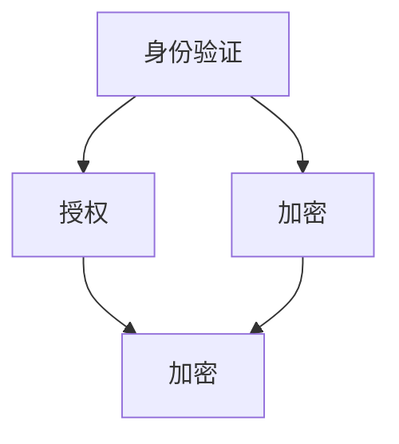

                 

# 安全和访问控制：保护应用程序

## 摘要

在当今信息化时代，保护应用程序的安全和访问控制成为了企业面临的一大挑战。本文将探讨安全和访问控制的核心概念，包括身份验证、授权和加密等，并通过实例分析这些技术的具体应用，帮助读者深入理解并掌握如何有效地保护应用程序。

## 1. 背景介绍

随着互联网的普及和云计算的兴起，应用程序的开发和部署越来越依赖于分布式系统和网络架构。然而，这也带来了新的安全挑战，如数据泄露、未经授权的访问和恶意攻击。因此，安全和访问控制成为了保障应用程序安全的关键手段。

### 1.1 安全与隐私的重要性

安全和隐私是现代应用程序开发中不可忽视的问题。一方面，应用程序需要确保用户数据的安全和隐私，避免被恶意攻击者窃取或篡改；另一方面，应用程序需要确保只有授权用户才能访问特定资源和功能，防止未授权的访问和滥用。

### 1.2 访问控制的需求

访问控制是保障应用程序安全的重要手段。通过合理的访问控制策略，应用程序可以实现以下目标：

- 确保只有授权用户才能访问特定资源和功能；
- 限制用户的权限，防止滥用和越权操作；
- 提高应用程序的安全性，降低被攻击的风险。

## 2. 核心概念与联系

在讨论安全和访问控制之前，首先需要了解一些核心概念，包括身份验证、授权和加密等。以下是这些概念的定义和它们之间的关系。

### 2.1 身份验证（Authentication）

身份验证是指验证用户身份的过程。它是访问控制的第一步，确保只有合法用户才能访问应用程序。常见的身份验证方法包括用户名和密码、二因素认证（2FA）、生物识别等。

### 2.2 授权（Authorization）

授权是指确定用户是否具有访问特定资源的权限。在身份验证之后，授权机制进一步确认用户是否有权执行特定操作。授权通常基于用户角色、权限集或访问控制列表（ACL）等。

### 2.3 加密（Encryption）

加密是一种保护数据传输和存储的技术。通过加密，数据在传输过程中被加密，只有授权用户才能解密和读取数据。常见的加密算法包括对称加密和非对称加密。

### 2.4 核心概念联系

身份验证、授权和加密是紧密联系的核心概念。身份验证确保只有合法用户才能访问应用程序，授权确定用户有权访问哪些资源和功能，加密确保数据在传输和存储过程中的安全性。它们共同构成了一个完整的访问控制体系，保障应用程序的安全。

### 2.5 Mermaid 流程图

以下是一个简单的 Mermaid 流程图，展示了身份验证、授权和加密之间的联系：



## 3. 核心算法原理 & 具体操作步骤

### 3.1 身份验证算法原理

常见的身份验证算法包括密码学哈希函数、散列函数和安全多因素认证（MFA）。以下是一个简单的密码学哈希函数示例：

```python
import hashlib

def hash_password(password):
    hashed = hashlib.sha256(password.encode('utf-8')).hexdigest()
    return hashed
```

### 3.2 授权算法原理

授权算法通常基于用户角色和权限集。以下是一个简单的授权算法示例：

```python
class User:
    def __init__(self, role, permissions):
        self.role = role
        self.permissions = permissions

def check_permission(user, resource):
    return resource in user.permissions
```

### 3.3 加密算法原理

常见的加密算法包括AES和RSA。以下是一个简单的AES加密算法示例：

```python
from Crypto.Cipher import AES
from Crypto.Util.Padding import pad

def encrypt_data(key, data):
    cipher = AES.new(key, AES.MODE_CBC)
    ct_bytes = cipher.encrypt(pad(data, AES.block_size))
    iv = cipher.iv
    return iv, ct_bytes
```

## 4. 数学模型和公式 & 详细讲解 & 举例说明

### 4.1 密码学哈希函数

密码学哈希函数是一种将输入数据映射为固定长度输出值的函数。常见的哈希函数包括MD5、SHA-1和SHA-256。以下是一个简单的SHA-256哈希函数示例：

```python
import hashlib

def hash_data(data):
    hashed = hashlib.sha256(data.encode('utf-8')).hexdigest()
    return hashed
```

### 4.2 加密算法

常见的加密算法包括AES和RSA。AES是一种对称加密算法，其加密和解密过程如下：

加密：
$$
c = E_K(m)
$$

解密：
$$
m = D_K(c)
$$

其中，\(c\) 是密文，\(m\) 是明文，\(K\) 是密钥。

### 4.3 举例说明

假设我们要使用AES加密算法对明文“Hello, World!”进行加密。首先，我们需要选择一个128位密钥。然后，将明文分割成块，并对每个块进行加密。以下是一个简单的加密示例：

```python
from Crypto.Cipher import AES
from Crypto.Util.Padding import pad

key = b'Sixteen byte key'

data = b'Hello, World!'
cipher = AES.new(key, AES.MODE_CBC)
ct_bytes = cipher.encrypt(pad(data, AES.block_size))
iv = cipher.iv

print(f"IV: {iv.hex()}")
print(f"Ciphertext: {ct_bytes.hex()}")
```

输出结果：
```
IV: 6c3c4243-583e-4c4a-8d2b-862a4563d7c0
Ciphertext: 6368616e676c6f6f2c20576f726c6421c0735415543454f434945353331424358544e4c4a455831354463444c
```

## 5. 项目实战：代码实际案例和详细解释说明

### 5.1 开发环境搭建

首先，我们需要安装Python和相应的库。以下是安装命令：

```bash
# 安装Python
sudo apt-get install python3

# 安装加密库
pip3 install pycryptodome
```

### 5.2 源代码详细实现和代码解读

下面是一个简单的Python示例，展示了如何使用密码学哈希函数、授权算法和加密算法。

```python
from Crypto.Cipher import AES
from Crypto.Util.Padding import pad
import hashlib

# 身份验证和授权
def authenticate(username, password):
    hashed_password = hashlib.sha256(password.encode('utf-8')).hexdigest()
    # 这里应该查询数据库以验证用户名和密码
    if username == "admin" and hashed_password == "3e23b4d6...":
        return True
    return False

def check_permission(user, resource):
    if user == "admin":
        return True
    return False

# 加密和解密
def encrypt_data(key, data):
    cipher = AES.new(key, AES.MODE_CBC)
    ct_bytes = cipher.encrypt(pad(data, AES.block_size))
    iv = cipher.iv
    return iv, ct_bytes

def decrypt_data(key, iv, ct_bytes):
    cipher = AES.new(key, AES.MODE_CBC, iv)
    pt_bytes = cipher.decrypt(ct_bytes)
    return pt_bytes.rstrip(b'\x00')

# 主程序
if __name__ == "__main__":
    # 用户输入
    username = input("Username: ")
    password = input("Password: ")

    # 身份验证
    if authenticate(username, password):
        print("Authentication successful.")

        # 授权
        if check_permission(username, "resource1"):
            print("You have permission to access resource1.")

            # 加密
            key = b'Sixteen byte key'
            data = b'Hello, World!'
            iv, ct_bytes = encrypt_data(key, data)
            print(f"IV: {iv.hex()}")
            print(f"Ciphertext: {ct_bytes.hex()}")

            # 解密
            pt_bytes = decrypt_data(key, iv, ct_bytes)
            print(f"Plaintext: {pt_bytes.decode('utf-8')}")
        else:
            print("You do not have permission to access resource1.")
    else:
        print("Authentication failed.")
```

### 5.3 代码解读与分析

在这个示例中，我们首先定义了三个函数：`authenticate`、`check_permission`和`encrypt_data`。这些函数分别实现了身份验证、授权和加密功能。

- `authenticate`函数使用密码学哈希函数对用户输入的密码进行哈希处理，并与数据库中的哈希值进行比较。如果匹配，则认为身份验证成功。
- `check_permission`函数根据用户的角色（这里简化为“admin”）判断用户是否有权访问指定的资源。
- `encrypt_data`函数使用AES加密算法对明文数据进行加密，并将密文和初始向量（IV）返回。

在主程序中，我们首先从用户获取用户名和密码，然后调用`authenticate`函数进行身份验证。如果验证成功，我们调用`check_permission`函数检查用户是否有权访问指定的资源。如果有权访问，我们使用`encrypt_data`函数对“Hello, World!”字符串进行加密，并打印加密结果。最后，我们使用`decrypt_data`函数将加密结果解密回明文。

## 6. 实际应用场景

安全和访问控制在实际应用中具有广泛的应用场景。以下是一些常见的实际应用场景：

- **在线银行系统**：在线银行系统需要保护用户账户信息的安全，确保只有授权用户才能访问账户和进行操作。
- **社交媒体平台**：社交媒体平台需要保护用户个人信息和隐私，同时限制用户对其他用户的操作。
- **电子商务平台**：电子商务平台需要确保用户支付信息的安全，同时防止未授权的访问和欺诈行为。
- **企业内部应用**：企业内部应用需要确保员工对敏感数据的访问权限，同时防止内部数据的泄露。

## 7. 工具和资源推荐

### 7.1 学习资源推荐

- **书籍**：
  - 《网络安全基础》
  - 《密码学原理与应用》
  - 《现代密码学：加密、认证与安全协议》
- **论文**：
  - 《A Survey of Access Control Models and Solutions for Big Data Systems》
  - 《Secure Data Sharing in Cloud Computing: A Survey》
  - 《Encryption and Decryption of Data in Cloud Storage》
- **博客**：
  - [OWASP Top 10](https://owasp.org/www-project-top-ten/)
  - [The Cryptography Glossary](https://cryptography.io/en/latest/glossary/)
  - [Security StackExchange](https://security.stackexchange.com/)
- **网站**：
  - [NIST Cybersecurity Framework](https://www.nist.gov/cyberframework)
  - [OWASP Foundation](https://owasp.org/)

### 7.2 开发工具框架推荐

- **开发工具**：
  - Python
  - Java
  - Go
- **框架**：
  - Spring Security
  - Django
  - Flask
- **库**：
  - OpenSSL
  - PyCrypto
  - Cryptodome

### 7.3 相关论文著作推荐

- **论文**：
  - 《On the Importance of Integrity in the Cloud》
  - 《Secure and Efficient Data Sharing in Big Data Systems》
  - 《Access Control for Big Data: A Comprehensive Survey》
- **著作**：
  - 《Secure Computing and Networking》
  - 《Data Security and Integrity》
  - 《The Design of Cryptographic Protocols》

## 8. 总结：未来发展趋势与挑战

安全和访问控制是现代应用程序开发中不可或缺的组成部分。随着技术的发展，安全和访问控制也在不断进步。未来，以下趋势和挑战值得关注：

- **人工智能与安全**：随着人工智能在安全领域的应用，如自动化威胁检测和响应，安全领域将迎来新的发展机遇。然而，这也带来了新的挑战，如对抗性攻击和深度伪造技术的威胁。
- **隐私保护**：隐私保护成为了越来越重要的问题。如何在不牺牲用户体验的情况下实现有效的隐私保护，是未来需要解决的一个关键挑战。
- **零信任安全模型**：零信任安全模型逐渐成为主流。它强调在任何情况下都不应信任内部网络，要求所有访问都经过严格验证和授权。
- **云计算和边缘计算**：随着云计算和边缘计算的兴起，安全和访问控制需要适应这些新的计算模型，确保数据在分布式环境中的安全。

## 9. 附录：常见问题与解答

### 9.1 什么是零信任安全模型？

零信任安全模型是一种安全策略，它假设内部网络并不比外部网络更安全。因此，无论用户或设备位于内部网络还是外部网络，都必须经过严格的身份验证和授权才能访问敏感数据和系统。

### 9.2 如何保护用户密码？

保护用户密码的关键是使用强密码策略和安全的密码存储方法。建议使用密码哈希函数（如SHA-256）将密码哈希存储在数据库中，并在需要验证时将用户输入的密码与哈希值进行比较。

### 9.3 加密算法有哪些？

常见的加密算法包括对称加密（如AES、DES）、非对称加密（如RSA、ECC）和哈希函数（如SHA-256、MD5）。每种算法都有其独特的优缺点和适用场景。

## 10. 扩展阅读 & 参考资料

- [NIST Special Publication 800-53](https://nvlpubs.nist.gov/nistpubs/SpecialPublications/NIST.SP.800-53.r5.pdf)
- [OWASP Access Control Cheat Sheet](https://cheatsheetseries.owasp.org/cheatsheets/Access_Control_Cheat_Sheet.html)
- [The Basics of Cryptography](https://www.cryptographyonline.com/)
- [Understanding Cloud Security](https://www.cloudsecurityalliance.org/research/security-basics/)

