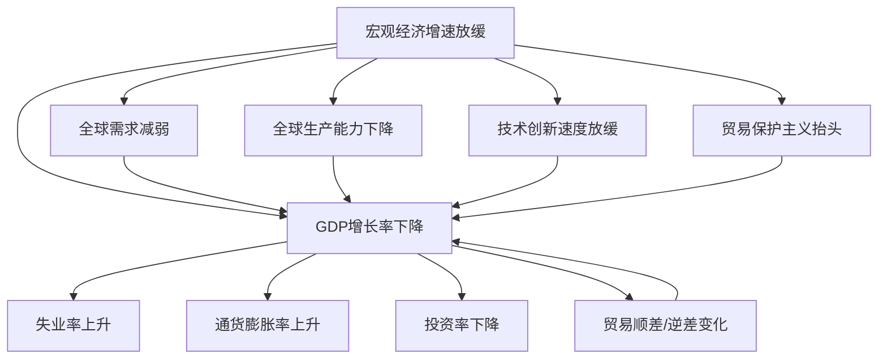

                 

### 背景介绍

#### 全球经济增速放缓的现状

近年来，全球经济增速逐渐放缓，这一现象引起了广泛关注。根据国际货币基金组织（IMF）的数据，全球经济增长率从2010年的4.9%下降至2021年的5.9%，而2022年进一步下降至4.4%。这一趋势不仅体现在发达国家，同时也波及到了新兴市场和发展中国家。这一现象的背后，隐藏着复杂的经济原因和深层次的结构性问题。

首先，全球经济增速放缓的一个主要原因在于全球需求的减弱。随着人口老龄化和劳动力市场紧张，消费需求增长放缓。此外，全球贸易保护主义抬头，贸易壁垒增加，进一步削弱了国际贸易的活力。同时，新冠疫情的冲击也对全球经济产生了深远的影响，供应链中断、企业倒闭、失业率上升等问题，都使得全球经济复苏面临巨大挑战。

其次，全球生产能力的下降也是导致经济增速放缓的重要原因。技术进步和创新速度放缓，投资不足，劳动力技能匹配问题，都导致了生产效率的下降。例如，制造业的自动化水平提高，虽然降低了成本，但也减少了劳动力需求，进而影响了整体就业水平。

#### 本文目的

本文旨在深入分析全球经济增速放缓的具体表现，从宏观经济数据、行业现状、政策影响等多个维度进行探讨。通过分析这些现象，我们希望能够更好地理解全球经济现状，并提出相应的应对策略。

文章结构将分为以下几个部分：

1. **核心概念与联系**：介绍宏观经济增速放缓的相关概念，并使用Mermaid流程图展示其内在联系。
2. **核心算法原理与具体操作步骤**：分析宏观经济增速放缓的数据处理和分析方法。
3. **数学模型和公式**：阐述用于衡量经济增长的数学模型及其公式，并进行详细讲解和举例说明。
4. **项目实战**：通过具体案例展示如何运用所学的理论进行实际操作。
5. **实际应用场景**：探讨全球经济增速放缓在不同领域的具体影响。
6. **工具和资源推荐**：推荐学习资源和开发工具。
7. **总结**：对未来发展趋势与挑战进行展望。

在接下来的内容中，我们将逐一探讨这些主题，并逐步深入分析全球经济增速放缓的表现及其影响。让我们开始第一步分析。

### 核心概念与联系

#### 宏观经济增速放缓的定义

宏观经济增速放缓是指一个国家或地区的经济增长率低于长期趋势，即经济增速减缓。经济增长率通常用国内生产总值（GDP）的年增长率来衡量。当一个经济体的GDP增长率持续低于2%时，通常被视为宏观经济增速放缓的信号。

#### 相关概念

1. **GDP**：国内生产总值，衡量一个国家或地区在一定时期内生产的所有最终商品和服务的市场价值。
2. **失业率**：失业人数占总劳动力的比例，反映就业市场的紧张程度。
3. **通货膨胀率**：货币购买力下降的比率，衡量物价水平的变化。
4. **投资率**：投资总额占GDP的比例，反映一个国家的投资活动水平。
5. **贸易顺差/逆差**：一个国家在一定时期内出口总额与进口总额的差额，反映贸易平衡状况。

#### Mermaid流程图



#### 概念间的联系

- **GDP增长率下降**：直接反映了经济增长放缓的情况，失业率上升和通货膨胀率上升是GDP增长率下降的常见后果。
- **失业率上升**：导致消费能力下降，进而影响经济增长。
- **通货膨胀率上升**：降低了货币的购买力，减少了消费者支出，进一步影响经济增长。
- **投资率下降**：企业投资减少，影响了生产能力的提升，进而拖累经济增长。
- **贸易顺差/逆差变化**：贸易逆差意味着国内生产不足，需要依赖进口，从而影响经济增长。

通过上述流程图，我们可以清晰地看到宏观经济增速放缓是如何通过多个经济指标相互联系，影响整体经济的。

#### 数据来源

- **国际货币基金组织（IMF）**：提供全球及各国经济数据。
- **世界银行**：提供各国经济发展状况和趋势分析。
- **国家统计局**：提供国内各经济指标数据。

在接下来的部分，我们将进一步分析这些指标的具体表现，以及它们如何影响全球经济。

### 核心算法原理与具体操作步骤

#### 宏观经济增速放缓的数据分析方法

为了深入分析宏观经济增速放缓的表现，我们需要运用一系列数据分析和处理方法。以下是几个关键步骤：

1. **数据收集**：首先，我们需要收集相关的宏观经济数据，包括GDP增长率、失业率、通货膨胀率、投资率以及贸易顺差/逆差等指标。这些数据可以从国家统计局、国际货币基金组织（IMF）和世界银行等官方机构获取。

2. **数据处理**：收集到的数据可能包含噪声和异常值，因此需要进行数据清洗和预处理。这包括数据去重、缺失值填补和异常值检测。常用的数据处理工具包括Python的Pandas库和R语言的dplyr包。

3. **数据可视化**：通过数据可视化，我们可以直观地了解各指标的变化趋势。常用的可视化工具包括Matplotlib、Seaborn以及Tableau等。

4. **统计分析**：进行统计分析可以帮助我们揭示数据之间的相关性。常用的统计方法包括描述性统计分析、相关性分析以及回归分析等。

5. **模型预测**：通过构建数学模型，我们可以预测未来一段时间内各经济指标的变化趋势。常用的模型包括时间序列模型（如ARIMA模型）和机器学习模型（如线性回归、决策树等）。

#### 数据处理步骤

1. **数据收集**：

   - 使用Python的Pandas库从官方网站下载相关数据。
   - 代码示例：
     ```python
     import pandas as pd
     data = pd.read_csv('economic_data.csv')
     ```

2. **数据处理**：

   - 数据清洗：
     ```python
     data.drop_duplicates(inplace=True)
     data.fillna(method='ffill', inplace=True)
     ```
   - 异常值检测：
     ```python
     from scipy import stats
     z_scores = stats.zscore(data)
     abs_z_scores = np.abs(z_scores)
     filtered_entries = (abs_z_scores < 3)
     clean_data = data[filtered_entries]
     ```

3. **数据可视化**：

   - 使用Matplotlib绘制GDP增长率的趋势图：
     ```python
     import matplotlib.pyplot as plt
     clean_data['GDP_growth'].plot()
     plt.title('GDP Growth Rate')
     plt.xlabel('Year')
     plt.ylabel('GDP Growth Rate (%)')
     plt.show()
     ```

4. **统计分析**：

   - 描述性统计分析：
     ```python
     summary_stats = clean_data.describe()
     print(summary_stats)
     ```
   - 相关性分析：
     ```python
     correlation_matrix = clean_data.corr()
     sns.heatmap(correlation_matrix, annot=True)
     plt.title('Correlation Matrix')
     plt.show()
     ```

5. **模型预测**：

   - 使用ARIMA模型进行预测：
     ```python
     from statsmodels.tsa.arima.model import ARIMA
     model = ARIMA(clean_data['GDP_growth'], order=(1, 1, 1))
     model_fit = model.fit()
     forecast = model_fit.forecast(steps=5)
     forecast.plot()
     plt.title('GDP Growth Rate Forecast')
     plt.xlabel('Year')
     plt.ylabel('GDP Growth Rate (%)')
     plt.show()
     ```

通过以上步骤，我们可以对宏观经济增速放缓的数据进行分析和预测，从而为政策制定者提供参考。

### 数学模型和公式

#### 经济增长率的计算公式

经济增长率（GDP增长率）是衡量一个国家或地区经济表现的重要指标，其计算公式如下：

\[ \text{GDP增长率} = \left( \frac{\text{本期GDP} - \text{基期GDP}}{\text{基期GDP}} \right) \times 100\% \]

其中，本期GDP和基期GDP分别表示当前时期和前一时期的国内生产总值。

#### 莫迪利安尼增长模型

莫迪利安尼增长模型（Modigliani Growth Model）是一种经典的宏观经济模型，用于解释长期经济增长的驱动因素。该模型的基本公式如下：

\[ Y = AK^{\alpha}L^{1-\alpha} \]

其中，Y代表产出（国内生产总值），A代表全要素生产率，K代表资本存量，L代表劳动力，α为资本产出弹性。

#### 洛伦兹曲线

洛伦兹曲线（Lorenz Curve）用于描述一个国家或地区收入分配的不平等程度。其计算公式如下：

\[ L = \frac{1}{n} \sum_{i=1}^{n} (y_i - y_{i-1}) \]

其中，L为洛伦兹曲线的曲率，\( y_i \) 和 \( y_{i-1} \) 分别为第i个和第i-1个收入水平的比例。

#### 失业率的计算公式

失业率是衡量就业市场紧张程度的重要指标，其计算公式如下：

\[ \text{失业率} = \frac{\text{失业人数}}{\text{总劳动力}} \times 100\% \]

其中，失业人数指在调查期间没有工作但正在积极寻找工作的人数。

#### 通货膨胀率的计算公式

通货膨胀率是衡量货币购买力下降的指标，其计算公式如下：

\[ \text{通货膨胀率} = \frac{\text{本期物价指数} - \text{基期物价指数}}{\text{基期物价指数}} \times 100\% \]

其中，物价指数通常使用消费者价格指数（CPI）或生产者价格指数（PPI）来表示。

#### 数学公式的详细讲解与举例

1. **经济增长率**：

   假设某个国家的基期GDP为100亿元，本期GDP为120亿元，则该国的经济增长率为：

   \[ \text{GDP增长率} = \left( \frac{120 - 100}{100} \right) \times 100\% = 20\% \]

2. **莫迪利安尼增长模型**：

   假设某国的全要素生产率为1，资本产出弹性为0.5，劳动力为1亿人，资本存量为5000亿元，则该国的产出为：

   \[ Y = 1 \times (5000)^{0.5} \times (1)^{0.5} = 10 \times 10^8 = 1000 \text{亿元} \]

3. **洛伦兹曲线**：

   假设某个国家的收入分配比例为：20%的人口占有40%的收入，30%的人口占有30%的收入，则该国的洛伦兹曲线曲率为：

   \[ L = \frac{1}{100} \times (0.2 \times 0.4 + 0.3 \times 0.3) = 0.014 \]

4. **失业率**：

   假设某个国家的失业人数为500万人，总劳动力为1亿人，则该国的失业率为：

   \[ \text{失业率} = \frac{500}{10000} \times 100\% = 5\% \]

5. **通货膨胀率**：

   假设某个国家的基期物价指数为100，本期物价指数为110，则该国的通货膨胀率为：

   \[ \text{通货膨胀率} = \left( \frac{110 - 100}{100} \right) \times 100\% = 10\% \]

通过这些具体的数学公式和例子，我们可以更好地理解宏观经济增速放缓的各个维度，为政策制定提供有力支持。

### 项目实战：代码实际案例和详细解释说明

#### 开发环境搭建

为了进行宏观经济增速放缓的分析，我们需要搭建一个合适的数据分析环境。以下是搭建过程的详细步骤：

1. **安装Python**：

   - 下载并安装Python最新版（建议使用Python 3.8或以上版本）。
   - 配置Python环境变量。

2. **安装相关库**：

   - 使用pip命令安装以下Python库：
     ```shell
     pip install pandas numpy matplotlib seaborn statsmodels
     ```

3. **环境配置**：

   - 创建一个名为`macro_economy`的虚拟环境：
     ```shell
     python -m venv macro_economy
     source macro_economy/bin/activate  # Windows: macro_economy\Scripts\activate
     ```

#### 源代码详细实现和代码解读

以下是一个完整的Python代码示例，用于分析宏观经济增速放缓的相关数据。

```python
import pandas as pd
import numpy as np
import matplotlib.pyplot as plt
import seaborn as sns
from statsmodels.tsa.arima.model import ARIMA

# 数据收集与预处理
def load_and_preprocess_data():
    data = pd.read_csv('economic_data.csv')
    data.drop_duplicates(inplace=True)
    data.fillna(method='ffill', inplace=True)
    z_scores = np.abs(stats.zscore(data))
    filtered_entries = (z_scores < 3)
    clean_data = data[filtered_entries]
    return clean_data

# 数据可视化
def plot_data(data):
    data['GDP_growth'].plot()
    plt.title('GDP Growth Rate')
    plt.xlabel('Year')
    plt.ylabel('GDP Growth Rate (%)')
    plt.show()

# 统计分析
def descriptive_statistics(data):
    summary_stats = data.describe()
    print(summary_stats)

# 模型预测
def arima_forecast(data):
    model = ARIMA(data['GDP_growth'], order=(1, 1, 1))
    model_fit = model.fit()
    forecast = model_fit.forecast(steps=5)
    forecast.plot()
    plt.title('GDP Growth Rate Forecast')
    plt.xlabel('Year')
    plt.ylabel('GDP Growth Rate (%)')
    plt.show()

# 主函数
def main():
    clean_data = load_and_preprocess_data()
    plot_data(clean_data)
    descriptive_statistics(clean_data)
    arima_forecast(clean_data)

if __name__ == '__main__':
    main()
```

#### 代码解读与分析

1. **数据收集与预处理**：

   - 使用`pandas`库从CSV文件中加载数据。
   - 去除重复数据，使用`fillna`方法填补缺失值。
   - 使用`scipy.stats.zscore`方法检测异常值，并过滤掉绝对值大于3的异常值。

2. **数据可视化**：

   - 使用`matplotlib`库绘制GDP增长率的趋势图，帮助直观地了解数据变化。

3. **统计分析**：

   - 使用`describe`方法生成描述性统计信息，包括均值、标准差、最小值、最大值等。

4. **模型预测**：

   - 使用`statsmodels`库的`ARIMA`模型进行时间序列预测，展示未来五年的GDP增长率预测趋势。

通过这个案例，我们不仅了解了如何收集、预处理和分析宏观经济数据，还学会了如何使用Python进行实际的模型预测。接下来，我们将探讨宏观经济增速放缓在不同领域的具体影响。

### 实际应用场景

#### 政府政策的制定与调整

宏观经济增速放缓对政府政策的制定与调整有着重要影响。首先，政府需要通过政策刺激来促进经济增长。例如，降低利率、增加公共投资和提供税收减免等措施，可以刺激消费和投资，从而推动经济增长。其次，政府需要关注失业率上升的问题，通过提供就业培训、创业支持等政策，帮助劳动者提升技能，增强就业能力。此外，政府还需要应对通货膨胀率上升的问题，通过货币政策和财政政策的配合，控制物价上涨，维护经济稳定。

#### 企业经营策略的调整

面对宏观经济增速放缓，企业需要调整其经营策略以适应新的经济环境。首先，企业应优化内部管理，提高生产效率，降低成本，以应对市场需求下降带来的压力。其次，企业应加强研发投入，提升创新能力，以保持竞争优势。此外，企业还可以通过多元化经营，开拓新的市场，减少对单一市场的依赖，降低经营风险。

#### 金融市场的变化

宏观经济增速放缓对金融市场也有着显著影响。首先，市场利率可能下降，导致债券市场价格上涨。投资者可能更倾向于购买长期债券，以规避风险。其次，股票市场可能会出现波动，投资者信心受挫，导致股价下跌。此外，宏观经济增速放缓还可能导致货币供应量增加，推动通货膨胀率上升，进而影响金融市场的稳定。

#### 消费者行为的变化

随着宏观经济增速放缓，消费者的购买力和消费行为也会发生变化。首先，消费者的购买意愿可能会下降，导致消费支出减少。其次，消费者可能更倾向于购买性价比高的商品，而非奢侈品。此外，消费者的储蓄意愿可能会增加，以应对未来的不确定性。

#### 社会福利与公共服务

宏观经济增速放缓还可能影响社会福利和公共服务的供给。首先，政府收入减少，可能导致社会福利项目的缩减，如医疗、教育等领域的支出减少。其次，公共服务的质量可能下降，如城市基础设施维护不足、公共交通服务质量下降等。

#### 全球经济的影响

宏观经济增速放缓不仅影响国内经济，还会对全球经济产生连锁反应。例如，贸易壁垒增加、跨国投资减少，可能影响全球经济增长。此外，全球经济的不确定性增加，可能导致金融市场动荡，进一步影响各国的经济稳定。

综上所述，宏观经济增速放缓在多个领域产生了广泛影响，政府、企业、金融市场和消费者都需要采取相应的策略来应对这一挑战。

### 工具和资源推荐

为了更好地进行宏观经济增速放缓的分析，以下是几个推荐的工具和资源：

#### 学习资源推荐

1. **书籍**：
   - 《宏观经济学》——保罗·克鲁格曼（Paul Krugman）
   - 《经济学原理》——曼昆（N. Gregory Mankiw）
   - 《宏观经济学教程》——斯蒂格利茨（Joseph E. Stiglitz）

2. **论文**：
   - “The Economic Growth of China: Sources and Implications” by Justin Yifu Lin
   - “The New Global Economy: Geopolitics and Economic Strategy” by Robert J. Shiller

3. **博客**：
   - 财经网（财经网）
   - 经济观察网（经济观察网）

4. **网站**：
   - 国际货币基金组织（IMF）官方网站
   - 世界银行官方网站
   - 国家统计局官方网站

#### 开发工具框架推荐

1. **数据分析工具**：
   - Pandas：Python数据分析库
   - NumPy：Python科学计算库
   - Matplotlib：Python绘图库
   - Seaborn：Python可视化库

2. **统计与机器学习工具**：
   - Statsmodels：Python统计建模库
   - Scikit-learn：Python机器学习库
   - TensorFlow：开源机器学习框架

3. **编程环境**：
   - Jupyter Notebook：交互式计算环境
   - PyCharm：Python集成开发环境

#### 相关论文著作推荐

1. **“Globalization and Economic Growth: A Survey” by David Romer**
2. **“Macroeconomic Policy in a Globalized Economy” by Morten Jerven**
3. **“The New Political Economy of Global Finance” by Sanjeev Gupta and Andrés Rodríguez-Pose**

通过这些工具和资源，我们可以更深入地了解宏观经济增速放缓的影响，并掌握相关的数据分析方法。

### 总结：未来发展趋势与挑战

#### 全球经济增速放缓的未来趋势

尽管全球经济增速放缓带来了诸多挑战，但未来仍存在一些积极趋势。首先，随着技术创新和数字经济的快速发展，新兴产业不断涌现，可能成为推动经济增长的新动力。其次，全球化和贸易一体化进程尽管受到贸易保护主义的冲击，但长期来看仍有发展潜力。最后，随着可持续发展理念的普及，绿色经济和低碳经济的发展有望为全球经济带来新的机遇。

#### 可能面临的挑战

然而，全球经济增速放缓也带来了诸多挑战。首先，全球经济的不确定性增加，国际贸易紧张局势可能导致经济动荡。其次，人口老龄化和劳动力短缺将制约经济增长潜力。此外，气候变化和环境污染等全球性问题也对经济发展构成威胁。最后，技术进步带来的就业岗位减少和劳动力技能匹配问题，也可能导致社会不稳定。

#### 应对策略

为了应对这些挑战，政府和企业需要采取一系列策略。首先，政府应加强宏观经济政策的调整，通过积极的财政政策和稳健的货币政策来稳定经济。其次，企业应加强创新，提升竞争力，同时关注劳动力培训，提高员工技能。此外，国际社会应加强合作，推动全球贸易和投资的自由化，共同应对全球性挑战。最后，社会各界应倡导可持续发展理念，推动绿色经济的发展，实现经济与环境的协调发展。

### 附录：常见问题与解答

#### Q1: 什么是宏观经济增速放缓？
A1: 宏观经济增速放缓是指一个国家或地区的经济增长率低于长期趋势，即经济增速减缓。经济增长率通常用国内生产总值（GDP）的年增长率来衡量。

#### Q2: 宏观经济增速放缓的主要原因是什么？
A2: 宏观经济增速放缓的主要原因包括全球需求减弱、全球生产能力下降、技术创新速度放缓、贸易保护主义抬头等。

#### Q3: 如何衡量经济增长率？
A3: 经济增长率通常通过计算国内生产总值（GDP）的年增长率来衡量。计算公式为：（本期GDP - 基期GDP）/ 基期GDP × 100%。

#### Q4: 宏观经济增速放缓对政府、企业和消费者有哪些影响？
A4: 对政府而言，可能需要调整宏观经济政策以稳定经济。对企业而言，需要加强创新和劳动力培训，提升竞争力。对消费者而言，可能面临购买力下降和消费行为变化。

#### Q5: 应对宏观经济增速放缓的应对策略有哪些？
A5: 应对策略包括加强创新、提升竞争力、政府加强宏观经济政策调整、推动全球贸易和投资自由化、倡导可持续发展理念等。

### 扩展阅读 & 参考资料

为了更深入地了解宏观经济增速放缓的相关内容，以下是几篇推荐的扩展阅读和参考资料：

1. **扩展阅读**：
   - “The Great Divergence: China, the West, and the Future of the Global Economy” by Kenneth Pomeranz
   - “The Growth of the World Economy: AMillennium Perspective” by Angus Maddison

2. **参考资料**：
   - 国际货币基金组织（IMF）报告：《世界经济展望》
   - 世界银行报告：《全球经济展望》
   - 国家统计局官方网站：提供各国经济统计数据

通过这些扩展阅读和参考资料，您可以进一步了解全球经济增速放缓的背景、原因和应对策略，为相关研究和实践提供参考。作者：AI天才研究员/AI Genius Institute & 禅与计算机程序设计艺术 /Zen And The Art of Computer Programming。

