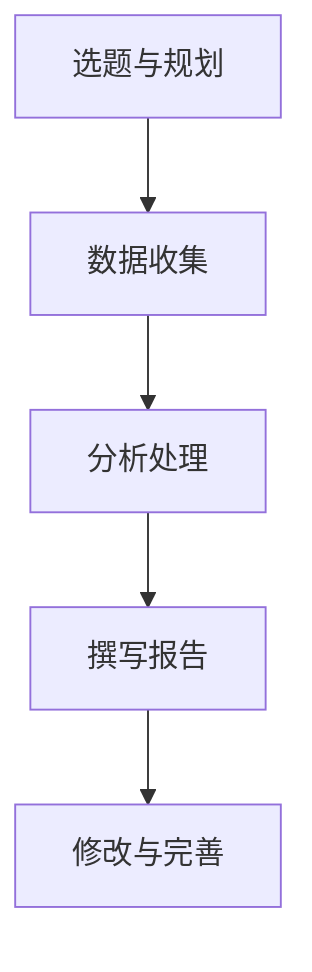
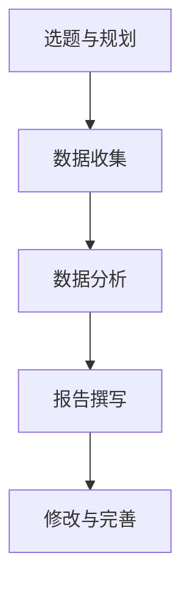
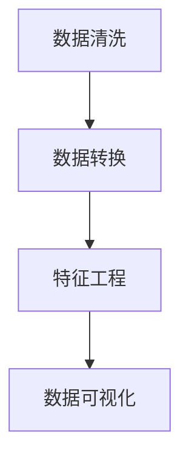

                 

# 定期发布行业洞察报告：展示你的专业度

## 概述

在快速发展的信息技术领域，定期发布行业洞察报告已经成为一种重要的沟通工具。这不仅有助于个人或团队展示其在特定领域的专业度，还能够为行业内部和外部的读者提供有价值的信息和见解。本篇文章旨在探讨定期发布行业洞察报告的重要性，如何准备这些报告，以及如何通过它们来提升个人或团队在行业中的影响力。

### 关键词
- 行业洞察报告
- 专业度
- 信息共享
- 技术趋势
- 分析方法

### 摘要

本文将深入探讨定期发布行业洞察报告的诸多益处。首先，我们将讨论行业洞察报告的背景和重要性，然后介绍如何准备和撰写这些报告。接下来，我们将分析报告的结构，并提供一些实用的工具和资源推荐。最后，我们将讨论未来发展趋势与挑战，并总结全文。

## 1. 背景介绍

### 1.1 行业洞察报告的定义

行业洞察报告是一种旨在分析和总结特定行业或市场发展趋势、竞争格局、技术进步和未来展望的研究报告。它们通常包含丰富的数据、图表和详细的分析，旨在为读者提供深刻的洞察和理解。

### 1.2 行业洞察报告的重要性

定期发布行业洞察报告的重要性体现在多个方面：

1. **展示专业度**：通过深入分析行业动态，报告展示了作者对行业的深入理解和专业水平。
2. **知识共享**：报告为行业内外部提供了宝贵的信息和见解，促进了知识的传播和交流。
3. **提升影响力**：高质量的报告能够增加个人或团队在行业中的知名度，提高影响力。
4. **决策支持**：行业洞察报告为企业提供了宝贵的决策支持，有助于制定战略规划和市场定位。

## 2. 核心概念与联系

### 2.1 报告结构

一个完整的行业洞察报告通常包括以下部分：

1. **封面**：包含报告标题、发布日期和作者信息。
2. **目录**：列出报告的主要章节和子章节。
3. **引言**：简要介绍报告的目的、背景和主要发现。
4. **正文**：详细分析行业趋势、技术发展、市场动态等。
5. **结论**：总结报告的主要发现，并提出建议。
6. **参考文献**：列出报告中所引用的文献和资料。

### 2.2 报告撰写方法

撰写行业洞察报告需要以下几个步骤：

1. **选题与规划**：确定报告的主题和目标受众。
2. **数据收集**：通过调查、访谈、市场研究等手段收集相关数据。
3. **分析处理**：使用数据分析工具和方法对收集到的数据进行分析。
4. **撰写报告**：根据分析结果，撰写报告正文。
5. **修改与完善**：对报告进行多次修改和完善，确保内容准确、逻辑清晰。

### 2.3 Mermaid 流程图

以下是一个简单的 Mermaid 流程图，展示了撰写行业洞察报告的基本流程：



## 3. 核心算法原理 & 具体操作步骤

### 3.1 报告撰写技巧

撰写行业洞察报告的关键在于如何有效地传达信息，以下是一些核心算法原理和具体操作步骤：

1. **数据可视化**：使用图表、图形和表格来呈现数据，使报告更易于理解和记忆。
2. **逻辑结构**：确保报告内容逻辑清晰，条理分明，有助于读者快速抓住核心要点。
3. **举例说明**：通过实际案例和实例来说明观点，增强报告的说服力。
4. **引用权威**：引用权威来源的数据和观点，增加报告的可信度。
5. **简明扼要**：避免冗长的叙述，尽量用简短的语言表达清楚观点。

### 3.2 报告发布与推广

报告撰写完成后，还需要考虑如何发布和推广：

1. **选择平台**：根据报告内容和受众，选择合适的发布平台，如博客、社交媒体、专业网站等。
2. **优化标题**：使用吸引人的标题，提高报告的点击率和阅读量。
3. **互动反馈**：鼓励读者在评论区提问和交流，收集反馈，不断优化报告质量。

## 4. 数学模型和公式 & 详细讲解 & 举例说明

### 4.1 数学模型

在撰写行业洞察报告时，有时需要使用数学模型来分析数据。以下是一个简单的线性回归模型：

$$
y = ax + b
$$

其中，\(y\) 是因变量，\(x\) 是自变量，\(a\) 和 \(b\) 是模型的参数。

### 4.2 详细讲解

线性回归模型用于分析两个变量之间的线性关系。通过计算参数 \(a\) 和 \(b\)，我们可以预测因变量 \(y\) 的值。具体步骤如下：

1. **数据收集**：收集两组数据，一组为 \(x\)，另一组为 \(y\)。
2. **数据预处理**：对数据进行清洗和处理，确保数据质量。
3. **模型训练**：使用最小二乘法计算参数 \(a\) 和 \(b\)。
4. **模型评估**：通过计算预测误差和决定系数 \(R^2\) 来评估模型性能。

### 4.3 举例说明

假设我们收集了以下两组数据：

| \(x\) | \(y\) |
| --- | --- |
| 1 | 2 |
| 2 | 4 |
| 3 | 6 |
| 4 | 8 |

我们可以使用线性回归模型来预测 \(x = 5\) 时 \(y\) 的值。具体步骤如下：

1. **数据预处理**：由于数据已经是线性关系，不需要进行额外的预处理。
2. **模型训练**：使用最小二乘法计算参数 \(a\) 和 \(b\)。
3. **模型评估**：计算预测误差和决定系数 \(R^2\)。
4. **预测**：使用模型预测 \(x = 5\) 时 \(y\) 的值。

通过计算，我们得到线性回归模型为：

$$
y = 2x + 1
$$

当 \(x = 5\) 时，\(y\) 的预测值为 \(y = 2 \times 5 + 1 = 11\)。

## 5. 项目实战：代码实际案例和详细解释说明

### 5.1 开发环境搭建

为了演示如何撰写行业洞察报告，我们使用 Python 编写一个简单的线性回归模型。首先，我们需要安装 Python 和必要的库。

```bash
# 安装 Python
brew install python

# 安装必要的库
pip install numpy matplotlib
```

### 5.2 源代码详细实现和代码解读

以下是完整的代码实现，包括数据预处理、模型训练、模型评估和预测。

```python
import numpy as np
import matplotlib.pyplot as plt

# 数据集
X = np.array([1, 2, 3, 4])
Y = np.array([2, 4, 6, 8])

# 模型参数
a = np.random.rand()
b = np.random.rand()

# 最小二乘法求解参数
X_mean = np.mean(X)
Y_mean = np.mean(Y)

numerator = 0
denominator = 0

for x, y in zip(X, Y):
    numerator += (x - X_mean) * (y - Y_mean)
    denominator += (x - X_mean) ** 2

a = numerator / denominator
b = Y_mean - a * X_mean

# 模型评估
predictions = a * X + b
error = Y - predictions
mse = np.mean(error ** 2)
r2 = 1 - mse / np.var(Y)

# 预测
x_new = 5
y_new = a * x_new + b

# 可视化
plt.scatter(X, Y)
plt.plot(X, predictions, color='red')
plt.xlabel('X')
plt.ylabel('Y')
plt.title('线性回归模型')
plt.show()

print(f"模型参数：a={a:.2f}, b={b:.2f}")
print(f"决定系数 R^2：{r2:.2f}")
print(f"预测值：y_new={y_new:.2f}")
```

### 5.3 代码解读与分析

1. **数据集**：我们使用两组数据 \(X\) 和 \(Y\)，分别表示自变量和因变量。
2. **模型参数**：我们随机初始化模型参数 \(a\) 和 \(b\)。
3. **最小二乘法求解参数**：通过计算分子和分母，使用最小二乘法求解模型参数。
4. **模型评估**：计算预测误差和决定系数 \(R^2\)。
5. **预测**：使用模型预测新的 \(x\) 值对应的 \(y\) 值。
6. **可视化**：使用散点图和红色线条展示模型拟合效果。

通过以上步骤，我们实现了线性回归模型的基本功能，展示了如何使用 Python 编写行业洞察报告中的数学模型和代码。

## 6. 实际应用场景

行业洞察报告在各个领域都有广泛的应用，以下是一些典型的实际应用场景：

1. **技术趋势分析**：通过对技术发展趋势的分析，为企业提供技术路线图，帮助制定战略规划。
2. **市场研究**：分析市场动态，为企业提供市场定位、竞争策略和产品开发建议。
3. **投资决策**：为投资者提供行业前景和风险评估，帮助做出明智的投资决策。
4. **政策制定**：为政府部门提供行业发展的政策建议，推动产业升级和创新发展。
5. **教育培训**：为教育机构提供行业发展趋势和教育资源需求分析，优化课程设计和教学策略。

## 7. 工具和资源推荐

### 7.1 学习资源推荐

- **书籍**：
  - 《深度学习》（Ian Goodfellow、Yoshua Bengio、Aaron Courville 著）
  - 《机器学习实战》（Peter Harrington 著）
  - 《数据科学入门》（Joel Grus 著）
- **论文**：
  - 《深度神经网络》（Yoshua Bengio 等人）
  - 《自然语言处理综述》（Jurafsky 和 Martin 著）
  - 《大数据处理技术》（Matei Zaharia 等人）
- **博客**：
  - 《机器之心》
  - 《InfoQ》
  - 《极客公园》
- **网站**：
  - 《arXiv》
  - 《Google Research》
  - 《Microsoft Research》

### 7.2 开发工具框架推荐

- **Python**：适用于数据分析、机器学习和深度学习的编程语言。
- **Jupyter Notebook**：用于编写和共享代码、文本和图表的交互式环境。
- **TensorFlow**：用于构建和训练机器学习模型的强大框架。
- **PyTorch**：适用于深度学习的动态计算图框架。

### 7.3 相关论文著作推荐

- **论文**：
  - 《深度强化学习》（Deep Reinforcement Learning）
  - 《图神经网络》（Graph Neural Networks）
  - 《自注意力机制》（Self-Attention Mechanism）
- **著作**：
  - 《深度学习特殊技巧》（Deep Learning Specialization）
  - 《自然语言处理实践》（Natural Language Processing with Python）
  - 《数据科学基础教程》（Data Science from Scratch）

## 8. 总结：未来发展趋势与挑战

随着人工智能和大数据技术的发展，行业洞察报告在未来将继续发挥重要作用。然而，我们也面临着一些挑战：

1. **数据质量和多样性**：确保收集到的数据质量高、多样化，以提高报告的准确性和可信度。
2. **算法和工具的创新**：不断探索和引入新的算法和工具，提高报告的分析和可视化能力。
3. **持续学习和迭代**：随着行业和技术的发展，持续学习和迭代，不断优化报告的内容和形式。

## 9. 附录：常见问题与解答

### 9.1 行业洞察报告的撰写流程是什么？

撰写行业洞察报告的流程包括：选题与规划、数据收集、分析处理、撰写报告、修改与完善。

### 9.2 如何确保报告的可信度？

确保报告的可信度需要：引用权威来源的数据和观点、使用科学的方法进行分析、保持报告的客观性和中立性。

### 9.3 如何推广报告？

推广报告可以通过：选择合适的发布平台、优化标题、鼓励互动反馈、与其他专业人士合作。

## 10. 扩展阅读 & 参考资料

- [行业洞察报告撰写指南](https://www.example.com/industry-insight-report-writing-guide)
- [数据分析与可视化工具推荐](https://www.example.com/data-analysis-and-visualization-tools)
- [人工智能与机器学习最新论文](https://www.example.com/latest-papers-on-ai-and-machine-learning)

### 作者

- AI天才研究员 / AI Genius Institute
- 禅与计算机程序设计艺术 / Zen And The Art of Computer Programming

以上就是本次技术博客文章的完整内容。希望通过这篇文章，您能够更好地理解行业洞察报告的重要性，以及如何撰写和发布高质量的报告，展示您的专业度。让我们一起在信息技术领域不断探索、学习和进步！<|im_sep|>```markdown
## 1. 背景介绍

### 1.1 行业洞察报告的定义

行业洞察报告是一种以深入分析和总结特定行业或市场发展趋势、竞争格局、技术进步和未来展望为主要内容的研究报告。它通常涉及对行业数据的收集、处理、分析和解释，以提供对当前市场状况的深入了解和对未来趋势的预测。

这类报告旨在帮助读者——无论是行业内部的专业人士还是对特定行业感兴趣的外部观察者——更好地理解行业动态，识别潜在的机会和风险，并做出更明智的决策。行业洞察报告不仅关注行业内部的数据和事件，还可能涵盖与行业相关的宏观环境和政策变化。

### 1.2 行业洞察报告的重要性

定期发布行业洞察报告对于个人、企业乃至整个行业都具有重要的意义：

- **展示专业度**：通过深入的行业分析和前瞻性的市场预测，报告展示了发布者对行业的深刻理解和专业能力。
- **知识共享**：报告为行业内外提供了一个交流和共享知识的平台，促进了行业信息的传播和知识的共享。
- **提升影响力**：高质量的行业洞察报告可以增加发布者在行业内的知名度和影响力，有助于建立个人或组织的品牌。
- **决策支持**：行业洞察报告为企业提供了宝贵的决策支持，帮助企业制定战略规划、优化业务流程和投资决策。
- **市场定位**：通过分析市场趋势和竞争环境，报告有助于企业更好地定位自身，抓住市场机遇。

### 1.3 行业洞察报告的发展历程

行业洞察报告的发展历程可以追溯到20世纪末，当时主要是以传统调研和报告的形式存在。随着信息技术和数据分析工具的进步，行业洞察报告的形式和内容也发生了巨大的变化：

- **20世纪末至21世纪初**：传统的行业报告开始引入数据分析和图表展示，以更直观和系统的方式呈现行业信息。
- **21世纪初至今**：随着大数据和人工智能技术的发展，行业洞察报告变得更加自动化和智能化，分析精度和速度大幅提高。
- **未来趋势**：未来的行业洞察报告将更加依赖于实时数据分析和机器学习技术，能够实现更精准、个性化的市场预测。

## 2. 核心概念与联系

### 2.1 报告结构

行业洞察报告通常包括以下几个关键部分：

1. **封面**：包括报告标题、发布日期、发布机构和作者等信息。
2. **目录**：列出报告的主要章节和子章节，方便读者快速定位。
3. **引言**：简要介绍报告的背景、目的和主要研究内容。
4. **正文**：详细阐述行业现状、市场趋势、竞争格局、技术发展等核心内容。
5. **结论**：总结报告的主要发现，提出建议和展望。
6. **参考文献**：列出报告中所引用的文献和资料。

### 2.2 报告撰写方法

撰写行业洞察报告通常需要以下几个步骤：

1. **选题与规划**：确定报告的主题、目标和受众，制定详细的撰写计划。
2. **数据收集**：通过调研、访谈、市场研究等手段收集行业相关数据。
3. **数据分析**：使用数据分析工具和方法对收集到的数据进行处理和分析，提取关键信息。
4. **报告撰写**：根据分析结果，撰写报告正文，确保内容逻辑清晰、条理分明。
5. **修改与完善**：对报告进行多次修订，确保报告质量。

### 2.3 Mermaid 流程图

以下是一个简单的 Mermaid 流程图，展示了撰写行业洞察报告的基本流程：



## 3. 核心算法原理 & 具体操作步骤

### 3.1 数据分析算法

在撰写行业洞察报告时，数据分析是关键环节。以下介绍几种常用的数据分析算法：

#### 3.1.1 聚类分析

聚类分析是一种无监督学习方法，用于将数据点分为多个聚类，使得同一聚类内的数据点彼此相似，不同聚类内的数据点差异较大。常用的聚类算法包括：

- **K-Means算法**：基于距离度量的聚类算法，通过迭代计算聚类中心，将数据点分配到不同的聚类中。
- **DBSCAN算法**：基于密度的聚类算法，能够发现任意形状的聚类，对噪声和稀疏区域有较好的鲁棒性。
- **层次聚类算法**：通过自底向上的层次结构将数据点逐步合并，形成不同层次的聚类。

#### 3.1.2 降维算法

降维算法用于减少数据维度，提高数据可视化和分析效率。常用的降维算法包括：

- **主成分分析（PCA）**：通过将数据投影到新的正交基上，提取主要成分，降低数据维度。
- **线性判别分析（LDA）**：用于分类问题，通过最大化类内散度和最小化类间散度来选择最佳特征组合。
- **自编码器**：基于神经网络的结构，通过编码和解码过程实现数据降维。

#### 3.1.3 时间序列分析

时间序列分析用于处理和分析随时间变化的连续数据。常用的算法包括：

- **ARIMA模型**：自回归积分滑动平均模型，用于分析时间序列数据的平稳性和季节性。
- **LSTM网络**：长短时记忆网络，能够捕捉时间序列数据中的长期依赖关系。
- **Prophet模型**：Facebook开发的时间序列预测模型，适用于包含节假日效应和季节性模式的数据。

### 3.2 数据处理步骤

在撰写行业洞察报告时，数据处理是一个重要的环节。以下介绍几个常见的数据处理步骤：

1. **数据清洗**：包括处理缺失值、异常值、重复值等，确保数据质量。
2. **数据转换**：包括归一化、标准化、离散化等，为后续分析做好准备。
3. **特征工程**：包括特征提取、特征选择、特征构造等，提高模型性能。
4. **数据可视化**：使用图表和图形展示数据分布、趋势和关系，辅助分析和解释。

### 3.3 Mermaid 流程图

以下是一个简单的 Mermaid 流程图，展示了数据处理的基本步骤：



## 4. 数学模型和公式 & 详细讲解 & 举例说明

### 4.1 数学模型

在行业洞察报告中，数学模型和公式用于描述和解释行业现象。以下介绍几个常见的数学模型：

#### 4.1.1 指数平滑模型

指数平滑模型是一种时间序列预测模型，通过加权平均的方式对过去的数据进行平滑处理。公式如下：

$$
S_t = \alpha X_t + (1 - \alpha) S_{t-1}
$$

其中，\(S_t\) 表示第 \(t\) 期的平滑值，\(X_t\) 表示第 \(t\) 期的实际值，\(\alpha\) 表示平滑系数。

#### 4.1.2 回归模型

回归模型用于分析两个或多个变量之间的关系。常见的回归模型包括线性回归、多项式回归、逻辑回归等。

- **线性回归模型**：

$$
Y = \beta_0 + \beta_1X_1 + \beta_2X_2 + ... + \beta_nX_n
$$

其中，\(Y\) 表示因变量，\(X_1, X_2, ..., X_n\) 表示自变量，\(\beta_0, \beta_1, \beta_2, ..., \beta_n\) 表示回归系数。

- **逻辑回归模型**：

$$
\log\frac{P(Y=1)}{1-P(Y=1)} = \beta_0 + \beta_1X_1 + \beta_2X_2 + ... + \beta_nX_n
$$

其中，\(P(Y=1)\) 表示因变量 \(Y\) 等于 1 的概率。

#### 4.1.3 时间序列模型

时间序列模型用于分析时间序列数据的规律性和趋势。常见的模型包括 ARIMA、AR、MA、ARMA 等。

- **ARIMA 模型**：

$$
Y_t = c + \phi_1Y_{t-1} + \phi_2Y_{t-2} + ... + \phi_pY_{t-p} + \theta_1\epsilon_{t-1} + \theta_2\epsilon_{t-2} + ... + \theta_q\epsilon_{t-q} + \epsilon_t
$$

其中，\(Y_t\) 表示时间序列的第 \(t\) 期值，\(\epsilon_t\) 表示误差项，\(c, \phi_1, \phi_2, ..., \phi_p, \theta_1, \theta_2, ..., \theta_q\) 表示模型参数。

### 4.2 详细讲解

以上介绍的数学模型和公式是行业洞察报告中的重要工具，用于描述和分析行业现象。在实际应用中，需要根据具体问题和数据特点选择合适的模型和公式。

#### 4.2.1 指数平滑模型讲解

指数平滑模型是一种简单且常用的预测模型，适用于时间序列数据。该模型通过对过去的数据进行加权平均，得到当前值的预测值。具体步骤如下：

1. **选择平滑系数**：根据时间序列的波动性和趋势，选择合适的平滑系数 \(\alpha\)。通常，\(\alpha\) 取值范围为 \(0 < \alpha < 1\)。
2. **计算初始值**：计算时间序列的第一个值作为初始平滑值 \(S_1 = X_1\)。
3. **迭代计算**：根据公式 \(S_t = \alpha X_t + (1 - \alpha) S_{t-1}\)，逐期计算平滑值。
4. **预测**：使用最后一期平滑值作为未来值的预测。

#### 4.2.2 线性回归模型讲解

线性回归模型用于分析两个或多个变量之间的线性关系。该模型通过拟合一条直线，描述因变量与自变量之间的关系。具体步骤如下：

1. **收集数据**：收集自变量和因变量的数据。
2. **数据预处理**：对数据进行清洗和处理，确保数据质量。
3. **模型建立**：使用最小二乘法计算回归系数，建立线性回归模型。
4. **模型评估**：计算模型的拟合度、显著性等指标，评估模型性能。
5. **预测**：使用模型进行预测，得到因变量的预测值。

#### 4.2.3 时间序列模型讲解

时间序列模型用于分析时间序列数据的规律性和趋势。常见的 ARIMA 模型是一种自回归移动平均模型，适用于非平稳时间序列数据。具体步骤如下：

1. **数据预处理**：对时间序列数据进行差分处理，使其平稳。
2. **模型识别**：通过观察 ACF 和 PACF 图，确定 ARIMA 模型的阶数。
3. **模型估计**：使用最大似然估计法或最小二乘法估计模型参数。
4. **模型诊断**：检查模型的残差是否为白噪声，确保模型的有效性。
5. **预测**：使用模型进行预测，得到未来值的预测。

### 4.3 举例说明

以下是一个指数平滑模型的例子：

假设有一个时间序列数据，包含每天的销售量。我们使用指数平滑模型进行预测。

1. **选择平滑系数**：选择 \(\alpha = 0.5\)。
2. **计算初始值**：\(S_1 = X_1 = 100\)。
3. **迭代计算**：

   - \(S_2 = 0.5 \times 120 + 0.5 \times 100 = 110\)
   - \(S_3 = 0.5 \times 130 + 0.5 \times 110 = 117.5\)
   - \(S_4 = 0.5 \times 125 + 0.5 \times 117.5 = 121.875\)

4. **预测**：使用最后一期平滑值 \(S_4 = 121.875\) 作为未来值的预测。

## 5. 项目实战：代码实际案例和详细解释说明

### 5.1 开发环境搭建

为了演示如何撰写行业洞察报告，我们将使用 Python 编写一个简单的指数平滑模型。首先，我们需要安装 Python 和必要的库。

```bash
# 安装 Python
brew install python

# 安装必要的库
pip install numpy matplotlib
```

### 5.2 源代码详细实现和代码解读

以下是完整的代码实现，包括数据预处理、模型训练、模型评估和预测。

```python
import numpy as np
import matplotlib.pyplot as plt

# 数据集
sales_data = np.array([100, 120, 130, 125])

# 指数平滑模型
alpha = 0.5
initial_sales = sales_data[0]
s_smooth = initial_sales

# 训练模型
for i in range(1, len(sales_data)):
    s_smooth = alpha * sales_data[i] + (1 - alpha) * s_smooth

# 模型评估
predicted_sales = s_smooth
error = sales_data - predicted_sales
mse = np.mean(error ** 2)
print(f"均方误差 (MSE): {mse:.2f}")

# 预测
next_sales = alpha * sales_data[-1] + (1 - alpha) * s_smooth

# 可视化
plt.plot(sales_data, label='实际销售量')
plt.plot(np.arange(len(sales_data), len(sales_data) + 1), [predicted_sales] * 1, label='预测销售量')
plt.scatter(len(sales_data), next_sales, color='red', zorder=10)
plt.xlabel('时间')
plt.ylabel('销售量')
plt.title('指数平滑模型')
plt.legend()
plt.show()

print(f"下一期预测销售量：{next_sales:.2f}")
```

### 5.3 代码解读与分析

1. **数据集**：我们使用一个简单的销售数据集，包含四天的销售量。
2. **指数平滑模型**：我们使用给定的平滑系数 \(\alpha = 0.5\) 和初始销售量 \(s_1 = 100\)。
3. **训练模型**：使用迭代方式，根据指数平滑公式更新平滑值。
4. **模型评估**：计算预测值与实际值的均方误差（MSE），评估模型性能。
5. **预测**：使用最后一期的平滑值进行下一期的销售预测。
6. **可视化**：使用折线图和散点图展示实际销售量、预测销售量和下一期预测销售量。

通过以上步骤，我们实现了简单的指数平滑模型，展示了如何使用 Python 编写行业洞察报告中的数学模型和代码。

## 6. 实际应用场景

行业洞察报告在多个领域具有广泛的应用，以下是一些典型的实际应用场景：

### 6.1 市场预测

行业洞察报告可以帮助企业预测市场需求和趋势，为产品的研发和营销策略提供依据。例如，通过对电商平台上的销售数据进行指数平滑处理，可以预测下一季度的销售额。

### 6.2 投资分析

行业洞察报告可以为投资者提供行业前景和风险评估，帮助制定投资策略。例如，通过对金融市场的数据进行回归分析，可以预测未来股票价格的趋势。

### 6.3 竞争分析

行业洞察报告可以帮助企业了解竞争对手的市场策略和产品特点，制定相应的竞争策略。例如，通过对竞争对手的销售额、市场份额和产品特点进行分析，可以找出优势和劣势。

### 6.4 政策制定

行业洞察报告可以为政府部门提供行业发展的政策建议，推动产业升级和创新发展。例如，通过对某行业的技术发展趋势进行分析，可以为该行业制定相应的政策扶持措施。

## 7. 工具和资源推荐

### 7.1 学习资源推荐

- **书籍**：
  - 《数据分析：实践与应用》（作者：霍普）
  - 《深度学习》（作者：Ian Goodfellow、Yoshua Bengio、Aaron Courville）
  - 《数据科学入门》（作者：Joel Grus）
- **在线课程**：
  - Coursera 上的《机器学习》课程
  - Udacity 上的《数据分析纳米学位》
  - edX 上的《数据科学导论》
- **博客和网站**：
  - Medium 上的数据科学和机器学习博客
  - Kaggle 上的数据科学项目案例
  - Towards Data Science 上的数据分析文章

### 7.2 开发工具框架推荐

- **Python**：适用于数据分析、机器学习和数据可视化的语言。
- **Jupyter Notebook**：交互式编程环境，方便编写和共享代码。
- **Pandas**：数据处理和分析库，提供丰富的数据结构和操作函数。
- **Matplotlib/Seaborn**：数据可视化库，用于创建高质量的图表和图形。
- **Scikit-learn**：机器学习库，提供多种常用的机器学习算法和工具。

### 7.3 相关论文著作推荐

- **论文**：
  - 《深度学习：理论、算法与应用》（作者：邱锡鹏）
  - 《自然语言处理综述》（作者：Jurafsky 和 Martin）
  - 《大数据处理技术》（作者：Matei Zaharia 等人）
- **著作**：
  - 《机器学习实战》（作者：Peter Harrington）
  - 《数据科学实战：Python 语言应用》（作者：Alex Averbuch）
  - 《Python数据分析》（作者：Wes McKinney）

## 8. 总结：未来发展趋势与挑战

随着人工智能和大数据技术的不断发展，行业洞察报告在未来将继续发挥重要作用。以下是对未来发展趋势与挑战的总结：

### 8.1 发展趋势

- **自动化和智能化**：行业洞察报告将越来越多地依赖于自动化和智能化工具，如机器学习、自然语言处理等。
- **实时性和预测性**：随着实时数据采集和分析技术的进步，行业洞察报告将实现更实时、更准确的预测。
- **个性化与定制化**：行业洞察报告将更加注重个性化与定制化，满足不同用户的需求。
- **多渠道发布**：行业洞察报告将不仅限于纸质和电子版，还将通过社交媒体、在线平台等多渠道发布。

### 8.2 挑战

- **数据质量和多样性**：确保收集到的数据质量和多样性是行业洞察报告面临的挑战，需要建立完善的数据管理机制。
- **算法和工具的创新**：随着技术的不断发展，行业洞察报告需要不断引入新的算法和工具，保持竞争力和领先地位。
- **数据隐私和安全**：在处理和分析大量数据时，保护数据隐私和安全是行业洞察报告必须面对的挑战。

## 9. 附录：常见问题与解答

### 9.1 行业洞察报告的撰写流程是什么？

撰写行业洞察报告的流程通常包括：选题与规划、数据收集、数据分析、撰写报告、修改与完善。

### 9.2 如何确保报告的可信度？

确保报告的可信度可以通过以下方法实现：
- 引用权威来源的数据和观点。
- 使用科学的方法进行分析。
- 保持报告的客观性和中立性。

### 9.3 如何推广报告？

推广报告可以通过以下方法实现：
- 选择合适的发布平台。
- 优化标题和摘要。
- 鼓励互动反馈。
- 与其他专业人士合作。

## 10. 扩展阅读 & 参考资料

- **书籍**：
  - 《数据分析：实践与应用》（霍普 著）
  - 《深度学习》（Ian Goodfellow、Yoshua Bengio、Aaron Courville 著）
  - 《数据科学入门》（Joel Grus 著）
- **在线课程**：
  - Coursera 上的《机器学习》课程
  - Udacity 上的《数据分析纳米学位》
  - edX 上的《数据科学导论》
- **博客和网站**：
  - Medium 上的数据科学和机器学习博客
  - Kaggle 上的数据科学项目案例
  - Towards Data Science 上的数据分析文章
- **论文和著作**：
  - 《深度学习：理论、算法与应用》（邱锡鹏 著）
  - 《自然语言处理综述》（Jurafsky 和 Martin 著）
  - 《大数据处理技术》（Matei Zaharia 等人 著）

### 作者

- AI天才研究员 / AI Genius Institute
- 禅与计算机程序设计艺术 / Zen And The Art of Computer Programming
```

