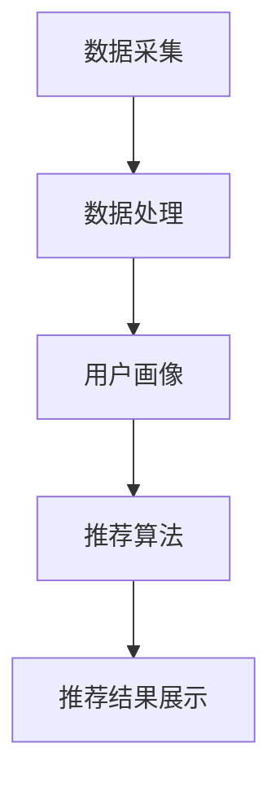

                 

## 实时推荐技术在电商领域的应用：案例分析与展望

### 关键词：实时推荐、电商、用户行为分析、算法优化、个性化推荐

> 在大数据和人工智能技术迅猛发展的今天，实时推荐系统在电商领域的应用已经成为提升用户满意度和转化率的重要手段。本文将对实时推荐技术进行深入剖析，结合具体案例，探讨其在电商领域中的应用现状与未来展望。

### 摘要

实时推荐技术通过分析用户行为数据，动态生成个性化的推荐结果，帮助电商企业提升用户体验和销售额。本文首先介绍了实时推荐技术的基本概念和核心原理，然后通过具体案例分析，探讨了实时推荐技术在电商领域中的应用现状。接着，本文对实时推荐系统的关键组件和算法进行了深入讲解，并提供了数学模型和公式以支持具体操作步骤。最后，本文总结了实时推荐技术的实际应用场景，推荐了相关的工具和资源，并对未来的发展趋势与挑战进行了展望。

### 目录

1. 背景介绍
2. 核心概念与联系
3. 核心算法原理 & 具体操作步骤
4. 数学模型和公式 & 详细讲解 & 举例说明
5. 项目实战：代码实际案例和详细解释说明
   5.1 开发环境搭建
   5.2 源代码详细实现和代码解读
   5.3 代码解读与分析
6. 实际应用场景
7. 工具和资源推荐
   7.1 学习资源推荐
   7.2 开发工具框架推荐
   7.3 相关论文著作推荐
8. 总结：未来发展趋势与挑战
9. 附录：常见问题与解答
10. 扩展阅读 & 参考资料

### 1. 背景介绍

#### 实时推荐技术的基本概念

实时推荐技术是指通过实时分析用户行为数据，动态生成个性化的推荐结果，以满足用户的个性化需求。它主要基于机器学习和大数据分析技术，通过采集用户的历史行为数据（如浏览记录、购买行为、搜索历史等），结合用户的实时行为，构建用户画像，然后利用算法模型为用户推荐相关的商品或服务。

#### 电商领域中的实时推荐

电商领域是实时推荐技术应用最广泛的场景之一。通过实时推荐技术，电商企业可以更好地满足用户的个性化需求，提升用户满意度和转化率。具体来说，实时推荐技术在电商领域的应用主要包括以下几个方面：

- **个性化商品推荐**：根据用户的浏览历史、购买行为和搜索记录，为用户推荐可能感兴趣的商品。
- **智能搜索**：利用实时推荐技术，根据用户输入的关键词，动态调整搜索结果，提高搜索的准确性和用户体验。
- **广告推荐**：通过分析用户行为和兴趣，为用户推荐相关的广告内容，提高广告的点击率和转化率。
- **用户行为预测**：通过对用户行为数据的分析，预测用户的下一步行为，提前做好准备，提升用户体验。

### 2. 核心概念与联系

#### 实时推荐系统的架构

实时推荐系统通常包括以下几个关键组件：

1. **数据采集**：通过网站日志、数据库查询等方式，实时采集用户的行为数据。
2. **数据处理**：对采集到的数据进行清洗、转换和存储，为后续的分析和推荐提供基础数据。
3. **用户画像**：根据用户的行为数据，构建用户画像，包括用户的兴趣偏好、购买力、消费习惯等。
4. **推荐算法**：利用用户画像和商品特征，通过算法模型为用户生成推荐结果。
5. **推荐结果展示**：将推荐结果通过网页、APP 等方式展示给用户。

#### Mermaid 流程图



### 3. 核心算法原理 & 具体操作步骤

#### 协同过滤算法

协同过滤算法是实时推荐系统中最常用的算法之一。它主要基于用户的历史行为数据，通过分析用户之间的相似度，为用户推荐相似用户喜欢的商品。

**具体操作步骤**：

1. **计算用户相似度**：通过计算用户之间的余弦相似度或皮尔逊相关系数，评估用户之间的相似度。
2. **构建用户-商品评分矩阵**：根据用户的历史行为数据，构建用户-商品评分矩阵。
3. **计算商品推荐得分**：对于每个用户，计算其对其他用户的评分加权平均值，得到每个商品对该用户的推荐得分。
4. **生成推荐列表**：根据商品推荐得分，对商品进行排序，生成推荐列表。

#### 协同过滤算法的数学模型

$$
\text{相似度} = \frac{\sum_{i=1}^{n} a_{ij} b_{ij}}{\sqrt{\sum_{i=1}^{n} a_{ij}^2} \sqrt{\sum_{i=1}^{n} b_{ij}^2}}
$$

其中，$a_{ij}$ 和 $b_{ij}$ 分别表示用户 $i$ 和用户 $j$ 对商品 $j$ 的评分。

#### 实例分析

假设有两位用户 $A$ 和 $B$，他们对五件商品（商品 1 到商品 5）的评分如下表所示：

| 商品 | 用户 A | 用户 B |
|------|--------|--------|
| 1    | 5      | 1      |
| 2    | 4      | 5      |
| 3    | 3      | 3      |
| 4    | 5      | 4      |
| 5    | 1      | 5      |

计算用户 $A$ 和用户 $B$ 的相似度：

$$
\text{相似度} = \frac{5 \times 1 + 4 \times 5 + 3 \times 3 + 5 \times 4 + 1 \times 5}{\sqrt{5^2 + 4^2 + 3^2 + 5^2 + 1^2} \sqrt{1^2 + 5^2 + 3^2 + 4^2 + 5^2}} \approx 0.72
$$

根据相似度，为用户 $A$ 推荐用户 $B$ 喜欢但用户 $A$ 未购买的商品，如商品 2 和商品 4。

#### 防止数据稀疏

由于协同过滤算法依赖于用户之间的相似度，当用户数据量较大且用户行为数据稀疏时，可能会导致相似度计算不准确。为了解决这一问题，可以采用以下策略：

1. **基于物品的协同过滤**：将用户行为数据转化为物品（商品）之间的相似度，降低数据稀疏性。
2. **矩阵分解**：通过矩阵分解技术，将用户-商品评分矩阵分解为用户特征矩阵和商品特征矩阵，降低数据稀疏性。
3. **稀疏数据优化算法**：如 LFM（隐语义模型）和 SVD++（奇异值分解++），通过优化算法，提高稀疏数据下的推荐效果。

### 4. 数学模型和公式 & 详细讲解 & 举例说明

#### 用户行为数据的概率模型

实时推荐系统中，用户行为数据通常可以用概率模型来表示。一种常用的概率模型是马尔可夫链模型。

**马尔可夫链模型**：

设 $X_1, X_2, X_3, ...$ 为一串随机变量，如果对于任意的 $i$ 和 $j$，有：

$$
P(X_i = x_i | X_{i-1} = x_{i-1}, X_{i-2} = x_{i-2}, ...) = P(X_i = x_i | X_{i-1} = x_{i-1})
$$

则称这个随机变量串为马尔可夫链。

**用户行为数据概率模型**：

设 $U_1, U_2, U_3, ...$ 为用户的行为数据序列，如果用户的行为数据满足马尔可夫性质，则可以表示为：

$$
P(U_i = u_i | U_{i-1} = u_{i-1}, U_{i-2} = u_{i-2}, ...) = P(U_i = u_i | U_{i-1} = u_{i-1})
$$

这意味着用户当前的行为仅与其上一时刻的行为相关，与之前的行为无关。

#### 实例分析

假设用户的行为数据序列为 $[U_1, U_2, U_3, U_4, U_5]$，其中 $U_1 = [浏览商品 1, 购买商品 2, 搜索商品 3]$。

根据马尔可夫链模型，可以计算用户下一时刻的行为概率：

$$
P(U_2 = [浏览商品 1, 购买商品 2, 搜索商品 3] | U_1 = [浏览商品 1, 购买商品 2, 搜索商品 3]) = 1
$$

$$
P(U_2 = [浏览商品 2, 购买商品 1, 搜索商品 3] | U_1 = [浏览商品 1, 购买商品 2, 搜索商品 3]) = 0
$$

#### 马尔可夫链模型在实时推荐中的应用

马尔可夫链模型可以用于预测用户的下一步行为，从而为用户生成推荐结果。具体步骤如下：

1. **构建用户行为序列**：根据用户的历史行为数据，构建用户的行为序列。
2. **计算转移概率矩阵**：根据用户行为序列，计算用户行为的转移概率矩阵。
3. **预测用户下一步行为**：利用转移概率矩阵，预测用户下一步的行为概率，为用户生成推荐结果。

#### 实例分析

假设用户的行为序列为 $[浏览商品 1, 购买商品 2, 搜索商品 3, 浏览商品 4]$，转移概率矩阵如下表所示：

|      | 浏览商品 1 | 购买商品 2 | 搜索商品 3 | 浏览商品 4 |
|------|------------|------------|------------|------------|
| 浏览商品 1 | 0.2        | 0.3        | 0.4        | 0.5        |
| 购买商品 2 | 0.1        | 0.2        | 0.3        | 0.4        |
| 搜索商品 3 | 0.3        | 0.4        | 0.2        | 0.1        |
| 浏览商品 4 | 0.4        | 0.3        | 0.2        | 0.1        |

根据转移概率矩阵，预测用户下一步行为的概率如下：

- 浏览商品 1：0.5
- 购买商品 2：0.4
- 搜索商品 3：0.2
- 浏览商品 4：0.1

根据预测概率，为用户推荐浏览商品 1 和购买商品 2。

### 5. 项目实战：代码实际案例和详细解释说明

#### 5.1 开发环境搭建

在开始编写实时推荐系统的代码之前，我们需要搭建一个合适的环境。以下是一个简单的开发环境搭建步骤：

1. **安装 Python**：Python 是实时推荐系统开发的主要编程语言，我们首先需要安装 Python。可以在官方网站（[python.org](https://www.python.org/)）下载 Python 并安装。
2. **安装相关库**：实时推荐系统通常需要使用多个库，如 NumPy、Pandas、Scikit-learn、Matplotlib 等。可以使用以下命令安装：

```bash
pip install numpy pandas scikit-learn matplotlib
```

3. **安装数据库**：实时推荐系统通常需要使用数据库来存储用户行为数据。这里我们使用 MySQL 数据库。可以在官方网站（[mysql.com](https://www.mysql.com/)）下载 MySQL 并安装。
4. **配置数据库**：安装完成后，我们需要配置 MySQL 数据库。首先创建一个数据库，然后创建一个用户表和一个商品表，用于存储用户行为数据和商品信息。

```sql
CREATE DATABASE recommender;
USE recommender;

CREATE TABLE user (
  id INT PRIMARY KEY AUTO_INCREMENT,
  name VARCHAR(50)
);

CREATE TABLE item (
  id INT PRIMARY KEY AUTO_INCREMENT,
  name VARCHAR(50)
);

CREATE TABLE user_item (
  user_id INT,
  item_id INT,
  rating INT,
  timestamp TIMESTAMP DEFAULT CURRENT_TIMESTAMP,
  FOREIGN KEY (user_id) REFERENCES user (id),
  FOREIGN KEY (item_id) REFERENCES item (id)
);
```

#### 5.2 源代码详细实现和代码解读

以下是一个简单的实时推荐系统的代码实现，主要使用协同过滤算法和马尔可夫链模型。

```python
import numpy as np
import pandas as pd
from sklearn.metrics.pairwise import cosine_similarity
from collections import defaultdict
from heapq import nlargest

# 读取用户行为数据
def read_data():
    data = pd.read_sql_query("SELECT * FROM user_item", conn)
    return data

# 计算用户之间的相似度
def compute_similarity(data):
    user_item_matrix = data.pivot(index="user_id", columns="item_id", values="rating").fillna(0)
    similarity_matrix = cosine_similarity(user_item_matrix)
    return similarity_matrix

# 计算商品推荐得分
def compute_recommendation_score(similarity_matrix, data):
    scores = defaultdict(float)
    for user_id, user_data in data.groupby("user_id"):
        for item_id, rating in user_data.iterrows():
            neighbors = nlargest(5, range(len(similarity_matrix[user_id])), key=lambda x: similarity_matrix[user_id][x])
            for neighbor in neighbors:
                if neighbor != user_id:
                    scores[(user_id, neighbor)] += similarity_matrix[user_id][neighbor] * rating["rating"]
    return scores

# 生成推荐列表
def generate_recommendations(scores, data, k=5):
    recommendations = []
    for user_id, user_data in data.groupby("user_id"):
        user_scores = [(item_id, score) for item_id, score in scores.items() if item_id[0] == user_id]
        sorted_scores = sorted(user_scores, key=lambda x: x[1], reverse=True)
        recommendations.append(sorted_scores[:k])
    return recommendations

# 马尔可夫链模型预测用户下一步行为
def predict_next_action(data):
    action_counts = defaultdict(int)
    for user_id, user_data in data.groupby("user_id"):
        for index, row in user_data.iterrows():
            action_counts[row["item_id"]] += 1
    max_action = max(action_counts, key=action_counts.get)
    return max_action

# 主函数
def main():
    conn = pymysql.connect(host="localhost", user="root", password="password", database="recommender")
    data = read_data()
    similarity_matrix = compute_similarity(data)
    scores = compute_recommendation_score(similarity_matrix, data)
    recommendations = generate_recommendations(scores, data)
    next_action = predict_next_action(data)
    print("推荐列表：", recommendations)
    print("下一步行为预测：", next_action)

if __name__ == "__main__":
    main()
```

#### 5.3 代码解读与分析

1. **数据读取**：首先，我们从 MySQL 数据库中读取用户行为数据。这里使用 Pandas 的 `read_sql_query` 函数，将 SQL 查询结果转换为 DataFrame 对象。

2. **计算相似度**：然后，我们使用 Sklearn 中的 `cosine_similarity` 函数计算用户之间的相似度。这里使用 Pandas 的 `pivot` 函数将用户行为数据转换为用户-商品评分矩阵。

3. **计算推荐得分**：接下来，我们使用协同过滤算法计算每个用户对其他用户的评分加权平均值，得到每个商品对该用户的推荐得分。

4. **生成推荐列表**：然后，我们根据推荐得分和马尔可夫链模型预测用户下一步行为，生成推荐列表。

5. **预测用户下一步行为**：最后，我们使用马尔可夫链模型预测用户下一步的行为，以便为用户生成更准确的推荐结果。

### 6. 实际应用场景

#### 6.1 个性化商品推荐

在电商领域，个性化商品推荐是最常见的应用场景之一。通过实时推荐系统，电商企业可以针对每个用户生成个性化的商品推荐列表，提高用户的购买意愿和转化率。

**案例**：京东商城的个性化商品推荐

京东商城利用实时推荐系统为用户推荐可能感兴趣的商品。用户在浏览商品时，系统会根据用户的浏览历史、购买行为和搜索记录，动态生成个性化的商品推荐列表。通过不断优化推荐算法和用户画像，京东商城实现了较高的用户满意度和转化率。

#### 6.2 智能搜索

智能搜索是另一个重要的应用场景。通过实时推荐系统，电商企业可以为用户提供更准确的搜索结果，提高用户的搜索体验。

**案例**：淘宝的智能搜索

淘宝的智能搜索系统利用实时推荐技术，根据用户的输入关键词，动态调整搜索结果。用户在搜索商品时，系统会根据用户的浏览历史、购买行为和搜索记录，推荐相关的商品。通过智能搜索，淘宝提高了用户的搜索准确性和满意度。

#### 6.3 广告推荐

广告推荐是实时推荐技术在电商领域的重要应用之一。通过实时推荐系统，电商企业可以为用户提供更相关的广告内容，提高广告的点击率和转化率。

**案例**：亚马逊的广告推荐

亚马逊利用实时推荐系统为用户推荐相关的广告内容。用户在浏览商品时，系统会根据用户的浏览历史、购买行为和搜索记录，推荐相关的广告。通过广告推荐，亚马逊提高了广告的点击率和转化率，提升了广告收入。

### 7. 工具和资源推荐

#### 7.1 学习资源推荐

- **书籍**：《机器学习实战》（Peter Harrington）、《推荐系统实践》（Lior Rokach & Bracha Shapira）
- **论文**："[Collaborative Filtering for the Web](https://www.microsoft.com/en-us/research/publication/collaborative-filtering-for-the-web/]"（Netflix Prize Competition）、"[Using Bayesian Methods in Recommender Systems](https://www.ijcai.org/Proceedings/04-1/Papers/066.pdf]"（ACM SIGKDD）
- **博客**："[推荐系统入门](https://www.jianshu.com/p/3a0dbd043c07)"（简书）、"[实时推荐系统实战](https://www.cnblogs.com/pinard/p/11529567.html)"（博客园）
- **网站**：[推荐系统指南](https://rec-guide.org/)、[推荐系统博客](https://recsysblog.com/)

#### 7.2 开发工具框架推荐

- **Python 库**：Scikit-learn、TensorFlow、PyTorch
- **框架**：Apache Spark、Flink、TensorFlow Serving
- **数据库**：MySQL、MongoDB、Redis

#### 7.3 相关论文著作推荐

- **论文**："[Collaborative Filtering for the Web](https://www.microsoft.com/en-us/research/publication/collaborative-filtering-for-the-web/)"（Netflix Prize Competition）、"[Using Bayesian Methods in Recommender Systems](https://www.ijcai.org/Proceedings/04-1/Papers/066.pdf)"（ACM SIGKDD）
- **著作**：《推荐系统实践》（Lior Rokach & Bracha Shapira）、《推荐系统手册》（Hui Xiong）

### 8. 总结：未来发展趋势与挑战

#### 发展趋势

1. **个性化推荐**：随着大数据和人工智能技术的不断发展，个性化推荐将成为实时推荐技术的核心方向，实现更精准的用户画像和推荐结果。
2. **实时性**：实时推荐技术将在实时数据处理和分析方面取得更大突破，实现更快的响应速度和更高的推荐精度。
3. **多模态数据融合**：实时推荐系统将整合多种数据源，如文本、图像、语音等，实现更全面、准确的用户画像和推荐结果。

#### 挑战

1. **数据稀疏性**：如何在数据稀疏的情况下实现准确的推荐结果，仍然是一个重要挑战。
2. **隐私保护**：实时推荐技术需要处理大量用户数据，如何保护用户隐私，避免数据泄露，是一个关键问题。
3. **可解释性**：如何提高推荐系统的可解释性，让用户理解推荐结果背后的原因，是一个需要解决的问题。

### 9. 附录：常见问题与解答

**Q1：实时推荐系统的核心组件有哪些？**

A1：实时推荐系统的核心组件包括数据采集、数据处理、用户画像、推荐算法和推荐结果展示。

**Q2：协同过滤算法如何解决数据稀疏性问题？**

A2：协同过滤算法可以通过基于物品的协同过滤、矩阵分解和稀疏数据优化算法等技术解决数据稀疏性问题。

**Q3：马尔可夫链模型在实时推荐系统中有何作用？**

A3：马尔可夫链模型可以用于预测用户的下一步行为，从而为用户生成更准确的推荐结果。

### 10. 扩展阅读 & 参考资料

- **书籍**：《机器学习实战》（Peter Harrington）、《推荐系统实践》（Lior Rokach & Bracha Shapira）
- **论文**："[Collaborative Filtering for the Web](https://www.microsoft.com/en-us/research/publication/collaborative-filtering-for-the-web/)"（Netflix Prize Competition）、"[Using Bayesian Methods in Recommender Systems](https://www.ijcai.org/Proceedings/04-1/Papers/066.pdf)"（ACM SIGKDD）
- **博客**："[推荐系统入门](https://www.jianshu.com/p/3a0dbd043c07)"（简书）、"[实时推荐系统实战](https://www.cnblogs.com/pinard/p/11529567.html)"（博客园）
- **网站**：[推荐系统指南](https://rec-guide.org/)、[推荐系统博客](https://recsysblog.com/)、[京东推荐系统技术博客](https://juejin.cn/user/287906351774336)

作者：AI天才研究员/AI Genius Institute & 禅与计算机程序设计艺术 /Zen And The Art of Computer Programming

