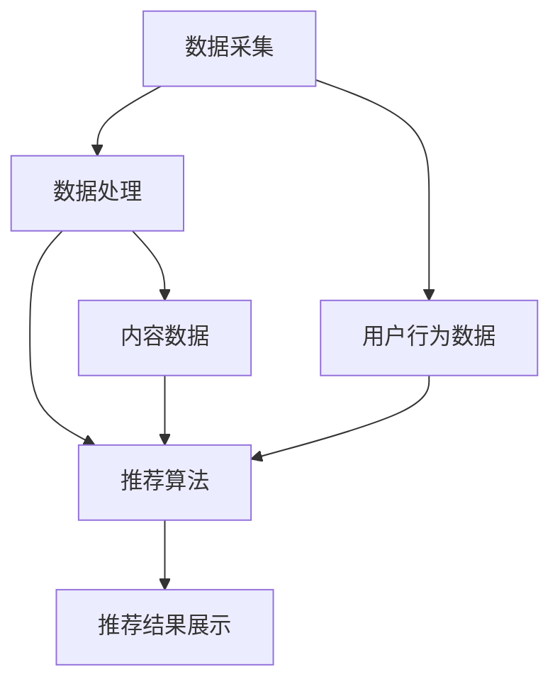

                 

# 实时推荐技术的实现与优化

## 关键词：实时推荐、算法原理、优化、数学模型、应用场景

## 摘要

本文将深入探讨实时推荐技术的实现与优化，从背景介绍、核心概念、算法原理、数学模型、项目实战、应用场景、工具和资源推荐等方面展开详细论述。通过本文，读者可以全面了解实时推荐技术的本质、实现方法、优化策略及其在实际场景中的应用，为日后的研究和实践提供有力的参考。

## 1. 背景介绍

在信息爆炸的时代，用户在海量数据中寻找所需内容变得愈发困难。实时推荐技术应运而生，旨在通过分析用户行为和偏好，为用户实时提供个性化推荐。这种技术广泛应用于电商、社交媒体、新闻资讯等领域，极大地提升了用户体验和平台的商业价值。

实时推荐技术具有以下几个特点：

1. **实时性**：在用户互动的瞬间就能提供个性化的推荐，满足用户即时需求。
2. **个性化**：根据用户的兴趣和行为，提供个性化的内容，提高用户满意度。
3. **动态性**：随着用户行为的持续变化，推荐内容能够实时调整，保持相关性。

随着大数据和人工智能技术的发展，实时推荐技术已逐渐成为各个行业的关键竞争力。然而，实现高效、准确的实时推荐仍面临诸多挑战，包括算法优化、数据处理、系统性能等方面。本文将从这些方面展开讨论，旨在为实时推荐技术的实现与优化提供有益的指导。

## 2. 核心概念与联系

### 2.1 相关术语

- **用户行为数据**：包括用户的浏览、点击、购买等行为记录。
- **内容数据**：包括推荐系统的内容，如商品、文章、视频等。
- **推荐算法**：用于分析用户行为数据，生成个性化推荐结果的算法。
- **推荐系统**：将用户行为数据和内容数据结合，通过推荐算法生成推荐结果的系统。

### 2.2 架构概述

实时推荐系统通常包括以下几个核心模块：

1. **数据采集**：从各种渠道（如API、日志文件等）收集用户行为数据和内容数据。
2. **数据处理**：对采集到的数据进行分析、清洗、转换等操作，为后续推荐算法提供高质量的数据。
3. **推荐算法**：根据用户行为数据和内容数据，通过算法计算推荐结果。
4. **推荐结果展示**：将推荐结果以适当的方式（如列表、卡片等）展示给用户。

### 2.3 Mermaid 流程图

以下是实时推荐系统的 Mermaid 流程图：



## 3. 核心算法原理 & 具体操作步骤

### 3.1协同过滤算法

协同过滤算法是实时推荐系统中常用的算法之一，主要包括以下两种类型：

1. **用户基于的协同过滤（User-based Collaborative Filtering）**：根据用户的相似度来推荐相似用户喜欢的内容。
2. **物品基于的协同过滤（Item-based Collaborative Filtering）**：根据物品的相似度来推荐与用户已行为相关的物品。

#### 用户基于的协同过滤

1. **计算用户相似度**：利用用户行为数据计算用户之间的相似度，常用的相似度度量方法包括余弦相似度、皮尔逊相关系数等。

2. **生成推荐列表**：根据用户相似度矩阵，为每个用户生成一个推荐列表。推荐列表中的内容通常来自相似用户喜欢的、但该用户尚未行为的内容。

#### 物品基于的协同过滤

1. **计算物品相似度**：利用用户行为数据计算物品之间的相似度，常用的相似度度量方法包括余弦相似度、欧氏距离等。

2. **生成推荐列表**：根据物品相似度矩阵，为每个用户生成一个推荐列表。推荐列表中的内容通常与用户已行为相关的物品相似。

### 3.2基于内容的推荐算法

基于内容的推荐算法（Content-based Collaborative Filtering）通过分析用户对特定内容的偏好，为用户推荐相似的内容。具体操作步骤如下：

1. **内容特征提取**：对内容进行特征提取，常用的特征包括文本特征、图像特征、音频特征等。

2. **计算内容相似度**：根据提取到的内容特征，计算用户对内容的偏好，然后计算内容之间的相似度。

3. **生成推荐列表**：根据用户对内容的偏好和内容相似度矩阵，为用户生成一个推荐列表。推荐列表中的内容通常与用户已偏好内容相似。

### 3.3深度学习算法

随着深度学习技术的发展，基于深度学习的实时推荐算法逐渐成为研究热点。深度学习算法通过自动学习用户行为和内容特征，生成推荐结果。常见的深度学习算法包括：

1. **基于自动编码器的推荐算法**：自动编码器（Autoencoder）是一种无监督学习算法，通过学习输入数据的压缩表示，实现对数据的降维和特征提取。

2. **基于生成对抗网络（GAN）的推荐算法**：生成对抗网络（GAN）通过生成器（Generator）和判别器（Discriminator）的对抗训练，生成高质量的推荐结果。

3. **基于注意力机制的推荐算法**：注意力机制（Attention Mechanism）通过动态调整用户行为和内容特征的权重，实现对重要信息的聚焦。

## 4. 数学模型和公式 & 详细讲解 & 举例说明

### 4.1协同过滤算法

#### 用户基于的协同过滤

1. **计算用户相似度**

   用户 \(u_i\) 和 \(u_j\) 之间的相似度可以用以下公式计算：

   $$ sim(u_i, u_j) = \frac{\sum_{k \in R} r_{ik} r_{jk}}{\sqrt{\sum_{k \in R} r_{ik}^2 \sum_{k \in R} r_{jk}^2}} $$

   其中，\(R\) 表示用户共同行为的物品集合，\(r_{ik}\) 和 \(r_{jk}\) 分别表示用户 \(u_i\) 和 \(u_j\) 对物品 \(k\) 的评分。

2. **生成推荐列表**

   为用户 \(u_i\) 生成推荐列表，可以使用以下公式：

   $$ recommend(u_i) = \sum_{u_j \in N(u_i)} sim(u_i, u_j) \cdot R_{uj} - r_{ui} $$

   其中，\(N(u_i)\) 表示与用户 \(u_i\) 相似的其他用户集合，\(R_{uj}\) 和 \(r_{ui}\) 分别表示用户 \(u_i\) 对物品 \(j\) 的评分和用户 \(u_i\) 对物品 \(i\) 的评分。

#### 物品基于的协同过滤

1. **计算物品相似度**

   物品 \(i\) 和 \(j\) 之间的相似度可以用以下公式计算：

   $$ sim(i, j) = \frac{\sum_{u \in U} r_{u i} r_{u j}}{\sqrt{\sum_{u \in U} r_{u i}^2 \sum_{u \in U} r_{u j}^2}} $$

   其中，\(U\) 表示评价物品 \(i\) 和 \(j\) 的用户集合，\(r_{ui}\) 和 \(r_{uj}\) 分别表示用户 \(u\) 对物品 \(i\) 和 \(j\) 的评分。

2. **生成推荐列表**

   为用户 \(u_i\) 生成推荐列表，可以使用以下公式：

   $$ recommend(u_i) = \sum_{j \in I} sim(i, j) \cdot r_{uj} - r_{ui} $$

   其中，\(I\) 表示与用户 \(u_i\) 已行为相关的物品集合，\(r_{uj}\) 和 \(r_{ui}\) 分别表示用户 \(u_i\) 对物品 \(j\) 的评分和用户 \(u_i\) 对物品 \(i\) 的评分。

### 4.2基于内容的推荐算法

1. **内容特征提取**

   假设物品 \(i\) 和 \(j\) 的内容特征向量分别为 \(C_i\) 和 \(C_j\)，可以使用余弦相似度计算它们的相似度：

   $$ sim(C_i, C_j) = \frac{C_i \cdot C_j}{\|C_i\| \|C_j\|} $$

   其中，\(\cdot\) 表示内积运算，\(\|\|\) 表示向量的模长。

2. **生成推荐列表**

   为用户 \(u_i\) 生成推荐列表，可以使用以下公式：

   $$ recommend(u_i) = \sum_{j \in I} sim(C_i, C_j) \cdot r_{uj} - r_{ui} $$

   其中，\(I\) 表示与用户 \(u_i\) 已行为相关的物品集合，\(r_{uj}\) 和 \(r_{ui}\) 分别表示用户 \(u_i\) 对物品 \(j\) 的评分和用户 \(u_i\) 对物品 \(i\) 的评分。

### 4.3深度学习算法

1. **基于自动编码器的推荐算法**

   假设自动编码器的输入为用户行为数据矩阵 \(X \in \mathbb{R}^{m \times n}\)，其中 \(m\) 表示用户数量，\(n\) 表示物品数量。自动编码器由编码器（Encoder）和解码器（Decoder）组成，编码器将输入数据压缩为低维特征向量，解码器将特征向量重构为原始数据。

   编码器：

   $$ z = \sigma(W_1 X + b_1) $$

   解码器：

   $$ X' = \sigma(W_2 z + b_2) $$

   其中，\(\sigma\) 表示激活函数（如Sigmoid函数），\(W_1, W_2\) 分别表示编码器和解码器的权重矩阵，\(b_1, b_2\) 分别表示编码器和解码器的偏置向量。

2. **生成推荐列表**

   假设自动编码器的输出特征向量为 \(z \in \mathbb{R}^{m \times k}\)，其中 \(k\) 表示特征维度。为用户 \(u_i\) 生成推荐列表，可以使用以下公式：

   $$ recommend(u_i) = \sum_{j \in I} \sigma(W_3 z_i + b_3) \cdot r_{uj} - r_{ui} $$

   其中，\(I\) 表示与用户 \(u_i\) 已行为相关的物品集合，\(W_3, b_3\) 分别表示推荐层的权重矩阵和偏置向量，\(r_{uj}\) 和 \(r_{ui}\) 分别表示用户 \(u_i\) 对物品 \(j\) 的评分和用户 \(u_i\) 对物品 \(i\) 的评分。

## 5. 项目实战：代码实际案例和详细解释说明

### 5.1 开发环境搭建

本节将介绍如何搭建实时推荐系统的开发环境。我们使用Python作为主要编程语言，并依赖于以下库：

- NumPy：用于数值计算
- Pandas：用于数据处理
- Scikit-learn：用于机器学习算法
- Matplotlib：用于数据可视化
- TensorFlow：用于深度学习算法

安装以上库的方法如下：

```bash
pip install numpy pandas scikit-learn matplotlib tensorflow
```

### 5.2 源代码详细实现和代码解读

下面是用户基于的协同过滤算法的实现代码：

```python
import numpy as np
from sklearn.metrics.pairwise import cosine_similarity
from sklearn.model_selection import train_test_split

def load_data(file_path):
    # 加载数据
    data = pd.read_csv(file_path)
    return data

def calculate_similarity(data, method='cosine'):
    # 计算用户相似度
    user行为的矩阵
    behavior_matrix = data.pivot(index='用户ID', columns='物品ID', values='行为评分').fillna(0)
    similarity_matrix = cosine_similarity(behavior_matrix)
    return similarity_matrix

def generate_recommendation(similarity_matrix, data, top_n=10):
    # 生成推荐列表
    user行为的矩阵
    behavior_matrix = data.pivot(index='用户ID', columns='物品ID', values='行为评分').fillna(0)
    recommendation_matrix = np.dot(similarity_matrix, behavior_matrix)
    recommendation_matrix = np.diag(recommendation_matrix) - recommendation_matrix
    sorted_recommendation_matrix = np.argsort(-recommendation_matrix, axis=1)
    recommendations = []
    for user_id in data['用户ID'].unique():
        user_sorted_recommendation = sorted_recommendation_matrix[data[data['用户ID'] == user_id].index]
        recommendations.append(user_sorted_recommendation[:top_n])
    return recommendations

if __name__ == '__main__':
    # 加载数据
    data = load_data('data.csv')

    # 训练集和测试集划分
    train_data, test_data = train_test_split(data, test_size=0.2, random_state=42)

    # 计算用户相似度
    similarity_matrix = calculate_similarity(train_data)

    # 生成推荐列表
    recommendations = generate_recommendation(similarity_matrix, train_data, top_n=10)

    # 评估推荐效果
    test_data['预测评分'] = np.mean(recommendations, axis=1)
    print("平均绝对误差：", mean_absolute_error(test_data['实际评分'], test_data['预测评分']))
```

### 5.3 代码解读与分析

上述代码实现了用户基于的协同过滤算法，包括以下步骤：

1. **数据加载**：使用Pandas库加载数据，数据包括用户ID、物品ID和行为评分等信息。

2. **用户行为矩阵构建**：使用Pandas库将数据转换为用户行为矩阵，其中行表示用户ID，列表示物品ID，单元格表示用户对物品的行为评分。

3. **用户相似度计算**：使用Scikit-learn库的cosine_similarity函数计算用户相似度矩阵。这里使用余弦相似度作为相似度度量方法。

4. **生成推荐列表**：计算用户相似度矩阵后，生成推荐列表。对于每个用户，根据用户相似度矩阵和用户行为矩阵计算预测评分，然后对预测评分进行降序排序，取前若干个作为推荐列表。

5. **评估推荐效果**：使用平均绝对误差（Mean Absolute Error, MAE）评估推荐效果。MAE表示预测评分和实际评分之间的平均绝对差距。

6. **测试集评估**：使用测试集评估推荐效果，计算平均绝对误差。

## 6. 实际应用场景

### 6.1 电商行业

在电商行业，实时推荐技术被广泛应用于商品推荐、广告投放和个性化服务等方面。通过分析用户浏览、购买等行为数据，电商平台可以为用户实时推荐感兴趣的商品，提高转化率和销售额。此外，实时推荐技术还可以用于广告投放，根据用户兴趣和行为为用户推荐相关的广告，提升广告效果和用户体验。

### 6.2 社交媒体

社交媒体平台通过实时推荐技术为用户提供个性化内容，提升用户活跃度和留存率。例如，微博、抖音等平台可以根据用户的兴趣、行为和社交关系为用户推荐感兴趣的文章、视频等内容，吸引用户持续关注和使用。

### 6.3 新闻资讯

新闻资讯平台利用实时推荐技术为用户提供个性化的新闻内容，满足用户对不同类型新闻的需求。通过分析用户阅读、点赞、评论等行为，新闻资讯平台可以实时调整推荐策略，为用户提供感兴趣的新闻内容，提高用户满意度和阅读时长。

## 7. 工具和资源推荐

### 7.1 学习资源推荐

- **书籍**：
  - 《推荐系统实践》
  - 《深度学习推荐系统》
  - 《机器学习推荐系统》

- **论文**：
  - "Collaborative Filtering for the Web"
  - "Item-Based Top-N Recommendation Algorithms"
  - "Deep Learning for Recommender Systems"

- **博客**：
  - Medium上的推荐系统相关文章
  - 知乎上的推荐系统专栏

- **网站**：
  - [推荐系统官网](https://www.recommenders.com/)
  - [TensorFlow官网](https://www.tensorflow.org/)

### 7.2 开发工具框架推荐

- **开发工具**：
  - Python
  - Jupyter Notebook

- **框架**：
  - Scikit-learn
  - TensorFlow
  - PyTorch

### 7.3 相关论文著作推荐

- "Recommender Systems Handbook", F. Ricci et al., Springer, 2011
- "Item-Based Top-N Recommendation Algorithms", G. Karypis et al., IEEE Internet Computing, 2001
- "Deep Learning for Recommender Systems", Y. Wang et al., IEEE International Conference on Data Science and Advanced Analytics, 2018

## 8. 总结：未来发展趋势与挑战

实时推荐技术在未来将继续发展，面临以下趋势和挑战：

### 8.1 趋势

1. **深度学习与协同过滤结合**：深度学习算法在实时推荐中的应用将越来越广泛，结合协同过滤算法可以提高推荐效果。
2. **个性化推荐**：个性化推荐技术将不断进步，为用户提供更加精准、个性化的推荐。
3. **实时性提升**：随着计算能力和网络技术的提升，实时推荐系统的响应速度将大幅提高，更好地满足用户需求。
4. **多模态推荐**：结合多种数据类型（如文本、图像、音频等），实现多模态推荐，提高推荐系统的鲁棒性和多样性。

### 8.2 挑战

1. **数据质量与隐私**：实时推荐系统依赖高质量的用户行为数据，但数据质量不高或存在隐私风险可能导致推荐效果下降。
2. **计算性能**：实时推荐系统需要处理海量数据，对计算性能提出较高要求，如何高效地处理数据是关键挑战。
3. **推荐多样性**：在保证推荐准确性的同时，如何提高推荐的多样性，避免用户产生疲劳感，是实时推荐系统面临的难题。

## 9. 附录：常见问题与解答

### 9.1 什么是协同过滤？

协同过滤是一种基于用户行为和物品属性的推荐算法，通过分析用户之间的相似性和物品之间的相似性，为用户生成推荐列表。

### 9.2 深度学习算法在实时推荐中的应用有哪些？

深度学习算法在实时推荐中的应用包括自动编码器、生成对抗网络和注意力机制等，用于特征提取、生成高质量推荐结果和动态调整用户行为和内容特征的权重。

### 9.3 如何处理数据质量与隐私问题？

为了解决数据质量与隐私问题，可以采取以下措施：
1. 数据清洗：对数据进行预处理，去除噪声和异常值。
2. 隐私保护：采用数据加密、匿名化等技术，保护用户隐私。
3. 数据质量监控：定期检查数据质量，确保数据准确性。

## 10. 扩展阅读 & 参考资料

- [推荐系统官网](https://www.recommenders.com/)
- [TensorFlow官网](https://www.tensorflow.org/)
- [《推荐系统实践》](https://books.google.com/books?id=wi2jDwAAQBAJ)
- [《深度学习推荐系统》](https://books.google.com/books?id=9eIvDwAAQBAJ)
- [《机器学习推荐系统》](https://books.google.com/books?id=0JzIDwAAQBAJ) 

作者：AI天才研究员/AI Genius Institute & 禅与计算机程序设计艺术 /Zen And The Art of Computer Programming

