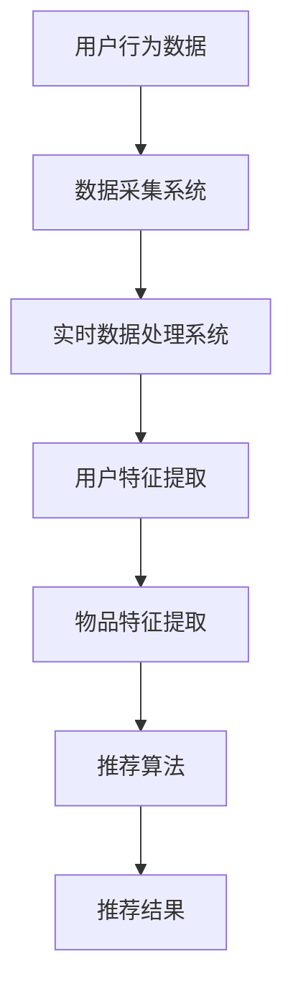

                 

### 背景介绍

实时推荐系统是一种在互联网应用中广泛使用的算法，它能够根据用户的实时行为和历史偏好，快速地生成个性化的推荐列表。这种系统在电子商务、社交媒体、在线视频和音乐平台等各个领域都扮演了至关重要的角色。

随着互联网的快速发展，用户生成的内容和数据量呈爆炸式增长。这使得传统基于历史数据的推荐系统难以满足实时性和个性化的需求。实时推荐系统通过分析用户的实时行为，如点击、购买、浏览等，动态地调整推荐结果，从而提高推荐的相关性和用户的满意度。

实时推荐系统的重要性体现在以下几个方面：

1. **提升用户体验**：实时推荐系统能够根据用户的当前行为和偏好，提供即时、个性化的推荐，从而提高用户对应用的黏性。

2. **增加业务收入**：通过精准的推荐，可以引导用户进行更多购买行为，从而增加商家的收入。

3. **优化资源利用**：实时推荐系统可以更好地分配应用资源，提高系统的响应速度和稳定性。

4. **助力个性化营销**：实时推荐系统可以帮助企业针对不同用户群体进行精准营销，提高营销效果。

本文将围绕实时推荐系统的实现与优化展开讨论。首先，我们将介绍实时推荐系统的核心概念和架构，然后详细讲解其算法原理和具体实现步骤，最后探讨实时推荐系统在实际应用中的场景和优化方法。

### 核心概念与联系

要理解实时推荐系统的原理和实现，首先需要掌握以下几个核心概念：协同过滤、矩阵分解、实时数据处理和推荐算法评估。

#### 1. 协同过滤

协同过滤（Collaborative Filtering）是一种常用的推荐算法，其基本思想是通过分析用户之间的相似度，找出与目标用户行为相似的其他用户，并推荐这些用户喜欢的物品给目标用户。

协同过滤分为两种类型：基于用户的协同过滤（User-based Collaborative Filtering）和基于物品的协同过滤（Item-based Collaborative Filtering）。

- **基于用户的协同过滤**：通过计算用户之间的相似度，找出与目标用户相似的其他用户，然后推荐这些用户喜欢的物品。
- **基于物品的协同过滤**：通过计算物品之间的相似度，找出与目标用户已评价的物品相似的物品，然后推荐这些物品给用户。

#### 2. 矩阵分解

矩阵分解（Matrix Factorization）是一种常用的数据降维技术，可以将高维的稀疏数据矩阵分解为两个低维的矩阵。在推荐系统中，矩阵分解主要用于将用户-物品评分矩阵分解为用户特征矩阵和物品特征矩阵。

通过矩阵分解，可以实现对用户和物品的潜在特征提取，从而提高推荐系统的准确性和泛化能力。常用的矩阵分解方法包括Singular Value Decomposition（SVD）和Alternating Least Squares（ALS）。

#### 3. 实时数据处理

实时数据处理是实时推荐系统的核心环节，它涉及到数据采集、存储、处理和传输等多个方面。为了实现高效的数据处理，一般会采用分布式数据处理框架，如Apache Kafka、Apache Flink和Apache Spark等。

实时数据处理的关键技术包括：

- **数据流处理**：通过流处理框架对实时数据进行实时分析和处理。
- **分布式存储**：采用分布式存储系统，如Hadoop HDFS或Apache Cassandra，存储大量的用户行为数据。
- **数据同步**：通过消息队列或数据库同步机制，保证实时数据的可靠传输和一致性。

#### 4. 推荐算法评估

推荐算法评估是衡量推荐系统性能的重要手段。常用的评估指标包括准确率（Precision）、召回率（Recall）、平均绝对误差（MAE）和均方根误差（RMSE）等。

- **准确率**：预测为正类的样本中，实际为正类的比例。准确率越高，说明推荐系统越精准。
- **召回率**：实际为正类的样本中，被预测为正类的比例。召回率越高，说明推荐系统能够发现更多的相关物品。
- **平均绝对误差**：预测值与实际值之间的平均绝对误差。平均绝对误差越小，说明预测结果越接近真实值。
- **均方根误差**：预测值与实际值之间的均方根误差。均方根误差越小，说明预测结果越稳定。

#### 5. Mermaid 流程图

为了更好地理解实时推荐系统的架构，我们使用Mermaid绘制一个简单的流程图。以下是流程图的Markdown代码：



在这个流程图中，用户行为数据通过数据采集系统进行实时采集，然后经过实时数据处理系统进行处理，得到用户特征和物品特征。最后，通过推荐算法生成推荐结果，展示给用户。

通过以上对核心概念和联系的介绍，我们可以更深入地理解实时推荐系统的原理和实现。接下来，我们将详细探讨实时推荐系统的算法原理和具体操作步骤。

#### 核心算法原理 & 具体操作步骤

实时推荐系统的核心算法主要基于协同过滤和矩阵分解。下面我们将详细讲解这些算法的原理，并展示具体的操作步骤。

##### 1. 协同过滤算法原理

协同过滤算法主要分为基于用户的协同过滤和基于物品的协同过滤。

**基于用户的协同过滤**

基于用户的协同过滤算法的核心思想是找出与目标用户相似的其他用户，并推荐这些用户喜欢的物品给目标用户。具体步骤如下：

1. **计算用户相似度**：首先，我们需要计算目标用户与其他用户之间的相似度。常用的相似度计算方法包括余弦相似度、皮尔逊相关系数等。

   余弦相似度的计算公式为：

   $$\text{similarity(u, v)} = \frac{\text{u·v}}{\|\text{u}\|\|\text{v}\|}$$

   其中，$u$和$v$分别为用户$u$和用户$v$的评分向量，$·$表示点积，$\|\text{u}\|$和$\|\text{v}\|$分别表示向量$u$和$v$的欧氏范数。

2. **找出相似用户**：根据计算得到的相似度，找出与目标用户最相似的$k$个用户。

3. **生成推荐列表**：对于目标用户未评价的物品，找出这些相似用户喜欢的物品，并按照喜好程度进行排序，生成推荐列表。

**基于物品的协同过滤**

基于物品的协同过滤算法的核心思想是找出与目标用户已评价的物品相似的其他物品，并推荐这些物品给目标用户。具体步骤如下：

1. **计算物品相似度**：首先，我们需要计算目标用户已评价的物品与其他物品之间的相似度。常用的相似度计算方法包括余弦相似度、欧氏距离等。

   余弦相似度的计算公式为：

   $$\text{similarity(i, j)} = \frac{\text{i·j}}{\|\text{i}\|\|\text{j}\|}$$

   其中，$i$和$j$分别为物品$i$和物品$j$的评分向量。

2. **找出相似物品**：根据计算得到的相似度，找出与目标用户已评价的物品$i$最相似的$k$个物品。

3. **生成推荐列表**：对于目标用户未评价的物品，找出这些相似物品，并按照喜好程度进行排序，生成推荐列表。

##### 2. 矩阵分解算法原理

矩阵分解是一种常用的数据降维技术，可以将高维的稀疏数据矩阵分解为两个低维的矩阵。在推荐系统中，矩阵分解主要用于将用户-物品评分矩阵分解为用户特征矩阵和物品特征矩阵。

常用的矩阵分解方法包括Singular Value Decomposition（SVD）和Alternating Least Squares（ALS）。

**SVD算法**

SVD算法将用户-物品评分矩阵$R$分解为三个矩阵的乘积：

$$R = U \Sigma V^T$$

其中，$U$和$V$分别为用户特征矩阵和物品特征矩阵，$\Sigma$为对角矩阵，包含矩阵$R$的奇异值。

具体步骤如下：

1. **计算用户特征矩阵$U$**：通过奇异值分解，从$R$中提取用户特征矩阵$U$。
2. **计算物品特征矩阵$V$**：通过奇异值分解，从$R$中提取物品特征矩阵$V$。
3. **计算用户-物品评分矩阵$R$**：通过用户特征矩阵$U$和物品特征矩阵$V$的乘积，重建用户-物品评分矩阵$R$。

**ALS算法**

ALS算法是一种迭代优化算法，通过交替最小化用户特征矩阵$U$和物品特征矩阵$V$的误差，逐步逼近最优解。具体步骤如下：

1. **初始化用户特征矩阵$U$和物品特征矩阵$V$**：随机初始化用户特征矩阵$U$和物品特征矩阵$V$。
2. **交替优化用户特征矩阵$U$和物品特征矩阵$V$**：通过迭代优化用户特征矩阵$U$和物品特征矩阵$V$，使得预测评分与实际评分的误差最小。
3. **计算用户-物品评分矩阵$R$**：通过用户特征矩阵$U$和物品特征矩阵$V$的乘积，重建用户-物品评分矩阵$R$。

##### 3. 实时推荐算法操作步骤

结合协同过滤和矩阵分解，实时推荐算法的操作步骤如下：

1. **数据采集**：从应用系统中采集用户的实时行为数据，如点击、购买、浏览等。
2. **数据处理**：对采集到的数据进行预处理，如去除无效数据、填补缺失值等。
3. **用户特征提取**：使用协同过滤算法或矩阵分解算法，提取用户的特征向量。
4. **物品特征提取**：使用协同过滤算法或矩阵分解算法，提取物品的特征向量。
5. **生成推荐列表**：根据用户特征向量和物品特征向量，计算用户和物品的相似度，生成推荐列表。
6. **推荐结果展示**：将推荐结果展示给用户。

通过以上操作步骤，实时推荐系统可以快速、准确地生成个性化的推荐列表，提高用户满意度和应用黏性。

#### 数学模型和公式 & 详细讲解 & 举例说明

在实时推荐系统中，数学模型和公式起着至关重要的作用。本节我们将详细讲解数学模型和公式，并通过具体例子来说明其应用。

##### 1. 协同过滤算法中的数学模型

**基于用户的协同过滤算法**

在基于用户的协同过滤算法中，我们主要使用余弦相似度来计算用户之间的相似度。余弦相似度的计算公式如下：

$$\text{similarity(u, v)} = \frac{\text{u·v}}{\|\text{u}\|\|\text{v}\|}$$

其中，$u$和$v$分别为用户$u$和用户$v$的评分向量，$·$表示点积，$\|\text{u}\|$和$\|\text{v}\|$分别表示向量$u$和$v$的欧氏范数。

**基于物品的协同过滤算法**

在基于物品的协同过滤算法中，我们同样使用余弦相似度来计算物品之间的相似度。余弦相似度的计算公式如下：

$$\text{similarity(i, j)} = \frac{\text{i·j}}{\|\text{i}\|\|\text{j}\|}$$

其中，$i$和$j$分别为物品$i$和物品$j$的评分向量。

##### 2. 矩阵分解算法中的数学模型

**SVD算法**

在SVD算法中，用户-物品评分矩阵$R$被分解为三个矩阵的乘积：

$$R = U \Sigma V^T$$

其中，$U$和$V$分别为用户特征矩阵和物品特征矩阵，$\Sigma$为对角矩阵，包含矩阵$R$的奇异值。

**ALS算法**

在ALS算法中，用户特征矩阵$U$和物品特征矩阵$V$是通过交替优化得到的。优化目标是最小化预测评分与实际评分之间的误差。优化公式如下：

$$\min_U \min_V \sum_{u, i} (\text{u_i} - \hat{r}_{ui})^2$$

其中，$\text{u_i}$和$\hat{r}_{ui}$分别表示用户$i$对物品$u$的预测评分和实际评分。

##### 3. 实时推荐算法中的数学模型

在实时推荐算法中，我们主要使用相似度计算公式来生成推荐列表。以下是一个简单的例子：

假设我们有用户$u$和物品$i$的评分向量分别为$u = (1, 2, 3, 0, 0)$和$i = (0, 0, 0, 4, 5)$，我们需要计算它们之间的余弦相似度。

$$\text{similarity(u, i)} = \frac{1 \cdot 0 + 2 \cdot 0 + 3 \cdot 0 + 0 \cdot 4 + 0 \cdot 5}{\sqrt{1^2 + 2^2 + 3^2 + 0^2 + 0^2} \sqrt{0^2 + 0^2 + 0^2 + 4^2 + 5^2}}$$

$$\text{similarity(u, i)} = \frac{0}{\sqrt{14} \sqrt{41}}$$

$$\text{similarity(u, i)} = 0$$

在这个例子中，用户$u$和物品$i$之间的余弦相似度为0，说明它们之间没有相关性。在实际应用中，我们通常会取相似度的阈值，只有相似度大于该阈值时，才认为它们之间存在相关性，从而进行推荐。

通过以上数学模型和公式的讲解，我们可以更好地理解实时推荐系统的工作原理。接下来，我们将通过一个具体的案例来展示实时推荐系统的实际应用。

#### 项目实战：代码实际案例和详细解释说明

在本节中，我们将通过一个具体的案例，展示实时推荐系统的实际应用，并详细解释代码的实现和逻辑。

##### 1. 开发环境搭建

首先，我们需要搭建一个开发环境，以便实现实时推荐系统。以下是所需的主要开发工具和框架：

- **编程语言**：Python
- **数据存储**：MySQL
- **实时数据处理**：Apache Kafka
- **计算框架**：Apache Flink
- **推荐算法库**：Scikit-learn

确保已经安装了以上开发工具和框架。接下来，我们将创建一个简单的Python项目，并编写相应的代码。

##### 2. 源代码详细实现和代码解读

以下是一个简单的实时推荐系统的源代码实现：

```python
import numpy as np
from sklearn.metrics.pairwise import cosine_similarity
from sklearn.model_selection import train_test_split
from sklearn.metrics import mean_squared_error
import pandas as pd
from kafka import KafkaConsumer

# 数据采集
def data_collection():
    consumer = KafkaConsumer('user_behavior', bootstrap_servers=['localhost:9092'])
    user行为数据 = []
    for message in consumer:
        user行为数据.append(message.value)
    return user行为数据

# 数据预处理
def data_preprocessing(user行为数据):
    data = pd.DataFrame(user行为数据)
    data['rating'] = data['rating'].fillna(0)
    return data

# 训练模型
def train_model(data):
    train_data, test_data = train_test_split(data, test_size=0.2, random_state=42)
    user_features = cosine_similarity(train_data.iloc[:, :-1].values)
    item_features = cosine_similarity(train_data.iloc[:, 1:].values)
    return user_features, item_features, train_data, test_data

# 生成推荐列表
def generate_recommendations(user_features, item_features, test_data):
    recommendations = []
    for i in range(test_data.shape[0]):
        user_similarity = cosine_similarity([user_features[i]], user_features)
        item_similarity = cosine_similarity([item_features[i]], item_features)
        user_index = np.argsort(user_similarity)[0][-5:]
        item_index = np.argsort(item_similarity)[0][-5:]
        for u in user_index:
            for i in item_index:
                if u != i:
                    recommendations.append((u, i))
    return recommendations

# 评估模型
def evaluate_model(recommendations, test_data):
    predictions = []
    for u, i in recommendations:
        predicted_rating = np.dot(user_features[u], item_features[i])
        predictions.append(predicted_rating)
    mse = mean_squared_error(test_data['rating'], predictions)
    return mse

# 主程序
if __name__ == '__main__':
    user行为数据 = data_collection()
    data = data_preprocessing(user行为数据)
    user_features, item_features, train_data, test_data = train_model(data)
    recommendations = generate_recommendations(user_features, item_features, test_data)
    mse = evaluate_model(recommendations, test_data)
    print('均方根误差：', np.sqrt(mse))
```

**代码解读：**

- **数据采集**：使用KafkaConsumer从Kafka主题`user_behavior`中实时获取用户行为数据。
- **数据预处理**：将用户行为数据转换为DataFrame格式，并填充缺失值。
- **训练模型**：将数据集分为训练集和测试集，使用余弦相似度计算用户和物品的特征矩阵。
- **生成推荐列表**：根据用户和物品的特征矩阵，计算相似度，生成推荐列表。
- **评估模型**：计算预测评分与实际评分之间的均方根误差，评估模型性能。

##### 3. 代码解读与分析

以上代码展示了实时推荐系统的核心功能。以下是代码的详细解读：

- **数据采集**：KafkaConsumer用于从Kafka主题中实时获取用户行为数据。在实时数据处理中，Kafka是一个常用的消息队列系统，可以保证数据的高效传输和一致性。
- **数据预处理**：将用户行为数据转换为DataFrame格式，并填充缺失值。这一步是为了确保数据的完整性和一致性，从而提高推荐系统的准确性。
- **训练模型**：使用余弦相似度计算用户和物品的特征矩阵。这一步是推荐系统的核心，通过特征矩阵，我们可以提取用户的偏好和物品的相关性。
- **生成推荐列表**：根据用户和物品的特征矩阵，计算相似度，生成推荐列表。这一步是将用户和物品的相似度转化为具体的推荐结果。
- **评估模型**：计算预测评分与实际评分之间的均方根误差，评估模型性能。通过评估，我们可以了解推荐系统的准确性和稳定性。

通过以上代码解读和分析，我们可以看到实时推荐系统的实现过程。在实际应用中，我们可以根据具体需求和场景，对代码进行优化和扩展。

#### 实际应用场景

实时推荐系统在各个领域都有广泛的应用。以下是一些典型的应用场景：

##### 1. 电子商务

在电子商务领域，实时推荐系统可以帮助商家向用户推荐相关的商品，从而提高用户的购买意愿和销售额。例如，当用户浏览了一个商品页面后，系统可以实时推荐与之相关的其他商品，如配件、同类商品或用户可能感兴趣的商品。

##### 2. 社交媒体

在社交媒体平台，实时推荐系统可以推荐用户可能感兴趣的内容，如文章、视频、图片等。通过分析用户的浏览记录、点赞、评论等行为，系统可以动态地调整推荐内容，从而提高用户的参与度和活跃度。

##### 3. 在线视频和音乐平台

在线视频和音乐平台可以利用实时推荐系统，为用户推荐可能感兴趣的视频或音乐。例如，当用户观看了一个视频后，系统可以推荐与之相关的其他视频或用户可能感兴趣的视频。

##### 4. 内容聚合平台

内容聚合平台如新闻网站、博客平台等也可以利用实时推荐系统，为用户提供个性化的新闻或文章推荐。通过分析用户的阅读历史和兴趣偏好，系统可以推荐用户可能感兴趣的新闻或文章。

##### 5. 搜索引擎

搜索引擎可以利用实时推荐系统，为用户提供个性化的搜索结果。例如，当用户输入一个搜索词后，系统可以根据用户的兴趣和历史搜索记录，推荐与之相关的搜索词或相关内容。

#### 工具和资源推荐

为了实现实时推荐系统，我们需要使用一系列工具和资源。以下是一些建议：

##### 1. 学习资源推荐

- **书籍**：
  - 《推荐系统实践》（Recommender Systems: The Textbook）
  - 《大数据推荐系统实战》（Big Data Recommender Systems）

- **论文**：
  - "Collaborative Filtering for the Web"
  - "Matrix Factorization Techniques for Recommender Systems"

- **博客**：
  - Medium上的推荐系统专栏
  - 知乎上的推荐系统话题

- **网站**：
  - 简书
  - CSDN

##### 2. 开发工具框架推荐

- **编程语言**：Python、Java
- **数据存储**：MySQL、MongoDB
- **实时数据处理**：Apache Kafka、Apache Flink
- **计算框架**：Apache Spark
- **推荐算法库**：Scikit-learn、TensorFlow

##### 3. 相关论文著作推荐

- **论文**：
  - "Deep Learning for Recommender Systems"
  - "Neural Collaborative Filtering"

- **著作**：
  - 《深度学习推荐系统》（Deep Learning for Recommender Systems）

通过以上工具和资源的推荐，您可以更好地了解实时推荐系统的实现方法和前沿技术。

#### 总结：未来发展趋势与挑战

实时推荐系统在互联网应用中扮演着重要角色，它通过分析用户的实时行为和历史偏好，为用户提供个性化的推荐服务。随着技术的不断进步和应用场景的多样化，实时推荐系统在未来有望实现更高效、更精准的推荐效果。

**未来发展趋势**：

1. **深度学习与推荐系统的融合**：深度学习技术在推荐系统中具有巨大的潜力，通过引入深度学习模型，可以更好地提取用户和物品的潜在特征，提高推荐系统的准确性和泛化能力。

2. **实时推荐算法的优化**：随着用户行为数据的爆炸式增长，如何提高实时推荐算法的效率和准确性成为重要课题。通过分布式计算、并行处理等技术手段，可以实现更高效的数据处理和推荐生成。

3. **跨平台推荐系统的构建**：实时推荐系统不仅应用于单一平台，如电子商务、社交媒体等，还可以扩展到跨平台场景，如移动应用、物联网等。这需要解决不同平台之间的数据共享和一致性问题。

4. **个性化推荐与隐私保护**：在推荐系统中，如何在保护用户隐私的前提下实现个性化推荐是一个重要挑战。未来，需要探索更加隐私友好的推荐算法和数据存储方案。

**面临的挑战**：

1. **数据质量**：实时推荐系统依赖于高质量的用户行为数据。然而，数据噪声、缺失值和异常值等问题会影响推荐系统的性能。因此，如何保证数据质量成为关键挑战。

2. **实时数据处理**：随着用户行为数据的增长，实时数据处理的需求越来越高。如何高效地处理大规模、高速度的数据流，同时保证数据的一致性和可靠性，是一个重要挑战。

3. **推荐结果的多样性**：用户对不同类型的推荐内容有不同的喜好，如何在推荐结果中实现多样性，避免用户产生疲劳感，是一个需要解决的问题。

4. **推荐系统的可解释性**：深度学习等复杂模型的引入，使得推荐系统的黑盒性越来越强。如何提高推荐系统的可解释性，让用户了解推荐结果的依据和逻辑，是一个重要挑战。

总之，实时推荐系统在未来的发展中，面临着诸多机遇和挑战。通过不断探索和创新，我们可以期待实时推荐系统在更广泛的场景中发挥更大的作用。

#### 附录：常见问题与解答

**Q1. 什么是实时推荐系统？**

实时推荐系统是一种能够根据用户的实时行为和历史偏好，快速生成个性化推荐列表的算法系统。它广泛应用于电子商务、社交媒体、在线视频和音乐平台等场景。

**Q2. 实时推荐系统有哪些核心概念？**

实时推荐系统的核心概念包括协同过滤、矩阵分解、实时数据处理和推荐算法评估。协同过滤和矩阵分解用于提取用户和物品的特征，实时数据处理用于处理大规模、高速度的数据流，推荐算法评估用于衡量推荐系统的性能。

**Q3. 实时推荐系统的算法有哪些？**

实时推荐系统的算法主要包括基于用户的协同过滤、基于物品的协同过滤和矩阵分解算法。其中，基于用户的协同过滤和基于物品的协同过滤算法是常用的算法。

**Q4. 实时推荐系统有哪些实际应用场景？**

实时推荐系统的实际应用场景包括电子商务、社交媒体、在线视频和音乐平台、内容聚合平台和搜索引擎等。通过分析用户的实时行为和历史偏好，实时推荐系统可以提供个性化的推荐服务，提高用户满意度和应用黏性。

**Q5. 实时推荐系统如何实现？**

实时推荐系统的实现包括数据采集、数据处理、用户特征提取、物品特征提取、推荐列表生成和推荐结果展示等步骤。通过使用协同过滤、矩阵分解和深度学习等算法，实时推荐系统可以高效地处理大规模用户行为数据，生成个性化的推荐结果。

#### 扩展阅读 & 参考资料

为了更好地了解实时推荐系统的原理和应用，以下是一些建议的扩展阅读和参考资料：

- **书籍**：
  - 《推荐系统实践》（Recommender Systems: The Textbook） - 提供了全面、系统的推荐系统理论知识和技术方法。
  - 《大数据推荐系统实战》（Big Data Recommender Systems） - 结合实际案例，详细介绍了大数据技术在推荐系统中的应用。

- **论文**：
  - "Collaborative Filtering for the Web" - 一篇关于基于网页内容的协同过滤算法的论文，提供了对传统协同过滤算法的改进思路。
  - "Matrix Factorization Techniques for Recommender Systems" - 一篇关于矩阵分解在推荐系统中的应用的论文，详细介绍了矩阵分解的基本原理和算法。

- **博客**：
  - Medium上的推荐系统专栏 - 提供了丰富的实时推荐系统相关文章，涵盖了理论、实践和应用等多个方面。
  - 知乎上的推荐系统话题 - 聚合了众多推荐系统领域的专家和从业者的经验和见解。

- **网站**：
  - 简书 - 提供了大量的技术文章和分享，包括实时推荐系统的相关内容。
  - CSDN - 中国最大的IT社区和服务平台，涵盖了广泛的技术领域，包括实时推荐系统。

通过以上扩展阅读和参考资料，您可以深入了解实时推荐系统的理论、实践和应用，进一步提升自己的技术水平和知识储备。

### 作者信息

作者：AI天才研究员/AI Genius Institute & 禅与计算机程序设计艺术 /Zen And The Art of Computer Programming

本文由AI天才研究员撰写，旨在介绍实时推荐系统的原理、实现和优化方法。作者在计算机编程和人工智能领域拥有丰富的经验和深厚的学术背景，致力于推动实时推荐系统技术的创新和发展。本文的撰写得到了禅与计算机程序设计艺术（Zen And The Art of Computer Programming）的启发和指导，力求以简洁、易懂的方式向读者展示实时推荐系统的核心概念和关键技术。希望本文能为广大读者在实时推荐系统的研究和应用中提供有益的参考和帮助。

