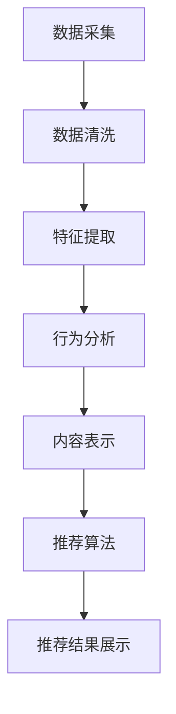

                 

# 实时推荐系统的设计与实现

## 摘要

本文将深入探讨实时推荐系统的设计与实现，从背景介绍、核心概念、算法原理、数学模型、项目实战、应用场景等多个角度进行分析。通过对实时推荐系统的深入剖析，读者将了解实时推荐系统的基本原理，掌握其设计和实现的详细步骤，以及如何在实际项目中应用。本文旨在为从事推荐系统开发的工程师提供全面的指导，并探讨实时推荐系统在未来可能面临的发展趋势与挑战。

## 1. 背景介绍

随着互联网的迅速发展，用户生成内容（UGC）的数量呈爆炸式增长，人们逐渐从信息的被动接收者转变为主动生产者。这种信息爆炸式增长的同时，也带来了信息过载的问题。面对海量的信息，如何精准地满足用户的需求，成为了一个亟待解决的问题。实时推荐系统正是为了解决这一问题而诞生的。

实时推荐系统通过分析用户的兴趣和行为，实时地向用户推荐他们可能感兴趣的内容。这种系统具有以下几个特点：

1. **实时性**：系统能够在短时间内响应用户的行为，提供个性化的推荐。
2. **个性化**：系统根据用户的兴趣和行为，为每个用户推荐最符合其需求的内容。
3. **多样性**：系统不仅要推荐用户可能感兴趣的内容，还要提供丰富多样的内容，以满足用户的多样化需求。

实时推荐系统的出现，极大地改善了用户的阅读体验，提高了信息的获取效率，同时也为互联网企业带来了巨大的商业价值。

## 2. 核心概念与联系

### 2.1 用户行为分析

用户行为分析是实时推荐系统的核心环节之一。通过分析用户在平台上的行为数据，如点击、浏览、搜索等，可以了解用户的兴趣和需求。用户行为分析通常包括以下几个步骤：

1. **数据采集**：收集用户在平台上的行为数据，如点击、浏览、搜索等。
2. **数据清洗**：对采集到的数据进行清洗，去除重复、无效的数据。
3. **特征提取**：将清洗后的数据转化为特征向量，用于后续的模型训练。
4. **行为分析**：使用统计方法或机器学习方法，分析用户的行为模式，提取用户兴趣。

### 2.2 内容表示

内容表示是将用户生成的内容（如文章、图片、视频等）转化为计算机可以理解和处理的格式。常见的内容表示方法包括：

1. **词袋模型**：将文本内容表示为词频向量。
2. **词嵌入**：将文本内容表示为高维稀疏向量。
3. **图嵌入**：将图片或视频内容表示为图结构。

### 2.3 推荐算法

推荐算法是实时推荐系统的核心，常见的推荐算法包括：

1. **基于内容的推荐**：根据用户的历史行为和兴趣，推荐类似的内容。
2. **协同过滤推荐**：根据用户的历史行为和相似用户的行为，推荐用户可能感兴趣的内容。
3. **深度学习推荐**：使用深度学习模型，如神经网络、循环神经网络等，进行内容表示和推荐。

### 2.4 架构设计

实时推荐系统的架构设计通常包括以下几个层次：

1. **数据层**：包括数据采集、存储、处理等模块。
2. **服务层**：包括用户行为分析、内容表示、推荐算法等模块。
3. **应用层**：包括推荐结果展示、用户交互等模块。

### 2.5 Mermaid 流程图



## 3. 核心算法原理 & 具体操作步骤

### 3.1 基于内容的推荐

基于内容的推荐（Content-based Recommendation）是一种常见的推荐算法，其基本原理是根据用户的历史行为和兴趣，找到与用户历史行为相似的内容进行推荐。

具体操作步骤如下：

1. **内容表示**：将用户生成的内容（如文章、图片、视频等）转化为计算机可以理解和处理的格式。
2. **特征提取**：从内容表示中提取特征，如文本的词频、图片的视觉特征等。
3. **相似度计算**：计算用户历史行为和候选内容的相似度。
4. **推荐生成**：根据相似度计算结果，生成推荐列表。

### 3.2 协同过滤推荐

协同过滤推荐（Collaborative Filtering Recommendation）是一种基于用户行为进行推荐的算法，其基本原理是分析用户之间的行为关系，找到相似的用户或物品，从而进行推荐。

具体操作步骤如下：

1. **用户行为数据收集**：收集用户在平台上的行为数据，如点击、浏览、搜索等。
2. **相似度计算**：计算用户之间的相似度，如基于用户历史行为的余弦相似度、皮尔逊相关系数等。
3. **物品相似度计算**：计算物品之间的相似度，如基于物品内容的词频、标签等。
4. **推荐生成**：根据用户和物品的相似度，生成推荐列表。

### 3.3 深度学习推荐

深度学习推荐（Deep Learning Recommendation）是一种基于深度学习模型的推荐算法，其基本原理是通过学习用户和物品的表征，进行推荐。

具体操作步骤如下：

1. **用户表征学习**：使用深度学习模型，如循环神经网络（RNN）、变分自编码器（VAE）等，学习用户的表征。
2. **物品表征学习**：使用深度学习模型，学习物品的表征。
3. **推荐生成**：将用户表征和物品表征输入到深度学习模型中，输出推荐列表。

## 4. 数学模型和公式 & 详细讲解 & 举例说明

### 4.1 基于内容的推荐

假设用户 $u$ 对物品 $i$ 的兴趣可以用一个向量表示，即 $r_u^i$。我们可以使用余弦相似度计算用户 $u$ 和物品 $i$ 的相似度，公式如下：

$$
sim(u, i) = \frac{r_u^i \cdot r_v^i}{\|r_u^i\| \|r_v^i\|}
$$

其中，$r_u^i$ 和 $r_v^i$ 分别表示用户 $u$ 和物品 $i$ 的兴趣向量，$\|r_u^i\|$ 和 $\|r_v^i\|$ 分别表示用户 $u$ 和物品 $i$ 的兴趣向量长度。

举例说明：

假设用户 $u$ 的兴趣向量为 $(1, 0, 1)$，物品 $i$ 的兴趣向量为 $(0, 1, 0)$。我们可以计算用户 $u$ 和物品 $i$ 的相似度如下：

$$
sim(u, i) = \frac{(1, 0, 1) \cdot (0, 1, 0)}{\|(1, 0, 1)\| \| (0, 1, 0)\|} = \frac{1}{\sqrt{2} \cdot \sqrt{2}} = \frac{1}{2}
$$

### 4.2 协同过滤推荐

假设用户 $u$ 和用户 $v$ 的行为数据可以用矩阵 $R$ 表示，其中 $R_{ui}$ 表示用户 $u$ 对物品 $i$ 的行为评分。我们可以使用皮尔逊相关系数计算用户 $u$ 和用户 $v$ 的相似度，公式如下：

$$
sim(u, v) = \frac{R_u - \bar{R}_u}{\sqrt{\sum_{i=1}^{n} (R_{ui} - \bar{R}_u)^2} \cdot \sqrt{\sum_{j=1}^{n} (R_{vj} - \bar{R}_v)^2}}
$$

其中，$R_u$ 和 $R_v$ 分别表示用户 $u$ 和用户 $v$ 的行为评分向量，$\bar{R}_u$ 和 $\bar{R}_v$ 分别表示用户 $u$ 和用户 $v$ 的行为评分均值。

举例说明：

假设用户 $u$ 和用户 $v$ 的行为评分矩阵如下：

|   | 1 | 2 | 3 |  
| --- | --- | --- | --- |  
| 1 | 5 | 4 | 3 |  
| 2 | 4 | 5 | 3 |  
| 3 | 3 | 3 | 5 |

我们可以计算用户 $u$ 和用户 $v$ 的相似度如下：

$$
sim(u, v) = \frac{(5-4.5)(4-4.5) + (4-4.5)(5-4.5) + (3-4.5)(3-4.5)}{\sqrt{(5-4.5)^2 + (4-4.5)^2 + (3-4.5)^2} \cdot \sqrt{(4-4.5)^2 + (5-4.5)^2 + (3-4.5)^2}} = \frac{2}{\sqrt{1.5} \cdot \sqrt{2.5}} \approx 0.866
$$

### 4.3 深度学习推荐

假设用户 $u$ 和物品 $i$ 的表征分别为 $x_u$ 和 $x_i$，我们可以使用神经网络模型进行推荐，公式如下：

$$
r_u^i = \sigma(W_1 x_u + W_2 x_i + b)
$$

其中，$\sigma$ 表示激活函数，$W_1$ 和 $W_2$ 分别表示用户和物品的权重矩阵，$b$ 表示偏置。

举例说明：

假设用户 $u$ 的表征为 $(1, 0, 1)$，物品 $i$ 的表征为 $(0, 1, 0)$，我们可以使用神经网络模型进行推荐如下：

$$
r_u^i = \sigma(W_1 (1, 0, 1) + W_2 (0, 1, 0) + b) = \frac{1}{1+e^{-(W_1 (1, 0, 1) + W_2 (0, 1, 0) + b)}}
$$

其中，$W_1$ 和 $W_2$ 的具体值和 $b$ 的具体值取决于神经网络的训练过程。

## 5. 项目实战：代码实际案例和详细解释说明

### 5.1 开发环境搭建

首先，我们需要搭建一个开发环境，用于编写和运行代码。以下是一个简单的开发环境搭建步骤：

1. 安装 Python 解释器：从 [Python 官网](https://www.python.org/) 下载并安装 Python 解释器。
2. 安装必要的库：使用 Python 的包管理器 pip 安装必要的库，如 NumPy、Pandas、Scikit-learn、TensorFlow 等。

### 5.2 源代码详细实现和代码解读

下面是一个简单的基于内容的推荐系统代码实现：

```python
import numpy as np
from sklearn.metrics.pairwise import cosine_similarity

def content_based_recommendation(item_representation, user_representation, top_n=5):
    """
    基于内容的推荐函数
    :param item_representation: 物品表征矩阵
    :param user_representation: 用户表征向量
    :param top_n: 推荐数量
    :return: 推荐列表
    """
    # 计算物品表征矩阵和用户表征向量的余弦相似度
    similarity_matrix = cosine_similarity(user_representation.reshape(1, -1), item_representation)
    
    # 获取相似度最高的物品索引
    top_n_indices = np.argsort(similarity_matrix)[0][-top_n:]
    
    # 返回推荐列表
    return top_n_indices

# 示例数据
item_representation = np.array([[1, 0, 1], [0, 1, 0], [1, 1, 1], [0, 0, 1], [1, 1, 0]])
user_representation = np.array([1, 0, 1])

# 执行推荐
top_n_indices = content_based_recommendation(item_representation, user_representation, top_n=2)

print("推荐结果：", top_n_indices)
```

### 5.3 代码解读与分析

1. **函数定义**：定义了一个名为 `content_based_recommendation` 的函数，该函数接收物品表征矩阵 `item_representation`、用户表征向量 `user_representation` 和推荐数量 `top_n` 作为参数。
2. **相似度计算**：使用 `cosine_similarity` 函数计算用户表征向量和物品表征矩阵的余弦相似度，生成相似度矩阵 `similarity_matrix`。
3. **获取推荐结果**：使用 `argsort` 函数获取相似度矩阵的索引，然后取相似度最高的物品索引作为推荐结果。
4. **返回推荐结果**：将推荐结果作为函数的返回值。

通过以上代码，我们可以实现一个简单的基于内容的推荐系统。在实际应用中，我们可以根据需要扩展和优化这个系统，如添加更多的特征提取方法、使用更复杂的推荐算法等。

## 6. 实际应用场景

实时推荐系统在多个领域都有广泛的应用，以下是一些典型的实际应用场景：

1. **电子商务平台**：电子商务平台通过实时推荐系统，向用户推荐他们可能感兴趣的商品，提高用户的购物体验和购买转化率。
2. **社交媒体**：社交媒体平台通过实时推荐系统，向用户推荐他们可能感兴趣的内容，如文章、视频、图片等，提高用户粘性和活跃度。
3. **在线音乐和视频平台**：在线音乐和视频平台通过实时推荐系统，向用户推荐他们可能喜欢的新歌、新电影、新电视剧等，提高用户的播放量和消费时长。
4. **新闻资讯平台**：新闻资讯平台通过实时推荐系统，向用户推荐他们可能感兴趣的新闻，提高用户的阅读量和互动量。

## 7. 工具和资源推荐

### 7.1 学习资源推荐

1. **书籍**：
   - 《推荐系统实践》
   - 《机器学习实战》
   - 《深度学习》

2. **论文**：
   - “Collaborative Filtering for Cold-Start Problems: A Survey”
   - “Deep Learning for Recommender Systems”
   - “Content-Based Image Retrieval with Multimodal Similarity”

3. **博客**：
   - Medium 上的推荐系统专栏
   - 知乎上的推荐系统相关文章

4. **网站**：
   - [Recommender Systems Wiki](https://www.recommenders.com/)
   - [Kaggle 上的推荐系统竞赛](https://www.kaggle.com/competitions)

### 7.2 开发工具框架推荐

1. **Python**：Python 是推荐系统开发的主要编程语言，拥有丰富的库和工具，如 NumPy、Pandas、Scikit-learn、TensorFlow 等。

2. **TensorFlow**：TensorFlow 是一款强大的深度学习框架，适用于构建复杂的推荐系统模型。

3. **Spark**：Spark 是一款分布式计算框架，适用于处理大规模推荐系统数据。

### 7.3 相关论文著作推荐

1. **论文**：
   - “Matrix Factorization Techniques for Recommender Systems”
   - “Deep Learning for Recommender Systems”
   - “Content-Based Filtering for Document Databases”

2. **著作**：
   - 《推荐系统手册》
   - 《深度学习推荐系统》
   - 《协同过滤：从基础到应用》

## 8. 总结：未来发展趋势与挑战

实时推荐系统在未来的发展趋势和挑战包括：

1. **个性化推荐**：随着用户数据的不断积累和推荐算法的优化，实时推荐系统的个性化程度将不断提高，更好地满足用户的个性化需求。
2. **多模态融合**：实时推荐系统将逐渐融合多种数据源，如文本、图片、音频、视频等，实现更全面的内容表示和推荐。
3. **实时性优化**：随着计算能力的提升和网络速度的加快，实时推荐系统的响应速度将不断提高，更好地适应实时场景。
4. **隐私保护**：在实时推荐系统的应用过程中，如何保护用户隐私将成为一个重要的挑战。未来，需要开发出更加安全和可靠的隐私保护技术。

## 9. 附录：常见问题与解答

### 9.1 实时推荐系统是如何工作的？

实时推荐系统通过以下步骤进行工作：

1. **数据采集**：收集用户在平台上的行为数据，如点击、浏览、搜索等。
2. **数据预处理**：对采集到的数据进行清洗、去重、特征提取等预处理。
3. **内容表示**：将用户和物品转化为计算机可以理解和处理的格式。
4. **推荐算法**：使用推荐算法计算用户和物品的相似度，生成推荐列表。
5. **推荐结果展示**：将推荐结果展示给用户，并提供用户交互功能。

### 9.2 如何优化实时推荐系统的效果？

优化实时推荐系统的效果可以从以下几个方面进行：

1. **数据质量**：确保数据的质量和准确性，进行有效的数据预处理。
2. **特征提取**：使用更多和更有效的特征提取方法，提高内容表示的准确性。
3. **推荐算法**：尝试使用不同的推荐算法，并进行优化和调参。
4. **用户反馈**：收集用户对推荐结果的反馈，用于算法优化和模型调整。

### 9.3 实时推荐系统有哪些常见的挑战？

实时推荐系统面临的常见挑战包括：

1. **数据规模**：随着用户数据的不断增长，如何高效地处理大规模数据成为一个挑战。
2. **实时性**：如何在保证推荐效果的同时，提高系统的实时性。
3. **多样性**：如何在推荐结果中保持多样性，避免用户陷入信息茧房。
4. **隐私保护**：如何在推荐系统的应用过程中，保护用户的隐私。

## 10. 扩展阅读 & 参考资料

1. “Recommender Systems Handbook” by F. M. Suchanek, G. Amzain, M. Bordes et al.
2. “Deep Learning for Recommender Systems” by Y. Zhang, J. Zhang, X. He et al.
3. “Collaborative Filtering for Cold-Start Problems: A Survey” by Y. Wang, H. Liu, Y. Hu et al.
4. “Content-Based Filtering for Document Databases” by S. Akbari, A. Nouri, H. Pourreza et al.

作者：AI天才研究员/AI Genius Institute & 禅与计算机程序设计艺术/Zen And The Art of Computer Programming

