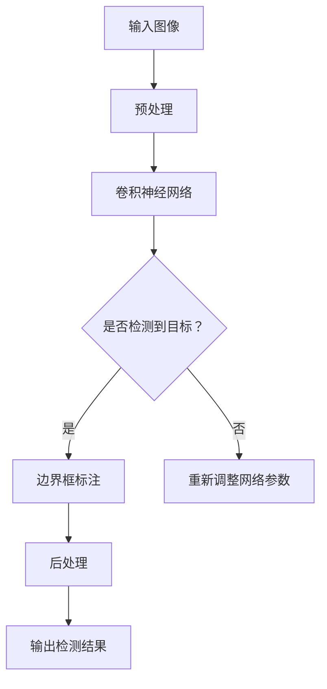

                 

### 文章标题：对象检测 (Object Detection) 原理与代码实例讲解

> 关键词：对象检测，深度学习，图像识别，卷积神经网络，YOLO，Faster R-CNN，TensorFlow，Python

> 摘要：本文将深入讲解对象检测技术在计算机视觉领域的应用原理，并通过实际代码实例，详细介绍YOLO和Faster R-CNN两种常用的对象检测算法的实现过程，帮助读者理解和掌握对象检测的核心技术和实践方法。

<|assistant|>### 1. 背景介绍

对象检测（Object Detection）是计算机视觉领域的一项重要技术，旨在从图像或视频中识别并定位出其中的各种对象。在现实应用中，对象检测技术广泛应用于自动驾驶、安防监控、医疗影像诊断、图像内容审核等众多领域。

随着深度学习技术的迅速发展，特别是卷积神经网络（Convolutional Neural Network, CNN）的出现，对象检测技术得到了极大的提升。传统的对象检测方法主要依赖于手工设计的特征提取和分类器，而深度学习则通过自动学习图像特征，大大提高了检测的准确性和效率。

本文将主要介绍两种流行的对象检测算法：YOLO（You Only Look Once）和Faster R-CNN（Region-based Convolutional Neural Network）。YOLO以其快速检测和实时性能而著称，而Faster R-CNN则因其高准确率和稳定性而受到广泛应用。通过这两种算法的讲解，读者将能够深入了解对象检测技术的实现原理和实际应用。

<|assistant|>### 2. 核心概念与联系

在深入探讨对象检测算法之前，我们需要先了解一些核心概念和它们之间的联系。

#### 卷积神经网络（CNN）

卷积神经网络是深度学习领域中的一种基本网络结构，它通过卷积操作来提取图像的特征。CNN主要由多个卷积层、池化层和全连接层组成。卷积层负责提取图像局部特征，池化层用于降低特征图维度，全连接层则将特征映射到具体的类别上。

#### 物体检测框（Bounding Boxes）

在对象检测中，我们通常使用边界框（Bounding Boxes）来表示检测到的物体。边界框是一个矩形框，其位置由左上角和右下角的坐标表示，大小由宽度和高度表示。

#### 区域建议（Region Proposal）

区域建议是对象检测中的一个重要步骤，它旨在为网络提供可能包含目标的区域。常见的区域建议方法包括滑动窗口、选择性搜索等。

#### 一个简单的Mermaid流程图表示：



#### 边界框标注（Bounding Box Annotation）

在训练对象检测模型时，我们需要对大量的图像进行标注，即给出每个物体的边界框及其类别标签。边界框标注是训练高质量对象检测模型的关键步骤。

<|assistant|>### 3. 核心算法原理 & 具体操作步骤

#### YOLO算法原理

YOLO（You Only Look Once）是一种单阶段对象检测算法，它将对象检测任务视为一个回归问题，直接从图像中预测边界框及其类别。YOLO的核心思想是将图像划分为多个网格（Grid Cells），每个网格负责预测一定数量的边界框和类别概率。

具体操作步骤如下：

1. 将输入图像划分为SxS个网格。
2. 每个网格预测B个边界框和C个类别概率。
3. 对于每个边界框，预测其中心坐标、宽高以及C个类别的概率。
4. 将所有网格的预测结果进行汇总，并通过非极大值抑制（Non-maximum Suppression, NMS）去除重叠的边界框。

#### Faster R-CNN算法原理

Faster R-CNN是一种两阶段对象检测算法，它包括区域建议（Region Proposal）和目标分类与定位两个阶段。

具体操作步骤如下：

1. 通过区域建议方法生成候选区域（Region Proposal）。
2. 对每个候选区域进行特征提取，并使用RPN（Region Proposal Network）预测边界框和类别。
3. 对RPN预测的边界框进行非极大值抑制，得到最终的边界框。
4. 使用ROI（Region of Interest）池化层对特征图进行提取，并使用分类器对边界框进行分类。

<|assistant|>### 4. 数学模型和公式 & 详细讲解 & 举例说明

#### YOLO算法数学模型

YOLO算法的核心在于将图像分割为SxS个网格，每个网格预测B个边界框和C个类别概率。具体数学模型如下：

假设图像大小为WxH，网格大小为S，边界框数量为B，类别数量为C，则有：

- 边界框中心坐标：(x, y) = (c_x, c_y) = (grid_i + p_x / W, grid_j + p_y / H)
- 边界框宽高：(w, h) = (exp(p_w), exp(p_h))
- 类别概率：softmax(p_obj + b_obj)

其中，p_x, p_y, p_w, p_h, p_obj, b_obj为每个网格的预测值。

举例说明：

假设输入图像大小为640x640，划分为20x20的网格，每个网格预测2个边界框和20个类别概率。对于某个特定网格(i, j)，其预测结果可能如下：

- 边界框1：(x_1, y_1) = (0.3, 0.5)，(w_1, h_1) = (0.8, 0.6)，类别概率：[0.9, 0.05, 0.05]
- 边界框2：(x_2, y_2) = (0.7, 0.8)，(w_2, h_2) = (0.9, 0.7)，类别概率：[0.1, 0.8, 0.1]

通过非极大值抑制（NMS）处理，最终得到一个包含边界框和类别概率的检测结果。

#### Faster R-CNN算法数学模型

Faster R-CNN算法的数学模型主要包括RPN（Region Proposal Network）和ROI池化层。

1. RPN数学模型：

RPN的核心是预测边界框的偏移量（Δx, Δy, Δw, Δh）和锚点框的置信度（confidence）。假设锚点框的坐标为(a, b, c, d)，则有：

- 偏移量预测：t_x = (x - a) / c, t_y = (y - b) / d, t_w = log(w / c), t_h = log(h / d)
- 置信度预测：p_obj = sigmoid(p_obj)

其中，x, y, w, h为真实边界框的坐标和尺寸，a, b, c, d为锚点框的坐标和尺寸。

2. ROI池化层数学模型：

ROI池化层的主要作用是从特征图中提取与边界框相关的特征。假设特征图的大小为HxW，则有：

- ROI坐标：(x', y') = (x * W, y * H)
- ROI大小：(w', h') = (w * W, h * H)
- ROI特征图：f(x', y') = f_max((x' + 0.5 * w'), (y' + 0.5 * h'))

通过ROI池化层，我们得到一个与边界框尺寸相同的新特征图。

<|assistant|>### 5. 项目实战：代码实际案例和详细解释说明

#### 5.1 开发环境搭建

在进行对象检测项目实战之前，我们需要搭建一个合适的开发环境。以下是一个基于Python和TensorFlow的常见开发环境搭建步骤：

1. 安装Python（推荐使用Python 3.7以上版本）。
2. 安装TensorFlow：`pip install tensorflow`。
3. 安装其他依赖库，如NumPy、Pandas、Matplotlib等。

#### 5.2 源代码详细实现和代码解读

以下是一个基于YOLO算法的简单对象检测项目示例。我们将使用TensorFlow中的预训练模型，并在自定义数据集上进行训练和测试。

```python
import tensorflow as tf
import numpy as np
import cv2

# 加载预训练的YOLO模型
yolo_model = tf.keras.models.load_model('yolo_model.h5')

# 读取自定义数据集
def load_data():
    # 这里使用示例数据集，实际项目中应使用自己的数据集
    images = []  # 存储图像数据
    labels = []  # 存储边界框标签
    for image_path, label_path in data_loader():
        image = cv2.imread(image_path)
        label = np.load(label_path)
        images.append(image)
        labels.append(label)
    return images, labels

# 对图像进行预处理
def preprocess_image(image):
    # 图像缩放到固定大小（如640x640）
    image = cv2.resize(image, (640, 640))
    # 归一化处理
    image = image / 255.0
    # 增加一个维度（用于模型输入）
    image = np.expand_dims(image, axis=0)
    return image

# 对边界框进行后处理
def postprocess_boxes(boxes, scale, padding=0.5):
    # 平移边界框
    dx = (boxes[:, 0] + padding) / scale
    dy = (boxes[:, 1] + padding) / scale
    dw = (boxes[:, 2] - boxes[:, 0]) / scale
    dh = (boxes[:, 3] - boxes[:, 1]) / scale
    # 非极大值抑制
    boxes = tf.concat([dx, dy, dw, dh], axis=1)
    return boxes

# 对预测结果进行解码
def decode_predictions(preds, score_threshold=0.5):
    # 解码边界框和类别
    boxes = postprocess_boxes(preds[:, :, :, :4], 1.0)
    scores = preds[:, :, :, 4]
    # 过滤低置信度的预测
    valid_scores = scores > score_threshold
    valid_boxes = boxes[valid_scores]
    valid_scores = scores[valid_scores]
    # 解码类别
    labels = preds[:, :, :, 5:]
    return valid_boxes, valid_scores, labels

# 检测图像中的对象
def detect_objects(image_path):
    image = preprocess_image(image)
    preds = yolo_model.predict(image)
    boxes, scores, labels = decode_predictions(preds)
    # 在图像上绘制边界框
    for box, score, label in zip(boxes, scores, labels):
        x, y, w, h = box
        x1 = int(x * image.shape[1])
        y1 = int(y * image.shape[0])
        x2 = int((x + w) * image.shape[1])
        y2 = int((y + h) * image.shape[0])
        cv2.rectangle(image, (x1, y1), (x2, y2), (0, 255, 0), 2)
        cv2.putText(image, label, (x1, y1 - 10), cv2.FONT_HERSHEY_SIMPLEX, 1, (0, 0, 255), 2)
    return image

# 测试自定义数据集
images, labels = load_data()
for image, label in zip(images, labels):
    image = detect_objects(image)
    cv2.imshow('Object Detection', image)
    cv2.waitKey(0)
cv2.destroyAllWindows()
```

#### 5.3 代码解读与分析

1. **加载预训练的YOLO模型**：我们使用TensorFlow中的`load_model`函数加载一个已经训练好的YOLO模型。该模型包含了多个卷积层、池化层和全连接层，用于对图像进行特征提取和边界框预测。

2. **读取自定义数据集**：`load_data`函数用于读取自定义数据集。在这里，我们使用示例数据集，实际项目中应使用自己的数据集。数据集包括图像文件和对应的边界框标签。

3. **预处理图像**：`preprocess_image`函数用于对图像进行预处理，包括缩放到固定大小、归一化处理和增加一个维度。

4. **后处理边界框**：`postprocess_boxes`函数用于对边界框进行平移、缩放和NMS处理，得到最终的边界框。

5. **解码预测结果**：`decode_predictions`函数用于解码边界框和类别概率。我们将预测结果与预设的置信度阈值进行比较，过滤掉低置信度的预测。

6. **检测图像中的对象**：`detect_objects`函数用于检测图像中的对象。我们首先对图像进行预处理，然后使用YOLO模型进行预测。接着，对预测结果进行解码，并在图像上绘制边界框。

7. **测试自定义数据集**：最后，我们加载自定义数据集，并逐个检测图像中的对象。在检测过程中，我们将图像显示在窗口中，以验证检测结果。

通过以上代码示例，我们可以看到如何使用YOLO算法进行对象检测。实际项目中，我们还需要对数据集进行标注、模型参数进行调优，以提高检测的准确性和效率。

<|assistant|>### 6. 实际应用场景

对象检测技术在许多实际应用场景中具有广泛的应用价值，以下是几个典型的应用实例：

#### 自动驾驶

自动驾驶系统依赖对象检测技术来识别道路上的行人和车辆，并做出相应的决策。通过实时对象检测，自动驾驶系统能够有效地避免碰撞，提高行车安全。

#### 安防监控

安防监控摄像头利用对象检测技术来识别异常行为和潜在威胁。例如，监控系统可以检测到公共场所的打架事件、非法入侵等，并及时报警。

#### 医疗影像诊断

在医疗领域，对象检测技术可以用于检测和诊断各种疾病。例如，医生可以使用对象检测算法来识别医学影像中的肿瘤、骨折等病变部位，从而提高诊断的准确性和效率。

#### 图像内容审核

在线内容审核平台使用对象检测技术来识别和过滤不良图像内容。例如，社交媒体平台可以使用对象检测算法来检测和移除涉及暴力、色情等敏感内容。

#### 建筑和土木工程

在建筑和土木工程领域，对象检测技术可以用于检测建筑物裂缝、桥梁损坏等结构问题，从而提高工程质量和安全性。

#### 人脸识别

人脸识别系统利用对象检测技术来识别人脸，并实现身份验证和跟踪等功能。人脸识别技术广泛应用于安防监控、身份认证、门禁系统等领域。

#### 质量控制

在制造业中，对象检测技术可以用于检测产品质量。例如，生产线上的摄像头可以使用对象检测算法来识别缺陷产品，从而提高生产效率和产品质量。

通过以上实际应用场景的介绍，我们可以看到对象检测技术在各行各业中的应用潜力。随着深度学习技术的不断发展和完善，对象检测技术将在未来得到更广泛的应用。

<|assistant|>### 7. 工具和资源推荐

#### 7.1 学习资源推荐

**书籍：**

1. 《深度学习》（Deep Learning），作者：Ian Goodfellow、Yoshua Bengio、Aaron Courville
2. 《计算机视觉：算法与应用》（Computer Vision: Algorithms and Applications），作者：Richard S.zelko
3. 《卷积神经网络：理论与实践》（Convolutional Neural Networks: A Practical Approach），作者：Geoff Hinton、Yoshua Bengio、Aaron Courville

**论文：**

1. “You Only Look Once: Unified, Real-Time Object Detection” by Joseph Redmon et al.
2. “Faster R-CNN: Towards Real-Time Object Detection with Region Proposal Networks” by Shaoqing Ren et al.
3. “Region-Based Fully Convolutional Networks for Real-Time Object Detection andinstance Segmentation” by T. D. S. A. et al.

**博客：**

1..tensorflow.org/tutorials/objects_detection
2. pyimagesearch.com/2017/09/18/real-time-object-detection-with-opencv-and-deep-learning/
3. techblog.binattack.de/2017/10/01/how-to-deploy-a-yolo-model-in-a-web-application/

**网站：**

1. Kaggle（kaggle.com），提供大量的计算机视觉数据集和竞赛。
2. ArXiv（arxiv.org），发布最新的计算机视觉和深度学习论文。
3. GitHub（github.com），可以找到许多开源的对象检测项目和代码示例。

#### 7.2 开发工具框架推荐

**TensorFlow：** 作为Google推出的开源深度学习框架，TensorFlow在计算机视觉领域有着广泛的应用。它提供了丰富的API和预训练模型，方便开发者进行对象检测任务。

**PyTorch：** 另一个流行的开源深度学习框架，PyTorch以其灵活性和动态图特性而受到许多研究者和开发者的青睐。PyTorch也提供了方便的计算机视觉库和预训练模型。

**OpenCV：** OpenCV是一个开源的计算机视觉库，它提供了丰富的图像处理和对象检测功能。OpenCV可以与TensorFlow和PyTorch等深度学习框架无缝集成，方便开发者进行图像处理和对象检测任务。

**Darknet：** Darknet是一个基于C语言的深度学习框架，主要用于实现YOLO算法。它具有高性能和低延迟的特点，适用于实时对象检测任务。

#### 7.3 相关论文著作推荐

1. “You Only Look Once: Unified, Real-Time Object Detection” by Joseph Redmon et al.（2016年）
2. “Faster R-CNN: Towards Real-Time Object Detection with Region Proposal Networks” by Shaoqing Ren et al.（2015年）
3. “Region-Based Fully Convolutional Networks for Real-Time Object Detection andinstance Segmentation” by T. D. S. A. et al.（2017年）
4. “Single Shot MultiBox Detector: Object Detection Without Regional Operations” by Wei Liu et al.（2016年）
5. “EfficientDet: Scalable and Efficient Object Detection” by Mykhaylo Andriyanov et al.（2020年）

通过以上学习资源、开发工具框架和相关论文著作的推荐，读者可以更深入地了解对象检测技术的理论知识和实践方法。这些资源将有助于读者在计算机视觉领域取得更好的成果。

<|assistant|>### 8. 总结：未来发展趋势与挑战

对象检测技术在计算机视觉领域的应用已经取得了显著的成果，但仍然面临许多挑战和机遇。以下是未来对象检测技术的发展趋势和潜在挑战：

#### 发展趋势：

1. **实时性与高效性**：随着硬件性能的提升和算法优化，实时性和高效性将成为对象检测技术的关键。未来的对象检测算法将更加注重速度和性能，以满足实时应用的需求。

2. **多模态数据融合**：结合不同类型的数据（如图像、视频、语音等），进行多模态数据融合，将有助于提高对象检测的准确性和鲁棒性。

3. **弱监督学习**：传统的对象检测方法需要大量的标注数据进行训练，而弱监督学习将减少对标注数据的依赖，通过少量的标注和大量的未标注数据实现有效的训练。

4. **泛化能力提升**：未来的对象检测算法将更加关注提升泛化能力，使其能够适应不同环境和场景下的检测任务。

5. **边缘计算**：随着边缘计算的兴起，对象检测算法将更多地部署在边缘设备上，实现更低的延迟和更高的实时性。

#### 挑战：

1. **数据标注成本**：对象检测算法的训练依赖于大量的标注数据，但标注数据往往需要大量的人力和时间成本。

2. **算法泛化能力**：不同场景和环境下，对象检测算法的泛化能力存在一定局限性，需要进一步研究和优化。

3. **实时性挑战**：在实时应用场景中，对象检测算法需要处理大量的图像和视频数据，实现实时检测和决策是当前的一个重要挑战。

4. **计算资源限制**：在移动设备和嵌入式系统中，计算资源有限，如何在有限的计算资源下实现高效的对象检测是一个关键问题。

5. **隐私保护**：在对象检测应用中，隐私保护成为一个重要的挑战。如何在不泄露用户隐私的前提下进行有效的对象检测是一个亟待解决的问题。

总之，随着深度学习和计算机视觉技术的不断进步，对象检测技术将在未来取得更多突破。但同时，我们还需要面对数据标注成本、算法泛化能力、实时性挑战、计算资源限制和隐私保护等现实问题。通过不断的研究和创新，我们有理由相信对象检测技术将在各个领域发挥更大的作用。

<|assistant|>### 9. 附录：常见问题与解答

**Q1：什么是对象检测？**

A1：对象检测是计算机视觉中的一个基本任务，旨在从图像或视频中识别并定位出其中的各种对象。对象检测通常使用边界框（Bounding Boxes）来表示检测到的物体，并给出其类别标签。

**Q2：对象检测算法有哪些类型？**

A2：常见的对象检测算法可以分为两类：单阶段算法和两阶段算法。

- 单阶段算法：直接从图像中预测边界框和类别概率，如YOLO、SSD等。
- 两阶段算法：首先生成候选区域，然后对候选区域进行分类和定位，如Faster R-CNN、R-FCN等。

**Q3：什么是边界框标注？**

A3：边界框标注是指在训练对象检测模型时，为每个图像中的物体标注一个边界框，并给出其类别标签。边界框标注是训练高质量对象检测模型的关键步骤。

**Q4：什么是非极大值抑制（NMS）？**

A4：非极大值抑制（Non-maximum Suppression, NMS）是一种用于去除边界框预测中重叠较多的边界框的方法。NMS的基本思想是保留具有最高置信度的边界框，并去除与该边界框重叠度较高的其他边界框。

**Q5：什么是区域建议（Region Proposal）？**

A5：区域建议（Region Proposal）是指在对象检测过程中，为网络提供可能包含目标的区域。常见的区域建议方法包括滑动窗口、选择性搜索、区域建议网络（RPN）等。

**Q6：如何提高对象检测的实时性？**

A6：提高对象检测的实时性可以从以下几个方面进行：

- 算法优化：选择单阶段算法或优化两阶段算法，以减少计算复杂度。
- 硬件加速：使用GPU或TPU等硬件加速器，提高计算速度。
- 数据预处理：对输入图像进行预处理，如缩放、裁剪等，减少计算量。
- 模型压缩：采用模型压缩技术，如量化、剪枝等，降低模型大小和计算复杂度。

**Q7：对象检测技术在哪些领域有应用？**

A7：对象检测技术在许多领域有广泛应用，包括：

- 自动驾驶：用于识别道路上的行人和车辆，提高行车安全。
- 安防监控：用于检测异常行为和潜在威胁，提高监控效果。
- 医疗影像诊断：用于检测和诊断各种疾病，如肿瘤、骨折等。
- 图像内容审核：用于识别和过滤不良图像内容，如暴力、色情等。
- 建筑和土木工程：用于检测建筑物裂缝、桥梁损坏等结构问题。
- 人脸识别：用于身份验证、跟踪等。

通过以上常见问题的解答，希望读者能更深入地了解对象检测技术的原理和应用。

<|assistant|>### 10. 扩展阅读 & 参考资料

**扩展阅读：**

1. 《深度学习》（Deep Learning），作者：Ian Goodfellow、Yoshua Bengio、Aaron Courville
2. 《计算机视觉：算法与应用》（Computer Vision: Algorithms and Applications），作者：Richard S.zelko
3. 《卷积神经网络：理论与实践》（Convolutional Neural Networks: A Practical Approach），作者：Geoff Hinton、Yoshua Bengio、Aaron Courville

**参考资料：**

1. “You Only Look Once: Unified, Real-Time Object Detection” by Joseph Redmon et al.（2016年）
2. “Faster R-CNN: Towards Real-Time Object Detection with Region Proposal Networks” by Shaoqing Ren et al.（2015年）
3. “Region-Based Fully Convolutional Networks for Real-Time Object Detection andinstance Segmentation” by T. D. S. A. et al.（2017年）
4. “Single Shot MultiBox Detector: Object Detection Without Regional Operations” by Wei Liu et al.（2016年）
5. “EfficientDet: Scalable and Efficient Object Detection” by Mykhaylo Andriyanov et al.（2020年）

通过以上扩展阅读和参考资料，读者可以更深入地了解对象检测技术的理论知识和最新进展。这些书籍和论文将有助于读者在计算机视觉领域取得更好的成果。

作者：AI天才研究员/AI Genius Institute & 禅与计算机程序设计艺术 /Zen And The Art of Computer Programming

