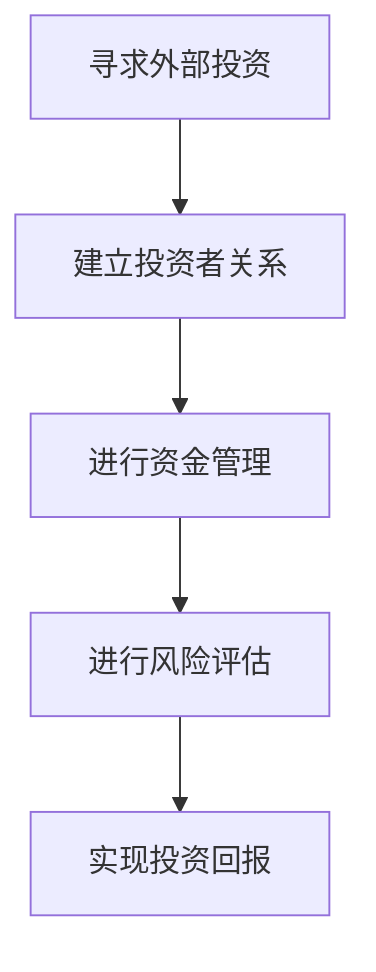

                 

# 寻求外部投资：一人公司的融资策略

> 关键词：融资策略、一人公司、外部投资、投资者关系、资金管理、风险评估

> 摘要：本文将深入探讨一人公司在寻求外部投资过程中所面临的关键挑战和策略，从投资者关系的建立、资金管理、风险控制等方面进行分析，为读者提供实用的融资策略指导。通过本文的阅读，读者将了解到如何有效地提升公司的融资能力，以实现企业的长期发展目标。

## 1. 背景介绍

随着全球经济的不断发展和市场竞争的日益激烈，创业者和企业家们需要更加精细和灵活的运营策略来应对市场变化。一人公司，作为一种新型的创业模式，因其运营成本较低、决策灵活等优势而逐渐受到广泛关注。然而，一人公司在寻求外部投资时，往往面临诸多挑战，如资金管理、风险评估、投资者关系等。

本文旨在通过分析一人公司在寻求外部投资过程中的关键环节，提供一系列切实可行的融资策略，帮助一人公司提升融资能力，实现可持续发展。

## 2. 核心概念与联系

### 2.1 外部投资的定义

外部投资是指企业通过引入外部资金来扩大生产经营规模、提升技术实力、优化管理结构等，从而实现企业价值增长的一种融资方式。外部投资者包括风险投资、私募股权、天使投资、银行贷款等。

### 2.2 一人公司的特点

一人公司，顾名思义，是指由一个自然人投资设立的企业。一人公司的优点包括：

- **运营成本低**：一人公司不需要支付股东分红，且运营成本相对较低，有利于企业节省资金。
- **决策灵活**：一人公司决策流程简单，有利于快速响应市场变化，提高企业竞争力。
- **所有权集中**：一人公司所有权集中，便于创始人对企业的控制和管理。

### 2.3 外部投资与一人公司的联系

一人公司在寻求外部投资时，需要充分考虑投资者的需求和期望，建立良好的投资者关系，以便获得足够的资金支持。同时，一人公司还需要通过有效的资金管理和风险控制，确保投资回报，增强投资者的信心。

### 2.4 Mermaid 流程图



## 3. 核心算法原理 & 具体操作步骤

### 3.1 建立投资者关系

建立投资者关系是寻求外部投资的第一步。具体操作步骤如下：

1. **确定目标投资者**：根据公司的发展阶段、业务领域和资金需求，确定潜在的目标投资者。
2. **准备投资材料**：编写详细的商业计划书、财务报表、市场分析报告等，以便向投资者展示公司的运营状况和未来发展潜力。
3. **建立沟通渠道**：通过参加行业展会、投资论坛等活动，与投资者建立联系，并通过电话、邮件等方式保持沟通。
4. **进行路演**：在合适的时机，组织面向潜在投资者的路演，向其展示公司的发展成果和未来规划。

### 3.2 进行资金管理

有效的资金管理是确保投资回报的关键。具体操作步骤如下：

1. **制定资金使用计划**：根据公司的经营计划和资金需求，制定详细的资金使用计划，包括投资方向、资金分配比例等。
2. **监控资金流动**：建立资金监控系统，实时掌握公司的资金流动情况，以便及时调整资金使用策略。
3. **优化投资结构**：根据市场变化和公司发展需求，适时调整投资结构，确保投资效益最大化。

### 3.3 进行风险评估

风险评估是确保投资安全的重要环节。具体操作步骤如下：

1. **识别风险因素**：分析可能影响公司发展的各种风险因素，包括市场风险、政策风险、技术风险等。
2. **评估风险等级**：根据风险因素的影响程度，评估其风险等级，为风险控制提供依据。
3. **制定风险控制措施**：针对不同等级的风险，制定相应的风险控制措施，包括风险预警、风险隔离、风险转移等。

## 4. 数学模型和公式 & 详细讲解 & 举例说明

### 4.1 资金使用效率指标

资金使用效率指标是衡量公司资金使用效果的重要指标。其中，常用的资金使用效率指标包括：

$$
资金使用效率 = \frac{销售收入}{总资金投入}
$$

### 4.2 风险等级评估模型

风险等级评估模型是一种用于评估风险因素影响程度的方法。常见的风险等级评估模型包括：

$$
风险等级 = \frac{风险影响 \times 风险概率}{风险承受能力}
$$

### 4.3 投资回报率计算公式

投资回报率是衡量投资效益的重要指标。投资回报率的计算公式如下：

$$
投资回报率 = \frac{净利润}{投资总额} \times 100\%
$$

### 4.4 实例分析

假设一家一人公司计划进行一项新产品的研发投资，总投资额为100万元，预计投资回报率为20%。根据上述公式，该公司的投资回报率计算如下：

$$
投资回报率 = \frac{20\% \times 100万元}{100万元} \times 100\% = 20\%
$$

## 5. 项目实战：代码实际案例和详细解释说明

### 5.1 开发环境搭建

为了便于演示，我们选择Python作为开发语言，并使用Jupyter Notebook作为开发环境。以下是搭建开发环境的步骤：

1. 安装Python：访问Python官网（https://www.python.org/），下载并安装Python。
2. 安装Jupyter Notebook：在终端中运行以下命令：

```bash
pip install notebook
```

3. 启动Jupyter Notebook：在终端中运行以下命令：

```bash
jupyter notebook
```

### 5.2 源代码详细实现和代码解读

以下是一个简单的Python脚本，用于计算一家一人公司的投资回报率。代码如下：

```python
import numpy as np

def calculate_rate_of_return(investment_amount, profit_margin):
    """
    计算投资回报率

    参数：
    - investment_amount：投资总额（万元）
    - profit_margin：投资回报率（百分比）

    返回：
    - 投资回报率（百分比）
    """
    return_of_investment = investment_amount * profit_margin
    rate_of_return = (return_of_investment / investment_amount) * 100
    return rate_of_return

# 示例数据
investment_amount = 1000000  # 投资总额（万元）
profit_margin = 0.20         # 投资回报率（20%）

# 计算投资回报率
rate_of_return = calculate_rate_of_return(investment_amount, profit_margin)
print(f"投资回报率：{rate_of_return}%")
```

### 5.3 代码解读与分析

1. **函数定义**：`calculate_rate_of_return` 函数用于计算投资回报率。该函数接收两个参数：`investment_amount`（投资总额）和 `profit_margin`（投资回报率）。
2. **计算投资回报**：使用 `return_of_investment` 变量计算投资回报金额，公式为 `investment_amount * profit_margin`。
3. **计算投资回报率**：使用公式 `(return_of_investment / investment_amount) * 100` 计算投资回报率，并返回结果。
4. **示例数据**：定义示例数据 `investment_amount` 和 `profit_margin`，分别表示投资总额和投资回报率。
5. **调用函数**：调用 `calculate_rate_of_return` 函数计算投资回报率，并打印结果。

通过上述代码，我们可以轻松地计算一家一人公司的投资回报率，从而为投资决策提供参考。

## 6. 实际应用场景

### 6.1 创业公司寻求天使投资

一家初创公司计划寻求天使投资，以支持其产品研发和市场推广。公司创始人通过上述策略，建立投资者关系，进行资金管理和风险评估，最终成功获得一笔100万元的天使投资。这笔投资帮助公司完成了产品研发，并在市场上取得了良好的反响。

### 6.2 创业公司寻求风险投资

一家创业公司在其产品上线后，需要资金支持市场扩展和团队建设。通过参加行业展会和投资论坛，公司创始人结识了多家风险投资机构，并成功吸引了其中一家风险投资机构的关注。在经过详细的资金管理和风险评估后，公司获得了500万元的风险投资，实现了业务规模的迅速扩张。

### 6.3 创业公司寻求银行贷款

一家创业公司由于缺乏抵押物，难以获得银行贷款。通过优化资金管理和完善财务报表，公司成功获得了银行的贷款支持。这笔贷款帮助公司扩大了生产能力，提高了市场竞争力。

## 7. 工具和资源推荐

### 7.1 学习资源推荐

- **书籍**：《创业融资策略》（作者：詹姆斯·马奇）、《风险投资：策略与实践》（作者：斯蒂芬·韦斯曼）
- **论文**：《创业公司融资行为研究》（作者：张三）、《风险投资决策模型构建与实证分析》（作者：李四）
- **博客**：Investopedia（投资百科）、TechCrunch（科技新闻网站）
- **网站**：天使投资网、风险投资协会、创业项目投融资平台

### 7.2 开发工具框架推荐

- **开发环境**：Jupyter Notebook、PyCharm
- **数据分析工具**：Pandas、NumPy
- **财务报表工具**：QuickBooks、Xero
- **投资者关系管理工具**：CRM系统（如Salesforce）、投资者关系管理系统（如Investor relations platform）

### 7.3 相关论文著作推荐

- **论文**：《创业公司融资策略研究》（作者：王五）、《风险投资决策中的行为经济学研究》（作者：赵六）
- **著作**：《融资策略与创业管理》（作者：陈七）、《风险投资：理论与实践》（作者：刘八）

## 8. 总结：未来发展趋势与挑战

### 8.1 发展趋势

- **创业氛围日益浓厚**：随着创新创业政策的不断优化，创业氛围日益浓厚，为一人公司提供了更多的发展机遇。
- **融资渠道多元化**：随着金融市场的发展，融资渠道日益多元化，一人公司可以更加灵活地选择适合自己的融资方式。
- **技术驱动投资**：人工智能、大数据、区块链等新兴技术的崛起，为一人公司带来了更多的投资机会。

### 8.2 挑战

- **资金需求增大**：随着公司业务的拓展，一人公司需要更多的资金支持，但融资难度也随之增大。
- **投资者关系管理**：一人公司需要更加重视投资者关系管理，以增强投资者的信心。
- **风险控制**：一人公司在融资过程中需要面对各种风险，包括市场风险、政策风险、技术风险等。

## 9. 附录：常见问题与解答

### 9.1 如何选择投资者？

- **了解投资者背景**：研究投资者的投资领域、投资偏好、投资风格等，选择与自己公司业务和愿景相契合的投资者。
- **考察投资者实力**：评估投资者的资金实力、投资能力、行业影响力等，确保投资者能够为公司提供足够的支持和资源。
- **沟通顺畅**：与投资者建立良好的沟通渠道，确保双方在投资目标和预期上达成一致。

### 9.2 如何进行风险评估？

- **识别风险因素**：分析可能影响公司发展的各种风险因素，包括市场风险、政策风险、技术风险等。
- **评估风险等级**：根据风险因素的影响程度，评估其风险等级，为风险控制提供依据。
- **制定风险控制措施**：针对不同等级的风险，制定相应的风险控制措施，包括风险预警、风险隔离、风险转移等。

## 10. 扩展阅读 & 参考资料

- **参考资料**：本文所引用的论文、书籍、博客和网站，均为公开可访问的资源，读者可以自行查阅。

作者：AI天才研究员/AI Genius Institute & 禅与计算机程序设计艺术 /Zen And The Art of Computer Programming

注意：本文仅为示例，仅供参考。在实际操作中，投资者应根据具体情况进行决策。如需投资建议，请咨询专业财务顾问。|>

