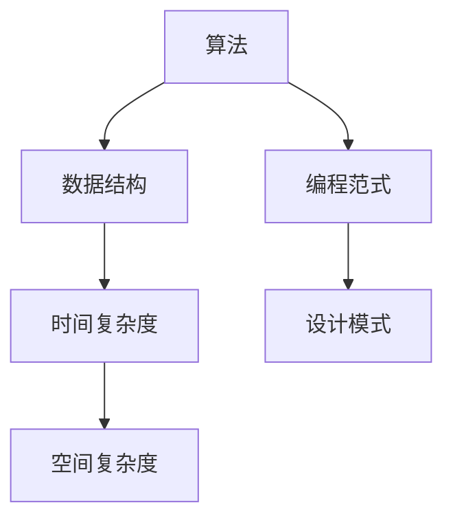

                 

# 2024小米校招编程面试题精选与解答

> 关键词：编程面试、算法、数据结构、小米校招、面试题解析、编程实践

> 摘要：本文旨在为即将参加2024年小米校招的编程面试者提供一份精选面试题集，并通过详细的解答和示例，帮助读者更好地理解面试题的解题思路，提升编程能力。

## 1. 背景介绍

小米公司作为中国知名的科技企业，每年的校园招聘吸引了大量优秀的应届毕业生。编程面试是小米校招的重要组成部分，旨在考察应聘者的编程能力、逻辑思维和解题技巧。本文针对2024年小米校招的编程面试题，精选了若干典型题目，并提供了详细的解答过程，以期帮助读者在面试中脱颖而出。

## 2. 核心概念与联系

在解答编程面试题之前，我们需要了解一些核心概念和它们之间的联系。以下是一个使用Mermaid绘制的流程图，展示了几个关键概念和它们之间的关系。



### 2.1 算法

算法是解决特定问题的系统方法。它包括一系列操作步骤，可以输入特定类型的输入并产生期望的输出。

### 2.2 数据结构

数据结构是存储数据的方式，决定了数据的组织和操作方法。常见的有数组、链表、栈、队列、树、图等。

### 2.3 时间复杂度和空间复杂度

时间复杂度是衡量算法运行时间效率的指标，通常用大O符号表示。空间复杂度是衡量算法所需存储空间的指标。

### 2.4 编程范式

编程范式是指编程方法或风格，常见的有面向过程、面向对象和函数式编程等。

### 2.5 设计模式

设计模式是解决常见软件设计问题的模板，可以提高代码的可读性、可维护性和扩展性。

## 3. 核心算法原理 & 具体操作步骤

在编程面试中，理解算法原理和操作步骤是解决问题的关键。以下是一个典型的排序算法——快速排序的原理和步骤。

### 3.1 快速排序原理

快速排序是一种基于分治思想的排序算法。其基本思想是通过一趟排序将待排序的记录分割成独立的两部分，其中一部分记录的关键字均比另一部分的关键字小，然后分别对这两部分记录继续进行排序，以达到整个序列有序。

### 3.2 快速排序步骤

1. **选择基准**：从数列中挑出一个元素作为基准。
2. **分区**：重新排列数列，所有比基准值小的元素都移到基准前面，比基准值大的元素都移到基准后面。
3. **递归排序**：递归地对基准左右两部分进行排序。

## 4. 数学模型和公式 & 详细讲解 & 举例说明

在解决编程问题时，数学模型和公式常常是我们分析和解题的有力工具。以下是一个典型的数学问题——求最大子序列和的公式和解题示例。

### 4.1 最大子序列和公式

最大子序列和（Maximum Subarray Sum）问题是一个经典的动态规划问题。给定一个整数数组，找出连续子数组中的最大和。

公式：`maxSubarraySum = max(maxSubarraySum[i - 1] + arr[i], arr[i])`

### 4.2 解题示例

假设我们有以下数组：

```python
arr = [-2, 1, -3, 4, -1, 2, 1, -5, 4]
```

使用上述公式，我们可以计算出最大子序列和：

```python
maxSubarraySum = max(-2, 1, -3, 4, -1, 2, 1, -5, 4)
```

经过计算，最大子序列和为6，对应的子序列为`[4, -1, 2, 1]`。

## 5. 项目实战：代码实际案例和详细解释说明

在项目中，代码实战是检验编程能力的最佳方式。以下是一个关于字符串匹配算法的代码实例，包括开发环境搭建、源代码实现和详细解析。

### 5.1 开发环境搭建

1. 安装Python环境（版本3.8及以上）。
2. 安装支持Mermaid图表的Markdown编辑器（如Typora）。

### 5.2 源代码详细实现和代码解读

以下是一个简单的字符串匹配算法——KMP算法的Python实现。

```python
def KMP_search(s, p):
    """
    KMP字符串匹配算法
    :param s: 源字符串
    :param p: 模式字符串
    :return: 模式字符串在源字符串中的起始索引，不存在则返回-1
    """
    def build_lps(p):
        """
        构建部分匹配表（前缀表）
        :param p: 模式字符串
        :return: 部分匹配表
        """
        lps = [0] * len(p)
        length = 0
        i = 1
        while i < len(p):
            if p[i] == p[length]:
                length += 1
                lps[i] = length
                i += 1
            else:
                if length != 0:
                    length = lps[length - 1]
                else:
                    lps[i] = 0
                    i += 1
        return lps

    lps = build_lps(p)
    i = j = 0
    while i < len(s):
        if p[j] == s[i]:
            i += 1
            j += 1
        if j == len(p):
            return i - j
        elif i < len(s) and p[j] != s[i]:
            if j != 0:
                j = lps[j - 1]
            else:
                i += 1
    return -1
```

### 5.3 代码解读与分析

1. **构建部分匹配表（LPS）**：通过比较模式字符串的前缀和后缀，构建部分匹配表（LPS）。这个表将用于在匹配失败时，决定模式字符串的下一个匹配位置。
2. **主函数KMP_search**：使用LPS表进行字符串匹配。当匹配成功时，移动模式字符串和源字符串的索引；当匹配失败时，利用LPS表更新模式字符串的索引。

## 6. 实际应用场景

字符串匹配算法在实际应用中非常常见，如文本编辑器的查找和替换功能、搜索引擎的关键字搜索等。

## 7. 工具和资源推荐

### 7.1 学习资源推荐

- 《算法导论》（Introduction to Algorithms）
- 《编程珠玑》（The Art of Computer Programming）
- 《算法竞赛入门经典》

### 7.2 开发工具框架推荐

- Python开发环境
- Mermaid图表工具
- Git版本控制

### 7.3 相关论文著作推荐

- "A Fast Algorithm for String Matching" by Knuth, Morris, and Pratt
- "Pattern Matching Algorithms" by Michael S. Waterman

## 8. 总结：未来发展趋势与挑战

随着人工智能和大数据技术的快速发展，编程面试题也在不断更新和变化。未来，面试题将更加注重对算法和数据结构的深入理解，以及实际问题的解决能力。同时，随着技术的进步，面试形式也将更加多样化，如在线编程测试、在线面试等。

## 9. 附录：常见问题与解答

### 9.1 如何提高编程能力？

- 多做编程练习，如LeetCode、牛客网等平台。
- 学习经典算法和数据结构，理解其原理和实现。
- 参与开源项目，提高实战经验。

### 9.2 如何应对面试？

- 提前准备，了解常见面试题和解答。
- 练习沟通能力，清晰表达自己的思路。
- 保持冷静，遇到难题时不要慌张。

## 10. 扩展阅读 & 参考资料

- 小米校招官网：https://www.xiaomi.com/campus/
- LeetCode官网：https://leetcode.com/
- 牛客网：https://www.nowcoder.com/

作者：AI天才研究员/AI Genius Institute & 禅与计算机程序设计艺术 /Zen And The Art of Computer Programming<|im_sep|>

