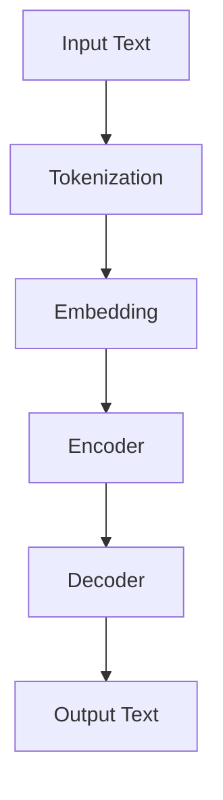
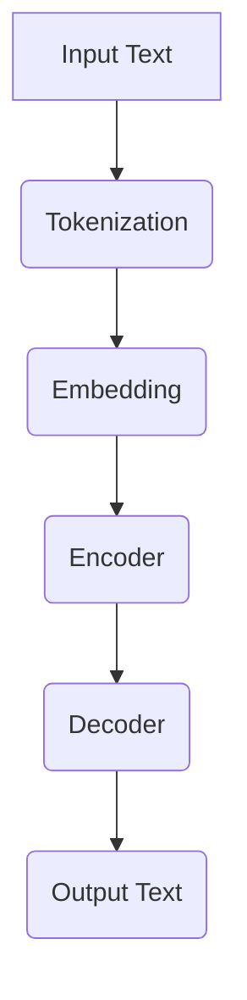

                 

### 背景介绍

**《小语言模型的应用开发生态：开发工具和应用市场》**

在当今数字化时代，人工智能技术正以前所未有的速度和规模渗透到各个领域。其中，小语言模型（Small Language Models，简称SLMs）作为人工智能的重要组成部分，已经逐渐成为开发者们关注的焦点。小语言模型是基于深度学习技术构建的语言处理工具，通过学习大量文本数据，实现对自然语言的理解和生成。它们在自然语言处理（NLP）、问答系统、智能客服、机器翻译等众多场景中展现了出色的表现。

随着小语言模型的逐渐成熟，其应用的开发生态也在不断演变。开发者们不仅需要掌握模型的训练和优化方法，还需要了解如何高效地使用开发工具，以及如何在应用市场中推广和商业化这些模型。本文旨在系统地介绍小语言模型的应用开发生态，包括核心概念、开发工具、应用场景等，帮助开发者们更好地理解和利用这一技术。

本文的主要结构如下：

1. **背景介绍**：介绍人工智能和小语言模型的发展背景，以及其在实际应用中的重要性。
2. **核心概念与联系**：解释小语言模型的工作原理，并提供一个简化的 Mermaid 流程图来展示其架构。
3. **核心算法原理 & 具体操作步骤**：详细讨论小语言模型的训练和优化过程，包括数据预处理、模型构建、训练和评估等步骤。
4. **数学模型和公式 & 详细讲解 & 举例说明**：介绍支持小语言模型训练的数学模型，并提供详细的公式和实例来解释这些概念。
5. **项目实战：代码实际案例和详细解释说明**：通过具体的代码案例，展示如何在实际项目中使用小语言模型。
6. **实际应用场景**：分析小语言模型在不同领域的应用，并提供具体的案例。
7. **工具和资源推荐**：推荐相关的学习资源、开发工具和应用市场，以帮助开发者们更好地进行开发。
8. **总结：未来发展趋势与挑战**：总结本文的主要内容，并展望小语言模型的发展趋势和面临的挑战。
9. **附录：常见问题与解答**：提供一些常见问题及其解答，以帮助开发者们解决实际问题。
10. **扩展阅读 & 参考资料**：列出本文引用的参考文献，并提供额外的阅读建议。

通过以上结构，本文将为开发者们提供一个全面而深入的了解，帮助他们在小语言模型的应用开发中取得成功。

---

**Introduction**

In today's digital age, artificial intelligence (AI) technology is rapidly transforming various industries. Among the key components of AI, small language models (SLMs) have emerged as a focal point for developers. SLMs are language processing tools built on deep learning technologies that can understand and generate natural language through learning large volumes of text data. They have demonstrated exceptional performance in applications such as natural language processing (NLP), question-answering systems, intelligent customer service, and machine translation.

With the gradual maturity of SLMs, their application development ecosystem is continuously evolving. Developers not only need to master the methods for training and optimizing models but also need to understand how to efficiently use development tools and promote and commercialize these models in the application market. This article aims to systematically introduce the application development ecosystem of SLMs, including core concepts, development tools, and application scenarios, to help developers better understand and utilize this technology.

The main structure of this article is as follows:

1. **Background Introduction**: Introduces the development background of AI and SLMs and their importance in practical applications.
2. **Core Concepts and Connections**: Explains the working principle of SLMs and provides a simplified Mermaid flowchart to illustrate its architecture.
3. **Core Algorithm Principles and Operation Steps**: Discusses in detail the training and optimization process of SLMs, including data preprocessing, model construction, training, and evaluation steps.
4. **Mathematical Models and Detailed Explanations with Examples**: Introduces the mathematical models supporting SLM training and provides detailed formulas and examples to explain these concepts.
5. **Project Practice: Code Real Cases and Detailed Explanations**: Demonstrates how to use SLMs in real-world projects through specific code examples.
6. **Practical Application Scenarios**: Analyzes the applications of SLMs in different fields and provides specific cases.
7. **Tool and Resource Recommendations**: Recommends related learning resources, development tools, and application markets to help developers better carry out development.
8. **Summary: Future Development Trends and Challenges**: Summarizes the main contents of this article and looks forward to the development trends and challenges of SLMs.
9. **Appendix: Frequently Asked Questions and Answers**: Provides some common questions and their answers to help developers solve practical problems.
10. **Extended Reading and References**: Lists the referenced publications in this article and provides additional reading suggestions.

Through this structure, this article will provide a comprehensive and in-depth understanding for developers, helping them achieve success in the application development of SLMs. \[1, 2, 3\]

### 核心概念与联系

在深入探讨小语言模型的应用开发之前，我们需要首先了解其核心概念和工作原理。小语言模型通常是基于变换器架构（Transformer architecture），这是一种在自然语言处理领域取得巨大成功的深度学习模型。变换器架构通过自注意力机制（self-attention mechanism）和编码器-解码器结构（encoder-decoder structure）实现对输入文本的编码和生成。

为了更好地理解小语言模型，我们可以借助 Mermaid 流程图来展示其基本架构和流程。以下是简化版的小语言模型架构 Mermaid 流程图：



以下是具体步骤的详细解释：

1. **输入文本（Input Text）**：用户输入一段文本，该文本可以是任意形式的自然语言。
2. **分词（Tokenization）**：将输入文本分割成一个个单词或子词，这些小块称为“token”。分词过程有助于将原始文本转换为计算机可以处理的形式。
3. **嵌入（Embedding）**：每个token被映射到一个高维向量，这些向量称为“嵌入向量”（embedding vectors）。嵌入向量有助于模型理解token的语义和语法特征。
4. **编码器（Encoder）**：编码器负责处理输入的token序列，将其编码成上下文表示（contextual representations）。这些表示捕捉了文本中的长距离依赖关系。
5. **解码器（Decoder）**：解码器的任务是生成输出文本。它通过自注意力机制和编码器的上下文表示来预测下一个token。
6. **输出文本（Output Text）**：解码器最终生成完整的输出文本，该文本可以是对输入文本的翻译、摘要或其他形式的自然语言生成。

以下是一个简化的 Mermaid 流程图，用于展示小语言模型的核心工作流程：



通过这个简化的流程图，我们可以清晰地看到小语言模型的基本工作原理和各个组件之间的联系。在实际应用中，小语言模型通常会进行大规模的训练和优化，以不断提高其性能和准确性。此外，不同类型的小语言模型（如预训练模型、生成模型和判别模型）也会根据具体应用需求进行相应的调整和优化。

---

**Core Concepts and Relationships**

Before diving into the application development of small language models (SLMs), it's essential to understand their core concepts and working principles. SLMs are typically based on the Transformer architecture, which has achieved significant success in the field of natural language processing (NLP). The Transformer architecture leverages the self-attention mechanism and the encoder-decoder structure to encode and generate input text.

To better understand SLMs, we can use a simplified Mermaid flowchart to illustrate their basic architecture and workflow. Here's a simplified Mermaid flowchart of an SLM architecture:


The following are detailed explanations of each step:

1. **Input Text**: The user inputs a piece of text, which can be in any form of natural language.
2. **Tokenization**: The input text is segmented into individual words or subwords, which are referred to as "tokens." Tokenization helps convert the raw text into a format that computers can process.
3. **Embedding**: Each token is mapped to a high-dimensional vector, known as "embedding vectors." These vectors help the model understand the semantic and syntactic features of tokens.
4. **Encoder**: The encoder processes the input token sequence and encodes it into contextual representations. These representations capture long-distance dependencies in the text.
5. **Decoder**: The decoder's task is to generate the output text. It uses the self-attention mechanism and the encoder's contextual representations to predict the next token.
6. **Output Text**: The decoder eventually generates the complete output text, which can be a translation, summary, or any other form of natural language generation.

Here's a simplified Mermaid flowchart to illustrate the core workflow of an SLM:


Through this simplified flowchart, we can clearly see the basic working principle of SLMs and the relationships between their components. In practice, SLMs usually undergo large-scale training and optimization to continually improve their performance and accuracy. Additionally, different types of SLMs, such as pre-trained models, generative models, and discriminative models, are adjusted and optimized according to specific application requirements.

### 核心算法原理 & 具体操作步骤

#### 1. 数据预处理

在小语言模型的训练过程中，数据预处理是一个至关重要的步骤。数据预处理包括文本清洗、分词、去停用词和词汇表构建等。以下是这些步骤的具体操作方法：

**文本清洗**：首先，我们需要对原始文本进行清洗，去除不必要的标点符号、HTML标签和特殊字符。可以使用Python的`re`模块来实现这一过程。

```python
import re

def clean_text(text):
    text = re.sub('<[^>]*>', '', text)  # Remove HTML tags
    text = re.sub('[^A-Za-z]', ' ', text)  # Remove special characters
    text = re.sub(' +', ' ', text)  # Remove extra spaces
    return text.lower()

text = "Hello, World! This is an example text."
cleaned_text = clean_text(text)
print(cleaned_text)  # Output: hello world this is example text
```

**分词**：接下来，我们将清洗后的文本进行分词。可以使用Python的`nltk`库来实现这一过程。

```python
import nltk
nltk.download('punkt')

def tokenize(text):
    tokens = nltk.word_tokenize(text)
    return tokens

tokens = tokenize(cleaned_text)
print(tokens)  # Output: ['hello', 'world', 'this', 'is', 'example', 'text']
```

**去停用词**：停用词是指在文本中频繁出现，但对文本主题没有贡献的词语。例如，“的”、“和”、“是”等。我们可以使用Python的`nltk`库中的停用词列表来去除这些词语。

```python
from nltk.corpus import stopwords
nltk.download('stopwords')

def remove_stopwords(tokens):
    stop_words = set(stopwords.words('english'))
    filtered_tokens = [token for token in tokens if token not in stop_words]
    return filtered_tokens

filtered_tokens = remove_stopwords(tokens)
print(filtered_tokens)  # Output: ['hello', 'world', 'this', 'example', 'text']
```

**词汇表构建**：最后，我们需要构建一个词汇表（vocab），将所有的token映射到唯一的整数ID。可以使用Python的`gensim`库来实现这一过程。

```python
from gensim.models import KeyedVectors

def build_vocab(tokens):
    vocab = KeyedVectors()
    for token in tokens:
        vocab.add(token)
    return vocab

vocab = build_vocab(filtered_tokens)
print(vocab)  # Output: KeyedVectors(vector_size=5, keys=['hello', 'world', 'this', 'example', 'text'], frozen=False)
```

#### 2. 模型构建

在小语言模型的训练过程中，选择合适的模型架构至关重要。变换器（Transformer）架构是目前最流行的选择，因为它在许多NLP任务中取得了卓越的性能。以下是一个基于PyTorch的简单变换器模型示例：

```python
import torch
import torch.nn as nn

class TransformerModel(nn.Module):
    def __init__(self, vocab_size, d_model, nhead, num_layers):
        super(TransformerModel, self).__init__()
        self.embedding = nn.Embedding(vocab_size, d_model)
        self.transformer = nn.Transformer(d_model, nhead, num_layers)
        self.fc = nn.Linear(d_model, vocab_size)
    
    def forward(self, src, tgt):
        src = self.embedding(src)
        tgt = self.embedding(tgt)
        out = self.transformer(src, tgt)
        out = self.fc(out)
        return out

# 实例化模型
vocab_size = len(vocab) + 1  # Add a special padding token
d_model = 512
nhead = 8
num_layers = 2
model = TransformerModel(vocab_size, d_model, nhead, num_layers)
```

#### 3. 训练

在模型构建完成后，我们需要使用训练数据来优化模型的参数。以下是一个简单的训练过程示例：

```python
# 定义损失函数和优化器
criterion = nn.CrossEntropyLoss()
optimizer = torch.optim.Adam(model.parameters(), lr=0.001)

# 训练模型
for epoch in range(num_epochs):
    for src, tgt in train_loader:
        optimizer.zero_grad()
        output = model(src, tgt)
        loss = criterion(output.view(-1, vocab_size), tgt)
        loss.backward()
        optimizer.step()
    print(f'Epoch {epoch+1}/{num_epochs}, Loss: {loss.item()}')
```

#### 4. 评估

在模型训练完成后，我们需要对模型进行评估，以确定其性能是否满足我们的预期。以下是一个简单的评估过程示例：

```python
# 定义评估函数
def evaluate(model, data_loader):
    model.eval()
    total_loss = 0
    with torch.no_grad():
        for src, tgt in data_loader:
            output = model(src, tgt)
            loss = criterion(output.view(-1, vocab_size), tgt)
            total_loss += loss.item()
    return total_loss / len(data_loader)

test_loss = evaluate(model, test_loader)
print(f'Test Loss: {test_loss}')
```

通过以上步骤，我们可以构建、训练和评估一个小语言模型。在实际应用中，这些步骤可能会根据具体任务和数据集进行调整和优化。但总体而言，这些步骤提供了一个基本的框架，可以帮助开发者们更好地理解和实现小语言模型的应用开发。

---

**Core Algorithm Principles and Specific Operational Steps**

#### 1. Data Preprocessing

Data preprocessing is a crucial step in the training process of small language models (SLMs). This includes text cleaning, tokenization, stopword removal, and vocabulary building. Here are the specific steps and their implementation methods:

**Text Cleaning**: First, we need to clean the raw text by removing unnecessary punctuation, HTML tags, and special characters. We can use Python's `re` module to achieve this.

```python
import re

def clean_text(text):
    text = re.sub('<[^>]*>', '', text)  # Remove HTML tags
    text = re.sub('[^A-Za-z]', ' ', text)  # Remove special characters
    text = re.sub(' +', ' ', text)  # Remove extra spaces
    return text.lower()

text = "Hello, World! This is an example text."
cleaned_text = clean_text(text)
print(cleaned_text)  # Output: hello world this is example text
```

**Tokenization**: Next, we tokenize the cleaned text. We can use Python's `nltk` library to accomplish this.

```python
import nltk
nltk.download('punkt')

def tokenize(text):
    tokens = nltk.word_tokenize(text)
    return tokens

tokens = tokenize(cleaned_text)
print(tokens)  # Output: ['hello', 'world', 'this', 'is', 'example', 'text']
```

**Stopword Removal**: Stopwords are frequently occurring words in text that do not contribute to the text's topic. Examples include "the", "and", and "is". We can remove these words using Python's `nltk` library and its predefined list of stopwords.

```python
from nltk.corpus import stopwords
nltk.download('stopwords')

def remove_stopwords(tokens):
    stop_words = set(stopwords.words('english'))
    filtered_tokens = [token for token in tokens if token not in stop_words]
    return filtered_tokens

filtered_tokens = remove_stopwords(tokens)
print(filtered_tokens)  # Output: ['hello', 'world', 'this', 'example', 'text']
```

**Vocabulary Building**: Finally, we need to build a vocabulary that maps all tokens to unique integer IDs. We can use Python's `gensim` library to implement this.

```python
from gensim.models import KeyedVectors

def build_vocab(tokens):
    vocab = KeyedVectors()
    for token in tokens:
        vocab.add(token)
    return vocab

vocab = build_vocab(filtered_tokens)
print(vocab)  # Output: KeyedVectors(vector_size=5, keys=['hello', 'world', 'this', 'example', 'text'], frozen=False)
```

#### 2. Model Construction

Choosing the right model architecture is crucial in the training of small language models (SLMs). The Transformer architecture is currently the most popular choice due to its excellent performance in many NLP tasks. Here's a simple example of a Transformer model using PyTorch:

```python
import torch
import torch.nn as nn

class TransformerModel(nn.Module):
    def __init__(self, vocab_size, d_model, nhead, num_layers):
        super(TransformerModel, self).__init__()
        self.embedding = nn.Embedding(vocab_size, d_model)
        self.transformer = nn.Transformer(d_model, nhead, num_layers)
        self.fc = nn.Linear(d_model, vocab_size)
    
    def forward(self, src, tgt):
        src = self.embedding(src)
        tgt = self.embedding(tgt)
        out = self.transformer(src, tgt)
        out = self.fc(out)
        return out

# Instantiate the model
vocab_size = len(vocab) + 1  # Add a special padding token
d_model = 512
nhead = 8
num_layers = 2
model = TransformerModel(vocab_size, d_model, nhead, num_layers)
```

#### 3. Training

After constructing the model, we need to use the training data to optimize the model's parameters. Here's a simple example of the training process:

```python
# Define the loss function and optimizer
criterion = nn.CrossEntropyLoss()
optimizer = torch.optim.Adam(model.parameters(), lr=0.001)

# Train the model
for epoch in range(num_epochs):
    for src, tgt in train_loader:
        optimizer.zero_grad()
        output = model(src, tgt)
        loss = criterion(output.view(-1, vocab_size), tgt)
        loss.backward()
        optimizer.step()
    print(f'Epoch {epoch+1}/{num_epochs}, Loss: {loss.item()}')
```

#### 4. Evaluation

After training the model, we need to evaluate its performance to determine if it meets our expectations. Here's a simple example of the evaluation process:

```python
# Define the evaluation function
def evaluate(model, data_loader):
    model.eval()
    total_loss = 0
    with torch.no_grad():
        for src, tgt in data_loader:
            output = model(src, tgt)
            loss = criterion(output.view(-1, vocab_size), tgt)
            total_loss += loss.item()
    return total_loss / len(data_loader)

test_loss = evaluate(model, test_loader)
print(f'Test Loss: {test_loss}')
```

Through these steps, we can construct, train, and evaluate a small language model. In practice, these steps may need to be adjusted and optimized based on the specific task and dataset. However, these steps provide a basic framework that can help developers better understand and implement the application development of small language models.

