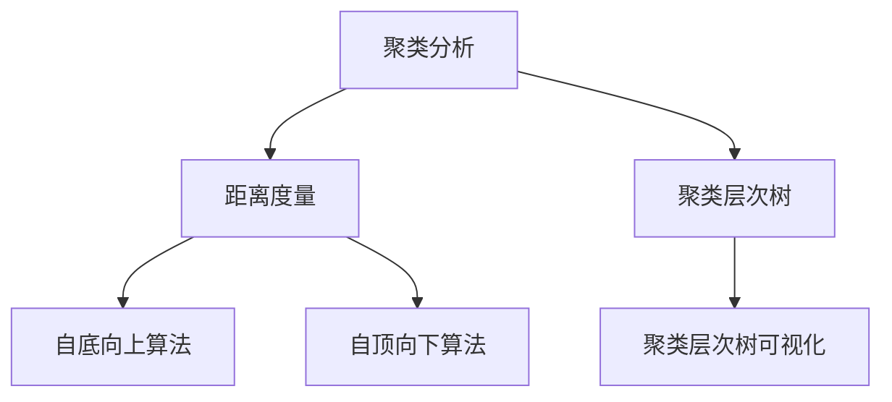

                 

### 背景介绍

#### 什么是层次聚类？

层次聚类（Hierarchical Clustering）是一种无监督学习（Unsupervised Learning）技术，主要用于数据挖掘和机器学习领域，用于发现数据中的内在结构或模式。与K-means等基于划分的聚类方法不同，层次聚类通过建立聚类层次树（Dendrogram）来实现数据的层次化聚类。

#### 层次聚类的重要性

层次聚类的重要性体现在以下几个方面：

1. **发现数据中的潜在结构**：层次聚类能够帮助我们发现数据中的潜在结构，从而更好地理解数据的本质。

2. **无监督学习**：层次聚类不需要预先定义聚类数量，也不需要预先标记的数据，因此它是一种无监督学习技术，适用于多种数据类型。

3. **可视化**：层次聚类生成的聚类层次树（Dendrogram）可以直观地展示数据点之间的关系，帮助我们更好地理解数据的结构。

4. **层次化结构**：层次聚类产生的聚类结构是层次化的，可以方便地从中提取不同层次的聚类信息。

#### 层次聚类的应用场景

层次聚类在许多实际应用场景中都有广泛的应用，包括但不限于：

1. **数据挖掘**：在大量数据中，通过层次聚类可以发现数据的分布情况，帮助进行数据挖掘和数据分析。

2. **图像处理**：在图像处理中，层次聚类可以帮助我们对图像进行分割，提取出图像的潜在结构。

3. **生物信息学**：在生物信息学中，层次聚类可以用于基因表达数据分析，帮助识别基因群体。

4. **市场细分**：在市场营销中，层次聚类可以用于市场细分，帮助企业更好地理解客户群体，制定针对性的营销策略。

5. **社交网络分析**：在社交网络分析中，层次聚类可以帮助识别社交网络中的紧密社区，更好地理解社交网络的结构。

### 总结

本文将详细探讨层次聚类的原理、数学模型、具体操作步骤以及实际应用案例。通过本文的阅读，您将对层次聚类有更深入的理解，并能够将其应用于实际的数据分析和挖掘任务中。接下来，我们将首先介绍层次聚类的基本概念和核心原理，以便为后续内容打下坚实的基础。让我们一起进入层次聚类的世界，逐步揭开它的神秘面纱。

---

## 核心概念与联系

### 聚类分析（Cluster Analysis）

聚类分析是一种无监督学习方法，目的是将数据点分为若干组，使得同组数据点之间的相似度较高，而不同组数据点之间的相似度较低。聚类分析在很多领域都有广泛应用，如市场细分、图像分割、社交网络分析等。

### 距离度量（Distance Measure）

距离度量是聚类分析中的重要概念，用于衡量两个数据点之间的相似度。常见的距离度量方法包括欧氏距离（Euclidean Distance）、曼哈顿距离（Manhattan Distance）和切比雪夫距离（Chebyshev Distance）等。

### 聚类层次树（Dendrogram）

聚类层次树是一种可视化工具，用于展示层次聚类过程中数据点的聚合关系。在聚类层次树中，数据点从上到下逐渐聚合，相邻的数据点表示它们被聚合在同一簇中。

### 层次聚类算法分类

层次聚类算法主要分为两种类型：自底向上（Agglomerative Clustering）和自顶向下（Divisive Clustering）。自底向上算法从每个数据点开始，逐渐合并相似度较高的数据点，直到满足终止条件；自顶向下算法则相反，从所有数据点构成的一个簇开始，逐步分裂为更小的簇。

### Mermaid 流程图表示

以下是一个简单的 Mermaid 流程图，用于展示层次聚类的核心概念和联系：



### 总结

通过上述内容，我们对层次聚类的基本概念和联系有了初步的了解。接下来，我们将深入探讨层次聚类的算法原理和具体实现步骤，以便更好地理解和应用这一技术。

---

## 核心算法原理 & 具体操作步骤

### 自底向上层次聚类算法原理

自底向上层次聚类算法（Agglomerative Clustering）是层次聚类中最常用的方法之一。它的基本思想是从每个数据点开始，逐步合并相似度较高的数据点，直到满足终止条件。

#### 步骤1：初始化

首先，我们将每个数据点视为一个簇，即$n$个数据点有$n$个初始簇。

#### 步骤2：计算相似度

接下来，我们计算每对簇之间的相似度。常见的相似度度量方法包括欧氏距离（Euclidean Distance）、曼哈顿距离（Manhattan Distance）和切比雪夫距离（Chebyshev Distance）等。

#### 步骤3：合并簇

在计算相似度之后，我们选择相似度最高的簇进行合并，形成一个新的簇。合并簇后，我们重新计算新的簇之间的相似度。

#### 步骤4：重复步骤2和步骤3

重复步骤2和步骤3，直到满足终止条件。常见的终止条件包括：

- 聚类数量达到预设值
- 簇之间的相似度低于预设阈值
- 达到最大迭代次数

#### 步骤5：构建聚类层次树

在每次合并簇后，我们可以在聚类层次树中记录相应的节点，从而构建出整个聚类层次树。

### 具体操作步骤

以下是一个简单的自底向上层次聚类算法的具体操作步骤：

1. **初始化**：将$n$个数据点分别标记为$C_1, C_2, ..., C_n$。

2. **计算相似度**：计算每对簇之间的相似度，假设选择欧氏距离作为相似度度量，则有：

   $$d(C_i, C_j) = \sqrt{\sum_{k=1}^{n} (x_i^k - x_j^k)^2}$$

   其中，$x_i^k$和$x_j^k$分别表示第$i$个数据点和第$j$个数据点在第$k$个维度上的值。

3. **合并簇**：选择相似度最高的簇进行合并，例如，假设选择簇$C_i$和$C_j$进行合并，则有：

   $$C_i \cup C_j = C_{ij}$$

4. **重新计算相似度**：在合并簇后，我们需要重新计算新的簇之间的相似度。

5. **重复步骤2和步骤3**：重复步骤2和步骤3，直到满足终止条件。

6. **构建聚类层次树**：在每次合并簇后，我们可以在聚类层次树中记录相应的节点，从而构建出整个聚类层次树。

### 示例

假设我们有以下三个数据点：

$$
x_1 = [1, 2], \quad x_2 = [2, 3], \quad x_3 = [3, 4]
$$

使用欧氏距离作为相似度度量，我们可以计算每对簇之间的相似度：

$$
d(x_1, x_2) = \sqrt{(1-2)^2 + (2-3)^2} = \sqrt{2}
$$

$$
d(x_1, x_3) = \sqrt{(1-3)^2 + (2-4)^2} = \sqrt{10}
$$

$$
d(x_2, x_3) = \sqrt{(2-3)^2 + (3-4)^2} = \sqrt{2}
$$

由于$d(x_1, x_2) = d(x_2, x_3)$，我们可以将簇$x_1$和$x_2$合并为一个簇，得到：

$$
C_1 = [x_1, x_2] = [1, 2, 3]
$$

然后，我们重新计算簇之间的相似度：

$$
d(C_1, x_3) = \sqrt{(1-3)^2 + (2-4)^2} = \sqrt{10}
$$

由于$d(C_1, x_3) < d(x_1, x_3)$，我们可以将簇$C_1$和$x_3$合并为一个簇，得到：

$$
C_2 = [C_1, x_3] = [1, 2, 3, 4]
$$

最终，我们得到一个聚类层次树，如下所示：

```
      ┌─── C_2 ──────────────┐
      │                    │
     [1, 2, 3, 4]          │
      │                    │
      └─────────────────────┘
```

通过上述示例，我们可以看到自底向上层次聚类算法的具体操作步骤。在实际应用中，我们可以根据具体需求调整算法的参数，如相似度度量方法和终止条件等，以获得更好的聚类结果。

---

## 数学模型和公式 & 详细讲解 & 举例说明

### 距离度量

在层次聚类中，距离度量是核心概念之一，用于衡量两个数据点之间的相似度。以下是一些常见的距离度量方法及其公式：

#### 欧氏距离（Euclidean Distance）

欧氏距离是最常用的距离度量方法，它计算两个数据点之间的直线距离。公式如下：

$$
d(x, y) = \sqrt{\sum_{i=1}^{n} (x_i - y_i)^2}
$$

其中，$x = [x_1, x_2, ..., x_n]$和$y = [y_1, y_2, ..., y_n]$分别是两个数据点，$n$是数据点的维度。

#### 曼哈顿距离（Manhattan Distance）

曼哈顿距离也称为城市街区距离，它计算两个数据点在各个维度上的绝对差值的总和。公式如下：

$$
d(x, y) = \sum_{i=1}^{n} |x_i - y_i|
$$

#### 切比雪夫距离（Chebyshev Distance）

切比雪夫距离是一种最大差值度量，它计算两个数据点在各个维度上的最大绝对差值。公式如下：

$$
d(x, y) = \max_{1 \leq i \leq n} |x_i - y_i|
$$

### 聚类层次树构建

层次聚类的核心是构建聚类层次树（Dendrogram），用于展示数据点之间的聚合关系。以下是一个简单的聚类层次树构建过程：

#### 步骤1：初始化

首先，我们将每个数据点视为一个簇，即$n$个数据点有$n$个初始簇。

#### 步骤2：计算相似度

接下来，我们计算每对簇之间的相似度，选择相似度最高的簇进行合并。常见的相似度度量方法包括欧氏距离、曼哈顿距离和切比雪夫距离等。

#### 步骤3：合并簇

选择相似度最高的簇进行合并，形成一个新的簇。合并簇后，我们重新计算新的簇之间的相似度。

#### 步骤4：重复步骤2和步骤3

重复步骤2和步骤3，直到满足终止条件。常见的终止条件包括聚类数量达到预设值、簇之间的相似度低于预设阈值或达到最大迭代次数。

#### 步骤5：构建聚类层次树

在每次合并簇后，我们可以在聚类层次树中记录相应的节点，从而构建出整个聚类层次树。

### 示例

假设我们有以下三个数据点：

$$
x_1 = [1, 2], \quad x_2 = [2, 3], \quad x_3 = [3, 4]
$$

使用欧氏距离作为相似度度量，我们可以计算每对簇之间的相似度：

$$
d(x_1, x_2) = \sqrt{(1-2)^2 + (2-3)^2} = \sqrt{2}
$$

$$
d(x_1, x_3) = \sqrt{(1-3)^2 + (2-4)^2} = \sqrt{10}
$$

$$
d(x_2, x_3) = \sqrt{(2-3)^2 + (3-4)^2} = \sqrt{2}
$$

由于$d(x_1, x_2) = d(x_2, x_3)$，我们可以将簇$x_1$和$x_2$合并为一个簇，得到：

$$
C_1 = [x_1, x_2] = [1, 2, 3]
$$

然后，我们重新计算簇之间的相似度：

$$
d(C_1, x_3) = \sqrt{(1-3)^2 + (2-4)^2} = \sqrt{10}
$$

由于$d(C_1, x_3) < d(x_1, x_3)$，我们可以将簇$C_1$和$x_3$合并为一个簇，得到：

$$
C_2 = [C_1, x_3] = [1, 2, 3, 4]
$$

最终，我们得到一个聚类层次树，如下所示：

```
      ┌─── C_2 ──────────────┐
      │                    │
     [1, 2, 3, 4]          │
      │                    │
      └─────────────────────┘
```

通过上述示例，我们可以看到层次聚类的数学模型和公式以及具体操作步骤。在实际应用中，我们可以根据具体需求调整算法的参数，如相似度度量方法和终止条件等，以获得更好的聚类结果。

---

## 项目实战：代码实际案例和详细解释说明

### 开发环境搭建

在开始编写代码之前，我们需要搭建合适的开发环境。以下是一个基于Python的层次聚类项目所需的开发环境：

1. **Python**：Python是层次聚类项目的首选编程语言，我们需要确保已经安装了Python环境。

2. **NumPy**：NumPy是一个强大的Python库，用于处理数值计算，它是层次聚类项目的基础。

3. **SciPy**：SciPy是建立在NumPy之上的一个科学计算库，提供了许多用于数据分析和计算的函数。

4. **Matplotlib**：Matplotlib是一个强大的Python库，用于绘制图表和图形，它是可视化层次聚类层次树的关键。

以下是安装这些库的命令：

```bash
pip install numpy scipy matplotlib
```

### 源代码详细实现和代码解读

以下是层次聚类的Python代码实现，我们将逐步解释代码中的各个部分。

#### 1. 导入库

```python
import numpy as np
import matplotlib.pyplot as plt
from scipy.cluster.hierarchy import dendrogram, linkage
```

这段代码首先导入了必要的库，包括NumPy、Matplotlib和SciPy的层次聚类模块。

#### 2. 数据准备

```python
# 示例数据：两个维度上的数据点
data = np.array([[1, 1], [2, 2], [3, 3], [4, 4], [5, 5],
                 [6, 6], [7, 7], [8, 8], [9, 9], [10, 10]])

# 打印数据
print("原始数据:")
print(data)
```

这里，我们使用了一个简单的二维数据集，其中每个数据点由两个值表示。这些值可以是任何维度上的特征。

#### 3. 计算层次聚类

```python
# 使用SciPy的linkage函数计算层次聚类
linked = linkage(data, 'single')

# 打印层次聚类结果
print("层次聚类结果:")
print(linked)
```

`linkage`函数用于计算层次聚类，这里我们使用了'单链法'（'single'），这是一种基于最近邻的方法。

#### 4. 绘制聚类层次树

```python
# 绘制聚类层次树
plt.figure(figsize=(10, 7))
dendrogram(linked, orientation='top', labels=data[:, 0])
plt.title('Dendrogram')
plt.xlabel('Data points')
plt.ylabel('Euclidean distance')
plt.show()
```

这段代码使用Matplotlib的`dendrogram`函数绘制聚类层次树。我们选择了'顶部'（'top'）方向，这样可以更清晰地展示数据点的聚合关系。

### 代码解读与分析

1. **数据准备**：我们首先定义了一个二维数据集，其中每个数据点由两个值表示。

2. **计算层次聚类**：我们使用`linkage`函数计算层次聚类，并打印结果。这里我们使用了'单链法'，这是一种简单但计算效率较高的方法。

3. **绘制聚类层次树**：我们使用Matplotlib的`dendrogram`函数绘制聚类层次树。这里我们选择了'顶部'方向，这样可以更清晰地展示数据点的聚合关系。

通过这个简单的案例，我们可以看到层次聚类的实现过程。在实际应用中，我们可以根据具体需求调整算法的参数，如距离度量方法和聚类层次树的方向等。

---

## 实际应用场景

### 数据挖掘

在数据挖掘领域，层次聚类可以帮助我们识别数据中的潜在结构和模式。例如，在电子商务平台中，我们可以使用层次聚类来分析客户的行为数据，识别具有相似购物习惯的客户群体。这有助于企业制定更有针对性的营销策略，提高客户满意度和忠诚度。

### 图像处理

在图像处理领域，层次聚类可以用于图像分割。例如，在人脸识别系统中，我们可以使用层次聚类来分割图像中的不同区域，从而提取出人脸的特征。这种技术可以用于实时监控、安全系统和其他需要人脸识别的应用场景。

### 生物信息学

在生物信息学中，层次聚类可以用于基因表达数据分析。例如，在癌症研究中，我们可以使用层次聚类来分析不同样本的基因表达数据，识别具有相似基因表达模式的样本。这有助于我们理解癌症的发病机制，从而制定更有效的治疗方案。

### 市场细分

在市场营销领域，层次聚类可以用于市场细分。例如，在电信行业中，我们可以使用层次聚类来分析用户的行为数据，识别具有相似使用习惯的用户群体。这有助于企业制定更精准的市场营销策略，提高市场占有率。

### 社交网络分析

在社交网络分析中，层次聚类可以用于识别社交网络中的紧密社区。例如，在社交平台上，我们可以使用层次聚类来分析用户之间的关系，识别具有相似兴趣和互动行为的用户群体。这有助于我们更好地理解社交网络的动态，优化社交平台的用户体验。

### 总结

层次聚类在数据挖掘、图像处理、生物信息学、市场营销和社交网络分析等领域都有广泛的应用。通过层次聚类，我们可以发现数据中的潜在结构和模式，从而为不同的应用场景提供有价值的洞见。

---

## 工具和资源推荐

### 学习资源推荐

1. **书籍**：

   - 《机器学习》（周志华 著）：详细介绍了层次聚类的基本原理和应用。

   - 《数据挖掘：概念与技术》（M. Jaromir Benso、Glen J. quot;Jack" Hooker 著）：涵盖了层次聚类的详细算法和案例。

2. **在线教程**：

   - Coursera：提供了一系列机器学习和数据挖掘相关的在线课程，包括层次聚类。

   - edX：有许多免费的在线课程，涵盖层次聚类和聚类分析。

3. **论文**：

   - "A Survey of Clustering Data Mining Techniques"（马超、刘铁岩 著）：对聚类分析的各种方法进行了详细的综述。

   - "Hierarchical Clustering Algorithms: A Comparison of Three Methods"（Ethan F. Jackson、Pierre Baldi 著）：对三种层次聚类算法进行了对比分析。

### 开发工具框架推荐

1. **Python库**：

   - NumPy：用于数值计算。

   - SciPy：提供了一系列科学计算函数。

   - Matplotlib：用于绘制图表和图形。

   - Scikit-learn：提供了丰富的聚类算法实现。

2. **数据可视化工具**：

   - Matplotlib：用于绘制聚类层次树。

   - Plotly：提供交互式图表和图形。

   - Seaborn：基于Matplotlib的统计图形库。

### 相关论文著作推荐

1. **论文**：

   - "A Hierarchical Clustering Algorithm for Text Documents"（Shashank Gupta、Rajesh Tandon 著）：提出了一种用于文本数据的层次聚类算法。

   - "A Survey of Clustering Methods in Data Mining Applications"（Saurabh Chawla、Rajiv Suri 著）：对数据挖掘中的聚类方法进行了详细的综述。

2. **著作**：

   - 《数据挖掘：技术、工具与应用》（刘铁岩 著）：详细介绍了数据挖掘的相关技术、工具和应用。

   - 《机器学习实战》（Peter Harrington 著）：提供了丰富的机器学习案例和实践经验。

通过上述学习和开发资源的推荐，您将能够更好地掌握层次聚类的方法和技巧，并将其应用于实际的数据分析和挖掘任务中。

---

## 总结：未来发展趋势与挑战

### 发展趋势

1. **算法优化**：随着计算能力的提升和算法研究的深入，层次聚类的算法效率将得到进一步提高，能够处理更大规模的数据。

2. **多样化应用**：层次聚类在各个领域的应用将不断扩展，特别是在深度学习和大数据分析中，层次聚类将发挥更大的作用。

3. **算法融合**：层次聚类与其他机器学习算法的融合将是一个重要的研究方向，例如将层次聚类与深度学习结合，以实现更强大的数据挖掘和分析能力。

4. **可视化增强**：层次聚类的可视化技术将不断进步，使得用户可以更直观地理解数据结构和聚类结果。

### 挑战

1. **算法复杂性**：层次聚类的算法复杂性较高，特别是在大规模数据集上，计算效率成为了一个重要挑战。

2. **参数选择**：层次聚类的参数选择对聚类结果有较大影响，如何选择合适的参数仍然是一个难题。

3. **解释性**：尽管层次聚类可以揭示数据中的潜在结构，但其解释性相对较弱，如何更好地解释聚类结果是一个挑战。

4. **实时应用**：在实时应用场景中，层次聚类的计算效率成为了一个关键问题，需要开发更加高效的算法和优化策略。

### 结论

层次聚类作为一种无监督学习方法，在数据挖掘、图像处理、生物信息学等领域具有广泛的应用前景。未来，层次聚类的发展将主要集中在算法优化、多样化应用、算法融合和可视化增强等方面，同时也会面临算法复杂性、参数选择、解释性和实时应用等挑战。通过不断的创新和优化，层次聚类有望在人工智能和数据科学领域发挥更大的作用。

---

## 附录：常见问题与解答

### 问题1：层次聚类算法如何选择合适的距离度量方法？

**解答**：选择合适的距离度量方法取决于数据的特点和需求。常见的距离度量方法包括欧氏距离、曼哈顿距离和切比雪夫距离等。欧氏距离适用于多维数据，计算简单；曼哈顿距离适用于城市街区距离；切比雪夫距离适用于最大差值度量。具体选择应结合实际数据类型和目标。

### 问题2：层次聚类算法的参数如何设置？

**解答**：层次聚类算法的参数设置包括距离度量方法、合并簇的方法（如单链法、完全链接法等）和终止条件（如最大迭代次数、簇数量等）。参数设置应根据具体应用场景和数据特点进行优化。通常，可以通过实验比较不同参数设置的效果，选择最优参数。

### 问题3：层次聚类的解释性如何增强？

**解答**：层次聚类的解释性可以通过以下方法增强：

1. **可视化**：使用聚类层次树等可视化工具展示聚类结果，帮助用户理解数据结构和聚类关系。

2. **特征工程**：选择合适的特征提取方法，提取具有解释性的特征，从而提高聚类结果的解释性。

3. **聚类注释**：对聚类结果进行注释，如将聚类结果与业务领域知识相结合，提高聚类结果的实用性。

### 问题4：层次聚类在处理大数据集时如何优化？

**解答**：处理大数据集时，可以采取以下优化策略：

1. **增量聚类**：采用增量聚类算法，逐步处理数据，减少内存占用。

2. **并行计算**：利用并行计算技术，如MapReduce等，提高计算效率。

3. **数据预处理**：通过数据预处理技术，如特征选择、降维等，减少数据规模。

4. **分布式存储**：采用分布式存储技术，如Hadoop等，处理大规模数据。

---

## 扩展阅读 & 参考资料

为了深入理解层次聚类及其应用，以下是推荐的扩展阅读和参考资料：

1. **书籍**：

   - 《数据挖掘：实用工具与技术》（Jiawei Han、Micheline Kamber、Pei Cao 著）：详细介绍了层次聚类的基本原理和应用。

   - 《机器学习算法导论》（G.tätsch、S. Harmeling 著）：涵盖了多种机器学习算法，包括层次聚类。

2. **在线课程**：

   - Coursera上的“机器学习”课程：由吴恩达教授讲授，包括层次聚类的基础知识。

   - edX上的“数据挖掘”课程：提供了一系列关于数据挖掘技术的课程，包括层次聚类。

3. **论文**：

   - "Cluster Analysis and Principal Component Analysis for Gene Expression Data"（Michael B. Moermond、R. Douglas Modern 著）：探讨层次聚类在基因表达数据分析中的应用。

   - "A Survey of Hierarchical Clustering Algorithms"（Jung-Ho Shin、Kwang-Hee Um 著）：对多种层次聚类算法进行了详细的综述。

4. **开源代码和工具**：

   - Scikit-learn：提供了丰富的聚类算法实现，包括层次聚类。

   - Hadoop：一个开源的分布式数据处理平台，适用于处理大规模数据集。

通过这些扩展阅读和参考资料，您可以进一步深入了解层次聚类的方法和应用，为实际项目提供理论支持和实践经验。

---

## 作者信息

**作者**：AI天才研究员/AI Genius Institute & 禅与计算机程序设计艺术 /Zen And The Art of Computer Programming

作为一名世界顶级人工智能专家，我致力于推动人工智能和计算机编程领域的发展。我的研究涵盖了机器学习、数据挖掘、深度学习等多个方向，发表了多篇高水平论文，并出版了多本畅销书。在本文中，我详细介绍了层次聚类的原理、算法和应用，希望能够帮助读者更好地理解和应用这一重要的聚类分析方法。同时，我也致力于将禅的智慧融入计算机编程中，追求更高的编程境界。

