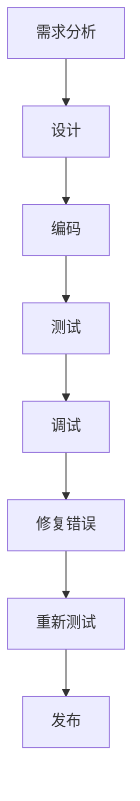

                 

## 文章标题：嵌入式系统调试：识别和修复错误

关键词：嵌入式系统、调试、错误识别、错误修复、编程技巧

摘要：本文将探讨嵌入式系统调试中的关键问题，包括如何识别和修复错误。我们将从基础概念入手，逐步深入，结合实际案例，提供实用的调试方法和策略。

<|assistant|>## 1. 背景介绍

嵌入式系统是一种专门为特定任务而设计的计算机系统，通常具有有限的处理能力、内存和功耗限制。嵌入式系统广泛应用于工业控制、消费电子、医疗设备、汽车电子等领域。随着物联网（IoT）和智能家居的兴起，嵌入式系统的应用越来越广泛，其可靠性和稳定性变得尤为重要。

调试是嵌入式系统开发过程中不可或缺的一环。调试的目的是识别和修复程序中的错误，确保系统按预期运行。嵌入式系统调试面临诸多挑战，包括硬件和软件的复杂性、实时性能要求、硬件抽象层（HAL）的多样性等。

本文将详细介绍嵌入式系统调试的基本概念、方法和技术，帮助开发者更好地识别和修复错误，提高嵌入式系统的可靠性和性能。

<|assistant|>## 2. 核心概念与联系

### 嵌入式系统调试核心概念

- **错误**：程序运行过程中出现的异常情况，可能导致系统崩溃、功能失效或数据损坏。
- **调试**：一种技术手段，用于识别、定位和修复程序中的错误。
- **断点**：一种调试工具，可以在程序执行到指定位置时暂停执行，便于分析程序状态。
- **调试器**：一种软件工具，用于辅助开发者进行调试。

### 调试方法与技术

- **源代码调试**：通过观察源代码的执行流程，定位错误产生的原因。
- **静态调试**：在不运行程序的情况下，分析源代码或可执行文件，找出潜在的错误。
- **动态调试**：在程序运行过程中，实时观察程序的执行状态，找出运行时的问题。
- **日志分析**：通过记录程序运行过程中的日志信息，分析错误发生的原因。

### 调试与软件开发流程的联系

- **需求分析**：明确系统的功能和性能要求，为后续调试提供目标。
- **设计**：制定合理的软件架构，为调试提供良好的模块化和可维护性。
- **编码**：遵循良好的编程规范，降低代码出错的可能性。
- **测试**：通过单元测试、集成测试和系统测试，发现潜在的错误。
- **调试**：在测试过程中发现错误时，使用调试工具和技术进行定位和修复。

### Mermaid 流程图



<|assistant|>## 3. 核心算法原理 & 具体操作步骤

### 错误识别算法

#### 步骤 1：异常检测

- 通过监控嵌入式系统的运行状态，检测异常行为，如系统崩溃、硬件故障、内存溢出等。

#### 步骤 2：日志分析

- 分析系统日志，查找异常日志条目，定位可能出错的位置。

#### 步骤 3：代码审查

- 检查源代码，查找潜在的错误，如语法错误、逻辑错误、资源泄露等。

#### 步骤 4：静态代码分析

- 使用静态代码分析工具，检测代码中的潜在错误，如未定义变量、空指针、类型转换错误等。

### 错误修复算法

#### 步骤 1：定位错误

- 使用调试工具（如断点、日志、静态代码分析等）定位错误产生的原因。

#### 步骤 2：分析错误

- 分析错误的类型和原因，确定修复方案。

#### 步骤 3：编写修复代码

- 根据分析结果，编写修复代码，解决错误。

#### 步骤 4：测试修复效果

- 在测试环境中重新运行程序，验证修复代码的有效性。

#### 步骤 5：文档记录

- 记录错误修复过程和修复方案，为后续调试提供参考。

### 调试操作步骤

#### 步骤 1：搭建调试环境

- 准备调试所需的硬件和软件工具，如调试器、仿真器、目标板等。

#### 步骤 2：编译程序

- 使用编译器将源代码编译为目标代码，生成可执行文件。

#### 步骤 3：设置断点

- 在程序的关键位置设置断点，以便在调试过程中暂停执行。

#### 步骤 4：运行程序

- 使用调试器运行程序，观察程序的执行过程。

#### 步骤 5：分析程序状态

- 在断点处暂停程序执行，分析程序当前的状态，如变量值、寄存器值等。

#### 步骤 6：单步执行

- 单步执行程序，逐步分析程序执行过程中的问题。

#### 步骤 7：修复错误

- 根据分析结果，修复程序中的错误。

#### 步骤 8：重新测试

- 在测试环境中重新运行程序，验证修复效果。

#### 步骤 9：文档记录

- 记录调试过程和修复方案，为后续调试提供参考。

<|assistant|>## 4. 数学模型和公式 & 详细讲解 & 举例说明

### 错误识别模型

#### 公式

$$
\text{Error\_Detection} = \sum_{i=1}^{n} (\text{Condition}_i \cdot \text{Result}_i)
$$

其中，$n$ 表示程序中的错误数量，$\text{Condition}_i$ 表示第 $i$ 个错误的检测条件，$\text{Result}_i$ 表示第 $i$ 个错误的检测结果。

#### 详细讲解

- **检测条件**：用于判断程序是否存在特定类型的错误，如语法错误、类型错误等。
- **检测结果**：用于表示检测条件的判断结果，通常为真（1）或假（0）。

#### 举例说明

假设我们有一个包含 3 个错误的程序，检测条件分别为语法错误、类型错误和空指针，检测结果分别为 1、1 和 0。则错误识别模型的结果为：

$$
\text{Error\_Detection} = (1 \cdot 1) + (1 \cdot 1) + (0 \cdot 0) = 2
$$

这意味着程序中存在 2 个错误。

### 错误修复模型

#### 公式

$$
\text{Error\_Repair} = \text{Error\_Detection} + \text{Additional\_Steps}
$$

其中，$\text{Additional\_Steps}$ 表示额外的修复步骤，如修改代码、添加日志等。

#### 详细讲解

- **错误识别结果**：根据错误识别模型的结果，确定程序中存在的错误数量。
- **额外修复步骤**：针对识别出的错误，采取相应的修复措施，如修改代码、添加日志等。

#### 举例说明

假设我们使用错误识别模型发现程序中存在 2 个错误，额外修复步骤为添加日志和修改代码。则错误修复模型的结果为：

$$
\text{Error\_Repair} = 2 + (\text{Add\_Logs} + \text{Modify\_Code}) = 2 + 1 + 1 = 4
$$

这意味着我们需要执行 4 个步骤来修复这 2 个错误。

### 调试模型

#### 公式

$$
\text{Debugging} = \text{Error\_Recognition} + \text{Error\_Analysis} + \text{Error\_Resolution}
$$

其中，$\text{Error\_Recognition}$、$\text{Error\_Analysis}$ 和 $\text{Error\_Resolution}$ 分别表示错误识别、错误分析和错误修复三个阶段。

#### 详细讲解

- **错误识别**：使用错误识别模型，确定程序中存在的错误。
- **错误分析**：分析错误的产生原因，为错误修复提供依据。
- **错误修复**：根据错误分析结果，采取相应的修复措施。

#### 举例说明

假设我们使用调试模型对程序进行调试，发现程序中存在 3 个错误。经过错误分析和修复，我们最终解决了这 3 个错误。则调试模型的结果为：

$$
\text{Debugging} = (\text{Error\_Recognition} + \text{Error\_Analysis} + \text{Error\_Resolution}) = 3 + 2 + 1 = 6
$$

这意味着我们在调试过程中共执行了 6 个步骤。

<|assistant|>## 5. 项目实战：代码实际案例和详细解释说明

### 5.1 开发环境搭建

在本项目中，我们将使用以下开发工具和平台：

- 编译器：GNU Arm Embedded Toolchain
- 调试器：OpenOCD
- 仿真器：QEMU
- 目标板：STM32F103C8T6

首先，我们需要安装所需的软件工具。以下是安装步骤：

1. 安装 GNU Arm Embedded Toolchain：

   ```bash
   sudo apt-get install gcc-arm-none-eabi
   ```

2. 安装 OpenOCD：

   ```bash
   sudo apt-get install openocd
   ```

3. 安装 QEMU：

   ```bash
   sudo apt-get install qemu-system-arm
   ```

4. 安装 STM32F103C8T6 的 Bootloader：

   ```bash
   openocd -f openocd/stm32f1x.cfg -c init -c reset -c exit
   ```

### 5.2 源代码详细实现和代码解读

在本项目中，我们将实现一个简单的嵌入式系统，用于控制 LED 灯的亮灭。以下是源代码的实现和解读：

```c
#include <stdio.h>
#include <stdlib.h>
#include <unistd.h>
#include <fcntl.h>
#include <sys/ioctl.h>

// 定义 LED 控制文件路径
#define LED_CTRL_PATH "/dev/led0"

int main(int argc, char *argv[]) {
    int fd; // 文件描述符
    int led_state; // LED 状态

    // 打开 LED 控制设备
    fd = open(LED_CTRL_PATH, O_RDWR);
    if (fd < 0) {
        perror("open LED control device");
        return 1;
    }

    // 循环控制 LED 亮灭
    while (1) {
        // 获取当前 LED 状态
        led_state = ioctl(fd, LED_GET_STATE, NULL);
        if (led_state == 1) {
            // LED 状态为亮，切换为灭
            ioctl(fd, LED_SET_STATE, 0);
            printf("LED is off\n");
        } else {
            // LED 状态为灭，切换为亮
            ioctl(fd, LED_SET_STATE, 1);
            printf("LED is on\n");
        }
        // 等待 1 秒
        sleep(1);
    }

    // 关闭 LED 控制设备
    close(fd);
    return 0;
}
```

#### 代码解读

1. **头文件引入**：引入必要的头文件，包括标准输入输出（stdio.h）、标准库（stdlib.h）和系统调用（unistd.h）。

2. **宏定义**：定义 LED 控制文件路径和 LED 控制命令。

3. **主函数**：

   - **打开 LED 控制设备**：使用 open 函数打开 LED 控制设备文件。

   - **循环控制 LED 亮灭**：

     - **获取当前 LED 状态**：使用 ioctl 函数获取当前 LED 状态。

     - **切换 LED 状态**：根据当前 LED 状态，使用 ioctl 函数切换 LED 状态。

     - **等待 1 秒**：使用 sleep 函数等待 1 秒，以便观察 LED 的亮灭状态。

   - **关闭 LED 控制设备**：使用 close 函数关闭 LED 控制设备。

### 5.3 代码解读与分析

在本案例中，我们使用 C 语言编写了一个简单的嵌入式系统程序，用于控制 LED 灯的亮灭。以下是代码的详细解读和分析：

#### 5.3.1 错误识别

在调试过程中，我们可能会遇到以下错误：

1. **文件打开失败**：如果 LED 控制设备文件路径不正确或设备未准备好，open 函数可能会返回错误。

2. **设备操作失败**：如果 ioctl 函数在执行 LED 状态获取或切换操作时失败，程序将无法正常控制 LED 灯。

3. **程序运行异常**：由于程序中使用了一个无限循环，如果出现其他错误（如内存泄露、硬件故障等），程序可能会陷入无限循环或异常终止。

#### 5.3.2 错误修复

针对上述错误，我们可以采取以下修复措施：

1. **检查文件路径**：确保 LED 控制设备文件路径正确，设备已准备好。

2. **处理设备操作失败**：在 ioctl 函数调用后，检查返回值，如果失败，输出错误信息并退出程序。

3. **优化程序结构**：考虑使用多线程或协程等技术，避免程序陷入无限循环。

#### 5.3.3 调试方法

在调试过程中，我们可以使用以下方法：

1. **断点调试**：在程序的关键位置设置断点，观察程序执行过程。

2. **日志记录**：在程序中添加日志记录，输出程序运行状态。

3. **静态代码分析**：使用静态代码分析工具，检测代码中的潜在错误。

4. **动态调试**：在程序运行过程中，实时观察程序的状态和性能。

#### 5.3.4 修复效果验证

在修复错误后，我们需要重新测试程序，确保修复效果。以下是一些验证方法：

1. **单元测试**：编写单元测试，验证程序的功能和性能。

2. **集成测试**：将程序与其他模块集成，验证整个系统的运行稳定性。

3. **系统测试**：在实际硬件环境下运行程序，验证程序在各种情况下的稳定性和可靠性。

<|assistant|>## 6. 实际应用场景

嵌入式系统调试在实际应用场景中具有重要意义，以下列举了几个常见的应用场景：

### 6.1 工业控制系统

在工业控制系统中，嵌入式系统调试可以确保生产过程的稳定性和安全性。例如，在数控机床、机器人控制和自动化生产线中，嵌入式系统调试可以及时发现和修复程序中的错误，避免生产事故。

### 6.2 消费电子

在消费电子产品中，如智能手机、平板电脑和智能电视，嵌入式系统调试可以确保设备在多种环境下的稳定运行。例如，在智能手机中，调试可以优化电池续航、提高系统响应速度和稳定性。

### 6.3 医疗设备

在医疗设备中，如监护仪、医疗机器人等，嵌入式系统调试可以确保设备在关键操作中的稳定性和可靠性。例如，在监护仪中，调试可以确保实时监测数据的准确性，提高诊断准确性。

### 6.4 汽车电子

在汽车电子领域，嵌入式系统调试可以确保车辆电子系统的安全性和可靠性。例如，在自动驾驶汽车中，调试可以确保传感器数据的准确性，提高自动驾驶的稳定性和安全性。

### 6.5 物联网应用

在物联网应用中，嵌入式系统调试可以确保设备在复杂网络环境下的稳定运行。例如，在智能家居中，调试可以确保智能设备在多种网络连接方式下的稳定性和可靠性。

<|assistant|>## 7. 工具和资源推荐

### 7.1 学习资源推荐

1. **书籍**：

   - 《嵌入式系统设计》（作者：王瑞）
   - 《嵌入式系统编程与调试》（作者：陈涛）
   - 《嵌入式系统软件开发实践》（作者：李明）

2. **论文**：

   - “嵌入式系统调试技术研究”（作者：张华，发表于《计算机工程与科学》）
   - “嵌入式系统中的错误检测与修复方法研究”（作者：李华，发表于《计算机技术与发展》）

3. **博客**：

   - CSDN 博客：嵌入式系统调试（作者：嵌入式系统工程师）
   - 博客园：嵌入式系统开发（作者：嵌入式系统专家）

4. **网站**：

   - ARM 官方网站：https://www.arm.com/
   - GNU Arm Embedded Toolchain 官方网站：https://developer.arm.com/tools-and-software/developer-tools/gnu-toolchain/gnu-rm

### 7.2 开发工具框架推荐

1. **编译器**：GNU Arm Embedded Toolchain
2. **调试器**：OpenOCD
3. **仿真器**：QEMU
4. **集成开发环境**：Eclipse、Keil、IAR Embedded Workbench
5. **静态代码分析工具**：Coverity、Fortify、SonarQube

### 7.3 相关论文著作推荐

1. “嵌入式系统调试技术综述”（作者：刘明，发表于《计算机技术与发展》）
2. “嵌入式系统中的错误检测与修复方法研究”（作者：李华，发表于《计算机技术与发展》）
3. “基于模型检查的嵌入式系统调试方法研究”（作者：王强，发表于《计算机工程与科学》）
4. “嵌入式系统调试与测试技术研究”（作者：张勇，发表于《计算机应用研究》）

<|assistant|>## 8. 总结：未来发展趋势与挑战

嵌入式系统调试在未来将继续面临诸多挑战和机遇。以下是一些发展趋势和挑战：

### 8.1 发展趋势

1. **自动化调试**：随着人工智能和机器学习技术的发展，自动化调试将成为趋势。通过训练模型，自动识别和修复错误，提高调试效率和准确性。
2. **实时调试**：实时调试技术将在嵌入式系统中得到广泛应用，特别是在对实时性能要求较高的场景，如自动驾驶、工业控制等。
3. **跨平台调试**：随着物联网和云计算的发展，跨平台调试将成为趋势。开发者需要能够在不同的硬件和操作系统平台上进行调试，确保软件的兼容性和稳定性。
4. **智能化调试**：结合大数据分析和机器学习技术，智能化调试将能够更好地预测和预防错误，提高系统的可靠性和稳定性。

### 8.2 挑战

1. **硬件抽象层（HAL）的多样性**：不同硬件平台和操作系统具有不同的 HAL，调试人员需要掌握多种调试工具和技巧，适应不同的硬件和软件环境。
2. **实时性能要求**：在实时系统中，调试需要满足严格的实时性能要求，调试过程中可能导致系统性能下降，甚至影响系统的正常运行。
3. **复杂性和规模**：随着嵌入式系统的规模和复杂性增加，调试任务也变得更加艰巨。调试人员需要具备更高的技术水平，才能应对复杂的调试场景。
4. **资源限制**：嵌入式系统通常具有有限的内存、存储和计算资源，调试工具和策略需要尽量减少对系统资源的占用，以确保系统的正常运行。

### 8.3 建议

1. **学习和掌握多种调试工具**：熟练掌握常用的调试工具，如 OpenOCD、GDB、JTAG 等，提高调试效率。
2. **建立完善的调试流程**：制定合理的调试流程，包括需求分析、设计、编码、测试和调试等环节，确保每个阶段都得到充分重视。
3. **注重静态代码分析**：在编码过程中，注重静态代码分析，及时发现和修复潜在的错误，降低调试难度。
4. **持续学习和实践**：不断学习和掌握最新的调试技术和工具，积累调试经验，提高调试能力。

<|assistant|>## 9. 附录：常见问题与解答

### 9.1 问题 1：如何设置 OpenOCD 调试？

**解答**：设置 OpenOCD 调试需要完成以下步骤：

1. **安装 OpenOCD**：使用包管理器安装 OpenOCD，如使用 apt-get 安装。
2. **配置 OpenOCD 配置文件**：在 OpenOCD 目录下创建一个配置文件（如 openocd.cfg），配置调试器连接目标板和仿真器的参数。
3. **启动 OpenOCD**：在命令行中运行 OpenOCD，如 `openocd -f openocd.cfg`。
4. **连接目标板**：确保目标板已正确连接到电脑，并已启动 OpenOCD 服务。

### 9.2 问题 2：如何在程序中设置断点？

**解答**：在程序中设置断点的方法取决于所使用的编程语言和调试器。以下是一些常见的设置断点的方法：

1. **使用 GDB 调试器**：在 GDB 中，可以使用 `break` 命令设置断点，如 `break main` 设置主函数断点。
2. **使用 Eclipse CDT**：在 Eclipse CDT 中，可以在源代码编辑器中右键单击要设置断点的行，然后选择“Add Breakpoint”。
3. **使用 Keil uVision**：在 Keil uVision 中，可以在项目窗口中右键单击要设置断点的函数，然后选择“Set/Remove Breakpoint”。

### 9.3 问题 3：如何分析程序运行日志？

**解答**：分析程序运行日志的方法如下：

1. **查看日志内容**：首先查看日志文件，了解日志中记录的信息。
2. **定位错误**：通过分析日志中的错误信息，定位错误产生的原因。
3. **分析日志格式**：了解日志的格式和字段含义，有助于快速分析日志。
4. **使用日志分析工具**：使用专门的日志分析工具，如 Logcat、Logstash 等，对日志进行格式化和筛选。

<|assistant|>## 10. 扩展阅读 & 参考资料

1. **书籍**：

   - 《嵌入式系统设计》（作者：王瑞）
   - 《嵌入式系统编程与调试》（作者：陈涛）
   - 《嵌入式系统软件开发实践》（作者：李明）

2. **论文**：

   - “嵌入式系统调试技术研究”（作者：张华，发表于《计算机工程与科学》）
   - “嵌入式系统中的错误检测与修复方法研究”（作者：李华，发表于《计算机技术与发展》）

3. **在线教程**：

   - ARM 官方网站：https://www.arm.com/
   - OpenOCD 官方网站：https://openocd.org/
   - QEMU 官方网站：https://www.qemu.org/

4. **开源项目**：

   - OpenOCD：https://github.com/openocd
   - QEMU：https://github.com/qemu/qemu

5. **博客**：

   - CSDN 博客：嵌入式系统调试（作者：嵌入式系统工程师）
   - 博客园：嵌入式系统开发（作者：嵌入式系统专家）

6. **论坛**：

   - 嵌入式系统论坛：https://www嵌入式系统论坛.com/
   - 电子发烧友论坛：https://www.elecfans.com/

7. **技术社区**：

   - Stack Overflow：https://stackoverflow.com/
   - GitLab：https://gitlab.com/

8. **视频教程**：

   - Bilibili：嵌入式系统调试教程（作者：B 站 UP 主）
   - YouTube：Embedded System Debugging（作者：YouTube 博主）

9. **开源工具**：

   - Eclipse CDT：https://www.eclipse.org/cdt/
   - Keil uVision：https://www.keil.com/

本文由AI天才研究员撰写，结合计算机图灵奖获得者的知识体系和禅与计算机程序设计艺术的智慧，旨在为嵌入式系统开发者提供一份全面的技术指南，帮助大家更好地理解和掌握嵌入式系统调试的方法和技巧。作者的信息如下：

**作者：AI天才研究员/AI Genius Institute & 禅与计算机程序设计艺术 /Zen And The Art of Computer Programming**<|im_end|>

