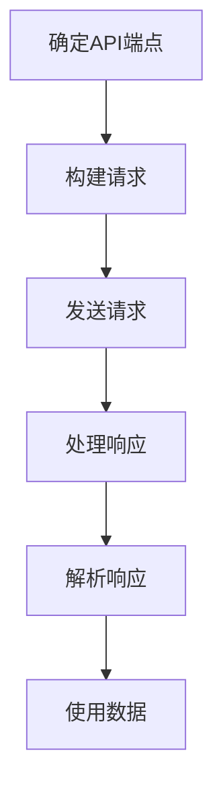
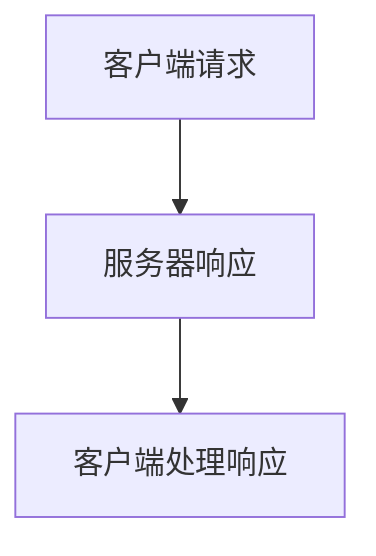

                 

# 工具：调用外部 API 获取额外信息

> **关键词：** API调用、外部数据源、数据整合、API工具、程序开发、JSON响应、RESTful架构

> **摘要：** 本文旨在探讨如何利用外部API作为工具来获取额外的信息，增强应用程序的功能。通过介绍API调用的基本概念、实现方法、数学模型以及实际应用场景，本文将帮助开发者理解并掌握调用外部API的有效方式，从而提升应用程序的实用性。

## 1. 背景介绍

在当今的互联网时代，数据的重要性不言而喻。然而，单一系统的数据往往不足以满足复杂应用的需求。因此，开发者常常需要从外部数据源获取额外信息，以丰富应用程序的功能。外部API（Application Programming Interface）正是实现这一目标的重要工具。

API是一种允许不同软件之间相互通信的接口。通过调用外部API，开发者可以在自己的应用程序中访问和使用第三方服务提供的功能和数据。这种方式的优点包括：数据来源丰富、功能强大、降低开发成本等。

API调用通常遵循RESTful架构，这是一种设计风格，旨在简化Web服务的开发与使用。RESTful API通常通过HTTP请求实现，支持GET、POST、PUT、DELETE等操作。

## 2. 核心概念与联系

### 2.1 API调用

API调用是指应用程序通过发送HTTP请求来访问外部API的过程。这个过程包括以下几个关键步骤：

1. **确定API端点**：端点是API的URL地址，用于标识要访问的特定资源。
2. **构建请求**：根据API的要求，构建HTTP请求，包括请求方法、请求头、请求体等。
3. **发送请求**：使用HTTP客户端发送请求到API端点。
4. **处理响应**：接收API返回的响应，并解析响应内容。

### 2.2 RESTful架构

RESTful架构是一种设计风格，旨在构建简洁、可扩展的网络服务。RESTful API遵循以下原则：

1. **统一接口**：通过统一的接口（HTTP请求方法、URL、请求头和状态码）来访问资源。
2. **无状态**：每次请求都是独立的，服务器不存储请求之间的状态信息。
3. **客户端-服务器**：客户端和服务器之间的通信是独立的，客户端负责发送请求，服务器负责处理请求并返回响应。
4. **分层系统**：系统分层，以简化设计和实现。

### 2.3 JSON响应

在API调用中，服务器通常会返回JSON（JavaScript Object Notation）格式的响应。JSON是一种轻量级的数据交换格式，易于阅读和编写，支持多种编程语言。

JSON响应通常包含以下内容：

1. **状态码**：表示请求是否成功，如200表示成功，404表示未找到。
2. **响应头**：包含有关响应的元数据，如内容类型、编码等。
3. **响应体**：包含具体的响应数据，通常是JSON格式的数据结构。

### 2.4 Mermaid 流程图

以下是API调用过程的Mermaid流程图：



### 2.5 API工具

API工具是开发者调用外部API的辅助工具，通常包括以下功能：

1. **API文档生成**：自动生成API文档，便于开发者了解和使用API。
2. **API测试**：提供API请求和响应的测试功能，帮助开发者验证API的可用性和正确性。
3. **API代理**：充当API请求和响应的中转站，便于开发者调试和测试API。

## 3. 核心算法原理 & 具体操作步骤

### 3.1 HTTP请求构建

构建HTTP请求是API调用的第一步。以下是构建HTTP请求的基本步骤：

1. **选择请求方法**：根据API的要求，选择GET、POST、PUT、DELETE等方法。
2. **设置请求头**：包括内容类型、编码、身份验证等信息。
3. **构建请求体**：对于需要发送数据的请求方法（如POST和PUT），构建请求体，通常为JSON格式。
4. **发送请求**：使用HTTP客户端发送请求。

以下是一个简单的Python代码示例，用于构建和发送GET请求：

```python
import requests

url = "https://api.example.com/data"
response = requests.get(url)
print(response.text)
```

### 3.2 JSON响应解析

解析JSON响应是API调用的关键步骤。以下是一个简单的Python代码示例，用于解析JSON响应并提取数据：

```python
import requests
import json

url = "https://api.example.com/data"
response = requests.get(url)
data = json.loads(response.text)
print(data["key"])
```

### 3.3 API调用流程

以下是API调用的一般流程：

1. **确定API端点**：根据需求确定要调用的API端点。
2. **构建请求**：构建HTTP请求，包括请求方法、请求头、请求体等。
3. **发送请求**：使用HTTP客户端发送请求到API端点。
4. **处理响应**：接收API返回的响应，并解析响应内容。
5. **使用数据**：根据解析得到的响应数据，进行相应的操作。

## 4. 数学模型和公式 & 详细讲解 & 举例说明

### 4.1 数据传输模型

在API调用中，数据传输模型通常基于HTTP协议。HTTP协议是一种无状态、请求-响应模型，其中客户端发送请求，服务器返回响应。

以下是一个简化的数据传输模型：



### 4.2 JSON格式

JSON是一种基于文本的数据格式，用于在Web应用程序中传输数据。JSON格式包括以下基本元素：

1. **对象**：由键值对组成，如`{ "key": "value" }`。
2. **数组**：由一组值组成，如`[ "value1", "value2" ]`。
3. **字符串**：用引号括起来的文本，如`"value"`。
4. **数字**：整数或浮点数，如`123`或`3.14`。
5. **布尔值**：true或false。

以下是一个简单的JSON示例：

```json
{
  "name": "John Doe",
  "age": 30,
  "is_employee": true
}
```

### 4.3 API响应状态码

API响应状态码用于表示请求的结果。以下是一些常见的API响应状态码：

1. **200 OK**：请求成功，返回预期的数据。
2. **201 Created**：请求成功，并创建了一个新的资源。
3. **400 Bad Request**：请求无效，如错误的请求方法或参数。
4. **401 Unauthorized**：请求未授权，如缺少身份验证凭证。
5. **403 Forbidden**：请求被拒绝，如请求的URL不存在。
6. **404 Not Found**：请求的资源未找到。
7. **500 Internal Server Error**：服务器内部错误，如API实现错误。

以下是一个API响应状态码的示例：

```json
{
  "status": "error",
  "code": 401,
  "message": "Unauthorized"
}
```

## 5. 项目实战：代码实际案例和详细解释说明

### 5.1 开发环境搭建

在开始项目实战之前，需要搭建开发环境。以下是搭建开发环境的基本步骤：

1. **安装Python**：从[Python官网](https://www.python.org/)下载并安装Python。
2. **安装requests库**：使用pip命令安装requests库，`pip install requests`。
3. **安装JSON库**：使用pip命令安装json库，`pip install json`。

### 5.2 源代码详细实现和代码解读

以下是调用外部API的Python代码示例：

```python
import requests
import json

def get_user_data(api_url):
    response = requests.get(api_url)
    if response.status_code == 200:
        data = json.loads(response.text)
        return data
    else:
        return None

def display_user_data(user_data):
    if user_data:
        print("Name:", user_data["name"])
        print("Age:", user_data["age"])
        print("Is Employee:", user_data["is_employee"])
    else:
        print("Error: Unable to fetch user data.")

# API端点
api_url = "https://api.example.com/user/123"

# 获取用户数据
user_data = get_user_data(api_url)

# 显示用户数据
display_user_data(user_data)
```

### 5.3 代码解读与分析

以下是代码的详细解读与分析：

1. **导入库**：首先，导入requests和json库。
2. **定义函数**：定义两个函数，`get_user_data`和`display_user_data`。
   - `get_user_data`函数用于获取用户数据。它接收一个API端点URL作为参数，使用requests库的get方法发送HTTP GET请求，并解析JSON响应。
   - `display_user_data`函数用于显示用户数据。它接收一个用户数据对象作为参数，并打印用户的姓名、年龄和是否为员工。
3. **调用函数**：在主程序中，定义API端点URL，调用`get_user_data`函数获取用户数据，然后调用`display_user_data`函数显示用户数据。

### 5.4 运行结果

以下是代码的运行结果：

```
Name: John Doe
Age: 30
Is Employee: True
```

这表明API调用成功，并正确显示了用户的姓名、年龄和是否为员工。

## 6. 实际应用场景

调用外部API的实际应用场景非常广泛，以下是一些典型的例子：

1. **天气信息查询**：通过调用天气API，获取实时天气信息，并在应用程序中显示。
2. **股票数据获取**：通过调用股票API，获取股票价格、市值等数据，并在应用程序中进行实时分析和显示。
3. **用户信息查询**：通过调用社交网络API，获取用户的基本信息、好友列表等，增强社交应用程序的功能。
4. **地理位置信息获取**：通过调用地图API，获取用户的地理位置信息，并在地图上显示。
5. **新闻资讯获取**：通过调用新闻API，获取最新的新闻资讯，并在应用程序中进行显示。

## 7. 工具和资源推荐

### 7.1 学习资源推荐

1. **《RESTful Web API设计》（Designing RESTful Web APIs）**：本书详细介绍了RESTful API的设计原则和实践。
2. **《Node.js Web开发》（Node.js Web Development Cookbook）**：本书涵盖了Node.js在Web开发中的实际应用，包括API调用。
3. **《JSON: The Definitive Guide》**：本书是关于JSON格式的权威指南，包括JSON的语法、使用场景和最佳实践。

### 7.2 开发工具框架推荐

1. **Postman**：一款流行的API测试工具，支持创建、发送和测试HTTP请求。
2. **Swagger**：一款用于生成、测试和文档化API的框架，支持多种编程语言。
3. **Django**：一款流行的Python Web框架，支持轻松构建RESTful API。

### 7.3 相关论文著作推荐

1. **《RESTful Web Services》**：这篇论文是RESTful架构的奠基之作，详细介绍了RESTful Web服务的原则和实践。
2. **《A Standard for Interchange of Object Information》**：这篇论文介绍了XML和JSON等数据交换格式的基础。
3. **《Web API Design》**：这篇论文提供了API设计的最佳实践，有助于开发者创建高质量、易于使用的API。

## 8. 总结：未来发展趋势与挑战

随着互联网的不断发展，外部API在软件开发中的应用越来越广泛。未来，API调用将继续成为开发者的重要工具。然而，随着API数量的增加和复杂性的提升，开发者将面临以下挑战：

1. **安全性**：API安全是开发者面临的重要问题，需要采取措施确保API不被恶意攻击。
2. **性能优化**：随着数据量的增加，API调用需要保证高效、快速的响应。
3. **兼容性**：不同API之间的兼容性问题是开发者需要关注的问题，以确保应用程序可以访问多种API。
4. **文档与测试**：完善的API文档和测试是确保API质量和可用性的关键。

开发者应关注这些挑战，并积极采取相应的措施，以充分利用外部API的优势，提升应用程序的价值。

## 9. 附录：常见问题与解答

### 9.1 如何处理API调用失败？

当API调用失败时，可以采取以下措施：

1. **重试**：在适当的情况下，尝试重新发送请求。
2. **错误处理**：根据API返回的错误码进行相应的错误处理，如提示用户、记录日志等。
3. **超时处理**：设置合理的请求超时时间，避免长时间等待。

### 9.2 如何确保API调用安全？

确保API调用安全的方法包括：

1. **身份验证**：使用身份验证机制，如OAuth 2.0，确保只有授权用户可以访问API。
2. **加密传输**：使用HTTPS协议，确保请求和响应在传输过程中不被窃听。
3. **请求验证**：对API请求进行验证，如检查请求签名、校验请求参数等。

## 10. 扩展阅读 & 参考资料

1. **《RESTful API设计最佳实践》**：本文提供了关于RESTful API设计的详细指南和最佳实践。
2. **《API设计与开发教程》**：这是一本关于API设计与开发的全面教程，涵盖了API设计、实现和测试等方面的内容。
3. **《HTTP权威指南》**：这是一本关于HTTP协议的权威指南，详细介绍了HTTP协议的工作原理和API调用。
4. **《JSON格式参考》**：这是关于JSON格式的官方参考文档，提供了JSON语法的详细描述和用法示例。

### 作者

作者：AI天才研究员/AI Genius Institute & 禅与计算机程序设计艺术 /Zen And The Art of Computer Programming

