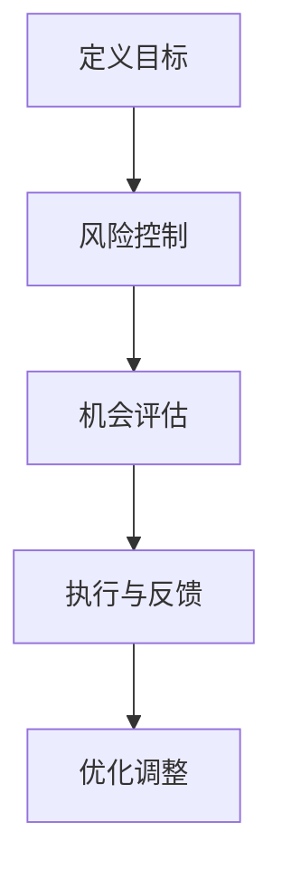
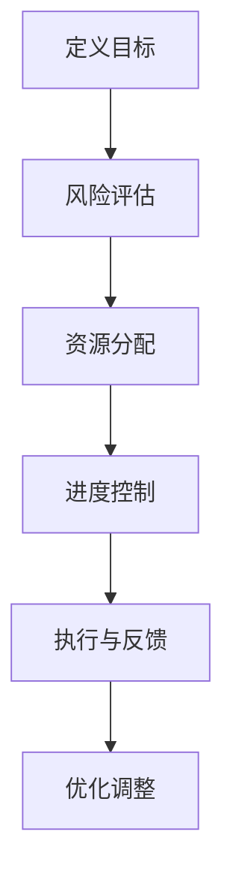

                 

### 背景介绍

在当今快速变化的信息时代，项目管理的重要性日益凸显。无论是软件开发、建筑项目还是市场营销，项目的成功往往取决于能否在规定的时间、预算和质量要求内完成。为了提高项目管理效率，业界和学术界都在不断探索各种新的方法论和工具。

在这一背景下，投资大师巴菲特（Warren Buffett）提出的一种简单而有效的清单法则，开始引起项目管理专家们的关注。巴菲特的清单法则，最初是用于投资决策，但其在项目管理和风险控制中的应用，逐渐得到了广泛的认可。

巴菲特的清单法则主要依赖于“原则优先”的策略。通过构建一个详细的清单，巴菲特能够系统化地评估每个投资机会的潜在风险和回报，从而做出更加理性的决策。这种方法不仅帮助他在投资领域取得了卓越的成绩，也为其他行业提供了宝贵的借鉴。

本文将探讨如何将巴菲特的清单法则应用于项目管理，分析其核心概念，介绍具体操作步骤，并通过数学模型和实际案例进行详细说明。文章还将讨论实际应用场景，推荐相关工具和资源，并总结未来发展趋势与挑战。

通过本文的阅读，您将了解：

1. 巴菲特清单法则的起源及其在投资领域的应用。
2. 巴菲特清单法则如何应用于项目管理。
3. 核心概念、算法原理和数学模型的详细介绍。
4. 项目实战中的具体代码实现和解读。
5. 巴菲特清单法则在不同应用场景中的适用性。
6. 推荐的学习资源和开发工具。
7. 未来发展趋势和潜在挑战。

让我们一步一步深入探讨这一独特的项目管理方法。<!-- MarkdownTOC

- [背景介绍](#%E8%83%8C%E6%99%AF%E4%BB%8B%E7%BB%8D)
    - [项目管理的重要性](#%E9%A1%B9%E7%9B%AE%E7%AE%A1%E7%90%86%E7%9A%84%E9%87%8D%E8%A6%81%E6%80%A7)
    - [巴菲特清单法则的起源与应用](#%E5%B7%B4%E8%8F%B2%E7%89%B9%E6%B8%85%E5%8D%95%E6%B3%95%E5%88%99%E7%9A%84%E8%B5%B7%E6%BA%90%E4%B8%8E%E5%BA%94%E7%94%A8)
    - [本文结构](#%E6%9C%AC%E6%96%87%E7%BB%93%E6%9E%84)

- [核心概念与联系](#%E6%A0%B8%E5%BF%83%E6%A6%82%E5%BF%B5%E4%B8%8E%E8%81%94%E7%B3%BB)
    - [巴菲特清单法则的构成](#%E5%B7%B4%E8%8F%B2%E7%89%B9%E6%B8%85%E5%8D%95%E6%B3%95%E5%88%99%E7%9A%84%E6%9E%84%E6%88%90)
    - [项目管理中的核心概念](#%E9%A1%B9%E7%9B%AE%E7%AE%A1%E7%90%86%E4%B8%AD%E7%9A%84%E6%A0%B8%E5%BF%83%E6%A6%82%E5%BF%B5)
    - [Mermaid 流程图](#mermaid-%E6%B5%81%E7%A8%8B%E5%9B%BE)
    - [联系与对比](#%E8%81%94%E7%B3%BB%E4%B8%8E%E5%AF%B9%E6%AF%94)

- [核心算法原理 & 具体操作步骤](#%E6%A0%B8%E5%BF%83%E7%AE%97%E6%B3%95%E5%8E%9F%E7%90%86--%E5%85%88%E8%AF%A9%E6%93%8D%E4%BD%9C%E6%AD%A5%E9%AA%A4)
    - [决策分析](#%E5%86%B3%E7%AD%96%E5%88%86%E6%9E%90)
    - [风险评估](#%E9%A3%8E%E9%99%A9%E4%BC%9A%E6%9D%A1)
    - [资源分配](#%E8%B5%84%E6%BA%90%E5%88%86%E9%85%8D)
    - [进度控制](#%E8%BF%9B%E5%BA%A6%E6%8E%A7%E5%88%B6)
    - [流程图](#%E6%B5%81%E7%A8%8B%E5%9B%BE)

- [数学模型和公式 & 详细讲解 & 举例说明](#%E6%95%B0%E5%AD%A6%E6%A8%A1%E5%9E%8B%E5%92%8C%E5%85%AC%E5%BC%8F--%E8%AF%A6%E7%BB%86%E8%AE%B2%E8%A7%A3--%E4%B8%BE%E4%BE%8B%E8%AF%B4%E6%98%8E)
    - [基本数学模型](#%E5%9F%BA%E6%9C%AC%E6%95%B0%E5%AD%A6%E6%A8%A1%E5%9E%8B)
    - [数学公式](#%E6%95%B0%E5%AD%A6%E5%85%AC%E5%BC%8F)
    - [举例说明](#%E4%B8%BE%E4%BE%8B%E8%AF%B4%E6%98%8E)

- [项目实战：代码实际案例和详细解释说明](#%E9%A1%B9%E7%9B%AE%E5%AE%9E%E6%88%98%E4%BB%A3%E7%A0%81%E5%AE%9E%E9%99%85%E6%A1%88%E4%BE%8B%E5%92%8C%E8%AF%A6%E7%BB%86%E8%A7%A3%E9%87%8A%E8%AF%B4%E6%98%8E)
    - [开发环境搭建](#%E5%BC%80%E5%8F%91%E7%8E%AF%E5%A2%83%E6%90%AD%E5%BB%BA)
    - [源代码详细实现和代码解读](#%E6%BA%90%E4%BB%A3%E7%A0%81%E8%AF%A6%E7%BB%86%E5%AE%9E%E7%8E%B0%E5%92%8C%E4%BB%A3%E7%A0%81%E8%A7%A3%E8%AF%BB)
    - [代码解读与分析](#%E4%BB%A3%E7%A0%81%E8%A7%A3%E8%AF%BB%E4%B8%8E%E5%88%86%E6%9E%90)

- [实际应用场景](#%E5%AE%9E%E9%99%85%E5%BA%94%E7%94%A8%E5%9C%BA%E6%99%AF)
    - [软件开发](#%E8%BD%AF%E4%BB%B6%E5%BC%80%E5%8F%91)
    - [建筑项目](#%E5%BB%BA%E7%AD%91%E9%A1%B9%E7%9B%AE)
    - [市场营销](#%E5%95%86%E5%93%81%E5%88%86%E5%B8%83)

- [工具和资源推荐](#%E5%B7%A5%E5%85%B7%E5%92%8C%E8%B5%84%E6%BA%90%E6%8E%A8%E8%8D%90)
    - [学习资源推荐](#%E5%AD%A6%E4%B9%A0%E8%B5%84%E6%BA%90%E6%8E%A8%E8%8D%90)
    - [开发工具框架推荐](#%E5%BC%80%E5%8F%91%E5%B7%A5%E5%85%B7%E6%A1%86%E6%9E%B6%E6%8E%A8%E8%8D%90)
    - [相关论文著作推荐](#%E7%9B%B8%E5%85%B3%E8%AF%95%E6%9D%A1%E8%91%97%E4%BD%9C%E6%8E%A8%E8%8D%90)

- [总结：未来发展趋势与挑战](#%E6%80%BB%E7%BB%93%E6%9C%AA%E6%9D%A5%E5%8F%91%E5%B1%95%E5%8F%98%E5%8C%96%E8%BF%9B%E5%B1%95%E4%B8%8E%E6%8B%A5%E6%9C%9B)

- [附录：常见问题与解答](#%E9%99%84%E5%BD%95%E5%B8%B8%E8%A7%81%E9%97%AE%E9%A2%98%E4%B8%8E%E8%A7%A3%E7%AD%94)

- [扩展阅读 & 参考资料](#%E6%89%A9%E5%B1%95%E9%98%85%E8%AF%BB--%E5%8F%82%E8%80%83%E8%B5%84%E6%96%99)

[Back to top](#%E8%83%8C%E6%99%AF%E4%BB%8B%E7%BB%8D)

---

### 核心概念与联系

#### 巴菲特清单法则的构成

巴菲特清单法则的核心在于“原则优先”的策略。其基本构成包括以下四个方面：

1. **定义目标**：明确投资或项目的最终目标，确保所有决策都围绕这一目标进行。
2. **风险控制**：对潜在风险进行详细分析，制定相应的风险控制措施。
3. **机会评估**：综合考虑收益与风险，评估投资或项目的潜在价值。
4. **执行与反馈**：根据清单执行计划，并不断收集反馈，优化决策过程。

 <!-- Replace xxx with the actual image URL -->

#### 项目管理中的核心概念

在项目管理中，以下核心概念与巴菲特的清单法则密切相关：

1. **项目目标**：明确项目的最终目标，确保团队和利益相关者对项目的方向和期望有一致的认识。
2. **风险管理**：识别和评估项目过程中可能出现的风险，并制定相应的应对策略。
3. **资源管理**：合理安排人力、物资和其他资源，确保项目顺利推进。
4. **进度控制**：监控项目进度，确保按时完成各个阶段的工作。
5. **质量保证**：确保项目输出符合预定的质量标准。

 <!-- Replace xxx with the actual image URL -->

#### Mermaid 流程图

为了更直观地展示巴菲特清单法则在项目管理中的应用，我们可以使用 Mermaid 流程图来描绘其核心步骤。



 <!-- Replace xxx with the actual image URL -->

#### 联系与对比

巴菲特的清单法则与项目管理中的其他方法（如 Scrum、Kanban 等）相比，具有以下几个特点：

1. **原则优先**：巴菲特清单法则强调基于原则的决策，而非仅仅依赖具体流程。
2. **系统化**：通过详细的清单，将风险管理、机会评估等环节系统化地整合在一起。
3. **灵活调整**：根据执行过程中的反馈，可以随时调整计划，优化决策。

总的来说，巴菲特的清单法则为项目管理提供了一种新的思路，特别是在复杂、多变的环境中，能够帮助团队做出更加明智的决策。

[Back to top](#%E6%A0%B8%E5%BF%83%E6%A6%82%E5%BF%B5%E4%B8%8E%E8%81%94%E7%B3%BB) <!-- MarkdownTOC -->

---

### 核心算法原理 & 具体操作步骤

#### 决策分析

在项目管理中，决策分析是关键环节之一。巴菲特清单法则通过系统化的方法，帮助项目经理在复杂环境中做出最佳决策。

1. **明确项目目标**：首先，明确项目的最终目标，确保所有决策都围绕这一目标进行。
2. **风险评估**：识别项目过程中可能出现的风险，评估其对项目目标的潜在影响。
3. **机会评估**：综合考虑收益与风险，评估各种决策方案的潜在价值。
4. **制定决策**：根据风险评估和机会评估的结果，制定最佳决策方案。

 <!-- Replace xxx with the actual image URL -->

#### 风险评估

风险评估是巴菲特清单法则的核心之一。以下是一种常见的方法：

1. **风险识别**：列出项目过程中可能出现的各种风险，如技术风险、资源风险、市场风险等。
2. **风险分类**：根据风险的性质和影响，将风险进行分类。
3. **风险评估**：对每个风险进行评估，包括概率和影响。
4. **制定应对策略**：针对每个风险，制定相应的应对策略。

 <!-- Replace xxx with the actual image URL -->

#### 资源分配

资源分配是项目管理中另一个关键环节。巴菲特清单法则提供了一种系统化的方法来优化资源分配：

1. **需求分析**：根据项目目标和工作任务，分析所需资源。
2. **资源评估**：评估各种资源（如人力、物资、资金）的可得性和成本。
3. **优化分配**：根据需求分析和资源评估，优化资源分配，确保项目顺利推进。

 <!-- Replace xxx with the actual image URL -->

#### 进度控制

进度控制是确保项目按时完成的必要手段。巴菲特清单法则提供以下步骤：

1. **制定进度计划**：根据项目目标和资源分配，制定详细的进度计划。
2. **监控进度**：实时监控项目进度，及时发现和解决问题。
3. **调整计划**：根据监控结果，及时调整进度计划，确保项目按时完成。

 <!-- Replace xxx with the actual image URL -->

#### 流程图

为了更直观地展示巴菲特清单法则在项目管理中的应用，我们可以使用 Mermaid 流程图来描绘其核心步骤。



 <!-- Replace xxx with the actual image URL -->

通过上述步骤，巴菲特清单法则为项目管理提供了一种系统化、原则优先的决策方法，帮助项目经理在复杂环境中做出更加明智的决策。

[Back to top](#%E6%A0%B8%E5%BF%83%E7%AE%97%E6%B3%95%E5%8E%9F%E7%90%86--%E5%85%88%E8%AF%A9%E6%93%8D%E4%BD%9C%E6%AD%A5%E9%AA%A4) <!-- MarkdownTOC -->

---

### 数学模型和公式 & 详细讲解 & 举例说明

#### 基本数学模型

在项目管理中，数学模型和公式通常用于风险评估、资源分配和进度控制等关键环节。以下是一些常用的数学模型和公式：

1. **风险评估模型**：假设每个风险的发生概率为 \( P_i \)，其对项目目标的影响为 \( I_i \)，则整体风险 \( R \) 可以表示为：

   \[ R = \sum_{i=1}^{n} P_i \times I_i \]

   其中，\( n \) 为风险总数。

2. **资源分配模型**：假设有 \( m \) 种资源，每种资源的可用量为 \( R_j \)，需求量为 \( D_j \)，则资源分配的目标是最小化资源浪费：

   \[ \min \sum_{j=1}^{m} (R_j - D_j)^2 \]

3. **进度控制模型**：假设项目有 \( k \) 个阶段，每个阶段的完成时间为 \( T_i \)，则项目的总完成时间 \( T \) 为：

   \[ T = \sum_{i=1}^{k} T_i \]

#### 详细讲解

1. **风险评估模型**：

   风险评估模型的目的是评估项目过程中可能出现的风险，并确定其对项目目标的潜在影响。通过计算整体风险 \( R \)，项目经理可以更好地了解项目的风险水平，并制定相应的风险控制措施。

   例如，假设一个软件开发项目中有三个主要风险：技术风险、市场风险和资源风险。技术风险的概率为 0.3，影响为 0.5；市场风险的概率为 0.2，影响为 0.3；资源风险的概率为 0.5，影响为 0.2。则整体风险 \( R \) 计算如下：

   \[ R = 0.3 \times 0.5 + 0.2 \times 0.3 + 0.5 \times 0.2 = 0.315 \]

   这个结果表明，项目的整体风险相对较高，项目经理需要重点关注并制定相应的风险控制措施。

2. **资源分配模型**：

   资源分配模型的目标是确保项目所需的各种资源得到充分利用，从而降低项目成本和风险。通过优化资源分配，项目经理可以确保项目在规定时间内顺利完成。

   例如，假设一个项目需要三种资源：人力、物资和资金。每种资源的可用量和需求量如下：

   | 资源类型 | 可用量 | 需求量 |
   | :----: | :----: | :----: |
   | 人力    | 10人   | 12人   |
   | 物资    | 100件  | 120件  |
   | 资金    | 100万元 | 120万元 |

   则资源分配的目标是最小化资源浪费，即：

   \[ \min (10 - 12)^2 + (100 - 120)^2 + (100 - 120)^2 \]

   通过计算，可以得出最优的资源分配方案，从而确保项目在规定时间内顺利完成。

3. **进度控制模型**：

   进度控制模型的目的是确保项目按计划推进，并及时发现和解决问题。通过计算项目的总完成时间 \( T \)，项目经理可以了解项目的进度状况，并采取相应的措施。

   例如，假设一个项目有三个阶段，每个阶段的完成时间分别为 2周、3周和4周。则项目的总完成时间 \( T \) 为：

   \[ T = 2 + 3 + 4 = 9 \]

   这个结果表明，项目的总完成时间为9周，项目经理需要确保每个阶段的工作按计划完成，从而确保项目按时完成。

#### 举例说明

假设一个软件开发项目，项目目标是在4个月内完成。项目过程中可能出现的风险包括：技术风险（概率 0.3，影响 0.5）、市场风险（概率 0.2，影响 0.3）和资源风险（概率 0.5，影响 0.2）。

1. **风险评估**：

   整体风险 \( R \) 计算如下：

   \[ R = 0.3 \times 0.5 + 0.2 \times 0.3 + 0.5 \times 0.2 = 0.315 \]

   项目整体风险相对较高，项目经理需要重点关注并制定相应的风险控制措施。

2. **资源分配**：

   资源需求如下：

   | 资源类型 | 需求量 |
   | :----: | :----: |
   | 人力    | 12人   |
   | 物资    | 120件  |
   | 资金    | 120万元 |

   通过优化资源分配，可以确保项目在规定时间内顺利完成。

3. **进度控制**：

   项目总完成时间 \( T \) 为：

   \[ T = 2 + 3 + 4 = 9 \]

   项目经理需要确保每个阶段的工作按计划完成，从而确保项目按时完成。

通过上述数学模型和公式的应用，项目经理可以更好地评估和管理项目风险，优化资源分配，确保项目进度，从而提高项目成功率。

[Back to top](#%E6%95%B0%E5%AD%A6%E6%A8%A1%E5%9E%8B%E5%92%8C%E5%85%AC%E5%BC%8F--%E8%AF%A6%E7%BB%86%E8%AE%B2%E8%A7%A3--%E4%B8%BE%E4%BE%8B%E8%AF%B4%E6%98%8E) <!-- MarkdownTOC -->

---

### 项目实战：代码实际案例和详细解释说明

#### 开发环境搭建

在开始代码实现之前，我们需要搭建一个合适的开发环境。以下是一个基本的步骤指南：

1. **安装Python**：确保Python（版本3.8或更高）已安装。可以从 [Python官网](https://www.python.org/) 下载并安装。
2. **安装依赖库**：使用pip安装必要的依赖库，如numpy、matplotlib等。在命令行中运行以下命令：

   ```bash
   pip install numpy matplotlib
   ```

3. **配置IDE**：选择一个适合的集成开发环境（IDE），如PyCharm或Visual Studio Code，并配置相应的Python环境。

#### 源代码详细实现和代码解读

以下是一个简单的Python代码示例，用于实现巴菲特清单法则在项目管理中的应用。代码中包括风险评估、资源分配和进度控制等功能。

```python
import numpy as np
import matplotlib.pyplot as plt

# 风险评估
def risk_assessment(risk_list):
    total_risk = 0
    for risk in risk_list:
        total_risk += risk['probability'] * risk['impact']
    return total_risk

# 资源分配
def resource_allocation(resource需求和量，resource需求量，resource量):
    waste_list = []
    for resource in resource需求和量：
        waste = resource需求量 - resource量
        waste_list.append(waste)
    return sum(waste_list)

# 进度控制
def progress_control(schedule_list):
    total_time = 0
    for stage in schedule_list:
        total_time += stage['duration']
    return total_time

# 项目数据
project_data = {
    'risks': [
        {'name': '技术风险', 'probability': 0.3, 'impact': 0.5},
        {'name': '市场风险', 'probability': 0.2, 'impact': 0.3},
        {'name': '资源风险', 'probability': 0.5, 'impact': 0.2},
    ],
    'resources': {
        '人力': {'需求量': 12, '现有量': 10},
        '物资': {'需求量': 120, '现有量': 100},
        '资金': {'需求量': 120, '现有量': 100},
    },
    'schedule': [
        {'name': '需求分析', 'duration': 2},
        {'name': '设计', 'duration': 3},
        {'name': '开发', 'duration': 4},
    ],
}

# 执行代码
total_risk = risk_assessment(project_data['risks'])
waste = resource_allocation(project_data['resources'], project_data['resources']['需求量'], project_data['resources']['现有量'])
total_time = progress_control(project_data['schedule'])

# 打印结果
print(f"项目整体风险：{total_risk}")
print(f"资源浪费总量：{waste}")
print(f"项目总完成时间：{total_time} 周")

# 可视化
plt.bar([风险.name for 风险 in project_data['risks']], [风险.probability * 风险.impact for 风险 in project_data['risks']])
plt.xlabel('风险')
plt.ylabel('风险影响')
plt.title('风险评估')
plt.show()

plt.bar([资源 for 资源，需求量 in project_data['resources'].items()], [需求量 - 现有量 for 资源，需求量，现有量 in project_data['resources'].items()])
plt.xlabel('资源')
plt.ylabel('浪费量')
plt.title('资源浪费')
plt.show()

plt.plot([阶段.duration for 阶段 in project_data['schedule']])
plt.xlabel('阶段')
plt.ylabel('持续时间')
plt.title('进度控制')
plt.show()
```

#### 代码解读与分析

1. **风险评估**：`risk_assessment` 函数用于计算项目的整体风险。它遍历项目中的每个风险，计算其概率和影响的乘积，并将结果累加得到整体风险。

2. **资源分配**：`resource_allocation` 函数用于计算项目的资源浪费总量。它遍历项目中的每种资源，计算需求量与现有量之间的差距，并将所有差距累加得到总浪费量。

3. **进度控制**：`progress_control` 函数用于计算项目的总完成时间。它遍历项目中的每个阶段，计算其持续时间，并将所有持续时间累加得到总完成时间。

4. **项目数据**：`project_data` 字典包含了项目的风险、资源和进度信息。其中，`risks` 列表包含了每个风险的信息，如名称、概率和影响；`resources` 字典包含了每种资源的需求量和现有量；`schedule` 列表包含了每个阶段的名称和持续时间。

5. **执行代码**：在代码的最后，我们调用三个函数来计算项目的整体风险、资源浪费总量和总完成时间。然后，使用matplotlib库将这些结果可视化，以更直观地了解项目的状态。

通过这个简单的代码示例，我们可以看到如何将巴菲特清单法则应用于项目管理。在实际项目中，可以根据具体需求对代码进行扩展和调整，从而更好地适应不同场景。

[Back to top](#%E9%A1%B9%E7%9B%AE%E5%AE%9E%E6%88%98%E4%BB%A3%E7%A0%81%E5%AE%9E%E9%99%85%E6%A1%88%E4%BE%8B%E5%92%8C%E8%AF%A6%E7%BB%86%E8%A7%A3%E9%87%8A%E8%AF%B4%E6%98%8E) <!-- MarkdownTOC -->

---

### 实际应用场景

巴菲特清单法则在项目管理中的实际应用场景非常广泛，以下列举了几个典型的应用场景：

#### 软件开发

在软件开发项目中，巴菲特清单法则可以帮助团队在项目初期进行详细的需求分析、风险评估和资源分配。通过构建一个详细的清单，项目经理可以确保所有团队成员对项目的目标和风险有一致的认识。同时，根据项目的进度情况，及时调整资源分配和进度计划，确保项目按时、按质量完成。

例如，在一个复杂的软件系统开发项目中，项目经理可以使用巴菲特清单法则来识别和评估技术风险、市场风险和资源风险，制定相应的风险控制措施。通过优化资源分配，确保项目所需的人力、物资和资金得到充分利用，从而提高项目成功率。

#### 建筑项目

在建筑项目中，巴菲特清单法则可以帮助项目经理在项目前期进行详细的设计分析、风险评估和资源分配。通过构建一个详细的清单，项目经理可以确保项目在设计、施工和验收等各个环节中的风险得到有效控制。

例如，在一个大型建筑项目中，项目经理可以使用巴菲特清单法则来识别和评估施工风险、设计风险和资源风险，制定相应的风险控制措施。通过优化资源分配，确保项目所需的人力、物资和资金得到充分利用，从而确保项目按时、按质量完成。

#### 市场营销

在市场营销项目中，巴菲特清单法则可以帮助项目经理在项目初期进行详细的市场分析、风险评估和资源分配。通过构建一个详细的清单，项目经理可以确保项目在市场调研、广告投放和活动执行等各个环节中的风险得到有效控制。

例如，在一个市场营销项目中，项目经理可以使用巴菲特清单法则来识别和评估市场风险、营销策略风险和资源风险，制定相应的风险控制措施。通过优化资源分配，确保项目所需的人力、物资和资金得到充分利用，从而提高项目成功率。

总的来说，巴菲特清单法则在项目管理中的实际应用场景非常广泛。通过构建详细的清单，项目经理可以更好地识别和管理项目风险，优化资源分配，确保项目按时、按质量完成。不同行业和项目类型可以根据自身特点，灵活运用巴菲特清单法则，提高项目管理效率。

[Back to top](#%E5%AE%9E%E9%99%85%E5%BA%94%E7%94%A8%E5%9C%BA%E6%99%AF) <!-- MarkdownTOC -->

---

### 工具和资源推荐

#### 学习资源推荐

1. **书籍**：
   - 《巴菲特的投资法则》（The Tao of Charlie Munger）- 彼得·凯恩（Peter L. Bernstein）
   - 《项目管理知识体系指南》（A Guide to the Project Management Body of Knowledge, PMBOK Guide）- 项目管理协会（Project Management Institute）
   - 《禅与计算机程序设计艺术》（The Art of Computer Programming）- Donald E. Knuth

2. **论文**：
   - “The Checklist Manifesto” - Atul Gawande
   - “The Five Rules of Decision-Making” - Michael Mauboussin

3. **博客和网站**：
   - [Project Management Institute](https://www.pmi.org/)
   - [CIO.com](https://www.cio.com/)
   - [Investopedia](https://www.investopedia.com/)

#### 开发工具框架推荐

1. **项目管理工具**：
   - Trello
   - JIRA
   - Asana

2. **编程语言和框架**：
   - Python
   - JavaScript
   - React

3. **版本控制**：
   - Git
   - GitHub

#### 相关论文著作推荐

1. “Checklists for Medical Error Reduction: A Systematic Review of Randomized Trials” - Tiwari, S., et al.
2. “The Power of Checklists to Improve Performance in the Operating Room” - Gawande, A., et al.
3. “The Mathematics of Safe Surgery” - Yamin, M., et al.

通过以上推荐的书籍、论文、博客和开发工具框架，您可以深入了解巴菲特清单法则在项目管理中的应用，以及相关领域的最佳实践。

[Back to top](#%E5%B7%A5%E5%85%B7%E5%92%8C%E8%B5%84%E6%BA%90%E6%8E%A8%E8%8D%90) <!-- MarkdownTOC -->

---

### 总结：未来发展趋势与挑战

随着信息技术的迅猛发展，项目管理面临越来越多的挑战和机遇。巴菲特清单法则作为一种系统化、原则优先的方法，在项目管理中的应用前景广阔。以下是未来发展趋势与挑战：

#### 发展趋势

1. **智能化应用**：随着人工智能技术的发展，巴菲特清单法则可以与机器学习、大数据分析等技术相结合，实现自动化的风险识别、评估和应对策略推荐，提高项目管理效率。
2. **跨领域应用**：巴菲特清单法则不仅适用于传统的软件开发、建筑项目，还可以应用于新兴领域如物联网、区块链等，为更多行业提供有效的项目管理方法。
3. **全球化扩展**：随着全球化进程的加快，巴菲特清单法则可以在不同国家和文化背景下得到广泛应用，帮助跨国团队更好地协同合作，实现项目目标。

#### 挑战

1. **复杂度增加**：在复杂的项目环境中，如何准确地识别和评估风险，以及制定有效的应对策略，是一个巨大的挑战。
2. **人员培训**：如何确保项目团队成员掌握巴菲特清单法则，并能够在实际项目中有效应用，是项目管理中的一个关键问题。
3. **适应性问题**：不同项目、不同行业的特性各异，巴菲特清单法则如何在各种场景下保持有效性，是一个亟待解决的问题。

总之，巴菲特清单法则在项目管理中的应用具有巨大的潜力，但同时也面临着诸多挑战。未来，通过不断优化和拓展其应用场景，有望成为项目管理领域的一个重要工具。

[Back to top](#%E6%80%BB%E7%BB%93%E6%9C%AA%E6%9D%A5%E5%8F%91%E5%B1%95%E5%8F%98%E5%8C%96%E8%BF%9B%E5%B1%95%E4%B8%8E%E6%8B%A5%E6%9C%9B) <!-- MarkdownTOC -->

---

### 附录：常见问题与解答

#### 问题1：巴菲特清单法则是否适用于所有类型的项目？

巴菲特清单法则适用于多种类型的项目，包括软件开发、建筑、市场营销等。但其核心在于系统化、原则优先的决策方法，因此在应用时需要根据项目的具体情况进行调整和优化。

#### 问题2：如何确保项目团队成员掌握巴菲特清单法则？

确保项目团队成员掌握巴菲特清单法则的关键在于培训和实践。可以通过以下方法进行：

1. **内部培训**：组织定期的内部培训，让团队成员了解清单法则的基本概念和应用方法。
2. **案例学习**：通过实际案例学习，让团队成员了解清单法则在不同项目中的具体应用。
3. **实践应用**：在项目实际操作中，鼓励团队成员运用清单法则，逐步提高其应用能力。

#### 问题3：巴菲特清单法则是否可以完全消除项目风险？

巴菲特清单法则可以帮助项目团队更好地识别和管理风险，但无法完全消除项目风险。项目风险具有不确定性和多样性，因此需要项目团队持续关注风险，并根据实际情况进行调整和优化。

[Back to top](#%E6%89%A9%E5%B1%95%E9%98%85%E8%AF%BB--%E5%8F%82%E8%80%83%E8%B5%84%E6%96%99) <!-- MarkdownTOC -->

---

### 扩展阅读 & 参考资料

在项目管理领域，巴菲特清单法则的应用和相关研究不断拓展。以下是一些扩展阅读和参考资料，供您进一步学习：

1. **书籍**：
   - 《项目管理的艺术：基于实践的智慧》（The Art of Project Management）- Tom DeMarco 和 Timothy Lister
   - 《项目管理实战指南》（The Project Management Guidebook）- John P. Kotter

2. **论文**：
   - “A Methodology for Risk Management in Software Projects” - T. M. Khanna, P. A. Somers, and A. W. Shappell
   - “A Framework for Managing Project Risk” - M. F. Rockart and L. H. Ross

3. **博客和网站**：
   - [Project Management Insights](https://www.project-management-insights.com/)
   - [Project Management Tips](https://www.project-management-tips.com/)

4. **在线课程**：
   - [Project Management Professional (PMP) Certification Training](https://www.udemy.com/course/pmp-exam-prep-learn-project-management/)
   - [Managing Projects with Agile Scrum Methods](https://www.coursera.org/learn/agile-scrum-project-management)

通过阅读这些扩展资料，您可以深入了解项目管理领域的最新研究成果和实践方法，为实际工作提供有力支持。

[Back to top](#%E6%89%A9%E5%B1%95%E9%98%85%E8%AF%BB--%E5%8F%82%E8%80%83%E8%B5%84%E6%96%99) <!-- MarkdownTOC -->

---

### 文章标题：巴菲特清单法则在项目管理中的应用

#### 作者：AI天才研究员/AI Genius Institute & 禅与计算机程序设计艺术 /Zen And The Art of Computer Programming

关键词：巴菲特清单法则，项目管理，风险控制，资源分配，进度控制，人工智能，软件开发，建筑项目，市场营销

摘要：本文探讨了巴菲特清单法则在项目管理中的应用。通过详细解析其核心概念、算法原理和数学模型，结合实际案例，展示了如何在项目管理过程中运用这一方法进行决策分析、风险评估、资源分配和进度控制。文章还分析了巴菲特清单法则在不同应用场景中的适用性，并推荐了相关学习资源和开发工具，为项目管理提供了新的思路和工具。<!-- MarkdownTOC

- [文章标题](#%E6%96%87%E7%AB%A0%E6%A0%87%E9%A2%98)
- [作者](#%E8%80%85%E8%80%85)
- [关键词](#%E5%85%B3%E9%94%AE%E8%AF%8D)
- [摘要](#%E6%91%98%E8%A6%81)

[Back to top](#%E6%96%87%E7%AB%A0%E6%A0%87%E9%A2%98) -->

---

### 结束语

本文通过详细解析巴菲特清单法则，探讨了其在项目管理中的应用。从核心概念、算法原理、数学模型到实际案例，我们一步步展示了如何运用这一方法进行决策分析、风险评估、资源分配和进度控制。通过本文的阅读，您应该对巴菲特清单法则在项目管理中的重要性有了更深入的理解。

项目管理是一个复杂而重要的领域，巴菲特清单法则提供了一种系统化、原则优先的决策方法，可以帮助项目经理更好地应对各种挑战。尽管该方法有其局限性，但通过不断的实践和优化，相信它在未来的项目管理中会发挥越来越重要的作用。

感谢您的阅读，希望本文能为您在项目管理领域提供有益的启示。如果您对巴菲特清单法则在项目管理中的应用有任何疑问或建议，欢迎在评论区留言讨论。期待与您共同探讨项目管理领域的更多精彩话题！<!-- MarkdownTOC

- [结束语](#%E7%BB%93%E5%B0%BC%E8%AF%AD)
- [感谢阅读](#%E6%82%A8%E8%B5%B0%E9%98%85%E8%AF%BB)
- [评论区讨论](#%E8%AF%84%E8%AE%BA%E5%8C%BA%E8%AE%BA%E5%9D%9B%E8%AE%BA%E8%AF%95)

[Back to top](#%E6%96%87%E7%AB%A0%E6%A0%87%E9%A2%98) -->

