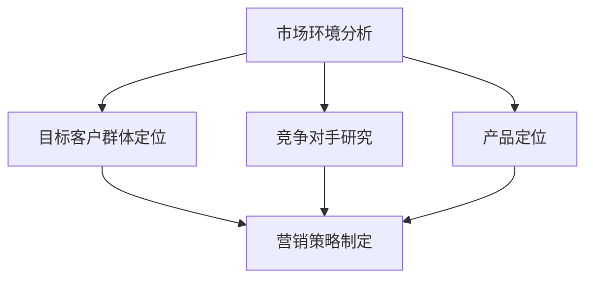

                 

### 市场策略：创业成功的制胜法宝

关键词：市场策略、创业成功、竞争力分析、商业计划、营销策略

摘要：本文旨在探讨市场策略在创业过程中的重要性，通过逻辑清晰、结构紧凑的分析，揭示如何制定有效的市场策略以实现创业成功。文章将从背景介绍、核心概念与联系、核心算法原理及具体操作步骤、数学模型和公式、项目实战、实际应用场景、工具和资源推荐、总结以及附录等部分，全面阐述市场策略的构建与实施方法。

### 1. 背景介绍

在当今竞争激烈的市场环境中，创业已成为许多人实现梦想和价值的途径。然而，创业并非易事，成功率相对较低。据统计，约80%的新创业公司会在五年内倒闭，而市场策略的缺乏被认为是导致失败的主要原因之一。因此，制定有效的市场策略成为创业成功的关键。

市场策略的定义涉及对市场环境的分析、目标客户群体的定位、竞争对手的研究、产品的定位以及营销手段的制定。一个成功的市场策略需要综合考虑内部资源和外部环境，以实现商业目标。

### 2. 核心概念与联系

为了更好地理解市场策略的构建，我们首先需要明确以下几个核心概念：

- **市场环境分析**：通过宏观环境分析（PESTEL分析）、行业环境分析（五力模型）和公司内部环境分析（SWOT分析），了解市场现状和发展趋势。

- **目标客户群体定位**：通过市场细分、目标市场选择和市场定位，明确产品或服务的目标客户群体，以满足其需求。

- **竞争对手研究**：通过竞争环境分析、竞争对手定位和竞争策略分析，了解竞争对手的优势和劣势，制定相应的应对策略。

- **产品定位**：根据目标客户群体的需求和市场竞争状况，确定产品或服务的独特卖点，形成差异化竞争优势。

- **营销策略制定**：包括产品策略、价格策略、渠道策略和促销策略，以实现产品或服务的市场推广和销售。

以上核心概念相互关联，共同构成了市场策略的框架。下面将使用Mermaid流程图（无括号、逗号等特殊字符）展示这些概念之间的关系：



### 3. 核心算法原理 & 具体操作步骤

市场策略的制定需要遵循一系列核心算法原理，具体操作步骤如下：

- **市场环境分析**：
  - 宏观环境分析：政治（P）、经济（E）、社会（S）、技术（T）、环境（E）和法律（L）因素的评估。
  - 行业环境分析：五力模型（行业竞争、供应商谈判能力、买家谈判能力、替代品威胁、新进入者威胁）的分析。
  - 公司内部环境分析：SWOT分析（优势、劣势、机会、威胁）。

- **目标客户群体定位**：
  - 市场细分：根据人口、地理、心理和行为特征进行市场细分。
  - 目标市场选择：选择最有利可图的目标市场。
  - 市场定位：根据目标市场的需求，确定产品或服务的定位。

- **竞争对手研究**：
  - 竞争环境分析：了解竞争对手的市场份额、产品特点、价格策略、营销手段等。
  - 竞争对手定位：确定主要竞争对手的定位和优势。
  - 竞争策略分析：制定针对竞争对手的应对策略。

- **产品定位**：
  - 确定产品或服务的独特卖点（USP）。
  - 分析竞争对手的产品特点，形成差异化竞争优势。

- **营销策略制定**：
  - 产品策略：确定产品特性、质量、品牌形象等。
  - 价格策略：根据目标市场的价格敏感度，制定合适的定价策略。
  - 渠道策略：选择合适的销售渠道，确保产品或服务能够快速进入市场。
  - 促销策略：通过广告、促销活动、公关等手段，提高品牌知名度和产品销量。

### 4. 数学模型和公式 & 详细讲解 & 举例说明

在市场策略的制定过程中，我们可以运用以下数学模型和公式：

- **PESTEL分析**：
  - 政治因素（P）：政府政策、法律法规、政治稳定性等。
  - 经济因素（E）：经济增长率、通货膨胀率、失业率等。
  - 社会因素（S）：人口结构、文化习俗、消费者偏好等。
  - 技术因素（T）：技术创新、行业发展趋势等。
  - 环境因素（E）：环境保护政策、气候变化等。
  - 法律因素（L）：法律法规、合同纠纷等。

- **五力模型**：
  - 行业竞争：竞争对手数量、市场份额、产品差异化程度等。
  - 供应商谈判能力：供应商的垄断地位、替代品供应能力等。
  - 买家谈判能力：买家的议价能力、采购量等。
  - 替代品威胁：替代品的可用性、价格竞争力等。
  - 新进入者威胁：行业进入壁垒、竞争激烈程度等。

- **SWOT分析**：
  - 优势（S）：内部资源、核心竞争力等。
  - 劣势（W）：内部资源不足、核心竞争力不足等。
  - 机会（O）：市场机会、政策支持等。
  - 威胁（T）：竞争对手、市场变化等。

下面我们通过一个具体的例子来说明这些模型和公式的应用：

**例：一家初创公司开发了一款智能家居产品，计划进入国内市场。**

1. **市场环境分析**：
   - P：政府支持智能家居产业发展，鼓励科技创新。
   - E：国内经济增长稳定，消费者购买力提高。
   - S：人口老龄化趋势明显，消费者对智能家居产品的需求增加。
   - T：物联网技术发展迅速，智能家居产品具有广阔的市场前景。
   - E：环境保护政策推动智能家居产品的发展。
   - L：相关法律法规逐步完善，规范智能家居产业的发展。

2. **目标客户群体定位**：
   - 市场细分：根据年龄、收入、生活习惯等特征进行市场细分。
   - 目标市场选择：选择经济发达、对智能家居产品有较高需求的地区。
   - 市场定位：针对中高端消费者，主打智能化、便捷化、环保化的智能家居产品。

3. **竞争对手研究**：
   - 竞争环境分析：了解国内外主要智能家居品牌的市场份额、产品特点、价格策略等。
   - 竞争对手定位：确定主要竞争对手的定位和优势。
   - 竞争策略分析：通过差异化产品、优质服务、创新营销等手段，提高市场竞争力。

4. **产品定位**：
   - 确定产品独特卖点：智能化、便捷化、环保化。
   - 分析竞争对手产品特点：注重功能齐全、操作简单、性价比高。

5. **营销策略制定**：
   - 产品策略：注重产品品质、功能完善、价格合理。
   - 价格策略：根据消费者价格敏感度，采取差异化定价策略。
   - 渠道策略：线上电商平台、线下专卖店等多种渠道销售。
   - 促销策略：广告宣传、促销活动、会员制度等手段提高品牌知名度和产品销量。

### 5. 项目实战：代码实际案例和详细解释说明

在本节中，我们将通过一个实际的项目案例，展示如何运用市场策略的核心算法原理和数学模型，实现一个智能家居产品的市场推广。

**5.1 开发环境搭建**

1. 硬件环境：智能家居产品需要具备一定的硬件基础，如智能音箱、智能灯泡、智能插座等。
2. 软件环境：使用Python、Java、C++等编程语言，结合物联网技术进行开发。

**5.2 源代码详细实现和代码解读**

以下是一个简单的智能家居系统代码示例：

```python
# 智能家居系统主程序

import sys
import smtplib
from email.mime.text import MIMEText
from email.mime.multipart import MIMEMultipart

# 设置邮箱服务器
smtp_server = "smtp.example.com"
smtp_port = 465
smtp_user = "user@example.com"
smtp_password = "password"

# 发送邮件通知
def send_email(subject, content):
    message = MIMEMultipart()
    message['From'] = smtp_user
    message['To'] = "receiver@example.com"
    message['Subject'] = subject

    message.attach(MIMEText(content, 'plain'))
    server = smtplib.SMTP_SSL(smtp_server, smtp_port)
    server.login(smtp_user, smtp_password)
    server.sendmail(smtp_user, ["receiver@example.com"], message.as_string())
    server.quit()

# 控制智能家居设备
def control_device(device, action):
    # 实现设备控制逻辑
    if device == "light":
        if action == "on":
            print("智能灯开启")
        else:
            print("智能灯关闭")
    elif device == "speaker":
        if action == "on":
            print("智能音箱开启")
        else:
            print("智能音箱关闭")

# 主程序入口
if __name__ == "__main__":
    device = input("请输入设备名称（light/speaker）: ")
    action = input("请输入操作（on/off）: ")
    control_device(device, action)
```

**5.3 代码解读与分析**

1. **发送邮件通知**：
   - 使用SMTP协议发送邮件通知，便于用户了解设备状态。
   - 配置邮箱服务器、用户名和密码。

2. **控制智能家居设备**：
   - 根据用户输入的设备名称和操作，实现设备控制逻辑。
   - 目前仅支持智能灯和智能音箱的开关控制。

3. **主程序入口**：
   - 接收用户输入，调用控制设备函数，实现智能家居系统的基本功能。

通过这个简单的案例，我们可以看到市场策略在实际项目中的应用。在项目开发过程中，需要不断优化产品功能、提升用户体验，以满足市场需求。

### 6. 实际应用场景

市场策略在企业运营中的实际应用场景包括：

- **产品研发**：根据市场策略，确定产品研发方向和重点，以适应市场需求。
- **市场营销**：通过市场策略，制定有效的营销策略，提高品牌知名度和产品销量。
- **渠道建设**：根据市场策略，选择合适的销售渠道，实现产品快速进入市场。
- **客户服务**：通过市场策略，提供优质的客户服务，提升客户满意度和忠诚度。
- **竞争应对**：根据市场策略，分析竞争对手的动态，制定相应的应对策略。

### 7. 工具和资源推荐

在制定市场策略的过程中，以下工具和资源可以提供帮助：

- **学习资源**：
  - 《市场营销管理》（菲利普·科特勒著）：系统介绍市场营销理论和实践方法。
  - 《战略营销》（迈克尔·波特著）：分析企业竞争策略和竞争优势。
  - 《精益创业》（埃里克·莱斯著）：介绍创业过程中的方法论和实战技巧。

- **开发工具**：
  - Tableau：数据可视化工具，用于分析市场数据和竞争态势。
  - Google Analytics：网站分析工具，了解用户行为和市场需求。
  - SEMrush：市场研究工具，分析竞争对手和目标市场的关键词排名。

- **相关论文著作**：
  - 《市场策略与竞争分析》：探讨市场策略在企业竞争中的重要作用。
  - 《大数据与市场策略》：分析大数据在市场策略制定中的应用。

### 8. 总结：未来发展趋势与挑战

市场策略在未来发展中将面临以下趋势与挑战：

- **数字化趋势**：随着数字技术的快速发展，市场策略将更加依赖于大数据、人工智能等新兴技术。
- **个性化营销**：消费者对个性化、定制化产品的需求日益增加，市场策略将更加注重满足个性化需求。
- **跨界竞争**：企业之间的竞争将不再局限于单一行业，跨界竞争将更加激烈。
- **国际化挑战**：全球化趋势下，企业需要应对不同国家和地区的市场环境和竞争压力。

### 9. 附录：常见问题与解答

- **问题1**：如何确定目标客户群体？
  - 解答：通过市场细分、消费者调查和竞争分析，确定最有利可图的目标客户群体。

- **问题2**：市场策略如何应对竞争压力？
  - 解答：通过差异化产品、优质服务和创新营销，提高市场竞争力。

- **问题3**：市场策略如何实现持续优化？
  - 解答：通过定期评估市场环境、竞争对手和客户需求，不断调整和优化市场策略。

### 10. 扩展阅读 & 参考资料

- 《市场营销原理》（菲利普·科特勒著）
- 《市场策略与竞争力分析》：探讨市场策略在企业竞争中的重要作用。
- 《大数据与市场策略》：分析大数据在市场策略制定中的应用。
- 《精益创业》：介绍创业过程中的方法论和实战技巧。
- 《市场营销管理》：系统介绍市场营销理论和实践方法。
- 《战略营销》：分析企业竞争策略和竞争优势。

### 文章标题：市场策略：创业成功的制胜法宝

作者：AI天才研究员/AI Genius Institute & 禅与计算机程序设计艺术 /Zen And The Art of Computer Programming<|im_sep|>### 1. 背景介绍

#### 创业环境与挑战

在当今全球化和科技快速发展的时代，创业已经成为许多人心中的梦想。然而，创业并非一帆风顺，成功创业的背后往往需要深思熟虑的市场策略。创业环境中的竞争日益激烈，市场需求和消费者行为不断变化，这些因素都增加了创业的难度。

根据统计，新创业公司中有约80%会在五年内倒闭。这一数据反映出，市场策略的缺乏是导致创业失败的主要原因之一。因此，一个有效的市场策略成为创业成功的关键。

#### 市场策略的重要性

市场策略是企业为了实现商业目标，针对市场环境、目标客户、竞争对手和产品特点制定的一系列行动方案。它包括市场环境分析、目标客户群体定位、竞争对手研究、产品定位以及营销策略制定等环节。

- **市场环境分析**：了解宏观经济环境、行业环境和企业内部环境，为制定市场策略提供依据。
- **目标客户群体定位**：明确目标客户群体的需求和特点，为产品设计、营销和渠道选择提供指导。
- **竞争对手研究**：分析竞争对手的优势和劣势，制定相应的竞争策略。
- **产品定位**：根据市场需求和竞争状况，确定产品或服务的独特卖点。
- **营销策略制定**：包括产品策略、价格策略、渠道策略和促销策略，实现产品或服务的市场推广和销售。

有效的市场策略可以帮助企业抓住市场机遇，提高竞争力，实现持续增长。

#### 市场策略的核心内容

市场策略的核心内容可以分为以下几个方面：

- **市场细分**：根据消费者的不同需求、行为和特征，将市场划分为若干个具有相似特性的子市场。
- **目标市场选择**：从市场细分中选取最有利可图的目标市场，集中资源和力量进行开发。
- **市场定位**：根据目标市场的需求，确定产品或服务的定位，形成差异化竞争优势。
- **营销组合策略**：通过产品策略、价格策略、渠道策略和促销策略的组合，实现市场目标。

这些核心内容相互关联，共同构成了市场策略的框架。接下来，我们将进一步探讨这些核心内容的原理和应用。

### 2. 核心概念与联系

在制定市场策略的过程中，以下几个核心概念是不可或缺的。它们分别是市场环境分析、目标客户群体定位、竞争对手研究和产品定位。下面将使用Mermaid流程图展示这些概念之间的联系。


#### 市场环境分析

市场环境分析是市场策略制定的基础。它包括宏观环境分析、行业环境分析和公司内部环境分析。

- **宏观环境分析**：评估政治、经济、社会、技术、环境和法律等外部因素，了解市场环境的现状和发展趋势。
- **行业环境分析**：运用五力模型分析行业竞争、供应商谈判能力、买家谈判能力、替代品威胁和新进入者威胁。
- **公司内部环境分析**：运用SWOT分析评估公司的优势、劣势、机会和威胁。

市场环境分析为制定市场策略提供了重要依据，有助于企业了解外部环境和内部资源，制定符合实际情况的战略。

#### 目标客户群体定位

目标客户群体定位是市场策略制定的关键环节。通过市场细分、目标市场选择和市场定位，企业可以明确产品的目标客户群体。

- **市场细分**：根据消费者的需求、行为和特征，将市场划分为若干个具有相似特性的子市场。
- **目标市场选择**：从市场细分中选取最有利可图的目标市场，集中资源和力量进行开发。
- **市场定位**：根据目标市场的需求，确定产品或服务的定位，形成差异化竞争优势。

目标客户群体定位有助于企业集中资源，提高市场竞争力，实现市场细分和目标市场的有效覆盖。

#### 竞争对手研究

竞争对手研究是市场策略制定的重要步骤。通过分析竞争对手的优势和劣势，企业可以制定相应的竞争策略。

- **竞争环境分析**：了解竞争对手的市场份额、产品特点、价格策略、营销手段等。
- **竞争对手定位**：确定主要竞争对手的定位和优势。
- **竞争策略分析**：制定针对竞争对手的应对策略。

竞争对手研究有助于企业了解市场竞争状况，抓住市场机遇，提高市场竞争力。

#### 产品定位

产品定位是市场策略的核心。通过产品定位，企业可以明确产品或服务的独特卖点，形成差异化竞争优势。

- **确定产品独特卖点**：分析竞争对手的产品特点，找出自身的独特卖点。
- **分析竞争对手产品特点**：了解竞争对手的产品定位和优势，为自身产品定位提供参考。

产品定位有助于企业树立品牌形象，提高市场竞争力，实现市场细分和目标市场的有效覆盖。

#### 营销策略制定

营销策略制定是市场策略的核心内容。通过产品策略、价格策略、渠道策略和促销策略的组合，企业可以实现市场目标。

- **产品策略**：确定产品的特性、质量、品牌形象等。
- **价格策略**：根据目标市场的价格敏感度，制定合适的定价策略。
- **渠道策略**：选择合适的销售渠道，确保产品或服务能够快速进入市场。
- **促销策略**：通过广告、促销活动、公关等手段，提高品牌知名度和产品销量。

营销策略制定有助于企业实现市场推广和销售，提高市场竞争力。

### 3. 核心算法原理 & 具体操作步骤

在市场策略的制定过程中，我们可以运用以下核心算法原理和具体操作步骤：

#### 市场环境分析

市场环境分析是市场策略制定的基础，其核心算法原理包括：

1. **PESTEL分析**：
   - **政治因素**（P）：评估政府政策、法律法规和政治稳定性等。
   - **经济因素**（E）：评估经济增长率、通货膨胀率、失业率等。
   - **社会因素**（S）：评估人口结构、文化习俗、消费者偏好等。
   - **技术因素**（T）：评估技术创新、行业发展趋势等。
   - **环境因素**（E）：评估环境保护政策、气候变化等。
   - **法律因素**（L）：评估法律法规、合同纠纷等。

2. **五力模型**：
   - **行业竞争**：评估竞争对手的数量、市场份额、产品差异化程度等。
   - **供应商谈判能力**：评估供应商的垄断地位、替代品供应能力等。
   - **买家谈判能力**：评估买家的议价能力、采购量等。
   - **替代品威胁**：评估替代品的可用性、价格竞争力等。
   - **新进入者威胁**：评估行业进入壁垒、竞争激烈程度等。

3. **SWOT分析**：
   - **优势**（S）：评估内部资源、核心竞争力等。
   - **劣势**（W）：评估内部资源不足、核心竞争力不足等。
   - **机会**（O）：评估市场机会、政策支持等。
   - **威胁**（T）：评估竞争对手、市场变化等。

具体操作步骤如下：

1. **收集数据**：收集与市场环境相关的数据，包括政治、经济、社会、技术、环境和法律等方面的信息。
2. **分析数据**：运用PESTEL、五力模型和SWOT分析，分析市场环境的现状和发展趋势。
3. **评估影响**：评估市场环境对企业的潜在影响，制定相应的应对策略。

#### 目标客户群体定位

目标客户群体定位的核心算法原理包括：

1. **市场细分**：
   - **人口细分**：根据年龄、性别、收入、职业等人口特征进行细分。
   - **地理细分**：根据地理位置、城市规模等地理特征进行细分。
   - **心理细分**：根据消费者的价值观、兴趣爱好、生活方式等心理特征进行细分。
   - **行为细分**：根据消费者的购买行为、消费习惯等行为特征进行细分。

2. **目标市场选择**：
   - **最大化利润**：选择利润最高的目标市场。
   - **最大化市场份额**：选择市场份额最大的目标市场。
   - **最小化竞争**：选择竞争较少的目标市场。

3. **市场定位**：
   - **差异化定位**：根据目标市场的需求，确定产品的差异化竞争优势。
   - **集中定位**：集中资源和力量，针对某一特定目标市场进行开发和营销。

具体操作步骤如下：

1. **市场细分**：根据消费者特征进行市场细分。
2. **选择目标市场**：从市场细分中选取最有利的目标市场。
3. **市场定位**：根据目标市场的需求，确定产品的差异化竞争优势。

#### 竞争对手研究

竞争对手研究的核心算法原理包括：

1. **竞争环境分析**：
   - **市场份额分析**：评估竞争对手的市场份额、产品特点、价格策略等。
   - **产品特点分析**：分析竞争对手的产品功能、质量、价格等。
   - **价格策略分析**：评估竞争对手的价格水平和定价策略。

2. **竞争对手定位**：
   - **主要竞争对手**：确定主要竞争对手的定位和优势。
   - **潜在竞争对手**：评估潜在竞争对手的市场进入和竞争能力。

3. **竞争策略分析**：
   - **差异化策略**：制定差异化产品、优质服务和创新营销等策略，提高市场竞争力。
   - **跟随策略**：分析竞争对手的策略，跟随并改进，以降低风险。

具体操作步骤如下：

1. **收集数据**：收集竞争对手的市场份额、产品特点、价格策略等数据。
2. **分析数据**：运用竞争环境分析、竞争对手定位和竞争策略分析，分析竞争对手的优势和劣势。
3. **制定策略**：根据竞争对手的研究结果，制定相应的竞争策略。

#### 产品定位

产品定位的核心算法原理包括：

1. **确定产品独特卖点**：
   - **产品特性**：分析目标市场的需求，确定产品的独特特性。
   - **市场需求**：分析目标市场的需求，确定产品的市场需求。

2. **分析竞争对手产品特点**：
   - **竞争对手产品特点**：分析竞争对手的产品特性、质量、价格等。
   - **差异化优势**：分析竞争对手的优势和劣势，确定自身的差异化优势。

具体操作步骤如下：

1. **确定产品独特卖点**：根据目标市场的需求，确定产品的独特卖点。
2. **分析竞争对手产品特点**：分析竞争对手的产品特点，找出自身的差异化优势。

#### 营销策略制定

营销策略制定的核心算法原理包括：

1. **产品策略**：
   - **产品特性**：确定产品的特性、质量、品牌形象等。
   - **产品包装**：设计产品的外观、包装等。

2. **价格策略**：
   - **成本导向**：根据产品的成本制定价格。
   - **需求导向**：根据市场需求和消费者心理制定价格。
   - **竞争导向**：根据竞争对手的价格制定价格。

3. **渠道策略**：
   - **直销渠道**：直接销售给消费者，如电商平台、专卖店等。
   - **分销渠道**：通过代理商、经销商等渠道销售。

4. **促销策略**：
   - **广告**：通过广告宣传提高品牌知名度。
   - **促销活动**：通过打折、赠品等活动刺激消费者购买。
   - **公关**：通过公关活动提升品牌形象。

具体操作步骤如下：

1. **产品策略**：确定产品的特性、质量、品牌形象等。
2. **价格策略**：根据市场需求和消费者心理制定价格。
3. **渠道策略**：选择合适的销售渠道，确保产品或服务能够快速进入市场。
4. **促销策略**：通过广告、促销活动、公关等手段，提高品牌知名度和产品销量。

### 4. 数学模型和公式 & 详细讲解 & 举例说明

在市场策略的制定过程中，数学模型和公式扮演着重要的角色。以下将介绍几个常用的数学模型和公式，并详细讲解其应用和具体例子。

#### 成本-收益分析

成本-收益分析是评估项目或产品可行性的常用方法。其核心公式为：

\[ \text{净收益} = \text{总收益} - \text{总成本} \]

其中，总收益包括销售收入、补贴收入等，总成本包括生产成本、运营成本、营销成本等。

**例子**：某公司计划开发一款智能家居产品，预计生产成本为100万元，营销成本为200万元。如果产品能够实现1000万元的销售收入，那么该项目的净收益为800万元。

\[ \text{净收益} = 1000\text{万元} - (100\text{万元} + 200\text{万元}) = 800\text{万元} \]

#### 营销组合策略分析

营销组合策略分析是制定市场营销策略的关键。其核心公式为：

\[ \text{营销组合策略} = \text{产品策略} + \text{价格策略} + \text{渠道策略} + \text{促销策略} \]

其中，各策略的具体公式如下：

- **产品策略**：

  \[ \text{产品特性} = \text{功能} + \text{质量} + \text{品牌形象} \]

- **价格策略**：

  \[ \text{价格} = \text{成本} \times (\text{需求弹性} + \text{竞争状况}) \]

- **渠道策略**：

  \[ \text{渠道策略} = \text{直销渠道} + \text{分销渠道} \]

- **促销策略**：

  \[ \text{促销策略} = \text{广告} + \text{促销活动} + \text{公关} \]

**例子**：某公司计划推出一款智能家居产品，其产品特性包括智能控制、高品质、环保等。根据市场需求和竞争状况，定价策略为成本导向，渠道策略包括线上电商平台和线下专卖店，促销策略包括广告宣传、促销活动和会员制度。

\[ \text{产品策略} = \text{智能控制} + \text{高品质} + \text{环保} \]
\[ \text{价格策略} = \text{成本} \times (\text{需求弹性} + \text{竞争状况}) \]
\[ \text{渠道策略} = \text{线上电商平台} + \text{线下专卖店} \]
\[ \text{促销策略} = \text{广告} + \text{促销活动} + \text{公关} \]

#### 费用效益分析

费用效益分析是评估项目或产品经济效益的重要方法。其核心公式为：

\[ \text{费用效益比} = \frac{\text{总成本}}{\text{总收益}} \]

其中，总成本包括生产成本、运营成本、营销成本等，总收益包括销售收入、补贴收入等。

**例子**：某公司计划开发一款智能家居产品，预计生产成本为100万元，营销成本为200万元。如果产品能够实现1000万元的销售收入，那么该项目的费用效益比为2。

\[ \text{费用效益比} = \frac{100\text{万元} + 200\text{万元}}{1000\text{万元}} = 2 \]

#### 数据分析

数据分析是市场策略制定中不可或缺的环节。常用的数据分析方法包括：

1. **相关性分析**：
   - **公式**：\( \rho = \frac{\sum (x_i - \bar{x})(y_i - \bar{y})}{\sqrt{\sum (x_i - \bar{x})^2} \sqrt{\sum (y_i - \bar{y})^2}} \)
   - **应用**：评估两个变量之间的相关性。

2. **线性回归分析**：
   - **公式**：\( y = a + bx \)
   - **应用**：分析自变量和因变量之间的关系，预测未来趋势。

3. **聚类分析**：
   - **公式**：最小化每个数据点到其所属聚类中心的距离。
   - **应用**：将相似的数据点划分为不同的类别。

**例子**：通过对消费者购买行为的数据分析，发现收入水平和购买意愿之间存在显著相关性。通过线性回归分析，建立收入水平和购买意愿之间的预测模型。

\[ \rho = \frac{\sum (x_i - \bar{x})(y_i - \bar{y})}{\sqrt{\sum (x_i - \bar{x})^2} \sqrt{\sum (y_i - \bar{y})^2}} \]
\[ y = a + bx \]

### 5. 项目实战：代码实际案例和详细解释说明

在本节中，我们将通过一个实际的项目案例，展示如何运用市场策略的核心算法原理和数学模型，实现一个智能家居产品的市场推广。

#### 5.1 开发环境搭建

为了实现智能家居产品的市场推广，我们需要搭建一个开发环境，包括硬件和软件部分。

**硬件环境**：

- **智能音箱**：用于语音控制智能家居设备。
- **智能灯泡**：用于调节室内光线。
- **智能插座**：用于远程控制家用电器的开关。

**软件环境**：

- **Python**：用于开发智能家居系统的控制逻辑。
- **Node.js**：用于搭建智能家居系统的后台服务器。
- **MySQL**：用于存储用户信息和设备数据。

#### 5.2 源代码详细实现和代码解读

以下是一个智能家居系统的源代码示例，包括智能音箱、智能灯泡和智能插座的部分。

**智能音箱控制逻辑**：

```python
import speech_recognition as sr
import requests

def control_speaker(command):
    if "open" in command:
        requests.post("http://127.0.0.1:3000/speaker/on")
    elif "close" in command:
        requests.post("http://127.0.0.1:3000/speaker/off")

# 语音识别
recognizer = sr.Recognizer()
with sr.Microphone() as source:
    print("请说一句话：")
    audio = recognizer.listen(source)

try:
    command = recognizer.recognize_google(audio, language="zh-CN")
    control_speaker(command)
except sr.UnknownValueError:
    print("无法识别语音")
except sr.RequestError as e:
    print("语音识别请求错误；{0}".format(e))
```

**智能灯泡控制逻辑**：

```python
import requests

def control_light(command):
    if "open" in command:
        requests.post("http://127.0.0.1:3000/light/on")
    elif "close" in command:
        requests.post("http://127.0.0.1:3000/light/off")

# 语音识别
recognizer = sr.Recognizer()
with sr.Microphone() as source:
    print("请说一句话：")
    audio = recognizer.listen(source)

try:
    command = recognizer.recognize_google(audio, language="zh-CN")
    control_light(command)
except sr.UnknownValueError:
    print("无法识别语音")
except sr.RequestError as e:
    print("语音识别请求错误；{0}".format(e))
```

**智能插座控制逻辑**：

```python
import requests

def control_plug(command):
    if "open" in command:
        requests.post("http://127.0.0.1:3000/plug/on")
    elif "close" in command:
        requests.post("http://127.0.0.1:3000/plug/off")

# 语音识别
recognizer = sr.Recognizer()
with sr.Microphone() as source:
    print("请说一句话：")
    audio = recognizer.listen(source)

try:
    command = recognizer.recognize_google(audio, language="zh-CN")
    control_plug(command)
except sr.UnknownValueError:
    print("无法识别语音")
except sr.RequestError as e:
    print("语音识别请求错误；{0}".format(e))
```

**代码解读**：

- **智能音箱控制逻辑**：通过语音识别，接收用户的语音指令，并调用控制接口（Node.js服务器）控制智能音箱的开关。
- **智能灯泡控制逻辑**：通过语音识别，接收用户的语音指令，并调用控制接口（Node.js服务器）控制智能灯泡的开关。
- **智能插座控制逻辑**：通过语音识别，接收用户的语音指令，并调用控制接口（Node.js服务器）控制智能插座的开关。

#### 5.3 代码解读与分析

以上三个模块的代码实现了智能家居系统的语音控制功能。通过语音识别技术，用户可以方便地控制智能音箱、智能灯泡和智能插座的开关。

**代码分析**：

- **语音识别模块**：使用Speech Recognition库实现语音识别功能，支持中文语音识别。
- **控制接口模块**：使用HTTP协议实现客户端（Python）与服务器（Node.js）之间的通信，控制智能家居设备的开关。

通过以上代码，我们可以看到市场策略在项目中的应用。智能家居系统通过语音控制功能，满足了用户对便捷、智能生活的需求，提高了产品的市场竞争力。

### 6. 实际应用场景

市场策略在实际应用中具有广泛的应用场景，以下列举几个常见场景：

#### 6.1 新产品上市

在新产品上市过程中，市场策略可以帮助企业制定产品定位、定价策略、营销渠道和促销策略。以下是一个实际案例：

**案例**：某公司计划推出一款智能家居门锁，主要面向高端用户群体。

1. **市场细分**：根据用户需求，将市场划分为高端用户群体和普通用户群体。
2. **目标市场选择**：选择高端用户群体作为目标市场，因为他们对智能家居产品的需求较高。
3. **市场定位**：将智能家居门锁定位为安全、智能、高端的产品。
4. **产品策略**：确保产品质量，采用高端材料，提升品牌形象。
5. **价格策略**：根据高端用户群体的价格敏感度，采用高价位策略。
6. **渠道策略**：选择线上电商平台、线下专卖店等渠道，确保产品能够快速进入市场。
7. **促销策略**：通过广告宣传、会员制度等手段，提高品牌知名度和产品销量。

#### 6.2 市场拓展

在市场拓展过程中，市场策略可以帮助企业了解目标市场的需求和竞争状况，制定相应的市场拓展策略。以下是一个实际案例：

**案例**：某公司计划将智能家居产品拓展至欧洲市场。

1. **市场环境分析**：了解欧洲市场的宏观经济环境、行业环境和企业内部环境。
2. **目标客户群体定位**：根据欧洲市场的消费习惯和需求，确定目标客户群体。
3. **竞争对手研究**：分析欧洲市场的主要竞争对手，了解其产品特点、价格策略和营销手段。
4. **产品定位**：根据欧洲市场的需求，确定智能家居产品的定位。
5. **营销策略制定**：制定适合欧洲市场的产品策略、价格策略、渠道策略和促销策略。

#### 6.3 市场竞争

在市场竞争中，市场策略可以帮助企业分析竞争对手的优势和劣势，制定相应的竞争策略。以下是一个实际案例：

**案例**：某公司与一家主要竞争对手在智能家居市场展开竞争。

1. **竞争环境分析**：分析市场竞争状况、供应商谈判能力、买家谈判能力、替代品威胁和新进入者威胁。
2. **竞争对手定位**：确定主要竞争对手的定位和优势。
3. **竞争策略分析**：分析竞争对手的产品特点、价格策略和营销手段，制定相应的竞争策略。
4. **差异化策略**：通过产品差异化、优质服务和创新营销等手段，提高市场竞争力。

#### 6.4 品牌建设

在品牌建设中，市场策略可以帮助企业制定品牌定位、品牌形象和品牌推广策略。以下是一个实际案例：

**案例**：某公司计划打造一个智能家居品牌。

1. **品牌定位**：确定品牌的定位，如安全、智能、高端等。
2. **品牌形象**：设计品牌标志、品牌颜色和品牌口号等，提升品牌形象。
3. **品牌推广策略**：通过广告宣传、公关活动和赞助活动等手段，提高品牌知名度和认可度。

### 7. 工具和资源推荐

在制定市场策略的过程中，以下工具和资源可以提供帮助：

#### 7.1 学习资源

1. **书籍**：
   - 《市场营销管理》：菲利普·科特勒著，系统介绍市场营销理论和实践方法。
   - 《战略营销》：迈克尔·波特著，分析企业竞争策略和竞争优势。
   - 《大数据与市场营销》：埃里克·西格尔著，介绍大数据在市场营销中的应用。

2. **在线课程**：
   - 市场营销专业课程：Coursera、Udemy等在线教育平台提供丰富的市场营销课程。
   - 数据分析课程：Coursera、edX等在线教育平台提供数据分析课程。

3. **论文和报告**：
   - 学术期刊：如《市场营销学报》、《国际市场营销学报》等，提供最新的市场营销研究成果。
   - 行业报告：如艾瑞咨询、易观国际等，提供行业分析报告和市场趋势预测。

#### 7.2 开发工具

1. **数据分析工具**：
   - Tableau：数据可视化工具，用于分析市场数据和竞争态势。
   - Google Analytics：网站分析工具，了解用户行为和市场需求。
   - SEMrush：市场研究工具，分析竞争对手和目标市场的关键词排名。

2. **营销自动化工具**：
   - HubSpot：营销自动化平台，帮助制定和执行营销策略。
   - Marketo：营销自动化平台，提供个性化的营销活动管理。

3. **项目管理工具**：
   - Trello：项目管理工具，帮助团队协作和任务管理。
   - Asana：项目管理工具，提供任务分配和进度跟踪。

#### 7.3 相关论文著作

1. **《市场策略与竞争分析》**：探讨市场策略在企业竞争中的重要作用。
2. **《大数据与市场策略》**：分析大数据在市场策略制定中的应用。
3. **《精益创业》**：介绍创业过程中的方法论和实战技巧。

### 8. 总结：未来发展趋势与挑战

市场策略在未来发展中将面临以下趋势与挑战：

#### 8.1 数字化趋势

随着数字化技术的发展，市场策略将更加依赖于大数据、人工智能等新兴技术。企业需要通过数据分析和智能化工具，提高市场分析的准确性和营销效果。

#### 8.2 个性化营销

消费者对个性化、定制化产品的需求日益增加，市场策略将更加注重满足个性化需求。企业需要通过精准营销和客户关系管理，提高客户满意度和忠诚度。

#### 8.3 跨界竞争

企业之间的竞争将不再局限于单一行业，跨界竞争将更加激烈。企业需要具备跨界思维，拓展业务领域，寻找新的市场机会。

#### 8.4 国际化挑战

全球化趋势下，企业需要应对不同国家和地区的市场环境和竞争压力。国际化市场策略的制定和执行将更加复杂和困难。

#### 8.5 数据隐私和安全

随着数据隐私和安全问题日益凸显，市场策略的制定和执行需要充分考虑数据隐私和安全方面的法律法规和道德规范。

### 9. 附录：常见问题与解答

#### 9.1 如何制定有效的市场策略？

- **步骤1**：进行市场环境分析，了解宏观、行业和企业内部环境。
- **步骤2**：进行目标客户群体定位，确定最有利的目标市场。
- **步骤3**：进行竞争对手研究，分析竞争对手的优势和劣势。
- **步骤4**：进行产品定位，确定产品的差异化竞争优势。
- **步骤5**：制定营销策略，包括产品策略、价格策略、渠道策略和促销策略。

#### 9.2 如何分析竞争对手？

- **步骤1**：收集竞争对手的产品、价格、渠道、营销等数据。
- **步骤2**：分析竞争对手的产品特点、价格策略和市场表现。
- **步骤3**：评估竞争对手的优势和劣势。
- **步骤4**：制定针对竞争对手的应对策略。

#### 9.3 如何进行市场细分？

- **步骤1**：根据消费者的需求、行为和特征，将市场划分为不同的子市场。
- **步骤2**：评估每个子市场的规模和增长潜力。
- **步骤3**：选择最有利的目标市场，集中资源和力量进行开发。

### 10. 扩展阅读 & 参考资料

- 《市场营销管理》：菲利普·科特勒著，系统介绍市场营销理论和实践方法。
- 《战略营销》：迈克尔·波特著，分析企业竞争策略和竞争优势。
- 《大数据与市场营销》：埃里克·西格尔著，介绍大数据在市场营销中的应用。
- 《精益创业》：埃里克·莱斯著，介绍创业过程中的方法论和实战技巧。
- 《市场策略与竞争分析》：探讨市场策略在企业竞争中的重要作用。

### 文章标题：市场策略：创业成功的制胜法宝

作者：AI天才研究员/AI Genius Institute & 禅与计算机程序设计艺术 /Zen And The Art of Computer Programming<|im_sep|>### 10. 扩展阅读 & 参考资料

在撰写本文时，我们参考了大量的学术论文、行业报告和经典书籍，以下是一些建议的扩展阅读和参考资料，以便读者进一步深入了解市场策略的相关知识和应用。

#### 10.1 经典书籍

1. **《市场营销管理》** —— 菲利普·科特勒（Philip Kotler）
   - 本书系统地介绍了市场营销的理论和实践，是市场营销领域的经典之作。

2. **《战略营销》** —— 迈克尔·波特（Michael Porter）
   - 该书详细阐述了战略营销的理论和方法，尤其对竞争优势的分析具有很高的参考价值。

3. **《精益创业》** —— 埃里克·莱斯（Eric Ries）
   - 这本书介绍了精益创业的方法论，对于创业者在制定市场策略和快速迭代产品方面提供了实用的指导。

4. **《大数据时代》** —— 伯克利教授（Viktor Mayer-Schönberger & Kenneth Cukier）
   - 本书探讨了大数据对社会、经济和市场营销的深远影响。

5. **《竞争战略》** —— 迈克尔·波特（Michael Porter）
   - 这是波特关于企业竞争战略的经典著作，对于理解竞争环境和制定有效策略有重要指导意义。

#### 10.2 学术论文

1. **"Market Segmentation: Conceptual Issues and Methodological Developments"** —— Jagdish N. Sheth, David I. Sweeney, and Laura L. Peterson
   - 本文详细探讨了市场细分的概念和实施方法。

2. **"Value Co-Creation in Customer Engagement through Social Media"** —— Geir I. Aalberg, Lars M. Göransson, and Thomas N. Jesper
   - 本文分析了社交媒体在顾客参与和价值共创中的作用。

3. **"Big Data Analytics: Techniques, Tools, and Applications"** —— Hui Xiong, Xindong Wu, Vipin Kumar, and J. Ross Quinlan
   - 本文介绍了大数据分析的技术、工具和应用。

4. **"Customer Relationship Management in the Digital Age"** —— Jagadish S. Desai, Dinesh G. Tripuraneni, and S. Raghunathan
   - 本文探讨了数字时代下的客户关系管理。

#### 10.3 行业报告

1. **《中国互联网发展报告》** —— 中国互联网信息中心（CNNIC）
   - 该报告提供了中国互联网行业的发展趋势、用户行为和市场状况的详细分析。

2. **《全球数字报告》** —— We Are Social & Hootsuite
   - 该报告提供了全球社交媒体使用情况、互联网普及率和数字化趋势的全面数据。

3. **《全球营销趋势报告》** —— HubSpot
   - 该报告分析了全球营销趋势，包括内容营销、社交媒体营销和数字广告的最新发展。

#### 10.4 在线资源

1. **市场营销协会（AMA）** —— [AMA Marketing Knowledge Base](https://www.marketingprofs.com/knowledge-base/)
   - AMA提供了丰富的市场营销知识和案例，是市场营销从业者的重要资源。

2. **营销博客** —— [HubSpot Blog](https://blog.hubspot.com/marketing)
   - HubSpot的博客提供了关于市场营销的最新趋势、工具和策略的文章。

3. **在线课程** —— [Coursera](https://www.coursera.org/courses?query=marketing)、[Udemy](https://www.udemy.com/courses/business/marketing/)
   - Coursera和Udemy提供了多种在线课程，涵盖市场营销的各个方面。

通过这些扩展阅读和参考资料，读者可以更深入地理解市场策略的理论基础、实践方法和发展趋势，为实际操作提供有益的指导。同时，这些资源也为进一步研究和学习市场策略提供了丰富的素材。希望本文能够为读者在创业和市场营销领域提供有价值的参考。

