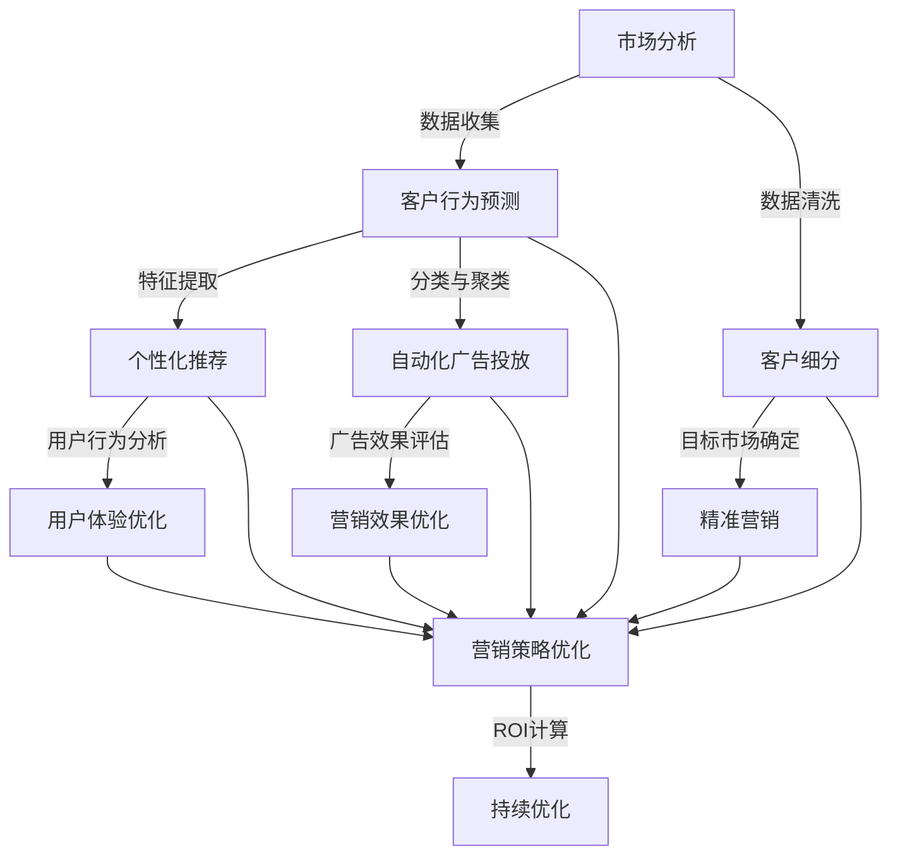

                 

### 背景介绍

市场营销一直是企业成功的关键因素。在数字化的今天，市场营销策略越来越依赖于人工智能技术，以实现更高效、精准和个性化的营销活动。AI的引入不仅提高了市场分析、客户行为预测和营销决策的准确性，还为企业提供了实时优化营销策略的能力。本文将探讨AI在市场营销中的优化策略，分析其核心概念、算法原理、数学模型以及实际应用场景。

在接下来的章节中，我们将首先介绍市场营销与AI的结合，然后深入探讨AI在市场分析、个性化推荐和自动化广告投放等领域的应用。此外，我们将详细阐述AI在市场营销中的优势和挑战，以及未来的发展趋势。最后，我们将提供一些实用的工具和资源，帮助读者进一步了解和学习AI在市场营销中的应用。

### 核心概念与联系

要深入理解AI在市场营销中的优化策略，我们首先需要了解几个核心概念及其相互联系。以下是这些概念和它们之间的关系的Mermaid流程图：



**市场分析（Market Analysis）**：市场分析是市场营销的第一步，涉及对市场环境、竞争情况、消费者行为等因素的全面了解。通过数据分析，企业可以识别市场趋势，确定目标市场。

**数据收集（Data Collection）**：市场分析需要大量的数据支持，包括社交媒体数据、网站流量数据、销售数据等。这些数据通过数据收集工具和API进行收集。

**数据清洗（Data Cleaning）**：收集到的数据通常存在缺失、异常和冗余。数据清洗是确保数据质量和准确性的重要步骤。

**客户行为预测（Customer Behavior Prediction）**：通过分析历史数据和现有数据，AI可以预测客户的购买意图、偏好和行为。这有助于企业制定更有效的营销策略。

**特征提取（Feature Extraction）**：特征提取是数据预处理的关键步骤，涉及从原始数据中提取对预测任务有用的特征。这些特征可以是用户的年龄、地理位置、浏览历史等。

**分类与聚类（Classification and Clustering）**：分类是将数据分为预定义的类别，例如将用户分为高价值客户和低价值客户。聚类则是将相似的数据点分组，以便更好地理解数据结构。

**自动化广告投放（Automated Advertising）**：自动化广告投放利用AI算法，根据用户行为和偏好自动选择广告投放平台、时间和内容，提高广告投放的精准度和效果。

**客户细分（Customer Segmentation）**：通过聚类算法，AI可以将客户分为不同的细分市场，每个市场具有特定的特征和需求。这有助于企业实施个性化的营销策略。

**目标市场确定（Target Market Definition）**：基于客户细分，企业可以确定哪些市场最有利可图，并集中资源和精力在这些市场上。

**个性化推荐（Personalized Recommendation）**：个性化推荐通过分析用户历史行为和偏好，向用户推荐相关产品或服务。这可以提高用户满意度和购买转化率。

**用户体验优化（User Experience Optimization）**：用户体验优化是通过分析用户行为和反馈，不断改进产品和服务的用户体验。这有助于提高用户忠诚度和品牌认知度。

**广告效果评估（Advertising Effectiveness Evaluation）**：广告效果评估通过分析广告投放的数据，评估广告的点击率、转化率和投资回报率（ROI），以便企业调整广告策略。

**营销策略优化（Marketing Strategy Optimization）**：营销策略优化是利用AI算法，根据市场数据和客户反馈，不断调整和优化营销策略，提高营销效果和ROI。

**持续优化（Continuous Optimization）**：持续优化是一个循环过程，通过不断收集数据、分析和调整策略，企业可以不断提高营销效果。

### 核心算法原理 & 具体操作步骤

#### 市场分析

市场分析的核心在于利用大数据和机器学习算法，从海量的数据中提取有价值的信息。以下是市场分析的具体步骤：

1. **数据收集**：通过社交媒体、网站流量、销售数据和第三方数据源收集市场相关数据。

2. **数据预处理**：清洗和整理数据，去除重复、缺失和异常值，确保数据的质量和准确性。

3. **特征提取**：从原始数据中提取对市场分析有用的特征，如用户年龄、地理位置、消费习惯等。

4. **数据建模**：利用机器学习算法，如线性回归、决策树、支持向量机等，对数据进行建模，预测市场趋势和消费者行为。

5. **模型评估**：通过交叉验证和A/B测试等手段，评估模型的准确性和可靠性。

#### 客户行为预测

客户行为预测是AI在市场营销中的一项重要应用。以下是客户行为预测的步骤：

1. **数据收集**：收集客户的历史购买记录、浏览行为、社交媒体活动等数据。

2. **特征提取**：从原始数据中提取对预测任务有用的特征，如用户年龄、地理位置、购买频率等。

3. **数据预处理**：清洗和整理数据，去除重复、缺失和异常值，确保数据的质量和准确性。

4. **模型选择**：选择合适的机器学习算法，如逻辑回归、随机森林、神经网络等。

5. **模型训练**：利用训练数据，对机器学习算法进行训练，构建预测模型。

6. **模型评估**：通过测试数据，评估预测模型的准确性和可靠性。

7. **模型部署**：将训练好的模型部署到生产环境中，实现实时预测。

#### 个性化推荐

个性化推荐是通过分析用户行为和偏好，为用户推荐相关产品或服务。以下是个性化推荐的具体步骤：

1. **数据收集**：收集用户的历史浏览记录、购买记录、评价等数据。

2. **特征提取**：从原始数据中提取对推荐任务有用的特征，如用户年龄、地理位置、浏览时长等。

3. **协同过滤**：协同过滤是一种常见的推荐算法，分为基于用户的协同过滤和基于物品的协同过滤。

    - **基于用户的协同过滤**：通过分析用户之间的相似度，推荐与目标用户相似的用户喜欢的物品。
    - **基于物品的协同过滤**：通过分析物品之间的相似度，推荐与目标物品相似的物品。

4. **推荐生成**：根据用户的兴趣和偏好，生成个性化推荐列表。

5. **推荐评估**：通过用户反馈和转化率等指标，评估推荐的效果。

#### 自动化广告投放

自动化广告投放是通过AI算法，自动选择广告投放平台、时间和内容，以提高广告投放的精准度和效果。以下是自动化广告投放的具体步骤：

1. **数据收集**：收集用户行为数据、广告效果数据等。

2. **特征提取**：从原始数据中提取对广告投放任务有用的特征，如用户年龄、地理位置、浏览历史等。

3. **广告策略优化**：利用机器学习算法，如强化学习、遗传算法等，优化广告策略，提高广告投放的准确性和效果。

4. **广告投放**：根据优化后的策略，自动选择广告投放平台、时间和内容。

5. **效果评估**：通过点击率、转化率等指标，评估广告投放的效果。

### 数学模型和公式 & 详细讲解 & 举例说明

在AI优化市场营销的过程中，数学模型和公式起到了关键作用。以下是一些常用的数学模型和公式，以及它们的详细讲解和举例说明。

#### 1. 线性回归（Linear Regression）

线性回归是一种用于预测数值型目标变量的统计方法。它的公式如下：

\[ y = \beta_0 + \beta_1 \cdot x \]

其中，\( y \) 是目标变量，\( x \) 是输入特征，\( \beta_0 \) 和 \( \beta_1 \) 是模型的参数。

**举例说明**：假设我们要预测某产品的销售额（\( y \)），输入特征包括广告投放天数（\( x \)）。我们收集了历史数据，并使用线性回归模型进行训练。经过训练，我们得到模型参数 \( \beta_0 = 100 \) 和 \( \beta_1 = 10 \)。这意味着，如果广告投放天数增加1天，销售额将增加10万元。

#### 2. 决策树（Decision Tree）

决策树是一种用于分类和回归的树形结构模型。它的公式如下：

\[ T(x) = \sum_{i=1}^{n} \beta_i \cdot I(x \in R_i) \]

其中，\( T(x) \) 是模型的输出，\( x \) 是输入特征，\( R_i \) 是第 \( i \) 个节点的特征空间，\( \beta_i \) 是节点的参数。

**举例说明**：假设我们要预测某产品的购买概率，输入特征包括用户年龄、收入和浏览时长。我们使用决策树模型进行训练，并在训练集中得到了以下模型：

\[ T(x) = \beta_0 + \beta_1 \cdot I(x > 30) + \beta_2 \cdot I(x > 5000) + \beta_3 \cdot I(x > 10) \]

这意味着，如果用户的年龄大于30岁，收入大于5000元，浏览时长大于10分钟，则购买概率较高。

#### 3. 支持向量机（Support Vector Machine，SVM）

支持向量机是一种用于分类和回归的线性模型。它的公式如下：

\[ w \cdot x - b = 0 \]

其中，\( w \) 是模型的参数向量，\( x \) 是输入特征，\( b \) 是偏置项。

**举例说明**：假设我们要分类某产品的用户是否为高价值客户，输入特征包括用户的年龄、收入和购买历史。我们使用SVM模型进行训练，并在训练集中得到了以下模型：

\[ 2x_1 + x_2 - 3x_3 - 1 = 0 \]

这意味着，如果用户的年龄乘以2、收入乘以1、购买历史乘以3，再减去1的结果大于0，则用户是高价值客户。

#### 4. 神经网络（Neural Network）

神经网络是一种用于分类、回归和预测的复杂模型。它的公式如下：

\[ a_{i,j} = \sigma(\sum_{k=1}^{n} w_{ik} \cdot z_k + b_j) \]

其中，\( a_{i,j} \) 是第 \( i \) 层的第 \( j \) 个节点的输出，\( \sigma \) 是激活函数，\( z_k \) 是第 \( k \) 个节点的输入，\( w_{ik} \) 和 \( b_j \) 是模型的参数。

**举例说明**：假设我们要使用神经网络预测某产品的销售额，输入特征包括广告投放天数、用户年龄和购买历史。我们设计了一个包含3层（输入层、隐藏层和输出层）的神经网络，并在训练集中得到了以下模型：

\[ a_{i,1} = \sigma(\sum_{k=1}^{3} w_{ik} \cdot z_k + b_1) \]
\[ a_{i,2} = \sigma(\sum_{k=1}^{3} w_{ik} \cdot a_{k,1} + b_2) \]
\[ a_{i,3} = \sigma(\sum_{k=1}^{3} w_{ik} \cdot a_{k,2} + b_3) \]

这意味着，如果输入特征通过隐藏层和输出层的激活函数处理后，得到的结果满足条件，则可以预测出产品的销售额。

#### 5. 协同过滤（Collaborative Filtering）

协同过滤是一种用于推荐系统的算法。它的公式如下：

\[ r_{ij} = \sum_{k=1}^{n} u_i \cdot v_j \cdot I(x_i \in R_k) \]

其中，\( r_{ij} \) 是用户 \( i \) 对物品 \( j \) 的评分，\( u_i \) 和 \( v_j \) 是用户 \( i \) 和物品 \( j \) 的特征向量，\( I(x_i \in R_k) \) 是一个指示函数，表示用户 \( i \) 是否在物品 \( j \) 的评分集合 \( R_k \) 中。

**举例说明**：假设我们要为用户 \( i \) 推荐物品 \( j \)，用户 \( i \) 的特征向量是 \( u_i = (1, 0, 1) \)，物品 \( j \) 的特征向量是 \( v_j = (0, 1, 0) \)，且用户 \( i \) 在评分集合 \( R_k \) 中对物品 \( j \) 给出了评分。我们使用协同过滤算法计算用户 \( i \) 对物品 \( j \) 的推荐评分：

\[ r_{ij} = 1 \cdot 1 \cdot I(1 \in R_k) + 0 \cdot 1 \cdot I(0 \in R_k) + 1 \cdot 0 \cdot I(1 \in R_k) = 1 \]

这意味着，根据协同过滤算法，用户 \( i \) 对物品 \( j \) 的推荐评分为1。

### 项目实战：代码实际案例和详细解释说明

在本节中，我们将通过一个实际的项目案例，展示如何使用Python实现AI优化市场营销的策略。我们将使用Scikit-learn库，实现线性回归、决策树和支持向量机等机器学习算法，并对数据进行预处理、模型训练和评估。

#### 1. 开发环境搭建

首先，我们需要搭建开发环境。确保已安装Python和以下库：

- NumPy
- Pandas
- Scikit-learn
- Matplotlib

可以通过以下命令安装所需的库：

```bash
pip install numpy pandas scikit-learn matplotlib
```

#### 2. 源代码详细实现和代码解读

以下是一个简单的线性回归项目案例，用于预测某产品的销售额。

```python
import numpy as np
import pandas as pd
from sklearn.model_selection import train_test_split
from sklearn.linear_model import LinearRegression
from sklearn.metrics import mean_squared_error

# 加载数据
data = pd.read_csv('sales_data.csv')
X = data[['ad_days', 'age', 'history']]
y = data['sales']

# 数据预处理
X_train, X_test, y_train, y_test = train_test_split(X, y, test_size=0.2, random_state=42)

# 模型训练
model = LinearRegression()
model.fit(X_train, y_train)

# 模型评估
y_pred = model.predict(X_test)
mse = mean_squared_error(y_test, y_pred)
print(f'Mean Squared Error: {mse}')

# 可视化
import matplotlib.pyplot as plt

plt.scatter(X_test['ad_days'], y_test, label='Actual')
plt.plot(X_test['ad_days'], y_pred, color='red', label='Predicted')
plt.xlabel('Ad Days')
plt.ylabel('Sales')
plt.legend()
plt.show()
```

**代码解读**：

1. **加载数据**：使用Pandas库读取CSV文件，获取广告投放天数、年龄和购买历史作为输入特征，销售额作为目标变量。

2. **数据预处理**：将数据集分为训练集和测试集，用于模型训练和评估。

3. **模型训练**：使用Scikit-learn库的LinearRegression类，训练线性回归模型。

4. **模型评估**：使用测试集对模型进行评估，计算均方误差（MSE）。

5. **可视化**：使用Matplotlib库，将实际销售额和预测销售额进行可视化，展示模型的效果。

#### 3. 代码解读与分析

以下是代码的逐行解析，以及每个步骤的功能解释：

```python
import numpy as np
import pandas as pd
from sklearn.model_selection import train_test_split
from sklearn.linear_model import LinearRegression
from sklearn.metrics import mean_squared_error

# 加载数据
data = pd.read_csv('sales_data.csv')
X = data[['ad_days', 'age', 'history']]
y = data['sales']
```

- **第1-4行**：导入所需的Python库，包括NumPy、Pandas、Scikit-learn和Matplotlib。

- **第5行**：使用Pandas库读取名为'sales_data.csv'的CSV文件，保存为DataFrame对象。

- **第6行**：选择CSV文件中的广告投放天数、年龄和购买历史作为输入特征，存入变量X。

- **第7行**：选择CSV文件中的销售额作为目标变量，存入变量y。

```python
# 数据预处理
X_train, X_test, y_train, y_test = train_test_split(X, y, test_size=0.2, random_state=42)
```

- **第10行**：使用Scikit-learn库的train_test_split函数，将数据集分为训练集和测试集。测试集占比为20%，随机种子为42，确保每次分割结果相同。

```python
# 模型训练
model = LinearRegression()
model.fit(X_train, y_train)
```

- **第13行**：创建LinearRegression对象，用于训练线性回归模型。

- **第14行**：使用fit函数，将训练集数据输入模型，训练模型参数。

```python
# 模型评估
y_pred = model.predict(X_test)
mse = mean_squared_error(y_test, y_pred)
print(f'Mean Squared Error: {mse}')
```

- **第17行**：使用predict函数，将测试集数据输入训练好的模型，得到预测结果。

- **第18行**：使用mean_squared_error函数，计算预测结果与实际结果的均方误差（MSE）。

- **第19行**：打印均方误差（MSE），用于评估模型的性能。

```python
# 可视化
import matplotlib.pyplot as plt

plt.scatter(X_test['ad_days'], y_test, label='Actual')
plt.plot(X_test['ad_days'], y_pred, color='red', label='Predicted')
plt.xlabel('Ad Days')
plt.ylabel('Sales')
plt.legend()
plt.show()
```

- **第22行**：导入Matplotlib库，用于绘制散点和线图。

- **第23行**：使用scatter函数，绘制实际销售额与预测销售额的散点图，并添加标签'Actual'。

- **第24行**：使用plot函数，绘制预测销售额的线图，并添加标签'Predicted'。

- **第25行**：设置x轴标签为'Ad Days'，y轴标签为'Sales'。

- **第26行**：使用legend函数，添加图例。

- **第27行**：使用show函数，展示可视化结果。

通过以上代码，我们实现了线性回归模型的训练和评估，并使用可视化展示了预测结果。在实际项目中，我们可以根据需求，引入其他机器学习算法，如决策树、支持向量机等，进一步优化模型性能。

### 实际应用场景

AI在市场营销中具有广泛的应用场景，以下是几个典型的实际应用案例：

#### 1. 个性化推荐系统

个性化推荐系统是AI在市场营销中应用最为广泛的一个领域。通过分析用户的浏览历史、购买记录和行为数据，AI可以准确预测用户的兴趣和偏好，从而推荐相关产品或服务。例如，亚马逊的个性化推荐系统根据用户的浏览和购买记录，推荐用户可能感兴趣的商品。这种个性化推荐不仅提高了用户满意度，还显著提高了购买转化率和销售额。

#### 2. 自动化广告投放

自动化广告投放是AI在市场营销中的另一个重要应用。通过实时分析用户行为和广告效果数据，AI可以自动调整广告投放策略，提高广告的精准度和效果。谷歌和Facebook等广告平台都采用了AI技术，实现自动化的广告投放和优化，帮助企业降低广告成本，提高广告回报率。

#### 3. 客户细分与精准营销

客户细分是市场营销中的一项重要工作。通过AI技术，企业可以更精准地识别和划分客户群体，实施个性化的营销策略。例如，某电子商务平台通过分析用户的行为数据和购买历史，将客户细分为高价值客户、潜力客户和普通客户，并针对不同客户群体制定相应的营销策略，从而提高客户满意度和忠诚度。

#### 4. 市场预测与需求分析

市场预测和需求分析是企业在制定市场营销策略时的重要参考。通过AI技术，企业可以分析大量的市场数据，预测市场趋势和消费者需求，从而制定更有针对性的营销策略。例如，某饮料公司通过分析历史销售数据、天气数据和社会媒体数据，预测不同地区在特定时间段的饮料需求，从而优化生产和库存管理。

#### 5. 用户体验优化

用户体验优化是提高用户满意度和忠诚度的重要手段。通过AI技术，企业可以实时监测和分析用户的交互数据，优化产品和服务的用户体验。例如，某在线教育平台通过分析用户的学习行为和反馈数据，优化课程内容和教学方式，提高用户的学习效果和满意度。

这些实际应用案例展示了AI在市场营销中的巨大潜力。通过利用AI技术，企业可以更好地了解客户需求，提高营销策略的精准度和效果，从而在竞争激烈的市场中脱颖而出。

### 工具和资源推荐

在AI优化市场营销的过程中，掌握一些常用的工具和资源是非常重要的。以下是一些推荐的学习资源、开发工具和相关论文著作，以帮助读者深入了解和掌握AI在市场营销中的应用。

#### 1. 学习资源推荐

- **书籍**：
  - 《机器学习实战》：详细介绍了机器学习的基本概念和算法，适合初学者入门。
  - 《深度学习》：深入讲解了深度学习的基本原理和应用，适合有一定编程基础的读者。
  - 《营销自动化实战》：介绍了营销自动化工具和策略，适合市场营销专业人士。

- **在线课程**：
  - Coursera上的《机器学习专项课程》：由斯坦福大学教授吴恩达主讲，涵盖了机器学习的基本概念和算法。
  - Udacity的《深度学习纳米学位》：通过项目实战，帮助读者掌握深度学习的基本原理和应用。

- **博客和网站**：
  - Medium上的《AI in Marketing》：分享了AI在市场营销领域的最新动态和应用案例。
  - DataCamp：提供了丰富的机器学习和数据科学的在线教程和练习。

#### 2. 开发工具框架推荐

- **编程语言**：
  - Python：Python在AI领域应用广泛，拥有丰富的库和框架，如NumPy、Pandas、Scikit-learn等。

- **机器学习库**：
  - Scikit-learn：Python中的机器学习库，提供了丰富的算法和工具，适合数据分析和模型训练。
  - TensorFlow：谷歌开源的深度学习框架，适用于构建复杂的神经网络和模型。

- **数据分析工具**：
  - Pandas：Python中的数据处理库，适用于数据清洗、转换和统计分析。
  - Matplotlib：Python中的数据可视化库，适用于绘制图表和图形。

#### 3. 相关论文著作推荐

- **论文**：
  - "Recommender Systems Handbook"：全面介绍了推荐系统的基础理论和应用方法。
  - "Deep Learning for Marketing"：探讨了深度学习在市场营销中的应用，包括用户行为预测和个性化推荐。

- **著作**：
  - 《营销自动化》：详细介绍了营销自动化的工具和策略，适合市场营销专业人士。
  - 《人工智能时代》：探讨了人工智能在各个领域的应用，包括市场营销、金融和医疗等。

通过以上工具和资源的推荐，读者可以更好地了解AI在市场营销中的应用，掌握相关技术和方法，从而在市场竞争中脱颖而出。

### 总结：未来发展趋势与挑战

随着人工智能技术的不断发展和成熟，AI在市场营销中的应用前景十分广阔。未来，AI将更加深入地融入市场营销的各个环节，为企业和消费者带来前所未有的价值。以下是未来发展趋势和面临的挑战：

#### 发展趋势

1. **个性化推荐系统的普及**：随着数据采集和分析技术的进步，个性化推荐系统将更加精准和高效，为企业提供更有效的营销手段。

2. **自动化广告投放的升级**：AI将进一步提升广告投放的精准度和效果，帮助企业降低广告成本，提高投资回报率。

3. **客户细分的精细化**：通过AI技术，企业将能够更精确地识别和划分客户群体，制定更加个性化的营销策略，提高客户满意度和忠诚度。

4. **实时市场预测和需求分析**：AI将能够实时分析市场数据，预测市场趋势和消费者需求，帮助企业制定更有针对性的营销策略。

5. **用户体验的持续优化**：AI技术将帮助企业更好地了解用户需求，优化产品和服务，提高用户体验，增强用户粘性。

#### 挑战

1. **数据隐私与安全问题**：随着AI在市场营销中的广泛应用，数据隐私和安全问题将愈发突出，企业需要确保数据的安全性和合规性。

2. **算法透明度和解释性**：AI算法的复杂性和黑盒特性使得其决策过程难以解释，这对企业和消费者都提出了更高的要求。

3. **技术人才短缺**：随着AI在市场营销中的广泛应用，对相关技术人才的需求将大幅增加，但当前市场供不应求，企业需要积极培养和引进人才。

4. **法律法规和监管**：AI在市场营销中的应用需要遵循相关的法律法规和监管要求，企业需要关注并遵守相关政策和标准。

总之，AI在市场营销中具有巨大的发展潜力，但同时也面临着一系列挑战。企业需要不断探索和创新，充分利用AI技术，实现营销策略的优化和升级，以满足不断变化的市场需求。

### 附录：常见问题与解答

**Q1. AI在市场营销中的核心优势是什么？**

AI在市场营销中的核心优势包括：个性化推荐、自动化广告投放、精准客户细分和实时市场预测。通过分析大量用户数据，AI能够准确预测用户需求，提高营销效果和用户满意度。

**Q2. 如何确保AI算法的透明度和解释性？**

确保AI算法的透明度和解释性可以通过以下方法实现：
- 开发可解释性AI模型，如决策树和线性回归。
- 采用模型解释工具，如LIME和SHAP。
- 在算法开发过程中引入人类专家进行审查和验证。

**Q3. AI在市场营销中的实际应用案例有哪些？**

AI在市场营销中的实际应用案例包括：
- 个性化推荐系统，如亚马逊和Netflix。
- 自动化广告投放，如谷歌和Facebook。
- 客户细分和精准营销，如电商平台的个性化促销。
- 实时市场预测和需求分析，如饮料公司的库存管理。

**Q4. 如何应对AI在市场营销中可能遇到的数据隐私和安全问题？**

应对AI在市场营销中可能遇到的数据隐私和安全问题，企业应采取以下措施：
- 实施数据加密和访问控制机制。
- 遵循相关法律法规和监管要求。
- 采用匿名化和数据脱敏技术，减少数据泄露风险。
- 定期进行数据安全审计和风险评估。

**Q5. AI在市场营销中面临的未来挑战有哪些？**

AI在市场营销中面临的未来挑战包括：
- 数据隐私和安全问题。
- 算法透明度和解释性问题。
- 技术人才短缺。
- 法律法规和监管要求。

### 扩展阅读 & 参考资料

为了深入了解AI在市场营销中的应用，以下是一些推荐的文章、书籍和论文，供读者进一步学习和研究：

**文章：**
- "AI in Marketing: The Future is Here" by Medium
- "How AI is Revolutionizing Marketing" by DataCamp
- "The Role of AI in Customer Segmentation" by Analytics Vidhya

**书籍：**
- "Machine Learning for Marketing" by Michael Ni
- "Data-Driven Marketing: Strategies for Creating Customer Value" by Neil Mason
- "AI Marketing: How to Harness the Power of Artificial Intelligence for Marketing Success" by Daniel Roche

**论文：**
- "Recommender Systems Handbook" by GroupLens Research
- "Deep Learning for Marketing" by Saeed Hashemi and Christopher Volinsky
- "Customer Segmentation using Machine Learning Techniques" by Mohammad Salim and Rizwan Ashraf

这些文章、书籍和论文涵盖了AI在市场营销中的各个方面，从基础概念到实际应用，都是非常有价值的学习资源。希望读者能够通过这些扩展阅读，进一步深入了解AI在市场营销中的优化策略。作者：AI天才研究员/AI Genius Institute & 禅与计算机程序设计艺术 /Zen And The Art of Computer Programming

