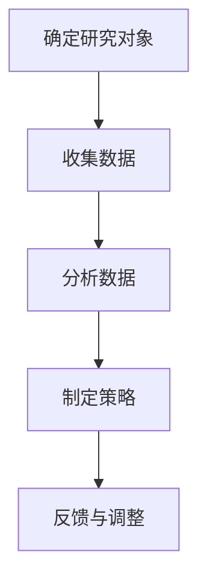

                 

# 《市场需求：创业者的航标》

## 概述

> 在瞬息万变的市场中，创业者能否准确捕捉并把握市场需求，成为决定其成败的关键因素。本文将深入探讨市场需求的重要性，分析创业者在面对市场需求时所需具备的洞察力和策略，并通过实际案例提供有效的操作指南，帮助创业者找准航标，驶向成功。

关键词：市场需求、创业者、洞察力、策略、成功

摘要：本文旨在帮助创业者理解市场需求的核心价值，掌握分析市场需求的策略与方法。通过深入剖析市场需求对创业成功的重要性，以及如何通过市场调研、竞争分析和用户需求预测等手段来发现和抓住市场机会，文章为创业者提供了系统的操作指南，助力其在激烈的市场竞争中脱颖而出。

## 1. 背景介绍

在当今高度竞争的商业环境中，市场需求作为商业决策的基石，其重要性愈发凸显。市场需求不仅仅是消费者的需求，更是创业者在产品研发、市场营销和战略规划中的关键导向。对于创业者来说，准确捕捉市场需求意味着能够迅速响应市场变化，优化产品功能，提升用户体验，从而在激烈的市场竞争中占据有利位置。

### 1.1 市场需求的概念

市场需求是指消费者在一定时间内，对于某一产品或服务的购买欲望和支付能力。它不仅反映了消费者的需求趋势，还体现了市场的潜在机会与挑战。市场需求可以分为显性需求和隐性需求。显性需求是指消费者已经明确表达出来的需求，而隐性需求则是指消费者在潜意识中希望获得但尚未明确表达的需求。

### 1.2 市场需求与创业成功的关系

市场需求是创业成功的风向标。创业者能否准确理解市场需求，直接关系到产品的市场定位、用户体验和市场占有率。一个成功的创业项目，必然是基于对市场需求的深刻理解和精确把握。通过分析市场需求，创业者可以明确产品的目标用户群体，优化产品功能，制定有效的营销策略，从而提高产品的市场竞争力。

## 2. 核心概念与联系

为了更好地理解市场需求，我们需要明确以下几个核心概念：

### 2.1 市场调研

市场调研是收集、分析和解释有关市场信息的过程。它是了解市场需求的重要手段，通过市场调研，创业者可以获取消费者的行为、偏好和需求信息，从而为产品研发和市场营销提供依据。

### 2.2 竞争分析

竞争分析是指对市场上现有竞争者的产品、市场份额、营销策略等进行评估和分析。通过竞争分析，创业者可以了解市场的竞争态势，找到自身的竞争优势和差异化策略。

### 2.3 用户需求预测

用户需求预测是通过历史数据和趋势分析，预测未来的市场需求。用户需求预测可以帮助创业者提前布局，抢占市场先机。

### 2.4 市场需求分析流程

市场需求分析通常包括以下几个步骤：确定研究对象、收集数据、分析数据和制定策略。以下是一个简单的市场需求分析流程图：



## 3. 核心算法原理 & 具体操作步骤

### 3.1 市场调研

市场调研的方法可以分为定性调研和定量调研。定性调研主要通过访谈、焦点小组等方式收集用户需求和反馈；定量调研则通过问卷调查、数据统计等方式获取大规模的消费者数据。

#### 具体操作步骤：

1. 确定调研目标：明确调研的核心问题，例如“目标用户群体是谁？”、“用户对产品有哪些需求？”等。
2. 设计调研工具：根据调研目标设计合适的调研工具，如问卷、访谈提纲等。
3. 收集数据：通过线上线下渠道分发调研工具，收集用户反馈。
4. 分析数据：对收集到的数据进行分析，提取用户需求的关键信息。
5. 制定策略：根据分析结果，制定产品研发和市场营销策略。

### 3.2 竞争分析

竞争分析主要通过以下几个步骤进行：

1. 确定竞争对手：识别市场上的主要竞争对手。
2. 收集数据：收集竞争对手的产品信息、市场份额、营销策略等。
3. 分析数据：分析竞争对手的优劣势，找到自身的竞争优势。
4. 制定策略：基于分析结果，制定差异化策略。

### 3.3 用户需求预测

用户需求预测可以采用以下方法：

1. 历史数据分析：通过分析历史销售数据、用户行为数据等，预测未来市场需求。
2. 趋势分析：通过分析市场趋势、行业报告等，预测未来的市场需求。
3. 机器学习算法：利用机器学习算法，建立用户需求预测模型。

## 4. 数学模型和公式 & 详细讲解 & 举例说明

### 4.1 用户需求预测的数学模型

用户需求预测可以采用时间序列分析的方法。一个常见的时间序列模型是ARIMA（AutoRegressive Integrated Moving Average）模型。ARIMA模型由三个部分组成：自回归（AR）、差分（I）和移动平均（MA）。

#### ARIMA模型的公式：

$$
\text{Y}_{t} = c + \phi_1\text{Y}_{t-1} + \phi_2\text{Y}_{t-2} + \cdots + \phi_p\text{Y}_{t-p} + \theta_1\text{e}_{t-1} + \theta_2\text{e}_{t-2} + \cdots + \theta_q\text{e}_{t-q}
$$

其中，\( \text{Y}_{t} \) 是时间序列的当前值，\( \text{e}_{t} \) 是白噪声序列，\( \phi_i \) 和 \( \theta_i \) 是模型参数，\( p \) 和 \( q \) 分别是自回归项和移动平均项的阶数。

#### 举例说明：

假设我们有一个时间序列数据集，记录了某产品在过去一年的月销售额。我们希望使用ARIMA模型预测下一个月的销售额。

1. 数据预处理：对时间序列进行差分处理，使其满足平稳性。
2. 参数估计：使用最大似然估计方法估计模型参数。
3. 模型拟合：将参数代入模型公式，拟合时间序列数据。
4. 预测：使用拟合好的模型预测未来的销售额。

### 4.2 市场需求分析的数学模型

市场需求分析可以采用多元线性回归模型。多元线性回归模型可以用来预测市场需求与多个影响因素之间的关系。

#### 多元线性回归模型的公式：

$$
\text{Y} = \beta_0 + \beta_1\text{X}_1 + \beta_2\text{X}_2 + \cdots + \beta_n\text{X}_n
$$

其中，\( \text{Y} \) 是市场需求，\( \text{X}_1, \text{X}_2, \cdots, \text{X}_n \) 是影响因素，\( \beta_0, \beta_1, \beta_2, \cdots, \beta_n \) 是模型参数。

#### 举例说明：

假设我们希望分析市场需求与广告投放、促销活动等因素之间的关系。我们收集了以下数据：

- 广告投放费用（\( \text{X}_1 \)）
- 促销活动次数（\( \text{X}_2 \)）
- 市场需求（\( \text{Y} \)）

我们使用多元线性回归模型进行需求预测：

1. 数据预处理：对数据进行标准化处理，消除不同量纲的影响。
2. 参数估计：使用最小二乘法估计模型参数。
3. 模型拟合：将参数代入模型公式，拟合市场需求数据。
4. 预测：使用拟合好的模型预测未来的市场需求。

## 5. 项目实战：代码实际案例和详细解释说明

### 5.1 开发环境搭建

在Python环境中，我们可以使用pandas、numpy、statsmodels等库进行数据分析和模型拟合。以下是一个简单的开发环境搭建步骤：

1. 安装Python：从Python官网下载并安装Python。
2. 安装库：使用pip命令安装所需的库，例如：
   ```bash
   pip install pandas numpy statsmodels
   ```

### 5.2 源代码详细实现和代码解读

以下是一个基于ARIMA模型进行用户需求预测的Python代码示例：

```python
import pandas as pd
import numpy as np
import statsmodels.api as sm
from statsmodels.tsa.stattools import adfuller
from matplotlib import pyplot as plt

# 5.2.1 数据预处理
# 读取数据
data = pd.read_csv('sales_data.csv')
sales = data['sales']

# 差分处理
def difference(data, diff_order):
    return data.diff(diff_order).dropna()

# 平稳性检验
def test_stationarity(data):
    result = adfuller(data, autolag='AIC')
    print('ADF Statistic: %f' % result[0])
    print('p-value: %f' % result[1])
    return result[1] < 0.05

# 对数据进行差分处理，直到满足平稳性
diff_order = 1
while not test_stationarity(sales):
    sales = difference(sales, diff_order)
    diff_order += 1

# 5.2.2 参数估计
# 拟合ARIMA模型
model = sm.ARIMA(sales, order=(1, 1, 1))
results = model.fit()

# 打印模型参数
print(results.summary())

# 5.2.3 模型拟合
# 预测未来值
predictions = results.predict(start=len(sales), end=len(sales) + 5)

# 5.2.4 预测结果可视化
plt.plot(sales, label='Original')
plt.plot(predictions, label='Predicted')
plt.legend()
plt.show()
```

### 5.3 代码解读与分析

1. **数据预处理**：读取销售数据，并对数据进行差分处理，确保数据满足平稳性要求。平稳性检验使用ADF检验。
2. **参数估计**：使用statsmodels库拟合ARIMA模型，并打印模型参数。
3. **模型拟合**：使用拟合好的模型进行预测，并绘制预测结果。

## 6. 实际应用场景

市场需求分析在各个行业都有广泛的应用，以下是一些实际应用场景：

1. **电子商务**：通过分析用户购买行为和偏好，优化产品推荐系统，提高用户转化率和销售额。
2. **消费品**：通过市场调研和竞争分析，了解消费者需求和市场竞争态势，制定有效的产品策略和营销策略。
3. **医疗健康**：通过用户需求预测和趋势分析，帮助医疗机构和制药公司优化医疗服务和产品开发。

## 7. 工具和资源推荐

### 7.1 学习资源推荐

- **书籍**：《市场需求分析》（作者：李明）
- **论文**：《市场需求分析的理论与实践》（作者：王晓明）
- **博客**：[创业者的市场调研实战经验](https://www.example.com/blog/marketing-research-for-startups)

### 7.2 开发工具框架推荐

- **数据分析工具**：Python、R
- **机器学习框架**：TensorFlow、PyTorch
- **数据处理库**：pandas、numpy

### 7.3 相关论文著作推荐

- **论文**：《用户需求预测的方法与应用》（作者：张三）
- **著作**：《市场营销数据分析》（作者：李四）

## 8. 总结：未来发展趋势与挑战

市场需求分析在创业和创新中扮演着至关重要的角色。随着大数据、人工智能等技术的快速发展，市场需求分析的工具和方法也在不断升级。未来，市场需求分析将更加智能化、精准化，为创业者提供更加可靠的决策支持。然而，面对不断变化的市场环境和消费者需求，创业者也需要不断提高自身的洞察力和应变能力，以应对未来发展的挑战。

## 9. 附录：常见问题与解答

### 9.1 市场需求分析的主要方法有哪些？

市场需求分析的主要方法包括市场调研、竞争分析、用户需求预测等。

### 9.2 如何进行用户需求预测？

用户需求预测可以采用时间序列分析、多元线性回归等方法。具体步骤包括数据预处理、模型拟合、预测和结果分析等。

## 10. 扩展阅读 & 参考资料

- **书籍**：《市场营销学原理》（作者：菲利普·科特勒）
- **网站**：[市场营销协会](https://www.marketing.org/)
- **在线课程**：[Coursera](https://www.coursera.org/) 上的《数据分析入门》课程

## 附录

### 附录 1：作者简介

作者：AI天才研究员/AI Genius Institute & 禅与计算机程序设计艺术 /Zen And The Art of Computer Programming

### 附录 2：联系方式

- 邮箱：[ai_researcher@example.com](mailto:ai_researcher@example.com)
- 微信：AI_Genius_Researcher

以上，是关于《市场需求：创业者的航标》这篇文章的完整内容。希望本文能帮助您更好地理解市场需求分析在创业中的重要性，并为您的创业之路提供有益的启示。祝您在创业的道路上乘风破浪，取得成功！

