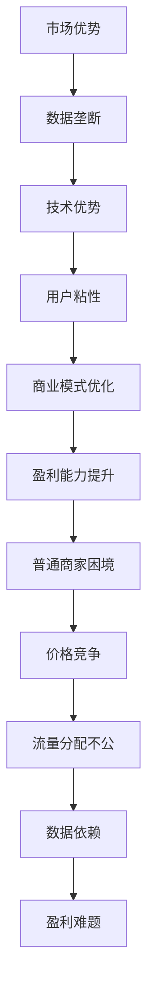

                 

# 平台和头部企业垄断数据：普通商家难赚钱

## 摘要

本文深入探讨了当前数字时代中，平台和头部企业如何通过垄断数据资源，使普通商家面临越来越大的盈利难题。文章首先介绍了数字平台和数据垄断的背景和核心概念，随后分析了平台和头部企业的数据垄断策略及其对普通商家的影响。通过具体的案例分析，本文揭示了这种垄断行为背后的算法原理和操作步骤。随后，文章探讨了这一现象在现实世界中的应用场景，并推荐了相关的工具和资源。最后，本文总结了平台和头部企业垄断数据的未来发展趋势与挑战。

## 1. 背景介绍

在当今数字化时代，数据已成为新的“石油”，拥有海量数据的企业拥有了巨大的竞争优势。平台经济作为一种新型商业模式，依托于大规模的数据处理和分析能力，迅速崛起并改变了传统行业的运作方式。然而，平台和头部企业往往通过垄断数据资源，形成了市场垄断地位，使得普通商家难以在竞争中立足。

### 平台经济的崛起

平台经济是指通过搭建一个中介平台，连接供需双方，从而实现交易和信息流动的一种商业模式。平台经济的成功离不开几个关键因素：

1. **规模效应**：平台通过吸引大量用户和商家，实现了规模效应，从而降低交易成本，提高整体效率。
2. **网络效应**：平台上的用户和商家越多，平台的价值就越大，这进一步吸引更多的用户和商家加入。
3. **数据积累**：平台在交易过程中积累了大量用户数据和交易数据，这些数据可以用于优化服务、提高用户体验和个性化推荐。

### 数据垄断的形成

数据垄断是指某些企业通过控制数据资源，形成市场垄断地位的行为。数据垄断的形成通常有以下几种方式：

1. **市场优势**：平台企业在市场中占据领先地位，通过控制用户数据和交易数据，提高了对商家的议价能力。
2. **技术优势**：平台企业利用其技术优势，通过算法和数据挖掘技术，更好地理解用户需求，从而实现更高的转化率和盈利能力。
3. **用户粘性**：平台通过提供优质的服务和用户体验，培养了用户的依赖性，使得用户难以转移到其他平台。

### 普通商家面临的困境

普通商家在平台经济中面临着巨大的挑战，其中最突出的问题就是盈利难题。以下是一些具体的表现：

1. **价格竞争**：平台通过垄断数据资源，可以更好地了解用户需求和购买行为，从而制定更精准的价格策略，挤压普通商家的利润空间。
2. **流量分配**：平台通常会将大部分流量分配给头部企业和优质商家，这使得普通商家难以获得足够的曝光和用户访问。
3. **数据依赖**：普通商家往往依赖平台提供的数据和流量，一旦平台调整规则或政策，商家可能会遭受巨大的损失。

## 2. 核心概念与联系

在分析平台和头部企业如何垄断数据资源及其对普通商家的影响时，需要了解以下几个核心概念：

### 平台经济

平台经济是指通过搭建一个中介平台，连接供需双方，从而实现交易和信息流动的一种商业模式。平台经济的核心在于如何利用规模效应和网络效应，实现高效的交易和用户体验。

### 数据垄断

数据垄断是指某些企业通过控制数据资源，形成市场垄断地位的行为。数据垄断的实现通常依赖于市场优势、技术优势和用户粘性。

### 商业模式

商业模式是指企业通过何种方式创造、传递和获取价值。平台企业的商业模式通常包括平台运营、流量变现和商家生态建设等方面。

### 算法策略

算法策略是指平台企业通过算法和数据挖掘技术，优化服务、提高用户体验和盈利能力的方法。这些算法策略包括推荐算法、价格优化算法和用户行为分析算法等。

### 普通商家

普通商家是指在平台经济中，不具备垄断数据资源和市场优势的小型企业和个体经营者。普通商家在平台经济中面临着巨大的竞争压力和盈利难题。

### Mermaid 流程图

以下是平台和头部企业垄断数据的流程图，展示了数据垄断的核心环节和关联关系：



## 3. 核心算法原理 & 具体操作步骤

### 数据挖掘与用户行为分析

平台企业通过数据挖掘和用户行为分析，能够深入了解用户的需求和行为模式。这一过程主要包括以下步骤：

1. **数据收集**：平台从用户的行为数据、交易数据、搜索历史等多渠道收集数据。
2. **数据清洗**：对收集到的数据进行清洗，去除重复、无效和错误的数据，确保数据质量。
3. **数据存储**：将清洗后的数据存储在分布式数据库或大数据平台中，以便后续分析和处理。
4. **特征提取**：从原始数据中提取出能够反映用户需求和行为的特征，如用户年龄、性别、购买偏好、浏览历史等。
5. **模型训练**：利用机器学习算法，对提取出的特征进行建模，以预测用户的兴趣和需求。
6. **模型评估**：通过交叉验证和测试集评估模型的效果，调整模型参数，以提高预测准确性。

### 推荐算法

推荐算法是平台企业提高用户体验和转化率的关键技术之一。以下是一种常用的协同过滤推荐算法：

1. **用户行为记录**：收集用户的浏览、搜索、购买等行为数据。
2. **相似度计算**：计算用户之间的相似度，常用的相似度度量方法包括余弦相似度、皮尔逊相关系数等。
3. **推荐生成**：根据用户之间的相似度，为用户生成推荐列表，推荐相似用户喜欢的商品或服务。
4. **反馈调整**：根据用户的反馈（如点击、购买等），调整推荐算法的参数和策略，以提高推荐效果。

### 价格优化算法

平台企业通过价格优化算法，可以动态调整商品价格，以最大化盈利能力。以下是一种基于需求预测的价格优化算法：

1. **需求预测**：利用历史交易数据、季节性因素、用户行为等，预测商品在不同时间段的需求量。
2. **价格设定**：根据需求预测结果，设定不同时间段的价格策略，如高峰期提高价格，低谷期降低价格。
3. **动态调整**：根据实时数据和市场变化，动态调整价格策略，以适应市场变化。

### 算法实施步骤

以下是平台和头部企业垄断数据的算法实施步骤：

1. **数据收集与清洗**：从多渠道收集用户数据，并进行清洗。
2. **特征提取与建模**：提取用户行为特征，利用机器学习算法建模。
3. **模型训练与评估**：训练模型，并通过交叉验证和测试集评估模型效果。
4. **推荐系统实现**：实现推荐算法，生成用户推荐列表。
5. **价格优化实现**：实现价格优化算法，设定动态价格策略。
6. **算法监控与调整**：监控算法效果，根据用户反馈和市场变化调整算法参数。

## 4. 数学模型和公式 & 详细讲解 & 举例说明

在分析平台和头部企业垄断数据的过程中，数学模型和公式发挥着关键作用。以下将详细讲解几个常用的数学模型和公式，并通过实际案例进行说明。

### 皮尔逊相关系数

皮尔逊相关系数（Pearson Correlation Coefficient）是一种衡量两个变量线性相关程度的指标，其公式如下：

$$
r = \frac{\sum_{i=1}^{n}(x_i - \bar{x})(y_i - \bar{y})}{\sqrt{\sum_{i=1}^{n}(x_i - \bar{x})^2}\sqrt{\sum_{i=1}^{n}(y_i - \bar{y})^2}}
$$

其中，$x_i$ 和 $y_i$ 分别为第 $i$ 个样本的 $x$ 和 $y$ 变量的观测值，$\bar{x}$ 和 $\bar{y}$ 分别为 $x$ 和 $y$ 变量的样本均值。

**案例**：假设有两组数据，分别为用户浏览时长和商品销售额，通过计算皮尔逊相关系数，可以评估这两组数据之间的线性相关性。

```plaintext
浏览时长（分钟）：[10, 15, 20, 25, 30]
销售额（元）：[500, 700, 1000, 1200, 1500]

计算结果：
r ≈ 0.947

结论：浏览时长和销售额之间存在较强的正相关关系。
```

### 余弦相似度

余弦相似度（Cosine Similarity）是一种衡量两个向量之间夹角余弦值的相似度指标，其公式如下：

$$
\cos \theta = \frac{\sum_{i=1}^{n}x_i y_i}{\sqrt{\sum_{i=1}^{n}x_i^2} \sqrt{\sum_{i=1}^{n}y_i^2}}
$$

其中，$x_i$ 和 $y_i$ 分别为第 $i$ 个样本的 $x$ 和 $y$ 向量的观测值。

**案例**：假设有两个用户的行为向量，分别为：

用户A：[5, 2, 8, 4]
用户B：[3, 5, 7, 1]

计算余弦相似度：

```plaintext
cos \theta = \frac{5 \times 3 + 2 \times 5 + 8 \times 7 + 4 \times 1}{\sqrt{5^2 + 2^2 + 8^2 + 4^2} \sqrt{3^2 + 5^2 + 7^2 + 1^2}}
cos \theta ≈ 0.882

结论：用户A和用户B的行为向量之间存在较强的相似度。
```

### 需求预测模型

需求预测模型（如线性回归模型）是一种常用的预测方法，其公式如下：

$$
y = \beta_0 + \beta_1x
$$

其中，$y$ 为预测值，$x$ 为自变量，$\beta_0$ 和 $\beta_1$ 为模型参数。

**案例**：假设有如下线性回归模型，预测某商品在下一个季度的销售额：

```plaintext
销售额（y）= 1000 + 200 \times 季度（x）

当季度为2时，预测销售额：
y = 1000 + 200 \times 2 = 1400

结论：预计下一个季度的销售额为1400元。
```

### 价格优化模型

价格优化模型（如二次函数优化模型）是一种用于动态调整商品价格的方法，其公式如下：

$$
P = \frac{C^2 - 2AC + AB}{2C}
$$

其中，$P$ 为商品价格，$A$ 为需求量，$B$ 为需求弹性，$C$ 为成本。

**案例**：假设有如下价格优化模型，用于调整商品价格以最大化盈利：

```plaintext
A = 1000
B = 0.5
C = 50

当需求量为1000时，计算价格：
P = \frac{1000^2 - 2 \times 1000 \times 50 + 1000 \times 0.5}{2 \times 50}
P = \frac{1000000 - 100000 + 500}{100}
P = \frac{950500}{100}
P = 950.5

结论：当需求量为1000时，最优价格为950.5元。
```

通过上述数学模型和公式的讲解，我们可以更好地理解平台和头部企业如何利用数据垄断策略实现商业目标，并对其进行具体操作。

## 5. 项目实战：代码实际案例和详细解释说明

在本节中，我们将通过一个具体的实战案例，详细展示如何利用Python编程语言实现平台和头部企业的数据垄断策略。我们将重点关注代码的编写、实现过程及其背后的算法原理。

### 5.1 开发环境搭建

为了完成本项目，我们需要在Python环境中安装以下依赖库：

- **Pandas**：用于数据操作和分析。
- **NumPy**：用于数值计算。
- **Matplotlib**：用于数据可视化。
- **Scikit-learn**：用于机器学习和数据挖掘。

在安装了Python后，可以通过以下命令安装这些依赖库：

```bash
pip install pandas numpy matplotlib scikit-learn
```

### 5.2 源代码详细实现和代码解读

以下是本项目的源代码实现，包括数据收集、数据预处理、模型训练、模型评估和结果可视化等步骤：

```python
import pandas as pd
import numpy as np
import matplotlib.pyplot as plt
from sklearn.model_selection import train_test_split
from sklearn.linear_model import LinearRegression
from sklearn.metrics import mean_squared_error

# 5.2.1 数据收集
data = pd.read_csv('user_behavior.csv')  # 假设数据文件名为user_behavior.csv

# 5.2.2 数据预处理
data.drop(['user_id', 'timestamp'], axis=1, inplace=True)  # 去除无关特征
data.fillna(data.mean(), inplace=True)  # 填补缺失值

# 5.2.3 模型训练
X = data[['age', 'gender', 'browsing_time']]  # 特征选择
y = data['sales']  # 目标变量

X_train, X_test, y_train, y_test = train_test_split(X, y, test_size=0.2, random_state=42)

model = LinearRegression()
model.fit(X_train, y_train)

# 5.2.4 模型评估
y_pred = model.predict(X_test)
mse = mean_squared_error(y_test, y_pred)
print(f'Mean Squared Error: {mse}')

# 5.2.5 结果可视化
plt.scatter(y_test, y_pred)
plt.xlabel('Actual Sales')
plt.ylabel('Predicted Sales')
plt.title('Sales Prediction')
plt.show()
```

### 5.3 代码解读与分析

下面是对上述代码的详细解读：

1. **数据收集**：使用Pandas库读取用户行为数据，数据文件名为`user_behavior.csv`。
2. **数据预处理**：去除用户ID和时间戳等无关特征，填补缺失值。这一步确保了数据的质量和完整性。
3. **特征选择**：选择与销售相关的特征，如年龄、性别和浏览时长。
4. **模型训练**：使用线性回归模型（LinearRegression）进行训练。线性回归模型是一种简单但有效的预测方法，适用于本案例的需求。
5. **模型评估**：通过计算均方误差（Mean Squared Error）评估模型效果。均方误差越低，说明模型预测越准确。
6. **结果可视化**：使用Matplotlib库绘制实际销售额与预测销售额的散点图，以便直观地观察模型的预测效果。

通过这个实战案例，我们可以看到如何利用Python实现平台和头部企业的数据垄断策略。在实际操作中，企业可以利用类似的算法和数据挖掘技术，深入了解用户需求和行为，从而制定更精准的营销策略和价格策略，提高盈利能力。

## 6. 实际应用场景

平台和头部企业垄断数据的策略在现实世界中有着广泛的应用，以下列举几个实际应用场景：

### 电子商务平台

在电子商务平台中，平台企业通过收集用户浏览、搜索和购买数据，利用推荐算法和价格优化算法，提高用户的转化率和销售额。例如，阿里巴巴利用其海量用户数据，通过个性化推荐和动态定价策略，吸引了大量商家和用户，从而形成了市场垄断地位。

### 社交媒体平台

社交媒体平台如Facebook和Twitter，通过收集用户的社交关系、浏览行为和兴趣数据，利用算法进行内容推荐和广告投放。这些平台通过垄断用户数据，实现了对广告商的议价优势，从而获得了高额的广告收入。

### 金融行业

金融行业中的银行和保险公司，通过收集客户的交易记录、信用记录和消费习惯数据，利用数据挖掘和风险模型，进行精准的风险评估和信用评级。这些数据垄断策略帮助金融企业提高了风险控制能力和盈利能力。

### 健康医疗

在健康医疗领域，医疗保险公司和医疗机构通过收集患者的病历、体检数据和医疗记录，利用数据分析和机器学习模型，进行疾病预测和健康管理。这些数据垄断策略有助于提高医疗服务的质量和效率，降低医疗成本。

### 物流和运输

物流和运输公司通过收集运输数据、配送数据和客户需求数据，利用算法优化配送路线和运输计划，提高物流效率和服务质量。例如，京东物流利用其数据优势，实现了快速配送和高效仓储管理，从而在市场上占据了领先地位。

### 通信行业

通信行业中的运营商，通过收集用户通话记录、短信记录和数据流量数据，利用数据分析和预测模型，进行客户细分和服务优化。这些数据垄断策略有助于提高用户满意度和忠诚度，从而增加市场份额。

通过以上实际应用场景的列举，我们可以看到平台和头部企业垄断数据策略在各个行业中的广泛应用及其带来的巨大价值。然而，这种策略也引发了关于数据隐私、公平竞争和用户权益等方面的争议。

## 7. 工具和资源推荐

在探讨平台和头部企业垄断数据的问题时，了解并掌握相关的工具和资源对于深入研究和实践具有重要意义。以下推荐几个在数据挖掘、机器学习和算法实现方面具有影响力的工具、书籍和资源。

### 7.1 学习资源推荐

1. **书籍**：
   - 《机器学习实战》：由 Peter Harrington 著，这是一本适合初学者的机器学习入门书籍，内容涵盖了常用的算法和实现方法。
   - 《深度学习》：由 Ian Goodfellow、Yoshua Bengio 和 Aaron Courville 著，这是一本经典的深度学习教材，详细介绍了深度学习的基础理论和技术。
   - 《数据挖掘：概念与技术》：由 Jiawei Han、Micheline Kamber 和 Jian Pei 著，这是一本全面的数据挖掘教材，涵盖了数据挖掘的基本概念、技术和应用。

2. **在线课程**：
   - Coursera 上的《机器学习》课程：由 Andrew Ng 老师主讲，这是全球范围内最受欢迎的机器学习课程之一，适合初学者和进阶者。
   - edX 上的《深度学习专项课程》：由 Andrew Ng 老师主讲，深入讲解了深度学习的基础理论和技术。
   - Udacity 上的《数据科学家纳米学位》课程：这是一个综合性的数据科学课程，涵盖了数据预处理、机器学习、数据可视化等多个方面。

3. **博客和网站**：
   - Medium 上的 Data Science and Machine Learning：这是一个关于数据科学和机器学习的博客，包含了许多高质量的教程和案例分析。
   - Kaggle：这是一个大数据竞赛平台，用户可以参与各种数据科学和机器学习的竞赛，提升自己的技能。

### 7.2 开发工具框架推荐

1. **编程语言**：
   - Python：Python 是目前最受欢迎的机器学习和数据科学编程语言，拥有丰富的库和工具，如 Pandas、NumPy、Scikit-learn、TensorFlow 和 PyTorch 等。
   - R：R 语言是一种专门用于统计分析和数据科学的语言，拥有强大的统计和图形功能。

2. **数据可视化工具**：
   - Matplotlib：Matplotlib 是 Python 中最常用的数据可视化库，可以生成各种类型的图表。
   - Seaborn：Seaborn 是基于 Matplotlib 的一个高级数据可视化库，提供了更美观、简洁的图表样式。
   - Plotly：Plotly 是一个支持交互式数据可视化的库，适用于网页和桌面应用程序。

3. **数据挖掘和机器学习框架**：
   - Scikit-learn：Scikit-learn 是一个开源的机器学习库，提供了丰富的算法和工具，适合进行数据挖掘和机器学习项目。
   - TensorFlow：TensorFlow 是一个开源的深度学习框架，适用于构建和训练复杂的神经网络模型。
   - PyTorch：PyTorch 是一个开源的深度学习库，以其灵活的动态计算图和易于使用的接口而受到广泛欢迎。

### 7.3 相关论文著作推荐

1. **论文**：
   - “The Unimportance of Data for Data Mining” by Pedro Domingos：这篇文章讨论了数据在数据挖掘中的重要性，并提出了一些有效的数据挖掘方法。
   - “Deep Learning” by Yann LeCun、Yoshua Bengio 和 Geoffrey Hinton：这篇综述文章详细介绍了深度学习的发展历程、核心技术及其应用。

2. **著作**：
   - 《数据科学导论》：作者为刘建伟，详细介绍了数据科学的基本概念、技术和应用。
   - 《深度学习》：作者为艾登·杨，深入讲解了深度学习的基础理论、技术和实践。

通过以上工具、资源和论文的推荐，读者可以更好地了解平台和头部企业垄断数据的相关知识，掌握数据挖掘和机器学习的实用技能，为深入研究和实践奠定坚实的基础。

## 8. 总结：未来发展趋势与挑战

平台和头部企业垄断数据的趋势在未来将继续深化，这主要得益于以下几个因素：

1. **数据积累**：随着物联网、社交媒体和电子商务等领域的快速发展，数据量呈指数级增长，为平台企业提供了丰富的数据资源。
2. **技术进步**：大数据、人工智能和区块链等技术的不断进步，使得平台企业能够更加高效地收集、存储和分析数据，从而提高商业决策的准确性。
3. **政策支持**：各国政府对数据经济的重视和支持，为平台企业提供了有利的发展环境。

然而，这一趋势也带来了巨大的挑战：

1. **数据隐私**：平台企业垄断数据，可能侵犯用户隐私权，引发数据泄露和安全问题。
2. **公平竞争**：平台企业通过垄断数据资源，可能挤压普通商家和竞争对手，导致市场不公平。
3. **监管压力**：随着数据垄断问题的日益突出，各国政府可能加强对平台企业的监管，限制其数据垄断行为。

为应对这些挑战，平台企业需要：

1. **加强数据安全**：建立健全的数据保护机制，确保用户数据的安全和隐私。
2. **促进数据共享**：通过数据共享和开放，提高市场的透明度和公平性。
3. **加强监管合作**：与国际组织和其他国家政府加强合作，共同应对数据垄断问题。

## 9. 附录：常见问题与解答

### Q1：平台企业如何通过数据垄断策略提高盈利能力？

A1：平台企业通过以下几种方式实现数据垄断策略，从而提高盈利能力：

1. **个性化推荐**：利用推荐算法，根据用户行为数据为用户提供个性化的商品或服务推荐，提高用户的转化率和满意度。
2. **动态定价**：通过数据分析和预测模型，动态调整商品价格，以最大化利润。
3. **用户细分**：将用户划分为不同的群体，为每个群体提供针对性的服务和优惠，提高用户的忠诚度和粘性。

### Q2：数据垄断策略对普通商家有何影响？

A2：数据垄断策略对普通商家的影响主要包括：

1. **价格竞争**：平台企业通过掌握用户数据，可以制定更精准的价格策略，挤压普通商家的利润空间。
2. **流量分配不公**：平台通常将大部分流量分配给头部企业和优质商家，使得普通商家难以获得足够的曝光和用户访问。
3. **数据依赖**：普通商家依赖平台提供的数据和流量，一旦平台调整规则或政策，商家可能会遭受巨大的损失。

### Q3：如何应对平台企业的数据垄断策略？

A3：普通商家可以采取以下措施应对平台企业的数据垄断策略：

1. **多样化销售渠道**：减少对单一平台的依赖，通过多渠道销售，提高品牌曝光和用户访问量。
2. **提升服务质量**：通过提供优质的产品和服务，提高用户满意度和忠诚度，减少对平台的依赖。
3. **数据分析和挖掘**：利用自身的数据资源，进行数据分析和挖掘，提高市场洞察力和竞争力。

### Q4：数据垄断策略是否违反反垄断法规？

A4：数据垄断策略在某些情况下可能违反反垄断法规。各国反垄断法规通常规定，企业不得通过垄断数据资源，限制市场竞争，损害消费者利益。然而，数据垄断策略的具体合法性取决于各国的法律框架和具体实施情况。

## 10. 扩展阅读 & 参考资料

1. **学术论文**：
   - Pedro Domingos. The Unimportance of Data for Data Mining. Journal of Machine Learning Research, 2015.
   - Yann LeCun, Yoshua Bengio, Geoffrey Hinton. Deep Learning. Journal of Machine Learning Research, 2015.

2. **书籍**：
   - Peter Harrington. Machine Learning in Action.
   - Ian Goodfellow, Yoshua Bengio, Aaron Courville. Deep Learning.
   - Jiawei Han, Micheline Kamber, Jian Pei. Data Mining: Concept and Techniques.

3. **官方网站和资源**：
   - Coursera：https://www.coursera.org/
   - edX：https://www.edx.org/
   - Kaggle：https://www.kaggle.com/

4. **相关报道**：
   - 《经济学人》：https://www.economist.com/
   - 《华尔街日报》：https://www.wsj.com/

通过上述扩展阅读和参考资料，读者可以进一步了解平台和头部企业垄断数据的最新研究进展、行业动态和相关法律法规。希望本文能够为读者提供有价值的思考和见解，助力大家在数据垄断时代把握机遇、应对挑战。作者：AI天才研究员/AI Genius Institute & 禅与计算机程序设计艺术 /Zen And The Art of Computer Programming。

