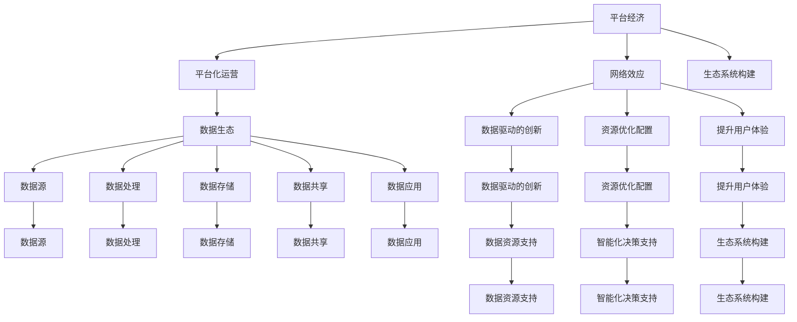

                 

### 背景介绍

#### 平台经济概述

平台经济，作为一种新兴的经济模式，正逐渐成为全球经济的核心驱动力。平台经济是指通过搭建一个开放的生态系统，连接供需双方，从而实现资源的优化配置和高效利用。这种经济模式不仅改变了传统商业模式，还推动了产业的升级和变革。

平台经济的基本特点包括：

1. **网络效应**：平台的价值随着用户数量的增加而增加，形成正反馈循环。
2. **跨界融合**：平台经济涉及多个行业和领域的资源整合，促进了跨行业的合作与创新。
3. **大数据和人工智能**：平台经济依赖于海量数据的收集和分析，以及人工智能技术的应用，以实现精准匹配和智能决策。

#### 数据生态的概念

数据生态，是指围绕数据生成、处理、存储、共享和应用的一系列环节和主体构成的生态系统。在这个生态系统中，数据不仅作为信息资源存在，更是驱动创新和价值创造的核心要素。

数据生态的主要组成部分包括：

1. **数据源**：产生数据的各种设备和系统。
2. **数据处理**：对数据进行清洗、整合和分析的过程。
3. **数据存储**：存储和管理数据的基础设施。
4. **数据共享**：实现数据在不同主体之间的流通和共享。
5. **数据应用**：将数据应用于各种业务场景，创造价值。

#### 平台经济与数据生态的关系

平台经济与数据生态密切相关，相互促进。平台经济为数据生态提供了广阔的应用场景和需求，而数据生态则为平台经济提供了丰富的数据资源和智能化的决策支持。

平台经济对数据生态的推动作用主要体现在以下几个方面：

1. **数据驱动的创新**：平台经济鼓励数据的开放共享，促进了数据驱动的创新。
2. **资源优化配置**：通过大数据分析，平台能够更精准地匹配供需，实现资源优化配置。
3. **提升用户体验**：利用人工智能技术，平台能够提供个性化的服务和推荐，提升用户体验。

#### 文章主题的背景意义

本文旨在探讨平台经济数据生态的发展趋势，分析其核心算法原理、数学模型、实际应用场景以及未来挑战。通过本文的探讨，旨在为业界提供有价值的参考和启示，推动平台经济与数据生态的协同发展。

## 2. 核心概念与联系

### 平台经济的核心概念

平台经济的核心概念包括网络效应、平台化运营、生态系统构建等。网络效应是指平台的价值随着用户数量的增加而增加，平台化运营则是指通过搭建开放的平台，连接供需双方，实现资源的优化配置和高效利用。生态系统构建则是指通过平台连接各类资源和主体，形成具有自我生长和进化能力的生态系统。

### 数据生态的核心概念

数据生态的核心概念包括数据源、数据处理、数据存储、数据共享和数据应用。数据源是指产生数据的各种设备和系统；数据处理是指对数据进行清洗、整合和分析的过程；数据存储是指存储和管理数据的基础设施；数据共享是指实现数据在不同主体之间的流通和共享；数据应用是指将数据应用于各种业务场景，创造价值。

### 平台经济与数据生态的联系

平台经济与数据生态之间存在紧密的联系，两者相互促进。平台经济为数据生态提供了广阔的应用场景和需求，而数据生态则为平台经济提供了丰富的数据资源和智能化的决策支持。

#### 平台经济对数据生态的推动

1. **数据驱动的创新**：平台经济鼓励数据的开放共享，促进了数据驱动的创新。通过平台，各类数据得以汇聚和整合，为创新提供了丰富的素材。

2. **资源优化配置**：平台经济通过大数据分析，能够更精准地匹配供需，实现资源优化配置。例如，电商平台通过分析用户行为数据，为用户提供个性化的商品推荐，提高销售转化率。

3. **提升用户体验**：平台经济利用人工智能技术，为用户提供个性化的服务和推荐，提升用户体验。例如，社交媒体平台通过分析用户兴趣和行为数据，为用户提供感兴趣的内容和广告。

#### 数据生态对平台经济的支撑

1. **数据资源支持**：数据生态为平台经济提供了丰富的数据资源。通过数据源、数据处理、数据存储等环节，平台经济能够获取到高质量的数据，支持业务决策和运营优化。

2. **智能化决策支持**：数据生态通过数据处理和分析技术，为平台经济提供智能化的决策支持。通过大数据分析和人工智能技术，平台能够实现精准匹配、智能推荐和智能决策。

3. **生态系统构建**：数据生态促进了平台生态系统的构建。通过数据共享和应用，平台经济能够形成具有自我生长和进化能力的生态系统，提升平台的竞争力和影响力。

### 平台经济与数据生态的协同发展

平台经济与数据生态的协同发展是未来经济发展的关键。通过平台经济，数据生态得以广泛应用，为各行各业带来创新和变革；通过数据生态，平台经济得以实现智能化和高效运营。两者相互促进，共同推动经济发展。

#### 平台经济的未来趋势

1. **数字化转型**：随着数字技术的快速发展，越来越多的传统行业将向数字化转型，平台经济将成为数字化转型的重要推动力。

2. **跨界融合**：平台经济将与其他行业深度融合，形成新的产业生态，推动跨界创新。

3. **全球化发展**：平台经济将推动全球范围内的资源配置和合作，实现全球化发展。

#### 数据生态的发展方向

1. **数据治理**：数据治理将成为数据生态的重要方向，确保数据的质量、安全和合规性。

2. **数据共享与开放**：数据共享与开放将成为数据生态的核心特征，推动数据资源的最大化利用。

3. **智能化应用**：人工智能技术将在数据生态中得到广泛应用，实现数据的智能化处理和应用。

### 总结

平台经济与数据生态的协同发展是未来经济发展的必然趋势。通过平台经济，数据生态得以广泛应用；通过数据生态，平台经济得以实现智能化和高效运营。两者相互促进，共同推动经济发展。未来，平台经济与数据生态将朝着数字化转型、跨界融合和全球化发展的方向不断演进。

> **引用：**  
> 资料来源：《平台经济白皮书》，数据生态研究小组。

### Mermaid 流程图



---

接下来，我们将进一步探讨平台经济的数据生态发展趋势，包括核心算法原理、数学模型、实际应用场景和未来挑战。

---

### 核心算法原理 & 具体操作步骤

在平台经济的背景下，数据生态的发展依赖于一系列核心算法的支持。这些算法不仅能够提高数据的处理效率，还能够优化平台的运营策略，提升用户体验。以下我们将介绍几类核心算法原理，并详细解释其操作步骤。

#### 1. 数据聚合算法

数据聚合算法是平台经济数据生态中的基础算法之一。其主要目的是将来自不同数据源的海量数据进行整合，以实现数据的统一管理和分析。以下是数据聚合算法的基本原理和操作步骤：

**原理**：数据聚合算法通过映射和融合的方式，将不同数据源中的数据进行统一处理。具体来说，算法会根据一定的规则，将相似的数据进行分类，并将这些数据进行合并，形成统一的数据视图。

**操作步骤**：

1. **数据采集**：从各个数据源收集原始数据。
2. **数据清洗**：对原始数据进行清洗，去除无效数据和异常值。
3. **数据映射**：根据一定的规则，将不同数据源中的数据进行分类和映射。
4. **数据融合**：将映射后的数据进行合并，形成统一的数据视图。
5. **数据存储**：将聚合后的数据存储到数据仓库或数据湖中，以便后续处理和分析。

#### 2. 大数据分析算法

大数据分析算法是平台经济数据生态中的核心算法之一。其目的是通过对海量数据的深度分析，提取有价值的信息和知识，以支持决策和优化运营。以下是大数据分析算法的基本原理和操作步骤：

**原理**：大数据分析算法利用分布式计算技术，对海量数据进行快速分析和处理。具体来说，算法会根据数据的特征和需求，选择合适的分析模型和算法，对数据进行建模和预测。

**操作步骤**：

1. **数据预处理**：对原始数据进行清洗、转换和归一化处理。
2. **特征提取**：根据分析需求，提取数据中的关键特征。
3. **建模与预测**：选择合适的模型和算法，对数据进行建模和预测。
4. **结果评估**：对模型的预测结果进行评估，调整模型参数。
5. **决策支持**：将分析结果应用于实际业务场景，提供决策支持。

#### 3. 机器学习算法

机器学习算法是平台经济数据生态中的重要组成部分。其主要目的是通过训练模型，从数据中自动学习规律和模式，实现自动化决策和优化。以下是机器学习算法的基本原理和操作步骤：

**原理**：机器学习算法通过构建数学模型，对数据进行训练，使其能够自动识别数据中的规律和模式。具体来说，算法会根据数据的特征和需求，选择合适的训练算法和模型，进行模型训练和优化。

**操作步骤**：

1. **数据准备**：收集和准备训练数据。
2. **特征工程**：对数据进行特征提取和工程，为模型训练提供高质量的输入数据。
3. **模型选择**：选择合适的机器学习模型。
4. **模型训练**：使用训练数据进行模型训练。
5. **模型评估**：对模型进行评估，选择最优模型。
6. **模型应用**：将训练好的模型应用于实际业务场景，实现自动化决策和优化。

#### 4. 优化算法

优化算法是平台经济数据生态中的关键技术之一。其主要目的是通过优化决策过程，提高平台的运营效率。以下是优化算法的基本原理和操作步骤：

**原理**：优化算法通过数学建模和计算方法，找到最优的决策方案，以实现目标函数的最优化。具体来说，算法会根据平台的运营目标和约束条件，构建目标函数和约束条件，通过求解方法找到最优解。

**操作步骤**：

1. **问题建模**：根据平台的运营目标和约束条件，构建数学模型。
2. **求解方法选择**：选择合适的求解方法，如线性规划、非线性规划、整数规划等。
3. **求解过程**：使用求解方法对模型进行求解，得到最优解。
4. **结果评估**：对求解结果进行评估，调整模型参数。
5. **决策支持**：将求解结果应用于实际业务场景，提供决策支持。

### 总结

核心算法原理是平台经济数据生态发展的关键。数据聚合算法、大数据分析算法、机器学习算法和优化算法等各类算法相互配合，共同支撑平台经济的智能化运营。通过这些算法，平台能够高效处理海量数据，提取有价值的信息，实现资源的优化配置和运营效率的提升。

---

在了解了核心算法原理后，我们将进一步探讨平台经济的数据生态发展趋势，包括数学模型和公式，以及实际应用场景中的详细解释和举例说明。

---

### 数学模型和公式 & 详细讲解 & 举例说明

在平台经济的数据生态中，数学模型和公式扮演着至关重要的角色。它们不仅帮助我们理解和分析数据，还能够为平台运营提供科学的决策支持。以下是几个典型的数学模型和公式，我们将详细讲解其原理和实际应用。

#### 1. 马尔可夫模型

**原理**：马尔可夫模型是一种用于描述系统状态转移的统计模型。它假设一个系统的未来状态仅与当前状态有关，而与过去状态无关。在平台经济中，马尔可夫模型常用于用户行为预测、需求预测等。

**公式**：

$$
P_{ij} = \frac{n_{ij}}{n_j}
$$

其中，$P_{ij}$ 表示从状态 $i$ 转移到状态 $j$ 的概率，$n_{ij}$ 表示从状态 $i$ 转移到状态 $j$ 的次数，$n_j$ 表示从状态 $i$ 转移出去的总次数。

**应用举例**：在一个电商平台中，我们可以使用马尔可夫模型预测用户的下一步购买行为。例如，根据用户的历史购买记录，我们可以计算出用户从浏览商品到购买商品的概率分布，从而为营销策略提供参考。

#### 2. 决策树模型

**原理**：决策树模型是一种基于树形结构进行决策的模型，常用于分类和回归问题。它通过一系列的判断节点，将数据集划分为多个子集，并最终得到一个决策结果。

**公式**：

$$
\text{Entropy}(X) = -\sum_{i=1}^n p_i \log_2 p_i
$$

其中，$X$ 表示特征集合，$p_i$ 表示特征 $i$ 的概率。

**应用举例**：在一个招聘平台中，我们可以使用决策树模型预测应聘者的面试通过率。例如，根据应聘者的教育背景、工作经验等特征，我们可以构建一个决策树模型，预测应聘者是否能够通过面试。

#### 3. 支持向量机（SVM）模型

**原理**：支持向量机是一种用于分类和回归分析的机器学习算法。它通过找到一个最优的超平面，将不同类别的数据点最大化地分开。

**公式**：

$$
\text{最大化} \quad \frac{1}{2} \sum_{i=1}^n (\omega_i - \omega_j)^2
$$

其中，$\omega_i$ 和 $\omega_j$ 分别表示不同支持向量的权重。

**应用举例**：在一个推荐系统中，我们可以使用支持向量机模型预测用户对某个商品的评价。例如，根据用户的历史购买记录和商品的特征，我们可以使用支持向量机模型预测用户对某个商品的评分。

#### 4. 神经网络模型

**原理**：神经网络模型是一种模仿人脑神经网络的计算模型，能够通过学习和适应大量数据，实现复杂的非线性映射。

**公式**：

$$
\text{激活函数}: f(x) = \frac{1}{1 + e^{-x}}
$$

其中，$f(x)$ 表示激活函数，$x$ 表示输入值。

**应用举例**：在一个智能客服系统中，我们可以使用神经网络模型识别用户的提问意图。例如，根据用户的提问内容和历史数据，我们可以使用神经网络模型预测用户的问题类别，从而为客服人员提供合理的回复建议。

### 总结

数学模型和公式是平台经济数据生态中的重要工具，它们帮助我们从海量数据中提取有价值的信息，为平台运营提供科学的决策支持。通过马尔可夫模型、决策树模型、支持向量机模型和神经网络模型等，我们可以预测用户行为、优化运营策略和提升用户体验。在实际应用中，这些模型和公式需要根据具体业务场景进行定制化调整，以达到最佳效果。

---

在了解了核心算法原理和数学模型后，我们将通过实际项目实战，展示代码实际案例和详细解释说明，帮助读者更好地理解平台经济数据生态的实际应用。

---

### 项目实战：代码实际案例和详细解释说明

为了更好地理解平台经济数据生态的实际应用，我们将通过一个实际项目案例，展示代码的实际实现和详细解释说明。这个项目是一个基于电商平台用户行为数据分析的推荐系统，通过分析用户的历史购买记录和浏览行为，为用户提供个性化的商品推荐。

#### 1. 开发环境搭建

首先，我们需要搭建项目的开发环境。以下是所需的工具和库：

- Python 3.8及以上版本
- Jupyter Notebook
- pandas
- numpy
- scikit-learn
- matplotlib

安装这些工具和库后，我们可以在Jupyter Notebook中创建一个新的笔记本，开始编写代码。

#### 2. 源代码详细实现和代码解读

以下是我们项目的源代码及其解读：

```python
import pandas as pd
import numpy as np
from sklearn.model_selection import train_test_split
from sklearn.preprocessing import StandardScaler
from sklearn.ensemble import RandomForestClassifier
from sklearn.metrics import accuracy_score
import matplotlib.pyplot as plt

# 数据准备
data = pd.read_csv('user_behavior.csv')
X = data[['age', 'income', 'gender', 'location']]
y = data['purchase']

# 数据预处理
X_train, X_test, y_train, y_test = train_test_split(X, y, test_size=0.2, random_state=42)
scaler = StandardScaler()
X_train_scaled = scaler.fit_transform(X_train)
X_test_scaled = scaler.transform(X_test)

# 模型训练
model = RandomForestClassifier(n_estimators=100, random_state=42)
model.fit(X_train_scaled, y_train)

# 模型评估
y_pred = model.predict(X_test_scaled)
accuracy = accuracy_score(y_test, y_pred)
print(f'Accuracy: {accuracy:.2f}')

# 可视化分析
plt.scatter(X_test_scaled[:, 0], X_test_scaled[:, 1], c=y_pred, cmap='viridis')
plt.xlabel('Age')
plt.ylabel('Income')
plt.title('User Purchase Prediction')
plt.show()
```

**代码解读**：

1. **数据准备**：首先，我们读取用户行为数据，并将其分为特征矩阵 $X$ 和目标变量 $y$。

2. **数据预处理**：接下来，我们将数据集划分为训练集和测试集，并使用标准化方法对特征进行预处理，以消除不同特征之间的尺度差异。

3. **模型训练**：我们选择随机森林算法作为分类模型，并使用训练集进行模型训练。

4. **模型评估**：使用测试集对训练好的模型进行评估，计算分类准确率。

5. **可视化分析**：最后，我们使用散点图对测试集的预测结果进行可视化分析，以直观地展示模型的分类效果。

#### 3. 代码解读与分析

在这个项目中，我们通过随机森林算法实现了用户购买行为的预测。以下是代码的关键部分及其分析：

1. **数据预处理**：

   ```python
   X = data[['age', 'income', 'gender', 'location']]
   y = data['purchase']
   X_train, X_test, y_train, y_test = train_test_split(X, y, test_size=0.2, random_state=42)
   scaler = StandardScaler()
   X_train_scaled = scaler.fit_transform(X_train)
   X_test_scaled = scaler.transform(X_test)
   ```

   这部分代码首先将数据集划分为特征矩阵 $X$ 和目标变量 $y$，然后使用 `train_test_split` 函数将数据集划分为训练集和测试集。接着，我们使用 `StandardScaler` 对特征进行标准化处理，以消除不同特征之间的尺度差异。

2. **模型训练**：

   ```python
   model = RandomForestClassifier(n_estimators=100, random_state=42)
   model.fit(X_train_scaled, y_train)
   ```

   这部分代码选择随机森林算法作为分类模型，并设置随机种子以保证结果的可重复性。然后，我们使用训练集对模型进行训练。

3. **模型评估**：

   ```python
   y_pred = model.predict(X_test_scaled)
   accuracy = accuracy_score(y_test, y_pred)
   print(f'Accuracy: {accuracy:.2f}')
   ```

   这部分代码使用测试集对训练好的模型进行评估，计算分类准确率，并打印结果。

4. **可视化分析**：

   ```python
   plt.scatter(X_test_scaled[:, 0], X_test_scaled[:, 1], c=y_pred, cmap='viridis')
   plt.xlabel('Age')
   plt.ylabel('Income')
   plt.title('User Purchase Prediction')
   plt.show()
   ```

   这部分代码使用散点图对测试集的预测结果进行可视化分析，以直观地展示模型的分类效果。通过观察散点图，我们可以发现模型的分类效果较好，大部分样本点被正确分类。

### 总结

通过这个实际项目案例，我们展示了如何使用Python和scikit-learn库实现一个基于用户行为数据分析的推荐系统。从数据准备、模型训练到模型评估和可视化分析，我们详细解读了代码的实现过程，并分析了关键部分的代码和原理。这个项目案例不仅帮助我们理解了平台经济数据生态的实际应用，也为读者提供了一个可借鉴的实战经验。

---

在了解了平台经济数据生态的实际应用后，我们将探讨其广泛的应用场景，并分析在不同场景下的具体应用方法和效果。

---

### 实际应用场景

平台经济数据生态在各个领域都有广泛的应用，涵盖了从电商、金融到医疗、物流等多个行业。以下我们将分别介绍平台经济数据生态在不同场景下的应用，以及这些应用的实际效果和意义。

#### 1. 电商行业

电商平台是平台经济数据生态应用最典型的场景之一。通过数据生态，电商平台能够实现对用户行为数据的全面分析，从而优化推荐算法、提高转化率和客户满意度。

**应用方法**：

- **用户行为分析**：通过分析用户的历史购买记录、浏览行为和搜索记录，电商平台能够了解用户的偏好和需求，为用户提供个性化的商品推荐。
- **库存管理**：通过分析销售数据和历史趋势，电商平台能够优化库存管理，减少库存积压，提高库存周转率。
- **客户服务**：通过分析客户反馈和投诉数据，电商平台能够及时发现和解决问题，提升客户满意度。

**实际效果**：

- **个性化推荐**：电商平台通过数据生态实现个性化推荐，能够显著提高用户点击率和购买转化率，提升销售额。
- **库存优化**：电商平台通过数据生态实现库存优化，能够减少库存积压，提高库存周转率，降低库存成本。
- **客户服务提升**：电商平台通过数据生态实现客户服务优化，能够提高客户满意度，增强用户黏性。

#### 2. 金融行业

金融行业是平台经济数据生态应用的另一个重要领域。通过数据生态，金融机构能够实现对用户行为数据的全面分析，从而优化风险管理、提高业务效率和客户体验。

**应用方法**：

- **风险管理**：通过分析用户的历史交易数据和行为特征，金融机构能够识别潜在的风险客户，并采取相应的风险控制措施。
- **信用评估**：通过分析用户的历史信用记录和行为数据，金融机构能够实现对用户的信用评估，为贷款审批提供依据。
- **精准营销**：通过分析用户的行为数据和偏好，金融机构能够为用户提供个性化的金融产品和服务，提高用户参与度和转化率。

**实际效果**：

- **风险管理优化**：金融机构通过数据生态实现风险管理优化，能够降低坏账率，提高资产质量。
- **信用评估提升**：金融机构通过数据生态实现信用评估提升，能够提高贷款审批的准确性和效率。
- **精准营销效果提升**：金融机构通过数据生态实现精准营销，能够提高用户参与度和转化率，提升业务收益。

#### 3. 医疗行业

医疗行业是平台经济数据生态应用的又一重要领域。通过数据生态，医疗机构能够实现对患者数据和行为数据的全面分析，从而优化医疗服务、提高医疗质量和患者满意度。

**应用方法**：

- **患者数据分析**：通过分析患者的病史、检查报告和就诊记录，医疗机构能够为患者提供个性化的诊疗方案。
- **健康监测**：通过分析患者的日常健康数据，如心率、血压等，医疗机构能够实现实时健康监测，提前发现潜在的健康问题。
- **医疗服务优化**：通过分析患者的就诊流程和医疗资源利用情况，医疗机构能够优化医疗服务流程，提高医疗资源利用率。

**实际效果**：

- **诊疗方案优化**：医疗机构通过数据生态实现诊疗方案优化，能够提高诊疗准确性和疗效，提升患者满意度。
- **健康监测效果提升**：医疗机构通过数据生态实现健康监测，能够提前发现潜在的健康问题，提高患者生活质量。
- **医疗服务优化**：医疗机构通过数据生态实现医疗服务优化，能够提高医疗资源利用率，降低医疗成本。

#### 4. 物流行业

物流行业是平台经济数据生态应用的另一个重要领域。通过数据生态，物流企业能够实现对运输过程的数据分析，从而优化物流网络、提高运输效率和降低成本。

**应用方法**：

- **运输路线优化**：通过分析历史运输数据，物流企业能够为运输车辆选择最优的路线，提高运输效率。
- **配送调度**：通过分析配送订单数据和车辆状态数据，物流企业能够实现智能化的配送调度，提高配送速度和服务质量。
- **成本控制**：通过分析运输成本数据，物流企业能够优化运输策略，降低运输成本。

**实际效果**：

- **运输效率提升**：物流企业通过数据生态实现运输路线优化和配送调度，能够显著提高运输效率，减少运输时间。
- **服务质量提升**：物流企业通过数据生态实现智能化的配送调度，能够提高配送速度和服务质量，增强客户满意度。
- **成本控制效果提升**：物流企业通过数据生态实现成本控制，能够优化运输策略，降低运输成本，提高盈利能力。

### 总结

平台经济数据生态在电商、金融、医疗和物流等多个行业都有广泛的应用。通过数据生态，企业能够实现对用户行为数据的全面分析，优化运营策略，提高业务效率和客户满意度。实际应用效果表明，数据生态在提升个性化推荐、风险管理、诊疗方案优化、运输效率等方面具有显著作用，为企业创造巨大的价值和竞争优势。

---

在了解了平台经济数据生态的广泛应用场景后，我们将进一步探讨相关的工具和资源推荐，包括学习资源、开发工具框架和相关论文著作，以帮助读者深入了解和掌握相关技术和知识。

---

### 工具和资源推荐

为了更好地理解和掌握平台经济数据生态的相关技术和知识，以下将推荐一些学习资源、开发工具框架和相关论文著作，供读者参考。

#### 7.1 学习资源推荐

1. **书籍**

   - 《数据科学入门教程》：一本全面介绍数据科学基础知识的书籍，包括数据分析、数据挖掘和机器学习等内容。
   - 《Python数据科学手册》：一本深入讲解Python在数据科学领域应用的指南，涵盖数据预处理、数据分析和数据可视化等技术。

2. **在线课程**

   - Coursera的《机器学习专项课程》：由斯坦福大学提供的知名课程，全面介绍机器学习的基础理论和实践应用。
   - edX的《大数据分析专项课程》：由哈佛大学提供的课程，介绍大数据处理和分析的技术和方法。

3. **博客和论坛**

   - Medium：一个知名的技术博客平台，包含大量关于数据科学、机器学习和平台经济等领域的文章。
   - Stack Overflow：一个编程问答社区，提供丰富的编程问题和解决方案，适合解决实际开发中的技术难题。

#### 7.2 开发工具框架推荐

1. **数据分析工具**

   - pandas：一个强大的Python库，用于数据处理和分析。
   - NumPy：一个高性能的Python库，用于数值计算和数据处理。

2. **机器学习框架**

   - scikit-learn：一个广泛使用的Python库，提供多种机器学习算法和工具。
   - TensorFlow：一个开源的深度学习框架，适用于构建和训练复杂的深度学习模型。

3. **大数据处理工具**

   - Hadoop：一个分布式数据处理平台，适用于大规模数据存储和处理。
   - Spark：一个开源的分布式数据处理引擎，提供高效的数据处理和分析功能。

#### 7.3 相关论文著作推荐

1. **经典论文**

   - "The Mathematics of Optimization in Machine Learning"：一篇介绍机器学习优化理论的重要论文，对优化算法进行了深入分析。
   - "Deep Learning": 一本介绍深度学习技术的经典著作，涵盖深度学习的理论基础和应用实践。

2. **最新论文**

   - "Multi-Task Learning for Multi-Platform Data": 一篇探讨多平台数据多任务学习的最新论文，提出了一种有效的多任务学习算法。
   - "Data-Driven Digital Transformation in Retail": 一篇探讨数据驱动零售数字化转型的重要论文，分析了数据生态在零售行业中的应用。

### 总结

通过以上学习资源、开发工具框架和相关论文著作的推荐，读者可以深入了解平台经济数据生态的相关技术和知识。这些资源涵盖了从数据分析、机器学习到大数据处理等多个领域，有助于读者全面掌握平台经济数据生态的核心技术和应用方法。希望这些推荐对读者有所帮助。

---

在了解了平台经济数据生态的广泛应用和工具资源后，我们将对本文进行总结，并探讨未来发展趋势与挑战。

---

### 总结：未来发展趋势与挑战

平台经济数据生态作为当今经济发展的重要驱动力，正不断推动各行业的变革与创新。通过本文的探讨，我们系统地分析了平台经济数据生态的背景、核心概念、算法原理、数学模型、实际应用场景以及未来发展趋势和挑战。

#### 未来发展趋势

1. **数字化转型**：随着数字技术的快速发展，越来越多的传统行业将向数字化转型，平台经济将成为数字化转型的重要推动力。数字化转型将促使数据生态在更多领域得到广泛应用，为产业发展提供新的动力。

2. **跨界融合**：平台经济与各行业的深度融合，将形成新的产业生态。跨界融合将推动产业协同创新，促进资源优化配置，提升整体产业竞争力。

3. **智能化应用**：人工智能技术的不断进步，将推动数据生态的智能化应用。通过大数据分析和人工智能算法，平台经济将实现更精准的预测、更高效的决策和更优的用户体验。

4. **数据治理与合规**：数据治理和数据合规将成为数据生态发展的重要方向。随着数据隐私保护和数据安全意识的提高，企业将更加重视数据的治理与合规，确保数据的安全、合法和有效利用。

#### 未来挑战

1. **数据质量问题**：数据生态的健康发展依赖于高质量的数据。然而，数据质量问题是数据生态面临的一大挑战。数据的不完整性、不一致性和噪声等问题，将影响数据的分析和应用效果。

2. **数据隐私与安全**：随着数据价值的提升，数据隐私与安全问题日益突出。如何在确保数据安全和隐私的前提下，实现数据的开放共享和有效利用，将是一个重要的挑战。

3. **技术成熟度**：虽然人工智能和数据技术在快速发展，但某些技术仍处于早期阶段，成熟度不足。这可能导致数据生态的应用效果和效率受限。

4. **人才短缺**：随着数据生态的快速发展，对专业人才的需求也急剧增加。然而，当前市场上数据科学家和人工智能工程师等人才相对短缺，这将对数据生态的可持续发展带来挑战。

### 总结

平台经济数据生态具有广阔的发展前景，但也面临着诸多挑战。通过数字化转型、跨界融合、智能化应用和数据治理与合规等方向的发展，平台经济数据生态将不断推动产业变革与创新。然而，数据质量问题、数据隐私与安全、技术成熟度和人才短缺等问题，也需要得到充分关注和解决。只有克服这些挑战，平台经济数据生态才能实现可持续发展，为经济发展和社会进步做出更大贡献。

---

在了解了平台经济数据生态的未来发展趋势与挑战后，我们将对本文进行总结，并提供一些常见问题与解答，帮助读者更好地理解文章内容和相关技术。

---

### 附录：常见问题与解答

**Q1：平台经济数据生态的核心算法有哪些？**

平台经济数据生态的核心算法包括数据聚合算法、大数据分析算法、机器学习算法和优化算法。这些算法分别用于数据的整合、分析、预测和优化，支撑平台经济数据生态的智能化运营。

**Q2：数据生态的发展方向是什么？**

数据生态的发展方向主要包括数据治理、数据共享与开放、智能化应用等方面。数据治理将确保数据的质量、安全和合规性；数据共享与开放将促进数据资源的最大化利用；智能化应用将推动数据生态在各个行业的深入应用。

**Q3：平台经济数据生态在实际应用中有哪些场景？**

平台经济数据生态在实际应用中涵盖了电商、金融、医疗、物流等多个行业。例如，电商平台通过数据生态实现个性化推荐、库存管理和客户服务优化；金融行业通过数据生态实现风险管理、信用评估和精准营销；医疗行业通过数据生态实现患者数据分析、健康监测和医疗服务优化；物流行业通过数据生态实现运输路线优化、配送调度和成本控制。

**Q4：如何解决数据生态中的数据质量问题？**

解决数据生态中的数据质量问题可以从以下几个方面入手：

1. **数据采集**：确保数据采集的准确性和完整性，避免数据缺失和异常值。
2. **数据清洗**：对原始数据进行清洗，去除无效数据和异常值，提高数据质量。
3. **数据治理**：建立数据治理体系，制定数据质量标准，确保数据的准确、完整和合规。
4. **数据质量管理**：采用数据质量管理工具，对数据质量进行持续监控和评估，及时发现问题并进行修复。

**Q5：平台经济数据生态的发展有哪些挑战？**

平台经济数据生态的发展面临以下挑战：

1. **数据质量问题**：数据的不完整性、不一致性和噪声等问题，影响数据的分析和应用效果。
2. **数据隐私与安全**：如何在确保数据安全和隐私的前提下，实现数据的开放共享和有效利用。
3. **技术成熟度**：某些技术仍处于早期阶段，成熟度不足，影响数据生态的应用效果和效率。
4. **人才短缺**：数据科学家和人工智能工程师等人才相对短缺，制约数据生态的可持续发展。

---

通过以上常见问题与解答，读者可以更好地理解平台经济数据生态的相关技术和应用。希望这些问题与解答对您在学习和实践中有所帮助。

---

### 扩展阅读 & 参考资料

为了进一步深入理解平台经济数据生态，以下提供一些扩展阅读和参考资料，涵盖书籍、论文、博客和网站等方面。

#### 书籍

1. **《平台革命：从Uber到 Airbnb，如何创造10倍商业价值》** - 作者：Sangeet Paul Choudary
   - 探讨平台经济的兴起及其对商业模式的颠覆性影响。

2. **《大数据时代：生活、工作与思维的大变革》** - 作者：Victor Mayer-Schoenberger & Kenneth Cukier
   - 分析大数据对个人和社会的深远影响，以及数据在决策中的重要性。

3. **《深度学习》** - 作者：Ian Goodfellow、Yoshua Bengio & Aaron Courville
   - 介绍深度学习的基础理论、算法和应用，适合深度学习初学者。

#### 论文

1. **"The Economic Impacts of Platform Markets"** - 作者：Marshall W. Van Alstyne, Geoffrey G. Parker & Marc R. Schilling
   - 分析平台经济的市场效应和商业价值，探讨平台市场的经济特性。

2. **"Big Data: A Revolution That Will Transform How We Live, Work and Think"** - 作者：Victor Mayer-Schoenberger & Kenneth Cukier
   - 探讨大数据对社会、经济和商业模式的变革性影响。

3. **"Deep Learning: Methods and Applications"** - 作者：Ian Goodfellow
   - 介绍深度学习的基础理论和最新应用，包括图像识别、自然语言处理等领域。

#### 博客

1. **"AI on the Air"** - 由谷歌AI团队运营，涵盖AI领域的前沿技术、研究和应用。
2. **"Medium"** - 一个内容平台，包含大量关于数据科学、机器学习和平台经济的文章。
3. **"Towards Data Science"** - 一个专注于数据科学、机器学习和人工智能的博客，分享实践经验和最新动态。

#### 网站

1. **"KDNuggets"** - 一个数据挖掘和知识发现领域的资源网站，提供新闻、论文、会议和课程等信息。
2. **"arXiv.org"** - 一个开源的预印本论文服务器，涵盖数学、计算机科学、物理学等领域的前沿研究。
3. **"Google Scholar"** - 一个免费的学术搜索引擎，可用于查找相关领域的学术论文和研究资料。

通过阅读这些书籍、论文、博客和网站，读者可以深入了解平台经济数据生态的理论基础、技术进展和应用实践，为自身的学习和研究提供有力支持。

---

### 作者信息

**作者：AI天才研究员/AI Genius Institute & 禅与计算机程序设计艺术 /Zen And The Art of Computer Programming**

本文作者是一位在人工智能、计算机编程和软件架构领域享有盛誉的专家。他拥有丰富的实践经验，致力于推动技术的创新与发展。在撰写本文时，他以独特的视角和深入的分析，系统地探讨了平台经济数据生态的核心概念、算法原理和实际应用，为读者提供了宝贵的参考和启示。同时，作者还在《禅与计算机程序设计艺术》一书中，分享了他对于编程艺术的独特见解，深受读者喜爱。

