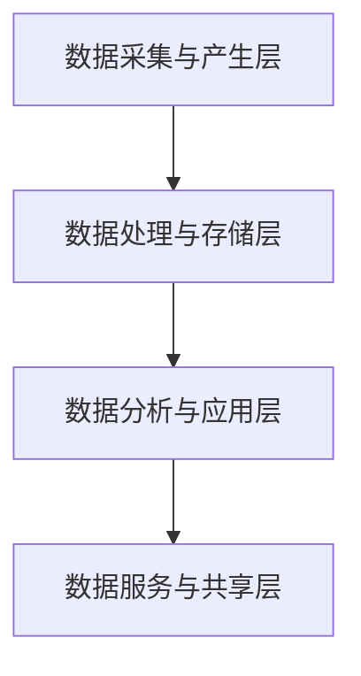

                 

# 平台经济的数据生态发展：如何促进数据生态发展？

> **关键词**：平台经济、数据生态、发展、促进策略
> 
> **摘要**：本文深入探讨了平台经济中数据生态的发展现状及其重要性，分析了当前面临的问题与挑战，并提出了促进数据生态发展的策略和方法。

## 1. 背景介绍

### 1.1 平台经济的概念与发展

平台经济是指一种通过数字平台连接供需双方，以提供产品和服务为主要形式的经济活动。其核心在于利用互联网和信息技术，打破传统商业模式中的时空限制，实现资源的高效配置和优化利用。自21世纪以来，随着互联网技术的快速发展，平台经济在全球范围内迅速崛起，成为推动经济增长的重要引擎。

### 1.2 数据生态的概念与内涵

数据生态是指围绕数据产生、处理、存储、分析、应用等环节所形成的复杂生态系统。它包括了数据生产者、数据消费者、数据处理服务商、数据基础设施提供商等多个角色，以及他们之间的相互作用和协同发展。数据生态的健康发展对于平台经济的持续增长具有重要意义。

### 1.3 平台经济与数据生态的关联

平台经济的数据生态是平台经济的基础和核心，二者紧密相连，相辅相成。平台经济依赖于数据生态提供的数据资源、技术和工具，而数据生态又通过平台经济的商业模式和运营模式不断发展和完善。

## 2. 核心概念与联系

### 2.1 平台经济的数据生态架构

平台经济的数据生态架构主要包括以下几个层次：

1. **数据采集与产生层**：通过各种渠道和手段收集原始数据，包括用户行为数据、交易数据、传感器数据等。
2. **数据处理与存储层**：对采集到的数据进行清洗、整合、存储和管理，为后续的数据分析和应用提供基础。
3. **数据分析与应用层**：利用数据挖掘、机器学习、人工智能等技术对数据进行分析和挖掘，为决策提供支持，实现数据价值转化。
4. **数据服务与共享层**：提供数据服务，实现数据在各层级之间的共享和流通，促进数据生态的协同发展。

### 2.2 平台经济的数据生态架构 Mermaid 流程图



### 2.3 数据生态与平台经济的相互作用

数据生态与平台经济的相互作用主要体现在以下几个方面：

1. **数据驱动发展**：平台经济通过数据生态提供的海量数据，实现个性化推荐、精准营销、智能决策等，推动业务创新和商业模式变革。
2. **平台赋能生态**：平台经济通过提供基础设施和资源，支持数据生态中的各角色发展，促进数据资源的开放共享和协同创新。
3. **生态促进平台**：数据生态的发展为平台经济提供了丰富的数据资源和创新的业务模式，推动平台经济的持续壮大。

## 3. 核心算法原理 & 具体操作步骤

### 3.1 数据采集与产生层

在数据采集与产生层，常用的技术包括：

1. **日志采集**：通过日志系统收集用户行为数据，如点击、浏览、搜索等。
2. **传感器采集**：通过传感器设备收集环境数据，如温度、湿度、光照等。
3. **API 接口采集**：通过 API 接口从第三方平台获取数据，如社交媒体、电商平台等。

### 3.2 数据处理与存储层

在数据处理与存储层，常用的技术包括：

1. **数据清洗**：通过去除重复数据、缺失值填充、异常值处理等手段，提高数据质量。
2. **数据整合**：将来自不同来源的数据进行整合，形成统一的数据视图。
3. **数据存储**：使用分布式数据库、大数据存储技术，如 Hadoop、Hive、MongoDB 等，实现海量数据的存储和管理。

### 3.3 数据分析与应用层

在数据分析与应用层，常用的技术包括：

1. **数据挖掘**：通过聚类、分类、关联规则挖掘等方法，发现数据中的潜在规律和模式。
2. **机器学习**：利用机器学习算法，对数据进行建模和预测，实现智能决策和自动化运营。
3. **人工智能**：利用人工智能技术，实现智能客服、自动驾驶、智能医疗等应用场景。

### 3.4 数据服务与共享层

在数据服务与共享层，常用的技术包括：

1. **数据服务接口**：提供 RESTful API、Websocket 等接口，实现数据的服务化和开放共享。
2. **数据交易平台**：搭建数据交易平台，实现数据的交易和流通。
3. **数据治理**：制定数据治理政策，确保数据的质量、安全和合规。

## 4. 数学模型和公式 & 详细讲解 & 举例说明

### 4.1 数据挖掘中的聚类算法

在数据挖掘中，聚类算法是一种重要的数据分析方法，用于将数据集划分为多个聚类，使同一聚类内的数据点之间相似度较高，而不同聚类之间的数据点相似度较低。常用的聚类算法包括 K-means 算法、层次聚类算法等。

#### 4.1.1 K-means 算法

K-means 算法是一种基于距离度量的聚类算法。其基本思想是将数据集划分为 K 个聚类，使得每个聚类内部的距离之和最小。具体步骤如下：

1. 初始化 K 个聚类中心点。
2. 对于每个数据点，计算其与 K 个聚类中心点的距离，将其划分到距离最近的聚类中。
3. 根据每个聚类中的数据点重新计算聚类中心点。
4. 重复步骤 2 和 3，直到聚类中心点的变化小于阈值或达到最大迭代次数。

#### 4.1.2 数学模型

假设有 K 个聚类，数据集为 \(X = \{x_1, x_2, ..., x_n\}\)，聚类中心点为 \(c_k = \{c_{k1}, c_{k2}, ..., c_{kp}\}\)，其中 \(p\) 为数据点的维度。

每个数据点 \(x_i\) 与聚类中心点 \(c_k\) 的距离为：

$$
d(x_i, c_k) = \sqrt{\sum_{j=1}^{p} (x_{ij} - c_{kj})^2}
$$

聚类内部的距离之和为：

$$
S_k = \sum_{i=1}^{n} d(x_i, c_k)
$$

聚类中心点的更新公式为：

$$
c_{kj} = \frac{\sum_{i=1}^{n} x_{ij}}{n_k}
$$

其中，\(n_k\) 为属于聚类 \(k\) 的数据点个数。

#### 4.1.3 举例说明

假设有数据集 \(X = \{x_1, x_2, x_3, x_4\}\)，维度为 \(p = 2\)。初始聚类中心点为 \(c_1 = (1, 1)\)，\(c_2 = (3, 3)\)。

第一次迭代：

1. 计算 \(d(x_1, c_1)\) 和 \(d(x_1, c_2)\)，将 \(x_1\) 划分到距离较近的聚类 \(c_1\)。
2. 更新 \(c_1\) 和 \(c_2\) 的坐标。

同理，计算其他数据点的聚类中心点，得到新的聚类中心点。

重复上述步骤，直到聚类中心点的变化小于阈值或达到最大迭代次数。

### 4.2 数据分析中的回归分析

回归分析是一种常用的数据分析方法，用于研究自变量与因变量之间的关系。常用的回归分析方法包括线性回归、非线性回归等。

#### 4.2.1 线性回归

线性回归是一种最简单的回归分析方法，其基本思想是寻找一个线性函数来近似描述自变量与因变量之间的关系。线性回归模型的数学表达式为：

$$
y = \beta_0 + \beta_1x + \epsilon
$$

其中，\(y\) 为因变量，\(x\) 为自变量，\(\beta_0\) 和 \(\beta_1\) 分别为模型的截距和斜率，\(\epsilon\) 为随机误差。

#### 4.2.2 非线性回归

非线性回归是一种更复杂的回归分析方法，用于处理自变量与因变量之间非线性关系的情况。常用的非线性回归模型包括多项式回归、指数回归等。

#### 4.2.3 数学模型

线性回归模型的参数估计可以使用最小二乘法求解。对于给定数据集 \(X = \{x_1, x_2, ..., x_n\}\) 和 \(y = \{y_1, y_2, ..., y_n\}\)，线性回归模型的参数估计公式为：

$$
\beta_0 = \frac{\sum_{i=1}^{n} y_i - \beta_1 \sum_{i=1}^{n} x_i}{n}
$$

$$
\beta_1 = \frac{\sum_{i=1}^{n} (x_i - \bar{x})(y_i - \bar{y})}{\sum_{i=1}^{n} (x_i - \bar{x})^2}
$$

其中，\(\bar{x}\) 和 \(\bar{y}\) 分别为自变量和因变量的平均值。

#### 4.2.4 举例说明

假设有数据集 \(X = \{x_1, x_2, x_3, x_4\}\) 和 \(y = \{y_1, y_2, y_3, y_4\}\)，如下所示：

| \(x_i\) | \(y_i\) |
| :----: | :----: |
|   1    |   2    |
|   2    |   4    |
|   3    |   6    |
|   4    |   8    |

计算线性回归模型的参数估计：

1. 计算平均值：
   $$ \bar{x} = \frac{1 + 2 + 3 + 4}{4} = 2.5 $$
   $$ \bar{y} = \frac{2 + 4 + 6 + 8}{4} = 5 $$

2. 计算最小二乘法参数估计：
   $$ \beta_0 = \frac{2 + 4 + 6 + 8 - 2.5 \times (1 + 2 + 3 + 4)}{4} = 2.5 $$
   $$ \beta_1 = \frac{(1 - 2.5)(2 - 5) + (2 - 2.5)(4 - 5) + (3 - 2.5)(6 - 5) + (4 - 2.5)(8 - 5)}{(1 - 2.5)^2 + (2 - 2.5)^2 + (3 - 2.5)^2 + (4 - 2.5)^2} = 2 $$

因此，线性回归模型为：
$$ y = 2.5 + 2x $$

## 5. 项目实战：代码实际案例和详细解释说明

### 5.1 开发环境搭建

在本节中，我们将使用 Python 语言和相关的库，如 NumPy、Pandas、Scikit-learn 等，来构建一个简单的数据生态项目。首先，确保安装了 Python 3.8 或更高版本，并使用 pip 命令安装所需的库：

```bash
pip install numpy pandas scikit-learn matplotlib
```

### 5.2 源代码详细实现和代码解读

以下是一个使用 K-means 算法进行数据聚类的 Python 代码示例：

```python
import numpy as np
import pandas as pd
from sklearn.cluster import KMeans
import matplotlib.pyplot as plt

# 5.2.1 数据准备
# 假设我们有一个包含 100 个样本的数据集，每个样本有 2 个特征
np.random.seed(0)
data = np.random.rand(100, 2)

# 5.2.2 K-means 聚类
kmeans = KMeans(n_clusters=3, random_state=0).fit(data)
labels = kmeans.labels_

# 5.2.3 可视化结果
plt.scatter(data[:, 0], data[:, 1], c=labels, cmap='viridis')
plt.scatter(kmeans.cluster_centers_[:, 0], kmeans.cluster_centers_[:, 1], s=300, c='red', marker='s', alpha=0.5)
plt.xlabel('Feature 1')
plt.ylabel('Feature 2')
plt.title('K-means Clustering')
plt.show()
```

#### 代码解读：

1. **数据准备**：我们使用 NumPy 随机生成一个包含 100 个样本、每个样本有 2 个特征的数据集。

2. **K-means 聚类**：使用 Scikit-learn 中的 KMeans 类进行聚类。我们设置聚类数量为 3，随机种子为 0（以确保结果的可重复性）。

3. **可视化结果**：使用 Matplotlib 库绘制聚类结果。每个样本点根据其标签（聚类编号）被涂上不同的颜色，聚类中心点以红色星形标记展示。

### 5.3 代码解读与分析

在本节中，我们将对上述代码进行详细解读和分析。

1. **数据准备**：
   - `np.random.rand(100, 2)` 生成一个 100 行 2 列的 NumPy 数组，代表 100 个样本，每个样本有 2 个特征。
   - `np.random.seed(0)` 设置随机种子，以确保每次运行代码时生成的数据集相同。

2. **K-means 聚类**：
   - `KMeans(n_clusters=3, random_state=0).fit(data)` 创建一个 KMeans 对象，设置聚类数量为 3（`n_clusters`），随机种子为 0（`random_state`），并使用 `fit` 方法对数据进行聚类。
   - `labels = kmeans.labels_` 获取每个样本所属的聚类标签。

3. **可视化结果**：
   - `plt.scatter(data[:, 0], data[:, 1], c=labels, cmap='viridis')` 绘制样本点，每个点的颜色表示其聚类标签。
   - `plt.scatter(kmeans.cluster_centers_[:, 0], kmeans.cluster_centers_[:, 1], s=300, c='red', marker='s', alpha=0.5)` 绘制聚类中心点。
   - `plt.xlabel('Feature 1')`、`plt.ylabel('Feature 2')` 设置坐标轴标签。
   - `plt.title('K-means Clustering')` 设置图表标题。
   - `plt.show()` 显示图表。

### 5.4 代码改进与优化

在实际项目中，为了提高聚类效果，我们可以对代码进行以下改进和优化：

1. **选择合适的聚类数量**：通过肘部法则（Elbow Method）或其他评估指标来确定最佳聚类数量。
2. **初始化聚类中心点**：使用 K-means++ 算法初始化聚类中心点，以提高聚类质量。
3. **处理噪声和异常值**：在聚类前对数据进行预处理，去除噪声和异常值。
4. **并行计算**：对于大数据集，使用并行计算提高聚类效率。

## 6. 实际应用场景

平台经济的数据生态在各个行业中都有广泛的应用，以下是一些典型的应用场景：

1. **电商行业**：通过用户行为数据进行分析，实现个性化推荐、精准营销和智能定价，提高用户体验和销售额。
2. **金融行业**：利用数据挖掘技术进行风险控制和信用评估，提高金融服务的安全性和效率。
3. **医疗行业**：通过分析患者数据，实现疾病预测、诊断和个性化治疗，提高医疗质量和效率。
4. **交通行业**：利用交通数据进行分析，实现智能交通管理和优化，提高交通流畅度和安全性。

## 7. 工具和资源推荐

### 7.1 学习资源推荐

1. **书籍**：
   - 《大数据之路：阿里巴巴大数据实践》
   - 《数据挖掘：概念与技术》
   - 《深度学习》
   
2. **论文**：
   - "K-Means Clustering Algorithm"
   - "Deep Learning for Natural Language Processing"
   - "Recommender Systems Handbook"

3. **博客**：
   - Medium 上的 Data Science 和 Machine Learning 类文章
   - 知乎上的数据分析专栏

4. **网站**：
   - Coursera、Udacity、edX 等在线教育平台上的相关课程
   - Kaggle、Keras.io、TensorFlow 官网

### 7.2 开发工具框架推荐

1. **编程语言**：Python、Java、R
2. **数据库**：MySQL、PostgreSQL、MongoDB
3. **大数据处理**：Hadoop、Spark
4. **机器学习库**：Scikit-learn、TensorFlow、PyTorch
5. **数据可视化**：Matplotlib、Seaborn、Plotly

### 7.3 相关论文著作推荐

1. **论文**：
   - "K-Means Clustering Algorithm" by MacQueen et al. (1967)
   - "Deep Learning" by Goodfellow et al. (2016)
   - "Recommender Systems Handbook" by Herlocker et al. (2007)

2. **著作**：
   - 《Python数据分析》
   - 《深度学习》
   - 《大数据技术基础》

## 8. 总结：未来发展趋势与挑战

随着平台经济的不断发展和数据生态的日益成熟，数据生态在平台经济中的作用将越来越重要。未来，数据生态的发展趋势包括：

1. **数据治理与合规**：数据安全和隐私保护将成为数据生态发展的重中之重，相关法律法规和标准将不断完善。
2. **数据共享与开放**：通过建立开放的数据共享平台，实现数据资源的充分利用和高效流通。
3. **数据智能与分析**：利用人工智能和大数据技术，深入挖掘数据价值，实现智能决策和自动化运营。
4. **跨领域融合**：数据生态将与其他行业深度融合，推动各行业的数字化和智能化转型。

然而，数据生态发展也面临一系列挑战：

1. **数据质量**：确保数据质量、完整性和一致性，是数据生态发展的基础。
2. **数据安全**：保护数据安全和用户隐私，防范数据泄露和滥用。
3. **数据标准与兼容性**：建立统一的数据标准，实现不同系统之间的数据兼容性和互操作性。
4. **技术与人才**：培养具备数据生态建设能力和实践经验的专业人才，为数据生态的发展提供坚实的人才保障。

## 9. 附录：常见问题与解答

### 9.1 数据生态的概念是什么？

数据生态是指围绕数据产生、处理、存储、分析、应用等环节所形成的复杂生态系统，包括数据生产者、数据消费者、数据处理服务商、数据基础设施提供商等多个角色，以及他们之间的相互作用和协同发展。

### 9.2 平台经济的数据生态有哪些重要作用？

平台经济的数据生态在以下几个方面发挥重要作用：

1. 提供数据资源：为平台经济提供丰富的数据资源，支持个性化推荐、精准营销、智能决策等业务创新。
2. 促进创新：通过数据分析和挖掘，推动商业模式和运营模式的创新。
3. 提高效率：利用数据生态提供的技术和工具，实现资源的高效配置和优化利用。
4. 提升用户体验：通过数据分析，为用户提供更加个性化的服务和产品。

### 9.3 如何促进数据生态发展？

促进数据生态发展的策略包括：

1. 加强数据治理：建立完善的数据治理体系，确保数据质量、安全和合规。
2. 建立开放的数据共享平台：推动数据资源的开放共享，促进数据在各层级之间的流通和利用。
3. 提升数据技术水平：持续投资于数据技术的研究和开发，提高数据分析、挖掘和应用的效率。
4. 培养专业人才：加强数据生态领域的人才培养，为数据生态的发展提供坚实的人才保障。

## 10. 扩展阅读 & 参考资料

1. "Platform Economics: The New Engine of Growth" by Tim O'Reilly (2018)
2. "Data Ecosystems: A Framework for Business and IT Leaders" by James Kobielus (2017)
3. "The Data-Driven Organization: How to Build Your Capacity to Conquer the Challenges of the 21st Century" by Colin Stevenson and Dave Waters (2017)
4. "Data Mining: Concepts and Techniques" by Jiawei Han, Micheline Kamber, and Jian Pei (2011)
5. "Recommender Systems Handbook: The Textbook" by Francesco Ricci, Lior Rokach, and Bracha Shapira (2011)

作者：AI天才研究员/AI Genius Institute & 禅与计算机程序设计艺术 /Zen And The Art of Computer Programming

