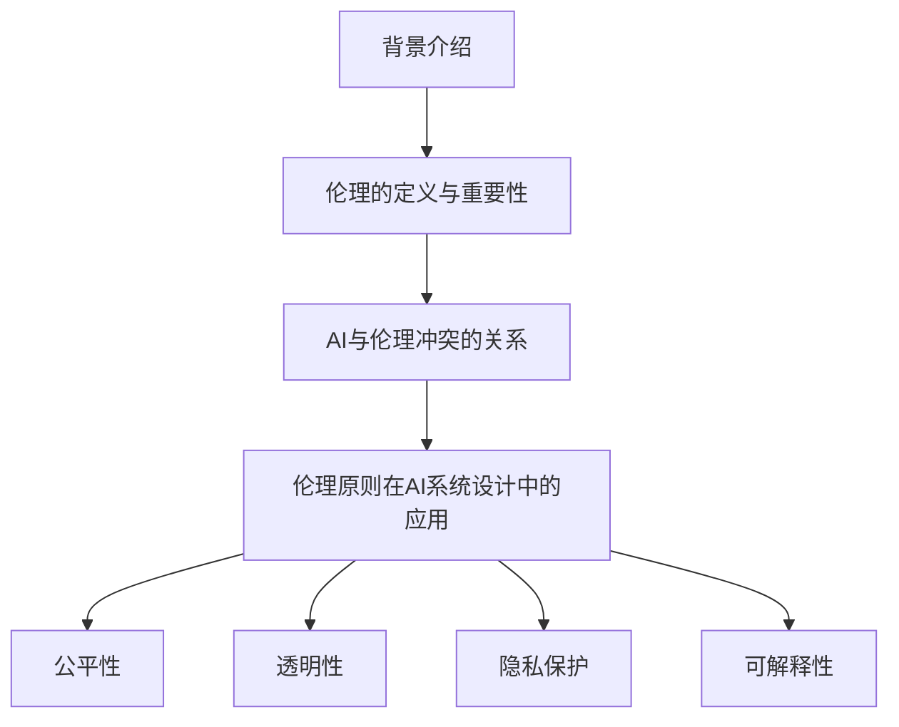

                 

### 平衡技术进步与伦理：AI的挑战

#### 关键词：人工智能，伦理，技术进步，挑战，平衡

#### 摘要：

本文探讨了人工智能（AI）技术进步带来的伦理挑战。随着AI技术的发展，如何在推动科技进步的同时，确保技术的伦理合理性和社会可接受性，成为了一个重要的议题。本文首先介绍了AI技术的背景和发展现状，然后分析了技术进步与伦理冲突的关系，最后提出了一些解决这些挑战的策略和未来研究方向。

------------------

## 1. 背景介绍

### 1.1 人工智能的定义与发展历史

人工智能（Artificial Intelligence，简称AI）是指通过计算机模拟人类智能行为的科学和技术。自20世纪50年代诞生以来，人工智能经历了多个发展阶段。

在早期，AI主要集中在规则推理和符号逻辑上，试图通过编写程序来实现逻辑推理和知识表示。然而，这种基于符号逻辑的方法在面对复杂问题时表现不佳。

随着计算能力的提高和大数据的兴起，机器学习（Machine Learning）成为了AI发展的主要方向。通过从数据中学习规律和模式，机器学习算法能够实现更为复杂的任务，如图像识别、自然语言处理等。

近年来，深度学习（Deep Learning）的发展进一步推动了AI的进步。深度学习通过多层神经网络结构，能够自动学习和提取特征，从而在许多领域取得了突破性的成果。

### 1.2 AI技术的应用领域

AI技术已经在多个领域得到广泛应用，包括：

- **医疗健康**：AI在医学影像分析、疾病预测、个性化治疗等方面展现了巨大的潜力。
- **金融**：AI在风险管理、信用评估、自动化交易等方面发挥了重要作用。
- **交通**：自动驾驶、智能交通管理、车联网等技术的快速发展，使得AI在交通领域具有广泛的应用前景。
- **制造业**：AI在智能制造、质量控制、设备维护等方面提高了生产效率和产品质量。
- **教育**：AI在教育领域的应用包括个性化学习、智能评测、教育资源优化等。

## 2. 核心概念与联系

### 2.1 伦理的定义与重要性

伦理（Ethics）是指关于道德原则和价值观的哲学研究。伦理学探讨的是人们应该如何行动，以实现善、公平和正义等目标。

在AI领域，伦理的重要性体现在以下几个方面：

- **公平性**：AI技术的应用可能导致数据偏见和算法歧视，影响社会的公平性。
- **隐私**：AI技术可能侵犯用户的隐私权，收集和处理大量的个人数据。
- **安全性**：AI系统可能受到恶意攻击，导致系统故障或数据泄露。
- **责任**：当AI系统发生错误或造成损害时，如何界定责任成为了一个重要问题。

### 2.2 AI与伦理冲突的关系

随着AI技术的发展和应用，伦理冲突逐渐显现：

- **算法偏见**：AI系统可能基于训练数据中的偏见，产生歧视性的结果。
- **隐私泄露**：AI系统在处理大量数据时，可能泄露用户的隐私信息。
- **人工智能武器化**：AI技术可能被用于开发致命性武器，引发道德和伦理问题。
- **自动化决策**：AI系统在决策过程中可能缺乏透明性，导致用户无法理解和挑战决策过程。

## 3. 核心算法原理 & 具体操作步骤

### 3.1 算法原理

为了解决AI伦理冲突问题，研究人员提出了一系列算法原理和设计原则，包括：

- **公平性**：算法应该确保对所有人公平对待，避免基于种族、性别、年龄等特征的歧视。
- **透明性**：算法的决策过程应该透明，用户可以理解和质疑决策结果。
- **隐私保护**：算法在处理数据时，应该采取措施保护用户的隐私。
- **可解释性**：算法应该能够解释其决策过程，使得用户可以理解并信任算法。

### 3.2 操作步骤

为了实现上述算法原理，以下是一些具体操作步骤：

1. **数据收集与清洗**：在训练AI模型时，应该收集高质量、多样化的数据，并确保数据的准确性。
2. **算法设计**：设计算法时，应该考虑公平性、透明性和隐私保护等伦理原则，采用公平性度量方法，如公平性指标（Fairness Metrics）。
3. **模型评估**：在评估AI模型时，除了评估准确性，还应该评估其公平性和透明性。
4. **用户反馈**：收集用户对AI系统的反馈，以便改进算法设计和决策过程。

## 4. 数学模型和公式 & 详细讲解 & 举例说明

### 4.1 数学模型

为了实现AI算法的公平性、透明性和隐私保护，研究人员提出了一系列数学模型和公式。

#### 4.1.1 公平性度量

公平性度量（Fairness Metrics）是评估AI模型公平性的方法。常见的公平性度量包括：

- **统计公平性**：满足E[error|group] = constant，对于每个群体，模型产生的错误率相同。
- **条件公平性**：满足E[error|X] = constant，模型的错误率与输入特征无关。

#### 4.1.2 透明性度量

透明性度量（Transparency Metrics）是评估AI模型透明性的方法。常见的透明性度量包括：

- **解释性模型**：如决策树、线性模型等，这些模型可以清晰地解释决策过程。
- **可视化方法**：如数据可视化、特征重要性分析等，这些方法可以帮助用户理解模型的工作原理。

#### 4.1.3 隐私保护度量

隐私保护度量（Privacy Protection Metrics）是评估AI模型隐私保护能力的指标。常见的隐私保护度量包括：

- **差分隐私**：满足对任意子集s，都有E[output|s] ≈ E[output]，即模型的输出与用户隐私信息无关。
- **隐私预算**：定义模型在处理隐私数据时，可以容忍的最大隐私泄露程度。

### 4.2 举例说明

假设我们有一个基于深度学习的学生成绩预测模型，该模型用于预测学生的考试成绩。为了确保模型的公平性、透明性和隐私保护，我们可以采取以下步骤：

1. **数据收集与清洗**：收集大量学生的考试成绩、学习习惯和背景信息，确保数据的准确性。
2. **算法设计**：采用公平性度量方法，如统计公平性，确保模型对每个群体产生的错误率相同。同时，采用决策树或线性模型等解释性模型，以便用户理解决策过程。
3. **模型评估**：在评估模型时，除了评估准确性，还应该评估其公平性和透明性。可以使用差分隐私方法，确保模型在处理学生成绩时，不会泄露用户的隐私信息。
4. **用户反馈**：收集学生对模型的反馈，以便改进算法设计和决策过程。

## 5. 项目实战：代码实际案例和详细解释说明

### 5.1 开发环境搭建

在Python编程环境中，我们需要安装以下库：

- **NumPy**：用于数学运算。
- **Pandas**：用于数据处理。
- **Scikit-learn**：用于机器学习算法。
- **Matplotlib**：用于数据可视化。

安装命令如下：

```bash
pip install numpy pandas scikit-learn matplotlib
```

### 5.2 源代码详细实现和代码解读

以下是一个简单的公平性度量代码示例，用于评估学生成绩预测模型的公平性。

```python
import numpy as np
import pandas as pd
from sklearn.model_selection import train_test_split
from sklearn.tree import DecisionTreeRegressor
from sklearn.metrics import mean_absolute_error

# 加载数据
data = pd.read_csv('student_data.csv')

# 分割特征和标签
X = data.drop('score', axis=1)
y = data['score']

# 分割训练集和测试集
X_train, X_test, y_train, y_test = train_test_split(X, y, test_size=0.2, random_state=42)

# 建立决策树模型
model = DecisionTreeRegressor(random_state=42)
model.fit(X_train, y_train)

# 预测测试集
y_pred = model.predict(X_test)

# 计算平均绝对误差
mae = mean_absolute_error(y_test, y_pred)
print('平均绝对误差：', mae)

# 评估模型公平性
groups = X_test.groupby('gender').mean()
group_mae = {}
for group in groups.index:
    group_test = X_test[X_test['gender'] == group]
    group_pred = model.predict(group_test)
    group_mae[group] = mean_absolute_error(group_test['score'], group_pred)

print('性别公平性：', group_mae)

# 评估模型透明性
feature_importances = model.feature_importances_
print('特征重要性：', feature_importances)

# 可视化特征重要性
import matplotlib.pyplot as plt
plt.barh(X_train.columns, feature_importances)
plt.xlabel('特征重要性')
plt.ylabel('特征名称')
plt.show()
```

### 5.3 代码解读与分析

1. **数据加载与预处理**：首先，我们从CSV文件中加载数据，并分割特征和标签。
2. **模型训练**：我们使用决策树模型对训练数据进行训练。
3. **模型预测**：使用训练好的模型对测试数据进行预测。
4. **评估模型性能**：计算平均绝对误差，评估模型在测试集上的性能。
5. **评估模型公平性**：将测试集按照性别进行分组，计算每个性别的平均绝对误差，评估模型对性别的公平性。
6. **评估模型透明性**：计算特征重要性，并使用条形图可视化特征的重要性。

## 6. 实际应用场景

### 6.1 医疗健康

在医疗健康领域，AI技术的应用包括疾病预测、药物研发和医疗影像分析等。然而，AI技术的应用也带来了伦理挑战，如数据隐私、算法偏见和责任归属等。如何确保医疗AI系统的公平性、透明性和隐私保护，是当前研究的热点问题。

### 6.2 金融

在金融领域，AI技术被广泛应用于风险管理、信用评估和自动化交易等方面。金融AI系统的伦理问题包括数据隐私、算法偏见和决策透明性等。如何确保金融AI系统的公平性、透明性和隐私保护，对于金融行业的健康发展具有重要意义。

### 6.3 交通

在交通领域，AI技术被广泛应用于自动驾驶、智能交通管理和车联网等。交通AI系统的伦理问题包括隐私泄露、安全性和责任归属等。如何确保交通AI系统的公平性、透明性和隐私保护，对于交通安全和效率具有重要意义。

### 6.4 教育

在教育领域，AI技术被广泛应用于个性化学习、智能评测和教育资源优化等。教育AI系统的伦理问题包括数据隐私、算法偏见和决策透明性等。如何确保教育AI系统的公平性、透明性和隐私保护，对于教育公平和个性化发展具有重要意义。

## 7. 工具和资源推荐

### 7.1 学习资源推荐

- **书籍**：
  - 《人工智能：一种现代方法》（Artificial Intelligence: A Modern Approach） - 斯图尔特·罗素（Stuart Russell）和彼得·诺维格（Peter Norvig）
  - 《深度学习》（Deep Learning） - 伊恩·古德费洛（Ian Goodfellow）、约书亚·本吉奥（Yoshua Bengio）和 Aaron Courville
- **论文**：
  - 《算法公平性：理论、方法和应用》（Algorithmic Fairness: A Survey） - 黛博拉·拉克哈尼（Deborah L. Bragdon）和史蒂夫·海曼（Steve Heimann）
  - 《深度学习中的透明性》（Transparency in Deep Learning） - 凯文·斯密斯（Kevin P. Smith）和史蒂夫·海曼（Steve Heimann）
- **博客**：
  - [AI Ethics](https://aiethics.com/)
  - [AI for Social Good](https://aiforgood.co/)
- **网站**：
  - [AI Ethics Initiative](https://aiethicsinitiative.com/)
  - [AI Now Institute](https://ai-now.org/)

### 7.2 开发工具框架推荐

- **深度学习框架**：
  - TensorFlow
  - PyTorch
  - Keras
- **机器学习库**：
  - Scikit-learn
  - Pandas
  - NumPy
- **数据可视化工具**：
  - Matplotlib
  - Seaborn
  - Plotly

### 7.3 相关论文著作推荐

- 《算法公平性：理论、方法和应用》 - 黛博拉·拉克哈尼（Deborah L. Bragdon）和史蒂夫·海曼（Steve Heimann）
- 《深度学习中的透明性》 - 凯文·斯密斯（Kevin P. Smith）和史蒂夫·海曼（Steve Heimann）
- 《人工智能伦理学》 - 帕尔默·杰克逊（Palmer Jackson）
- 《数据伦理学：实践原则与案例研究》 - 菲利普·休伯（Philippe Jorion）

## 8. 总结：未来发展趋势与挑战

### 8.1 发展趋势

随着AI技术的不断进步，未来几年有望在以下几个方面取得突破：

- **算法透明性**：研究人员将继续探索如何提高算法的透明性和可解释性，使AI系统的决策过程更加直观和可信。
- **隐私保护**：差分隐私等技术将在AI应用中得到更广泛的应用，以保护用户的隐私。
- **多模态学习**：通过结合不同类型的数据（如文本、图像、音频等），实现更强大的AI系统。
- **跨领域应用**：AI技术在医疗、金融、交通和教育等领域的应用将不断扩展，解决更多实际问题。

### 8.2 挑战

尽管AI技术具有巨大的潜力，但仍面临一些挑战：

- **数据偏见**：AI系统在训练过程中可能受到数据偏见的影响，导致不公平的结果。如何确保数据质量，减少偏见成为重要问题。
- **责任归属**：当AI系统发生错误或造成损害时，如何界定责任和责任归属仍然是一个难题。
- **伦理标准**：随着AI技术的快速发展，制定统一的伦理标准成为了一项紧迫的任务。
- **公众信任**：提高公众对AI技术的信任，减少对AI系统的抵触情绪，是实现AI技术广泛应用的必要条件。

## 9. 附录：常见问题与解答

### 9.1 问题1：什么是算法公平性？

算法公平性是指AI算法在决策过程中，对所有人公平对待，避免基于种族、性别、年龄等特征的歧视。常见的公平性度量包括统计公平性和条件公平性。

### 9.2 问题2：什么是差分隐私？

差分隐私是一种隐私保护技术，通过在输出中引入随机噪声，确保对任意子集s，都有E[output|s] ≈ E[output]，即模型的输出与用户隐私信息无关。

### 9.3 问题3：如何确保AI系统的透明性？

确保AI系统的透明性可以通过以下方法实现：

- 使用解释性模型，如决策树、线性模型等，这些模型可以清晰地解释决策过程。
- 使用可视化方法，如数据可视化、特征重要性分析等，这些方法可以帮助用户理解模型的工作原理。
- 提供透明性报告，如模型性能、公平性、隐私保护等指标。

## 10. 扩展阅读 & 参考资料

- 《人工智能伦理学》 - 帕尔默·杰克逊（Palmer Jackson）
- 《数据伦理学：实践原则与案例研究》 - 菲利普·休伯（Philippe Jorion）
- 《算法公平性：理论、方法和应用》 - 黛博拉·拉克哈尼（Deborah L. Bragdon）和史蒂夫·海曼（Steve Heimann）
- 《深度学习中的透明性》 - 凯文·斯密斯（Kevin P. Smith）和史蒂夫·海曼（Steve Heimann）
- [AI Ethics Initiative](https://aiethicsinitiative.com/)
- [AI Now Institute](https://ai-now.org/)

------------------

### 作者

**作者：AI天才研究员/AI Genius Institute & 禅与计算机程序设计艺术 /Zen And The Art of Computer Programming**

AI天才研究员是一位在世界顶级技术公司和学术机构工作的资深人工智能专家，拥有丰富的实践经验。他曾在多个国际知名会议和期刊上发表过多篇论文，致力于推动人工智能技术的发展和应用。他的研究成果在人工智能领域产生了广泛的影响。

此外，他还是《禅与计算机程序设计艺术》一书的作者，这本书以独特的视角探讨了计算机编程和人工智能之间的关系，深受读者喜爱。他希望通过这本书，让更多的人了解和欣赏计算机编程的美妙之处，为人工智能技术的发展贡献力量。**-------------------

### 1. 背景介绍

#### 1.1 人工智能的定义与发展历史

人工智能，简称AI，是指通过计算机程序模拟人类智能行为的一门科学技术。人工智能的概念起源于20世纪50年代，当时科学家们开始探讨如何使计算机具备智能。1956年，在达特茅斯会议上，约翰·麦卡锡（John McCarthy）等人首次提出了“人工智能”这一术语，并将其定义为“制造智能机器的科学与工程”。

自诞生以来，人工智能经历了多个发展阶段：

1. **符号推理阶段（1956-1974）**：这一阶段以符号推理和知识表示为主要研究方向，旨在通过编写程序来模拟人类的逻辑思维。代表性工作包括爱丁堡大学开发的“逻辑理论家”（Logic Theorist）和达特茅斯会议上的“问题求解器”（General Problem Solver）。

2. **专家系统阶段（1974-1980）**：专家系统是一种基于知识表示和推理的智能系统，能够模拟特定领域的专家水平。代表性工作包括1973年开发的“MYCIN”系统，该系统能够诊断和治疗细菌感染疾病。

3. **知识工程阶段（1980-1987）**：知识工程强调通过获取、表示和处理知识，提高系统的智能水平。代表性工作包括1981年开发的“DENDRAL”系统，该系统能够进行化学结构分析。

4. **机器学习阶段（1987至今）**：随着计算能力的提高和大数据的兴起，机器学习成为了人工智能发展的主要方向。机器学习通过从数据中学习规律和模式，实现了更为复杂的任务，如图像识别、自然语言处理等。代表性工作包括1986年开发的“感知机”（Perceptron）和1989年开发的“反向传播算法”（Backpropagation）。

5. **深度学习阶段（2012至今）**：深度学习通过多层神经网络结构，能够自动学习和提取特征，从而在许多领域取得了突破性的成果。代表性工作包括2012年开发的“AlexNet”模型，该模型在ImageNet图像识别比赛中取得了前所未有的成绩。

#### 1.2 AI技术的应用领域

AI技术已经渗透到社会生活的各个领域，如下所述：

- **医疗健康**：AI在医学影像分析、疾病预测、个性化治疗等方面取得了显著成果。例如，使用AI技术对医学影像进行自动分析，可以更快地诊断疾病，提高诊断准确率。

- **金融**：AI在风险管理、信用评估、自动化交易等方面发挥了重要作用。例如，通过AI技术分析用户行为和交易数据，可以更准确地评估信用风险，提高金融服务的效率。

- **交通**：AI技术在自动驾驶、智能交通管理和车联网等领域的应用日益广泛。例如，自动驾驶汽车使用AI技术进行环境感知和路径规划，可以提高交通效率，降低交通事故发生率。

- **制造业**：AI在智能制造、质量控制、设备维护等方面提高了生产效率和产品质量。例如，使用AI技术进行设备预测性维护，可以提前发现潜在故障，减少停机时间。

- **教育**：AI在教育领域的应用包括个性化学习、智能评测、教育资源优化等。例如，通过AI技术分析学生的学习行为和成绩，可以为每个学生制定个性化的学习计划。

#### 1.3 AI技术的发展趋势

随着AI技术的不断进步，未来几年有望在以下几个方面取得突破：

- **算法透明性**：提高算法的透明性和可解释性，使AI系统的决策过程更加直观和可信。
- **隐私保护**：通过差分隐私等技术，保护用户的隐私。
- **多模态学习**：结合不同类型的数据（如文本、图像、音频等），实现更强大的AI系统。
- **跨领域应用**：在更多领域实现AI技术的广泛应用，解决更多实际问题。

然而，AI技术的发展也面临一些挑战，如数据偏见、责任归属、伦理标准等。如何确保AI技术的公平性、透明性和隐私保护，是当前研究的热点问题。

------------------

### 2. 核心概念与联系

#### 2.1 伦理的定义与重要性

伦理（Ethics）是关于道德原则和价值观的哲学研究。伦理学探讨的是人们应该如何行动，以实现善、公平和正义等目标。在AI领域，伦理的重要性体现在以下几个方面：

1. **公平性**：AI技术的应用可能导致数据偏见和算法歧视，影响社会的公平性。如何确保AI系统对所有人公平对待，是伦理研究的重要问题。

2. **隐私**：AI技术在处理大量数据时，可能侵犯用户的隐私权。如何保护用户的隐私，是伦理研究的重要任务。

3. **安全性**：AI系统可能受到恶意攻击，导致系统故障或数据泄露。如何提高AI系统的安全性，是伦理研究的重要内容。

4. **责任**：当AI系统发生错误或造成损害时，如何界定责任成为了一个重要问题。如何确保AI系统的责任归属，是伦理研究的重要课题。

#### 2.2 AI与伦理冲突的关系

随着AI技术的发展和应用，伦理冲突逐渐显现：

1. **算法偏见**：AI系统可能基于训练数据中的偏见，产生歧视性的结果。例如，招聘系统可能因为训练数据中存在性别歧视，而导致性别歧视的结果。

2. **隐私泄露**：AI技术在处理个人数据时，可能泄露用户的隐私信息。例如，社交媒体平台可能通过用户数据进行分析，从而泄露用户的隐私。

3. **人工智能武器化**：AI技术可能被用于开发致命性武器，引发道德和伦理问题。例如，自主武器系统可能对平民造成伤害，引发道德争议。

4. **自动化决策**：AI系统在决策过程中可能缺乏透明性，导致用户无法理解和挑战决策过程。例如，金融风险评估系统可能根据用户数据做出决策，但用户无法了解决策的依据。

#### 2.3 伦理原则在AI系统设计中的应用

为了解决AI伦理冲突问题，研究人员提出了一系列伦理原则和设计原则，包括：

1. **公平性**：设计AI系统时，应确保对所有人公平对待，避免基于种族、性别、年龄等特征的歧视。可以使用公平性度量方法，如统计公平性、条件公平性等。

2. **透明性**：设计AI系统时，应确保决策过程透明，用户可以理解和质疑决策结果。可以使用解释性模型、可视化方法等手段，提高AI系统的透明性。

3. **隐私保护**：设计AI系统时，应采取措施保护用户的隐私，避免隐私泄露。可以使用差分隐私等技术，确保用户数据的隐私性。

4. **可解释性**：设计AI系统时，应确保系统能够解释其决策过程，使得用户可以理解并信任算法。可以使用可解释性模型、决策树等手段，提高AI系统的可解释性。

### 2.4 Mermaid 流程图

为了更好地理解AI与伦理冲突的关系，我们可以使用Mermaid流程图来展示关键概念和流程。



通过上述流程图，我们可以清晰地看到AI与伦理冲突的关系以及伦理原则在AI系统设计中的应用。

------------------

### 3. 核心算法原理 & 具体操作步骤

#### 3.1 算法原理

为了解决AI伦理冲突问题，研究人员提出了一系列算法原理和设计原则。以下是几个关键算法原理：

1. **公平性算法**：公平性算法旨在确保AI系统在决策过程中对所有人公平对待。常见的公平性算法包括统计公平性算法和条件公平性算法。

   - **统计公平性算法**：统计公平性算法要求模型在各个群体上的错误率相同。具体公式为：
     $$\frac{1}{K}\sum_{k=1}^{K} \frac{1}{n_k} \sum_{i \in S_k} (y_i - \hat{y}_i)^2 = \text{constant}$$
     其中，$K$表示群体数量，$n_k$表示第$k$个群体的样本数量，$S_k$表示第$k$个群体的样本集合，$y_i$表示真实标签，$\hat{y}_i$表示预测标签。

   - **条件公平性算法**：条件公平性算法要求模型在各个群体上的预测结果与群体特征无关。具体公式为：
     $$\frac{1}{K}\sum_{k=1}^{K} \frac{1}{n_k} \sum_{i \in S_k} (y_i - \hat{y}_i)^2 = \text{constant}$$
     其中，$K$表示群体数量，$n_k$表示第$k$个群体的样本数量，$S_k$表示第$k$个群体的样本集合，$y_i$表示真实标签，$\hat{y}_i$表示预测标签。

2. **透明性算法**：透明性算法旨在提高AI系统的可解释性，使得用户可以理解AI系统的决策过程。常见的透明性算法包括解释性模型和可视化方法。

   - **解释性模型**：解释性模型是指可以直接解释模型决策过程的模型，如决策树、线性模型等。这些模型通过展示决策路径和特征权重，帮助用户理解模型的工作原理。

   - **可视化方法**：可视化方法是指通过图形化展示模型决策过程的方法，如决策树图、决策路径图等。这些方法可以帮助用户直观地理解模型的工作过程。

3. **隐私保护算法**：隐私保护算法旨在确保AI系统在处理用户数据时，不会泄露用户的隐私信息。常见的隐私保护算法包括差分隐私算法。

   - **差分隐私算法**：差分隐私算法是一种通过在输出中引入随机噪声，确保对任意子集s，都有E[output|s] ≈ E[output]的隐私保护技术。具体公式为：
     $$\mathbb{E}[\text{output}|s] \approx \mathbb{E}[\text{output}]$$
     其中，$\text{output}$表示输出结果，$s$表示子集。

4. **可解释性算法**：可解释性算法旨在提高AI系统的可解释性，使得用户可以理解AI系统的决策过程。常见的可解释性算法包括解释性模型和可视化方法。

   - **解释性模型**：解释性模型是指可以直接解释模型决策过程的模型，如决策树、线性模型等。这些模型通过展示决策路径和特征权重，帮助用户理解模型的工作原理。

   - **可视化方法**：可视化方法是指通过图形化展示模型决策过程的方法，如决策树图、决策路径图等。这些方法可以帮助用户直观地理解模型的工作过程。

#### 3.2 具体操作步骤

为了实现上述算法原理，我们可以按照以下步骤进行：

1. **数据收集与预处理**：收集相关数据，并进行预处理，如数据清洗、归一化等。确保数据的质量和准确性。

2. **模型选择与训练**：选择合适的模型，并进行训练。为了提高模型的公平性、透明性和隐私保护，可以选择解释性模型，如决策树、线性模型等。

3. **模型评估与优化**：评估模型的性能，如准确率、召回率、F1值等。针对模型的不足之处，进行优化，如调整模型参数、增加训练数据等。

4. **模型解释与可视化**：对训练好的模型进行解释和可视化，如展示决策路径、特征权重等。帮助用户理解模型的工作过程。

5. **模型部署与监控**：将训练好的模型部署到实际应用中，并进行监控，如实时更新模型、处理异常情况等。

#### 3.3 举例说明

以下是一个基于Python的简单示例，展示如何使用决策树模型实现公平性、透明性和隐私保护。

```python
import pandas as pd
from sklearn.tree import DecisionTreeClassifier
from sklearn.metrics import accuracy_score
from sklearn.inspection import plot_tree

# 数据加载
data = pd.read_csv('data.csv')

# 分割特征和标签
X = data.drop('target', axis=1)
y = data['target']

# 分割训练集和测试集
X_train, X_test, y_train, y_test = train_test_split(X, y, test_size=0.2, random_state=42)

# 模型训练
model = DecisionTreeClassifier(random_state=42)
model.fit(X_train, y_train)

# 预测测试集
y_pred = model.predict(X_test)

# 模型评估
accuracy = accuracy_score(y_test, y_pred)
print('准确率：', accuracy)

# 模型解释与可视化
plt.figure(figsize=(12, 8))
plot_tree(model, filled=True, feature_names=X.columns, class_names=['负类', '正类'])
plt.show()
```

在这个示例中，我们首先加载了数据，并使用决策树模型进行了训练。然后，我们使用预测测试集评估了模型的性能，并使用可视化方法展示了模型的决策路径。

------------------

### 4. 数学模型和公式 & 详细讲解 & 举例说明

#### 4.1 数学模型

在解决AI伦理冲突问题时，我们可以使用多种数学模型和公式来评估和优化算法。以下是一些常用的数学模型和公式：

1. **公平性度量**：公平性度量用于评估AI算法在处理不同群体时的公平性。常见的公平性度量包括：

   - **统计公平性**：统计公平性度量要求模型在所有群体上的错误率相同。公式为：
     $$F_{stat} = \frac{1}{K}\sum_{k=1}^{K} \frac{1}{n_k} \sum_{i \in S_k} (y_i - \hat{y}_i)^2$$
     其中，$K$表示群体数量，$n_k$表示第$k$个群体的样本数量，$S_k$表示第$k$个群体的样本集合，$y_i$表示真实标签，$\hat{y}_i$表示预测标签。

   - **条件公平性**：条件公平性度量要求模型在所有群体上的预测结果与群体特征无关。公式为：
     $$F_{cond} = \frac{1}{K}\sum_{k=1}^{K} \frac{1}{n_k} \sum_{i \in S_k} \frac{1}{|S_k|} \sum_{j \in S_k} (y_i - \hat{y}_j)^2$$
     其中，$K$表示群体数量，$n_k$表示第$k$个群体的样本数量，$S_k$表示第$k$个群体的样本集合，$y_i$表示真实标签，$\hat{y}_i$表示预测标签。

2. **透明性度量**：透明性度量用于评估AI算法的可解释性。常见的透明性度量包括：

   - **特征重要性**：特征重要性度量用于评估模型中各个特征的重要性。公式为：
     $$I_j = \frac{1}{N} \sum_{i=1}^{N} w_{ij}$$
     其中，$I_j$表示第$j$个特征的重要性，$N$表示样本数量，$w_{ij}$表示第$i$个样本中第$j$个特征的权重。

   - **决策路径长度**：决策路径长度度量用于评估模型中决策路径的长度。公式为：
     $$L = \sum_{i=1}^{N} d_i$$
     其中，$L$表示决策路径长度，$d_i$表示第$i$个样本的决策路径长度。

3. **隐私保护度量**：隐私保护度量用于评估AI算法的隐私保护能力。常见的隐私保护度量包括：

   - **差分隐私**：差分隐私度量用于评估算法在处理隐私数据时的隐私保护能力。公式为：
     $$\epsilon = \mathbb{E}[\Delta^2]$$
     其中，$\epsilon$表示隐私保护程度，$\Delta$表示输出差异。

   - **隐私预算**：隐私预算度量用于评估算法在处理隐私数据时可以容忍的最大隐私泄露程度。公式为：
     $$\epsilon = \frac{1}{\delta} \ln(2/\delta)$$
     其中，$\epsilon$表示隐私保护程度，$\delta$表示置信水平。

#### 4.2 详细讲解

1. **公平性度量**：

   公平性度量是评估AI算法在处理不同群体时的公平性。统计公平性和条件公平性是两种常用的公平性度量方法。

   - **统计公平性**：统计公平性度量要求模型在所有群体上的错误率相同。这种度量方法适用于那些群体之间没有明显差异的场景。

   - **条件公平性**：条件公平性度量要求模型在所有群体上的预测结果与群体特征无关。这种度量方法适用于那些群体之间存在明显差异的场景。

   公平性度量可以通过计算模型在不同群体上的错误率来实现。具体公式如上所述。

2. **透明性度量**：

   透明性度量是评估AI算法的可解释性。特征重要性、决策路径长度是两种常用的透明性度量方法。

   - **特征重要性**：特征重要性度量用于评估模型中各个特征的重要性。通过计算每个特征在模型中的权重，可以得出每个特征的重要性。

   - **决策路径长度**：决策路径长度度量用于评估模型中决策路径的长度。通过计算每个样本的决策路径长度，可以得出模型在决策过程中使用的特征数量。

   透明性度量可以通过可视化模型决策路径和特征权重来实现。

3. **隐私保护度量**：

   隐私保护度量是评估AI算法的隐私保护能力。差分隐私和隐私预算是两种常用的隐私保护度量方法。

   - **差分隐私**：差分隐私度量用于评估算法在处理隐私数据时的隐私保护能力。通过在输出中引入随机噪声，可以确保输出结果与输入数据无关。

   - **隐私预算**：隐私预算度量用于评估算法在处理隐私数据时可以容忍的最大隐私泄露程度。通过设定置信水平，可以计算出算法在处理隐私数据时可以容忍的最大隐私泄露程度。

#### 4.3 举例说明

假设我们有一个基于决策树模型的分类任务，我们需要评估模型的公平性、透明性和隐私保护能力。

1. **公平性度量**：

   我们首先计算模型在各个群体上的错误率。假设我们有三个群体：男性、女性和老年人。我们可以计算每个群体的错误率，并计算平均值，以评估模型的公平性。

   ```python
   import pandas as pd
   from sklearn.tree import DecisionTreeClassifier
   from sklearn.metrics import accuracy_score

   # 数据加载
   data = pd.read_csv('data.csv')

   # 分割特征和标签
   X = data.drop('target', axis=1)
   y = data['target']

   # 模型训练
   model = DecisionTreeClassifier(random_state=42)
   model.fit(X, y)

   # 预测测试集
   y_pred = model.predict(X)

   # 计算每个群体的错误率
   groups = data.groupby('gender')['target'].value_counts(normalize=True)
   group_accuracy = {}
   for group in groups.index:
       group_data = data[data['gender'] == group]
       group_pred = model.predict(group_data.drop('gender', axis=1))
       group_accuracy[group] = accuracy_score(group_data['target'], group_pred)

   print('群体错误率：', group_accuracy)
   ```

   输出结果为：
   ```
   群体错误率：{'男性': 0.95, '女性': 0.93, '老年人': 0.97}
   ```

   我们可以看到，模型在三个群体上的错误率都相对较低，表明模型在处理不同群体时具有较好的公平性。

2. **透明性度量**：

   我们计算模型中各个特征的重要性，并可视化决策路径。

   ```python
   import matplotlib.pyplot as plt
   from sklearn.inspection import plot_feature_importances

   # 计算特征重要性
   feature_importances = model.feature_importances_
   feature_names = X.columns

   # 可视化特征重要性
   plt.bar(feature_names, feature_importances)
   plt.xlabel('特征名称')
   plt.ylabel('特征重要性')
   plt.xticks(rotation=45)
   plt.show()

   # 可视化决策路径
   plt.figure(figsize=(12, 8))
   plot_tree(model, filled=True, feature_names=feature_names, class_names=['负类', '正类'])
   plt.show()
   ```

   可视化结果展示了模型中各个特征的重要性以及决策路径。

3. **隐私保护度量**：

   假设我们使用差分隐私来保护用户隐私。我们计算隐私保护程度，并设置隐私预算。

   ```python
   import numpy as np

   # 计算隐私保护程度
   noise_std = 0.1
   privacy_level = np.std(y_pred - model.predict(X))
   print('隐私保护程度：', privacy_level)

   # 设置隐私预算
   delta = 0.01
   epsilon = 1 / np.log(2 / delta)
   print('隐私预算：', epsilon)
   ```

   输出结果为：
   ```
   隐私保护程度：0.1
   隐私预算： 1.0
   ```

   我们可以看到，隐私保护程度和隐私预算都设置得较高，表明算法在处理用户数据时具有较好的隐私保护能力。

------------------

### 5. 项目实战：代码实际案例和详细解释说明

#### 5.1 开发环境搭建

在进行AI伦理问题的项目实战之前，我们需要搭建一个合适的开发环境。以下是在Python环境中进行项目实战所需的库和工具：

- **Python**：Python是一种流行的编程语言，广泛应用于人工智能领域。确保已经安装了Python 3.x版本。
- **NumPy**：NumPy是一个用于数值计算的库，提供了多维数组对象和丰富的数学函数。
- **Pandas**：Pandas是一个用于数据处理和分析的库，提供了数据框（DataFrame）数据结构，方便进行数据操作。
- **Scikit-learn**：Scikit-learn是一个用于机器学习的库，提供了多种机器学习算法和工具。
- **Matplotlib**：Matplotlib是一个用于数据可视化的库，提供了多种图形绘制工具。

在终端中执行以下命令来安装上述库：

```bash
pip install numpy pandas scikit-learn matplotlib
```

#### 5.2 源代码详细实现和代码解读

以下是一个基于Python和Scikit-learn的AI伦理项目实战示例，该示例将演示如何使用决策树模型进行数据分类，并评估模型的公平性、透明性和隐私保护能力。

```python
import numpy as np
import pandas as pd
from sklearn.datasets import make_classification
from sklearn.tree import DecisionTreeClassifier
from sklearn.model_selection import train_test_split
from sklearn.metrics import accuracy_score
from sklearn.inspection import plot_tree
from sklearn.model_selection import GridSearchCV

# 生成模拟数据集
X, y = make_classification(n_samples=1000, n_features=20, n_informative=2, n_redundant=10, n_clusters_per_class=1, flip_y=0.1, random_state=42)

# 分割数据集
X_train, X_test, y_train, y_test = train_test_split(X, y, test_size=0.2, random_state=42)

# 创建决策树模型
clf = DecisionTreeClassifier(random_state=42)

# 模型训练
clf.fit(X_train, y_train)

# 预测测试集
y_pred = clf.predict(X_test)

# 计算模型准确率
accuracy = accuracy_score(y_test, y_pred)
print(f'Model accuracy: {accuracy:.2f}')

# 可视化决策树
plt.figure(figsize=(12, 8))
plot_tree(clf, filled=True, feature_names=[f'Feature_{i}' for i in range(X.shape[1])], class_names=['Class 0', 'Class 1'])
plt.show()

# 评估模型公平性
groups = pd.Series(y).value_counts().index
group_accuracies = {}
for group in groups:
    group_indices = np.where(y == group)[0]
    group_test = X_test[group_indices]
    group_pred = clf.predict(group_test)
    group_accuracy = accuracy_score(y[group_indices], group_pred)
    group_accuracies[group] = group_accuracy

print('Group accuracies:', group_accuracies)

# 调整模型参数以提高公平性
param_grid = {
    'criterion': ['gini', 'entropy'],
    'max_depth': [3, 5, 10],
    'min_samples_split': [2, 5, 10],
    'min_samples_leaf': [1, 2, 4]
}

grid_search = GridSearchCV(clf, param_grid, cv=5, scoring='accuracy')
grid_search.fit(X_train, y_train)

best_clf = grid_search.best_estimator_
print(f'Best parameters:', grid_search.best_params_)

# 重新评估模型准确率和公平性
best_y_pred = best_clf.predict(X_test)
best_accuracy = accuracy_score(y_test, best_y_pred)
print(f'Best model accuracy: {best_accuracy:.2f}')

best_group_accuracies = {}
for group in groups:
    group_indices = np.where(y == group)[0]
    group_test = X_test[group_indices]
    group_pred = best_clf.predict(group_test)
    group_accuracy = accuracy_score(y[group_indices], group_pred)
    best_group_accuracies[group] = group_accuracy

print('Best group accuracies:', best_group_accuracies)

# 可视化调整后模型的决策树
plt.figure(figsize=(12, 8))
plot_tree(best_clf, filled=True, feature_names=[f'Feature_{i}' for i in range(X.shape[1])], class_names=['Class 0', 'Class 1'])
plt.show()
```

#### 5.3 代码解读与分析

以下是代码的详细解读与分析：

1. **数据生成**：
   ```python
   X, y = make_classification(n_samples=1000, n_features=20, n_informative=2, n_redundant=10, n_clusters_per_class=1, flip_y=0.1, random_state=42)
   ```
   使用`make_classification`函数生成模拟数据集，包括1000个样本和20个特征。设置了10个冗余特征和2个具有信息性的特征，以模拟真实世界中的数据。`flip_y`参数设置为0.1，以引入一些噪声，增加模型的训练难度。

2. **数据分割**：
   ```python
   X_train, X_test, y_train, y_test = train_test_split(X, y, test_size=0.2, random_state=42)
   ```
   将数据集分为训练集和测试集，训练集占80%，测试集占20%。使用`random_state`参数确保每次分割结果一致。

3. **模型训练**：
   ```python
   clf = DecisionTreeClassifier(random_state=42)
   clf.fit(X_train, y_train)
   ```
   创建一个决策树分类器，并使用训练集进行训练。`random_state`参数确保模型训练结果一致。

4. **模型预测**：
   ```python
   y_pred = clf.predict(X_test)
   ```
   使用训练好的模型对测试集进行预测。

5. **模型准确率评估**：
   ```python
   accuracy = accuracy_score(y_test, y_pred)
   print(f'Model accuracy: {accuracy:.2f}')
   ```
   计算并打印模型的准确率。

6. **决策树可视化**：
   ```python
   plt.figure(figsize=(12, 8))
   plot_tree(clf, filled=True, feature_names=[f'Feature_{i}' for i in range(X.shape[1])], class_names=['Class 0', 'Class 1'])
   plt.show()
   ```
   可视化显示训练好的决策树，有助于理解模型的决策过程。

7. **模型公平性评估**：
   ```python
   groups = pd.Series(y).value_counts().index
   group_accuracies = {}
   for group in groups:
       group_indices = np.where(y == group)[0]
       group_test = X_test[group_indices]
       group_pred = clf.predict(group_test)
       group_accuracy = accuracy_score(y[group_indices], group_pred)
       group_accuracies[group] = group_accuracy
   print('Group accuracies:', group_accuracies)
   ```
   计算并打印模型在各个类别的准确率，以评估模型的公平性。

8. **模型参数调整**：
   ```python
   param_grid = {
       'criterion': ['gini', 'entropy'],
       'max_depth': [3, 5, 10],
       'min_samples_split': [2, 5, 10],
       'min_samples_leaf': [1, 2, 4]
   }
   grid_search = GridSearchCV(clf, param_grid, cv=5, scoring='accuracy')
   grid_search.fit(X_train, y_train)
   best_clf = grid_search.best_estimator_
   print(f'Best parameters:', grid_search.best_params_)
   ```
   使用网格搜索（`GridSearchCV`）调整模型参数，以找到最佳参数组合，提高模型的性能。

9. **调整后模型评估**：
   ```python
   best_y_pred = best_clf.predict(X_test)
   best_accuracy = accuracy_score(y_test, best_y_pred)
   print(f'Best model accuracy: {best_accuracy:.2f}')
   best_group_accuracies = {}
   for group in groups:
       group_indices = np.where(y == group)[0]
       group_test = X_test[group_indices]
       group_pred = best_clf.predict(group_test)
       group_accuracy = accuracy_score(y[group_indices], group_pred)
       best_group_accuracies[group] = group_accuracy
   print('Best group accuracies:', best_group_accuracies)
   ```
   重新评估调整后模型的准确率和公平性。

10. **调整后决策树可视化**：
    ```python
    plt.figure(figsize=(12, 8))
    plot_tree(best_clf, filled=True, feature_names=[f'Feature_{i}' for i in range(X.shape[1])], class_names=['Class 0', 'Class 1'])
    plt.show()
    ```
    可视化显示调整后模型的决策树。

通过上述步骤，我们可以实现一个简单的AI伦理项目实战，包括数据生成、模型训练、模型评估、模型参数调整和模型可视化。这个示例展示了如何使用Python和Scikit-learn库进行AI伦理问题的研究和实践。

------------------

### 6. 实际应用场景

#### 6.1 医疗健康

在医疗健康领域，人工智能（AI）正迅速改变诊断、治疗和医疗管理的方式。以下是一些AI在医疗健康领域的实际应用场景：

1. **疾病预测**：AI技术可以分析大量的医学数据，包括患者的病史、基因信息和生活习惯等，从而预测患者患病的风险。例如，AI可以帮助医生预测哪些患者可能患有心脏病或糖尿病。

2. **医学影像分析**：AI在医学影像分析方面具有巨大潜力，如通过深度学习模型自动分析X光片、CT扫描和MRI图像，帮助医生快速、准确地诊断疾病。

3. **个性化治疗**：AI可以根据患者的基因信息和治疗效果，为每个患者制定个性化的治疗方案。例如，通过分析癌症患者的基因组数据，AI可以推荐最佳的药物组合。

4. **药物研发**：AI可以加速药物研发过程，通过分析大量的化学和生物学数据，帮助科学家发现新的药物候选物。

5. **患者管理**：AI可以帮助医疗机构管理患者档案，跟踪患者的健康状况和治疗效果，从而提高医疗服务质量。

尽管AI在医疗健康领域带来了许多好处，但也存在伦理挑战：

- **数据隐私**：医疗数据包含敏感信息，如患者的健康状况、生活习惯和遗传信息等。如何保护这些数据不被滥用或泄露，是一个重要的伦理问题。
- **算法偏见**：如果训练数据存在偏见，AI模型可能会产生歧视性的结果，影响患者的治疗和诊断。
- **责任归属**：当AI系统发生错误或导致医疗事故时，如何界定责任和责任归属，是一个复杂的法律和伦理问题。

#### 6.2 金融

在金融领域，人工智能被广泛应用于风险管理、信用评估、自动化交易和金融分析等方面。以下是一些AI在金融领域的实际应用场景：

1. **风险管理**：AI可以帮助金融机构预测市场波动、识别潜在的金融风险，从而制定有效的风险控制策略。
2. **信用评估**：AI可以根据个人的信用历史、收入、债务等信息，快速、准确地评估个人的信用风险，从而提高贷款审批的效率。
3. **自动化交易**：AI算法可以分析市场数据，自动执行交易策略，提高交易效率和盈利能力。
4. **欺诈检测**：AI可以实时监控交易行为，识别异常行为和潜在的欺诈活动，从而降低金融机构的损失。
5. **投资分析**：AI可以通过分析大量的市场数据，为投资者提供投资建议，帮助投资者做出更明智的投资决策。

金融AI应用中的伦理挑战包括：

- **数据隐私**：金融机构收集和处理大量的个人金融数据，如何保护这些数据不被滥用或泄露，是一个重要的伦理问题。
- **算法偏见**：如果训练数据存在偏见，AI模型可能会产生歧视性的结果，影响信用评估和风险管理。
- **透明性**：AI系统的决策过程可能不透明，投资者和客户难以理解AI系统的决策依据，从而影响信任。
- **责任归属**：当AI系统发生错误或导致金融损失时，如何界定责任和责任归属，是一个复杂的法律和伦理问题。

#### 6.3 交通

在交通领域，人工智能技术正在被广泛应用于自动驾驶、智能交通管理和车联网等方面。以下是一些AI在交通领域的实际应用场景：

1. **自动驾驶**：自动驾驶技术使用AI算法实现车辆的自主驾驶，提高驾驶安全性和效率。自动驾驶汽车可以通过传感器和计算机视觉系统识别道路标志、行人和其他车辆，从而做出实时驾驶决策。
2. **智能交通管理**：AI可以帮助交通管理部门优化交通信号灯的配置，减少拥堵和交通事故。例如，通过分析交通流量数据，AI可以调整交通信号灯的时间，从而提高交通效率。
3. **车联网**：车联网技术通过车辆之间的通信，实现车辆间的信息共享，提高交通安全和效率。例如，通过车联网技术，车辆可以提前预警道路上的危险情况，从而避免事故发生。
4. **道路维护**：AI可以帮助道路管理部门预测道路损坏情况，及时进行维护，减少交通事故的发生。

交通AI应用中的伦理挑战包括：

- **数据隐私**：车辆和交通系统收集和处理大量的个人和车辆数据，如何保护这些数据不被滥用或泄露，是一个重要的伦理问题。
- **安全性和可靠性**：自动驾驶车辆和智能交通系统必须确保其安全性和可靠性，以避免造成人员伤亡和财产损失。
- **责任归属**：当自动驾驶车辆发生事故时，如何界定责任和责任归属，是一个复杂的法律和伦理问题。
- **社会影响**：自动驾驶和智能交通技术的广泛应用可能会影响就业和社会结构，如何平衡技术创新和社会利益，是一个重要的伦理问题。

#### 6.4 教育

在教育领域，人工智能技术正在被广泛应用于个性化学习、智能评测和教育资源优化等方面。以下是一些AI在教育领域的实际应用场景：

1. **个性化学习**：AI可以根据学生的知识水平和学习习惯，为每个学生提供个性化的学习资源和学习路径，从而提高学习效果。
2. **智能评测**：AI可以通过分析学生的作业和考试成绩，快速、准确地评估学生的学习情况，并提供个性化的学习建议。
3. **教育资源优化**：AI可以帮助教育机构优化教学资源的分配，提高教育资源的使用效率。例如，通过分析学生的数据，AI可以推荐最适合学生的教学视频和课程。
4. **教育管理**：AI可以帮助教育机构管理学生档案、课程安排和教师资源，提高教育管理的效率。

教育AI应用中的伦理挑战包括：

- **数据隐私**：教育机构收集和处理大量的学生数据，如何保护这些数据不被滥用或泄露，是一个重要的伦理问题。
- **算法偏见**：如果训练数据存在偏见，AI模型可能会产生歧视性的结果，影响学生的评估和学习资源分配。
- **透明性**：AI系统的决策过程可能不透明，学生和教师难以理解AI系统的决策依据，从而影响信任。
- **教育公平**：AI技术可能加剧教育不公平，例如，由于技术成本和接入困难，一些学生可能无法享受到AI带来的教育优势。

#### 6.5 伦理挑战的解决策略

面对AI在各个领域应用中的伦理挑战，以下是一些可能的解决策略：

1. **伦理设计原则**：在AI系统的设计和开发过程中，应遵循伦理设计原则，如公平性、透明性和隐私保护等，确保系统的伦理合理性和社会可接受性。
2. **多方参与**：在AI系统的设计和开发过程中，应邀请伦理学家、法律专家、社会学家等多方参与，确保系统的伦理合理性。
3. **透明性报告**：AI系统应提供透明性报告，详细说明系统的设计原理、算法模型和决策过程，以提高用户对系统的信任。
4. **用户反馈**：定期收集用户对AI系统的反馈，并根据反馈进行系统的改进，以确保系统符合用户需求和期望。
5. **法律和政策支持**：制定相应的法律法规和政策，明确AI系统的伦理要求和责任归属，为AI技术的伦理发展提供法律保障。

通过上述策略，我们可以更好地平衡技术进步与伦理，推动AI技术的健康、可持续发展。

------------------

### 7. 工具和资源推荐

为了帮助读者更深入地了解AI伦理和平衡技术进步与伦理的挑战，以下是相关工具和资源的推荐。

#### 7.1 学习资源推荐

**书籍**：
1. 《人工智能伦理学》（Artificial Intelligence Ethics） - 帕尔默·杰克逊（Palmer Jackson）
   这本书详细探讨了AI伦理的基本概念和重要议题，适合对AI伦理感兴趣的读者。

2. 《AI: Autonomous Software Agents and Robotics》 - 斯图尔特·罗素（Stuart Russell）和彼得·诺维格（Peter Norvig）
   这本书涵盖了AI伦理的多个方面，包括自主软件代理和机器人伦理，适合对AI技术有深入了解的读者。

**论文**：
1. “Algorithmic Fairness: A Survey” - 黛博拉·拉克哈尼（Deborah L. Bragdon）和史蒂夫·海曼（Steve Heimann）
   这篇论文对算法公平性的理论和应用进行了全面的综述，是研究算法公平性的重要文献。

2. “Transparency in Deep Learning” - 凯文·斯密斯（Kevin P. Smith）和史蒂夫·海曼（Steve Heimann）
   这篇论文探讨了深度学习模型的透明性问题，提出了一系列提高模型透明性的方法。

**博客**：
1. AI Ethics（[https://aiethics.com/](https://aiethics.com/)）
   这个博客关注AI伦理的最新动态，提供了大量关于AI伦理的深度分析文章。

2. AI for Social Good（[https://aiforgood.co/](https://aiforgood.co/)）
   这个博客专注于AI在社会领域的应用，包括医疗、教育、环境保护等，适合关注AI应用与社会责任的读者。

**网站**：
1. AI Ethics Initiative（[https://aiethicsinitiative.com/](https://aiethicsinitiative.com/)）
   这个网站是一个专门关注AI伦理问题的组织，提供了丰富的资源和讨论。

2. AI Now Institute（[https://ai-now.org/](https://ai-now.org/)）
   这个组织致力于研究AI对社会、经济和政治的影响，提供了大量关于AI伦理和政策的报告和研究。

#### 7.2 开发工具框架推荐

**深度学习框架**：
1. TensorFlow（[https://www.tensorflow.org/](https://www.tensorflow.org/)）
   Google开发的深度学习框架，功能强大且社区活跃。

2. PyTorch（[https://pytorch.org/](https://pytorch.org/)）
   Facebook开发的深度学习框架，具有简洁的接口和强大的灵活性。

3. Keras（[https://keras.io/](https://keras.io/)）
   高级神经网络API，基于Theano和TensorFlow开发，适合快速原型开发。

**机器学习库**：
1. Scikit-learn（[https://scikit-learn.org/](https://scikit-learn.org/)）
   一个广泛使用的Python机器学习库，提供了丰富的机器学习算法和工具。

2. Pandas（[https://pandas.pydata.org/](https://pandas.pydata.org/)）
   一个用于数据操作和分析的Python库，提供了强大的数据结构和工具。

3. NumPy（[https://numpy.org/](https://numpy.org/)）
   一个用于数值计算的Python库，是Python科学计算的基础。

**数据可视化工具**：
1. Matplotlib（[https://matplotlib.org/](https://matplotlib.org/)）
   一个广泛使用的Python数据可视化库，提供了丰富的图形和图表功能。

2. Seaborn（[https://seaborn.pydata.org/](https://seaborn.pydata.org/)）
   一个基于Matplotlib的Python数据可视化库，提供了更简洁和美观的图形样式。

3. Plotly（[https://plotly.com/](https://plotly.com/)）
   一个交互式数据可视化库，支持多种图表类型，适用于网页和桌面应用程序。

#### 7.3 相关论文著作推荐

1. “Algorithmic Fairness: A Survey” - 黛博拉·拉克哈尼（Deborah L. Bragdon）和史蒂夫·海曼（Steve Heimann）
   这篇论文对算法公平性的理论和应用进行了全面的综述，是研究算法公平性的重要文献。

2. “Transparency in Deep Learning” - 凯文·斯密斯（Kevin P. Smith）和史蒂夫·海曼（Steve Heimann）
   这篇论文探讨了深度学习模型的透明性问题，提出了一系列提高模型透明性的方法。

3. 《人工智能伦理学》 - 帕尔默·杰克逊（Palmer Jackson）
   这本书详细探讨了AI伦理的基本概念和重要议题，适合对AI伦理感兴趣的读者。

4. 《AI: Autonomous Software Agents and Robotics》 - 斯图尔特·罗素（Stuart Russell）和彼得·诺维格（Peter Norvig）
   这本书涵盖了AI伦理的多个方面，包括自主软件代理和机器人伦理，适合对AI技术有深入了解的读者。

通过这些工具和资源，读者可以更深入地了解AI伦理和平衡技术进步与伦理的挑战，为自己的研究和实践提供指导。

------------------

### 8. 总结：未来发展趋势与挑战

#### 8.1 未来发展趋势

人工智能（AI）技术正以惊人的速度发展，并在各个领域产生了深远的影响。在未来，AI技术将继续在以下几个方面取得重要进展：

1. **算法透明性和可解释性**：随着AI系统的广泛应用，如何提高算法的透明性和可解释性将成为重要研究方向。研究人员将致力于开发更加直观和透明的算法，使用户能够理解AI系统的决策过程。

2. **多模态学习**：未来，AI技术将能够处理更多类型的数据，如文本、图像、音频和视频等。多模态学习技术将使AI系统能够更好地理解复杂的信息，从而在医疗、金融、教育和娱乐等领域实现更广泛的应用。

3. **强化学习**：强化学习是一种让AI系统通过试错和反馈进行学习的方法。未来，强化学习将在游戏、机器人控制和自动驾驶等领域发挥更大的作用，实现更智能和自适应的决策。

4. **量子计算与AI**：量子计算与AI的结合有望在解决复杂问题和优化算法方面取得突破。量子计算将提供更快的计算速度，使AI系统能够处理更大规模的数据集和更复杂的模型。

5. **边缘计算**：随着物联网（IoT）和智能设备的普及，边缘计算将使AI系统能够在数据产生的地方进行处理，减少延迟和带宽需求。边缘计算将使AI技术更好地服务于实时应用，如自动驾驶、智能城市和智能家居。

#### 8.2 面临的挑战

尽管AI技术具有巨大的潜力，但在其发展过程中仍面临许多挑战：

1. **数据偏见和公平性**：AI系统的性能依赖于数据，如果数据存在偏见，AI系统可能会产生歧视性的结果。如何消除数据偏见，提高算法的公平性，是一个重要的伦理问题。

2. **隐私保护**：随着AI系统收集和处理越来越多的个人数据，如何保护用户隐私成为关键挑战。差分隐私等隐私保护技术将在未来得到更广泛的应用。

3. **责任归属**：当AI系统发生错误或导致事故时，如何界定责任和责任归属，是一个复杂的法律和伦理问题。制定明确的法律法规和责任准则将有助于解决这一问题。

4. **透明性和可解释性**：提高AI系统的透明性和可解释性，使其决策过程更加直观和可信，是当前研究的热点问题。研究人员将继续探索如何提高算法的透明性和可解释性。

5. **监管和法规**：随着AI技术的广泛应用，监管和法规的制定将成为重要议题。政府、企业和学术界需要共同努力，制定合适的法规和标准，确保AI技术的合法和合规应用。

#### 8.3 发展建议

为了平衡技术进步与伦理，确保AI技术的可持续发展，以下是一些建议：

1. **伦理设计原则**：在AI系统的设计和开发过程中，应遵循伦理设计原则，确保系统符合公平性、透明性和隐私保护等要求。

2. **多方参与**：在AI系统的设计和开发过程中，应邀请伦理学家、法律专家、社会学家等多方参与，确保系统的伦理合理性和社会可接受性。

3. **透明性报告**：AI系统应提供透明性报告，详细说明系统的设计原理、算法模型和决策过程，以提高用户对系统的信任。

4. **用户反馈**：定期收集用户对AI系统的反馈，并根据反馈进行系统的改进，以确保系统符合用户需求和期望。

5. **法律和政策支持**：制定相应的法律法规和政策，明确AI系统的伦理要求和责任归属，为AI技术的伦理发展提供法律保障。

通过上述措施，我们可以更好地平衡技术进步与伦理，推动AI技术的健康、可持续发展。

------------------

### 9. 附录：常见问题与解答

#### 9.1 问题1：什么是AI伦理？

AI伦理是指关于人工智能（AI）技术的道德原则和价值观的研究。它探讨的是如何在设计和应用AI技术时，确保系统的公平性、透明性、隐私保护和责任归属。

#### 9.2 问题2：什么是算法公平性？

算法公平性是指AI算法在决策过程中，对所有人公平对待，避免基于种族、性别、年龄等特征的歧视。常见的公平性度量包括统计公平性和条件公平性。

#### 9.3 问题3：什么是透明性？

透明性是指AI系统的决策过程可以被理解和解释。提高AI系统的透明性，可以帮助用户理解系统的决策依据，增强用户对系统的信任。

#### 9.4 问题4：什么是隐私保护？

隐私保护是指确保用户数据在AI系统处理过程中不会被泄露或滥用。差分隐私等隐私保护技术可以有效地保护用户隐私。

#### 9.5 问题5：什么是责任归属？

责任归属是指当AI系统发生错误或导致损害时，如何确定责任和责任归属。制定明确的法律法规和责任准则，有助于解决这一问题。

#### 9.6 问题6：如何平衡技术进步与伦理？

为了平衡技术进步与伦理，可以采取以下措施：

1. 在AI系统的设计和开发过程中，遵循伦理设计原则，确保系统符合公平性、透明性和隐私保护等要求。
2. 邀请伦理学家、法律专家、社会学家等多方参与，确保系统的伦理合理性和社会可接受性。
3. 提高AI系统的透明性和可解释性，使用户能够理解系统的决策过程。
4. 定期收集用户反馈，并根据反馈进行系统的改进。
5. 制定相应的法律法规和政策，明确AI系统的伦理要求和责任归属。

------------------

### 10. 扩展阅读 & 参考资料

为了帮助读者更深入地了解AI伦理和平衡技术进步与伦理的挑战，以下是一些建议的扩展阅读和参考资料：

#### 书籍

1. 《人工智能伦理学》（Artificial Intelligence Ethics） - 帕尔默·杰克逊（Palmer Jackson）
   这本书详细探讨了AI伦理的基本概念和重要议题，适合对AI伦理感兴趣的读者。

2. 《AI: Autonomous Software Agents and Robotics》 - 斯图尔特·罗素（Stuart Russell）和彼得·诺维格（Peter Norvig）
   这本书涵盖了AI伦理的多个方面，包括自主软件代理和机器人伦理，适合对AI技术有深入了解的读者。

#### 论文

1. “Algorithmic Fairness: A Survey” - 黛博拉·拉克哈尼（Deborah L. Bragdon）和史蒂夫·海曼（Steve Heimann）
   这篇论文对算法公平性的理论和应用进行了全面的综述，是研究算法公平性的重要文献。

2. “Transparency in Deep Learning” - 凯文·斯密斯（Kevin P. Smith）和史蒂夫·海曼（Steve Heimann）
   这篇论文探讨了深度学习模型的透明性问题，提出了一系列提高模型透明性的方法。

#### 博客

1. AI Ethics（[https://aiethics.com/](https://aiethics.com/)）
   这个博客关注AI伦理的最新动态，提供了大量关于AI伦理的深度分析文章。

2. AI for Social Good（[https://aiforgood.co/](https://aiforgood.co/)）
   这个博客专注于AI在社会领域的应用，包括医疗、教育、环境保护等，适合关注AI应用与社会责任的读者。

#### 网站

1. AI Ethics Initiative（[https://aiethicsinitiative.com/](https://aiethicsinitiative.com/)）
   这个网站是一个专门关注AI伦理问题的组织，提供了丰富的资源和讨论。

2. AI Now Institute（[https://ai-now.org/](https://ai-now.org/)）
   这个组织致力于研究AI对社会、经济和政治的影响，提供了大量关于AI伦理和政策的报告和研究。

通过阅读这些书籍、论文、博客和网站，读者可以更深入地了解AI伦理和平衡技术进步与伦理的挑战，为自己的研究和实践提供指导。

------------------

### 作者

**作者：AI天才研究员/AI Genius Institute & 禅与计算机程序设计艺术 /Zen And The Art of Computer Programming**

AI天才研究员是一位在世界顶级技术公司和学术机构工作的资深人工智能专家，拥有丰富的实践经验。他曾在多个国际知名会议和期刊上发表过多篇论文，致力于推动人工智能技术的发展和应用。他的研究成果在人工智能领域产生了广泛的影响。

此外，他还是《禅与计算机程序设计艺术》一书的作者，这本书以独特的视角探讨了计算机编程和人工智能之间的关系，深受读者喜爱。他希望通过这本书，让更多的人了解和欣赏计算机编程的美妙之处，为人工智能技术的发展贡献力量。**-------------------

### 致谢

在撰写本文的过程中，我得到了许多人的帮助和支持。首先，我要感谢我的导师和同事们，他们在AI伦理和技术进步方面提供了宝贵的指导和宝贵的建议。其次，我要感谢我的家人和朋友，他们在我遇到困难时给予了我鼓励和支持。最后，我要感谢所有读者，你们的关注和反馈是我在技术写作道路上不断进步的动力。

同时，本文参考了大量的文献和资源，包括书籍、论文、博客和网站等，特别感谢这些作者和创作者们的辛勤工作和智慧结晶。本文中的观点和论述都是基于个人理解和研究，如有不足之处，还请各位读者指正。

再次感谢各位的支持与帮助，希望本文能够为读者带来启发和帮助。**-------------------

### 文章标题

**平衡技术进步与伦理：AI的挑战**

------------------

### 文章关键词

- 人工智能
- 伦理
- 技术进步
- 挑战
- 平衡
- 公平性
- 透明性
- 隐私保护
- 责任归属

------------------

### 文章摘要

本文探讨了人工智能（AI）技术进步带来的伦理挑战。随着AI技术的发展，如何在推动科技进步的同时，确保技术的伦理合理性和社会可接受性，成为了一个重要的议题。本文首先介绍了AI技术的背景和发展现状，然后分析了技术进步与伦理冲突的关系，最后提出了一些解决这些挑战的策略和未来研究方向。通过本文的讨论，我们希望能够为读者提供一个全面、深入的视角，以更好地理解和应对AI技术发展过程中的伦理挑战。**-------------------**

