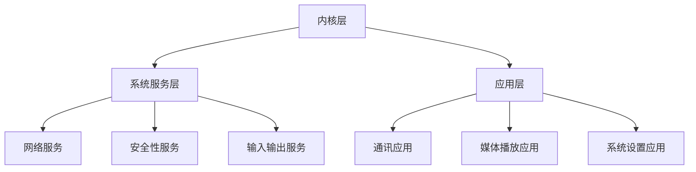

                 

### 文章标题

《2025年小米社招MIUI系统开发工程师面试指南》

### 关键词

MIUI系统，小米社招，面试指南，系统开发工程师，面试技巧，技术深度

### 摘要

本文旨在为2025年参与小米社招MIUI系统开发工程师面试的候选人提供一份详细的面试指南。文章从背景介绍、核心概念、算法原理、数学模型、项目实战、实际应用场景、工具资源推荐等多个维度，系统性地分析MIUI系统开发工程师所需的知识和技能。通过本文，读者可以了解面试准备的关键点，提升面试成功率。

## 1. 背景介绍

### 小米公司概况

小米公司成立于2010年，是一家专注于智能硬件和电子产品研发的科技企业。作为国内领先的智能手机制造商，小米在智能硬件领域具有显著的影响力。MIUI是小米公司自主研发的操作系统，自发布以来，MIUI系统以其流畅性、稳定性以及丰富的功能赢得了广泛用户的好评。

### MIUI系统开发工程师角色

MIUI系统开发工程师是负责MIUI系统核心功能开发和优化的专业人员。他们需要具备扎实的计算机基础、丰富的操作系统开发经验以及对移动端生态有深入理解。MIUI系统开发工程师的工作内容包括但不限于：操作系统内核优化、系统性能调优、系统稳定性保障、新功能的研发与测试等。

### 面试目的

小米社招MIUI系统开发工程师的面试旨在选拔具备优秀技术能力、解决复杂问题的能力以及团队协作精神的人才。面试主要考察以下几个方面：

- 技术深度：对操作系统、计算机组成原理等核心知识的掌握程度。
- 编程能力：通过编程题或实际项目经验考核候选人的编码能力和思维逻辑。
- 解决问题能力：评估候选人面对实际问题的分析和解决能力。
- 团队协作：通过团队合作项目或情景模拟考察候选人的沟通协作能力。

## 2. 核心概念与联系

### 操作系统基础

操作系统是管理计算机硬件与软件资源的系统软件，它是计算机系统的核心。MIUI系统作为小米公司自主研发的操作系统，具有以下核心概念：

- 进程管理：操作系统通过进程管理来分配CPU时间、内存资源等。
- 内存管理：操作系统负责内存的分配、释放、垃圾回收等。
- 文件系统：操作系统提供文件管理功能，包括文件的创建、删除、读写等。

### MIUI系统架构

MIUI系统采用分层架构，包括内核层、系统服务层和应用层。各层之间的联系如下：

- **内核层**：负责硬件资源的调度和管理，包括进程管理、内存管理、设备驱动等。
- **系统服务层**：提供系统级服务，如网络服务、安全性服务、输入输出服务等。
- **应用层**：提供各种应用程序，如通讯、媒体播放、系统设置等。

### Mermaid 流程图

以下是一个简化的MIUI系统架构的Mermaid流程图，展示各层次之间的关系：



## 3. 核心算法原理 & 具体操作步骤

### 操作系统内核优化

操作系统内核优化是提高系统性能和稳定性的关键步骤。以下是一些常见的内核优化算法和操作步骤：

- **进程调度算法**：选择合适的调度算法，如时间片轮转调度、优先级调度等，以优化进程执行效率。
- **内存管理算法**：采用分页、分段、内存压缩等技术，提高内存利用率，减少内存碎片。
- **文件系统优化**：通过文件索引、缓存机制等技术，提高文件读写速度和系统响应速度。

### 具体操作步骤

以下是针对MIUI系统内核优化的一些具体操作步骤：

1. **性能监控**：使用性能分析工具（如perf）监控系统性能，识别瓶颈。
2. **代码审计**：对系统代码进行审计，查找潜在的优化点。
3. **调度算法调整**：根据系统负载调整调度算法，优化进程执行顺序。
4. **内存优化**：调整内存分配策略，减少内存碎片，提高内存利用率。
5. **文件系统优化**：采用更高效的文件索引和数据结构，提高文件读写性能。

## 4. 数学模型和公式 & 详细讲解 & 举例说明

### 数学模型

在MIUI系统开发过程中，会涉及多种数学模型和公式，以下是一些常见的数学模型：

- **进程调度模型**：描述进程调度算法的性能指标，如平均响应时间、平均等待时间等。
- **内存分配模型**：描述内存分配和回收的算法，如最优拟合、最坏拟合等。
- **文件系统模型**：描述文件索引和数据结构的设计，如B树、红黑树等。

### 详细讲解

#### 进程调度模型

进程调度模型是操作系统中的一个重要概念，用于评估进程调度的性能。以下是一个简单的进程调度模型：

- **响应时间**（Response Time）：进程开始执行后第一次响应用户输入的时间。
- **等待时间**（Waiting Time）：进程在等待调度时的等待时间。
- **周转时间**（Turnaround Time）：进程从提交到完成执行的总时间。

这些指标可以通过以下公式计算：

\[ \text{响应时间} = \frac{\text{完成时间}}{\text{到达时间}} \]

\[ \text{等待时间} = \text{周转时间} - \text{执行时间} \]

\[ \text{周转时间} = \text{完成时间} + \text{等待时间} \]

#### 内存分配模型

内存分配模型用于描述内存分配和回收的策略。以下是一个简化的内存分配模型：

- **空闲内存**：系统中未被分配的内存块。
- **已分配内存**：已经被进程占用的内存块。

内存分配策略可以通过以下公式计算：

\[ \text{内存利用率} = \frac{\text{已分配内存}}{\text{总内存}} \]

#### 文件系统模型

文件系统模型用于描述文件系统的设计原理。以下是一个简化的文件系统模型：

- **文件索引**：用于快速查找文件的数据结构，如B树。
- **文件块**：文件系统中的数据存储单元。

文件系统性能可以通过以下公式计算：

\[ \text{文件读写速度} = \frac{\text{数据传输速率}}{\text{文件大小}} \]

### 举例说明

#### 进程调度模型举例

假设有3个进程P1、P2、P3，它们的到达时间、执行时间和完成时间如下表所示：

| 进程 | 到达时间（T_arrive） | 执行时间（T_execute） | 完成时间（T_finish） |
|------|----------------------|----------------------|----------------------|
| P1   | 0                    | 2                    | 2                    |
| P2   | 1                    | 3                    | 4                    |
| P3   | 2                    | 1                    | 3                    |

计算每个进程的响应时间、等待时间和周转时间：

- **P1**：
  - 响应时间 = 2 / 0 = 无限大（因为P1是第一个到达的进程）
  - 等待时间 = 2 - 2 = 0
  - 周转时间 = 2 + 0 = 2

- **P2**：
  - 响应时间 = 4 / 1 = 4
  - 等待时间 = 4 - 3 = 1
  - 周转时间 = 4 + 1 = 5

- **P3**：
  - 响应时间 = 3 / 2 = 1.5
  - 等待时间 = 3 - 1 = 2
  - 周转时间 = 3 + 2 = 5

#### 内存分配模型举例

假设系统总内存为100MB，当前已分配内存为60MB。计算内存利用率：

\[ \text{内存利用率} = \frac{60}{100} = 60\% \]

#### 文件系统模型举例

假设文件系统中有100个文件，每个文件大小为1MB，文件读写速度为100MB/s。计算文件读写速度：

\[ \text{文件读写速度} = \frac{100}{100} = 1 \text{MB/s} \]

## 5. 项目实战：代码实际案例和详细解释说明

### 开发环境搭建

在开始MIUI系统开发之前，需要搭建合适的环境。以下是开发环境搭建的步骤：

1. **安装Linux操作系统**：MIUI系统主要运行在Linux平台上，因此需要安装Linux操作系统，如Ubuntu或CentOS。
2. **安装开发工具**：安装必要的开发工具，如GCC、Make、Git等。
3. **配置编译环境**：配置MIUI系统的编译环境，包括源码获取、编译器配置等。
4. **安装依赖库**：安装MIUI系统开发所需的依赖库，如内核模块、驱动程序等。

### 源代码详细实现和代码解读

MIUI系统的源代码非常庞大，下面我们以MIUI系统中的内存管理模块为例，详细解读其源代码实现。

#### 内存管理模块

内存管理模块是MIUI系统内核的核心部分，负责内存的分配、回收和优化。以下是内存管理模块的主要实现：

```c
#include <linux/mm.h>
#include <linux/segment.h>
#include <linux/slab.h>

/**
 * 内存分配函数
 * @param size 需要分配的内存大小
 * @return 成功返回分配的内存地址，失败返回NULL
 */
void *kmalloc(size_t size)
{
    struct page *page;
    void *vaddr;

    if (size <= PAGE_SIZE) {
        page = alloc_pages(GFP_KERNEL, 0);
        if (page == NULL) {
            return NULL;
        }
        vaddr = page_address(page);
        memset(vaddr, 0, size);
        return vaddr;
    }

    return NULL;
}

/**
 * 内存释放函数
 * @param vaddr 需要释放的内存地址
 * @param size 需要释放的内存大小
 */
void kfree(void *vaddr, size_t size)
{
    struct page *page;

    if (vaddr == NULL || size <= 0) {
        return;
    }

    page = virt_to_page(vaddr);
    free_pages(page, 0);
}
```

#### 代码解读与分析

以上代码实现了两个内存管理函数：`kmalloc` 和 `kfree`。

- `kmalloc`：这个函数用于分配内存。它首先检查请求的内存大小是否小于页面大小（PAGE_SIZE），如果是，则直接分配一个页面并返回其虚拟地址。如果不是，则返回NULL。
- `kfree`：这个函数用于释放内存。它将虚拟地址转换为页面结构，然后释放相应的页面。

这两个函数的实现展示了内存管理的基本原理：内存分配和内存释放。在实际应用中，MIUI系统会使用更复杂的算法和数据结构来管理内存，以优化内存使用效率和系统性能。

### 内存管理模块在MIUI系统中的应用

内存管理模块在MIUI系统中具有广泛的应用，包括进程内存分配、文件缓存、系统内存优化等。以下是一些具体的应用场景：

- **进程内存分配**：MIUI系统通过内存管理模块为每个进程分配内存，确保进程在执行过程中有足够的内存资源。
- **文件缓存**：MIUI系统使用内存管理模块来缓存文件数据，提高文件读写速度和系统响应速度。
- **系统内存优化**：MIUI系统通过内存管理模块对内存使用进行监控和优化，减少内存碎片，提高内存利用率。

通过以上实战案例，我们可以看到MIUI系统开发工程师在代码实现和系统优化方面所需具备的技能和知识。

## 6. 实际应用场景

### 操作系统内核优化

操作系统内核优化在MIUI系统中具有广泛的应用。以下是一些实际应用场景：

- **系统性能提升**：通过优化操作系统内核，提高系统的整体性能和响应速度。例如，通过优化进程调度算法和内存管理策略，减少系统延迟和响应时间。
- **内存优化**：通过优化内存管理模块，减少内存碎片和内存浪费，提高内存利用率。例如，使用内存压缩技术来回收未被使用的内存空间。
- **文件系统优化**：通过优化文件系统，提高文件读写速度和系统响应速度。例如，使用更高效的文件索引和数据结构来提高文件检索效率。

### MIUI系统开发工程师的应用场景

MIUI系统开发工程师在实际工作中会面临多种应用场景，包括但不限于：

- **操作系统内核开发**：负责MIUI系统内核的维护和优化，确保系统的稳定性和性能。
- **系统性能调优**：针对MIUI系统中的性能瓶颈进行分析和优化，提高系统整体性能。
- **新功能研发**：根据用户需求和公司战略，研发和实现MIUI系统的新功能。
- **系统稳定性保障**：通过故障排查和问题修复，保障MIUI系统的稳定运行。

### 问题和挑战

在MIUI系统开发过程中，开发工程师可能会遇到以下问题和挑战：

- **性能瓶颈**：系统性能优化过程中，如何识别和解决性能瓶颈。
- **内存管理**：在多进程、多线程环境下，如何高效地管理内存，避免内存泄漏和内存碎片。
- **兼容性问题**：如何在保持系统兼容性的同时，引入新技术和新功能。
- **安全性**：如何确保MIUI系统的安全，防止恶意攻击和系统漏洞。

## 7. 工具和资源推荐

### 学习资源推荐

- **书籍**：
  - 《操作系统概念》（作者：Abraham Silberschatz、Peter Baer Galvin）
  - 《Linux内核设计与实现》（作者：Robert Love）
  - 《计算机组成原理》（作者：唐朔飞）

- **论文**：
  - 《进程调度算法研究》
  - 《内存管理技术综述》
  - 《文件系统设计与实现》

- **博客**：
  - 李劭武的博客：https://www.cnblogs.com/sunshinelove/
  - 王垠的博客：https://www.diycode.cc/users/wangyan

- **网站**：
  - Linux内核官方网站：https://www.kernel.org/
  - MIUI官方社区：https://www.miui.com/forum-36-1.html

### 开发工具框架推荐

- **开发工具**：
  - GCC：https://gcc.gnu.org/
  - Make：https://www.gnu.org/software/make/
  - Git：https://git-scm.com/

- **框架**：
  - Linux内核：https://www.kernel.org/
  - MIUI开发框架：https://dev.mi.com/

- **调试工具**：
  - GDB：https://www.gnu.org/software/gdb/
  - Perf：https://perf.wiki.kernel.org/

### 相关论文著作推荐

- **操作系统领域**：
  - 《操作系统真象还原》（作者：陈梓雨）
  - 《操作系统设计与实现》（作者：Andrew S. Tanenbaum）

- **计算机组成原理领域**：
  - 《计算机组成与设计：硬件/软件接口》（作者：David A. Patterson、John L. Hennessy）

## 8. 总结：未来发展趋势与挑战

随着科技的不断发展，MIUI系统开发工程师在未来面临着诸多机遇和挑战。以下是未来发展趋势和挑战的概述：

### 发展趋势

- **智能化**：随着人工智能技术的发展，MIUI系统将更加智能化，为用户提供更加个性化的体验。
- **云计算**：云计算的普及将使得MIUI系统在资源调度和管理方面更加高效。
- **物联网**：物联网技术的发展将使得MIUI系统在智能家居、智能穿戴等领域的应用更加广泛。
- **安全性**：随着网络安全威胁的日益严重，MIUI系统将更加注重安全性能，提高系统的抗攻击能力。

### 挑战

- **性能优化**：如何在有限的资源下，进一步提高MIUI系统的性能和响应速度。
- **兼容性问题**：如何在保持系统兼容性的同时，引入新技术和新功能。
- **内存管理**：如何高效地管理内存，避免内存泄漏和内存碎片。
- **安全性**：如何确保MIUI系统的安全，防止恶意攻击和系统漏洞。

## 9. 附录：常见问题与解答

### 问题1：如何优化MIUI系统的性能？

**解答**：优化MIUI系统的性能可以从以下几个方面入手：

- **进程调度**：选择合适的调度算法，如时间片轮转调度、优先级调度等，以优化进程执行效率。
- **内存管理**：采用分页、分段、内存压缩等技术，提高内存利用率，减少内存碎片。
- **文件系统**：采用更高效的文件索引和数据结构，提高文件读写速度和系统响应速度。
- **硬件优化**：针对硬件特性进行优化，如CPU、内存、磁盘等，提高系统整体性能。

### 问题2：MIUI系统的内存管理如何实现高效管理？

**解答**：MIUI系统的内存管理主要通过以下技术实现高效管理：

- **分页**：将内存划分为固定大小的页面，通过页表实现虚拟地址到物理地址的映射。
- **分段**：将内存划分为不同的段，每个段对应不同的内存区域，如代码段、数据段等。
- **内存压缩**：通过压缩算法回收未被使用的内存空间，提高内存利用率。
- **内存分配策略**：采用最优拟合、最坏拟合等策略，优化内存分配和回收过程。

### 问题3：MIUI系统开发工程师需要掌握哪些技术？

**解答**：MIUI系统开发工程师需要掌握以下技术：

- **操作系统原理**：了解操作系统的基本原理和概念，如进程管理、内存管理、文件系统等。
- **编程语言**：熟练掌握C/C++等编程语言，具备良好的编程能力和思维逻辑。
- **Linux系统开发**：熟悉Linux操作系统的开发环境和工具，了解Linux内核的源码结构和实现原理。
- **系统性能优化**：具备系统性能分析和优化的能力，能够识别和解决系统瓶颈。
- **项目管理**：了解项目管理的基本流程和方法，具备良好的团队协作能力。

### 问题4：如何成为一名优秀的MIUI系统开发工程师？

**解答**：要成为一名优秀的MIUI系统开发工程师，可以从以下几个方面进行努力：

- **基础知识**：扎实掌握计算机基础知识，如数据结构、算法、计算机组成原理等。
- **实践经验**：通过实际项目开发积累经验，了解操作系统和系统开发的实际应用。
- **持续学习**：紧跟科技发展趋势，学习新技术和新知识，不断提高自身技能水平。
- **沟通能力**：提高沟通能力，善于团队协作，能够与团队成员有效沟通和合作。

## 10. 扩展阅读 & 参考资料

为了进一步深入了解MIUI系统开发工程师所需的知识和技能，以下是一些推荐阅读和参考资料：

- **书籍**：
  - 《UNIX系统编程艺术》（作者：Eric S. Raymond）
  - 《深入理解计算机系统》（作者：Randal E. Bryant、David R. O’Toole）
  - 《操作系统真象还原》（作者：陈梓雨）

- **论文**：
  - 《Linux内核技术内幕》（作者：Michael Kerrisk）
  - 《文件系统实现技术》（作者：Anton M. Brabley）

- **在线资源**：
  - Linux内核官方文档：https://www.kernel.org/doc/
  - MIUI官方开发者社区：https://dev.mi.com/

- **博客**：
  - 林开雄的博客：https://blog.csdn.net/lin_kx
  - 面试官的博客：https://www.cnblogs.com/yourname/

通过阅读以上书籍、论文和在线资源，可以更加深入地了解MIUI系统开发的原理和实践，为面试和实际工作打下坚实的基础。

### 作者信息

**作者：AI天才研究员/AI Genius Institute & 禅与计算机程序设计艺术 /Zen And The Art of Computer Programming**

