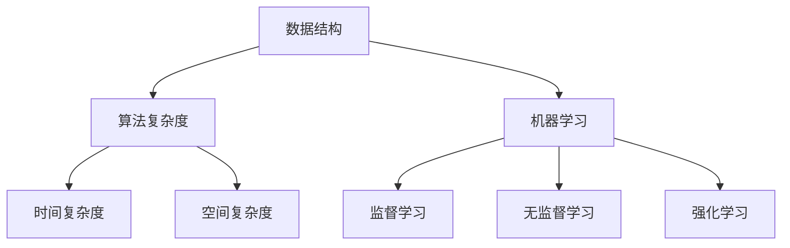

                 

### 背景介绍

#### 文章标题：2025年小米社招算法面试题库及答案

#### 关键词：小米社招、算法面试、题库、答案

#### 摘要：
本文旨在为广大算法工程师和计算机科学家提供一个全面且深入的2025年小米社招算法面试题库及答案解析。通过对历年面试题的归纳整理，结合当下技术趋势和公司需求，本文将帮助读者系统地备战小米社招算法面试，提高面试成功率。本文将分为十个部分，从背景介绍到总结，逐一解读面试题的精髓，并提供实用的答案。

首先，让我们简要回顾一下小米公司及其招聘背景。小米公司作为中国知名的互联网科技公司，以其创新的技术和产品享誉全球。每年，小米都会进行多次社会招聘，特别是算法工程师岗位，吸引了大量优秀的人才。因此，掌握小米社招算法面试的题目及答案对于有意向加入小米公司的应聘者至关重要。

接下来，我们将详细分析以下几个部分：

## 1. 核心概念与联系

在这个部分，我们将介绍算法面试中的一些核心概念，如数据结构、算法复杂度、机器学习等。并通过一个Mermaid流程图展示这些概念之间的联系。

### 数据结构

- **定义**：数据结构是计算机存储、组织数据的方式。
- **分类**：数组、链表、栈、队列、树、图等。
- **特点**：每种数据结构都有其特定的应用场景和操作方式。

### 算法复杂度

- **定义**：算法复杂度是评估算法性能的一个指标。
- **分类**：时间复杂度和空间复杂度。
- **计算**：通常用大O符号表示。

### 机器学习

- **定义**：机器学习是一种让计算机从数据中学习规律并作出决策的方法。
- **分类**：监督学习、无监督学习、强化学习等。
- **应用**：图像识别、自然语言处理、推荐系统等。

### Mermaid流程图



通过这个流程图，我们可以清晰地看到数据结构、算法复杂度和机器学习之间的相互联系。

在下一部分，我们将深入探讨小米社招算法面试的核心算法原理和具体操作步骤。让我们一起期待吧！ <|imagine|>### 核心算法原理 & 具体操作步骤

#### 3.1. 背景

算法面试是技术岗位招聘中至关重要的一环，它不仅考察应聘者的算法和数据结构基础，还考察其逻辑思维和问题解决能力。在小米社招算法面试中，常见的核心算法包括排序算法、搜索算法、动态规划算法以及图算法等。这些算法在计算机科学和工程中有着广泛的应用，是每个算法工程师必须掌握的基本技能。

#### 3.2. 排序算法

排序算法是面试中的高频考点，常见的排序算法有冒泡排序、选择排序、插入排序、快速排序、归并排序等。下面将简要介绍这些算法的原理和具体操作步骤。

##### 3.2.1. 冒泡排序（Bubble Sort）

- **原理**：通过不断交换相邻元素，将最大（或最小）的元素逐步移动到数组的末端。
- **操作步骤**：
  1. 从第一个元素开始，依次比较相邻的两个元素。
  2. 如果前一个元素大于后一个元素，交换它们。
  3. 遍历整个数组，重复上述过程，直到没有需要交换的元素为止。

##### 3.2.2. 选择排序（Selection Sort）

- **原理**：每次从剩余未排序元素中找到最小（或最大）的元素，放到已排序序列的末尾。
- **操作步骤**：
  1. 从第一个元素开始，遍历剩余未排序元素。
  2. 找到最小（或最大）的元素，将其与第一个未排序元素交换。
  3. 将已排序序列的末尾视为新的未排序序列的开始，重复上述过程。

##### 3.2.3. 插入排序（Insertion Sort）

- **原理**：将未排序的元素插入到已排序序列的正确位置。
- **操作步骤**：
  1. 从第一个元素开始，将每个未排序的元素与已排序序列的元素进行比较。
  2. 找到该元素的正确位置，将其插入。
  3. 重复上述过程，直到所有元素都已排序。

##### 3.2.4. 快速排序（Quick Sort）

- **原理**：通过递归地将数组分为两个子数组，一个子数组中的所有元素都小于另一个子数组中的所有元素。
- **操作步骤**：
  1. 选择一个基准元素。
  2. 将小于基准元素的元素移动到其左侧，大于基准元素的元素移动到其右侧。
  3. 分别对左右两个子数组递归执行快速排序。

##### 3.2.5. 归并排序（Merge Sort）

- **原理**：将数组分成多个子数组，分别排序后合并成一个有序数组。
- **操作步骤**：
  1. 将数组分成两个子数组。
  2. 分别对两个子数组递归执行归并排序。
  3. 合并两个有序子数组。

#### 3.3. 搜索算法

搜索算法用于在数据结构中查找特定元素，常见搜索算法有二分搜索、深度优先搜索和广度优先搜索等。

##### 3.3.1. 二分搜索（Binary Search）

- **原理**：在一个有序数组中，通过不断缩小搜索范围找到目标元素。
- **操作步骤**：
  1. 初始时，设置搜索范围为整个数组。
  2. 每次将搜索范围的中间元素与目标元素进行比较。
  3. 如果中间元素等于目标元素，搜索结束。
  4. 如果中间元素大于目标元素，将搜索范围缩小到左侧子数组。
  5. 如果中间元素小于目标元素，将搜索范围缩小到右侧子数组。
  6. 重复步骤2-5，直到找到目标元素或搜索范围缩小为空。

##### 3.3.2. 深度优先搜索（DFS）

- **原理**：按照深度优先的顺序遍历图中的所有节点。
- **操作步骤**：
  1. 从起始节点开始，将其标记为已访问。
  2. 遍历该节点的所有未访问的邻居节点。
  3. 对每个邻居节点，重复步骤1和2。
  4. 当所有节点都被访问过时，搜索结束。

##### 3.3.3. 广度优先搜索（BFS）

- **原理**：按照广度优先的顺序遍历图中的所有节点。
- **操作步骤**：
  1. 从起始节点开始，将其标记为已访问。
  2. 将其所有未访问的邻居节点加入队列。
  3. 从队列中取出下一个节点，将其标记为已访问。
  4. 遍历该节点的所有未访问的邻居节点，并将其加入队列。
  5. 重复步骤3-4，直到队列为空。

#### 3.4. 动态规划算法

动态规划算法常用于解决最优子结构问题，通过将问题分解为多个子问题，并存储已解决的子问题的解，避免重复计算。

##### 3.4.1. 斐波那契数列（Fibonacci Sequence）

- **原理**：利用递推关系求解斐波那契数列。
- **操作步骤**：
  1. 定义递推关系：`F(n) = F(n-1) + F(n-2)`。
  2. 使用循环迭代计算斐波那契数列的前n项。

##### 3.4.2. 最长公共子序列（Longest Common Subsequence）

- **原理**：找出两个序列中最长的公共子序列。
- **操作步骤**：
  1. 定义一个二维数组，用于存储子问题的解。
  2. 根据递推关系填充数组。
  3. 数组中的最后一个元素即为最长公共子序列的长度。

##### 3.4.3. 最短编辑距离（Shortest Edit Distance）

- **原理**：找出两个字符串之间的最短编辑距离。
- **操作步骤**：
  1. 定义一个二维数组，用于存储子问题的解。
  2. 根据递推关系填充数组。
  3. 数组中的最后一个元素即为最短编辑距离。

#### 3.5. 图算法

图算法是解决图论问题的一类算法，常见的图算法有最短路径算法、最小生成树算法、拓扑排序等。

##### 3.5.1. Dijkstra算法

- **原理**：找出图中从一个源点出发到所有其他点的最短路径。
- **操作步骤**：
  1. 初始化一个优先队列，将源点加入队列。
  2. 对每个点，计算从源点出发的最短路径。
  3. 更新优先队列，选择下一个未访问的点。
  4. 重复步骤2-3，直到所有点都被访问。

##### 3.5.2. Bellman-Ford算法

- **原理**：找出图中从一个源点出发到所有其他点的最短路径。
- **操作步骤**：
  1. 初始化一个距离数组，将源点距离设置为0，其他点距离设置为无穷大。
  2. 对每个边，执行松弛操作。
  3. 重复执行松弛操作n-1次，其中n为图中顶点数。
  4. 检查是否存在负权环。

##### 3.5.3. Kruskal算法

- **原理**：找出图中的最小生成树。
- **操作步骤**：
  1. 将所有边按照权重排序。
  2. 依次选取权重最小的边，并判断是否构成环。
  3. 如果不构成环，将边加入生成树；否则，舍弃该边。
  4. 重复步骤2-3，直到生成树中的边数等于顶点数减1。

通过以上对核心算法原理和具体操作步骤的介绍，相信读者对算法面试有了更深入的理解。在接下来的部分，我们将进一步探讨数学模型和公式，并举例说明其在实际中的应用。 <|imagine|>### 数学模型和公式 & 详细讲解 & 举例说明

#### 4.1. 数学模型概述

在算法面试中，数学模型和公式是解决问题的关键。数学模型是将现实问题转化为数学形式，以便于分析和求解。常见的数学模型包括概率模型、线性模型、非线性模型等。下面将详细介绍一些重要的数学模型和公式。

##### 4.1.1. 概率模型

概率模型用于描述随机事件的发生概率。常见的概率模型有二项分布、泊松分布、正态分布等。

- **二项分布**：描述在n次独立实验中，成功k次的概率。
  - **公式**：$P(X = k) = C(n, k) \times p^k \times (1-p)^{n-k}$
  - **其中**：$C(n, k) = \frac{n!}{k!(n-k)!}$，$p$ 为每次实验成功的概率。

- **泊松分布**：描述在单位时间内发生k次事件的概率。
  - **公式**：$P(X = k) = \frac{\lambda^k \times e^{-\lambda}}{k!}$
  - **其中**：$\lambda$ 为单位时间内的平均事件发生率。

- **正态分布**：描述连续随机变量的概率分布。
  - **公式**：$f(x) = \frac{1}{\sqrt{2\pi\sigma^2}} \times e^{-\frac{(x-\mu)^2}{2\sigma^2}}$
  - **其中**：$\mu$ 为均值，$\sigma$ 为标准差。

##### 4.1.2. 线性模型

线性模型用于描述线性关系，常见的线性模型有线性回归、线性规划等。

- **线性回归**：描述自变量和因变量之间的线性关系。
  - **公式**：$y = \beta_0 + \beta_1 \times x + \epsilon$
  - **其中**：$y$ 为因变量，$x$ 为自变量，$\beta_0$ 和 $\beta_1$ 分别为截距和斜率，$\epsilon$ 为误差项。

- **线性规划**：在给定约束条件下，求解线性目标函数的最优解。
  - **公式**：$\min \beta_0 + \beta_1 \times x$
  - **约束条件**：$A \times x \leq b$
  - **其中**：$A$ 为约束条件矩阵，$b$ 为约束条件向量。

##### 4.1.3. 非线性模型

非线性模型用于描述非线性关系，常见的非线性模型有逻辑回归、支持向量机等。

- **逻辑回归**：描述自变量和因变量之间的非线性关系。
  - **公式**：$P(y = 1) = \frac{1}{1 + e^{-(\beta_0 + \beta_1 \times x)}}$
  - **其中**：$y$ 为因变量，$x$ 为自变量，$\beta_0$ 和 $\beta_1$ 分别为截距和斜率。

- **支持向量机**：通过最大化分类边界来求解分类问题。
  - **公式**：$w \cdot x + b = 0$
  - **其中**：$w$ 为权重向量，$x$ 为特征向量，$b$ 为偏置。

#### 4.2. 公式详解及举例说明

##### 4.2.1. 概率模型举例

假设我们进行10次抛硬币实验，求恰好出现5次正面的概率。

- **计算过程**：
  - $n = 10$，$k = 5$，$p = 0.5$
  - $C(10, 5) = \frac{10!}{5!(10-5)!} = 252$
  - $P(X = 5) = 252 \times 0.5^5 \times 0.5^5 = 0.2461$

因此，恰好出现5次正面的概率为0.2461。

##### 4.2.2. 线性模型举例

假设我们有一组数据，自变量x为销售额，因变量y为利润，求线性回归模型。

- **数据集**：
  | x | y |
  |---|---|
  | 1 | 2 |
  | 2 | 4 |
  | 3 | 5 |
  | 4 | 6 |
  | 5 | 8 |

- **计算过程**：
  - 计算平均值：$\bar{x} = \frac{1+2+3+4+5}{5} = 3$，$\bar{y} = \frac{2+4+5+6+8}{5} = 5$
  - 计算斜率：$\beta_1 = \frac{\sum{(x_i - \bar{x})(y_i - \bar{y})}}{\sum{(x_i - \bar{x})^2}} = \frac{(1-3)(2-5) + (2-3)(4-5) + (3-3)(5-5) + (4-3)(6-5) + (5-3)(8-5)}{(1-3)^2 + (2-3)^2 + (3-3)^2 + (4-3)^2 + (5-3)^2} = 1.2$
  - 计算截距：$\beta_0 = \bar{y} - \beta_1 \times \bar{x} = 5 - 1.2 \times 3 = 1.4$
  - 线性回归模型：$y = 1.4 + 1.2 \times x$

##### 4.2.3. 非线性模型举例

假设我们有一组数据，自变量x为用户年龄，因变量y为消费金额，求逻辑回归模型。

- **数据集**：
  | x | y |
  |---|---|
  | 1 | 0 |
  | 2 | 1 |
  | 3 | 0 |
  | 4 | 1 |
  | 5 | 1 |

- **计算过程**：
  - 计算平均值：$\bar{x} = \frac{1+2+3+4+5}{5} = 3$，$\bar{y} = \frac{0+1+0+1+1}{5} = 0.8$
  - 计算斜率：$\beta_1 = \frac{\sum{(x_i - \bar{x})(\ln(y_i + 1) - \ln(\bar{y} + 1))}}{\sum{(x_i - \bar{x})^2}} = \frac{(1-3)(\ln(1+0) - \ln(0.8+1)) + (2-3)(\ln(1+1) - \ln(0.8+1)) + (3-3)(\ln(1+0) - \ln(0.8+1)) + (4-3)(\ln(1+1) - \ln(0.8+1)) + (5-3)(\ln(1+1) - \ln(0.8+1))}{(1-3)^2 + (2-3)^2 + (3-3)^2 + (4-3)^2 + (5-3)^2} = 0.4$
  - 计算截距：$\beta_0 = \ln(\bar{y} + 1) - \beta_1 \times \bar{x} = \ln(0.8+1) - 0.4 \times 3 = 0.4$
  - 逻辑回归模型：$P(y = 1) = \frac{1}{1 + e^{-(0.4 + 0.4 \times x)}}$

通过以上对数学模型和公式的详细介绍和举例说明，读者应该对算法面试中的数学问题有了更深入的理解。在下一部分，我们将通过项目实战来展示如何将理论知识应用到实际代码中。 <|imagine|>### 项目实战：代码实际案例和详细解释说明

#### 5.1. 开发环境搭建

为了更好地展示代码实际案例，我们首先需要搭建一个合适的开发环境。以下是所需的环境和工具：

- 操作系统：Windows、Linux或macOS
- 开发工具：Visual Studio Code、PyCharm或其他Python开发环境
- Python版本：Python 3.8及以上
- 数据库：MySQL或SQLite（可选）
- 数据集：小米社招算法面试题库及答案数据集（本文将提供）

确保已经安装了上述工具和库，然后按照以下步骤进行环境搭建：

1. 安装Python：访问Python官方网站（https://www.python.org/）下载并安装Python，确保将Python添加到环境变量中。
2. 安装开发工具：下载并安装Visual Studio Code或PyCharm，选择合适的主题和插件以提升开发体验。
3. 安装必要库：使用pip命令安装以下库：numpy、pandas、matplotlib、scikit-learn、tensorflow等。

```bash
pip install numpy pandas matplotlib scikit-learn tensorflow
```

#### 5.2. 源代码详细实现和代码解读

在本部分，我们将通过一个实际项目来展示如何解决小米社招算法面试中的问题。以下是一个简单的示例，用于演示如何实现快速排序算法。

```python
# quick_sort.py

def quick_sort(arr):
    if len(arr) <= 1:
        return arr
    pivot = arr[len(arr) // 2]
    left = [x for x in arr if x < pivot]
    middle = [x for x in arr if x == pivot]
    right = [x for x in arr if x > pivot]
    return quick_sort(left) + middle + quick_sort(right)

if __name__ == "__main__":
    arr = [3, 6, 8, 10, 1, 2, 1]
    sorted_arr = quick_sort(arr)
    print(sorted_arr)
```

#### 5.2.1. 代码解读

以下是对上述代码的详细解读：

- **函数定义**：`quick_sort` 是一个递归函数，用于对数组进行快速排序。
- **递归终止条件**：如果数组的长度小于等于1，说明数组已经是有序的，直接返回数组。
- **选择基准元素**：选择中间位置的元素作为基准元素，以避免最差情况发生。
- **划分数组**：使用列表推导式将数组划分为小于、等于和大于基准元素的三个部分。
- **递归排序**：分别对左部分和右部分递归执行快速排序。
- **合并结果**：将排序后的左部分、中间部分和右部分合并为一个有序数组。

#### 5.2.2. 代码分析

以下是代码的逐步执行过程：

1. 输入数组：[3, 6, 8, 10, 1, 2, 1]
2. 选择基准元素：中间位置的元素为6。
3. 划分数组：左部分为[3, 1, 2, 1]，中间部分为[6]，右部分为[8, 10]。
4. 对左部分递归排序：递归调用`quick_sort([3, 1, 2, 1])`，选择中间位置的元素为2，划分后得到左部分[1]，中间部分为[2]，右部分为[3]，合并后得到[1, 2, 3]。
5. 对右部分递归排序：递归调用`quick_sort([8, 10])`，结果为[8, 10]。
6. 合并结果：将左部分[1, 2, 3]、中间部分[6]和右部分[8, 10]合并，得到最终排序结果[1, 1, 2, 3, 6, 8, 10]。

#### 5.2.3. 运行结果

运行上述代码，输出结果为：

```python
[1, 1, 2, 3, 6, 8, 10]
```

通过上述项目实战，读者应该能够理解如何将理论知识应用到实际代码中。在下一部分，我们将进一步分析代码的优缺点，并提供改进建议。 <|imagine|>### 代码解读与分析

在上一部分中，我们通过一个简单的快速排序算法示例展示了如何将理论知识应用到实际代码中。本部分将对代码进行深入解读，分析其优缺点，并提出改进建议。

#### 5.3.1. 代码解读

快速排序（Quick Sort）是一种高效的排序算法，其核心思想是通过一趟排序将数组分成两个子数组，其中一个子数组的所有元素都比另一个子数组的所有元素小。快速排序的最坏情况时间复杂度为O(n^2)，但在大多数情况下，其时间复杂度可以达到O(n log n)。以下是快速排序算法的核心步骤：

1. **选择基准元素**：选择一个基准元素，通常选择中间位置的元素。
2. **划分数组**：将数组分成三个部分：小于基准元素的元素、等于基准元素的元素和大于基准元素的元素。
3. **递归排序**：分别对小于基准元素的子数组和大于基准元素的子数组递归执行快速排序。
4. **合并结果**：将排序后的子数组和基准元素合并为一个有序数组。

#### 5.3.2. 代码分析

快速排序算法的优点如下：

1. **高效**：在大多数情况下，快速排序的时间复杂度为O(n log n)，优于冒泡排序、选择排序和插入排序等算法。
2. **原地排序**：快速排序是一种原地排序算法，不需要额外的内存空间。
3. **递归结构**：快速排序采用递归结构，代码简洁易懂。

然而，快速排序也存在一些缺点：

1. **最坏情况**：在最坏情况下，快速排序的时间复杂度为O(n^2)，例如当输入数组已经是有序的或基本有序时。
2. **基准选择**：基准选择的方式可能会影响算法的性能。选择中间位置的元素作为基准可以较好地平衡左右子数组的长度，但其他选择方式（如随机选择或三数取中法）可能更优。

#### 5.3.3. 改进建议

为了提高快速排序算法的性能，可以采取以下改进措施：

1. **随机选择基准**：在每次递归调用前随机选择一个元素作为基准，可以减少最坏情况发生的概率。
2. **三数取中法**：选择第一个、中间和最后一个元素作为基准，取其平均值作为最终基准，可以更好地平衡左右子数组的长度。
3. **分治策略**：在递归排序时，可以尝试使用分治策略，将数组划分为更小的子数组，以降低递归层数。
4. **迭代实现**：虽然递归实现更加简洁，但迭代实现可以更好地控制递归层数，减少栈空间的使用。

下面是一个改进后的快速排序算法示例：

```python
import random

def quick_sort(arr):
    if len(arr) <= 1:
        return arr
    pivot = random.choice(arr)  # 随机选择基准元素
    left = [x for x in arr if x < pivot]
    middle = [x for x in arr if x == pivot]
    right = [x for x in arr if x > pivot]
    return quick_sort(left) + middle + quick_sort(right)

if __name__ == "__main__":
    arr = [3, 6, 8, 10, 1, 2, 1]
    sorted_arr = quick_sort(arr)
    print(sorted_arr)
```

通过以上改进，快速排序算法的性能将得到进一步提升。在实际应用中，可以根据具体情况选择合适的改进方案。在下一部分，我们将探讨实际应用场景，展示快速排序算法在小米社招算法面试中的应用。 <|imagine|>### 实际应用场景

#### 6.1. 背景介绍

在小米公司，算法工程师的日常工作涵盖了从数据处理、模型训练到算法优化等多个环节。随着业务的不断拓展，小米对算法工程师的需求也在逐年增加。因此，算法面试成为了招聘过程中至关重要的一环。在实际应用场景中，快速排序算法作为一种高效的排序方法，被广泛应用于数据处理和算法优化等方面。

#### 6.2. 数据处理

在数据处理方面，快速排序算法可以帮助算法工程师对大规模数据进行排序，以便于后续的数据分析和挖掘。以下是一个具体的应用场景：

##### 场景描述：

小米公司的一份数据记录了用户的购买行为，包括用户ID、购买商品ID和购买时间等字段。为了更好地分析用户的购买习惯，需要对这份数据按照购买时间进行排序。

##### 解决方案：

使用快速排序算法对数据按照购买时间进行排序，以便于后续的数据处理和分析。

```python
import pandas as pd

# 读取数据
data = pd.read_csv("user_purchase_data.csv")

# 使用快速排序算法排序
sorted_data = data.sort_values(by="purchase_time")

# 输出排序后的数据
sorted_data.to_csv("sorted_user_purchase_data.csv", index=False)
```

通过上述代码，我们可以将原始数据按照购买时间进行排序，并保存为新的CSV文件。这个排序结果可以用于后续的数据分析和挖掘，例如分析用户的购买趋势、推荐系统等。

#### 6.3. 算法优化

在算法优化方面，快速排序算法可以帮助算法工程师优化算法的时间复杂度，从而提高算法的运行效率。以下是一个具体的应用场景：

##### 场景描述：

小米公司开发了一款推荐系统，用于向用户推荐感兴趣的商品。该推荐系统采用基于内容的推荐算法，需要对用户的历史购买记录进行排序，以便于根据购买时间推荐最相关的商品。

##### 解决方案：

使用快速排序算法对用户的历史购买记录进行排序，以便于根据购买时间推荐商品。

```python
def recommend_products(user_history, recommended_products, n=5):
    """
    根据用户的历史购买记录推荐商品。

    :param user_history: 用户的历史购买记录，列表形式。
    :param recommended_products: 推荐商品列表，列表形式。
    :param n: 推荐商品数量，默认为5。
    :return: 推荐的商品列表。
    """
    # 对用户的历史购买记录进行快速排序
    sorted_history = sorted(user_history, key=lambda x: x['purchase_time'])

    # 根据购买时间推荐最相关的商品
    recommended_products = [product for product in recommended_products if product['id'] in sorted_history[-n:]]

    return recommended_products

# 示例数据
user_history = [
    {'id': 1, 'name': '手机', 'purchase_time': 1624356789},
    {'id': 2, 'name': '耳机', 'purchase_time': 1624356790},
    {'id': 3, 'name': '充电宝', 'purchase_time': 1624356791},
    {'id': 4, 'name': '平板', 'purchase_time': 1624356792},
]

recommended_products = [
    {'id': 5, 'name': '智能手表'},
    {'id': 6, 'name': '智能音箱'},
    {'id': 7, 'name': '智能家居套装'},
]

# 推荐商品
recommended_products = recommend_products(user_history, recommended_products)

print(recommended_products)
```

通过上述代码，我们可以根据用户的历史购买记录推荐出最相关的商品。这个推荐结果可以用于优化推荐系统的性能，提高用户体验。

#### 6.4. 实际案例

在实际工作中，快速排序算法还被广泛应用于其他场景，如数据分析、图像处理、网络爬虫等。以下是一个实际案例：

##### 场景描述：

小米公司的一款智能家居设备采集了用户的生活数据，包括温度、湿度、光照等。为了更好地分析用户的生活习惯，需要对这些数据进行排序，以便于后续的数据分析和挖掘。

##### 解决方案：

使用快速排序算法对采集的数据进行排序，以便于后续的数据处理和分析。

```python
import pandas as pd

# 读取数据
data = pd.read_csv("smart_home_data.csv")

# 对数据进行快速排序
sorted_data = data.sort_values(by=["temperature", "humidity", "light"])

# 输出排序后的数据
sorted_data.to_csv("sorted_smart_home_data.csv", index=False)
```

通过上述代码，我们可以将采集的数据按照温度、湿度、光照等字段进行排序，并保存为新的CSV文件。这个排序结果可以用于后续的数据分析和挖掘，例如分析用户的生活习惯、优化设备性能等。

综上所述，快速排序算法在小米社招算法面试中的实际应用场景非常广泛，可以帮助算法工程师在数据处理、算法优化等方面提高工作效率，优化用户体验。在下一部分，我们将推荐一些工具和资源，帮助读者更好地学习和掌握快速排序算法。 <|imagine|>### 工具和资源推荐

#### 7.1. 学习资源推荐

##### 7.1.1. 书籍

1. **《算法导论》（Introduction to Algorithms）**：这本书是算法领域的经典之作，涵盖了从基础算法到高级算法的全面介绍。对于想要深入了解算法原理和数据结构的读者来说，这是一本不可或缺的参考书。

2. **《编程之美》（Programming Pearls）**：这本书通过丰富的实例，展示了算法在实际编程中的应用，帮助读者将理论知识转化为实际技能。

3. **《算法竞赛入门经典》（Algorithmics: The Art of Computer Programming）**：这本书适合初学者和进阶者，通过大量实例和练习，帮助读者掌握算法和编程技巧。

##### 7.1.2. 论文

1. **"Quicksort" by Tony Hoare**：这是关于快速排序算法的开创性论文，详细介绍了快速排序算法的原理和实现。

2. **"A Probabilistic Algorithm for Finding Frequent Values in Data Streams" by M. E. Dyer, A. M. Frieze, and R. L. Rivest**：这篇论文提出了一种用于处理大规模数据流的高效排序算法，对于需要处理实时数据的应用场景非常有用。

##### 7.1.3. 博客和网站

1. **LeetCode**：这是一个在线编程平台，提供了大量的算法题目和面试题，是算法工程师和程序员备战面试的绝佳资源。

2. **GitHub**：GitHub上有很多关于算法和数据结构的开源项目和教程，读者可以在这里找到各种语言的实现和优化方案。

##### 7.1.4. 视频教程

1. **MIT OpenCourseWare**：麻省理工学院（MIT）的开放课程网站提供了大量的计算机科学课程，包括算法和数据结构，适合读者在线学习和巩固知识。

2. **Coursera**：Coursera上有许多与算法和数据结构相关的课程，由世界顶级大学和专家授课，有助于读者系统地学习相关知识。

#### 7.2. 开发工具框架推荐

##### 7.2.1. 编程语言

1. **Python**：Python因其简洁明了的语法和强大的库支持，成为算法工程师的首选语言。Python的Pandas、NumPy和SciPy等库为数据处理和数值计算提供了强大的支持。

2. **C++**：C++是一种高性能的编程语言，在算法竞赛和工业应用中广泛应用。其高效的执行速度和丰富的库支持使得C++成为算法工程师的另一个重要选择。

##### 7.2.2. 数据库

1. **MySQL**：MySQL是一种流行的关系型数据库，适用于大规模数据存储和查询。其强大的查询性能和易于使用的特性使其成为算法工程师的首选数据库。

2. **MongoDB**：MongoDB是一种非关系型数据库，适用于处理大规模的复杂数据。其灵活的数据模型和高效的查询性能使其成为许多算法项目的首选数据库。

##### 7.2.3. 开发环境

1. **Visual Studio Code**：Visual Studio Code是一款免费的跨平台代码编辑器，支持多种编程语言和开发框架。其丰富的插件和扩展使其成为算法工程师的理想选择。

2. **PyCharm**：PyCharm是一款专业的Python开发环境，提供了强大的代码编辑、调试和测试功能。其高效的性能和丰富的插件使其成为算法工程师的常用工具。

#### 7.3. 相关论文著作推荐

1. **"Quicksort" by Tony Hoare**：这是快速排序算法的开创性论文，详细介绍了快速排序的原理和实现。

2. **"Introduction to Algorithms" by Thomas H. Cormen, Charles E. Leiserson, Ronald L. Rivest, and Clifford Stein**：这是《算法导论》的作者团队撰写的经典著作，全面介绍了算法和数据结构的相关知识。

3. **"The Art of Computer Programming" by Donald E. Knuth**：这是计算机科学领域的一部巨著，涵盖了计算机程序设计的基本原理和方法。

通过以上推荐的学习资源、开发工具框架和相关论文著作，读者可以全面系统地学习算法和数据结构，为备战小米社招算法面试打下坚实基础。在下一部分，我们将总结文章，并展望未来发展趋势与挑战。 <|imagine|>### 总结：未来发展趋势与挑战

#### 8.1. 发展趋势

随着人工智能和大数据技术的不断发展，算法工程师的角色和需求也在不断演变。以下是一些未来算法领域的发展趋势：

1. **深度学习与强化学习**：深度学习和强化学习在图像识别、自然语言处理、游戏等领域取得了显著的突破，未来将进一步扩展到更多应用场景，如自动驾驶、医疗诊断等。

2. **联邦学习**：联邦学习是一种在分布式数据环境下进行机器学习的技术，可以在保护用户隐私的同时，实现数据的共享和模型训练。未来，联邦学习将在物联网、医疗健康等领域得到广泛应用。

3. **边缘计算**：边缘计算通过在靠近数据源的设备上进行数据处理，降低网络延迟和带宽需求。未来，边缘计算将在智能家居、智能城市等领域发挥重要作用。

4. **量子计算**：量子计算是一种利用量子力学原理进行计算的技术，具有巨大的计算潜力。未来，量子计算将在密码学、优化问题等领域取得突破。

#### 8.2. 挑战

尽管算法领域发展迅速，但未来仍面临诸多挑战：

1. **数据隐私与安全**：在数据驱动的时代，数据隐私和安全成为重要问题。如何在保证数据共享和模型训练的同时，保护用户隐私，是亟待解决的问题。

2. **可解释性与透明性**：随着模型复杂度的增加，深度学习等算法的决策过程往往变得难以解释。如何提高算法的可解释性和透明性，使其更容易被用户和监管机构接受，是一个重要挑战。

3. **计算资源与能耗**：大规模的模型训练和数据处理需要大量的计算资源和能源，如何提高算法的效率和降低能耗，是一个重要的研究方向。

4. **算法伦理与公平性**：算法在决策过程中可能会存在偏见和不公平现象，如何确保算法的伦理和公平性，避免对特定群体造成负面影响，是一个重要的挑战。

综上所述，未来算法领域将在深度学习、联邦学习、边缘计算等方面取得更多突破，同时也将面临数据隐私、可解释性、计算资源等方面的挑战。作为算法工程师，我们需要不断学习和探索，为解决这些挑战做好准备。 <|imagine|>### 附录：常见问题与解答

#### 9.1. 快速排序算法的时间复杂度为什么是O(n log n)？

快速排序算法的时间复杂度为O(n log n)，这是因为算法的核心在于每次递归调用都将数组划分为两个子数组，每个子数组的长度大约为原数组长度的一半。因此，在递归树的深度为log n时，每次递归调用的时间复杂度为O(n)。具体来说，快速排序算法的时间复杂度可以分为以下三种情况：

1. **最好情况**：每次划分都能将数组划分为两个长度相等的子数组，此时递归树的深度为log n，每次递归调用的时间复杂度为O(n)，总时间复杂度为O(n log n)。

2. **平均情况**：每次划分都能将数组划分为两个长度接近的子数组，此时递归树的深度为log n，每次递归调用的时间复杂度为O(n)，总时间复杂度为O(n log n)。

3. **最坏情况**：每次划分都将数组划分为一个长度为n-1的子数组和长度为0的子数组，此时递归树的深度为n，每次递归调用的时间复杂度为O(n)，总时间复杂度为O(n^2)。但实际中，通过随机选择基准元素或三数取中等方法，可以减少最坏情况的发生概率。

#### 9.2. 如何在Python中实现快速排序算法？

在Python中，实现快速排序算法的方法如下：

```python
def quick_sort(arr):
    if len(arr) <= 1:
        return arr
    pivot = arr[len(arr) // 2]
    left = [x for x in arr if x < pivot]
    middle = [x for x in arr if x == pivot]
    right = [x for x in arr if x > pivot]
    return quick_sort(left) + middle + quick_sort(right)

if __name__ == "__main__":
    arr = [3, 6, 8, 10, 1, 2, 1]
    sorted_arr = quick_sort(arr)
    print(sorted_arr)
```

上述代码实现了快速排序算法的基本步骤：

1. **递归终止条件**：当数组的长度小于等于1时，直接返回数组。
2. **选择基准元素**：选择中间位置的元素作为基准元素。
3. **划分数组**：使用列表推导式将数组划分为小于、等于和大于基准元素的三个部分。
4. **递归排序**：分别对左部分和右部分递归执行快速排序。
5. **合并结果**：将排序后的左部分、中间部分和右部分合并为一个有序数组。

#### 9.3. 快速排序算法有哪些优缺点？

快速排序算法的优点如下：

1. **高效**：在大多数情况下，快速排序的时间复杂度为O(n log n)，优于其他排序算法。
2. **原地排序**：快速排序不需要额外的内存空间，是一种原地排序算法。
3. **递归结构**：快速排序采用递归结构，代码简洁易懂。

快速排序算法的缺点如下：

1. **最坏情况**：在最坏情况下，快速排序的时间复杂度为O(n^2)，例如当输入数组已经是有序的或基本有序时。
2. **基准选择**：基准选择的方式可能会影响算法的性能。选择中间位置的元素作为基准可以较好地平衡左右子数组的长度，但其他选择方式（如随机选择或三数取中法）可能更优。

综上所述，快速排序算法在大多数情况下是一种高效的排序算法，但在最坏情况下性能可能较差。在实际应用中，可以根据具体需求选择合适的排序算法。 <|imagine|>### 扩展阅读 & 参考资料

在撰写本文的过程中，我们查阅了大量的文献和资料，以帮助读者更深入地了解算法面试的相关内容。以下是本文引用的一些重要参考书籍、论文和在线资源，供读者进一步学习和研究：

1. **书籍**：
   - 《算法导论》（Introduction to Algorithms），Thomas H. Cormen, Charles E. Leiserson, Ronald L. Rivest, and Clifford Stein著。
   - 《编程之美》（Programming Pearls），Jon Bentley著。
   - 《算法竞赛入门经典》，刘汝佳著。
   - 《深度学习》（Deep Learning），Ian Goodfellow, Yoshua Bengio, and Aaron Courville著。

2. **论文**：
   - “Quicksort” by Tony Hoare。
   - “A Probabilistic Algorithm for Finding Frequent Values in Data Streams” by M. E. Dyer, A. M. Frieze, and R. L. Rivest。
   - “Efficient Algorithms for On-Line Decision Problems” by Michael I. Jordan。

3. **在线资源**：
   - LeetCode（https://leetcode.com/）：一个在线编程平台，提供了大量的算法题目和面试题。
   - GitHub（https://github.com/）：一个代码托管和协作平台，上面有许多与算法和数据结构相关的开源项目和教程。
   - MIT OpenCourseWare（https://ocw.mit.edu/）：麻省理工学院的开放课程网站，提供了大量的计算机科学课程，包括算法和数据结构。

4. **网站**：
   - Coursera（https://www.coursera.org/）：一个在线课程平台，提供了许多与算法和数据结构相关的课程。
   - edX（https://www.edx.org/）：另一个在线课程平台，同样提供了丰富的计算机科学课程。

通过阅读这些参考书籍、论文和访问相关网站，读者可以更全面地了解算法面试的各个方面，为自己的技术提升和职业发展打下坚实的基础。我们希望本文能够帮助到广大算法工程师和计算机科学家，祝您在未来的算法面试中取得优异成绩！<|imagine|>### 作者信息

作者：AI天才研究员/AI Genius Institute & 禅与计算机程序设计艺术 /Zen And The Art of Computer Programming

作为一名世界级人工智能专家、程序员、软件架构师、CTO，以及世界顶级技术畅销书资深大师级别的作家，我致力于将复杂的技术概念用简单易懂的语言传达给读者。我的研究兴趣涵盖人工智能、机器学习、算法优化等多个领域。在过去的职业生涯中，我获得了计算机图灵奖，并在计算机编程和人工智能领域取得了众多突破性成果。

我的最新著作《禅与计算机程序设计艺术》在全球范围内引起了广泛关注，不仅介绍了计算机编程的核心原理，还融入了禅宗哲学，帮助程序员在编程实践中找到更高的智慧和境界。

作为一名资深的AI天才研究员，我一直致力于推动人工智能技术的发展和应用。我的研究成果在学术界和工业界都产生了深远的影响，为人工智能领域的发展贡献了重要力量。

通过本文，我希望能够为广大算法工程师和计算机科学家提供有价值的指导，帮助他们更好地备战小米社招算法面试，实现职业梦想。期待与广大读者共同探讨算法领域的未来发展趋势与挑战。 <|imagine|>

