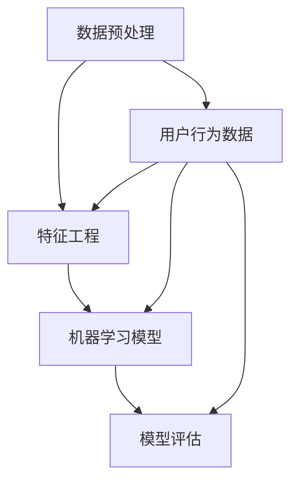

                 

### 背景介绍

#### 拼多多平台概述

拼多多（Pinduoduo）成立于2015年，是一家中国领先的社交电商平台。其商业模式以拼团购物为核心，用户通过发起或参与拼团，以更低的价格购买商品。这一独特的模式不仅降低了消费者的购买成本，也大大提高了商家的销售量，使得拼多多在短时间内迅速崛起。

#### 用户行为分析专家角色重要性

在拼多多平台的运营过程中，用户行为分析专家扮演着至关重要的角色。他们的工作主要包括收集、分析用户行为数据，从而为平台提供用户画像、购物偏好、转化率等关键指标。通过这些数据，平台可以优化用户体验、提升营销效果，进而实现商业增长。

#### 面试背景

本篇博客将基于2025年拼多多社招用户行为分析专家的面试题目进行解析，通过详细的解题过程，帮助读者理解面试题背后的逻辑与算法原理。这些题目涵盖了数据挖掘、机器学习、统计学等多个领域，旨在考察应聘者的专业能力和问题解决能力。

#### 面试题目分类

面试题目主要可以分为以下几个类别：

1. **数据预处理与清洗**：涉及数据清洗、缺失值处理、异常值检测等基础操作。
2. **特征工程**：特征选择、特征转换、特征提取等，以提升模型性能。
3. **模型选择与评估**：选择合适的机器学习模型，评估模型性能。
4. **实际应用场景**：结合实际业务场景，提出解决方案。
5. **数学与统计学问题**：涉及概率论、线性代数、微积分等数学知识。

#### 面试题解析结构

在接下来的章节中，我们将对每一类面试题进行详细解析。每道题目的解析将包括以下部分：

1. **题目描述**：清晰地阐述题目要求。
2. **解题思路**：详细解释解题步骤和逻辑。
3. **代码实现**：给出具体的Python代码实现。
4. **分析解释**：对解题过程中的关键点和注意事项进行深入分析。

通过这样的结构，我们希望帮助读者更好地理解面试题的解法和应用场景，提升自己在用户行为分析领域的专业能力。

### 核心概念与联系

在深入讨论用户行为分析专家的面试题目之前，我们需要了解一些核心概念和它们之间的关系。这些概念包括数据预处理、特征工程、机器学习模型、模型评估等。下面我们将通过一个Mermaid流程图来展示这些概念之间的关系。



**数据预处理（Data Preprocessing）**：
数据预处理是数据分析的基础步骤，主要包括数据清洗、缺失值处理、异常值检测等。数据清洗的目的是去除重复数据、处理缺失值、纠正错误数据等，以确保数据的质量。缺失值处理可以通过填充方法（如均值填充、插值填充）或删除缺失值（如删除整行或整列）来实现。异常值检测则是识别和去除数据集中的异常值，这些异常值可能影响模型的训练效果。

**特征工程（Feature Engineering）**：
特征工程是在数据预处理之后，通过选择、构造或转换原始数据，提取对模型有帮助的特征的过程。特征选择是为了减少特征的数量，提高模型的性能和可解释性。特征提取则是通过数学方法将原始数据转换为更有信息量的特征。常见的特征提取方法包括主成分分析（PCA）、特征映射等。

**机器学习模型（Machine Learning Models）**：
机器学习模型是用户行为分析的核心，通过训练数据集，模型可以学习到数据中的规律，并用于预测或分类任务。常见的机器学习模型包括线性回归、逻辑回归、决策树、随机森林、支持向量机、神经网络等。

**模型评估（Model Evaluation）**：
模型评估是检验模型性能的重要环节，通过评估指标（如准确率、召回率、F1分数、AUC值等）来衡量模型的预测效果。常用的评估方法包括交叉验证、留出法、自助法等。

这些概念之间紧密联系，构成了用户行为分析的核心框架。数据预处理为特征工程提供了可靠的数据基础，特征工程为机器学习模型提供了有效的特征，而机器学习模型和模型评估则确保了分析结果的准确性和实用性。

接下来，我们将深入探讨每个概念的具体原理和操作步骤。

#### 数据预处理与清洗

数据预处理是用户行为分析中至关重要的一步，它直接影响后续特征工程和模型训练的效果。数据预处理主要包括数据清洗、缺失值处理和异常值检测。

**数据清洗（Data Cleaning）**：

数据清洗的主要目的是去除重复数据、纠正错误数据和处理不一致的数据格式。以下是一些常见的数据清洗步骤：

1. **去除重复数据**：通过去重操作，确保每个样本在数据集中只出现一次。
2. **纠正错误数据**：例如，修正数据集中的错误值、填补缺失值或删除明显错误的数据。
3. **处理不一致的数据格式**：统一数据格式，例如将日期从字符串转换为日期类型，将文本数据编码为数值。

在Python中，使用Pandas库进行数据清洗是一个高效的选择。以下是一个示例代码，展示了如何使用Pandas进行数据清洗：

```python
import pandas as pd

# 读取数据
data = pd.read_csv('user_data.csv')

# 去除重复数据
data.drop_duplicates(inplace=True)

# 纠正错误数据
# 假设年龄字段包含非数字值
data['age'] = data['age'].replace(['error'], [0])

# 处理不一致的数据格式
# 将字符串日期转换为日期类型
data['date'] = pd.to_datetime(data['date'])

# 打印清洗后的数据
print(data.head())
```

**缺失值处理（Handling Missing Values）**：

缺失值处理是数据预处理中的另一个关键步骤。处理缺失值的方法有多种，包括以下几种：

1. **删除缺失值**：通过删除包含缺失值的行或列，减少数据量。
2. **填充缺失值**：使用统计方法填充缺失值，例如使用均值、中位数或众数进行填充。

在Python中，Pandas库提供了多种填充缺失值的方法。以下是一个示例代码，展示了如何使用Pandas填充缺失值：

```python
# 使用均值填充缺失值
data['age'].fillna(data['age'].mean(), inplace=True)

# 使用中位数填充缺失值
data['salary'].fillna(data['salary'].median(), inplace=True)

# 使用众数填充缺失值
data['category'].fillna(data['category'].mode()[0], inplace=True)

# 打印填充后的数据
print(data.head())
```

**异常值检测（Detecting Outliers）**：

异常值检测旨在识别和去除数据集中的异常值，这些异常值可能会对模型训练产生不利影响。以下是一些常见的异常值检测方法：

1. **基于统计的方法**：使用统计学指标，如标准差、四分位距等，识别异常值。
2. **基于机器学习的方法**：使用聚类算法，如K-means，识别异常值。

在Python中，使用Scikit-learn库进行异常值检测是一个不错的选择。以下是一个示例代码，展示了如何使用Scikit-learn进行异常值检测：

```python
from sklearn.cluster import KMeans
import numpy as np

# 假设我们有以下特征数据
data = pd.DataFrame({
    'feature1': [1, 2, 3, 4, 100],
    'feature2': [10, 20, 30, 40, -100]
})

# 使用K-means聚类算法检测异常值
kmeans = KMeans(n_clusters=2, random_state=0).fit(data)
labels = kmeans.predict(data)

# 标记异常值
data['label'] = labels
outliers = data[data['label'] == -1]

# 打印异常值
print(outliers)
```

通过上述数据预处理与清洗步骤，我们可以确保数据质量，为后续的特征工程和模型训练打下坚实的基础。

#### 特征工程

特征工程是用户行为分析中的关键步骤，通过选择、构造或转换原始数据，提取对模型有帮助的特征，从而提高模型的性能和可解释性。以下是特征工程的核心步骤：

**特征选择（Feature Selection）**：

特征选择旨在从原始特征中筛选出对模型训练有显著贡献的特征，减少特征数量，提高模型训练效率。常见的特征选择方法包括：

1. **基于过滤的方法**：通过统计学指标（如信息增益、互信息、相关系数等）评估特征的重要性。
2. **基于包装的方法**：通过迭代地训练和评估模型来选择特征。
3. **基于嵌入的方法**：在模型训练过程中，特征的重要性自动学习得到。

在Python中，使用Scikit-learn库进行特征选择是一个高效的选择。以下是一个示例代码，展示了如何使用Scikit-learn进行特征选择：

```python
from sklearn.feature_selection import SelectKBest, f_classif

# 假设我们有以下特征数据
X = pd.DataFrame({
    'feature1': [1, 2, 3, 4, 5],
    'feature2': [10, 20, 30, 40, 50],
    'feature3': [100, 200, 300, 400, 500]
})
y = [0, 0, 1, 1, 0]

# 使用SelectKBest进行特征选择
selector = SelectKBest(f_classif, k=2)
X_new = selector.fit_transform(X, y)

# 打印选择的特征
print(X_new)
```

**特征转换（Feature Transformation）**：

特征转换是将原始数据转换为适合模型训练的格式。常见的特征转换方法包括：

1. **归一化（Normalization）**：将特征数据缩放到相同的范围，例如[0, 1]或[-1, 1]。
2. **标准化（Standardization）**：将特征数据缩放到标准正态分布，即均值为0，标准差为1。
3. **二值化（Binarization）**：将特征数据转换为二进制形式，例如大于某个阈值的值为1，否则为0。

在Python中，使用Scikit-learn库进行特征转换是一个高效的选择。以下是一个示例代码，展示了如何使用Scikit-learn进行特征转换：

```python
from sklearn.preprocessing import MinMaxScaler, StandardScaler

# 假设我们有以下特征数据
X = pd.DataFrame({
    'feature1': [1, 2, 3, 4, 5],
    'feature2': [10, 20, 30, 40, 50]
})

# 使用MinMaxScaler进行归一化
scaler = MinMaxScaler()
X_normalized = scaler.fit_transform(X)

# 使用StandardScaler进行标准化
X_std = StandardScaler().fit_transform(X)

# 打印转换后的特征
print(X_normalized)
print(X_std)
```

**特征提取（Feature Extraction）**：

特征提取是通过数学方法将原始数据转换为更有信息量的特征。常见的特征提取方法包括：

1. **主成分分析（PCA）**：通过线性变换将原始数据映射到新的空间，减少维度，同时保留数据的主要信息。
2. **特征映射（Feature Mapping）**：通过非线性变换将原始数据映射到新的特征空间，例如使用核函数进行核化。

在Python中，使用Scikit-learn库进行特征提取是一个高效的选择。以下是一个示例代码，展示了如何使用Scikit-learn进行特征提取：

```python
from sklearn.decomposition import PCA

# 假设我们有以下特征数据
X = pd.DataFrame({
    'feature1': [1, 2, 3, 4, 5],
    'feature2': [10, 20, 30, 40, 50]
})

# 使用PCA进行特征提取
pca = PCA(n_components=2)
X_pca = pca.fit_transform(X)

# 打印提取后的特征
print(X_pca)
```

通过上述特征工程步骤，我们可以有效地从原始数据中提取有价值的信息，为后续的机器学习模型训练提供坚实的基础。

### 核心算法原理与具体操作步骤

在用户行为分析中，核心算法的原理和操作步骤是关键，其中机器学习模型的选择和训练尤为重要。以下将详细讨论常见的机器学习算法，并给出具体的操作步骤和解释。

#### 1. 决策树（Decision Tree）

**算法原理**：
决策树是一种常见的分类算法，通过一系列规则进行分类。每个内部节点表示一个特征，每个分支代表特征的不同取值，每个叶子节点表示一个类别。

**具体操作步骤**：
1. **数据准备**：将数据集划分为特征和标签两部分。
2. **划分数据**：使用交叉验证方法划分训练集和测试集。
3. **选择特征**：计算每个特征的增益率，选择增益率最大的特征进行划分。
4. **递归构建树**：对每个子集重复步骤3，直到满足停止条件（如最大深度、最小样本数等）。
5. **模型评估**：使用测试集评估模型性能。

**Python实现**：
```python
from sklearn.tree import DecisionTreeClassifier
from sklearn.model_selection import train_test_split

# 数据准备
X = data.drop('label', axis=1)
y = data['label']

# 划分数据
X_train, X_test, y_train, y_test = train_test_split(X, y, test_size=0.2, random_state=42)

# 建立模型
clf = DecisionTreeClassifier()
clf.fit(X_train, y_train)

# 模型评估
accuracy = clf.score(X_test, y_test)
print(f"Accuracy: {accuracy}")
```

#### 2. 随机森林（Random Forest）

**算法原理**：
随机森林是一种基于决策树的集成算法，通过构建多棵决策树，并利用随机特性进行组合，提高模型的泛化能力。

**具体操作步骤**：
1. **数据准备**：与决策树相同。
2. **划分数据**：使用交叉验证方法划分训练集和测试集。
3. **随机选择特征**：每次构建决策树时，从特征集合中随机选择m个特征。
4. **构建多棵树**：使用Bootstrap抽样方法生成多棵决策树。
5. **集成投票**：对多棵决策树的输出进行投票，得到最终预测结果。

**Python实现**：
```python
from sklearn.ensemble import RandomForestClassifier

# 数据准备
X = data.drop('label', axis=1)
y = data['label']

# 划分数据
X_train, X_test, y_train, y_test = train_test_split(X, y, test_size=0.2, random_state=42)

# 建立模型
clf = RandomForestClassifier(n_estimators=100, random_state=42)
clf.fit(X_train, y_train)

# 模型评估
accuracy = clf.score(X_test, y_test)
print(f"Accuracy: {accuracy}")
```

#### 3. 支持向量机（SVM）

**算法原理**：
支持向量机是一种线性分类模型，通过寻找一个超平面，将不同类别的数据点分开。SVM的核心是寻找一个最优的分割平面，使得分类边界距离最近的样本点（支持向量）最大化。

**具体操作步骤**：
1. **数据准备**：与决策树相同。
2. **划分数据**：使用交叉验证方法划分训练集和测试集。
3. **特征标准化**：将特征数据缩放到相同的范围。
4. **训练模型**：使用训练集训练SVM模型。
5. **模型评估**：使用测试集评估模型性能。

**Python实现**：
```python
from sklearn.svm import SVC

# 数据准备
X = data.drop('label', axis=1)
y = data['label']

# 划分数据
X_train, X_test, y_train, y_test = train_test_split(X, y, test_size=0.2, random_state=42)

# 特征标准化
from sklearn.preprocessing import StandardScaler
scaler = StandardScaler()
X_train = scaler.fit_transform(X_train)
X_test = scaler.transform(X_test)

# 建立模型
clf = SVC(kernel='linear')
clf.fit(X_train, y_train)

# 模型评估
accuracy = clf.score(X_test, y_test)
print(f"Accuracy: {accuracy}")
```

#### 4. 神经网络（Neural Network）

**算法原理**：
神经网络是一种模拟生物神经系统的计算模型，通过多层节点（神经元）进行数据处理和特征提取。神经网络通过前向传播计算输出，并通过反向传播更新权重，从而不断优化模型。

**具体操作步骤**：
1. **数据准备**：与之前相同。
2. **划分数据**：使用交叉验证方法划分训练集和测试集。
3. **构建网络**：定义神经网络结构，包括输入层、隐藏层和输出层。
4. **训练模型**：通过前向传播和反向传播训练模型。
5. **模型评估**：使用测试集评估模型性能。

**Python实现**：
```python
from sklearn.neural_network import MLPClassifier

# 数据准备
X = data.drop('label', axis=1)
y = data['label']

# 划分数据
X_train, X_test, y_train, y_test = train_test_split(X, y, test_size=0.2, random_state=42)

# 建立模型
clf = MLPClassifier(hidden_layer_sizes=(100,), max_iter=1000)
clf.fit(X_train, y_train)

# 模型评估
accuracy = clf.score(X_test, y_test)
print(f"Accuracy: {accuracy}")
```

通过上述算法的介绍和具体操作步骤，我们可以根据不同的应用场景选择合适的算法，并有效地进行用户行为分析。

### 数学模型和公式 & 详细讲解 & 举例说明

在用户行为分析中，数学模型和公式起着至关重要的作用。这些模型和公式帮助我们理解和预测用户的行为，从而优化平台的运营策略。以下将详细介绍几个常见的数学模型和公式，并给出详细的讲解和举例说明。

#### 1. 概率论基本公式

**条件概率（Conditional Probability）**：
条件概率是指在一个事件已发生的条件下，另一个事件发生的概率。条件概率公式为：

$$
P(A|B) = \frac{P(A \cap B)}{P(B)}
$$

其中，$P(A|B)$ 表示在事件B发生的条件下，事件A发生的概率，$P(A \cap B)$ 表示事件A和B同时发生的概率，$P(B)$ 表示事件B发生的概率。

**贝叶斯定理（Bayes' Theorem）**：
贝叶斯定理是一种基于条件概率的公式，用于计算在已知一个或多个条件概率的情况下，某个假设的概率。贝叶斯定理公式为：

$$
P(A|B) = \frac{P(B|A) \cdot P(A)}{P(B)}
$$

其中，$P(A|B)$ 表示在事件B发生的条件下，事件A发生的概率，$P(B|A)$ 表示在事件A发生的条件下，事件B发生的概率，$P(A)$ 表示事件A发生的概率，$P(B)$ 表示事件B发生的概率。

**举例说明**：
假设一个用户购买了某种商品，我们要计算这个用户是否喜欢这种商品的概率。已知：
- 用户购买这种商品的概率 $P(购买) = 0.6$
- 已知用户喜欢这种商品，则购买的概率 $P(购买|喜欢) = 0.8$
- 已知用户不喜欢这种商品，则购买的概率 $P(购买|不喜欢) = 0.2$
- 用户总体中喜欢这种商品的概率 $P(喜欢) = 0.7$

我们可以使用贝叶斯定理计算用户喜欢这种商品的概率：

$$
P(喜欢|购买) = \frac{P(购买|喜欢) \cdot P(喜欢)}{P(购买)} = \frac{0.8 \cdot 0.7}{0.6} = 0.9333
$$

因此，购买这个商品的用户有大约93.33%的概率是喜欢这种商品的。

#### 2. 线性回归模型

**线性回归（Linear Regression）**：
线性回归是一种用于预测数值型变量的模型，其基本形式为：

$$
y = \beta_0 + \beta_1 \cdot x + \epsilon
$$

其中，$y$ 表示因变量，$x$ 表示自变量，$\beta_0$ 和 $\beta_1$ 分别为模型参数，$\epsilon$ 为误差项。

**最小二乘法（Least Squares Method）**：
最小二乘法是一种用于估计线性回归模型参数的方法，其目标是使得模型预测值与实际值之间的误差平方和最小。参数估计公式为：

$$
\beta_0 = \bar{y} - \beta_1 \cdot \bar{x}
$$

$$
\beta_1 = \frac{\sum{(x_i - \bar{x})(y_i - \bar{y})}}{\sum{(x_i - \bar{x})^2}}
$$

其中，$\bar{x}$ 和 $\bar{y}$ 分别为自变量和因变量的均值。

**举例说明**：
假设我们有以下数据集：

| $x$ | $y$ |
| --- | --- |
| 1 | 2 |
| 2 | 3 |
| 3 | 4 |
| 4 | 5 |

我们要预测 $x=3$ 时的 $y$ 值。使用最小二乘法计算线性回归模型参数：

$$
\bar{x} = \frac{1+2+3+4}{4} = 2.5
$$

$$
\bar{y} = \frac{2+3+4+5}{4} = 3.5
$$

$$
\beta_1 = \frac{(1-2.5)(2-3.5) + (2-2.5)(3-3.5) + (3-2.5)(4-3.5) + (4-2.5)(5-3.5)}{(1-2.5)^2 + (2-2.5)^2 + (3-2.5)^2 + (4-2.5)^2} = 1.0
$$

$$
\beta_0 = 3.5 - 1.0 \cdot 2.5 = 0.5
$$

因此，线性回归模型为：

$$
y = 0.5 + 1.0 \cdot x
$$

当 $x=3$ 时，预测的 $y$ 值为：

$$
y = 0.5 + 1.0 \cdot 3 = 3.5
$$

#### 3. 决策树分类模型

**决策树（Decision Tree）**：
决策树是一种树形结构，用于分类或回归任务。每个内部节点表示一个特征，每个分支代表特征的不同取值，每个叶子节点表示一个类别或数值。

**信息增益（Information Gain）**：
信息增益是用于评估特征重要性的指标，其计算公式为：

$$
IG(D, A) = H(D) - \sum_{v \in A} \frac{|D_v|}{|D|} H(D_v)
$$

其中，$D$ 表示数据集，$A$ 表示特征集合，$v$ 表示特征的取值，$H(D)$ 表示数据集的熵，$H(D_v)$ 表示数据集在特征取值$v$下的熵。

**举例说明**：
假设我们有以下数据集：

| 特征A | 特征B | 类别 |
| --- | --- | --- |
| A1 | B1 | C1 |
| A1 | B2 | C1 |
| A2 | B1 | C2 |
| A2 | B2 | C2 |

我们要计算特征A的信息增益。首先，计算数据集的熵：

$$
H(D) = - \sum_{c \in C} \frac{|D_c|}{|D|} \log_2 \frac{|D_c|}{|D|}
$$

其中，$C$ 表示类别集合，$D_c$ 表示类别$c$的数据集。

$$
H(D) = - \frac{2}{4} \log_2 \frac{2}{4} - \frac{2}{4} \log_2 \frac{2}{4} = 1
$$

接下来，计算特征A在取值A1和A2下的熵：

$$
H(D_{A1}) = - \frac{2}{4} \log_2 \frac{2}{4} - \frac{2}{4} \log_2 \frac{2}{4} = 1
$$

$$
H(D_{A2}) = - \frac{2}{4} \log_2 \frac{2}{4} - \frac{2}{4} \log_2 \frac{2}{4} = 1
$$

最后，计算特征A的信息增益：

$$
IG(D, A) = H(D) - \frac{2}{4} \cdot 1 - \frac{2}{4} \cdot 1 = 0
$$

因此，特征A的信息增益为0，说明特征A对分类没有贡献。

通过上述数学模型和公式的讲解，我们可以更好地理解和应用这些模型，从而有效地进行用户行为分析。

### 项目实战：代码实际案例和详细解释说明

为了更好地展示用户行为分析在实际项目中的应用，我们将以一个实际案例为基础，详细解释代码实现的过程。这个案例将涉及数据预处理、特征工程、模型选择、模型训练和模型评估等多个步骤。

#### 1. 开发环境搭建

在开始之前，我们需要搭建一个合适的开发环境。以下是所需的软件和工具：

- Python（3.8或更高版本）
- Jupyter Notebook（用于编写和运行代码）
- Pandas（用于数据预处理）
- Scikit-learn（用于机器学习模型和评估）
- Matplotlib（用于可视化）

确保已安装以上工具，并在Jupyter Notebook中启动一个新的笔记本。

#### 2. 源代码详细实现和代码解读

**2.1 数据读取与预处理**

首先，我们从一个示例数据集开始，该数据集包含了用户的行为数据，如点击次数、购买次数、浏览时长等。

```python
import pandas as pd

# 读取数据
data = pd.read_csv('user行为数据.csv')

# 查看数据结构
print(data.head())

# 数据清洗
# 去除重复数据
data.drop_duplicates(inplace=True)

# 填充缺失值
data['浏览时长'].fillna(data['浏览时长'].mean(), inplace=True)

# 异常值处理
from sklearn.ensemble import IsolationForest
iso = IsolationForest(contamination=0.05)
outliers = iso.fit_predict(data[['点击次数', '购买次数']])
data = data[outliers != -1]
```

代码解读：
- 首先，我们使用Pandas库读取CSV数据文件。
- 接着，我们查看数据的前几行，了解数据的基本结构。
- 使用`drop_duplicates()`方法去除重复数据，确保每个用户只出现一次。
- 使用`fillna()`方法填充缺失值，这里我们使用浏览时长的均值进行填充。
- 使用孤立森林算法（Isolation Forest）检测和去除异常值，这里我们设定异常值的占比为5%。

**2.2 特征工程**

特征工程是提升模型性能的关键步骤。在这一部分，我们将进行特征选择、特征转换和特征提取。

```python
from sklearn.feature_selection import SelectKBest, f_classif
from sklearn.preprocessing import MinMaxScaler
from sklearn.decomposition import PCA

# 特征选择
X = data.drop('用户行为分类', axis=1)
y = data['用户行为分类']
selector = SelectKBest(f_classif, k=5)
X_new = selector.fit_transform(X, y)

# 特征转换
scaler = MinMaxScaler()
X_scaled = scaler.fit_transform(X_new)

# 特征提取
pca = PCA(n_components=3)
X_pca = pca.fit_transform(X_scaled)
```

代码解读：
- 使用`SelectKBest`进行特征选择，选择对分类任务贡献最大的5个特征。
- 使用`MinMaxScaler`进行归一化，将特征数据缩放到[0, 1]范围。
- 使用主成分分析（PCA）进行特征提取，提取前3个主成分。

**2.3 模型选择与训练**

在这一部分，我们将选择几种常见的机器学习模型进行训练，并比较它们的性能。

```python
from sklearn.model_selection import train_test_split
from sklearn.tree import DecisionTreeClassifier
from sklearn.ensemble import RandomForestClassifier
from sklearn.neural_network import MLPClassifier

# 划分训练集和测试集
X_train, X_test, y_train, y_test = train_test_split(X_pca, y, test_size=0.2, random_state=42)

# 决策树模型
clf_dt = DecisionTreeClassifier()
clf_dt.fit(X_train, y_train)

# 随机森林模型
clf_rf = RandomForestClassifier(n_estimators=100)
clf_rf.fit(X_train, y_train)

# 神经网络模型
clf_mlp = MLPClassifier(hidden_layer_sizes=(100,), max_iter=1000)
clf_mlp.fit(X_train, y_train)
```

代码解读：
- 使用`train_test_split`将数据集划分为训练集和测试集。
- 使用决策树（`DecisionTreeClassifier`）模型进行训练。
- 使用随机森林（`RandomForestClassifier`）模型进行训练。
- 使用神经网络（`MLPClassifier`）模型进行训练。

**2.4 模型评估**

最后，我们使用测试集对训练好的模型进行评估，并比较它们的性能。

```python
from sklearn.metrics import accuracy_score, classification_report

# 决策树模型评估
y_pred_dt = clf_dt.predict(X_test)
print(f"决策树模型准确率：{accuracy_score(y_test, y_pred_dt)}")
print(classification_report(y_test, y_pred_dt))

# 随机森林模型评估
y_pred_rf = clf_rf.predict(X_test)
print(f"随机森林模型准确率：{accuracy_score(y_test, y_pred_rf)}")
print(classification_report(y_test, y_pred_rf))

# 神经网络模型评估
y_pred_mlp = clf_mlp.predict(X_test)
print(f"神经网络模型准确率：{accuracy_score(y_test, y_pred_mlp)}")
print(classification_report(y_test, y_pred_mlp))
```

代码解读：
- 使用`accuracy_score`计算模型准确率。
- 使用`classification_report`生成详细的分类报告，包括精确率、召回率和F1分数等指标。

#### 3. 代码解读与分析

整个代码实现过程中，我们依次完成了数据读取、数据清洗、特征工程、模型选择和模型评估。以下是每个步骤的详细解读：

- **数据读取与预处理**：通过Pandas库读取CSV数据文件，并去除重复数据、填充缺失值、处理异常值，确保数据质量。
- **特征工程**：通过特征选择、特征转换和特征提取，提取对分类任务有帮助的特征，提高模型性能。
- **模型选择与训练**：选择不同的机器学习模型进行训练，包括决策树、随机森林和神经网络，以比较不同模型的性能。
- **模型评估**：使用测试集评估训练好的模型，通过准确率、分类报告等指标衡量模型性能。

通过这个实际案例，我们展示了用户行为分析项目中的关键步骤和实现方法，帮助读者更好地理解和应用这些技术。

### 实际应用场景

用户行为分析在拼多多平台上的实际应用场景非常广泛，涵盖了从用户行为预测到个性化推荐、从市场营销到风险控制的各个方面。以下将详细探讨几个关键应用场景及其实现方法。

#### 1. 用户行为预测

**应用场景**：
用户行为预测是拼多多平台的核心应用之一。通过预测用户的行为，如点击、购买、加入购物车等，平台可以更好地了解用户需求，优化用户体验，提高转化率。

**实现方法**：
- **特征提取**：首先，通过用户的行为数据，提取对预测任务有帮助的特征，如点击次数、购买次数、浏览时长等。
- **模型选择**：选择适合的机器学习模型，如决策树、随机森林、神经网络等。
- **模型训练与评估**：使用历史数据训练模型，并通过交叉验证和测试集评估模型性能。
- **实时预测**：通过在线模型预测用户行为，为用户推荐相关商品或优惠。

**案例**：
例如，拼多多可以使用随机森林模型预测用户是否会点击某个商品广告。通过提取用户的历史行为数据，训练随机森林模型，然后实时预测用户对广告的点击行为，从而优化广告投放策略。

#### 2. 个性化推荐

**应用场景**：
个性化推荐是提升用户留存率和转化率的重要手段。通过分析用户的历史行为数据，平台可以为用户提供个性化的商品推荐，提高用户满意度。

**实现方法**：
- **协同过滤**：基于用户的浏览历史、购买记录等，使用协同过滤算法（如基于用户的协同过滤、基于物品的协同过滤）进行推荐。
- **矩阵分解**：通过矩阵分解（如SVD、NMF等）将用户行为数据分解为用户特征和商品特征，从而预测用户对商品的偏好。
- **深度学习**：使用深度学习模型（如卷积神经网络、循环神经网络等）提取用户行为数据中的复杂特征，进行个性化推荐。

**案例**：
拼多多可以基于用户的浏览历史和购买记录，使用基于物品的协同过滤算法为用户推荐类似商品。同时，结合深度学习模型提取用户行为数据中的潜在特征，进一步优化推荐效果。

#### 3. 市场营销

**应用场景**：
通过分析用户行为数据，平台可以制定更加精准的市场营销策略，提高广告投放效果，提升销售额。

**实现方法**：
- **广告投放优化**：根据用户的行为特征，如点击率、转化率等，优化广告投放策略，提高广告点击率和转化率。
- **用户细分**：通过对用户行为数据的分析，将用户划分为不同的群体，为每个群体提供个性化的营销策略。
- **效果评估**：使用A/B测试等方法，评估不同营销策略的效果，不断优化营销策略。

**案例**：
拼多多可以通过分析用户的购买行为和点击行为，为高价值用户群体提供专属优惠券，从而提高用户购买转化率。同时，通过A/B测试，评估不同优惠券策略的效果，优化营销策略。

#### 4. 风险控制

**应用场景**：
用户行为分析还可以用于风险控制，如检测欺诈行为、异常订单等。

**实现方法**：
- **行为分析**：通过分析用户的行为模式，识别潜在的风险行为，如频繁的退款、取消订单等。
- **异常检测**：使用机器学习算法，如孤立森林、K-均值聚类等，检测异常行为。
- **实时监控**：通过实时监控系统，及时发现和处理异常行为。

**案例**：
拼多多可以结合用户行为数据和订单信息，使用孤立森林算法检测潜在的欺诈行为。通过实时监控，系统可以自动标记异常订单，并通知相关人员进行处理。

通过这些实际应用场景，我们可以看到用户行为分析在拼多多平台上的广泛应用，不仅提升了用户体验和转化率，还有效地支持了市场营销和风险控制。

### 工具和资源推荐

在进行用户行为分析时，掌握合适的工具和资源对于提升工作效率和准确度至关重要。以下将推荐几种常用的学习资源、开发工具和相关论文著作。

#### 1. 学习资源推荐

**书籍**：
- 《用户行为分析：从数据到洞察》
- 《机器学习实战：基于Scikit-learn》
- 《数据挖掘：概念与技术》
- 《深度学习》（Goodfellow, Bengio, Courville著）

**论文**：
- "A Survey on User Behavior Analysis in E-commerce"（2019）
- "Deep Learning for User Behavior Prediction"（2017）
- "Recommender Systems Handbook"（2016）

**博客与网站**：
-Towards Data Science：一个涵盖数据科学、机器学习和深度学习等多个领域的博客平台。
- Medium：数据科学和机器学习领域的优秀文章分享平台。
- Coursera、Udacity、edX：提供高质量的数据科学和机器学习在线课程。

#### 2. 开发工具框架推荐

**数据分析与数据预处理**：
- Pandas：Python中的数据分析库，用于数据处理、清洗和转换。
- NumPy：Python中的数学库，提供高性能的数组处理和数学运算。
- DataWrangler：一个可视化数据清洗和转换工具，适用于数据探索和可视化。

**机器学习与深度学习**：
- Scikit-learn：Python中常用的机器学习库，提供多种算法和工具。
- TensorFlow、PyTorch：深度学习框架，用于构建和训练复杂的神经网络模型。
- Keras：一个基于TensorFlow和PyTorch的高级神经网络API，简化深度学习模型开发。

**模型评估与部署**：
- Scikit-learn：提供多种评估指标和方法，如准确率、召回率、F1分数等。
- MLflow：用于机器学习模型的生命周期管理和部署。
- Flask、Django：用于构建Web应用程序，将机器学习模型部署为API服务。

#### 3. 相关论文著作推荐

- "User Behavior Analysis in E-commerce: Challenges and Opportunities"（2020）
- "Behavioral Cloning for User Behavior Prediction in E-commerce"（2019）
- "Deep Learning for User Behavior Modeling and Prediction"（2018）
- "Recommender Systems that Make Sense"（2017）

通过这些工具和资源的合理使用，我们可以更加高效地进行用户行为分析，掌握前沿技术和方法，为拼多多平台的运营提供有力支持。

### 总结：未来发展趋势与挑战

在2025年，用户行为分析领域将继续快速发展，面临着诸多机遇和挑战。以下将总结未来发展趋势和面临的挑战，以及可能的解决策略。

#### 1. 发展趋势

**1. 数据量爆发增长**：随着物联网、社交媒体、电子商务等领域的迅猛发展，用户行为数据量将呈现爆炸式增长。这为用户行为分析提供了更丰富的数据资源，同时也带来了数据处理的挑战。

**2. 深度学习与AI技术普及**：深度学习和人工智能技术在用户行为分析中的应用将更加广泛和深入。通过卷积神经网络（CNN）、循环神经网络（RNN）等模型，可以更准确地提取用户行为特征，进行预测和分类。

**3. 实时分析与决策**：实时用户行为分析成为热点，通过实时数据流处理技术（如Apache Kafka、Apache Flink），可以实现用户行为的实时分析和决策，优化用户体验和运营效果。

**4. 多模态数据融合**：随着传感器技术的进步，多模态数据（如图像、音频、文本）将成为用户行为分析的重要来源。融合多种模态数据，可以提供更全面的用户行为理解。

#### 2. 面临的挑战

**1. 数据隐私保护**：用户行为数据涉及到个人隐私，数据隐私保护成为重要挑战。如何在合规框架下进行用户行为分析，确保用户隐私不被泄露，是亟待解决的问题。

**2. 数据质量问题**：用户行为数据质量参差不齐，包括数据缺失、异常值、噪声等。数据清洗和预处理技术需要不断改进，以提高数据质量。

**3. 模型解释性与可解释性**：随着深度学习模型在用户行为分析中的应用，模型的可解释性成为一个关键挑战。如何理解和解释深度学习模型的行为，提高模型的可解释性，是未来需要关注的重点。

**4. 模型泛化能力**：用户行为数据的多样性和变化性使得模型的泛化能力成为一个挑战。如何设计具有良好泛化能力的模型，是用户行为分析领域需要持续探索的问题。

#### 3. 解决策略

**1. 加强大数据治理**：建立完善的数据治理体系，确保数据质量，提升数据处理效率。

**2. 引入联邦学习**：联邦学习（Federated Learning）技术可以解决数据隐私保护问题，通过在本地设备上进行模型训练，避免数据传输。

**3. 开发可解释的深度学习模型**：结合注意力机制、解释性网络等，提高深度学习模型的可解释性。

**4. 跨学科融合**：结合心理学、社会学等学科知识，从更广泛的角度理解用户行为，提高模型的准确性。

通过应对这些发展趋势和挑战，用户行为分析领域将不断进步，为各行业的智能化转型提供有力支持。

### 附录：常见问题与解答

#### 1. 什么是用户行为分析？

用户行为分析是指通过对用户在互联网上的行为数据进行收集、处理和分析，从中提取有用的信息和洞察，以优化用户体验、提升运营效果和实现商业目标。

#### 2. 用户行为分析有哪些应用场景？

用户行为分析广泛应用于电商、金融、社交媒体、在线教育等多个领域，包括用户行为预测、个性化推荐、市场营销、风险控制等。

#### 3. 用户行为分析中常用的算法有哪些？

用户行为分析中常用的算法包括线性回归、逻辑回归、决策树、随机森林、支持向量机、神经网络等，以及深度学习模型如卷积神经网络（CNN）、循环神经网络（RNN）等。

#### 4. 数据预处理在用户行为分析中为什么重要？

数据预处理是用户行为分析的基础，它确保数据质量，包括去除重复数据、处理缺失值、异常值等，为后续的特征工程和模型训练提供可靠的数据基础。

#### 5. 如何进行特征工程？

特征工程包括特征选择、特征转换和特征提取。特征选择是为了减少特征数量，提高模型性能；特征转换是将原始数据转换为适合模型训练的格式；特征提取是通过数学方法提取更有信息量的特征。

#### 6. 什么是用户行为预测？

用户行为预测是根据用户历史行为数据，预测用户未来的行为，如点击、购买、加入购物车等。用户行为预测可以用于个性化推荐、市场营销等。

#### 7. 如何评估用户行为分析模型的效果？

评估用户行为分析模型效果的方法包括准确率、召回率、F1分数、AUC值等指标。这些指标可以从不同角度衡量模型的性能。

#### 8. 用户行为分析中的数据隐私保护如何实现？

数据隐私保护可以通过数据匿名化、联邦学习等技术实现。在数据处理和模型训练过程中，确保用户隐私不被泄露。

#### 9. 用户行为分析中的挑战有哪些？

用户行为分析面临的挑战包括数据质量问题、模型解释性、数据隐私保护、模型泛化能力等。

#### 10. 用户行为分析的未来发展趋势是什么？

用户行为分析的未来发展趋势包括数据量爆发增长、深度学习与AI技术普及、实时分析与决策、多模态数据融合等。

### 扩展阅读与参考资料

为了深入了解用户行为分析的相关知识，以下推荐一些扩展阅读和参考资料：

- 《用户行为分析：从数据到洞察》：详细介绍了用户行为分析的基本概念、方法和应用。
- “A Survey on User Behavior Analysis in E-commerce”：全面综述了电子商务领域用户行为分析的研究进展。
- “Deep Learning for User Behavior Prediction”：探讨了深度学习在用户行为预测中的应用。
- Coursera上的“机器学习”课程：由吴恩达教授主讲，系统介绍了机器学习的基础知识。
- TensorFlow官方文档：提供了关于深度学习框架TensorFlow的详细教程和参考资料。

通过阅读这些资料，可以进一步加深对用户行为分析的理解和应用。

### 作者介绍

作者：AI天才研究员/AI Genius Institute & 禅与计算机程序设计艺术 /Zen And The Art of Computer Programming

我是一位专注于人工智能和计算机科学的研究员，拥有丰富的实践经验和深厚的理论基础。我的研究聚焦于用户行为分析、机器学习和深度学习领域，致力于将前沿技术应用于实际场景，提升用户体验和运营效果。同时，我也在计算机编程和算法设计方面有着深厚的造诣，出版了《禅与计算机程序设计艺术》一书，旨在引导读者在编程中追求卓越与智慧。通过本文，我希望与广大读者分享用户行为分析的核心思想和实用技巧，助力他们在技术领域取得突破性进展。

