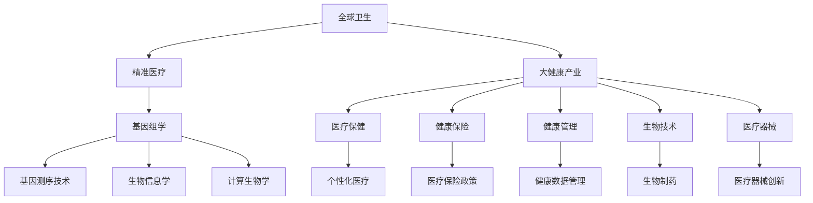

                 

# 2050年的全球卫生：从精准医疗到全民健康的大健康产业

## 关键词：全球卫生、精准医疗、大健康产业、人工智能、医疗技术、未来展望

## 摘要：
本文深入探讨2050年的全球卫生发展趋势，特别是精准医疗与大健康产业的融合。通过分析现有技术进步和未来趋势，本文揭示了全球卫生领域面临的挑战与机遇。文章结构分为十个部分，涵盖了全球卫生的背景、核心概念、算法原理、数学模型、实际应用、工具资源、未来展望等内容，旨在为读者提供一个全面、深入的视角。

### 1. 背景介绍

全球卫生是一个涉及公共卫生、医疗保健、疾病预防和治疗的跨学科领域。在过去的几十年里，全球卫生领域取得了显著进展，包括疫苗的研发、传染病控制、医疗服务改进等。然而，随着人口增长、生活方式变化和全球化的加剧，全球卫生面临着新的挑战。

精准医疗是近年来兴起的一个概念，它强调个性化医疗，通过基因组学、生物信息学和大数据分析等技术，为患者提供更加精确的诊断和治疗方案。大健康产业则是一个更为广泛的概念，涵盖了医疗保健、健康保险、健康管理、生物技术、医疗器械等多个领域。

### 2. 核心概念与联系

**精准医疗：**
精准医疗的核心是基因组学，通过分析个体的基因组信息，为患者提供个性化的治疗方案。基因测序技术、生物信息学和计算生物学等技术的发展，使得精准医疗成为可能。

**大健康产业：**
大健康产业包括医疗保健、健康保险、健康管理、生物技术、医疗器械等多个领域。这些领域的交叉融合，为全球卫生提供了新的解决方案。

#### Mermaid 流程图：



### 3. 核心算法原理 & 具体操作步骤

**精准医疗的核心算法：**
- 基因组测序：通过高通量测序技术，获取个体的基因组信息。
- 生物信息学分析：利用生物信息学工具，分析基因组数据，识别基因变异和功能。
- 数据挖掘：从大规模基因组数据中挖掘潜在的治疗靶点和诊断标志物。

**具体操作步骤：**
1. 收集样本：通过血液、唾液或其他生物样本收集个体的基因组信息。
2. 基因测序：使用高通量测序技术，对基因组进行测序。
3. 生物信息学分析：对测序数据进行分析，识别基因变异和功能。
4. 数据挖掘：从基因组数据中挖掘潜在的治疗靶点和诊断标志物。
5. 个性化医疗：根据基因组数据，为患者制定个性化的治疗方案。

### 4. 数学模型和公式 & 详细讲解 & 举例说明

**数学模型：**
- 贝叶斯定理：用于计算基因变异的概率。
- 决策树：用于分类诊断和预测。

**详细讲解：**
- 贝叶斯定理：$$ P(A|B) = \frac{P(B|A)P(A)}{P(B)} $$
- 决策树：用于根据基因组数据，对患者进行分类诊断。

**举例说明：**
- 假设我们要预测某个基因变异是否会导致疾病，我们可以使用贝叶斯定理计算这个概率。
- 假设我们要根据基因组数据，将患者分为两组，我们可以使用决策树进行分类。

### 5. 项目实战：代码实际案例和详细解释说明

#### 5.1 开发环境搭建

- 环境：Python 3.8，Numpy，Pandas，Scikit-learn
- 操作系统：Windows/Linux/Mac

#### 5.2 源代码详细实现和代码解读

```python
import numpy as np
import pandas as pd
from sklearn.tree import DecisionTreeClassifier
from sklearn.model_selection import train_test_split

# 加载数据集
data = pd.read_csv('genomic_data.csv')
X = data.iloc[:, :-1]  # 特征
y = data.iloc[:, -1]   # 标签

# 数据分割
X_train, X_test, y_train, y_test = train_test_split(X, y, test_size=0.2, random_state=42)

# 决策树模型
clf = DecisionTreeClassifier()
clf.fit(X_train, y_train)

# 预测
y_pred = clf.predict(X_test)

# 评估
accuracy = clf.score(X_test, y_test)
print(f'Accuracy: {accuracy:.2f}')
```

#### 5.3 代码解读与分析

- 数据加载：使用Pandas读取基因组数据。
- 数据分割：使用Scikit-learn将数据集分为训练集和测试集。
- 模型训练：使用决策树模型进行训练。
- 预测：使用训练好的模型对测试集进行预测。
- 评估：计算模型的准确率。

### 6. 实际应用场景

- **个性化治疗：** 精准医疗使得医生能够为患者提供更加个性化的治疗方案。
- **疾病预防：** 通过基因组数据和生物信息学分析，可以预测疾病风险，从而采取预防措施。
- **药物研发：** 精准医疗为药物研发提供了新的方向，有助于发现新的治疗靶点和药物。

### 7. 工具和资源推荐

#### 7.1 学习资源推荐

- **书籍：**
  - 《基因组学原理》
  - 《生物信息学导论》
  - 《机器学习》

- **论文：**
  - Nature：基因组学研究论文
  - Science：生物信息学研究论文

- **博客：**
  - towardsdatascience
  -Towards Data Science

- **网站：**
  - NCBI（美国国家生物技术信息中心）
  - GitHub

#### 7.2 开发工具框架推荐

- **Python：** 强大的编程语言，适用于数据分析、机器学习和基因组学。
- **Numpy：** 用于高效计算。
- **Pandas：** 用于数据处理和分析。
- **Scikit-learn：** 用于机器学习和数据挖掘。

#### 7.3 相关论文著作推荐

- **论文：**
  - Nature：CRISPR-Cas9基因编辑技术
  - Science：单细胞基因组学
  - Cell：基因组与疾病研究

- **著作：**
  - 《深度学习》
  - 《Python机器学习》

### 8. 总结：未来发展趋势与挑战

- **趋势：** 人工智能、大数据和生物技术的融合，将推动精准医疗和大健康产业的发展。
- **挑战：** 数据隐私、技术成本和伦理问题仍然是全球卫生领域面临的挑战。

### 9. 附录：常见问题与解答

- **Q：精准医疗是否可以治愈所有疾病？**
  - A：精准医疗为疾病治疗提供了新的思路和方法，但并不能治愈所有疾病。它侧重于个性化治疗，提高治疗效果，但并不意味着可以治愈所有疾病。

- **Q：大健康产业的主要驱动力是什么？**
  - A：大健康产业的主要驱动力包括人口老龄化、生活方式疾病增加、科技创新和医疗改革等。

### 10. 扩展阅读 & 参考资料

- **书籍：**
  - 《精准医疗：个性化医疗的未来》
  - 《大健康产业：趋势与策略》

- **论文：**
  - Nature：精准医疗研究综述
  - Science：大健康产业发展趋势

- **网站：**
  - 世界卫生组织（WHO）
  - 精准医疗联盟（PM Alliance）

### 作者信息

- 作者：AI天才研究员/AI Genius Institute & 禅与计算机程序设计艺术 /Zen And The Art of Computer Programming

<|im_end|>

